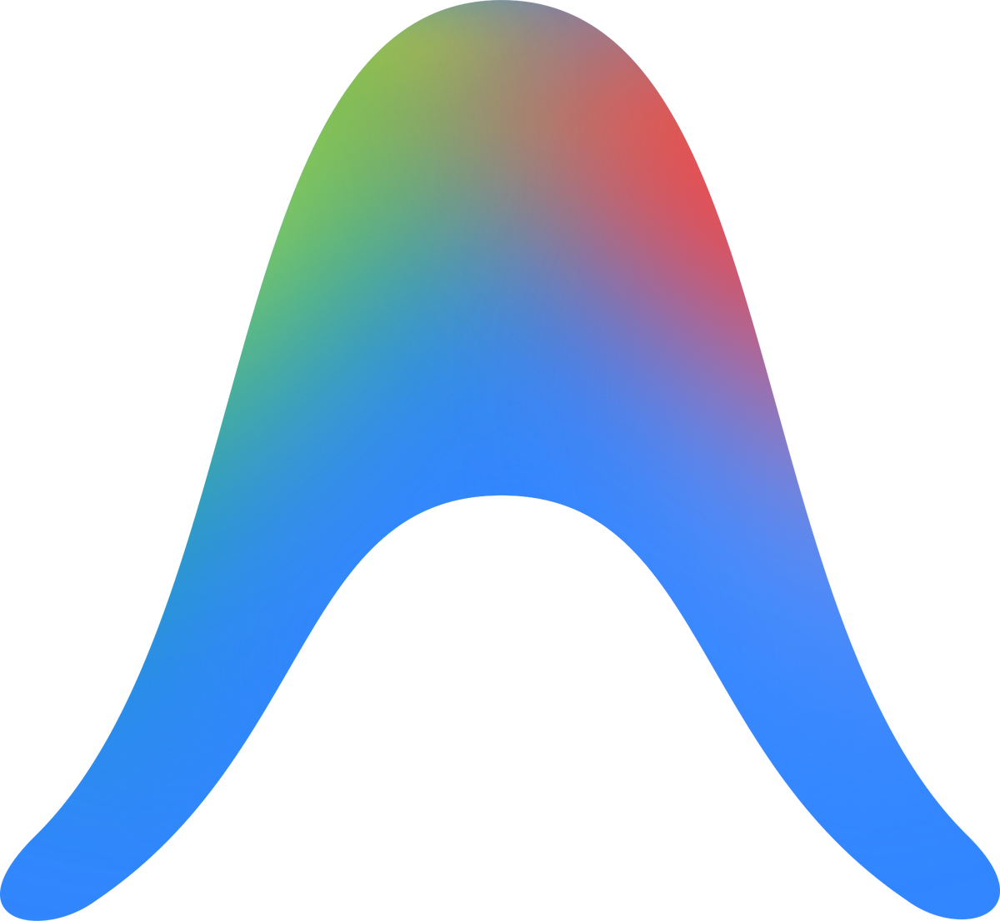
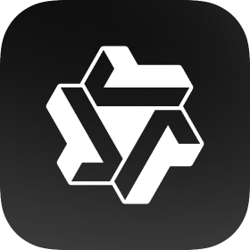
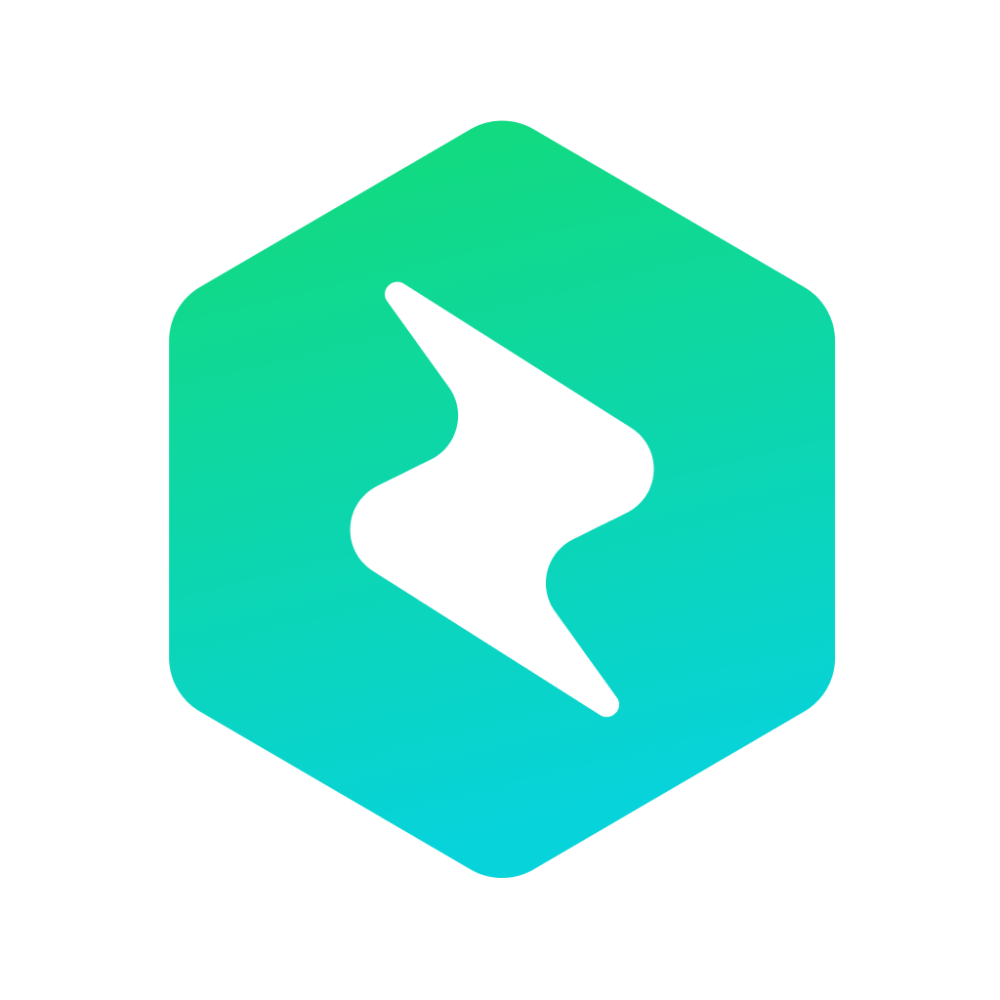
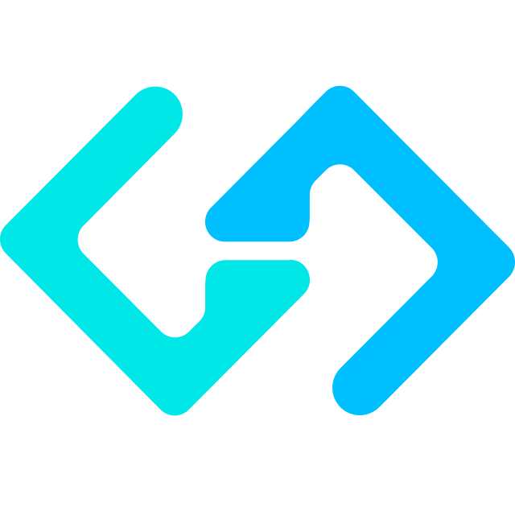
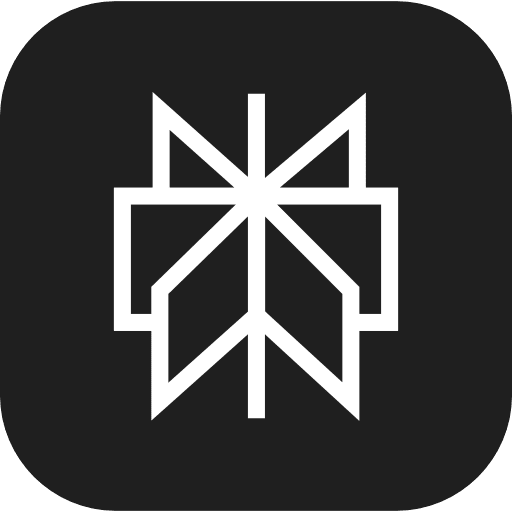

<h1>面向Agent编程</h1>

  
  
  
  
  

<blockquote>

🏗️ 重度实战踩坑：3 个月投入至少 2k RMB，做过大型项目分析与旧代码重构，深度尝试多种Agent和模型  
🎯 面向新手转型：帮助你告别「古法写码」，建立 AI 时代的开发方式  
⭐ 欢迎支持：教程制作不易，欢迎点个 Star  

</blockquote>

  <a href="./docs/chapters/ch01-quickstart.md">🚀 快速开始</a> ·
  <a href="#tutorial-contents">📚 教程目录</a> ·
  <a href="#why-learn-agent">💡 为什么是 Agent 时代</a> ·
  <a href="#reader-guide">🌱 新手路线</a>

  <a href="./docs/topics/topic-china-users.md">🪜 大陆用户</a> ·
  <a href="./docs/topics/topic-agent-tools-comparison.md">🤖 Agent 对比</a> ·
  <a href="./docs/topics/topic-model-comparison.md">🧠 模型对比</a> ·
  <a href="./docs/topics/topic-benchmarks.md">📊 评测体系</a>

---

## 📚 章节目录

> ⏱️ **关于时效性**：⚡ Agent 相关工具与方法更新频繁，教程会尽量按月更新，保持信息新鲜度。🔄

<table>
<tr>
<td width="55%" valign="top">

### 📖 系统章节

<table width="100%">
<tr>
<th width="6%" align="center">#</th>
<th width="48%">章节</th>
<th width="36%">你会学到</th>
<th width="10%" align="center">状态</th>
</tr>
<tr><td colspan="4"><strong>Part I · 🚀 起步篇</strong></td></tr>
<tr>
<td align="center">1</td>
<td><a href="./docs/chapters/ch01-quickstart.md">🚀 快速上手部署 Agent</a></td>
<td>安装 配置 跑通第一个闭环</td>
<td align="center">🔄</td>
</tr>
<tr>
<td align="center">2</td>
<td><a href="./docs/chapters/ch02-concepts.md">🧩 Agent 核心原理</a></td>
<td>Agent 四要素 TAO 循环 Memory · Tools · MCP</td>
<td align="center">🔄</td>
</tr>
<tr>
<td align="center">3</td>
<td><a href="./docs/chapters/ch03-glossary.md">📖 术语速查手册</a></td>
<td>LLM · Prompt · Context Token · Agent · API</td>
<td align="center">🔄</td>
</tr>
<tr><td colspan="4"><strong>Part II · 🎯 基础实战篇</strong></td></tr>
<tr>
<td align="center">4</td>
<td><a href="./docs/chapters/ch04-first-practice.md">🎮 你的第一批实战</a></td>
<td>Plan→Act · 理解仓库 Fix Bug · 写测试 CRUD · Git</td>
<td align="center">🔄</td>
</tr>
<tr>
<td align="center">5</td>
<td><a href="./docs/chapters/ch05-agent-mechanics.md">🔧 Agent 内部机制与工具体系</a></td>
<td>Agent 循环 五类工具 Session 与 Context</td>
<td align="center">🔄</td>
</tr>
<tr>
<td align="center">6</td>
<td><a href="./docs/chapters/ch06-explore-verify.md">🔍 代码探索与验证驱动</a></td>
<td>init CLAUDE.md 测试驱动 · Bug 修复 截图验证</td>
<td align="center">🔄</td>
</tr>
<tr>
<td align="center">7</td>
<td><a href="./docs/chapters/ch07-plan-prompt.md">📋 规划优先与 Prompt 工程</a></td>
<td>探索→规划→编码 Prompt 约束技巧 @引用</td>
<td align="center">🔄</td>
</tr>
<tr>
<td align="center">8</td>
<td><a href="./docs/chapters/ch08-config-session.md">⚙️ 扩展生态与会话管理</a></td>
<td>权限 MCP · Skills · Plugins clear/compact/resume</td>
<td align="center">🔄</td>
</tr>
<tr><td colspan="4"><strong>Part III · ⚙️ 方法论与认知篇</strong></td></tr>
<tr>
<td align="center">9</td>
<td><a href="./docs/chapters/ch09-engineering.md">🏗️ 工程化工作流</a></td>
<td>SDD 任务分解 三种协作模式</td>
<td align="center">🔄</td>
</tr>
<tr>
<td align="center">10</td>
<td><a href="./docs/chapters/ch10-collaboration.md">🤝 人机协同方法论</a></td>
<td>Harness 工程 · 上下文 失败模式 Token 经济学 · 成熟度</td>
<td align="center">🔄</td>
</tr>
<tr>
<td align="center">11</td>
<td><a href="./docs/chapters/ch11-design-patterns.md">🧬 Agent 设计模式</a></td>
<td>Router · Evaluator Planner-Worker · RAG Writer-Reviewer</td>
<td align="center">🔄</td>
</tr>
<tr>
<td align="center">12</td>
<td><a href="./docs/chapters/ch12-code-review.md">👁️ AI Code Review</a></td>
<td>Agent 审查工作流 GitHub Actions AI 幻觉避坑</td>
<td align="center">🔄</td>
</tr>
<tr>
<td align="center">13</td>
<td><a href="./docs/chapters/ch13-history.md">📜 技术发展简史</a></td>
<td>六阶段演进 · 产品大爆发 80% 翻转 · 职业冲击</td>
<td align="center">🔄</td>
</tr>
<tr><td colspan="4"><strong>Part V · 🏗️ 进阶实战篇</strong> </td></tr>
<tr>
<td align="center">—</td>
<td><a href="./docs/topics/topic-advanced-cases.md">🎬 复杂场景实战案例</a></td>
<td>完整 Agent 对话历史 多轮任务拆解 失败与恢复分析</td>
<td align="center">📝 规划中</td>
</tr>
</table>

<strong>Part VI · 🔭 趋势与展望 &nbsp; Part VII · 🧬 从零构建 Agent</strong>

<table width="100%">
<tr>
<th width="6%" align="center">#</th>
<th width="48%">章节</th>
<th width="36%">你会学到</th>
<th width="10%" align="center">状态</th>
</tr>
<tr><td colspan="4"><strong>Part VI · 🔭 趋势与展望</strong> </td></tr>
<tr>
<td align="center">—</td>
<td><a href="./docs/topics/topic-evolution.md">🔭 Agent 技术展望</a></td>
<td>职业影响 技术路线图 行业趋势</td>
<td align="center">📝 规划中</td>
</tr>
<tr><td colspan="4"><strong>Part VII · 🧬 从零构建你自己的 Agent</strong> </td></tr>
<tr>
<td align="center">—</td>
<td>🧬 Nano Agent 从零实现</td>
<td>ReAct 循环实现 工具调用机制 Memory 设计</td>
<td align="center">📝 规划中</td>
</tr>
</table>

</td>
<td width="45%" valign="top">

### 📚 进阶专题 

> 正文保持精简，深度内容统一收入此处。
> 新手第一遍可跳过，遇到具体问题时按需查阅。

**🧭 选型与环境配置**

| 专题 | 简介 |
|------|------|
| [🤖 Agent 工具横评](./docs/topics/topic-agent-tools-comparison.md) | 国际/国产/开源工具全面对比 |
| [🧠 模型横评](./docs/topics/topic-model-comparison.md) | 主流 Coding 模型对比与选型 |
| [📊 评测体系](./docs/topics/topic-benchmarks.md) | Benchmark 怎么读、怎么用 |
| [🖥️ CLI vs IDE 插件](./docs/topics/topic-cli-vs-ide.md) | 用哪种形态 |
| [🤖 Agent vs 代码补全](./docs/topics/topic-agent-vs-completion.md) | 和 Copilot 有什么本质区别 |
| [💰 API vs 订阅制](./docs/topics/topic-api-vs-subscription.md) | 怎么买最划算 |
| [🇨🇳 中国区用户指南](./docs/topics/topic-china-users.md) | 特殊环境配置 |

**🧠 核心技术原理**

| 专题 | 简介 |
|------|------|
| [⚡ Prompt Cache](./docs/topics/topic-prompt-cache.md) | 机制与优化策略 |
| [🧠 LLM 推理与 Agent](./docs/topics/topic-llm-reasoning-and-agent.md) | CoT/Reasoning 如何影响 Agent |
| [🧩 上下文工程](./docs/topics/topic-context-engineering.md) | WSCI 框架 · 上下文腐烂 |
| [🧠 Agent 记忆系统](./docs/topics/topic-memory-system.md) | 短期/长期记忆 · Agentic RAG |
| [🎨 多模态应用](./docs/topics/topic-multimodal.md) | 图片/截图/PDF 的应用 |
| [🧠 大模型幻觉问题](./docs/topics/topic-llm-hallucination.md) | 成因与缓解策略 |

**🔧 工具生态深入**

| 专题 | 简介 |
|------|------|
| [📝 Skill 系统](./docs/topics/topic-skills.md) | 完整指南 · 5 种设计模式 |
| [🔌 MCP 协议](./docs/topics/topic-mcp.md) | MCP 完整指南 |
| [🪝 Hooks](./docs/topics/topic-hooks.md) | Claude Code Hooks 机制 |
| [⚖️ CLI vs MCP](./docs/topics/topic-cli-vs-mcp.md) | 何时用 Shell 何时用 MCP |
| [📁 .claude 文件夹解析](./docs/topics/topic-claude-folder.md) | CLAUDE.md · rules · settings.json |

**🏗️ 架构与协作模式**

| 专题 | 简介 |
|------|------|
| [🧬 设计模式详解](./docs/topics/topic-design-patterns-detail.md) | 架构图 + 伪代码 + 完整实现 |
| [👥 多 Agent 组合](./docs/topics/topic-multi-agent.md) | Orchestrator · 上下文隔离 |
| [🐝 Swarm vs Team](./docs/topics/topic-swarm-vs-team.md) | 去中心化 vs 有协调者 |
| [🆚 Agent vs NoCode](./docs/topics/topic-agent-vs-nocode.md) | Agent 与 ComfyUI/Diffy 等的区别 |

**📐 方法论深入**

| 专题 | 简介 |
|------|------|
| [🎯 任务适配度](./docs/topics/topic-task-fit.md) | 哪些任务适合 Agent |
| [📊 Agent 能力矩阵](./docs/topics/topic-capability-matrix.md) | 各类任务的表现评级 |
| [💬 Prompt 模板库](./docs/topics/topic-prompt-templates.md) | 可复用的 Prompt 模板 |
| [🚨 失败模式](./docs/topics/topic-failure-modes.md) | 七种失败模式与恢复术 |
| [🏗️ 大型项目策略](./docs/topics/topic-large-project.md) | 大项目的 Agent 使用策略 |
| [🔄 Prompt→Harness](./docs/topics/topic-prompt-to-harness.md) | 演进案例 |

<strong>展开更多专题（安全与质量 · 对比与视野）</strong>

**🛡️ 安全与质量**

| 专题 | 简介 |
|------|------|
| [🤥 AI 幻觉避坑](./docs/topics/topic-ai-hallucination.md) | 检测与防御 |
| [🔒 安全权限合规](./docs/topics/topic-security.md) | 最小权限 · Agent 治理 |
| [🤝 人机协同详解](./docs/topics/topic-human-agent-collab.md) | 深度协作方法论 |

**🔭 对比与视野**

| 专题 | 简介 |
|------|------|
| [⚔️ Agent vs Claw](./docs/topics/topic-agent-vs-claw.md) | 两种范式对比 |
| [🔬 Agent-LLM 交互内幕](./docs/topics/topic-agent-llm-internals.md) | API 调用结构 · Agentic Loop |
| [📜 技术演进六阶段](./docs/topics/topic-agent-evolution.md) | 从 LLM 到 Agent OS |
| [📅 产品时间线](./docs/topics/topic-product-timeline.md) | 2020-2026 完整里程碑 |

</td>
</tr>
</table>

---

## 📝 关于本教程的几点说明

- 🔧 **工具说明**：本教程以 Claude Code（CLI + VS Code 插件）作为实操主线，但核心是可迁移的方法论：SDD、任务分解、上下文工程、验证闭环等思路，同样适用于 Cursor、Codex CLI、Gemini CLI 以及其他 Agent 工具 💡
- 🔄 **产品和模型都在快速变化**，教程内容定期校对，请以各厂商最新官方文档为准
- 📚 **前面章节正文保持精简**，深度内容统一收入 Part IV 进阶专题，新手第一遍可跳过
- 🎯 **所有技巧和方法论都来自实战**，非纸上谈兵

---

## 🚀 现在是时候告别「古法写码」了

> **Coding Agent** 不是更聪明的聊天框，而是一个能围绕你的目标去**读代码、规划步骤、调用工具、执行修改、再自己验证结果**的任务执行系统。
>
> 你关心的，不再只是"它能不能回答问题"，而是：「它能不能在真实项目里，和我一起把事情做完？」

- ⚡ **效率跃迁**：Agent 已经能覆盖读代码、改代码、写测试、跑验证这些高频研发动作。
- 🌱 **门槛下降**：零基础用户也更容易靠 Agent 搭出可运行的产品原型。
- 🔄 **分工改变**：你越来越像是在设计任务、边界和检查点，而不只是手写每一行代码。
- 🎯 **技能可迁移**：任务拆解、上下文管理、验证闭环这些能力，不会因为换一个工具就失效。

---

## 👩 如何在自己的电脑上安装部署并开始面向 Agent 编程

- **① 安装 Agent**：根据习惯选择形态——CLI 工具（如 Claude Code、Codex CLI）、VSCode 插件（如 Claude Code或Codex的VSCode插件）、AI 原生 IDE（如 Cursor、Trae）。
- **② 配置模型访问**：要么在 Agent 前端登录已购买订阅 Plan 的账户（如 Claude Pro、GPT Plus、Cursor Pro），要么在配置里填入官方或第三方购买的模型 API 的 base URL 和 API Key，即可接入任意支持的模型。
- **③ 跑通第一个任务**：打开项目目录，启动 Agent，开始对话。

> 📖 完整安装与配置流程 → [🚀 快速上手部署 Agent（第一章）](./docs/chapters/ch01-quickstart.md) · [大陆用户指南](./docs/topics/topic-china-users.md) · [API vs 订阅制](./docs/topics/topic-api-vs-subscription.md)

---

### 🛠️ 主流 Agent 工具一览

> 🌱 **新手提醒**：这一节的作用是帮你建立对市场的整体感觉，知道现在的 Agent 工具、模型、路线和生态有多活跃。你现在不用把它们全部搞懂，更不用全装一遍，先选 1-2 个顺手工具真正跑起来就够了。

**🇺🇸 国际主流 (Coding)**

<table>
  <tr>
    <td align="center" width="16%">
       
      <strong><a href="https://claude.com/product/claude-code">Claude Code</a></strong> 
      Anthropic · 代码代理口碑标杆
    </td>
    <td align="center" width="16%">
       
      <strong><a href="https://cursor.com">Cursor</a></strong> 
      Anysphere · AI 编辑器代表作
    </td>
    <td align="center" width="16%">
       
      <strong><a href="https://github.com/features/copilot">GitHub Copilot</a></strong> 
      GitHub · 助手 + Agent 双形态
    </td>
    <td align="center" width="16%">
       
      <strong><a href="https://github.com/openai/codex">Codex CLI</a></strong> 
      OpenAI · 开源终端代码代理
    </td>
    <td align="center" width="16%">
       
      <strong><a href="https://geminicli.com/">Gemini CLI</a></strong> 
      Google · 开源终端代理
    </td>
    <td align="center" width="16%">
       
      <strong><a href="https://antigravity.google/">Antigravity</a></strong> 
      Google · Agent-first 开发平台
    </td>
  </tr>
</table>

**🇨🇳 国产主流 (Coding)**

<table>
  <tr>
    <td align="center" width="16%">
       
      <strong><a href="https://lingma.aliyun.com/">通义灵码</a></strong> 
      阿里云 · 国内主流代码助手
    </td>
    <td align="center" width="16%">
       
      <strong><a href="https://www.trae.ai">Trae</a></strong> 
      字节跳动 · AI 原生 IDE
    </td>
    <td align="center" width="16%">
       
      <strong><a href="https://comate.baidu.com/">Baidu Comate</a></strong> 
      百度 · 工程向代码助手
    </td>
    <td align="center" width="16%">
       
      <strong><a href="https://codebuddy.tencent.com/">CodeBuddy</a></strong> 
      腾讯 · 一体化编码工具
    </td>
    <td align="center" width="16%">
       
      <strong><a href="https://kimi.ai/">Kimi Code</a></strong> 
      月之暗面 · 终端代码代理
    </td>
    <td align="center" width="16%">
       
      <strong><a href="https://www.huaweicloud.com/product/codeartssnap.html">CodeArts</a></strong> 
      华为云 · 企业研发智能体
    </td>
  </tr>
</table>

**🌐 开源生态 / 更多工具**

<table>
  <tr>
    <td align="center" width="16%">
       
      <strong><a href="https://opencode.ai">OpenCode</a></strong> 
      开源 · 全形态 Coding Agent
    </td>
    <td align="center" width="16%">
       
      <strong><a href="https://codegeex.cn/">CodeGeeX</a></strong> 
      智谱 · 多语言代码助手
    </td>
    <td align="center" width="16%">
       
      <strong><a href="https://github.com/paul-gauthier/aider">Aider</a></strong> 
      开源 · 终端结对编程
    </td>
    <td align="center" width="16%">
       
      <strong><a href="https://github.com/cline/cline">Cline</a></strong> 
      开源 · IDE 内自主代码代理
    </td>
    <td align="center" width="16%">
       
      <strong><a href="https://codeium.com/windsurf">Windsurf</a></strong> 
      Codeium · AI 原生 IDE
    </td>
    <td align="center" width="16%">
       
      <strong><a href="https://devin.ai/">Devin</a></strong> 
      Cognition · 云端自主软件工程师
    </td>
  </tr>
</table>

**🤖 通用 Agent / Claw 🦞 (非代码专精)**

<table>
  <tr>
    <td align="center" width="16%">
       
      <strong><a href="https://github.com/OpenClawAI/OpenClaw">OpenClaw</a></strong> 
      开源 · Skills 生态通用 Agent
    </td>
    <td align="center" width="16%">
       
      <strong><a href="https://manus.im/">Manus</a></strong> 
      通用 · 结果交付型 Agent
    </td>
    <td align="center" width="16%">
       
      <strong><a href="https://openai.com/">ChatGPT Tasks</a></strong> 
      OpenAI · 定时任务引擎
    </td>
    <td align="center" width="16%">
       
      <strong><a href="https://www.perplexity.ai/">Perplexity</a></strong> 
      实时检索 / 深度研究
    </td>
    <td align="center" width="16%">
       
      <strong><a href="https://kimi.moonshot.cn/">Kimi Agent</a></strong> 
      月之暗面 · 办公型通用 Agent
    </td>
    <td align="center" width="16%">
      🦞 
      <strong><a href="https://www.volcengine.com/">ArkClaw</a></strong> 
      火山引擎 · 云端 OpenClaw
    </td>
  </tr>
</table>

> 📖 深度阅读： [作者使用体验与心得](./docs/topics/topic-agent-tools-comparison.md) · [主流 Agent 工具横评](./docs/topics/topic-agent-tools-comparison.md)

### 🧠 主流 Coding 模型一览

> 🐎 **好马配好鞍**：优秀的 Agent 就像是一套精良的马具（Harness），但要真正搞定艰巨复杂的代码任务，你还需要一匹强健的「好马」——也就是底层驱动的大模型。以下是各家最新的旗舰模型：
>
> 💰 **价格说明**：下表按 **每 1M tokens 的输入 / 输出价格** 粗略列出 API 成本。优先采用官方公开价；若厂商未直接公开或没有统一官方 API 渠道，则使用主流托管价的近似值，并在价格前加 `约`。

**🇺🇸 国际模型**

| 模型 | 出品方 | 上下文 | API 价格（输入 / 输出） | 特色 |
|:---:|---|:---:|:---:|:---|
| **Claude Opus 4.6** | Anthropic | 1M | `$5 / $25` | 🏆 Anthropic 最强复杂任务，coding / agents 强项 |
| **GPT-5.4** | OpenAI | 1M | `$2.50 / $15` | ⚡ 官方主旗舰，面向 agentic、编码、专业工作流 |
| **Gemini 3.1 Pro** | Google | 1M | `$2-$4 / $12-$18` | 🌊 Google Gemini 3 系 Pro 线，支持 thinking、agentic workflows |
| **Llama 4 Maverick** | Meta | 10M | `约 $0.15 / $0.60` | 🦙 Meta 最新主力，原生多模态、MoE、超长上下文 |
| **nemotron-3-super** | NVIDIA | 1M | `约 $0.10 / $0.50` | ⚙️ NVIDIA 新一代主力，agentic / coding / tool calling 强 |
| **grok-code-fast** | xAI（X） | 256K | `约 $0.20 / $0.50` | 🛠️ xAI 官方 Code model，偏 agentic coding / pair programming |

**🇨🇳 国产模型**

| 模型 | 出品方 | 上下文 | API 价格（输入 / 输出） | 特色 |
|------|--------|--------|:---:|------|
| **Kimi K2.5** | 月之暗面 | 256K | `约 $0.45-$0.60 / $2.20-$3.00` | 🔥 当前最智能/最全能 Kimi 模型，原生多模态、thinking、多步工具使用 |
| **GLM-5** | 智谱 AI | 200K | `约 $0.72 / $2.30` | 🏛️ 智谱新一代旗舰基座，面向 Agentic Engineering、复杂系统工程、长程 Agent |
| **MiniMax-M2.7** | MiniMax | 200K | `约 $0.30 / $1.20` | 📏 当前最新 M 系旗舰，强调 real-world engineering / tool calling / search |
| **DeepSeek-V3.2** | 深度求索 | 128K | `$0.28 / $0.42` | 💰 reasoning-first for agents，支持 Thinking in Tool-Use，开源性价比标杆 |
| **Qwen3-Max** | 阿里云 | 256K | `约 $0.78-$1.00 / $3.00-$3.90` | 🌐 千问旗舰线，适合复杂多步骤任务，支持思考模式 + 内置工具 |

> 📖 深度阅读： [主流 Coding 模型横评](./docs/topics/topic-model-comparison.md) · [模型与 Agent 评测体系](./docs/topics/topic-benchmarks.md)
>
> ⚠️ **不要只看榜单**：公开排行榜很重要，但不等于长期真实体验。像 MiniMax 这类产品，榜单成绩很亮眼，并不自动代表你的工作流里就一定更省心；而且厂商普遍也会做 benchmark 定向优化。建议同时结合 `Google`、`Reddit`、`小红书`、`知乎`、`B 站` 上的真实反馈一起看。

---

## 🦞 赛博养虾 vs Agent编程

最近 OpenClaw 🦞火得一塌糊涂——但它们和 Claude Code 这种 Coding Agent 目前是有一些差异的。

| 维度 | 🔧 Coding Agent（如 Claude Code） | 🌐 通用 Agent（如 OpenClaw 🦞、Manus） |
| :---: | --- | --- |
| **🎯 定位** | 软件研发专用的协作工具 | 通用任务自动化助手 |
| **💬 交互模式** | 会话级，用完即停 | 7×24 常驻或按需启动 |
| **🔒 安全模型** | 最小权限 + 人工审批 | 需广泛系统权限 |
| **📦 部署复杂度** | 一行命令安装 | 通常需要更多配置 |

> 🎯 **核心结论**：你在 Coding Agent 中练就的任务拆解、工作流设计、验证方法，在通用 Agent 时代依然完全可迁移。

> 深入了解 Agent 与 Claw 范式的架构差异见 → [附录：Agent 与 Claw 范式深度对比](./docs/topics/topic-agent-vs-claw.md)

---

## 🎯 谁适合读这套教程？

本教程面向三类读者，各有推荐阅读路线：

### 🗺️ 推荐阅读路线

#### 👨‍💻 程序员 / 软件工程师
Ch01 → Ch02 → Ch04 → Part II 全部（Ch05-08）
→ Ch09 工程化工作流 → Ch10 人机协同 → Part IV Skill/MCP 专题
→ Part V 进阶实战

#### 📊 产品经理 / 技术管理者
Ch01 → Ch02 → Ch03 术语 → Ch04 → Ch13 技术简史 → Ch11 设计模式
→ Ch09 工程化工作流 → Ch12 Code Review → Part VI 趋势与展望

#### 🌱 零基础 / 非开发者
Ch01 → Ch02 → **Ch03 术语速查手册**（重点精读）→ Ch04 → Part II 全部（Ch05-08）
→ Ch09 工程化工作流 → Ch10 人机协同 → Part V 进阶实战

---

<strong>如果觉得有帮助，欢迎 Star 支持！</strong>

