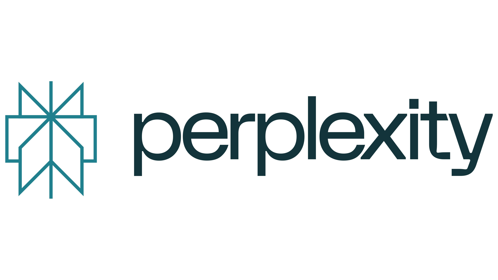
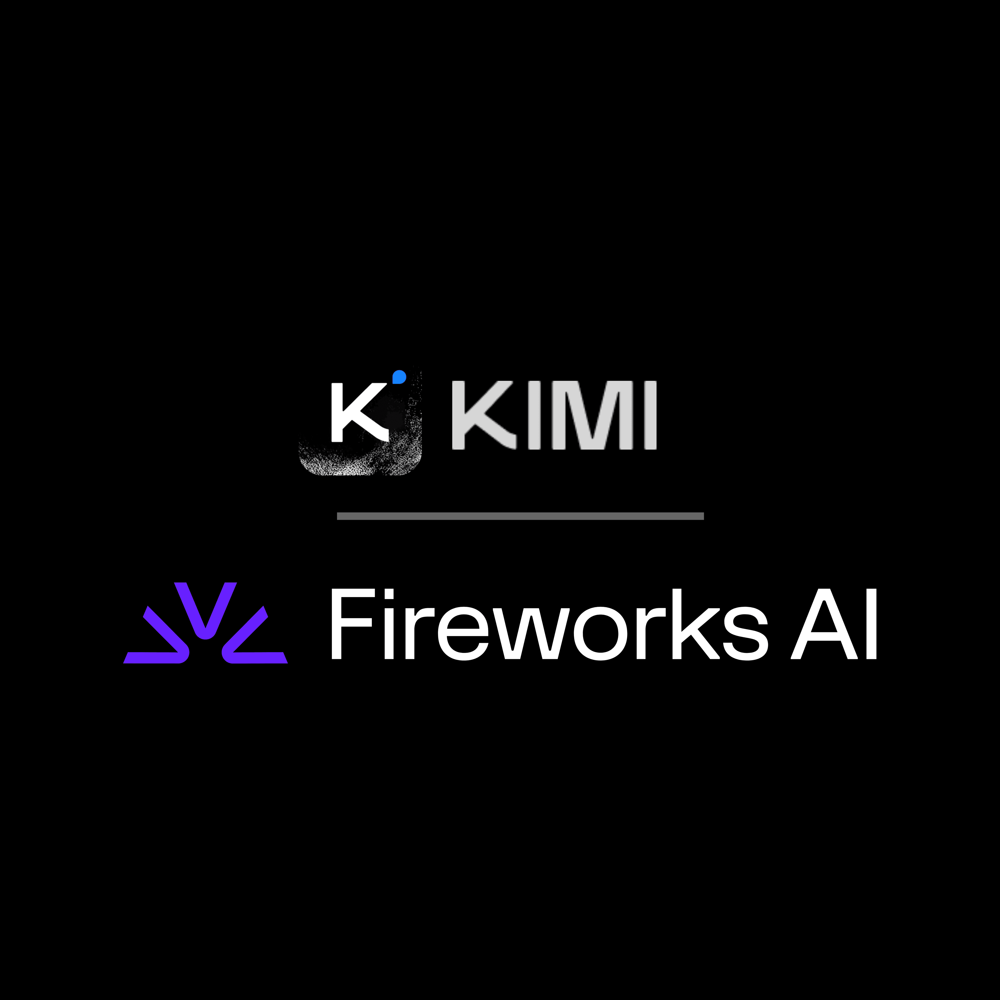

<div align="center">


<h1>Agentic Coding Tutorial</h1>

<h3>从「古法编程」升级到 Agent 时代</h3>

<p><strong>让 AI 变成你的日常结对程序员，而不是更聪明的搜索框。</strong></p>

<p>
  <a href="https://creativecommons.org/licenses/by-sa/4.0/">
    
  </a>
  <a href="https://github.com/zht043/AgenticCodingTutorial/pulls">
    
  </a>
  
  
  
</p>

<p>一套面向中文开发者的 <strong>Agentic Coding</strong> 系统教程</p>

<p>帮你在 <strong>Agent 工具飞速轮换的时代，掌握一套不会过时的心智模型与实战方法</strong></p>

<blockquote>

💡 <strong>作者寄语</strong>

🧪 **踩坑无数** — 已花费至少 3k 人民币，试过各种技巧、Skill 和 Agent 组合  
🔧 **深度实战** — 深度使用过 5 种以上的 Agent 和 10 种以上的模型  
🏗️ **项目验证** — 完成过大型项目的分析和复杂特性的重构  
⚡ **快速验证** — 常用 Agent 快速实现 Idea 的 Prototype  
🎯 **核心目标** — 帮助新手告别「古法写码」，拥抱 AI 时代的变革  
⭐ **跪求 Star** — 制作不易，如果觉得有帮助，欢迎点亮 Star 支持！

</blockquote>

<blockquote>

⏱️ <strong>时效性声明</strong>

⚡ **技术迭代快** — Agent 技术发展与更新极快，教程内容的时效性值得关注  
📅 **内容截止** — 当前教程内容同步至 <strong>2026-03-20</strong>  
🔄 **月度更新** — 小编会保持月度更新，持续同步最新的工具与方法  
🔔 **敬请关注** — 欢迎 Watch 本仓库，第一时间获取行业动态更新

</blockquote>

<p>
  <a href="./docs/ch01-quickstart/part-1-quickstart.md">🚀 立即部署 Agent</a> ·
  <a href="#-章节目录">📚 教程目录</a> ·
  <a href="#-什么是-coding-agent">💡 什么是 Coding Agent</a> ·
  <a href="#-谁适合读这套教程">👥 读者指南</a>
</p>

</div>

---

## 📌 三句话说清楚这套教程

> 🚀 **快速上手** — 30 分钟跑通一个能改你项目代码的 Agent
>
> 🧩 **系统理解** — 从核心概念到工程方法论，从 Skill 系统到安全合规，建立完整知识体系
>
> 🎯 **实战驱动** — 基础案例 → 进阶案例 → Claude Code / Codex 深度指南，可复制的工作流

---

## 🛠️ 主流 Agent 工具一览

> 💡 **排版说明**：为了更紧凑的阅读体验，我们将工具分为四类，每类精选代表性产品。

**🇺🇸 国际主流 (Coding)**

<table>
  <tr>
    <td align="center" width="16%">
      <br />
      <strong><a href="https://claude.com/product/claude-code">Claude Code</a></strong><br />
      <sub>Anthropic · 行业标杆</sub>
    </td>
    <td align="center" width="16%">
      <br />
      <strong><a href="https://cursor.com">Cursor</a></strong><br />
      <sub>Anysphere · 最流行 IDE</sub>
    </td>
    <td align="center" width="16%">
      <br />
      <strong><a href="https://github.com/features/copilot">GitHub Copilot</a></strong><br />
      <sub>GitHub · 自动领 Issue</sub>
    </td>
    <td align="center" width="16%">
      <br />
      <strong><a href="https://github.com/openai/codex">Codex CLI</a></strong><br />
      <sub>OpenAI · 开源终端</sub>
    </td>
    <td align="center" width="16%">
      <br />
      <strong><a href="https://geminicli.com/">Gemini CLI</a></strong><br />
      <sub>Google · 1M 上下文</sub>
    </td>
    <td align="center" width="16%">
      <br />
      <strong><a href="https://antigravity.google/">Antigravity</a></strong><br />
      <sub>Google · 全栈应用开发</sub>
    </td>
  </tr>
</table>

**🇨🇳 国产主流 (Coding)**

<table>
  <tr>
    <td align="center" width="16%">
      <br />
      <strong><a href="https://lingma.aliyun.com/">通义灵码</a></strong><br />
      <sub>阿里云 · 插件下载破千万</sub>
    </td>
    <td align="center" width="16%">
      <br />
      <strong><a href="https://www.trae.ai">Trae</a></strong><br />
      <sub>字节跳动 · 10x AI Engineer</sub>
    </td>
    <td align="center" width="16%">
      <br />
      <strong><a href="https://comate.baidu.com/">Baidu Comate</a></strong><br />
      <sub>百度 · 3.5S 多智能体架构</sub>
    </td>
    <td align="center" width="16%">
      <br />
      <strong><a href="https://codebuddy.tencent.com/">CodeBuddy</a></strong><br />
      <sub>腾讯 · 企微生态深度打通</sub>
    </td>
    <td align="center" width="16%">
      <br />
      <strong><a href="https://kimi.ai/">Kimi Code</a></strong><br />
      <sub>月之暗面 · 视觉编程最强</sub>
    </td>
    <td align="center" width="16%">
      <br />
      <strong><a href="https://www.huaweicloud.com/product/codeartssnap.html">CodeArts</a></strong><br />
      <sub>华为 · 自动驾驶式研发</sub>
    </td>
  </tr>
</table>

**🌐 开源生态 / 更多工具**

<table>
  <tr>
    <td align="center" width="16%">
      <br />
      <strong><a href="https://opencode.ai">OpenCode</a></strong><br />
      <sub>多模型接入全形态覆盖</sub>
    </td>
    <td align="center" width="16%">
      <br />
      <strong><a href="https://codegeex.cn/">CodeGeeX</a></strong><br />
      <sub>智谱 · 免费开源代码助手</sub>
    </td>
    <td align="center" width="16%">
      <br />
      <strong><a href="https://github.com/paul-gauthier/aider">Aider</a></strong><br />
      <sub>开源 · 终端 AI 结对编程</sub>
    </td>
    <td align="center" width="16%">
      <br />
      <strong><a href="https://github.com/cline/cline">Cline</a></strong><br />
      <sub>开源 · VS Code AI 助手</sub>
    </td>
    <td align="center" width="16%">
      <br />
      <strong><a href="https://codeium.com/windsurf">Windsurf</a></strong><br />
      <sub>Codeium · AI 原生 IDE</sub>
    </td>
    <td align="center" width="16%">
      <br />
      <strong><a href="https://devin.ai/">Devin</a></strong><br />
      <sub>Cognition · 自主 AI 工程师</sub>
    </td>
  </tr>
</table>

**🤖 通用 Agent / Claw 🦞 (非代码专精)**

<table>
  <tr>
    <td align="center" width="16%">
      <br />
      <strong><a href="https://github.com/OpenClawAI/OpenClaw">OpenClaw</a></strong><br />
      <sub>开源 · 通用 Agent 标杆</sub>
    </td>
    <td align="center" width="16%">
      <br />
      <strong><a href="https://manus.im/">Manus</a></strong><br />
      <sub>通用 Agent 标杆</sub>
    </td>
    <td align="center" width="16%">
      <br />
      <strong><a href="https://openai.com/">ChatGPT Tasks</a></strong><br />
      <sub>OpenAI · 任务执行引擎</sub>
    </td>
    <td align="center" width="16%">
      <br />
      <strong><a href="https://www.perplexity.ai/">Perplexity</a></strong><br />
      <sub>深度研究与信息整合</sub>
    </td>
    <td align="center" width="16%">
      <br />
      <strong><a href="https://kimi.moonshot.cn/">Kimi Agent</a></strong><br />
      <sub>月之暗面 · 办公三件套</sub>
    </td>
    <td align="center" width="16%">
      <br />
      <strong><a href="https://www.volcengine.com/">ArkClaw</a></strong><br />
      <sub>字节 · 飞书生态云端 Agent</sub>
    </td>
  </tr>
</table>

> 📖 更多工具（Windsurf、Devin、Aider、Cline 等）及详细对比见 → [附录：Agent 工具与模型详细对比](./docs/ch01-quickstart/reference-tools-comparison.md)

## 🧠 主流 Coding 模型一览

> 🐎 **好马配好鞍**：优秀的 Agent 就像是一套精良的马具（Harness），但要真正搞定艰巨复杂的代码任务，你还需要一匹强健的「好马」——也就是底层驱动的大模型。以下是各家最新的旗舰模型：

**🇺🇸 国际模型**

| 模型 | 出品方 | 上下文 | 特色 |
|------|--------|--------|------|
| **GPT-5.4 Pro** | OpenAI | 1M | ⚡ 当前官方主旗舰，面向 agentic、编码、专业工作流，支持 computer use / tool search |
| **Claude Opus 4.6** | Anthropic | 1M | 🏆 Anthropic 当前最强复杂任务模型，coding / reasoning / agents 强项 |
| **Gemini 3.1 Pro (Preview)** | Google | 1M | 🌊 Google 当前 Gemini 3 系 Pro 线，支持 thinking、agentic workflows、复杂多模态推理 |

**🇨🇳 国产模型**

| 模型 | 出品方 | 上下文 | 特色 |
|------|--------|--------|------|
| **DeepSeek-V3.2** | 深度求索 | 128K | 💰 reasoning-first for agents，支持 Thinking in Tool-Use，开源性价比标杆 |
| **Kimi K2.5** | 月之暗面 | 256K | 🔥 当前最智能/最全能 Kimi 模型，原生多模态、thinking、多步工具使用 |
| **Qwen3-Max** | 阿里云 | 256K | 🌐 千问旗舰线，适合复杂多步骤任务，支持思考模式 + 内置工具 |
| **MiniMax-M2.7** | MiniMax | 200K | 📏 当前最新 M 系旗舰，强调 real-world engineering / tool calling / search |
| **GLM-5** | 智谱 AI | 200K | 🏛️ 智谱新一代旗舰基座，面向 Agentic Engineering、复杂系统工程、长程 Agent |

> 📊 详细 benchmark 与价格对比见 → [附录：模型与 Agent 评测体系详解](./docs/ch01-quickstart/reference-benchmarks.md)

---

## 🤖 什么是 Coding Agent？

**Coding Agent 是能自主读代码、写代码、跑测试、修 Bug 的 AI 系统。** 它不是更聪明的聊天框，而是一个围绕大模型构建的任务执行系统——拥有记忆、工具、规划能力，能在你的项目里完成真实的工程任务。

```
你："帮我重构这个模块，加上单元测试"

Agent：读代码 → 理解结构 → 规划方案 → 逐步重构 → 写测试 → 跑测试 → 修失败 → 全部通过 → 提交
```

它关心的核心问题是：

> 「如何设计流程、分工和检查点，让你和 Agent **一起**高效完成工作？」

### 💡 为什么现在要学 Agent？

- ⚡ **效率跃迁**：经验丰富的开发者报告 2-5x 的生产力提升，部分场景甚至更多
- 🌱 **门槛重塑**：没有编程经验的人也可以用 Agent 构建真实产品——"一人创业公司"已经出现
- 🔄 **行业变革**：Agent 正在重塑软件开发的分工模式——你不再只是写代码的人，而是指挥 AI 团队的技术负责人
- 🎯 **通用技能**：与 Agent 协作的能力（任务拆解、工作流设计、验证策略）是跨工具、跨时代的通用技能

### 🔀 Coding Agent vs 通用 Agent（Manus / OpenClaw 🦞）

本教程聚焦 **Coding Agent**（Claude Code、Codex CLI、Cursor 等）。你可能也听说过 Manus、OpenClaw 🦞 这些通用 Agent——它们能力很强，但解决的是不同的问题：

| 维度 | 🔧 Coding Agent（如 Claude Code） | 🌐 通用 Agent（如 OpenClaw 🦞、Manus） |
| :---: | --- | --- |
| **🎯 定位** | 软件研发专用的协作工具 | 通用任务自动化助手 |
| **💬 交互模式** | 会话级，用完即停 | 7×24 常驻或按需启动 |
| **🔒 安全模型** | 最小权限 + 人工审批 | 需广泛系统权限 |
| **📦 部署复杂度** | 一行命令安装 | 通常需要更多配置 |

> 🎯 **核心结论**：你在 Coding Agent 中练就的任务拆解、工作流设计、验证方法，在通用 Agent 时代依然完全可迁移。

> 深入了解 Agent 与 Claw 范式的架构差异见 → [附录：Agent 与 Claw 范式深度对比](./docs/reference-agent-vs-claw.md)

---


## 📚 章节目录

<table>
  <tr>
    <th width="5%">#</th>
    <th width="30%">章节</th>
    <th width="45%">你会学到</th>
    <th width="10%">状态</th>
    <th width="10%">Reference</th>
  </tr>
  <tr>
    <td align="center">1</td>
    <td>🚀 <a href="./docs/ch01-quickstart/part-1-quickstart.md"><strong>快速上手部署 Agent</strong></a></td>
    <td>环境配置 → 工具安装 → 跑通第一个「让 Agent 改真实代码」的闭环</td>
    <td></td>
    <td>
      <sub><a href="./docs/ch01-quickstart/reference-tools-comparison.md">工具对比</a> · <a href="./docs/ch01-quickstart/reference-benchmarks.md">模型评测</a> · <a href="./docs/ch01-quickstart/reference-api-config.md">API 配置</a> · <a href="./docs/ch01-quickstart/reference-cli-ide-app.md">CLI/IDE/App</a></sub>
    </td>
  </tr>
  <tr>
    <td align="center">2</td>
    <td>🧩 <a href="./docs/ch02-concepts/part-2-concepts.md"><strong>Agent 核心概念</strong></a></td>
    <td>Agent 四要素 · Think-Act-Observe 循环 · Memory · Tools/MCP/Skills 概览 · Planning</td>
    <td></td>
    <td>
      <sub><a href="./docs/ch02-concepts/reference-agent-llm-internals.md">交互解剖</a> · <a href="./docs/ch02-concepts/reference-memory-and-context.md">Memory 详解</a> · <a href="./docs/ch02-concepts/reference-mcp-and-skills.md">MCP/Skills</a></sub>
    </td>
  </tr>
  <tr>
    <td align="center">3</td>
    <td>📜 <a href="./docs/ch03-history/part-3-history.md"><strong>Agent 技术发展简史</strong></a></td>
    <td><sub>🔜 规划中</sub></td>
    <td></td>
    <td>
      <sub><a href="./docs/ch02-concepts/reference-agent-evolution.md">演进详解</a></sub>
    </td>
  </tr>
  <tr>
    <td align="center">4</td>
    <td>⚙️ <a href="./docs/ch04-engineering/part-4-engineering.md"><strong>Agent 驱动的软件工程工作流</strong></a></td>
    <td><sub>🔜 规划中</sub></td>
    <td></td>
    <td>
      <sub><a href="./docs/ch04-engineering/reference-task-capability-matrix.md">任务能力矩阵</a></sub>
    </td>
  </tr>
  <tr>
    <td align="center">5</td>
    <td>🤝 <a href="./docs/ch05-collaboration/part-5-collaboration.md"><strong>人机协同方法论</strong></a></td>
    <td><sub>🔜 规划中</sub></td>
    <td></td>
    <td>
      <sub><a href="./docs/ch02-concepts/reference-human-agent-collaboration.md">协同详解</a></sub>
    </td>
  </tr>
  <tr>
    <td align="center">6</td>
    <td>🎮 <a href="./docs/ch06-basic-cases/part-6-basic-cases.md"><strong>基础实战案例</strong></a></td>
    <td>代码理解 · Bug 修复 · 测试补全 · 文档生成 · 小型功能开发 · Superpowers 框架</td>
    <td></td>
    <td><sub>—</sub></td>
  </tr>
  <tr>
    <td align="center">7</td>
    <td>🧰 <a href="./docs/ch07-skills/part-7-skills.md"><strong>Skill 系统</strong></a></td>
    <td>Skill 原理与哲学 · 明星 Skill 推荐（Superpowers 等）· 教 Agent 自己写 Skill</td>
    <td></td>
    <td>
      <sub><a href="./docs/ch07-skills/reference-skill-advanced.md">进阶开发</a></sub>
    </td>
  </tr>
  <tr>
    <td align="center">8</td>
    <td>🔌 <a href="./docs/ch08-mcp/part-8-mcp.md"><strong>MCP 协议</strong></a></td>
    <td><sub>🔜 规划中</sub></td>
    <td></td>
    <td>
      <sub><a href="./docs/ch02-concepts/reference-mcp-and-skills.md">MCP/Skills 详解</a></sub>
    </td>
  </tr>
  <tr>
    <td align="center">9</td>
    <td>🟠 <a href="./docs/ch09-claude-code/part-9-claude-code.md"><strong>Claude Code 深度使用指南</strong></a></td>
    <td><sub>🔜 规划中</sub></td>
    <td></td>
    <td><sub>—</sub></td>
  </tr>
  <tr>
    <td align="center">10</td>
    <td>🟢 <a href="./docs/ch10-codex/part-10-codex.md"><strong>Codex CLI 深度使用指南</strong></a></td>
    <td><sub>🔜 规划中</sub></td>
    <td></td>
    <td><sub>—</sub></td>
  </tr>
  <tr>
    <td align="center">11</td>
    <td>👥 <a href="./docs/ch11-multi-agent/part-11-multi-agent.md"><strong>多 Agent 协作</strong></a></td>
    <td><sub>🔜 规划中</sub></td>
    <td></td>
    <td><sub>—</sub></td>
  </tr>
  <tr>
    <td align="center">12</td>
    <td>🛡️ <a href="./docs/ch12-security/part-12-security.md"><strong>信任边界 — Agent 安全、权限与合规</strong></a></td>
    <td><sub>🔜 规划中</sub></td>
    <td></td>
    <td><sub>—</sub></td>
  </tr>
  <tr>
    <td align="center">13</td>
    <td>🏗️ <a href="./docs/ch13-advanced-cases/part-13-advanced-cases.md"><strong>进阶实战案例</strong></a></td>
    <td><sub>🔜 规划中</sub></td>
    <td></td>
    <td><sub>—</sub></td>
  </tr>
  <tr>
    <td align="center">14</td>
    <td>🔭 <a href="./docs/ch14-evolution/part-14-evolution.md"><strong>Agent 技术发展脉络</strong></a></td>
    <td><sub>🔜 规划中</sub></td>
    <td></td>
    <td>
      <sub><a href="./docs/reference-agent-vs-claw.md">Agent vs Claw</a></sub>
    </td>
  </tr>
  <tr>
    <td align="center">15</td>
    <td>🧬 <a href="./docs/ch15-build-agent/part-15-build-agent.md"><strong>设计与开发你自己的 Agent</strong></a></td>
    <td><sub>🔜 规划中</sub></td>
    <td></td>
    <td><sub>—</sub></td>
  </tr>
</table>

> 📖 **Reference 文档说明**：每章附有深度参考文档（附录），提供更详细的技术解析和扩展阅读。**新手第一遍阅读可以跳过 Reference**，专注正文即可；有经验的读者或好奇心强的推荐深读。

---

## 🎯 谁适合读这套教程？

本教程面向三类读者，各有推荐阅读路线：

### 👨‍💻 程序员 / 软件工程师

你已经会写代码，想学会高效使用 Agent 提升生产力。

**推荐路线**：Ch01 快速上手 → Ch02 核心概念 → Ch05 人机协同 → Ch06 基础案例 → Ch07-Ch08 Skill/MCP → Ch09 Claude Code 深度指南 → Ch11 多 Agent → Ch13 进阶案例

### 📊 产品经理 / 技术管理者

你需要理解 Agent 的能力边界，评估它对团队和产品的影响。

**推荐路线**：Ch01 快速上手 → Ch02 核心概念 → Ch03 技术简史 → Ch04 工程工作流（了解 Agent 能介入哪些环节）→ Ch12 安全合规 → Ch14 发展脉络

### 🌱 零基础 / 非开发者

你没有编程经验，但想用 Agent 来写代码或构建产品。

**推荐路线**：Ch01 快速上手 → Ch02 核心概念 → Ch04 工程工作流（同时是软件开发入门）→ Ch05 人机协同 → Ch06 基础案例 → Ch09 Claude Code 指南

---

## 📝 关于本教程的几点说明

- 🔧 **以 Claude Code 为主线**，约束篇幅。其它 Agent（Codex CLI、Cursor 等）的用法与它大同小异，核心方法论是相通的
- 🔄 **产品和模型都在快速变化**，教程内容定期校对，但请以各厂商最新官方文档为准
- 📖 **每个章节都附有 Reference 文档**——新手第一遍可以跳过，有经验的读者或好奇心强的推荐深读
- 🎯 **所有技巧和方法论都来自实战**，非纸上谈兵

---

## ⚠️ 新手常见思维误区

| 误区 | 现实 |
| --- | --- |
| ❌「Agent 就是更聪明的 ChatGPT」 | ✅ Agent = LLM + 工具 + 记忆 + 规划循环。它会自己动手改代码、跑测试、修 bug |
| ❌「提示词是核心技能」 | ✅ 真正重要的是**任务拆解**——把大目标拆成小步骤，设好检查点 |
| ❌「Agent 能力 = 模型能力」 | ✅ Agent 表现 = 模型能力 × 上下文质量 × 任务结构清晰度。后两项在你手中 |
| ❌「工具/插件越多越好」 | ✅ 工具太多让 Agent 决策混乱、上下文膨胀。Less is More |
| ❌「全自动 = 高效」 | ✅ 半自主模式（Agent 规划执行 + 关键节点你审批）才是当前最高效的模式 |

---

## 🧰 Agent Skills 资源推荐

> 💡 Skill 是 Agent 时代的"方法论手册"——把经验沉淀为可复用的工作流模板。详见 [Ch07 · Skill 系统](./docs/ch07-skills/part-7-skills.md)。

| 项目 | 说明 |
|------|------|
| **[zht043/AgentSkills](https://github.com/zht043/AgentSkills)** | 笔者个人维护的 Skills 集合，包含实际项目中沉淀的工作流和最佳实践 |
| **[obra/superpowers](https://github.com/obra/superpowers)** | 社区知名 Skills 框架，强调从 brainstorm 到执行审查的完整闭环 |
| **[anthropics/skills](https://github.com/anthropics/skills)** | Anthropic 官方 Skills 仓库，包含示例模板和参考实现 |
| **[VoltAgent/awesome-agent-skills](https://github.com/VoltAgent/awesome-agent-skills)** | 持续维护的 Agent Skills 资源列表，适合生态摸底和选型 |

```bash
# 安装示例（Claude Code）
git clone https://github.com/obra/superpowers ~/.claude/skills/superpowers
```


---

<div align="center">

<p><strong>如果觉得有帮助，欢迎 Star 支持！</strong></p>

<p>Made with care for Chinese developers in the Agent era.</p>

</div>
