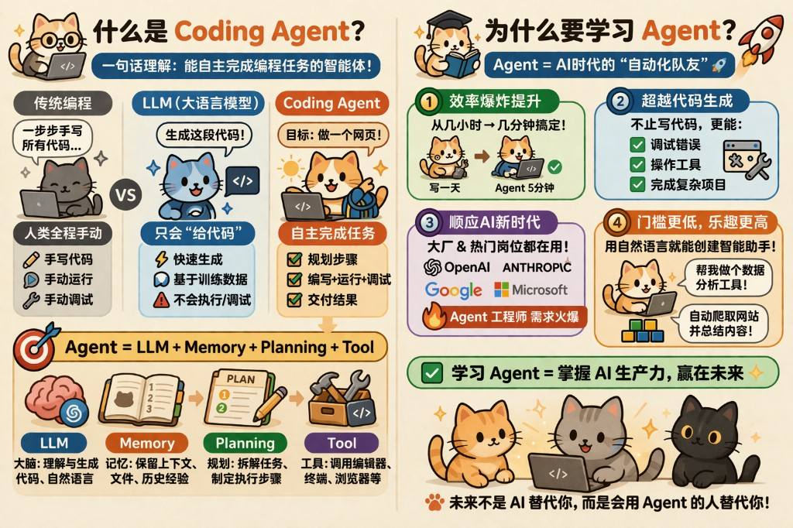

<h1>面向 Agent 编程</h1>

  
  
  
  
  

<blockquote>

🏗️ 重度实战踩坑：3 个月投入至少 2k RMB，做过大型项目分析与旧代码重构，深度尝试多种Agent和模型  
🎯 面向新手转型：帮助你告别「古法写码」，建立 AI 时代的开发方式  
⭐ 欢迎支持：教程制作不易，**欢迎点个 Star**  

</blockquote>

  <a href=”./docs/chapters/ch01-quickstart.md”>🚀 从第 1 章开始</a> ·
  <a href=”#tutorial-contents”>📚 教程目录</a> ·
  <a href=”#reader-guide”>🌱 新手路线</a> ·
  <a href=”#recommended-resources”>🔗 推荐资源</a>

---

### ✨ 一句话先讲透

> **AI Agent 时代，手写代码的重要性在下降，定义问题、组织上下文、验证结果和驾驭 Agent 的重要性在上升。**
>
> 真正拉开差距的，不是谁写得更快，而是谁更懂原理、更会拆任务、更会搭控制面，也更懂得什么时候该让 Agent 自治，什么时候该收回人工裁决。

## 📚 教程目录

> ⏱️ **关于时效性**：Agent 相关工具、模型和工作流变化很快。本教程会持续按月整理，但涉及产品、模型和协议的部分，仍建议以官方文档和最新版本为准。

### Part I · 🚀 快速开始

| # | 章节 | 你会学到 | 状态 |
|---|---|---|---|
| 1 | [🚀 快速开始](./docs/chapters/ch01-quickstart.md) | 先装什么、怎么跑通第一轮闭环、如何避免一上来就把环境搞复杂 | ✅  |
| 2 | [🎮 Agent 入门实战](./docs/chapters/ch02-agent-first-practice.md) | 用基础实验和真实仓库小任务，先建立对 Agent 的第一批信任 | ✅  |
| 3 | [⚙️ 配置使用第一个：MCP、Skill、Hook、Plugin、Command](./docs/chapters/ch03-first-extension-setup.md) | 先把规则、会话、扩展三层分清，再装第一批真正值得上的能力与手动入口 | ✅  |
| 4 | [🟠 Claude Code 实用技巧](./docs/chapters/ch04-claude-code-tips.md) | Claude Code 的最小工作流、权限模式、CLAUDE.md 和长期高 ROI 用法 | ✅  |
| 5 | [🟢 Codex 实用技巧](./docs/chapters/ch05-codex-tips.md) | Codex 的终端协作心智、AGENTS.md、隔离执行与审查感 | ✅  |

### Part II · 🧠 解剖 Agent 的原理与机制

| # | 章节 | 你会学到 | 状态 |
|---|---|---|---|
| 6 | [📖 基础概念与术语](./docs/chapters/ch06-glossary.md) | Token、Prompt、Context、Session、KV Cache、MCP / Skill / Hook / Plugin / Command 等基础词汇随查随用 | ✅ |
| 7 | [🧠 从 LLM 到 Agent](./docs/chapters/ch07-llm-to-agent.md) | 开环与闭环、Augmented LLM、为什么 Agent 不是聊天框升级版 | ✅ |
| 8 | [🧩 Agent = Model + Harness = LLM + Planning + Memory + Tools](./docs/chapters/ch08-agent-formula.md) | 用一章建立 Agent 的总公式，把模型、规划、记忆、工具和控制面一次讲透 | ✅ |
| 9 | [🧠 LLM 推理基础](./docs/chapters/ch09-llm-reasoning-basics.md) | 概率性、采样、CoT、为什么”会想”不等于”可靠” | ✅ |
| 10 | [📋 Planning](./docs/chapters/ch10-planning.md) | Spec、任务分解、停止条件、ReAct 与 Reflection 各自解决什么 | ✅ |
| 11 | [💾 Memory](./docs/chapters/ch11-memory-context-harness.md) | 短期记忆、长期记忆、RAG、状态管理和上下文衰减 | ✅ |
| 12 | [🛠️ Tools](./docs/chapters/ch12-tools.md) | Tool Use、Function Calling、CLI 与工具栈分层、能力边界 | ✅ |
| 13 | [📝 Skill](./docs/chapters/ch13-skill.md) | Skill 的原理、触发机制、渐进加载、路由与开发 | ✅ |
| 13.a | [🦸 Skill 案例：Superpowers](./docs/chapters/ch13a-skill-superpowers.md) | Superpowers 的设计哲学、7 阶段工作流与核心 Skill 拆解 | ✅ |
| 13.b | [🔨 Skill 案例：Official Skill Creator](./docs/chapters/ch13b-skill-creator.md) | Anthropic 官方 Skill Creator 的原理与使用 | ✅ |
| 13.c | [🏗️ Skill 案例：Agent Skill Architect](./docs/chapters/ch13c-skill-architect.md) | 用 Agent 设计和生成 Skill 的高阶工作流 | ✅ |
| 13.d | [🖥️ Skill 案例：SSH Dev Suite](./docs/chapters/ch13d-skill-ssh-dev-suite.md) | 远程开发场景下的 Skill 实践 | ✅ |
| 14 | [🔌 MCP](./docs/chapters/ch14-mcp.md) | MCP 的原理、定位和一个最小示例 | ✅ |
| 15 | [⌨️🪝🧰 Command、Hook 与 Plugin](./docs/chapters/ch15-hook-plugin.md) | Command 手动入口、Hook 事件自动化、Plugin 打包分发的原理与开发 | ✅ |

### Part III · 🎯 正确使用 Agent

| # | 章节 | 你会学到 | 状态 |
|---|---|---|---|
| 17 | [🚨 Agent 错误用法](./docs/chapters/ch17-agent-anti-patterns.md) | 九种高频反模式、三个预警信号、四步诊断法和恢复动作清单 | ✅ |
| 18 | [🧭 XDD 开发方法链](./docs/chapters/ch18-xdd-method-chain.md) | PRD → Spec → Plan → Test 四层方法链，什么任务值得上全套，如何在 Claude Code / Codex 落地 | ✅ |
| 19 | [🧬 Agent 设计模式](./docs/chapters/ch19-agent-design-patterns.md) | 六大核心模式（Router / Evaluator-Optimizer / Planner-Worker / RAG / Writer-Reviewer / Worktree）、选型矩阵与组合策略 | ✅ |
| 20 | [✅ 质量保障与验收](./docs/chapters/ch20-quality-assurance.md) | Verify / Review / Eval 三层分工、Writer-Reviewer 双 Agent 审查、AI 幻觉防御与 Merge 清单 | ✅ |
| 21 | [💰 Token 经济学](./docs/chapters/ch21-token-economics.md) | Token 的三重身份（成本/延迟/质量）、长会话膨胀机制、六个省 Token 习惯 | ✅ |
| 22 | [🏗️ 复杂场景实战案例](./docs/chapters/ch22-complex-scenarios.md) | 端到端项目案例，把方法论串���成完整实战流程 | 📝 规划中 |

### Part IV · 🔬 深度洞察与分析篇

| # | 章节 | 你会学到 | 状态 |
|---|---|---|---|
| 23 | [📜 技术简史、演进主线与时间线](./docs/chapters/ch23-history-evolution-timeline.md) | 从程序合成到 Agent OS 的历史主线，为什么今天会走到这一步 | 📝 整合中 |
| 24 | [📊 模型、工具与评测怎么看](./docs/chapters/ch24-models-tools-benchmarks.md) | 模型榜单、Agent 工具、Benchmark 各自回答什么问题，怎么读而不被误导 | 📝 整合中 |
| 25 | [📐 任务适配度、能力边界与成熟度](./docs/chapters/ch25-task-fit-boundaries-maturity.md) | 哪些任务值得大胆交给 Agent，哪些任务必须保留人工把关 | 📝 整合中 |
| 26 | [🔒 安全、权限与信任边界](./docs/chapters/ch26-security-permissions-trust-boundaries.md) | 最小权限、沙箱、供应链风险、Prompt 注入与治理边界 | 📝 整合中 |
| 27 | [🔬 Agent 内幕、范式对比与未来形态](./docs/chapters/ch27-internals-paradigms-futures.md) | Agent payload、Claw 范式、未来形态与仍未解决的问题 | 📝 整合中 |

### 📎 专题文章

| 专题 | 内容 | 关联章节 |
|---|---|---|
| [🔍 代码探索与验证驱动](./docs/topics/topic-explore-verify-workflow.md) | /init 教程、深度分析代码仓、验证驱动的 Bug 修复流程、前端验证技巧、完整工作流 | Part I / Part III |
| [📋 规划优先与 Prompt 工程](./docs/topics/topic-plan-prompt-engineering.md) | 探索->规划->编码三步工作法、六种高效约束技巧、Method R 框架、代码修改规范模板 | Part III |
| [🔬 Agent 与 LLM 交互的代码解剖](./docs/topics/topic-agent-llm-internals.md) | 用 Python 伪代码拆解 Payload 五层结构、Agentic Loop、自动纠错、安全编辑、上下文压缩和终止判断 | Part II / Ch26 |

### Part V · 🧬 从零构建你自己的 Agent

| # | 章节 | 你会学到 | 状态 |
|---|---|---|---|
| — | [🧬 从零构建你自己的 Agent](./docs/topics/topic-build-agent.md) | 从使用者走向构建者，理解 Agent 的最小可实现骨架 | 📝 规划中 |

---

## 🌱 新手路线

如果你是第一次认真使用 Coding Agent，建议这样读：

1. 先读 `Part I`，重点是先跑起来，先建立第一批正反馈和基本操作感。
2. 遇到名词卡住时，回查 `Part II / Ch06` 的术语手册。
3. 当你开始感觉“会用但不稳”时，再进入 `Part II`，把 LLM、Planning、Memory、Tools、Harness 这些母概念补齐。
4. 当你想系统减少跑偏、建立工程习惯和验收标准时，再进入 `Part III`。
5. 真正要做选型、评测判断、安全治理和趋势分析时，再进入 `Part IV`。

---

## 📝 关于本教程的几点说明

- 🔧 **工具主线**：本教程会同时覆盖 Claude Code 与 Codex，但重点不是导购，而是可迁移的方法论。
- 🔄 **产品和模型都在快速变化**：涉及模型、价格、协议和产品功能时，请以官方说明为准。
- 🧱 **先正文，后深度**：前两大 Part 优先帮助你建立可工作的心智模型和日常工作流，深度分析统一后置。
- 🎯 **所有方法都以真实项目为参照**：重点是任务拆解、上下文管理、验证闭环、权限边界和协作方式，而不是漂亮但不可落地的口号。

---

## 💰 性价比中转 API 推荐

如果你需要一个稳定、高性价比的 API 中转站来使用 Claude / GPT 等模型：

> **[yunwu.ai](https://yunwu.ai/register?aff=GTlx)** — 支持主流模型，价格实惠，适合个人开发者和学习用途。

---

## 🔗 推荐资源

### Skill / MCP 推荐

| 项目 | 说明 |
|---|---|
| [Agent Skill Architect](https://github.com/zht043/agent-skill-architect) | 用 Agent 设计和生成 Skill 的高阶工作流，适合批量生产高质量 Skill |
| [SSH Dev Suite](https://github.com/zht043/ssh-dev-suite) | 远程开发场景下的 Skill 套件，支持 SSH 隧道、远程文件编辑、端口转发等 |
| [Ascend DrivingSDK Skills](https://github.com/zht043/ascend-drivingsdk-skills) | 华为昇腾自动驾驶 SDK 的 Agent Skill 套件 |
| [PUA](https://github.com/tanweai/pua) | 压榨 Agent 输出质量的 Skill，自动循环审查和优化 |
| [Web Access](https://github.com/eze-is/web-access) | 让 Agent 真正访问网页、抓取内容、操作浏览器的 Skill |
| [Superpowers](https://github.com/anthropics/claude-code-plugins) | Claude Code 官方插件集，包含 brainstorming、TDD、debugging 等核心工作流 Skill |
| [Skill Creator](https://github.com/anthropics/claude-code-plugins) | Claude Code 官方 Skill 创建器，快速生成符合规范的自定义 Skill |

### 实用工具

| 项目 | 说明 |
|---|---|
| [Claude Code History Viewer](https://github.com/jhlee0409/claude-code-history-viewer) | 可视化查看 Claude Code 的历史对话记录，支持搜索、过滤和导出 |
