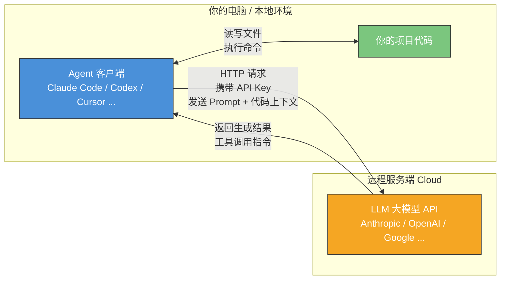

# Chapter 1 · 快速上手部署 Agent

> 目标：用 30 分钟，把一个「能改你项目代码」的 Agent 真正跑起来。

---

## 1. Agent 与大模型的关系：一张图看懂架构

在开始安装之前，你需要先建立一个核心认知：**你本地运行的 Agent 软件，本身并不具备"智能"——它是一个客户端，通过网络连接到远程的 LLM 大模型服务端，才能完成代码生成、理解和推理。**



**关键要点：**

- **Agent = 客户端软件**：负责读取你的项目文件、构建 Prompt、调用工具（终端、文件系统等）、展示结果
- **LLM = 远程服务端**：负责理解代码、推理、生成回答和工具调用指令
- **连接桥梁**：你需要配置 **Base URL**（API 端点地址）和 **API Key / Token**（身份认证），Agent 才能与 LLM 通信
- 这本质上是一个 **Client-Server 架构**，和你平时用浏览器访问网站的模式一样

> 因此，"部署一个 Agent" 实际上就是：**安装客户端 → 配置连接信息 → 开始使用**。

---

## 2. 主流 Agent 工具对比

Agent 工具大致分为两类：**终端 CLI 型**（在命令行中与 Agent 对话）和 **IDE 型**（在编辑器/IDE 中集成 Agent）。

### 终端 CLI 型 Agent

| 特性 | Claude Code | Codex CLI | Gemini CLI | OpenCode | Aider |
|------|-------------|-----------|------------|----------|-------|
| 开发商 | Anthropic | OpenAI | Google | 社区（Anomaly） | 社区开源 |
| 开源 | ❌ 闭源（GitHub 可见但保留版权） | ✅ Apache 2.0 | ✅ Apache 2.0 | ✅ MIT | ✅ Apache 2.0 |
| 默认模型 | Claude 系列 | GPT 系列 | Gemini 系列 | 多家模型 75+ | 多家模型 100+ |
| 核心优势 | 端到端闭环、大仓库理解、SWE-Bench 最强 | 多 Agent 并行、沙箱隔离 | 1M 上下文、免费额度 | 灵活选模型、LSP 集成 | Git 原生、轻量快速 |
| VS Code 集成 | ✅ 插件 | ✅ 插件 | ✅ Gemini Code Assist | ❌ | ❌ |
| 价格 | 按 token / 订阅 | 按 token / 订阅 | 免费额度 + 按量 | 免费（自备 Key） | 免费（自备 Key） |

### IDE / 编辑器型 Agent

| 特性 | Cursor | Windsurf | Trae | Cline | GitHub Copilot | Devin |
|------|--------|----------|------|-------|----------------|-------|
| 开发商 | Cursor Inc. | Cognition AI（原 Codeium） | 字节跳动 | 社区开源 | GitHub/微软 | Cognition AI |
| 形态 | AI IDE | AI IDE | AI IDE | VS Code 插件 | IDE 插件 + CLI + 自主 Agent | Web Agent + CLI |
| 开源 | ❌ | ❌ | 部分 | ✅ Apache 2.0 | ❌ | ❌ |
| 多模型支持 | ✅ 多家 | ✅ 多家 | ✅ 多家 | ✅ 多家 | 自动选模型 | 内置 |
| 核心优势 | 仓库索引、SVFS 多 Agent 并行 | Cascade 引擎、收购整合 | 性价比、中文友好 | 人机审批、MCP 生态 | GitHub 生态深度集成 | 全自主工程 Agent |
| 价格 | $20/月起 | 免费 25 次/月，$15/月 Pro | 免费 + 订阅 | 免费（自备 Key） | $10/月起 | $20/月起 |

---

## 3. 主流 Coding Model 基准测试对比

> 数据截至 2026 年 3 月中旬。完整的 benchmark 体系详解和选型指南见 👉 [附录：模型与 Agent 评测体系详解](./reference-benchmarks.md)

| 模型 | 厂商 | SWE-Bench Verified | LiveCodeBench | Terminal-Bench 2.0 | 备注 |
|------|------|:------------------:|:-------------:|:-------------------:|------|
| Claude Opus 4.6 | Anthropic | **80.8%** | 82.0% | 65.4% | Agent 工程能力最强之一 |
| Claude Sonnet 4.6 | Anthropic | ~77% | 79.1% | — | 性能/成本均衡 |
| GPT-5.4 | OpenAI | 77.2% | — | — | 通用 + 编码统一 |
| GPT-5.3-Codex | OpenAI | ~75% | — | **75.1%** | 编码专精，终端能力强 |
| Gemini 3 Pro | Google | 80.6% | **91.7%** | — | 代码生成最强，1M 上下文 |
| Grok 4 | xAI | ~74% | ~81% | — | 深度推理、数学强 |
| MiniMax M2.5 | MiniMax | **80.2%** | — | — | 开源最高分，极致性价比 |
| Kimi K2.5 | 月之暗面 | 76.8% | 87.1% | — | 开源，多 Agent 协调 |
| GLM-5 | 智谱 AI | 77.8% | — | — | 华为芯片训练，MIT 开源 |
| DeepSeek V3.2 | DeepSeek | ~73% | 89.6% | — | 代码生成极强，价格最低 |

**如何读这张表？** 不同 benchmark 测量不同能力：
- **SWE-Bench Verified**：Agent 修复真实 GitHub Issue 的能力——最接近"帮你干活"的场景
- **LiveCodeBench**：竞赛编程代码生成能力——衡量模型"写代码"的硬实力
- **Terminal-Bench 2.0**：终端命令行操作能力——Agent 在终端"动手"的能力

> 📖 想深入了解每个 benchmark 的含义、局限性，以及如何根据自身需求选择模型？请阅读 [附录：模型与 Agent 评测体系详解](./reference-benchmarks.md)

---

## 4. 小编实际使用体验（截止 2026 年 3 月）

> 以下观点基于笔者个人长期使用体验，仅供参考。AI 工具和模型更新极快，结论可能随版本迭代而变化。

### Claude Code + Opus 4.6：端到端闭环王者

Claude Code 配合 Opus 4.6 是目前笔者体验最好的组合。它的核心优势在于：

- **端到端闭环能力强**：给一个完整任务（如"给这个项目加上用户认证功能"），它能从分析需求、规划方案、编写代码、运行测试到修复报错，全流程自动完成，中途极少需要人工干预
- **自动化程度高**：善于自主调用终端命令、读写文件、运行测试，遇到错误会自动诊断和修复
- **发挥稳定**：长任务链中出错率低，生成代码的细节处理到位（边界条件、错误处理、代码风格一致性）
- **理解上下文能力出色**：1M 上下文窗口（Beta），能很好地理解大型项目的整体架构

一些可供参考的事实：Claude Code 目前每天产生约 13.5 万次 GitHub 提交（占 GitHub 总提交量的约 4%）；有开发者用 16 个 Claude Code Agent 并行编写了 10 万行 Rust C 编译器代码，能成功编译 Linux 内核。

Anthropic 对 Claude 系列模型采用了 **RLHF + Constitutional AI（RLAIF）** 的后训练对齐方式。Claude Code 使用的是通用 Claude 模型加上工程层面的 Agent 框架（工具调用、循环执行等），模型本身经过了大量后训练强化学习来提升指令遵从和编码能力。

### Codex CLI + GPT-5.4：多 Agent 并行，Debug 能力突出

OpenAI 的 Codex CLI 搭配 GPT-5.4（或 GPT-5.3-Codex）是另一个强力组合：

- **多 Agent 并行架构**：Codex 支持多个 Agent 同时在独立的 worktree 中工作，适合并行处理多个任务
- **Debug 和问题识别能力突出**：GPT-5.x Codex 经过专门的编码任务 RL 训练，擅长分析报错、定位 bug
- **沙箱隔离安全**：内置系统级沙箱，Agent 的所有操作都在受控环境中执行
- **已知问题**：社区反馈长时间会话偶尔出现状态不同步（session stalling）、UI 线程与执行线程失步等问题，OpenAI 在持续修复中

OpenAI 为 Codex 系列做了**专门的编码任务强化学习训练**。Codex-1（2025 年 5 月）是在 o3 模型基础上针对软件工程任务做了额外的 RL 微调。GPT-5.3-Codex 甚至在训练过程中被用来调试自身的训练代码。到 GPT-5.4，编码能力和通用能力已统一到同一个模型中，并新增了原生 computer-use 能力。

### Cursor / OpenCode：灵活选模型，各有特色

**Cursor** 是一个 AI 原生 IDE（基于 VS Code 二次开发），它的最大卖点是**多模型支持**——你可以在同一个 IDE 里切换使用 Claude Sonnet、GPT-5.4、Gemini 3 Pro、Grok 等多家模型。Cursor 2.0（2026 年 2 月发布）引入了多 Agent 并行工作流和 Shadow Virtual File System（SVFS，虚拟文件系统，多个 Agent 各自写入虚拟文件树，最终合并呈现给用户审批，最多支持 8 个 Agent 并行），以及后台 Agent（在独立 VM 中工作并自动开 PR）。

**OpenCode** 是一个开源的 CLI 工具（Go 编写，MIT 协议），支持 **75+ 家 LLM 供应商**，也支持通过 Ollama 使用本地模型。GitHub 上已有 120K+ star（截至 2026 年 3 月），增长极快。

> **关于第三方 Agent 的体验差异**：虽然 Cursor、OpenCode 这类工具可以灵活选择不同厂家的模型，兼容性很好，但从实际体验来看，**模型厂家自己的 Agent（如 Anthropic 的 Claude Code、OpenAI 的 Codex、Google 的 Gemini CLI）通常体验更好**。这并非偶然——这些厂商都对自家模型进行了**后训练阶段的强化学习对齐**（而非仅仅是工程层面的 Prompt 调优），使模型在 Agent 场景下（工具调用、多步推理、自主纠错等）表现得更加稳定和可靠。第三方 Agent 只能通过工程手段（Prompt Engineering、工具封装等）来适配模型，无法深入到模型训练层面优化。

### 中国产模型：MiniMax M2.5、Kimi K2.5、GLM-5 领跑

在中国产模型中，目前编码能力最强的三个是：

- **MiniMax M2.5**（MiniMax，2026 年 2 月发布）：MoE 架构（具体参数量未公开），SWE-Bench Verified 达到 **80.2%**（开源模型世界最高），已接近 Claude Opus 的水平。采用超过 200,000 个复杂真实环境的强化学习训练。API 价格极具竞争力（输入 $0.30/M，输出 $1.20/M，仅为 Opus 的 1/63）
- **Kimi K2.5**（月之暗面，2026 年 1 月发布）：开源权重、原生多模态 Agent 模型，SWE-Bench Verified 76.8%，支持协调多达 100 个并行专业 Agent（Agent Swarm）。月之暗面还推出了 **Kimi Code CLI**，定位对标 Claude Code
- **GLM-5**（智谱 AI，2026 年 2 月发布）：744B 参数 MoE 架构（44B 活跃参数），在华为昇腾 910B 芯片上训练，SWE-Bench Verified 达到 77.8%。采用名为"Slime"的新型 RL 技术，将幻觉率从 90% 降至 34%。MIT 开源协议

### 快速变化中的格局

> **特别提醒**：AI 编码工具和模型正处于极其快速的迭代周期中。上述对比在你阅读本文时可能已经过时。新模型每隔几周就会发布，Agent 工具也在持续更新。建议读者保持关注各厂商的最新动态，不要把任何一个时间点的对比当作"定论"。

---

## 5. 安装指南与官方文档链接

### 5.0 前置知识：Node.js 基础

很多主流 Agent 工具（尤其是 Codex CLI 和 Gemini CLI）基于 **Node.js** 生态构建，安装时需要用到 `npm`（Node Package Manager）。如果你还没有安装 Node.js：

```bash
# macOS（使用 Homebrew）
brew install node

# 或者使用 nvm（Node Version Manager）管理多版本
curl -o- https://raw.githubusercontent.com/nvm-sh/nvm/v0.40.0/install.sh | bash
nvm install --lts

# 验证安装
node --version   # 建议 v18+
npm --version
```

**常见概念：**
- **Node.js**：JavaScript 运行时，让 JS 可以在服务端/命令行运行
- **npm**：Node.js 的包管理器，用于安装全局命令行工具（`npm install -g xxx`）
- **npx**：npm 自带的工具，可以直接运行包而不需要全局安装

> 注意：部分工具（如 OpenCode）使用 Go 编写，Claude Code 现在支持通过 `curl` 直接安装二进制文件，不一定强制依赖 Node.js。但了解 Node.js 基础仍然有用。

### 5.1 各工具的官方安装文档

| 工具 | 官方文档 / 安装指南 | 安装命令（快速参考） |
|------|---------------------|---------------------|
| **Claude Code** | [code.claude.com/docs/en/setup](https://code.claude.com/docs/en/setup) / [GitHub](https://github.com/anthropics/claude-code) | `curl -fsSL https://claude.ai/install.sh \| bash` |
| **Codex CLI** | [developers.openai.com/codex/cli](https://developers.openai.com/codex/cli/) / [GitHub](https://github.com/openai/codex) | `npm install -g @openai/codex` |
| **Gemini CLI** | [geminicli.com](https://geminicli.com/) / [GitHub](https://github.com/google-gemini/gemini-cli) | `npm install -g @google/gemini-cli` |
| **Cursor** | [cursor.com](https://cursor.com/) | 直接下载桌面应用 |
| **OpenCode** | [opencode.ai](https://opencode.ai/) / [GitHub](https://github.com/opencode-ai/opencode) | `go install github.com/opencode-ai/opencode@latest` |
| **Trae** | [trae.ai](https://www.trae.ai/) / [GitHub (trae-agent)](https://github.com/bytedance/trae-agent) | 直接下载桌面应用 |

### 5.2 CLI、VS Code 插件、桌面应用——它们是什么关系？

很多 Agent 工具并不只有一种使用方式：

| 工具 | CLI（终端） | VS Code 插件 | 桌面 App / IDE | Web 端 |
|------|------------|-------------|---------------|--------|
| Claude Code | ✅ 本体 | ✅ 插件 | ✅ 桌面应用 | ✅ |
| Codex CLI | ✅ 本体 | ✅ 插件 | ✅ Codex App | ✅ |
| Gemini CLI | ✅ 本体 | ✅ Gemini Code Assist | ❌ | ✅ Cloud Shell |
| Cursor | ❌ | — | ✅ 自身即 IDE | ❌ |
| OpenCode | ✅ 本体 | ❌ | ❌ | ❌ |
| Trae | ✅ trae-agent | ❌ | ✅ 自身即 IDE | ❌ |

### 5.3 理解 CLI 是本体

> **重要认知：对于 Claude Code、Codex、Gemini CLI 这类工具，CLI 是本体，VS Code 插件和桌面应用只是它的延伸界面。**

这意味着：

1. **配置文件是共享的**：无论你从终端运行 `claude`、在 VS Code 里使用 Claude Code 插件、还是打开桌面应用，它们读取的是**同一份配置文件**。你在 CLI 中配置好的 API Key 和设置，在插件和 App 中同样生效
2. **核心能力一致**：CLI 能做的事情，插件和 App 也能做（反过来也基本成立）
3. **CLI 更灵活**：CLI 在自动化脚本、CI/CD 集成、headless 环境中更有优势
4. **插件/App 更直观**：提供可视化的 diff 展示、文件树、交互式审批等 GUI 体验

以 Claude Code 为例，它的配置文件层级为：
```
~/.claude/                    # 全局配置目录
├── settings.json             # 全局设置（可配置 API 代理等）
├── credentials.json          # API 认证信息
└── projects/                 # 项目级配置
    └── <project-hash>/
        └── settings.json     # 项目级设置
```

无论你是从终端、VS Code 还是桌面 App 使用 Claude Code，它们都读取上面这同一套配置文件。

---

## 6. 配置第三方 API 供应商

如果你没有直接使用 Anthropic 或 OpenAI 的官方 API，而是通过第三方 API 供应商（如 OpenRouter、国内中转服务等）购买了 Token，你需要配置 **Base URL** 和 **API Key**。

> **关于 Base URL 和 API Key**：`Base URL` 决定"请求发到哪台服务"，`API Key` 决定"你是谁、有没有权限、按谁计费"。理解这一点后，你就会明白为什么同一个 Agent 客户端可以切换不同的后端供应商。

### Claude Code 配置第三方 API

**方式一：环境变量（推荐快速测试）**

```bash
# 临时设置
export ANTHROPIC_BASE_URL="https://your-provider.com/v1"
export ANTHROPIC_API_KEY="sk-your-api-key-here"
claude

# 永久写入 shell 配置文件（~/.zshrc 或 ~/.bashrc）
echo 'export ANTHROPIC_BASE_URL="https://your-provider.com/v1"' >> ~/.zshrc
echo 'export ANTHROPIC_API_KEY="sk-your-api-key-here"' >> ~/.zshrc
source ~/.zshrc
```

**方式二：通过 settings.json 永久配置（推荐）**

编辑 `~/.claude/settings.json`，添加 API 代理配置：

```json
{
  "env": {
    "ANTHROPIC_BASE_URL": "https://your-provider.com/v1",
    "ANTHROPIC_API_KEY": "sk-your-api-key-here"
  }
}
```

这种方式的好处是不污染 shell 环境变量，且 CLI、VS Code 插件、桌面 App 都会自动生效。

### Codex CLI 配置第三方 API

**方式一：环境变量**

```bash
export OPENAI_BASE_URL="https://your-provider.com/v1"
export OPENAI_API_KEY="sk-your-api-key-here"
codex
```

**方式二：配置文件（推荐永久使用）**

在用户目录下创建 `~/.codex/` 目录，配置两个文件：

`~/.codex/config.toml`：
```toml
model = "gpt-5-codex"
model_provider = "openai"
base_url = "https://your-provider.com/v1"
```

`~/.codex/auth.json`：
```json
{
  "OPENAI_API_KEY": "sk-your-api-key-here"
}
```

### Cursor 配置自定义模型

Cursor 在设置中提供了 GUI 配置界面：

1. 打开 Cursor → Settings → Models
2. 点击 "Add Model" 或找到 OpenAI API Key 配置项
3. 填入你的第三方 Base URL 和 API Key
4. 选择要使用的模型名称

### OpenCode 配置

编辑 `~/.config/opencode/opencode.json`：

```json
{
  "provider": {
    "anthropic": {
      "endpoint": "https://your-provider.com/v1"
    }
  }
}
```

认证文件 `~/.local/share/opencode/auth.json`：

```json
{
  "anthropic": {
    "api_key": "sk-your-api-key-here"
  }
}
```

启动后使用 `/models` 命令选择模型。

> **安全提示**：永远不要把 API Key 提交到 Git 仓库中。使用环境变量或配置文件（并确保它们不在项目目录内）是更安全的做法。

---

## 7. 中国大陆用户：使用第三方 API 中转服务

由于网络环境限制，中国大陆用户直接访问 Anthropic、OpenAI、Google 等厂商的官方 API 可能不稳定。使用 **第三方 API 中转服务** 是一个常见的解决方案。

### 什么是 API 中转？

中转服务商通过在海外部署代理节点，将你的 API 请求转发到官方服务端。你只需将 Base URL 指向中转商的地址，API Key 使用中转商提供的 Token，即可在国内稳定使用海外模型。

### 推荐：云雾 API（yunwu.ai）

笔者长期使用的中转服务商是 [云雾 API（yunwu.ai）](https://yunwu.ai/register?aff=GTlx)，支持 Claude、GPT、Gemini 等主流模型，延迟低且稳定性较好。

**使用步骤：**

1. 注册账号：[yunwu.ai/register](https://yunwu.ai/register?aff=GTlx)
2. 在控制台创建 API Token
3. 将 Base URL 设为 `https://yunwu.ai/v1`，API Key 填入你的云雾 Token
4. 按照上一节的教程配置到你的 Agent 中

**Claude Code 配置示例（settings.json）：**

```json
{
  "env": {
    "ANTHROPIC_BASE_URL": "https://yunwu.ai",
    "ANTHROPIC_API_KEY": "你的云雾API Token"
  }
}
```

**Codex CLI 配置示例（config.toml）：**

```toml
model = "gpt-5-codex"
model_provider = "openai"
base_url = "https://yunwu.ai/v1"
```

> 详细图文教程见云雾官方文档：[Codex 接入教程](https://yunwu.apifox.cn/doc-7422014) · [ OpenCode 接入教程](https://yunwu.apifox.cn/doc-8105901)

### 选择中转商的注意事项

- **优先选文档完整、模型映射透明的服务商**：确保模型 ID 与官方一致
- **注意兼容性**：部分中转商可能不完整支持工具调用（tool use）、流式输出等特性
- **关注隐私政策**：了解你的代码是否会被中转商记录或用于训练
- **不要依赖非官方逆向方案**：短期便宜但随时可能失效，工程上不可靠

---

## 8. 安装完成后：验证你的第一次对话

配置好 Agent 和 API Key 后，先别急着让它改代码——先确认**连接正常、模型能响应**。

**Claude Code**：打开终端，`cd` 到任意项目目录，输入 `claude`，进入交互界面后输入 `你好，请简单介绍你自己`。如果能收到回复，说明 API 连接正常。

**Codex CLI**：终端中运行 `codex`，同样输入一句简单问题验证连通性。

**Cursor**：打开项目后，按 `Cmd+L`（macOS）或 `Ctrl+L`（Windows/Linux）打开 AI Chat 面板，输入问题即可。

如果报错，常见原因是 API Key 填错、Base URL 不对、或网络无法访问目标服务。回到第 6/7 节检查配置。

> **更详细的使用教程，请参阅各工具官方文档：**
> - Claude Code：[code.claude.com/docs](https://code.claude.com/docs/en/overview)
> - Codex CLI：[developers.openai.com/codex/cli](https://developers.openai.com/codex/cli/)
> - Cursor：[docs.cursor.com](https://docs.cursor.com/)

---

## 9. 新手上路：你的第一个 Agent 任务

新手最容易犯的错不是"不会用"，而是**同时装太多工具，结果每个都只会一点点**。建议先选一条主线，跑通一个最小闭环。

### 推荐的起步路线

| 你的偏好 | 推荐起步工具 |
|---------|-------------|
| 习惯终端工作流，想体验最强 Agent 能力 | **Claude Code** |
| 偏好 OpenAI 生态，想试并行 Agent | **Codex CLI** |
| 依赖 IDE 可视化，喜欢边看 diff 边操作 | **Claude Code VSCode插件**、**Cursor** 、 **Cline** |

### 第一个任务：理解一个真实仓库

进入你的一个真实项目目录，给 Agent 这个提示词：

```
先阅读这个仓库，告诉我项目结构、启动命令、测试命令和最值得优先了解的三个模块。
不要修改代码，先给出你的判断。
```

这个任务的价值在于：它让你亲眼看到 Agent 是如何读取文件、理解结构、组织信息的——这是建立信任的第一步。

### 第二个任务：完成一个最小修改

在 Agent 理解仓库之后，给一个低风险的小任务：

```
基于你对仓库的理解，完成一个最小但真实的改动：
1. 选一个低风险的小问题（如补充缺失的测试、修复小 bug、改善一条错误信息）
2. 先给出计划，不要立刻改
3. 我确认后再执行修改
4. 修改完成后运行相应的验证命令
5. 输出改动摘要、涉及文件、验证结果
```

### 新手第一周的三个目标

不要试图一周内学完所有工具。第一周真正要达成的是：

1. **体验过完整闭环**：Agent 读仓库 → 改文件 → 跑命令 → 继续修
2. **知道什么时候该先让它出计划**：复杂任务先让 Agent 给方案，你审批后再执行
3. **理解验证比生成更重要**：不要只看 Agent 给的 diff，让它运行测试来证明改动是对的

### 你以后几乎所有任务都应该默认带的三句话

- **先分析再执行**
- **修改后必须验证**
- **如果不确定，就停下来说明**

这三句看起来朴素，但它们会直接决定你后续 80% 的 Agent 使用质量。

---

## 10. Token 价格对比与定价体系

### 什么是 Token？

在与 LLM 交互时，所有的文本（你的 Prompt 和模型的回答）都会被拆分成 **Token**。Token 大致可以理解为"词片段"——英文中 1 个 token ≈ 0.75 个单词，中文中 1 个汉字 ≈ 1-2 个 token。

### 定价体系的核心概念

| 概念 | 说明 |
|------|------|
| **Input Token（输入）** | 你发给模型的内容（Prompt + 代码上下文），按量计费 |
| **Output Token（输出）** | 模型生成的内容（回答 + 代码），通常比 Input 贵 2-5 倍 |
| **每百万 Token 价格（$/M）** | 行业标准计价单位，即每 100 万个 Token 的美元价格 |
| **上下文窗口（Context Window）** | 模型单次对话能处理的最大 Token 数，越大越能理解更多代码 |
| **Batch API / 批量处理** | 部分厂商提供批量请求的折扣价（通常半价），但延迟更高 |
| **缓存命中（Cache Hit）** | 重复发送的 Prompt 前缀可享受缓存折扣（如 DeepSeek 低至 1/10 价格） |

### 主流模型 Token 价格对比（2026 年 3 月）

| 模型 | 厂商 | 输入 ($/M) | 输出 ($/M) | 备注 |
|------|------|-----------|-----------|------|
| Claude Opus 4.6 | Anthropic | 5.00 | 25.00 | 最强 Agent 工程能力，Batch 半价 |
| Claude Sonnet 4.6 | Anthropic | 3.00 | 15.00 | 性能/成本均衡之选 |
| Claude Haiku 4.5 | Anthropic | 1.00 | 5.00 | 轻量快速，适合简单任务 |
| GPT-5.4 | OpenAI | 2.50 | 15.00 | 统一通用 + 编码能力 |
| GPT-5.3-Codex | OpenAI | 1.75 | 14.00 | 编码专精，终端能力强 |
| GPT-4o | OpenAI | 2.50 | 10.00 | 上一代旗舰，仍在服务 |
| Gemini 3 Pro | Google | 2.00 | 12.00 | 代码生成最强，1M 上下文 |
| Grok 4 | xAI | ~2.00 | ~10.00 | 深度推理强，数学/逻辑突出 |
| MiniMax M2.5 | MiniMax | 0.30 | 1.20 | 开源 SWE-Bench 最高分 |
| Kimi K2.5 | 月之暗面 | 0.60 | 2.50 | 开源权重，Agent 协调能力强 |
| GLM-5 | 智谱 AI | 1.00 | 3.20 | 开源 MIT，国产最强之一 |
| DeepSeek V3.2 | DeepSeek | 0.28 | 0.42 | 极致低价，缓存命中仅 0.028/M |

> **价格说明**：以上为各厂商官方 API 价格，通过第三方供应商购买可能有不同的定价。价格随时可能调整，请以各厂商官网实时价格为准。

### 怎么估算使用成本？

一个粗略的估算方式：

- 一次典型的 Agent 对话（分析项目 + 生成/修改代码）大约消耗 **10K-50K input tokens** 和 **2K-10K output tokens**
- 如果使用 Opus 4.6，一次中等复杂度的任务大约花费 **$0.10 - $1.50**
- 如果使用 DeepSeek V3.2，同样的任务只需 **$0.005 - $0.03**
- 日常高频使用（每天 50-100 次交互），Opus 4.6 月成本约 **$150-$500**，DeepSeek 约 **$8-$30**

> 订阅制（如 Anthropic Max、ChatGPT Pro）通常对高频用户更划算，因为它们提供每月固定价格的无限（或大量）使用额度。

---

## 下一步

恭喜你完成了 Agent 的部署和初次体验！在下一章中，我们将深入理解 Agent 的运作原理和核心概念，帮助你从"能用"走向"会用"。

下一章：[Chapter 2 · Agent 运作原理与相关基本概念](../ch02-concepts/part-2-concepts.md)
