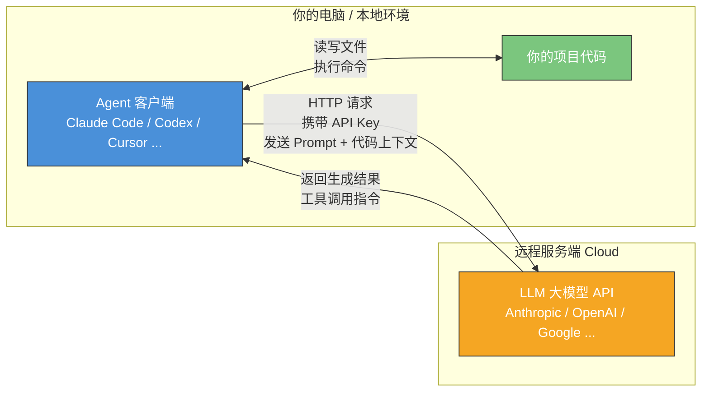

# Chapter 1 · 快速上手部署 Agent

> 目标：用 30 分钟，把一个「能改你项目代码」的 Agent 真正跑起来。

## 目录

- [1. Agent 与大模型的关系](#1-agent-与大模型的关系一张图看懂架构)
- [2. TLDR：小编推荐的 Agent + Model 组合](#2-tldr小编推荐的-agent--model-组合)
- [3. 前置知识：Node.js](#3-前置知识nodejs)
- [4. 安装指南](#4-安装指南)
- [5. 配置第三方 API 供应商](#5-配置第三方-api-供应商)
- [6. 中国大陆用户：API 中转服务](#6-中国大陆用户api-中转服务)
- [7. 验证你的第一次对话](#7-验证你的第一次对话)
- [8. 新手 QuickStart：你的第一个 Agent 任务](#8-新手-quickstart你的第一个-agent-任务)

---

## 1. Agent 与大模型的关系：一张图看懂架构

在开始安装之前，你需要先建立一个核心认知：**你本地运行的 Agent 软件，本身并不具备"智能"——它是一个客户端，通过网络连接到远程的 LLM 大模型服务端，才能完成代码生成、理解和推理。**



**关键要点：**

- **Agent = 客户端软件**：负责读取项目文件、构建 Prompt、调用工具、展示结果
- **LLM = 远程服务端**：负责理解代码、推理、生成回答和工具调用指令
- **连接桥梁**：你需要配置 **Base URL**（API 地址）和 **API Key**（认证），Agent 才能与 LLM 通信

> 因此，"部署一个 Agent" 实际上就是：**安装客户端 → 配置连接信息 → 开始使用**。

---

## 2. TLDR：小编推荐的 Agent + Model 组合

> ⚠️ **时效性声明**：以下推荐基于 2026 年 3 月的实际体验。AI 工具和模型更新极快（几周一个新版本），请以各厂商最新动态为准。想了解详细的工具对比、模型基准测试和价格，见 👉 [附录：Agent 工具与模型详细对比](./reference-tools-comparison.md)

工具和模型太多，选择困难？以下是笔者的实战推荐，**挑一个组合跑起来就行**：

### 首推：Claude Code + Claude 模型家族

| 任务类型 | 推荐模型 | 说明 |
|---------|---------|------|
| 复杂重构 / 大上下文 / 刁钻问题 | **Opus 4.6** | 最强 Agent 工程能力，SWE-Bench 80.8% |
| 日常开发（90% 场景） | **Sonnet 4.6** | 性能/成本最佳平衡，社区公认甜点 |
| 机械简单任务 | **Haiku 4.5** | 轻量快速，省钱 |

为什么首推？Claude Code 是目前端到端闭环能力最强的 Agent——从理解需求到改代码到跑测试到修 bug，全流程最稳定。它有 CLI（终端）和 VS Code 插件两种使用方式，新手都适合。

### 次选方案

| 场景 | 推荐组合 | 适合人群 |
|------|---------|---------|
| 分析定位问题 + Plan 设计 + 明确步骤的代工 | **Codex CLI + GPT-5.3-Codex / GPT-5.4** | 偏好 OpenAI 生态、想试并行 Agent |
| 想先体验 Vibe Coding，同时可切换 Claude/GPT | **Cursor Pro Plan** | 喜欢 IDE 可视化、不想折腾终端 |
| 想体验多 Agent 并行调度，免费 | **Antigravity** | 好奇 Agent-first IDE 范式 |

### 预算有限 / 中国区用户

| 场景 | 推荐组合 | 说明 |
|------|---------|------|
| 网络/合规限制 | **Claude Code + GLM-5** | 智谱模型，MIT 开源，华为昇腾训练 |
| 国产最强性价比 | **Kimi Code + Kimi K2.5** | 月之暗面官方 Agent，开源权重 |
| 极致低成本 | **OpenCode + DeepSeek V3.2** | 开源 Agent + 最便宜模型 |

> 💡 核心原则：**先跑通一个组合，再横向对比**。不要同时装太多工具，每个都只会一点点。

---

## 3. 前置知识：Node.js

很多 Agent 工具（Codex CLI、Gemini CLI 等）通过 `npm` 安装。如果你是后端/算法工程师，可能没接触过 Node.js，这里快速科普。

### Node.js 是什么？

**Node.js 是一个让 JavaScript 脱离浏览器运行的运行时环境。** 它最初是为了让 JS 也能写服务端程序，但现在它最大的实际用途之一是**作为命令行工具的分发平台**——很多开发者工具（包括 AI Agent）都选择用 JS/TS 编写，然后通过 npm 分发，因为这样跨平台（macOS/Linux/Windows）且安装一行命令搞定。

你可以把它类比为 Python 之于 pip：
- **Node.js** ≈ Python 解释器（运行环境）
- **npm** ≈ pip（包管理器，`npm install -g xxx` ≈ `pip install xxx`）
- **npx** ≈ `python -m xxx`（直接运行包，不需要全局安装）

### 安装

```bash
# macOS（Homebrew）
brew install node

# 或使用 nvm 管理多版本
curl -o- https://raw.githubusercontent.com/nvm-sh/nvm/v0.40.0/install.sh | bash
nvm install --lts

# 验证
node --version   # 建议 v18+
npm --version
```

> 注意：Claude Code 现已支持 `curl` 直接安装二进制文件，不依赖 Node.js。但了解 npm 仍有用。

---

## 4. 安装指南

### 各工具安装命令

| 工具 | 官方文档 | 安装命令 |
|------|---------|---------|
| **Claude Code** | [code.claude.com/docs](https://code.claude.com/docs/en/setup) / [GitHub](https://github.com/anthropics/claude-code) | `curl -fsSL https://claude.ai/install.sh \| bash` |
| **Codex CLI** | [GitHub](https://github.com/openai/codex) | `npm install -g @openai/codex` |
| **Gemini CLI** | [geminicli.com](https://geminicli.com/) / [GitHub](https://github.com/google-gemini/gemini-cli) | `npm install -g @google/gemini-cli` |
| **Cursor** | [cursor.com](https://cursor.com/) | 下载桌面应用 |
| **Antigravity** | [antigravity.google](https://antigravity.google/) | 下载桌面应用 |
| **OpenCode** | [opencode.ai](https://opencode.ai/) / [GitHub](https://github.com/opencode-ai/opencode) | `go install github.com/opencode-ai/opencode@latest` |
| **Trae** | [trae.ai](https://www.trae.ai/) | 下载桌面应用 |

### CLI、VS Code 插件、桌面应用——什么关系？

| 工具 | CLI | VS Code 插件 | 桌面 App | Web 端 |
|------|-----|-------------|---------|--------|
| Claude Code | ✅ 本体 | ✅ 插件 | ✅ | ✅ |
| Codex CLI | ✅ 本体 | ✅ 插件 | ✅ Codex App | ✅ |
| Gemini CLI | ✅ 本体 | ✅ Code Assist | ❌ | ✅ Cloud Shell |
| Cursor | ❌ | — | ✅ 自身即 IDE | ❌ |
| Antigravity | ❌ | — | ✅ 自身即 IDE | ❌ |
| OpenCode | ✅ 本体 | ❌ | ❌ | ❌ |

### 理解"CLI 是本体"

> **对于 Claude Code、Codex、Gemini CLI：CLI 是本体，VS Code 插件和桌面应用只是它的延伸界面。**

这意味着：
1. **配置共享**：CLI 中配好的 API Key，在插件和 App 中同样生效
2. **核心能力一致**：CLI 能做的事，插件和 App 也能做
3. **CLI 更灵活**：自动化脚本、CI/CD、headless 环境
4. **插件/App 更直观**：可视化 diff、文件树、交互审批

以 Claude Code 为例，配置文件层级：
```
~/.claude/
├── settings.json             # 全局设置
├── credentials.json          # API 认证
└── projects/<project-hash>/
    └── settings.json         # 项目级设置
```

---

## 5. 配置第三方 API 供应商

如果你不直接使用官方 API，而是通过第三方供应商（如 OpenRouter、国内中转）购买 Token，需要配置 **Base URL** 和 **API Key**。

> `Base URL` = 请求发到哪台服务，`API Key` = 你是谁、按谁计费。

### Claude Code 配置（推荐方式：settings.json）

编辑 `~/.claude/settings.json`：

```json
{
  "env": {
    "ANTHROPIC_BASE_URL": "https://your-provider.com/v1",
    "ANTHROPIC_API_KEY": "sk-your-api-key-here"
  }
}
```

这种方式不污染 shell 环境变量，且 CLI、VS Code 插件、桌面 App 都会自动生效。

**或用环境变量（快速测试）：**

```bash
export ANTHROPIC_BASE_URL="https://your-provider.com/v1"
export ANTHROPIC_API_KEY="sk-your-api-key-here"
claude
```

> ⚠️ **安全提示**：永远不要把 API Key 提交到 Git 仓库。
>
> 📖 其它工具（Codex CLI / Cursor / OpenCode / Gemini CLI）的配置方法见 👉 [附录：各工具 API 配置详解](./reference-api-config.md)

---

## 6. 中国大陆用户：API 中转服务

由于网络限制，国内直接访问 Anthropic / OpenAI / Google API 可能不稳定。使用**第三方 API 中转服务**是常见解决方案。

### 什么是 API 中转？

中转商在海外部署代理节点，转发你的 API 请求。你只需将 Base URL 指向中转商地址，使用中转商提供的 Token。

### 推荐：云雾 API（yunwu.ai）

笔者长期使用的中转服务：[yunwu.ai](https://yunwu.ai/register?aff=GTlx)，支持 Claude / GPT / Gemini 等主流模型。

**Claude Code 配置示例：**
```json
{
  "env": {
    "ANTHROPIC_BASE_URL": "https://yunwu.ai",
    "ANTHROPIC_API_KEY": "你的云雾 Token"
  }
}
```

### 选择中转商注意事项

- **文档完整、模型映射透明**：确保模型 ID 与官方一致
- **注意兼容性**：部分中转不完整支持工具调用（tool use）
- **关注隐私**：了解代码是否被记录
- **不要用逆向方案**：短期便宜但随时失效

---

## 7. 验证你的第一次对话

配置好后，先确认**连接正常**：

**Claude Code**：`cd` 到项目目录，输入 `claude`，进入交互界面后输入 `你好，简单介绍你自己`。

**Codex CLI**：终端运行 `codex`，输入简单问题验证。

**Cursor**：`Cmd+L`（macOS）/ `Ctrl+L` 打开 Chat 面板，输入问题。

如果报错，常见原因：API Key 填错、Base URL 不对、网络不通。回到第 5/6 节检查。

> **各工具详细使用教程**：[Claude Code Docs](https://code.claude.com/docs/en/overview) · [Codex CLI](https://developers.openai.com/codex/cli/) · [Cursor Docs](https://docs.cursor.com/)

---

## 8. 新手 QuickStart：你的第一个 Agent 任务

新手最容易犯的错不是"不会用"，而是**同时装太多工具**。先选一条主线，跑通最小闭环。

### 推荐起步路线

| 偏好 | 推荐 |
|------|------|
| 终端工作流，想体验最强 Agent | **Claude Code** |
| OpenAI 生态，想试并行 Agent | **Codex CLI** |
| IDE 可视化，边看 diff 边操作 | **Claude Code VS Code 插件** / **Cursor** |

### 第一个任务：理解一个真实仓库

进入你的真实项目目录，给 Agent 这个提示词：

```
先阅读这个仓库，告诉我项目结构、启动命令、测试命令和最值得优先了解的三个模块。
不要修改代码，先给出你的判断。
```

这让你亲眼看到 Agent 如何读取文件、理解结构、组织信息——建立信任的第一步。

### 第二个任务：完成一个最小修改

```
基于你对仓库的理解，完成一个最小但真实的改动：
1. 选一个低风险小问题（补测试、修小 bug、改善错误信息）
2. 先给出计划，不要立刻改
3. 我确认后再执行
4. 修改后运行验证命令
5. 输出改动摘要、涉及文件、验证结果
```

### 新手第一周三个目标

1. **体验完整闭环**：Agent 读仓库 → 改文件 → 跑命令 → 继续修
2. **知道何时该先出计划**：复杂任务先让 Agent 给方案再执行
3. **理解验证比生成更重要**：不只看 diff，让它跑测试证明

### 所有任务都应默认带的三句话

- **先分析再执行**
- **修改后必须验证**
- **如果不确定，就停下来说明**

---

## 下一步

恭喜你完成了 Agent 的部署和初次体验！在下一章中，我们将深入理解 Agent 的运作原理和核心概念，帮助你从"能用"走向"会用"。

下一章：[Chapter 2 · Agent 运作原理与相关基本概念](../ch02-concepts/part-2-concepts.md)
