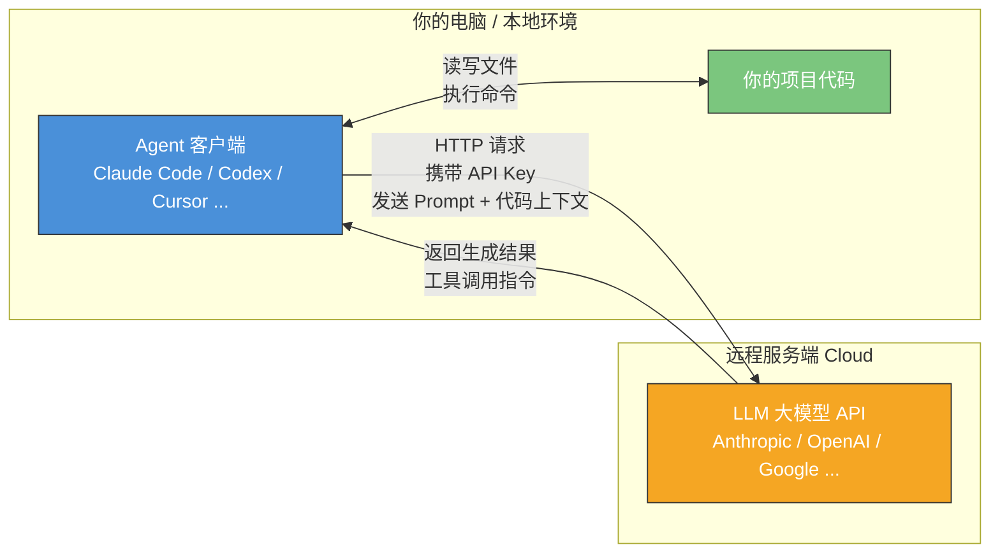

# Chapter 1 · 快速上手部署 Agent

> 目标：用 30 分钟，把一个「能改你项目代码」的 Agent 真正跑起来。

---

## 1. Agent 与大模型的关系：一张图看懂架构

在开始安装之前，你需要先建立一个核心认知：**你本地运行的 Agent 软件，本身并不具备"智能"——它是一个客户端，通过网络连接到远程的 LLM 大模型服务端，才能完成代码生成、理解和推理。**



**关键要点：**

- **Agent = 客户端软件**：负责读取你的项目文件、构建 Prompt、调用工具（终端、文件系统等）、展示结果
- **LLM = 远程服务端**：负责理解代码、推理、生成回答和工具调用指令
- **连接桥梁**：你需要配置 **Base URL**（API 端点地址）和 **API Key / Token**（身份认证），Agent 才能与 LLM 通信
- 这本质上是一个 **Client-Server 架构**，和你平时用浏览器访问网站的模式一样

> 因此，"部署一个 Agent" 实际上就是：**安装客户端 → 配置连接信息 → 开始使用**。

---

## 2. 主流 Agent 工具对比

> ⚠️ **本节内容待补充完善**——以下为框架，详细评测数据将在后续版本中填入。

| 特性 | Claude Code | Codex CLI | Cursor | OpenCode | Trae | Manus |
|------|-------------|-----------|--------|----------|------|-------|
| 开发商 | Anthropic | OpenAI | Cursor Inc. | 社区开源 | 字节跳动 | Manus AI（已被 Meta 收购） |
| 形态 | CLI 为主 | CLI 为主 | AI IDE（桌面应用） | CLI / TUI | AI IDE（桌面应用） | Web 端自主 Agent |
| 开源 | ✅ | ✅ | ❌ | ✅（Go） | 部分开源（trae-agent） | ❌ |
| 多模型支持 | Anthropic 模型 | OpenAI 模型 | ✅ 多家模型 | ✅ 75+ 家模型 | 多家模型 | 内置模型 |
| VS Code 集成 | ✅ 插件 | ✅ 插件 | 自身即 IDE | ❌ | 自身即 IDE | ❌ |
| 适合场景 | 端到端自动化 | Debug/辅助开发 | 日常 IDE 内开发 | 灵活选模型 | 快速原型 | 通用任务自动化 |
| 价格模式 | 按 token / 订阅 | 按 token / 订阅 | 订阅制 | 免费（自备 API Key） | 免费 + 订阅 | 订阅制 |

---

## 3. 主流 Coding Model 基准测试对比

> ⚠️ **本节内容待补充完善**——基准测试数据将在后续版本中填入。

| 模型 | 厂商 | SWE-Bench Verified | HumanEval | Terminal-Bench | 备注 |
|------|------|-------------------|-----------|----------------|------|
| Claude Opus 4.6 | Anthropic | — | — | — | |
| Claude Sonnet 4.6 | Anthropic | — | — | — | |
| GPT-5.4 | OpenAI | — | — | — | |
| GPT-5.3-Codex | OpenAI | — | — | — | |
| Kimi K2.5 | 月之暗面 | 70.8% | — | 43.2% | |
| GLM-5 | 智谱 AI | 77.8% | — | — | |
| DeepSeek V3.2 | DeepSeek | — | — | — | |
| Gemini 3.1 Pro | Google | — | — | — | |

---

## 4. 小编实际使用体验（截止 2026 年 3 月）

> 以下观点基于笔者个人长期使用体验，仅供参考。AI 工具和模型更新极快，结论可能随版本迭代而变化。

### Claude Code + Opus 4.6：端到端闭环王者

Claude Code 配合 Opus 4.6 是目前笔者体验最好的组合。它的核心优势在于：

- **端到端闭环能力强**：给一个完整任务（如"给这个项目加上用户认证功能"），它能从分析需求、规划方案、编写代码、运行测试到修复报错，全流程自动完成，中途极少需要人工干预
- **自动化程度高**：善于自主调用终端命令、读写文件、运行测试，遇到错误会自动诊断和修复
- **发挥稳定**：长任务链中出错率低，生成代码的细节处理到位（边界条件、错误处理、代码风格一致性）
- **理解上下文能力出色**：能很好地理解大型项目的整体架构，修改时不容易破坏已有逻辑

Anthropic 对 Claude 系列模型采用了 **RLHF（人类反馈强化学习）+ Constitutional AI（宪法 AI / RLAIF）** 的后训练对齐方式。Claude Code 使用的是通用 Claude 模型加上工程层面的 Agent 框架（工具调用、循环执行等），模型本身经过了大量后训练强化学习来提升指令遵从和编码能力。

### Codex CLI + GPT-5.4：性价比之选，Debug 利器

OpenAI 的 Codex CLI 搭配 GPT-5.4（或 GPT-5.3-Codex）是另一个强力组合：

- **性价比高**：GPT-5.4 的 token 价格比 Opus 4.6 低不少，适合大量使用
- **Debug 和问题识别能力突出**：特别擅长分析报错、定位 bug、解释代码行为
- **适合人机结合的模块化开发**：比起让它独立完成整个任务，更适合人主导架构设计，AI 辅助实现各个模块
- **长 workflow 有时出细节问题**：当任务链较长时（如跨多个文件的大重构），偶尔会在中途遗漏细节或产生前后不一致

OpenAI 为 Codex 系列做了**专门的编码任务强化学习训练**。Codex-1（2025 年 5 月）是在 o3 模型基础上针对软件工程任务做了额外的 RL 微调，学习开发者的风格偏好、PR 规范、测试编写习惯等。GPT-5.3-Codex（2026 年 2 月）甚至在训练过程中被用来调试自身的训练代码。到 GPT-5.4，编码能力和通用能力已统一到同一个模型中。

### Cursor / OpenCode：灵活选模型，各有特色

**Cursor** 是一个 AI 原生 IDE（基于 VS Code 二次开发），它的最大卖点是**多模型支持**——你可以在同一个 IDE 里切换使用 Claude Sonnet、GPT-5.4、Gemini 3 Pro、Grok 等多家模型。Cursor 2.0 引入了多 Agent 并行工作流和 Shadow Virtual File System（SVFS，虚拟文件系统，多个 Agent 各自写入虚拟文件树，最终合并呈现给用户审批），以及后台 Agent（在独立 VM 中工作并自动开 PR）。

**OpenCode** 是一个开源的 CLI 工具（Go 编写），支持 **75+ 家 LLM 供应商**（OpenAI、Anthropic、Google、AWS Bedrock、Groq、Azure、OpenRouter 等），也支持通过 Ollama 使用本地模型。它内置 LSP（语言服务协议）集成，支持多会话并行、会话共享等特性。GitHub 上已有 120K+ star。

> **关于第三方 Agent 的体验差异**：虽然 Cursor、OpenCode 这类工具可以灵活选择不同厂家的模型，兼容性很好，但从实际体验来看，**模型厂家自己的 Agent（如 Anthropic 的 Claude Code、OpenAI 的 Codex）通常体验更好**。这并非偶然——Anthropic 和 OpenAI 都对自家模型进行了**后训练阶段的强化学习对齐**（而非仅仅是工程层面的 Prompt 调优），使模型在 Agent 场景下（工具调用、多步推理、自主纠错等）表现得更加稳定和可靠。第三方 Agent 只能通过工程手段（Prompt Engineering、工具封装等）来适配模型，无法深入到模型训练层面优化。

### 中国产模型：Kimi K2.5 和 GLM-5 领跑

在中国产模型中，目前编码能力最强的两个是：

- **Kimi K2.5**（月之暗面，2026 年 1 月发布）：开源权重、原生多模态 Agent 模型，SWE-Bench Verified 70.8%，支持协调多达 100 个并行专业 Agent（Agent Swarm）。月之暗面还推出了 **Kimi Code CLI**，定位对标 Claude Code。API 价格极具竞争力（输入 $0.60/M，输出 $2.50/M）
- **GLM-5**（智谱 AI，2026 年 2 月发布）：744B 参数 MoE 架构（44B 活跃参数），在华为昇腾 910B 芯片上训练，SWE-Bench Verified 达到 77.8%。采用名为"Slime"的新型 RL 技术，将幻觉率从 90% 降至 34%。MIT 开源协议

### 快速变化中的格局

> **特别提醒**：AI 编码工具和模型正处于极其快速的迭代周期中。上述对比在你阅读本文时可能已经过时。新模型每隔几周就会发布，Agent 工具也在持续更新。建议读者保持关注各厂商的最新动态，不要把任何一个时间点的对比当作"定论"。

---

## 5. 安装指南与官方文档链接

### 5.0 前置知识：Node.js 基础

很多主流 Agent 工具（尤其是 Claude Code 和 Codex CLI）基于 **Node.js** 生态构建，安装时需要用到 `npm`（Node Package Manager）。如果你还没有安装 Node.js：

```bash
# macOS（使用 Homebrew）
brew install node

# 或者使用 nvm（Node Version Manager）管理多版本
curl -o- https://raw.githubusercontent.com/nvm-sh/nvm/v0.40.0/install.sh | bash
nvm install --lts

# 验证安装
node --version   # 建议 v18+
npm --version
```

**常见概念：**
- **Node.js**：JavaScript 运行时，让 JS 可以在服务端/命令行运行
- **npm**：Node.js 的包管理器，用于安装全局命令行工具（`npm install -g xxx`）
- **npx**：npm 自带的工具，可以直接运行包而不需要全局安装

> 注意：部分工具（如 OpenCode）使用 Go 编写，Claude Code 现在也支持通过 `curl` 直接安装二进制文件，不一定强制依赖 Node.js。但了解 Node.js 基础仍然有用。

### 5.1 各工具的官方安装文档

| 工具 | 官方文档 / 安装指南 | 安装命令（快速参考） |
|------|---------------------|---------------------|
| **Claude Code** | [code.claude.com/docs/en/setup](https://code.claude.com/docs/en/setup) / [GitHub](https://github.com/anthropics/claude-code) | `curl -fsSL https://claude.ai/install.sh \| bash` |
| **Codex CLI** | [developers.openai.com/codex/cli](https://developers.openai.com/codex/cli/) / [GitHub](https://github.com/openai/codex) | `npm install -g @openai/codex` |
| **Cursor** | [cursor.com](https://cursor.com/) | 直接下载桌面应用 |
| **OpenCode** | [opencode.ai](https://opencode.ai/) / [GitHub](https://github.com/opencode-ai/opencode) | `go install github.com/opencode-ai/opencode@latest` |
| **Trae** | [trae.ai](https://www.trae.ai/) / [GitHub (trae-agent)](https://github.com/bytedance/trae-agent) | 直接下载桌面应用 |
| **Manus** | [manus.im](https://manus.im/) | Web 端使用，无需本地安装 |

### 5.2 CLI、VS Code 插件、桌面应用——它们是什么关系？

很多 Agent 工具并不只有一种使用方式：

| 工具 | CLI（终端） | VS Code 插件 | 桌面 App / IDE | Web 端 |
|------|------------|-------------|---------------|--------|
| Claude Code | ✅ 本体 | ✅ 插件 | ✅ 桌面应用 | ✅ |
| Codex CLI | ✅ 本体 | ✅ 插件 | ❌ | ✅ |
| Cursor | ❌ | — | ✅ 自身即 IDE | ❌ |
| OpenCode | ✅ 本体 | ❌ | ❌ | ❌ |
| Trae | ✅ trae-agent | ❌ | ✅ 自身即 IDE | ❌ |

### 5.3 理解 CLI 是本体

> **重要认知：对于 Claude Code、Codex 这类工具，CLI 是本体，VS Code 插件和桌面应用只是它的延伸界面。**

这意味着：

1. **配置文件是共享的**：无论你从终端运行 `claude`、在 VS Code 里使用 Claude Code 插件、还是打开桌面应用，它们读取的是**同一份配置文件**。你在 CLI 中配置好的 API Key 和设置，在插件和 App 中同样生效
2. **核心能力一致**：CLI 能做的事情，插件和 App 也能做（反过来也基本成立）
3. **CLI 更灵活**：CLI 在自动化脚本、CI/CD 集成、headless 环境中更有优势
4. **插件/App 更直观**：提供可视化的 diff 展示、文件树、交互式审批等 GUI 体验

以 Claude Code 为例，它的配置文件层级为：
```
~/.claude/                    # 全局配置目录
├── settings.json             # 全局设置
├── credentials.json          # API 认证信息
└── projects/                 # 项目级配置
    └── <project-hash>/
        └── settings.json     # 项目级设置
```

无论你是从终端、VS Code 还是桌面 App 使用 Claude Code，它们都读取上面这同一套配置文件。

---

## 6. 配置第三方 API 供应商

如果你没有直接使用 Anthropic 或 OpenAI 的官方 API，而是通过第三方 API 供应商（如 OpenRouter、各种国内代理等）购买了 Token，你需要配置 **Base URL** 和 **API Key**。

### Claude Code 配置第三方 API

Claude Code 支持通过环境变量来配置：

```bash
# 方式一：在终端中设置环境变量（临时）
export ANTHROPIC_BASE_URL="https://your-provider.com/v1"
export ANTHROPIC_API_KEY="sk-your-api-key-here"
claude   # 启动 Claude Code

# 方式二：写入 shell 配置文件（永久）
# 在 ~/.zshrc 或 ~/.bashrc 中添加：
export ANTHROPIC_BASE_URL="https://your-provider.com/v1"
export ANTHROPIC_API_KEY="sk-your-api-key-here"
```

如果你的第三方供应商提供的是 OpenAI 兼容接口（很多供应商都是），也可以配置：

```bash
export OPENAI_BASE_URL="https://your-provider.com/v1"
export OPENAI_API_KEY="sk-your-api-key-here"
```

### Codex CLI 配置第三方 API

```bash
# 环境变量方式
export OPENAI_BASE_URL="https://your-provider.com/v1"
export OPENAI_API_KEY="sk-your-api-key-here"
codex   # 启动 Codex
```

### Cursor 配置自定义模型

Cursor 在设置中提供了 GUI 配置界面：

1. 打开 Cursor → Settings → Models
2. 点击 "Add Model" 或找到 OpenAI API Key 配置项
3. 填入你的第三方 Base URL 和 API Key
4. 选择要使用的模型名称

### OpenCode 配置

OpenCode 使用配置文件 `~/.opencode/config.json`：

```json
{
  "provider": "openai-compatible",
  "baseUrl": "https://your-provider.com/v1",
  "apiKey": "sk-your-api-key-here",
  "model": "claude-opus-4-6"
}
```

> **安全提示**：永远不要把 API Key 提交到 Git 仓库中。使用环境变量或 `.env` 文件（并将其加入 `.gitignore`）是更安全的做法。

---

## 7. 新手上路：你的第一个 Agent 任务

配置好 Agent 之后，来试试这些简单的提示词，感受一下 Agent 编码的能力：

### 入门级：了解项目

```
> 帮我分析一下这个项目的整体架构，列出主要的目录结构和各模块的职责。
```

这个 Prompt 让 Agent 读取你的项目文件，帮你快速了解项目全貌。

### 基础级：生成代码

```
> 在 src/utils/ 目录下创建一个 format.ts 文件，实现一个函数：
> 输入一个日期对象，返回 "YYYY-MM-DD HH:mm:ss" 格式的字符串。
> 同时在 tests/ 目录下写对应的单元测试。
```

### 进阶级：修复 Bug

```
> 运行 npm test 看看有没有失败的测试，如果有的话帮我修复。
```

### 实战级：添加功能

```
> 我想给这个 Express 应用添加一个 /api/health 健康检查接口，
> 返回 JSON 格式的服务状态信息（包括运行时间、内存使用、版本号）。
> 请同时添加对应的测试。
```

### 小技巧

- **给 Agent 足够的上下文**：描述清楚你想要什么，比"帮我写个函数"更好的是"在 xxx 文件中写一个做 xxx 的函数"
- **让 Agent 先读再改**：可以先让它分析现有代码，然后再提修改需求
- **迭代而非一步到位**：复杂任务可以分步骤让 Agent 完成，每步确认后再继续
- **善用 Agent 的工具能力**：直接让它运行测试、执行构建，而不是只让它生成代码

---

## 8. Token 价格对比与定价体系

### 什么是 Token？

在与 LLM 交互时，所有的文本（你的 Prompt 和模型的回答）都会被拆分成 **Token**。Token 大致可以理解为"词片段"——英文中 1 个 token ≈ 0.75 个单词，中文中 1 个汉字 ≈ 1-2 个 token。

### 定价体系的核心概念

| 概念 | 说明 |
|------|------|
| **Input Token（输入）** | 你发给模型的内容（Prompt + 代码上下文），按量计费 |
| **Output Token（输出）** | 模型生成的内容（回答 + 代码），通常比 Input 贵 2-5 倍 |
| **每百万 Token 价格（$/M）** | 行业标准计价单位，即每 100 万个 Token 的美元价格 |
| **上下文窗口（Context Window）** | 模型单次对话能处理的最大 Token 数，越大越能理解更多代码 |
| **Batch API / 批量处理** | 部分厂商提供批量请求的折扣价（通常半价），但延迟更高 |
| **缓存命中（Cache Hit）** | 重复发送的 Prompt 前缀可享受缓存折扣（如 DeepSeek 低至 1/10 价格） |

### 主流模型 Token 价格对比（2026 年 3 月）

| 模型 | 厂商 | 输入价格（$/M tokens） | 输出价格（$/M tokens） | 备注 |
|------|------|----------------------|----------------------|------|
| **Claude Opus 4.6** | Anthropic | $5.00 | $25.00 | 最强综合能力，Batch 半价 |
| **Claude Sonnet 4.6** | Anthropic | $3.00 | $15.00 | 性能/成本均衡之选 |
| **Claude Haiku 4.5** | Anthropic | $1.00 | $5.00 | 轻量快速，适合简单任务 |
| **GPT-5.4** | OpenAI | $2.50 | $15.00 | 统一通用 + 编码能力 |
| **GPT-5.3-Codex** | OpenAI | $1.75 | $14.00 | 编码专精模型 |
| **GPT-4o** | OpenAI | $2.50 | $10.00 | 上一代旗舰，仍在服务 |
| **Kimi K2.5** | 月之暗面 | $0.60 | $2.50 | 开源权重，极具性价比 |
| **GLM-5** | 智谱 AI | $1.00 | $3.20 | 开源（MIT），国产最强之一 |
| **DeepSeek V3.2** | DeepSeek | $0.28 | $0.42 | 极致低价，缓存命中仅 $0.028/M |
| **Gemini 3.1 Pro** | Google | $2.00 | $12.00 | >200K 上下文价格翻倍 |

> **价格说明**：以上为各厂商官方 API 价格，通过第三方供应商购买可能有不同的定价。价格随时可能调整，请以各厂商官网实时价格为准。

### 怎么估算使用成本？

一个粗略的估算方式：

- 一次典型的 Agent 对话（分析项目 + 生成/修改代码）大约消耗 **10K-50K input tokens** 和 **2K-10K output tokens**
- 如果使用 Opus 4.6，一次中等复杂度的任务大约花费 **$0.10 - $1.50**
- 如果使用 DeepSeek V3.2，同样的任务只需 **$0.005 - $0.03**
- 日常高频使用（每天 50-100 次交互），Opus 4.6 月成本约 **$150-$500**，DeepSeek 约 **$8-$30**

> 订阅制（如 Anthropic Max、ChatGPT Pro）通常对高频用户更划算，因为它们提供每月固定价格的无限（或大量）使用额度。

---

## 下一步

恭喜你完成了 Agent 的部署和初次体验！在下一章中，我们将深入理解 Agent 的运作原理和核心概念，帮助你从"能用"走向"会用"。

下一章：[Chapter 2 · Agent 运作原理与相关基本概念](../ch02-concepts/part-2-concepts.md)
