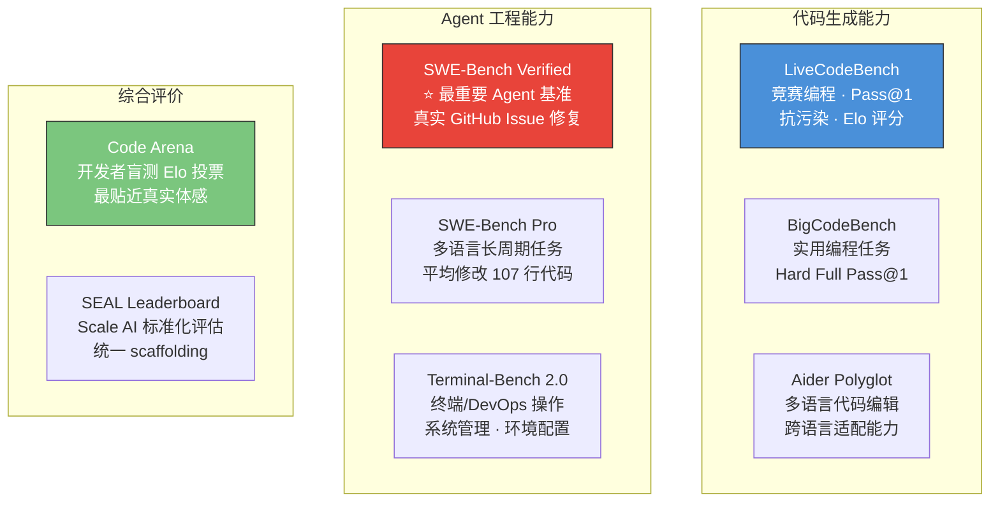
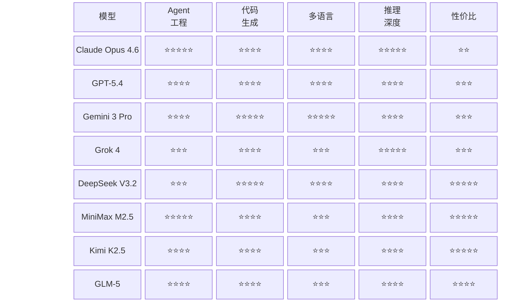
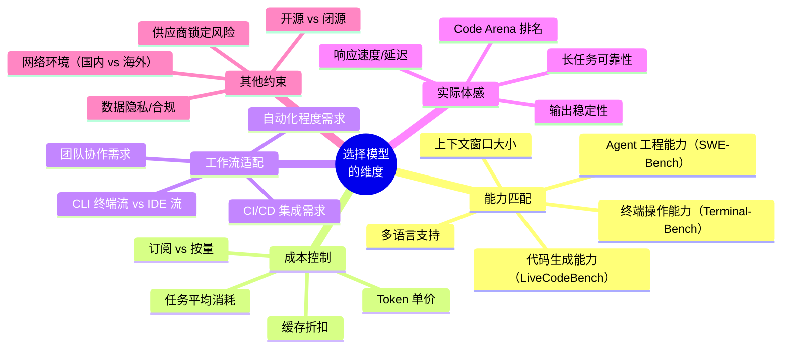
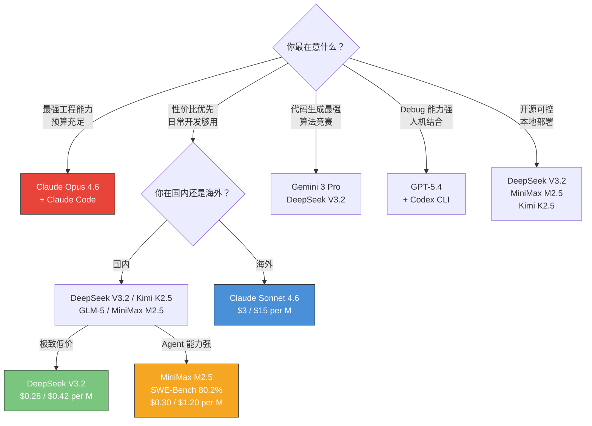

# 附录：模型与 Agent 评测体系详解

> 本文是 [Chapter 1 · 快速上手部署 Agent](./part-1-quickstart.md) 的配套参考资料，帮助你深入理解各种评测基准，以便做出更合理的选型决策。

---

## 一、主要评测基准（Benchmark）一览

选择模型和 Agent 时，你会频繁看到以下几个基准测试的名称。它们各自测量不同维度的能力：

### 各基准详解

| 基准 | 测量什么 | 为什么重要 | 局限性 |
|------|---------|-----------|--------|
| **SWE-Bench Verified** | Agent 修复真实 GitHub Issue 的能力（500 个人工验证实例） | ⭐ Agent 编码能力的"金标准"，最接近真实软件工程场景 | 仅 Python；存在数据污染争议；scaffolding 影响大 |
| **SWE-Bench Pro** | 多语言（Python/Go/TS/JS）长周期任务，平均需改 107 行代码 | 更贴近真实工程复杂度，防污染设计 | 较新，历史数据少 |
| **LiveCodeBench** | 从 LeetCode/Codeforces 滚动抽取的竞赛编程题 | 抗污染、实时更新、Elo 评分系统 | 偏算法竞赛，与日常工程开发有差距 |
| **BigCodeBench** | 实用性编程任务（Hard Full Pass@1） | 比 HumanEval 更难更实用 | 样本规模有限 |
| **Terminal-Bench 2.0** | 终端命令行操作、DevOps、系统管理 | 测试 Agent 的"动手能力"，不只是生成代码 | 偏 Linux/运维场景 |
| **Code Arena** | 开发者盲测投票（Elo 排名） | 最贴近真实用户体感，不受 benchmark 优化影响 | 主观性强，样本偏差 |
| **Aider Polyglot** | 多种编程语言的代码生成与编辑 | 测试跨语言适配能力 | 工具绑定（Aider 框架） |
| **SEAL Leaderboard** | Scale AI 统一 scaffolding 下的标准化测试 | 隔离模型原生能力，排除 Agent 框架差异 | 250 轮限制，不完全反映实战 |

---

## 二、全面的模型 Benchmark 数据（2026 年 3 月）

> 数据来源：SWE-bench.com、LiveCodeBench 官网、Artificial Analysis、BigCodeBench、Code Arena (arena.ai)、Aider。数据截至 2026 年 3 月中旬。

### SWE-Bench Verified（Agent 工程能力 · 最核心指标）

| 排名 | 模型 / Agent | 国家 | 得分 | 备注 |
|:----:|:-------------|:----:|:----:|------|
| 1 | Claude Opus 4.5（Anthropic） | 🇺🇸 | 80.9% | 当前世界纪录 |
| 2 | Claude Opus 4.6（Anthropic） | 🇺🇸 | 80.8% | 差异仅 0.1pp，属统计噪声；4.6 在推理和终端能力上大幅领先 |
| 3 | Gemini 3.1 Pro（Google） | 🇺🇸 | 80.6% | |
| 4 | MiniMax M2.5 | 🇨🇳 | 80.2% | 开源模型最高 |
| 5 | GPT-5.2（OpenAI） | 🇺🇸 | 80.0% | |
| 6 | GLM-5（智谱 AI） | 🇨🇳 | 77.8% | 华为芯片训练 |
| 7 | GPT-5.4 / Codex（OpenAI） | 🇺🇸 | 77.2% | |
| 8 | Claude Sonnet 4.5（Anthropic） | 🇺🇸 | 77.2% | |
| 9 | Kimi K2.5（月之暗面） | 🇨🇳 | 76.8% | |
| 10 | Grok 4（xAI） | 🇺🇸 | ~74% | |

### SWE-Bench Pro（多语言长周期 · 更高难度）

| 排名 | 模型 / Agent | 得分 | 备注 |
|:----:|:-------------|:----:|------|
| 1 | GPT-5.3-Codex（OpenAI） | 56.8% | Agent 专用模型 |
| 2 | GPT-5.2-Codex（OpenAI） | 56.4% | |
| 3 | GPT-5.2（OpenAI） | 55.6% | |
| 4 | Claude Opus 4.5（Anthropic） | 45.9% | SEAL 标准化得分 |
| 5 | GPT-5（High）（OpenAI） | 41.8% | SEAL 标准化得分 |

### LiveCodeBench（竞赛编程 · 代码生成能力）

| 排名 | 模型 | 国家 | 得分 / Elo | 备注 |
|:----:|:-----|:----:|:----------:|------|
| 1 | Gemini 3 Pro Preview（Google） | 🇺🇸 | 91.7% / Elo 2439 | 创纪录 |
| 2 | Gemini 3 Flash Preview（Google） | 🇺🇸 | 90.8% | |
| 3 | DeepSeek V3.2 Speciale | 🇨🇳 | 89.6% | |
| 4 | Qwen3-Max（阿里） | 🇨🇳 | 87.8% | |
| 5 | Kimi K2.5（月之暗面） | 🇨🇳 | 87.1% | |
| 6 | MiMo-V2-Flash（小米） | 🇨🇳 | 84.9% | 309B 参数 |
| 7 | DeepSeek V3.2（DeepSeek） | 🇨🇳 | 85.0% | |
| 8 | DeepSeek R1 | 🇨🇳 | 84.0% | 推理模型 |
| 9 | Claude Opus 4.6（Anthropic） | 🇺🇸 | 82.0% | |
| 10 | Grok 4（xAI） | 🇺🇸 | ~81% | |

### Terminal-Bench 2.0（终端 Agent 能力）

| 排名 | 模型 / Agent | 得分 | 备注 |
|:----:|:-------------|:----:|------|
| 1 | Codex CLI + GPT-5.3 | 77.3% | OpenAI 开源 Agent |
| 2 | GPT-5.3-Codex（基础模型） | 75.1% | |
| 3 | Droid + Claude Opus 4.6 | 69.9% | Anthropic 生态 |
| 4 | Claude Opus 4.6 | 65.4% | |
| 5 | GPT-5.2 | 62.2% | |

### Code Arena（开发者盲测投票 · Elo 排名，2026 年 3 月）

| 排名 | 模型 | Elo | 备注 |
|:----:|:-----|:---:|------|
| 1-4 | Claude 系列（Opus/Sonnet 4.5/4.6） | 1472-1552 | 统治前四 |
| 5 | Gemini 3.1 Pro | ~1465 | |
| 6 | GPT-5.4 | ~1460 | |
| 7 | GLM-5（智谱 AI） | 1447 | 中国模型首次进前 10 |
| 8 | GLM-4.7（智谱 AI） | 1442 | |

---

## 三、旗舰模型能力雷达图

---

## 四、如何选择适合自己的模型？——你需要考虑的维度

选模型不是简单看"谁的 benchmark 分数最高"。你需要根据自己的实际场景，在以下维度间做权衡：

### 维度详解

| 维度 | 为什么重要 | 怎么评估 |
|------|-----------|---------|
| **Agent 工程能力** | 决定模型能否真正"帮你干活"——理解需求、读代码、改代码、跑测试、修 bug 的闭环能力 | 看 SWE-Bench Verified/Pro 分数 |
| **代码生成能力** | 决定模型"写代码"本身的质量——算法、逻辑、语法正确性 | 看 LiveCodeBench、BigCodeBench |
| **终端操作能力** | 如果你依赖 Agent 在终端执行命令（安装依赖、运行测试、部署等） | 看 Terminal-Bench 2.0 |
| **上下文窗口** | 决定 Agent 一次能"看到"多少代码。大项目需要大窗口 | Gemini 最大（1M+），Claude 200K，大多数 128-256K |
| **Token 单价** | 直接影响你的钱包。高频使用时差异巨大 | 见 [价格对比表](./part-1-quickstart.md#8-token-价格对比与定价体系) |
| **响应速度** | 影响交互体验。等 30 秒和等 3 秒的体感差距巨大 | 实际体验 > 官方数据；小模型通常更快 |
| **输出稳定性** | 同一个任务跑多次，结果是否一致、质量是否波动 | Code Arena 排名 + 个人体验 |
| **长任务可靠性** | 当任务链很长时（如跨 10+ 文件的重构），模型是否能保持前后一致 | 需要实际测试 |
| **数据隐私** | 你的代码是否会被用于模型训练？是否需要本地部署？ | 查各厂商隐私政策；开源模型可自行部署 |
| **网络环境** | 国内开发者访问海外 API 可能有延迟或不稳定 | 国内优先考虑 DeepSeek/Kimi/GLM/MiniMax |

### 快速决策树

---

## 五、Agent 与 Model 的关系：不要混淆

一个常见误区是把"模型排名"和"Agent 排名"混为一谈。实际上：

| | Model（模型） | Agent（智能体） |
|---|---|---|
| **本质** | 大语言模型本身，负责理解和生成 | 模型 + 工具调用框架 + 执行环境的整体系统 |
| **能力来源** | 预训练 + 后训练（RLHF/RL）| 模型能力 + scaffolding 工程 + 工具集成 |
| **评测** | LiveCodeBench、BigCodeBench | SWE-Bench、Terminal-Bench |
| **举例** | Claude Opus 4.6（模型） | Claude Code（Agent，使用 Opus 4.6 模型） |

**同一个模型，搭配不同的 Agent 框架，SWE-Bench 分数可能相差 5-10 个百分点。** 这就是为什么 Claude Code（Anthropic 自研框架 + Opus 4.6）的分数通常高于第三方 Agent 使用同一模型的分数。

---

## 六、关键趋势（2026 年 3 月）

1. **中国模型已进入全球第一梯队**：MiniMax M2.5 在 SWE-Bench Verified 达到 80.2%（开源最高），GLM-5、Kimi K2.5 紧随其后。在 LiveCodeBench 等代码生成测试中，中国模型已追平甚至局部超越美国闭源模型
2. **Agent 框架仍是美国领先**：Claude Code、Codex CLI 在 SWE-Bench 上占据前列，中国的 Agent 框架生态仍在追赶
3. **开源与闭源差距快速缩小**：MiniMax M2.5（开源）与 Claude Opus 4.5（闭源）的 SWE-Bench 差距已不到 1%
4. **性价比差异巨大**：DeepSeek V3.2 的价格仅为 Claude Opus 4.6 的 1/60，但代码生成能力（LiveCodeBench）差距不大
5. **排行榜变化极快**：本文数据可能在你阅读时已经过时，建议直接查看各官方排行榜获取实时数据

**实时排行榜链接：**
- [SWE-Bench 官方排行榜](https://www.swebench.com/)
- [LiveCodeBench 官方排行榜](https://livecodebench.github.io/)
- [Code Arena](https://arena.ai/)
- [Artificial Analysis Coding Index](https://artificialanalysis.ai/)
- [BigCodeBench](https://bigcode-bench.github.io/)

---

> 返回主教程：[Chapter 1 · 快速上手部署 Agent](./part-1-quickstart.md)
