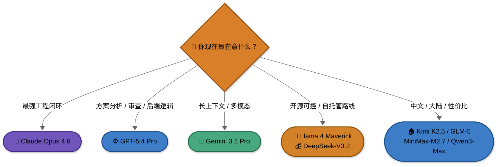

# 附录：主流 Coding 模型对比

> 这篇比较的是“**底层模型**”而不是“你实际打开的产品界面”。
>
> 同一个模型，放到不同 Agent 里，体感可能差很多；反过来，同一个 Agent 换模型，表现也会变。**不要把模型榜单和 Agent 排名混成一张表。**

---

## 先记住这三件事

### 1. `模型` 不是 `Agent`

- `Claude Opus 4.6` 是模型。
- `Claude Code` 是调用模型、管理上下文、执行工具、组织工作流的 Agent。
- 所以“模型强”并不自动等于“产品最好用”。

### 2. 产品命名和公开 benchmark 命名常常不是一一对应

比如你在产品页里会看到：

- `GPT-5.4 Pro`
- `Gemini 3.1 Pro`
- `MiniMax-M2.7`

但公开 benchmark 里经常出现的是：

- `GPT-5.4`
- `Gemini 3 Pro Preview`
- `MiniMax M2.5`

这并不代表产品页写错了，而是**公开榜单、评测时间点、产品包装层和模型版本号并不总同步**。所以读榜单时要看“系列趋势”，不要机械地按名字逐字对号入座。

### 3. 榜单只能帮你缩小范围，不能替你做最终选择

真正决定长期体验的，往往还包括：

- 工具调用稳定性
- 长任务漂移情况
- 输出是否容易 review
- 成本和延迟
- 你的网络与合规条件

## 一张图：先按需求大致分流

## 二、国际模型

| 模型 | 更擅长什么 | 更适合什么场景 | 需要注意什么 |
|------|------------|----------------|--------------|
| **Claude Opus 4.6** | 复杂工程任务、长链路推理、跨文件理解 | 重型 coding、复杂重构、关键任务 | 成本高；简单任务未必划算 |
| **GPT-5.4 Pro** | 方案拆解、后端逻辑、审查、专业工作流 | 规划、review、约束分析、逻辑型任务 | 真实体验非常依赖你搭配的 Agent 与工作流 |
| **Gemini 3.1 Pro** | 长上下文、多模态、Google 生态配合 | 大体量阅读、跨文档分析、探索型任务 | 工程闭环稳定性和“省心程度”不一定永远是第一名 |
| **Llama 4 Maverick** | 开放权重、超长上下文、可控路线 | 自托管、实验、开源可控 | 真正的 coding 实战公开资料相对没有前几家那么集中 |
| **nemotron-3-super** | 企业导向、结构化任务、tool calling | 企业场景、结构化流程、平台集成 | 面向大众开发者的实战口碑样本相对较少 |
| **grok-code-fast** | 速度、pair programming、代码场景 | 快速实验、交互式编码 | 公开 benchmark 与工程闭环口碑还要持续观察 |

## 三、国产模型

| 模型 | 更擅长什么 | 更适合什么场景 | 需要注意什么 |
|------|------------|----------------|--------------|
| **Kimi K2.5** | 中文体验、多步工具使用、综合均衡 | 中文开发、内容和代码混合任务 | 长链路硬仗仍建议你自己多验证 |
| **GLM-5** | 中文工程任务、Agentic Engineering、复杂系统场景 | 大陆网络环境、中文技术任务、工程替代路线 | 关于昇腾，更准确的表述应是“已有适配 / 生态支持”，不应简单写成“它一定是在昇腾上训练的模型” |
| **MiniMax-M2.7** | 工具调用、工程型任务、榜单表现亮眼 | 想严肃比较国产工程模型的读者 | 榜单成绩高，但网上真实用户评价明显分化；别只看分数 |
| **DeepSeek-V3.2** | 性价比、开源路线、低成本推理 | 预算敏感、批量执行、开源/自托管路线 | 复杂任务上常常更依赖你把工作流设计好 |
| **Qwen3-Max** | 通用能力、多步骤任务、阿里生态配合 | 企业内生态、中文多步骤任务 | 公开 coding-agent 口碑和榜单要结合具体版本看 |

## 四、我会怎么配模型

| 目标 | 我更倾向的模型 | 理由 |
|------|----------------|------|
| **最强复杂任务** | `Claude Opus 4.6` | 最适合拿来啃大任务和复杂工程链路 |
| **方案讨论 / 审查 / 后端逻辑** | `GPT-5.4 Pro` | 更像擅长讨论、拆解、审视风险的“参谋型模型” |
| **长文档、大体量上下文** | `Gemini 3.1 Pro` | 超长上下文和多模态能力有明显优势 |
| **低成本大批量执行** | `DeepSeek-V3.2` | 价格优势非常明显 |
| **中文主力候选** | `Kimi K2.5`、`GLM-5`、`Qwen3-Max` | 中文环境和国内可用性更友好 |
| **认真比较国产工程模型** | `MiniMax-M2.7`、`GLM-5`、`Kimi K2.5` | 适合做横向验证，但不要只看 leaderboard |

## 五、为什么“模型榜单很高”不一定等于“我会主推”

这件事在 2026 年尤其明显。

很多时候，读者看到的是：

- 某模型在 `SWE-Bench` 很强
- 某模型在 `LiveCodeBench` 很高
- 某模型被营销成“工程第一”

但真正决定你要不要长期用它的，还有另外几件事：

- **工具调用到底稳不稳**
- **会不会跑偏以后越修越乱**
- **改完是不是容易读懂**
- **review 成本是不是被隐藏了**
- **你自己的网络和成本条件是否允许**

### 关于 `MiniMax`，我建议特别保守一点

`MiniMax` 在公开榜单上的存在感很强，这件事不应忽视；但我不建议读者只因为榜单高就立即把它当成唯一主力。

原因很简单：

- 真实用户的使用反馈明显不是一边倒的。
- 厂商普遍存在为了榜单好看做针对性优化的行为。
- 你自己的工作流很可能并不是 benchmark 的任务形状。

所以如果你真打算把它放进主力清单，请务必自己去这些平台多搜真实反馈：

- `Google`
- `Reddit`
- `小红书`
- `知乎`
- `B 站`

## 六、一个更稳的读榜顺序

1. 先用 benchmark 把候选缩小到 2 到 4 个模型。
2. 再看你实际要搭配的 Agent 是什么。
3. 用你自己的 3 到 5 个真实任务跑一轮。
4. 最后比较：成功率、review 成本、速度、价格、疲劳感。

> 下一步建议：如果你想知道这些 benchmark 到底各自测什么、为什么同一模型在不同榜单会像“两个人”，接着看 [`附录：模型与 Agent 评测体系详解`](./reference-benchmarks.md)。

---

返回：[附录：Agent 工具与模型详细对比](./reference-tools-comparison.md)
