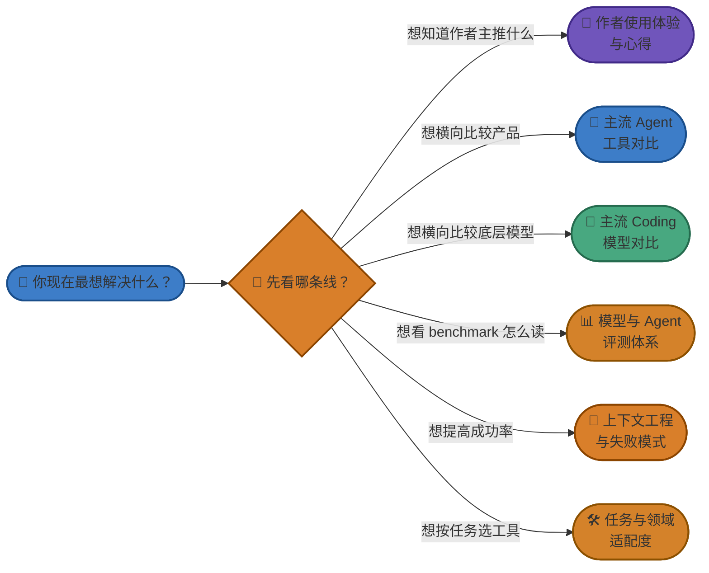

# 附录：Agent 工具与模型详细对比

> 这是 [Chapter 1 · 快速上手部署 Agent](./part-1-quickstart.md) 的选型导航页。
>
> 正文只保留作者主推组合和最短结论；更深的内容已经拆成多篇专题附录，方便你按兴趣和阶段渐进式阅读。
>
> 📅 数据口径：2026 年 3 月。工具、模型和套餐变化很快，请以厂商官方信息为准。

---

## 先怎么读这一组附录

## 核心附录

### 📝 作者使用体验与心得

适合已经跑通一个 Agent、正准备决定“长期主力工作流”的读者。这里主要讲**真实体感**，而不是抄榜单。

链接：[`附录：作者使用体验与心得`](./reference-author-experience.md)

### 🤖 主流 Agent 工具对比

适合横向比较不同产品形态：CLI、AI IDE、开源 BYOK 工具，以及通用 Agent / Claw。

链接：[`附录：主流 Agent 工具对比`](./reference-agent-comparison.md)

### 🧠 主流 Coding 模型对比

适合比较底层模型的长处、短板、价格体感和适合的任务类型。这里会特别提醒“**模型强**”和“**实际好用**”并不是一回事。

链接：[`附录：主流 Coding 模型对比`](./reference-model-comparison.md)

### 📊 模型与 Agent 评测体系详解

适合已经开始看 leaderboard，但不想被 leaderboard 误导的读者。重点解释 `SWE-Bench`、`LiveCodeBench`、`Terminal-Bench`、`Code Arena` 到底分别测什么。

链接：[`附录：模型与 Agent 评测体系详解`](./reference-benchmarks.md)

## 这次额外补上的两篇

### 🛠️ 不同任务与技术领域中的 Agent 适配度

回答“**什么任务该大胆交给 Agent，什么任务要保守一点**”。适合前端、后端、测试、重构、调试、CI/CD、ML/AI Infra 等场景判断。

链接：[`附录：不同任务与技术领域中的 Agent 适配度`](./reference-task-fit.md)

### 🧭 上下文工程、验证闭环与常见失败模式

回答“**为什么同一个工具，别人用起来像神器，你用起来像翻车制造机**”。重点讲上下文污染、验证闭环、会话管理和失败模式。

链接：[`附录：上下文工程、验证闭环与常见失败模式`](./reference-context-engineering.md)

## 现有配套附录

- [`附录：CLI、VS Code 插件、桌面应用——什么关系？`](./reference-cli-ide-app.md)
- [`附录：中国大陆用户推荐配置`](./reference-china-users-guide.md)
- [`附录：各工具 API 配置详解`](./reference-api-config.md)
- [`附录：Agent 与 Claw 范式深度对比`](../reference-agent-vs-claw.md)

## 本组附录覆盖的工具与模型名单

> 为了和 `README` 保持一致，下面这组名单是本章选型讨论的完整范围。

| 类别 | 名单 |
|------|------|
| **国际主流 Coding Agent** | Claude Code、Cursor、GitHub Copilot、Codex CLI、Gemini CLI、Antigravity |
| **国产主流 Coding Agent** | 通义灵码、Trae、Baidu Comate、CodeBuddy、Kimi Code、CodeArts |
| **开源生态 / 更多工具** | OpenCode、CodeGeeX、Aider、Cline、Windsurf、Devin |
| **通用 Agent / Claw** | OpenClaw、Manus、ChatGPT Tasks、Perplexity、Kimi Agent、ArkClaw |
| **国际模型** | Claude Opus 4.6、GPT-5.4 Pro、Gemini 3.1 Pro、Llama 4 Maverick、nemotron-3-super、grok-code-fast |
| **国产模型** | Kimi K2.5、GLM-5、MiniMax-M2.7、DeepSeek-V3.2、Qwen3-Max |

## 先给一句话结论

- **大多数正式开发任务**：先从 `Claude Code`、`Cursor`、`Codex CLI` 里选一条主线，不要一上来全都装上。
- **中国大陆 / 成本敏感 / 中文优先**：重点看 `Kimi Code`、`OpenCode`、`GLM-5`、`DeepSeek-V3.2` 这一侧。
- **别把 Agent 和模型混为一谈**：工具是工作台，模型是底层马力；`Agent` 的表现往往还取决于上下文工程、工具系统和验证闭环。
- **别只看榜单**：排行榜很重要，但并不等于长期使用体验。尤其在 2026 年，厂商普遍会针对公开 benchmark 做优化，社区真实口碑必须一起看。

---

返回：[Chapter 1 · 快速上手部署 Agent](./part-1-quickstart.md)
