# Chapter 2 · Agent 运作原理与核心概念

> 目标：建立一套完整的 Agent 心智模型——不只是"能用"，而是"知道它在干什么、为什么有时聪明有时蠢、怎么让它更好用"。

## 目录

- [0. 先问自己三个问题](#0-先问自己三个问题)
- [1. Agent 的本质](#1-agent-的本质一张图搞懂)
- [2. Agent-LLM 交互解剖：一次调用里到底发生了什么](#2-agent-llm-交互解剖一次调用里到底发生了什么)
- [3. Memory：上下文是 Agent 的命脉](#3-memory上下文是-agent-的命脉)
- [4. Tools、MCP 与 Skills：Agent 的手脚](#4-toolsmcp-与-skillsagent-的手脚)
- [5. Planning 与多 Agent 协作](#5-planning-与多-agent-协作)
- [6. 人机协同：从"能用"到"好用"](#6-人机协同从能用到好用)

---

## 0. 先问自己三个问题

在深入原理之前，先检视一下你对 Agent 的直觉——以下哪些你觉得是对的？

| # | 常见直觉 | 实际情况 |
|---|---------|---------|
| 1 | "Agent 就是更聪明的 ChatGPT" | **错。** Agent = LLM + 工具 + 记忆 + 规划循环。ChatGPT 一问一答，Agent 会自己动手改代码、跑测试、修 bug |
| 2 | "模型越强，Agent 就越好用" | **半对。** Agent 表现 = 模型能力 × 上下文质量 × 任务结构清晰度。后两者完全在你手中 |
| 3 | "我给 Agent 的信息越全面越好" | **错。** 信息过多会淹没关键指令，导致 Agent 行为退化。精准 > 全面 |
| 4 | "Agent 每次回答都是一次性生成的" | **错。** Agent 在内部跑了一个 Think→Act→Observe 的循环，可能迭代十几轮才给你最终结果 |
| 5 | "工具和插件越多越好" | **错。** 工具太多会让 Agent 决策混乱、上下文膨胀。Less is More |

带着这些认知，我们开始拆解 Agent 的运作原理。

---

## 1. Agent 的本质：一张图搞懂

### Agent ≠ 更聪明的模型

- **LLM**（大语言模型）是"大脑"——负责理解、推理、生成
- **Agent** 是围绕这个大脑构建的"任务执行系统"——负责规划、记忆、调用工具、持续迭代

> **Agent = LLM + Memory + Tools + Planning**

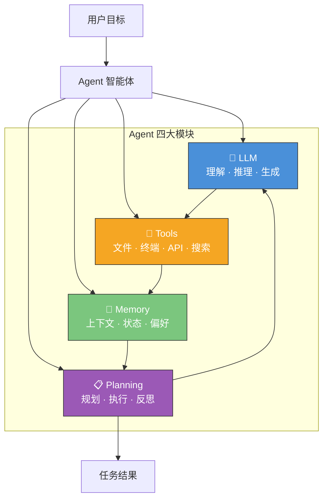

### LLM vs Agent：核心区别

| 维度 | LLM | Agent |
|------|-----|-------|
| 核心模式 | 输入 → 输出（一问一答） | 目标 → 循环 → 完成 |
| 是否行动 | 通常不会 | 会调用工具、执行命令 |
| 是否记忆 | 仅当前对话窗口 | 短期 + 长期记忆 |
| 是否规划 | 有限 | 主动拆解任务、分步执行 |
| 失败处理 | 一次性回答 | 观察结果 → 反思 → 重试 |

### 核心闭环：Think → Act → Observe

所有 Agent 的工作本质都是同一个循环：

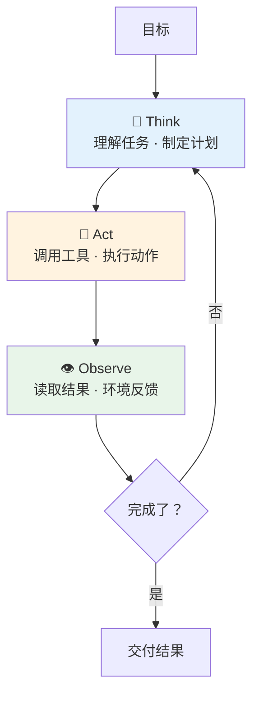

当你对 Agent 说"帮我重构这段代码并补上测试"，它不是一次性生成答案，而是在内部跑了这个循环很多次——先读代码理解结构，再规划修改方案，然后逐步执行修改、运行测试、根据测试结果修复问题，直到通过。

### 自主性光谱

Agent 不是"全自动或全手动"，而是存在一个自主性光谱。目前主流 Coding Agent（Claude Code、Codex、Cursor）大多工作在**半自主**区间：Agent 自己规划和执行，但在关键操作（写入文件、执行危险命令、推送代码）时请求你确认。

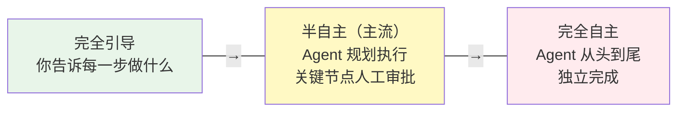

### 产品实例：Claude Code 与 Opus 4.6

**Claude Code 是 Agent 容器（壳 + 工具 + 工作流），Opus 4.6 是其中的大脑（推理 + 编码 + 规划）。** 同理，Codex CLI 之于 GPT-5.x、Gemini CLI 之于 Gemini 3 Pro，都是这个关系。

---

## 2. Agent-LLM 交互解剖：一次调用里到底发生了什么

> 这一节揭开"幕后"，让你理解 Agent 不是魔法——它是一个精心设计的软件系统，围绕着一个无状态的 LLM API 构建循环。

### 幕后真相：Agent 只是一个 while 循环

当你在终端输入一条指令，Agent **不是**简单地把你的文字发给云端 LLM。它精心构造了一个庞大的 JSON 请求体（payload），为 LLM 构建了一个"完整的现实"来工作。

### API 调用的五层结构

每次 Agent 向 LLM 发送请求时，payload 包含五层内容：

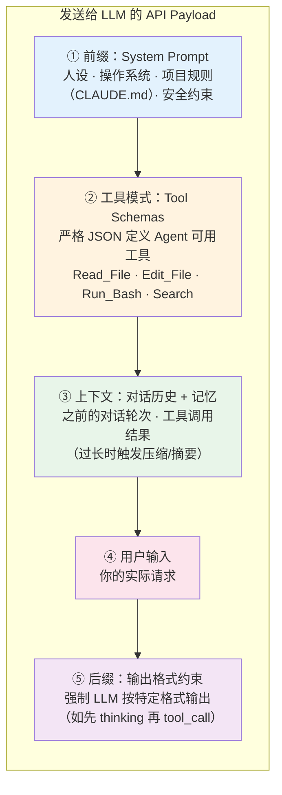

| 层 | 作用 | 你能影响的部分 |
|----|------|--------------|
| **① System Prompt** | 设定人设、环境、规则 | CLAUDE.md / AGENTS.md 中的项目规则 |
| **② Tool Schemas** | 定义 LLM 能调用什么工具 | MCP 配置、Skill 注册 |
| **③ 上下文** | 对话历史和工具返回结果 | 控制输出长度、分阶段任务 |
| **④ 用户输入** | 你的请求 | 任务描述的清晰度和结构 |
| **⑤ 输出约束** | 强制格式化输出 | 通常由 Agent 框架控制 |

### Agentic Loop：不是一问一答，是持续循环

Agent 与 LLM 的交互不是单次请求-响应，而是一个 **while 循环**：

```
while True:
    response = LLM.call(system_prompt + tools + context + user_input)

    if response.is_final_text:   # LLM 认为任务完成
        return response.text

    if response.is_tool_call:    # LLM 要求调用工具
        result = execute_tool(response.tool_call)  # 在你的本地执行！
        context.append(result)                      # 把结果追加到上下文
        continue                                    # 再次调用 LLM
```

用伪代码展开完整流程：

```python
def run_autonomous_agent(user_task):
    # 1. 上下文工程：构建 payload
    messages = [
        {"role": "system", "content": build_system_prompt()},  # ① 前缀
        {"role": "user", "content": user_task}                  # ④ 用户输入
    ]

    while True:  # Agentic Loop
        # 2. 调用云端 LLM（② 工具模式 + ③ 上下文一并发送）
        response = cloud_llm_api.invoke(
            model="claude-opus-4-6",
            messages=messages,
            tools=TOOL_SCHEMAS  # Bash, FileEdit, Search...
        )

        # 3. LLM 不再请求工具 → 任务完成
        if not response.tool_calls:
            return response.final_text

        messages.append({"role": "assistant", "content": response.tool_calls})

        # 4. 在本地执行工具，将结果反馈给 LLM
        for tool_call in response.tool_calls:
            try:
                result = execute_in_local_terminal(tool_call.name, tool_call.args)
            except Exception as error:
                # 自动纠错：将错误信息反馈给 LLM，让它修正
                result = f"Command failed: {error}. Please fix."

            messages.append({
                "role": "tool_result",
                "tool_id": tool_call.id,
                "content": result
            })
```

### 驯服概率：Agent 如何让 LLM 可靠

LLM 本质是概率预测引擎——预测下一个 token。如果不加约束，它可能编造命令参数或生成非法语法。Agent 用多层机制确保可靠性：

| 机制 | 原理 | 效果 |
|------|------|------|
| **原生工具调用微调** | 模型在数百万工具调用样本上训练，输出严格匹配 Tool Schema 的 JSON | 格式正确率 >99% |
| **自动纠错循环** | LLM 生成的命令出错 → Agent 捕获 stderr → 反馈给 LLM → LLM 修正重试 | 大多数语法错误自动修复 |
| **语法验证守门** | 编辑文件后立即运行 linter/编译器，失败则自动回滚 | 防止引入语法破坏 |
| **辅助模型校验** | 用便宜快速的小模型（如 Haiku）预审高风险命令 | 拦截危险操作 |
| **输出截断** | 命令输出过长时只保留首尾关键行，中间截断 | 防止上下文膨胀 |

### 安全编辑：Agent 如何改你的代码不翻车

允许 AI 自主编辑代码库是危险的。Agent 通过高度约束的防御性编程来保障安全：

**为什么不让 LLM 输出整个文件？** 因为太慢、浪费 token，且 LLM 容易在长文件中途"遗忘"代码段导致回归。

**实际做法——块级搜索替换**：LLM 只需输出要修改的代码块（Search）和替换内容（Replace），Agent 负责执行：

```python
def safe_edit_file(filepath, search_block, replace_block):
    backup_path = filepath + ".bak"
    shutil.copy(filepath, backup_path)        # 1. 先备份

    content = read_file(filepath)
    if search_block not in content:
        return "Error: 找不到该代码块，请检查缩进"

    new_content = content.replace(search_block, replace_block)
    write_file(filepath, new_content)

    syntax_ok = run_linter(filepath)           # 2. 语法检查
    if not syntax_ok.success:
        shutil.copy(backup_path, filepath)     # 3. 失败则回滚
        return f"Edit reverted. 语法错误: {syntax_ok.error}"

    return "编辑成功，语法检查通过"
```

### 上下文压缩：当对话太长怎么办

即使有百万 token 的上下文窗口，无限追加也会导致成本激增和"中间遗忘"。Agent 的压缩策略：

| 策略 | 做法 |
|------|------|
| **输出截断** | 命令输出保留首 50 行 + 尾 100 行，中间替换为 `[N lines truncated]` |
| **摘要压缩** | 用轻量模型（如 Haiku）对旧对话做摘要，替换原始内容 |
| **状态提取** | 将关键发现写入 scratchpad 文件（如 `.agent_memory.md`），清空对话后可回读 |

---

## 3. Memory：上下文是 Agent 的命脉

Memory 决定了 Agent 能"记住"多少——直接影响它能处理多复杂的任务、能保持多长时间的连贯性。

### 三种记忆类型

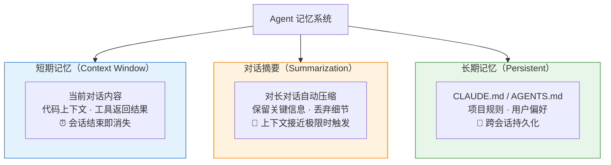

### 上下文 ≠ 越多越好

新手最容易犯的错是"一股脑把所有信息塞给 Agent"。现实往往相反：

| 问题 | 症状 | 解法 |
|------|------|------|
| **重要信息被淹没** | Agent 忽略了你的明确指令 | 精简上下文，突出关键信息 |
| **矛盾指令** | Agent 行为前后不一致 | 检查规则文件是否自相矛盾 |
| **过拟合噪音** | Agent 对无关细节投入过多注意力 | 只给完成当前目标最相关的信息 |

> **黄金原则：不是"尽可能多给"，而是"只给完成当前目标最相关的高密度信息"。**

### Agent 变蠢的三大原因

**上下文污染**：Agent 抓着旧结论不放，或被无关日志带偏。
→ 重开会话，只保留当前任务必要背景。

**Memory 污染**：Agent 学到了错误偏好并不断重复。
→ 定期审查 CLAUDE.md / Memory 文件，区分永久规则和临时偏好。

**长任务漂移**：任务一长，Agent 忘记原目标，纠结细枝末节。
→ 分阶段执行：先出计划 → 每阶段结束做总结 → 必要时重开会话带上摘要。

> 📖 Memory 的深度技术细节（认知架构演进、向量数据库 RAG、Memory 强化学习）见 👉 [附录：Memory 与上下文工程详解](./reference-memory-and-context.md)

---

## 4. Tools、MCP 与 Skills：Agent 的手脚

Agent 光有"大脑"不够，还需要"手脚"来与真实世界交互。

### 三层行动空间

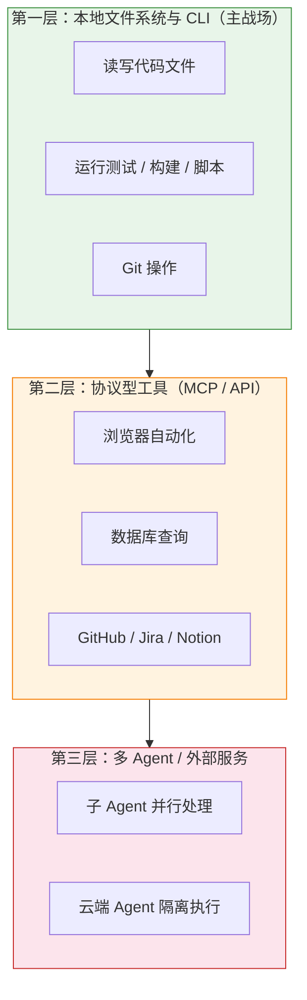

**实用原则**：先把第一层打磨好，再考虑第二层和第三层。

### MCP：Agent 的"USB-C 接口"

**MCP（Model Context Protocol）** 是标准化的工具集成协议，最初由 Anthropic 提出，2025 年底捐赠给 Linux Foundation，现为行业中立标准（OpenAI、Google、Microsoft 等均已支持）。

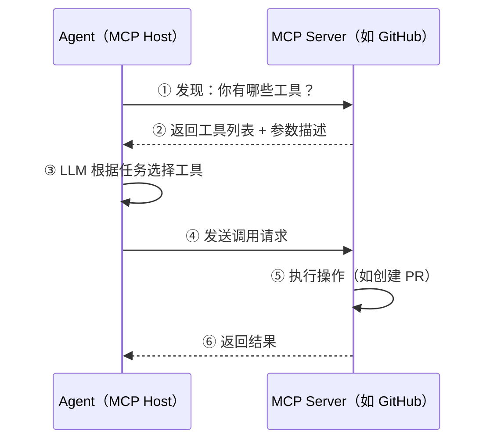

### Skills：Agent 的"方法论手册"

MCP 给 Agent **能力**（"能访问什么"），Skills 教 Agent **方法**（"怎么做"）。Skill 的本质是把经验沉淀为可复用的工作流模板。

### Skills vs MCP：互补而非替代

2025-2026 年社区出现了一个趋势：**越来越多团队优先使用 Skills 而非 MCP 来扩展 Agent 能力**。但这不是"抛弃 MCP"——两者解决的是完全不同层面的问题：

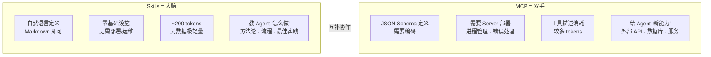

| 维度 | Skills | MCP |
|------|--------|-----|
| **本质** | 知识注入（"怎么做"） | 能力扩展（"能做什么"） |
| **载体** | Markdown 文本 | JSON-RPC Server |
| **部署** | 放个文件即可 | 需要启动/管理进程 |
| **维护成本** | 极低 | 中-高 |
| **Token 消耗** | 极低（渐进加载） | 中等（工具描述预注入） |
| **人类可编辑** | 自然语言，任何人都能写 | 需要开发能力 |
| **适合场景** | 工作流、SOP、代码审查清单、调试方法 | GitHub/Jira/数据库/浏览器集成 |

**为什么 Skills 趋势上升？** 因为 Skills 用自然语言定义工作流，天然适合人-Agent 协作：人写方法论、Agent 执行。这比为每个工作流都开发一个 MCP Server 高效得多。

**最佳实践：Skills + MCP 组合使用**。例如"代码审查"工作流：Skill 定义审查清单和流程（方法论），MCP 连接 GitHub 读取 PR diff 和提交评论（能力）。

### 快速决策树

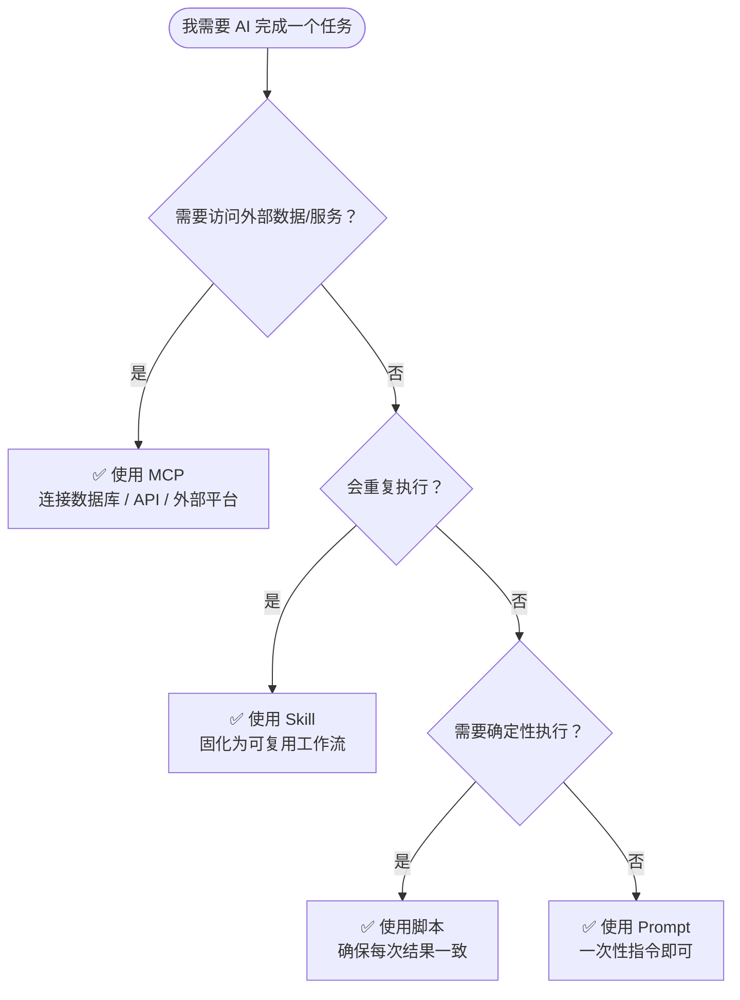

### Less is More：工具不是越多越好

给 Agent 配置的工具越多，效果不一定越好。原因：

- **上下文膨胀**：每个工具描述都占 token，挤压有用的上下文空间
- **决策混乱**：面对 50 个工具，模型更难选对正确的那个
- **延迟增加**：工具发现和选择的开销随数量增长

**实用建议**：只配置当前任务需要的工具；优先用 CLI/脚本解决能解决的问题；MCP 留给真正需要标准化集成的外部服务。

> 📖 MCP 协议细节、Skill 开发入门、工具生态对比见 👉 [附录：MCP 与 Skills 详解](./reference-mcp-and-skills.md)
>
> 🧩 热门 Skills 框架与资源推荐见 👉 [README · Agent Skills 资源推荐](../../README.md#-agent-skills-资源推荐)

---

## 5. Planning 与多 Agent 协作

### 规划循环

优秀的 Agent 面对复杂任务时会：

1. **拆解子任务**：分析需求 → 设计数据模型 → 实现逻辑 → 写测试
2. **标记依赖**：哪些可以并行、哪些必须串行
3. **定义完成条件**：每个子任务怎样算"做完了"
4. **执行中反思**：测试失败？分析原因，调整方案，不在同一个错误上打转

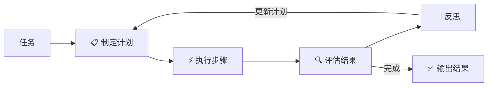

#### 评估与终止：Agent 怎么知道自己做完了

Agent 没有"工作软件"的内在概念。它依赖确定性系统来锚定自己的概率输出：

- **测试套件**：跑 `npm test` / `pytest`，通过 = 完成，失败 = 继续修
- **反思机制**：测试失败后强制 LLM 先分析原因再修改，避免盲目重试
- **熔断器**：超过最大迭代次数（如 5-7 次）仍未通过，自动停止并汇报

```python
def verify_and_terminate(max_iterations=5):
    for i in range(max_iterations):
        result = run_command("npm test")
        if result.exit_code == 0:
            return {"status": "success", "iterations": i + 1}

        # 强制反思后再修改
        llm_response = llm.call(f"测试失败: {result.stderr}\n先分析原因，再修复。")
        apply_fixes(llm_response.tool_calls)

    return {"status": "failed", "message": f"尝试 {max_iterations} 次后仍未通过"}
```

### 多 Agent 协作

复杂任务靠单个 Agent 容易失控，多 Agent 通过角色分工提升可靠性：

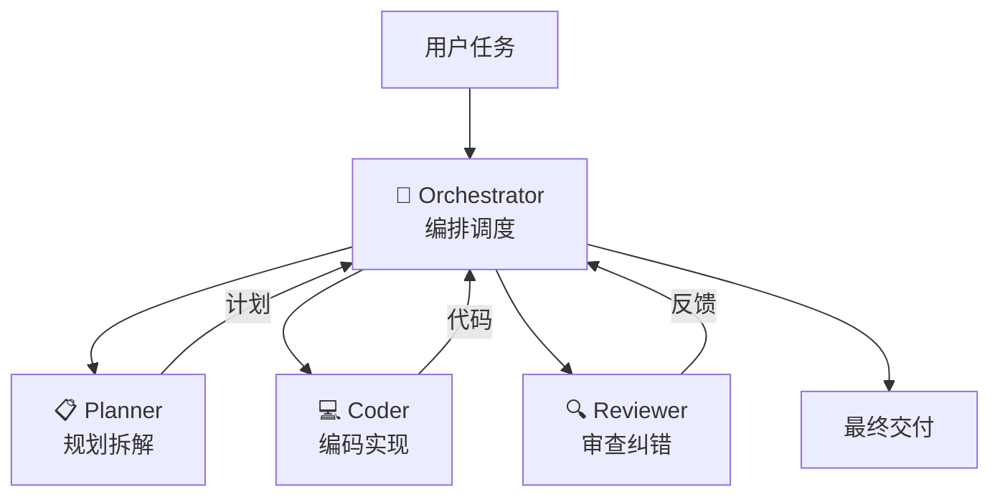

**Planner-Worker 架构**：强推理模型（如 Opus）负责规划，快速模型（如 Haiku）负责执行单个子任务。Planner 不写代码，Worker 不做全局规划——各司其职，减少出错。

### 什么时候用多 Agent？

| 场景 | 推荐 |
|------|------|
| 单个小 bug 修复 | 单 Agent |
| 中等功能开发 | 单 Agent + 分阶段执行 |
| 大型重构 / 多模块修改 | 多 Agent 并行 + Orchestrator |
| 高风险操作（生产环境） | 多 Agent 互审 + 人工把关 |

### 黑盒 vs 人工监督

**推荐做法**：复杂任务先让 Agent 出计划（Plan），你审批后再执行（Act）。这不是"不信任 Agent"，而是工程级别的安全实践。

---

## 6. 人机协同：从"能用"到"好用"

### Harness 工程：真正的杠杆不在模型

**Harness 工程**是 2025-2026 年兴起的概念——不是优化模型本身，而是设计围绕模型的系统层：提示设计、工具编排、验证循环、状态追踪。

实证：LangChain 团队仅通过改进 Harness（自验证、上下文注入、故障检测），**没有换模型**，就把编码 Agent 从排行榜 Top 30 提升到 Top 5。

> **Agent 效果 = 模型能力 × Harness 质量。** 模型能力是基线，Harness 是放大器。

### 为什么 Agent 有时很聪明，有时很蠢？

答案通常不是"模型变笨了"，而是：

| 影响因素 | 表现 | 你能做什么 |
|----------|------|-----------|
| **上下文质量** | 信息太杂/太少/自相矛盾 | 只给最相关的信息 |
| **任务描述** | 目标模糊、边界不清 | 用结构化指令 |
| **上下文过长** | 早期信息被"遗忘" | 分阶段任务，必要时重开会话 |
| **工具返回噪音** | 命令输出太长淹没关键信息 | 控制输出长度 |
| **指令冲突** | 规则文件与当前指令矛盾 | 确保配置文件内容一致 |

### Agent 七大失败模式速查

| # | 失败模式 | 解法 |
|---|---------|------|
| 1 | **上下文污染**：抓着旧结论不放 | 重开会话，精简上下文 |
| 2 | **Memory 污染**：错误偏好不断重复 | 审查并清理 Memory 文件 |
| 3 | **长任务漂移**：忘记原目标 | 分阶段执行，定期总结 |
| 4 | **并行干扰**：多 Agent 改同一片代码 | 划清文件边界 |
| 5 | **stdout 吞 token**：成本暴涨 | 只保留关键输出 |
| 6 | **环境假设错误**：假设错误的工具链版本 | 在指令中声明环境信息 |
| 7 | **权限失控**：执行超预期危险操作 | 根据任务风险调节权限 |

### Token 节约技巧

| 技巧 | 预期节省 |
|------|---------|
| 控制命令输出 `\| head -50`  | 30-70% |
| 分阶段任务，每次只带必要上下文 | 40-60% |
| 用 Skill 替代巨型 Prompt | 50-80% |
| 简单任务用 Haiku/Sonnet，复杂用 Opus | 60-80% |
| 利用 Prompt Cache | 50-90% |

### 人工引导 Agent 的核心技巧

| 技巧 | 做法 |
|------|------|
| **先分析再执行** | 要求 Agent 先给方案，你审批后再执行 |
| **拆解复杂需求** | "先做数据层→再做逻辑层→最后做 UI" |
| **设置完成条件** | "运行 `npm test`，全部通过才算完成" |
| **分阶段回报** | 每完成一个子任务就检查结果 |
| **控制变更范围** | "只修改 src/auth/ 目录下的文件" |

### Agentic Coding vs Vibe Coding

| 维度 | Agentic Coding | Vibe Coding |
|------|---------------|-------------|
| **理解** | 开发者理解代码变更的影响 | "先让它写出来再说" |
| **验证** | 每次变更都通过测试确认 | "跑一下没报错就行" |
| **责任** | 开发者对结果负责 | 责任模糊，出错怪 AI |

**Agentic Coding 的核心态度**：Agent 帮你执行，但你对结果负责。

> 📖 技术演进（从 ChatGPT 到 Agent OS 的六个阶段）见 👉 [附录：技术演进六阶段详解](./reference-agent-evolution.md)
>
> 📖 人机协同的更多方法论见 👉 [附录：人机协同与 Agent 优化指南](./reference-human-agent-collaboration.md)

---

## 本章总结

| 核心概念 | 一句话总结 |
|----------|-----------|
| **Agent** | 不是更聪明的模型，是围绕 LLM 构建的任务执行系统 |
| **Agent-LLM 交互** | 本质是 while 循环 + 精心构造的 API payload |
| **Memory** | 越精准越好，不是越多越好 |
| **Tools/MCP** | Agent 的双手和标准接口，Less is More |
| **Skills** | 把经验沉淀为可复用的方法论模板（大脑），与 MCP（双手）互补 |
| **Planning** | 先规划再执行，反思后迭代，测试驱动终止 |
| **Harness** | 围绕模型的系统层设计，是效果的真正放大器 |

### 三条核心原则

1. **Agent 的表现 = 模型能力 × 上下文质量 × 任务结构清晰度** —— 后两者在你手中
2. **Less is More** —— 精简的工具、精准的上下文、清晰的任务描述，比堆砌更有效
3. **人在环里** —— Agent 是高效协作者，不是自动驾驶；你负责判断和验收

---

下一章：[Chapter 3 · Agent 实战技巧 Playbook](../ch03-playbook/part-3-playbook.md)
