# Chapter 2 · Agent 运作原理与核心概念

> 目标：帮你建立一套完整的 Agent 心智模型——不只是"能用"，而是"知道它在干什么、为什么有时聪明有时蠢、怎么让它更好用"。

在 Part 1 中，你已经跑通了一个 Agent，看到它能读代码、改文件、跑命令。但你可能心里还有很多问号：它背后到底在做什么？为什么有时候一次搞定，有时候反复犯错？那些 MCP、Skill、ReAct 又是什么？

本章会用「每个概念 + 立刻告诉你这对你意味着什么」的方式，帮你从"会用"走向"懂用"。

---

## 1. Agent 的本质：一张图搞懂

### Agent ≠ 更聪明的模型

很多人把 Agent 等同于"更强的 ChatGPT"，这是最常见的误解。实际上：

- **LLM**（大语言模型）是"大脑"——负责理解、推理、生成
- **Agent** 是围绕这个大脑构建的"任务执行系统"——负责规划、记忆、调用工具、持续迭代

用一个公式表达：

> **Agent = LLM + Memory + Tools + Planning**

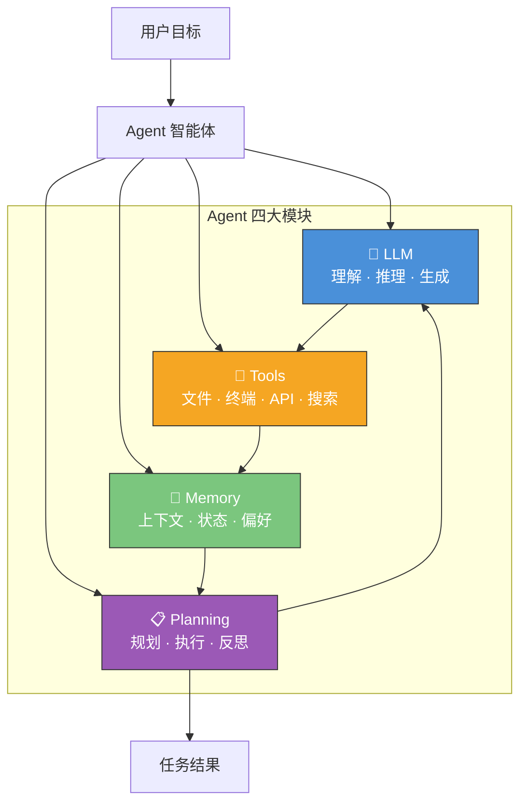

### LLM vs Agent：本质区别

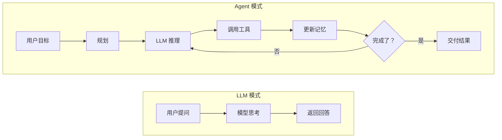

| 维度 | LLM | Agent |
|------|-----|-------|
| 核心模式 | 输入 → 输出（一问一答） | 目标 → 循环 → 完成 |
| 是否行动 | 通常不会 | 会调用工具、执行命令 |
| 是否记忆 | 仅当前对话窗口 | 短期 + 长期记忆 |
| 是否规划 | 有限 | 主动拆解任务、分步执行 |
| 失败处理 | 一次性回答 | 观察结果 → 反思 → 重试 |

### Agent 的核心闭环：Think → Act → Observe

无论用的是 Claude Code、Codex 还是 Cursor，所有 Agent 的工作本质都是同一个循环：

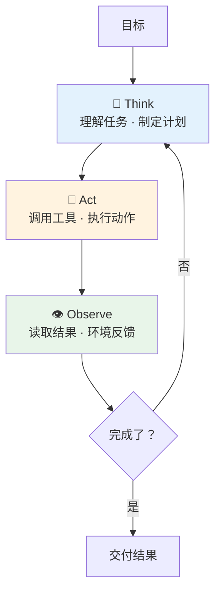

**你的第一个认知升级**：当你对 Agent 说"帮我重构这段代码并补上测试"，它不是一次性生成答案，而是在内部跑了这个循环很多次——先读代码理解结构，再规划修改方案，然后逐步执行修改、运行测试、根据测试结果修复问题，直到通过。

### 自主性光谱：Agent 不是非黑即白

Agent 并不是"要么全自动、要么全手动"，而是存在一个自主性光谱：

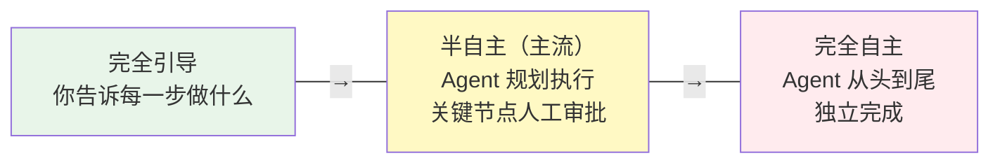

目前主流的 Coding Agent（Claude Code、Codex、Cursor）大多工作在**半自主**区间：Agent 自己规划和执行，但在关键操作（如写入文件、执行危险命令、推送代码）时请求你确认。

### 产品实例：Claude Code 与 Opus 4.6 的关系

以你在 Part 1 中使用的 Claude Code 为例：

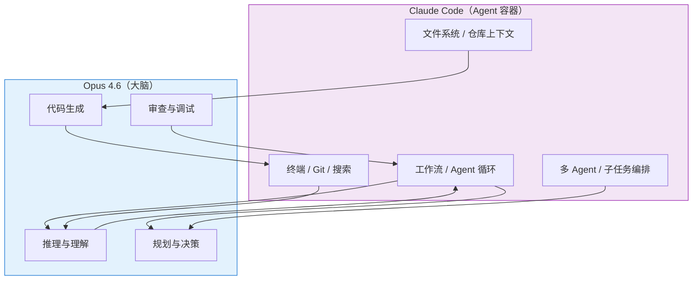

一句话总结：**Claude Code 是 Agent 容器（壳 + 工具 + 工作流），Opus 4.6 是其中的大脑（推理 + 编码 + 规划）。** 同理，Codex CLI 之于 GPT-5.x、Gemini CLI 之于 Gemini 3 Pro，都是这个关系。

---

## 2. LLM：Agent 的大脑——能力与局限

LLM 是 Agent 的核心驱动力，但它不是万能的。理解它的能力边界，是用好 Agent 的前提。

### LLM 在 Agent 中做什么

| 职责 | 具体表现 |
|------|----------|
| **理解意图** | 从你的自然语言中提取真正的目标 |
| **推理规划** | 把复杂任务拆解成可执行的步骤 |
| **生成代码** | 写代码、改代码、补测试 |
| **工具决策** | 判断何时调用什么工具、传什么参数 |
| **结果评估** | 分析工具返回的结果，决定下一步 |

### 推理方法：Agent 是怎么"想"的

现代 Agent 使用的推理方法，主要源自几篇关键论文。值得注意的是，2025-2026 年的旗舰模型（Claude Opus 4.6、GPT-5.4、Gemini 3 Pro 等）已经把推理能力内置到模型本身（Extended Thinking / 思考 token），不再需要显式地用框架实现这些方法——但理解它们的原理仍然很重要。

#### Chain-of-Thought（CoT）—— 逐步推理（2023, Wei et al.）

让模型"一步步想"，而不是直接跳到答案。这就像让一个工程师先在白板上画思路，再动手写代码。

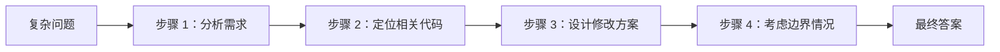

#### ReAct（Reasoning + Acting）—— 边想边做

ReAct 是目前大多数 Coding Agent 的底层范式。它的核心是：**不要想完再做，而是想一步、做一步、看一步。**

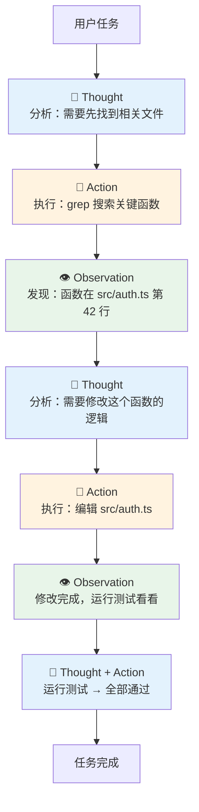

#### Reflexion —— 反思学习

当 Agent 犯错时，不只是重试，而是先反思"为什么错了"，再调整策略。

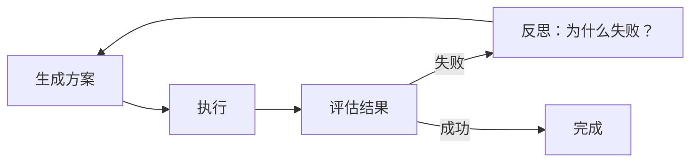

### 为什么 Agent 有时很聪明，有时很蠢？

这是每个 Agent 用户都会遇到的困惑。答案通常不是"模型变笨了"，而是以下因素在影响：

| 影响因素 | 表现 | 你能做什么 |
|----------|------|-----------|
| **上下文质量** | 给的信息太杂/太少/自相矛盾 | 只给完成当前任务最相关的信息 |
| **任务描述** | 目标模糊、边界不清 | 用"先分析再执行"的结构化指令 |
| **代码组织** | 项目结构混乱、命名不规范 | 维护好项目的 README 和目录结构 |
| **上下文过长** | 对话太长导致早期信息被"遗忘" | 分阶段任务，必要时重开会话 |
| **工具返回噪音** | 命令输出太长淹没关键信息 | 控制输出长度，只保留关键结果 |
| **指令冲突** | 规则文件与当前指令矛盾 | 确保 CLAUDE.md 等配置文件内容一致 |

> **核心认知**：Agent 的表现 = 模型能力 × 上下文质量 × 任务结构清晰度。模型能力你无法控制，但后两者完全在你手中。

---

## 3. Memory：上下文是 Agent 的命脉

Memory（记忆）决定了 Agent 能"记住"多少——它直接影响 Agent 能处理多复杂的任务、能保持多长时间的连贯性。

### 三种记忆类型

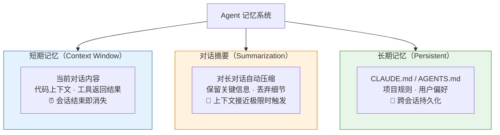

### 认知记忆架构

从认知科学的角度，Agent 的记忆可以对应人类大脑的四种记忆：

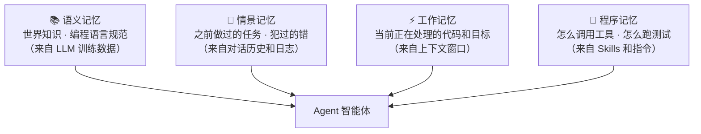

### 上下文 ≠ 越多越好

新手最容易犯的错是"一股脑把所有信息塞给 Agent"，觉得信息越全越安全。现实往往相反：

| 问题 | 症状 | 解法 |
|------|------|------|
| **重要信息被淹没** | Agent 忽略了你明确给的指令 | 精简上下文，突出关键信息 |
| **矛盾指令变多** | Agent 的行为前后不一致 | 检查规则文件是否自相矛盾 |
| **过拟合噪音** | Agent 对无关细节投入过多注意力 | 只给完成当前目标最相关的信息 |

> **黄金原则：不是"尽可能多给"，而是"只给完成当前目标最相关的高密度信息"。**

### 上下文污染与漂移：Agent 变蠢的常见原因

#### 上下文污染

Agent 一直抓着旧结论不放，或被无关日志带偏。

**常见原因**：贴了太多过时信息、指令冲突、规则文件太长且自相矛盾

**解法**：
- 重开一个干净会话
- 只保留当前任务的必要背景
- 把长期规则和临时任务背景分离

#### Memory 污染

Agent 学到了错误偏好，并在后续任务里不断重复。

**常见原因**：随手让 Agent "记住"只适用于单次任务的策略、自动记忆缺乏清理

**解法**：
- 定期审查 CLAUDE.md / Memory 文件
- 区分"永久规则"和"本次任务偏好"
- 发现错误记忆立即清理

#### 长任务漂移

任务一长，Agent 忘记原目标，开始优化细枝末节或跑题。

**解法**：
- 不要用一句话描述一个两小时的任务
- 分阶段执行：先出计划 → 每阶段结束做总结 → 明确下一阶段完成条件
- 必要时重开会话，带上前阶段摘要

> 📖 Memory 的深度技术细节（认知架构演进、向量数据库 RAG、Memory 强化学习）见 👉 [附录：Memory 与上下文工程详解](./reference-memory-and-context.md)

---

## 4. Tools、MCP 与 Skills：Agent 的手脚

Agent 光有"大脑"不够，还需要"手脚"来与真实世界交互。工具系统决定了 Agent 能做什么、做得多好。

### 三层行动空间

Agent 的行动能力可以分为三层，从近到远：

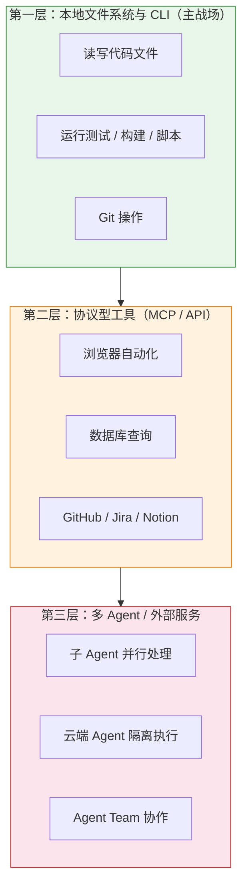

**实用原则**：先把第一层打磨好，再考虑第二层和第三层。如果 Agent 连"读懂和修改当前项目"都不稳定，再复杂的 MCP 也帮不了你。

### 工具调用：Agent 如何"动手"

当 Agent 决定需要使用工具时，内部流程是这样的：

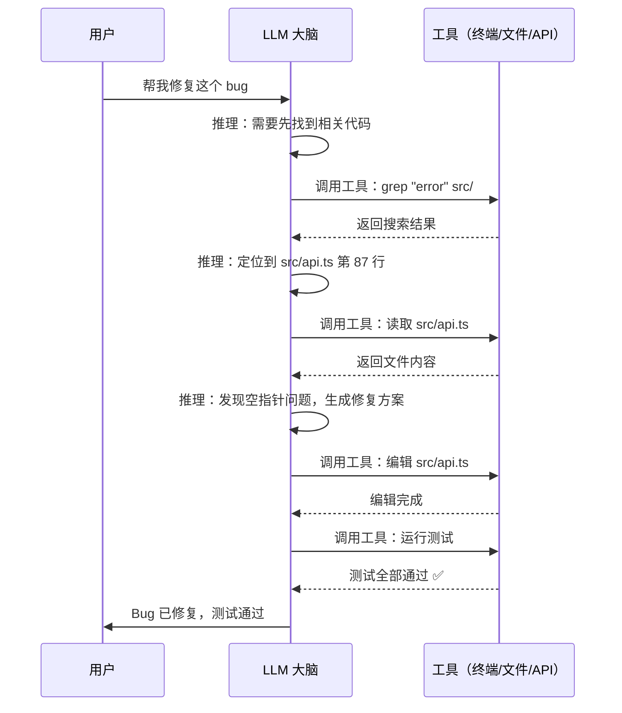

关键在于步骤 2——**LLM 需要在有限上下文中准确判断：该不该调用工具？调用哪个？传什么参数？** 这也是 Agent 出错的高发区。

### MCP：Agent 的"USB-C 接口"

**MCP（Model Context Protocol）** 最初由 Anthropic 提出，2025 年底捐赠给 Linux Foundation，现已成为行业中立的标准化工具集成协议（OpenAI、Google、Microsoft 等均已支持）。它不是模型，不是 Agent，而是 **Agent 与外部能力之间的连接标准**。

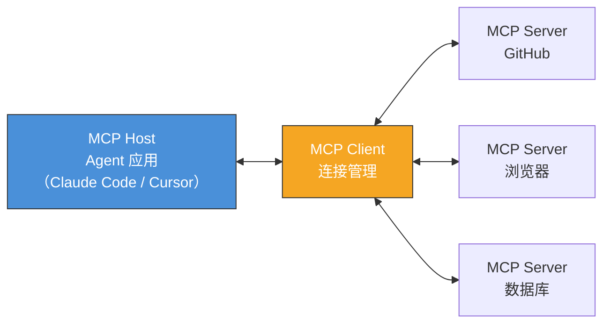

**为什么需要 MCP？** 如果没有标准协议，每接一个外部能力都要做一套私有集成——不同工具不同接口、不同权限模型、不同返回格式。MCP 的价值就是把"接能力"这件事标准化，就像 USB-C 统一了充电和数据传输接口。

#### MCP 工作流程

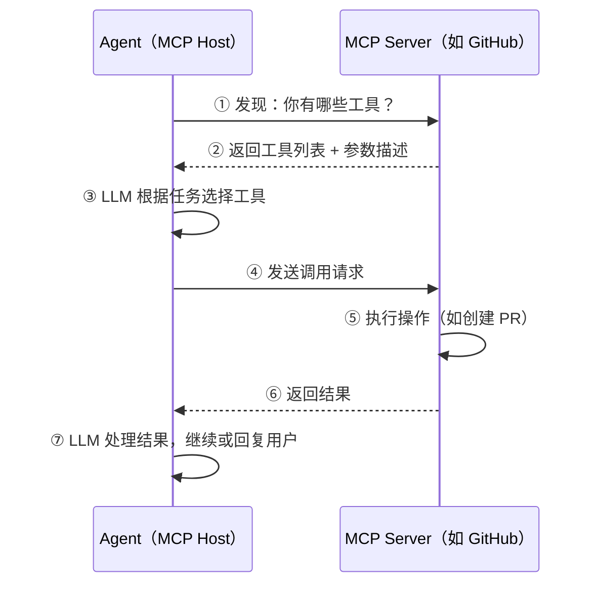

#### 本地 MCP vs 远程 MCP

| 类型 | 适用场景 | 示例 |
|------|----------|------|
| **本地 MCP** | 对数据出域敏感、低延迟 | 本地文件系统、本地数据库、本地浏览器 |
| **远程 MCP** | 团队共享、需要集中鉴权 | GitHub、Jira、知识库、设计平台 |

### Skills：Agent 的"方法论手册"

如果 MCP 是给 Agent **能力**（"能访问什么"），那 Skills 就是教 Agent **方法**（"怎么做"）。

**Skill 的本质是把经验沉淀为可复用的工作流模板**，让 Agent 遵循经过验证的最佳实践，而不是每次都从零开始"自由发挥"。

#### Skill 的三层加载机制

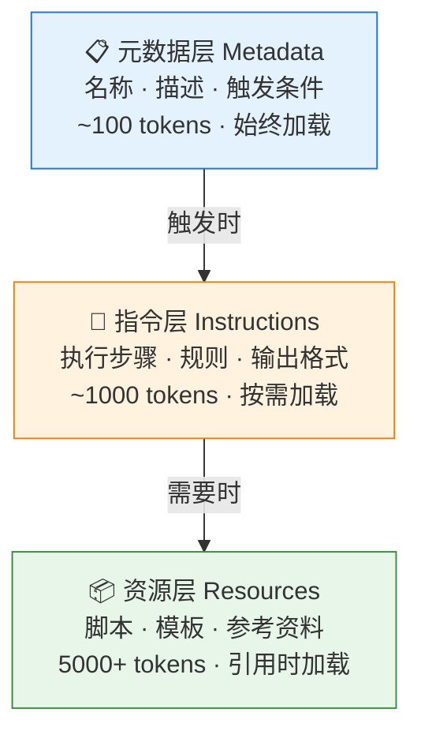

**为什么这很重要？** 传统做法是把所有指令写进一个巨大的 Prompt（可能 40,000 tokens），每次对话都全量加载。Skill 通过渐进式加载（progressive disclosure），只在需要时才加载相关内容，大幅节省 token 消耗。

### Skill / MCP / 插件 / 脚本：到底用哪个？

| 形态 | 核心价值 | 类比 | 适合场景 |
|------|----------|------|----------|
| **Skill** | 复用经验和流程 | 方法论手册 | 重复性工作流、标准化流程、团队 SOP |
| **MCP** | 暴露外部能力和数据源 | USB-C 接口 | 浏览器、数据库、GitHub、知识库 |
| **插件** | 产品层集成和体验封装 | 应用扩展 | IDE 集成、客户端功能增强 |
| **脚本** | 确定性自动化动作 | 命令工具 | 格式化、测试、构建、批处理 |

#### 快速决策树


### Less is More：工具不是越多越好

这是一个反直觉但极其重要的原则：**给 Agent 配置的工具/Skill 越多，效果不一定越好，甚至可能变差。**

原因：
- **上下文膨胀**：每个工具的描述都要占 token，工具太多会挤压真正有用的上下文空间
- **决策混乱**：面对 50 个工具，模型更难选对那个正确的
- **延迟增加**：工具发现和选择的开销随数量增长

**实用建议**：
- 只配置当前任务真正需要的工具
- 优先用 CLI/脚本解决能解决的问题
- MCP 留给真正需要标准化集成的外部服务

> 📖 MCP 协议细节、Skill 开发入门、插件生态对比见 👉 [附录：MCP 与 Skills 详解](./reference-mcp-and-skills.md)
>
> 🧩 热门 Skills 框架与资源推荐见 👉 [README · Agent Skills 资源推荐](../../README.md#-agent-skills-资源推荐)

---

## 5. Planning 与多 Agent 协作

Agent 不只是"接到任务就乱做"，优秀的 Agent 会先规划、再执行、遇到问题会反思调整。

### 规划循环

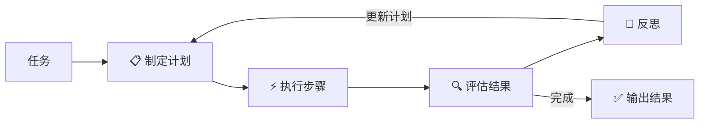

实际工作中，这意味着一个好的 Agent 在面对"给这个项目加上用户认证功能"时，会：

1. **拆解子任务**：分析需求 → 设计数据模型 → 实现认证逻辑 → 添加路由 → 写测试
2. **标记依赖**：哪些子任务可以并行、哪些必须串行
3. **定义完成条件**：每个子任务怎样算"做完了"
4. **执行中反思**：测试失败了？分析原因，调整方案，不在同一个错误上打转

### 多 Agent 协作

复杂任务靠单个 Agent 容易失控，多 Agent 通过角色分工提升可靠性：

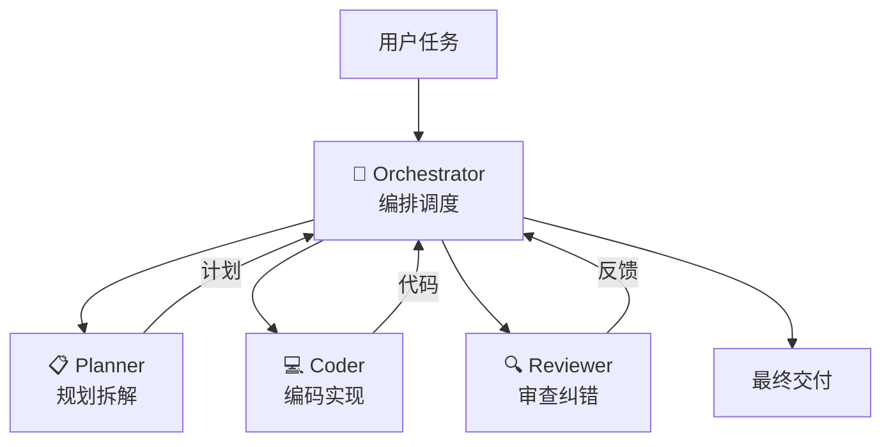

**Agent Team 互审模式**：多个 Agent 像"对手团队"（team of rivals）一样互相检查——Planner 负责规划、Coder 负责执行、Reviewer 负责审查。错误在早期就被发现，而不是积累到最后爆发。

### 黑盒 vs 人工监督 PlanAct

| 模式 | 特点 | 风险 |
|------|------|------|
| **黑盒自治** | Agent 完全自主，隐藏推理过程 | 调试难、合规难、长流程易失控 |
| **人工监督 PlanAct** | 先规划 → 人工审核 → 再执行 | 更安全、可解释、可中断 |

**推荐做法**：复杂任务先让 Agent 出计划（Plan），你审批后再执行（Act）。这不是"不信任 Agent"，而是工程级别的安全实践。

### 什么时候需要多 Agent？

| 场景 | 推荐 |
|------|------|
| 单个小 bug 修复 | 单 Agent 就够 |
| 中等功能开发 | 单 Agent + 分阶段执行 |
| 大型重构 / 多模块修改 | 多 Agent 并行 + Orchestrator |
| 高风险操作（生产环境） | 多 Agent 互审 + 人工把关 |

---

## 6. 技术演进：从 ChatGPT 到 Agent OS

理解 Agent 不是突然出现的——它是技术逐步演进的产物。了解这条脉络，能帮你判断当前技术的成熟度和局限性。

### 六个阶段一览

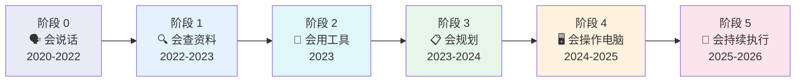

| 阶段 | 核心能力 | 代表技术/产品 | 解决了什么 | 还差什么 |
|------|----------|--------------|-----------|---------|
| **0. 会说话** | 自然语言问答 | GPT-3, ChatGPT | 能和人对话 | 不联网、不能行动 |
| **1. 会查资料** | 检索增强（RAG） | 向量数据库、联网搜索 | 接入外部知识 | 只能回答，不能做事 |
| **2. 会用工具** | Function Calling | ChatGPT Plugins, API 调用 | 首次有了"行动能力" | 单步调用，多步易失败 |
| **3. 会规划** | ReAct、Planning | AutoGPT, Agent 框架 | 能拆任务、做闭环 | 依赖 API，遇 GUI 就卡 |
| **4. 会操作电脑** | Computer Use | Claude Computer Use, Operator | 可直接操作界面 | 稳定性不足、成本高 |
| **5. 会持续执行** | Agent OS | Coding Agent, Agent Team | 长期运行、本地部署 | 仍需人工监督和护栏 |

### 每个阶段为什么会进入下一个？

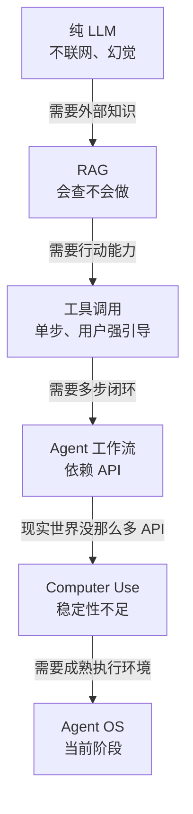

### 当前阶段的关键认知

我们正处于**阶段 5 的早期**。这意味着：

- Agent 已经具备从理解到执行的完整能力链
- 但**稳定性、安全性、成本控制**仍是核心挑战
- 竞争重心从**模型能力**转向**系统工程能力**（上下文管理、工具编排、状态持久化）
- **Harness 工程**（围绕模型的系统层设计）比模型选择更决定最终效果

> 📖 每个阶段的详细解析、里程碑时间线和代表性论文/产品见 👉 [附录：技术演进六阶段详解](./reference-agent-evolution.md)

---

## 7. 人机协同：从"能用"到"好用"

掌握了 Agent 的原理后，最终目标是**让 Agent 真正帮你提效**。这一节讲的是实战中最重要的优化策略。

### Harness 工程：真正的杠杆不在模型

2025-2026 年兴起了一个新概念：**Harness 工程**——不是优化模型本身，而是设计围绕模型的"马具"（系统层），包括提示设计、工具编排、验证循环、状态追踪。

一个真实案例：LangChain 团队仅通过改进 Harness（自验证、上下文注入、故障检测），**没有换模型**，就把编码 Agent 从排行榜 Top 30 提升到 Top 5。

```mermaid
flowchart TB
    subgraph Harness["Harness 工程（你能控制的）"]
        INS["📜 Instructions<br/>清晰的指令和规则"]
        CTX["📂 Context Assembly<br/>精准的上下文组装"]
        VER["✅ Verification<br/>自动化验证和恢复"]
        TRK["📊 Tracking<br/>追踪和可观测性"]
    end

    subgraph Model["模型层（你不能控制的）"]
        M["LLM 推理能力"]
    end

    Harness --> Model
    Model --> Output["Agent 输出质量"]
    Harness --> Output

    style Harness fill:#e8f5e9,stroke:#388e3c
    style Model fill:#f5f5f5,stroke:#999
```

> **关键洞察：Agent 效果 = 模型能力 × Harness 质量。** 模型能力是基线（选对模型很重要），但 Harness 是真正的放大器。2026 年，成功的 Agent 项目 90% 取决于 Harness 与协同设计，而非单纯模型能力。

### Agent 的七大失败模式

学 Agentic Coding，真正的分水岭不是第一次成功，而是**第一次失败后你能不能看懂它为什么失败**。

| # | 失败模式 | 症状 | 根因 | 解法 |
|---|---------|------|------|------|
| 1 | **上下文污染** | Agent 抓着旧结论不放 | 信息过时、指令冲突 | 重开会话，精简上下文 |
| 2 | **Memory 污染** | 错误偏好不断重复 | 错误规则被持久化 | 审查并清理 Memory 文件 |
| 3 | **长任务漂移** | 忘记原目标，纠结细节 | 任务太大、缺乏阶段性检查 | 分阶段执行，定期总结 |
| 4 | **并行干扰** | 多 Agent 修改同一片代码 | 职责边界不清 | 划清并行任务的文件边界 |
| 5 | **stdout 吞 token** | 成本暴涨，质量下降 | 命令输出全量塞入上下文 | 只保留错误摘要和关键结果 |
| 6 | **环境假设错误** | Agent 假设错误的工具链版本 | 本地环境未在上下文中说明 | 在指令中声明环境信息 |
| 7 | **权限失控** | 执行超预期的危险操作 | 权限粒度太粗 | 根据任务风险动态调节权限 |

### Token 节约实战技巧

Token = 成本 + 上下文质量。省 token 不只是省钱，更是提升 Agent 表现。

| 技巧 | 说明 | 预期节省 |
|------|------|---------|
| **控制命令输出** | 给 Agent 的命令加 `\| head -50` 或 `\| tail -20` | 30-70% |
| **分阶段任务** | 大任务拆成多个小会话，每次只带必要上下文 | 40-60% |
| **Skill 渐进加载** | 用 Skill 替代巨型 Prompt，按需加载 | 50-80% |
| **摘要替代全文** | 让 Agent 总结阶段成果，丢弃中间细节 | 30-50% |
| **选对模型** | 简单任务用 Haiku/Sonnet，复杂任务用 Opus | 60-80% |
| **利用缓存** | 利用 Prompt Cache（重复前缀自动折扣） | 50-90% |

### 大型项目中如何高效使用 Agent

当项目有成百上千个文件时，Agent 不可能把所有文件都读进上下文。关键是帮 Agent **快速定位**：

1. **维护好入口文件**：README.md、CLAUDE.md 应该包含项目结构、核心模块和启动命令
2. **渐进式上下文**：先让 Agent 读目录结构和入口文件，再按需深入具体模块
3. **规则分层**：全局规则放 `~/.claude/settings.json`，项目规则放项目根目录的 `CLAUDE.md`
4. **任务聚焦**：每次任务只涉及一个明确的模块或功能，不要一次改太多

### 人机协同的核心方法论

Agent 不是"自动驾驶"，而是"高效协作者"。最佳的人机协同模式是：

```mermaid
flowchart LR
    H["👤 人类负责"] --> D["判断 · 决策 · 创意 · 验收"]
    A["🤖 Agent 负责"] --> E["速度 · 规模 · 执行 · 迭代"]
    D --- Collab["协同区间"]
    E --- Collab
    Collab --> Result["高质量交付"]
```

**人工引导 Agent 的核心技巧**：

| 技巧 | 具体做法 |
|------|---------|
| **先分析再执行** | 要求 Agent 先给出方案/计划，你审批后再执行 |
| **拆解复杂需求** | 把"做一个完整功能"拆成"先做数据层→再做逻辑层→最后做UI" |
| **设置完成条件** | 明确告诉 Agent "做完后运行 `npm test`，全部通过才算完成" |
| **分阶段回报** | 每完成一个子任务就检查结果，不要放任跑到底 |
| **控制变更范围** | 告诉 Agent "只修改 src/auth/ 目录下的文件" |
| **错了及时止损** | 发现方向错误立即叫停，重开会话从正确方向开始 |

### Agentic Coding vs Vibe Coding

社区中有一个术语叫 **Vibe Coding**（氛围编码）：开发者不真正理解代码意图，把大量生成的代码当作黑箱堆砌，"看起来能跑就接受"。

| 维度 | Agentic Coding | Vibe Coding |
|------|---------------|-------------|
| **理解** | 开发者理解问题和代码变更的影响 | "先让它写出来再说" |
| **验证** | 每次变更都通过测试/build 确认 | "跑一下没报错就行" |
| **责任** | 开发者对结果负责，Agent 是协作者 | 责任模糊，出错怪 AI |

**Agentic Coding 的核心态度是**：Agent 帮你执行，但你对结果负责。理解这一点，才能真正把 Agent 用好，而不是变成"AI 出错了我也不知道为什么"的被动角色。

> 📖 人机协同的更多方法论和实战案例见 👉 [附录：人机协同与 Agent 优化指南](./reference-human-agent-collaboration.md)

---

## 本章总结

| 核心概念 | 一句话总结 |
|----------|-----------|
| **Agent** | 不是更聪明的模型，是围绕 LLM 构建的任务执行系统 |
| **LLM** | Agent 的大脑，负责理解、推理、生成、工具决策 |
| **Memory** | Agent 的命脉，越精准越好，不是越多越好 |
| **Tools/MCP** | Agent 的手脚和标准接口，Less is More |
| **Skills** | 把经验沉淀为可复用的方法论模板 |
| **Planning** | 先规划再执行，反思后迭代 |
| **Harness** | 围绕模型的系统层设计，是效果的真正放大器 |

### 你现在应该记住的三条原则

1. **Agent 的表现 = 模型能力 × 上下文质量 × 任务结构清晰度** —— 后两者在你手中
2. **Less is More** —— 精简的工具、精准的上下文、清晰的任务描述，比堆砌更有效
3. **人在环里** —— Agent 是高效协作者，不是自动驾驶；你负责判断和验收

---

下一章：[Chapter 3 · Agent 实战技巧 Playbook](../ch03-playbook/part-3-playbook.md)
