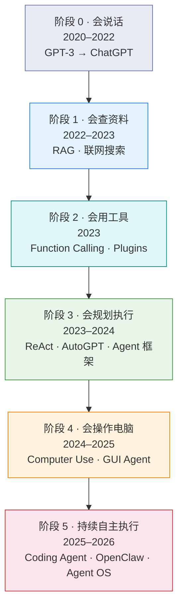
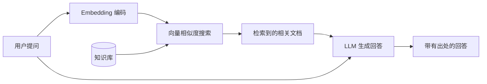
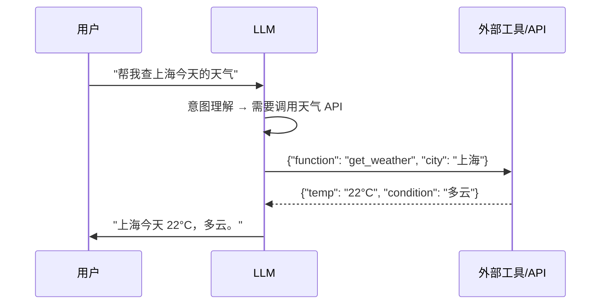
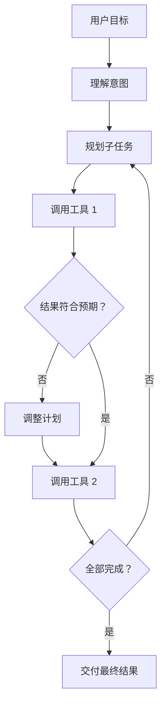
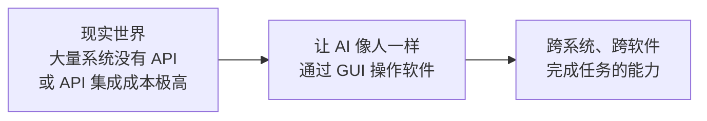

# 附录：技术演进六阶段详解

> 本文是 [Chapter 2 · Agent 运作原理与核心概念](./part-2-concepts.md) 的扩展附录，详细讲解从 LLM 到 Agent OS 的技术演进脉络。

---

## 演进总览

> **一句话总结**：业界先让模型"会说"，再让它"会查"，接着让它"会用工具"，然后让它"会规划执行"，最后让它"会操作电脑"和"持续自主运行"。

---

## 阶段 0：预训练大模型——"会说话的模型"

**时间：2020–2022**

这一阶段的核心突破是 Transformer 架构的大规模应用，使 LLM 具备了流畅的自然语言交互能力。

### 关键里程碑

| 时间 | 事件 | 意义 |
|------|------|------|
| 2020.06 | GPT-3 发布（175B 参数） | 证明 few-shot learning 的可行性 |
| 2021 | Codex 发布 | 首次证明 LLM 可以写代码 |
| 2022.03 | InstructGPT | RLHF 让模型真正"听话" |
| 2022.11 | ChatGPT 发布 | LLM 从研究工具变成大众产品 |

### 这个阶段的模型能做什么

- 问答、写作、总结、翻译、代码补全
- 本质上是"概率文本生成器"——给一段文本，预测下一个 token

### 为什么不够

- **不联网**：知识停留在训练数据截止日期
- **容易幻觉**：生成看似正确但实际错误的内容
- **不能行动**：只能输出文本，无法调用工具或修改文件
- **无记忆**：每次对话从零开始（除了对话历史在上下文窗口内）

> **行业认知转折**：ChatGPT 的爆火让所有人意识到——LLM 可以成为新的交互层，但"只会对话，不足以形成生产力闭环"。

---

## 阶段 1：检索增强——"会查资料"

**时间：2022–2023**

业界发现纯 LLM 有三个致命问题：知识过时、容易幻觉、无法访问企业私有数据。RAG（Retrieval-Augmented Generation）应运而生。

### 关键里程碑

| 时间 | 事件 | 意义 |
|------|------|------|
| 2020 | RAG 论文（Meta AI） | 提出检索增强生成的范式 |
| 2022-2023 | 向量数据库生态爆发 | Pinecone、Weaviate、Chroma 等 |
| 2023 | 联网搜索集成 | ChatGPT、Bing Chat 联网 |
| 2023 | 企业 RAG 方案兴起 | LangChain、LlamaIndex 等框架 |

### RAG 的核心思路

### 为什么不够

- 仍然是"查完再说"——没有行动能力
- 无法完成多步骤任务闭环
- 检索质量不稳定，容易"检索到不相关的内容"
- **本质局限**：模型从"封闭脑袋"变成了"能查资料的脑袋"，但还是只能回答问题

---

## 阶段 2：工具调用——"会用工具"

**时间：2023**

这是从 LLM 走向 Agent 的**第一个真正分水岭**：模型不再只是生成文本，而是可以输出结构化调用指令，让外部系统去执行。

### 关键里程碑

| 时间 | 事件 | 意义 |
|------|------|------|
| 2023.03 | ChatGPT Plugins | 首次让 LLM 调用第三方服务 |
| 2023.06 | OpenAI Function Calling | 结构化工具调用 API 标准化 |
| 2023.07 | Claude Tool Use | Anthropic 跟进 |
| 2023 | LangChain/LlamaIndex 工具链 | 框架层面的工具编排支持 |

### 工具调用的本质变化

**核心变化**：模型第一次不只是"生成答案"，而是可以把用户意图翻译成**结构化调用**——使用计算器、查数据库、调外部 API。AI 开始具备"行动接口"。

### 为什么不够

- 大多数仍是**单步调用**——一个问题，调一个工具
- 用户需要强引导（明确说"用 XX 工具做 YY 事"）
- 任务链条稍长就容易失败
- 缺少长期状态和任务规划

---

## 阶段 3：工作流与规划——"会拆任务、会执行流程"

**时间：2023–2024**

到这个阶段，业界开始真正讨论 **Agent**，而不只是"带工具的大模型"。模型不再只是"看到问题→调一个工具"，而是能把任务拆成多步，按步骤执行、检查、修正。

### 关键里程碑

| 时间 | 事件 | 意义 |
|------|------|------|
| 2022.10 | ReAct 论文 | 提出 Reasoning + Acting 统一范式 |
| 2023.03 | AutoGPT 开源 | 引爆 Agent 概念热潮（虽然不稳定） |
| 2023.04 | BabyAGI | 任务驱动型 Agent 框架 |
| 2023.10 | Reflexion 论文 | Agent 自我反思学习 |
| 2023-2024 | MetaGPT、AutoGen、CrewAI | 多 Agent 协作框架 |
| 2024.02 | Devin | 首个"AI 软件工程师"产品化尝试 |

### Agent 的完整定义成熟

此阶段 **Agent = LLM + Memory + Planning + Tool Use** 这一工程认知正式成熟：

### 代表现象

- AutoGPT 短暂爆火（证明了概念但稳定性不足）
- 各类垂直 Agent 出现：Coding Agent、Data Agent、Research Agent
- 企业级工作流编排产品涌现
- "多智能体协作"成为研究热点

### 为什么不够

- 强依赖预定义工具和 API
- 适合结构化数字世界，但遇到"没有 API、只有图形界面"的软件就卡住
- 长任务稳定性不足

---

## 阶段 4：Computer Use / GUI Agent——"会像人一样操作软件"

**时间：2024–2025**

这是从 Agent 到通用执行能力的关键升级。以前 AI 要干活必须有 API；现在即使没有 API，也能通过"看屏幕、点按钮、输入文字"像人一样操作软件。

### 关键里程碑

| 时间 | 事件 | 意义 |
|------|------|------|
| 2024.10 | Claude Computer Use（Beta） | 首个商业化的 Computer Use 能力 |
| 2025.01 | OpenAI Operator | 浏览器自动化 Agent（后并入 ChatGPT agent） |
| 2025 | 各种 Browser/Desktop Agent | Open Interpreter、Browser-Use 等 |

### 为什么业界要走这一步

这一步意味着 AI 从"数字接口层"进入了"软件操作层"。但稳定性、安全性、速度仍是重大挑战。

---

## 阶段 5：Coding Agent 与 Agent OS——"会持续执行"

**时间：2025–2026（当前阶段）**

这个阶段的核心不是某个模型能力的突破，而是一种**产品范式的变化**：AI 从"给建议的助手"变成"真正替你执行任务的代理系统"。

### 关键里程碑

| 时间 | 事件 | 意义 |
|------|------|------|
| 2025.02 | Claude Code 正式发布 | 端到端 Coding Agent 产品化 |
| 2025.05 | Codex-1（OpenAI） | 专为编码任务 RL 训练的模型 |
| 2025.05 | Gemini CLI | Google 进入 CLI Agent 赛道 |
| 2025.11 | Claude Code Agent Teams | 多 Agent 并行协作 |
| 2026.01 | GPT-5.3-Codex / GPT-5.4 | 编码能力统一到通用模型 |
| 2026.01 | OpenClaw 开源发布 | 首个"全自主生活 Agent"，60 天 250K+ GitHub Stars |
| 2026.02 | Cursor 2.0 SVFS | 多 Agent 虚拟文件系统 |
| 2026 | 各 Agent 工具 1M 上下文 | 超长上下文成为标配 |

### 这个阶段意味着什么

1. **从云端建议 → 本地执行**：Agent 在你的本地环境中真正操作代码
2. **从单次对话 → 持续任务**：Agent 可以运行数小时完成复杂工程任务
3. **从单模型 → 系统工程**：竞争焦点从模型能力转向系统工程（上下文管理、工具编排、状态持久化）
4. **从 Prompt Engineering → Context Engineering**：不再只是写好 Prompt，而是设计整个上下文生命周期

### OpenClaw：从 Coding Agent 到"全自主生活 Agent"

2026 年 1 月，奥地利开发者 Peter Steinberger 开源了 [OpenClaw](https://github.com/anthropics/openclaw)（原名 Clawdbot / Moltbot），它不只是一个 Coding Agent，而是一个**全自主生活代理**——通过 WhatsApp / Telegram 发一条消息，它就能执行 shell 命令、读写文件、浏览网页、发邮件、管理日历，并跨会话保持持久记忆。

**为什么 OpenClaw 值得关注：**

| 维度 | 传统 Coding Agent | OpenClaw |
|------|-------------------|----------|
| **交互方式** | 终端 / IDE | 即时通讯（WhatsApp / Telegram） |
| **能力范围** | 代码读写、测试、Git | 代码 + 邮件 + 日历 + 浏览器 + 任意 CLI |
| **运行环境** | 项目目录内 | 用户的整个数字生活 |
| **自主性** | 半自主，关键节点人工审批 | 高度自主，接近"全自动" |
| **记忆** | 会话内 + CLAUDE.md | 跨会话持久记忆（本地 Markdown 文件） |

**OpenClaw 的爆发式增长**：发布 48 小时内获得 10 万 GitHub Stars，60 天内突破 25 万 Stars（超越 React 的十年纪录），成为 GitHub 历史上增长最快的项目之一。

**但也暴露了严重的安全问题**：

- 超过 13.5 万个 OpenClaw 实例暴露在公网上，其中 1.5 万+ 存在远程代码执行漏洞
- 其插件市场 ClawHub 上 10,700 个 Skill 中，有 820+ 被发现是恶意的
- 2026 年 1 月发现 WebSocket 劫持漏洞（CVE-2026-25253，CVSS 8.8）

> **OpenClaw 的意义**：它代表了 Agent 从"编码工具"向"通用数字代理"的跃迁——Agent 不再只是帮你写代码，而是管理你的整个数字生活。但同时也证明了**Agent 安全和权限治理**是当前阶段最紧迫的挑战。这正是主文档中提到的"阶段 5 早期"的典型特征：能力已经到位，但安全和可靠性仍需大量工程投入。

### Context Engineering：从"写 Prompt"到"设计上下文"

2025-2026 年出现的一个重要概念转变：

| | Prompt Engineering | Context Engineering |
|---|---|---|
| **关注点** | 单次 Prompt 怎么写 | 整个上下文生命周期怎么管理 |
| **范围** | 输入文本 | 指令 + 工具结果 + 记忆 + 状态 |
| **目标** | 让模型给出好回答 | 让 Agent 持续高质量工作 |
| **关键技术** | 提示模板、Few-shot | 动态上下文组装、摘要压缩、渐进加载 |

---

## 为什么业界必然走这条路？五个驱动力

### 1. 用户需求从"问答"升级为"代办"

ChatGPT 时代，用户主要需要：帮我写、帮我解释、帮我总结。
现在用户需要：帮我改代码、帮我跑测试、帮我修 bug、帮我做完整功能。

需求从**信息获取**转向**任务完成**。

### 2. 企业要的是 ROI，不是"好玩"

企业真正愿意付费的是：节省人力、提高效率、替代重复劳动、形成业务闭环。所以行业从"更会聊天"转向"更会执行"。

### 3. API 世界不够大，GUI 世界才是真实世界

很多系统没有完美 API，或者接入成本高、权限难协调、维护复杂。但图形界面几乎无处不在。

### 4. 模型性能提升后，瓶颈转向"系统工程"

当模型能力达到一定水平后，制约 Agent 效果的不再是"模型够不够聪明"，而是上下文工程、规划质量、工具调用正确率、状态管理、安全与权限治理。

### 5. 开源推动了"个人化"Agent

开源项目（Claude Code 的工程层、Codex CLI、Gemini CLI 等）让开发者可以自己部署、在本地运行、围绕自身工作流定制，Agent 从"企业采购品"变成"开发者可组装系统"。

---

## 从演进看当下：你需要知道的判断

1. **我们还在早期**：Agent 已经有用，但远没有达到"完全自主可靠"的程度。任何声称 Agent 可以"无需人工监督"的说法，都值得怀疑。

2. **系统工程比模型选择更重要**：选对模型是基线（Opus、GPT-5.x、Gemini 3 Pro 都足够强），但 Harness 工程（指令设计、上下文管理、验证循环）才是真正的差异化因素。

3. **下一个阶段方向**：
   - 更长的稳定运行时间
   - 更可靠的多 Agent 协作
   - 更好的可观测性和可解释性
   - Agent 安全和权限治理的标准化（OpenClaw 安全事件已经敲响警钟）
   - 从"编码工具"向"通用数字代理"扩展（但需要配套的安全基础设施）

---

返回主文档：[Chapter 2 · Agent 运作原理与核心概念](./part-2-concepts.md)
