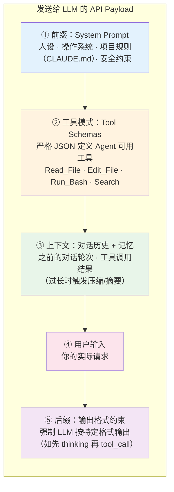

# 附录：Agent-LLM 交互解剖

> 本文是 [Chapter 2 · Agent 核心概念](./part-2-concepts.md) 的深度参考文档，揭开 Agent 与 LLM 交互的"幕后"。

---

## 幕后真相：Agent 可以理解为一个 while 循环

当你在终端输入一条指令，Agent **不是**简单地把你的文字发给云端 LLM。它精心构造了一个庞大的 JSON 请求体（payload），为 LLM 构建了一个"完整的现实"来工作。

> 注："while 循环"是帮助理解的最小化抽象，不覆盖事件驱动、多 Agent 编排、批处理工作流等形态。

## API 调用的五层结构

每次 Agent 向 LLM 发送请求时，payload 包含五层内容：



| 层 | 作用 | 你能影响的部分 |
|----|------|--------------|
| **① System Prompt** | 设定人设、环境、规则 | CLAUDE.md / AGENTS.md 中的项目规则（属于持久化上下文文件，不等同于产品级 memory） |
| **② Tool Schemas** | 定义 LLM 能调用什么工具 | MCP 配置、Skill 注册 |
| **③ 上下文** | 对话历史和工具返回结果 | 控制输出长度、分阶段任务 |
| **④ 用户输入** | 你的请求 | 任务描述的清晰度和结构 |
| **⑤ 输出约束** | 强制格式化输出 | 通常由 Agent 框架控制 |

## Agentic Loop：不是一问一答，而是持续循环

Agent 与 LLM 的交互不是单次请求-响应，而是一个持续循环（常见实现形式之一是 while 循环）：

```
while True:
    response = LLM.call(system_prompt + tools + context + user_input)

    if response.is_final_text:   # LLM 认为任务完成
        return response.text

    if response.is_tool_call:    # LLM 要求调用工具
        result = execute_tool(response.tool_call)  # 在你的本地执行！
        context.append(result)                      # 把结果追加到上下文
        continue                                    # 再次调用 LLM
```

用伪代码展开完整流程：

```python
def run_autonomous_agent(user_task):
    # 1. 上下文工程：构建 payload
    messages = [
        {"role": "system", "content": build_system_prompt()},  # ① 前缀
        {"role": "user", "content": user_task}                  # ④ 用户输入
    ]

    while True:  # Agentic Loop
        # 2. 调用云端 LLM（② 工具模式 + ③ 上下文一并发送）
        response = cloud_llm_api.invoke(
            model="claude-opus-4-6",
            messages=messages,
            tools=TOOL_SCHEMAS  # Bash, FileEdit, Search...
        )

        # 3. LLM 不再请求工具 → 任务完成
        if not response.tool_calls:
            return response.final_text

        messages.append({"role": "assistant", "content": response.tool_calls})

        # 4. 在本地执行工具，将结果反馈给 LLM
        for tool_call in response.tool_calls:
            try:
                result = execute_in_local_terminal(tool_call.name, tool_call.args)
            except Exception as error:
                # 自动纠错：将错误信息反馈给 LLM，让它修正
                result = f"Command failed: {error}. Please fix."

            messages.append({
                "role": "tool_result",
                "tool_id": tool_call.id,
                "content": result
            })
```

## 驯服概率：Agent 如何让 LLM 可靠

LLM 本质是概率预测引擎——预测下一个 token。如果不加约束，它可能编造命令参数或生成非法语法。Agent 用多层机制确保可靠性：

| 机制 | 原理 | 效果 |
|------|------|------|
| **原生工具调用微调** | 模型经过专门的工具调用训练，更容易输出符合 Tool Schema 的结构化结果 | 显著提高工具调用的稳定性和可解析性 |
| **自动纠错循环** | LLM 生成的命令出错 → Agent 捕获 stderr → 反馈给 LLM → LLM 修正重试 | 大多数语法错误自动修复 |
| **语法验证守门** | 编辑文件后立即运行 linter/编译器，失败则自动回滚 | 防止引入语法破坏 |
| **辅助模型校验** | 用便宜快速的小模型（如 Haiku）预审高风险命令 | 拦截危险操作 |
| **输出截断** | 命令输出过长时只保留首尾关键行，中间截断 | 防止上下文膨胀 |

## 安全编辑：Agent 如何改你的代码不翻车

允许 AI 自主编辑代码库是危险的。Agent 通过高度约束的防御性编程来保障安全：

**为什么不让 LLM 输出整个文件？** 因为太慢、浪费 token，且 LLM 容易在长文件中途"遗忘"代码段导致回归。

**实际做法——块级搜索替换**：LLM 只需输出要修改的代码块（Search）和替换内容（Replace），Agent 负责执行：

```python
def safe_edit_file(filepath, search_block, replace_block):
    backup_path = filepath + ".bak"
    shutil.copy(filepath, backup_path)        # 1. 先备份

    content = read_file(filepath)
    if search_block not in content:
        return "Error: 找不到该代码块，请检查缩进"

    new_content = content.replace(search_block, replace_block)
    write_file(filepath, new_content)

    syntax_ok = run_linter(filepath)           # 2. 语法检查
    if not syntax_ok.success:
        shutil.copy(backup_path, filepath)     # 3. 失败则回滚
        return f"Edit reverted. 语法错误: {syntax_ok.error}"

    return "编辑成功，语法检查通过"
```

## 上下文压缩：当对话太长怎么办

即使有百万 token 的上下文窗口，无限追加也会导致成本激增和"中间遗忘"。Agent 的压缩策略：

| 策略 | 做法 |
|------|------|
| **输出截断** | 命令输出保留首 50 行 + 尾 100 行，中间替换为 `[N lines truncated]` |
| **摘要压缩** | 用轻量模型（如 Haiku）对旧对话做摘要，替换原始内容 |
| **状态提取** | 将关键发现写入 scratchpad 文件（如 `.agent_memory.md`），清空对话后可回读 |
