# 附录：MCP 与 Skills 详解

> 本文是 [Chapter 2 · Agent 运作原理与核心概念](./part-2-concepts.md) 的扩展附录，深入讲解 MCP 协议、Skills 体系和工具生态。

---

## 1. MCP（Model Context Protocol）深度解析

### MCP 是什么

MCP 最初由 Anthropic 于 2024 年 11 月提出，是一个**开放标准协议**，旨在标准化 AI 应用与外部数据源/工具之间的连接方式。

**重要进展**：2025 年 12 月，Anthropic 将 MCP 捐赠给 **Linux Foundation 旗下的 Agentic AI Foundation（AAIF）**，OpenAI 和 Block 作为联合创始成员加入，Google、Microsoft、AWS、Cloudflare 等提供支持。MCP 已从 Anthropic 的单一项目演变为**行业中立的开放标准**。当前最新规范版本为 **2025-11-25**。

一个类比：**MCP 之于 AI 工具集成，就像 USB-C 之于硬件设备连接。** 在 MCP 出现之前，每接一个外部能力（GitHub、数据库、浏览器等）都需要一套私有集成方案；MCP 把这个过程标准化了。

### MCP 不是什么

| MCP 不是 | MCP 是 |
|---------|--------|
| 一个模型 | Agent 与外部能力之间的连接协议 |
| Agent 框架 | 工具暴露和调用的标准接口 |
| 某家公司的专属标准 | 开放协议（Linux Foundation 治理），行业共建 |
| Function Calling 的替代品 | Function Calling 的标准化和扩展 |

### MCP 架构

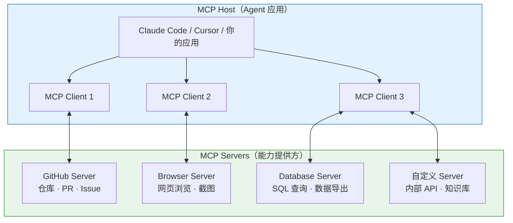

### MCP 提供的三种能力

| 能力类型 | 说明 | 示例 |
|---------|------|------|
| **Tools（工具）** | Agent 可以调用的操作 | 创建 PR、执行 SQL、发送消息 |
| **Resources（资源）** | Agent 可以读取的数据 | 文件内容、数据库记录、API 响应 |
| **Prompts（提示模板）** | 预定义的交互模板 | 代码审查模板、Bug 报告模板 |

### MCP 工作流详解

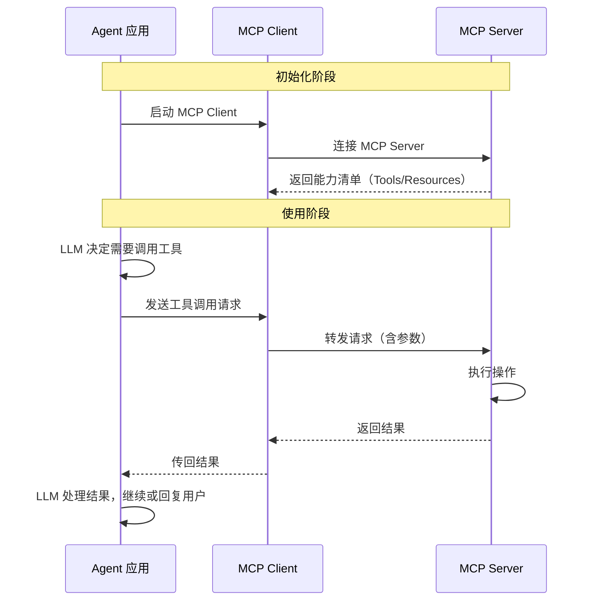

### 本地 MCP vs 远程 MCP

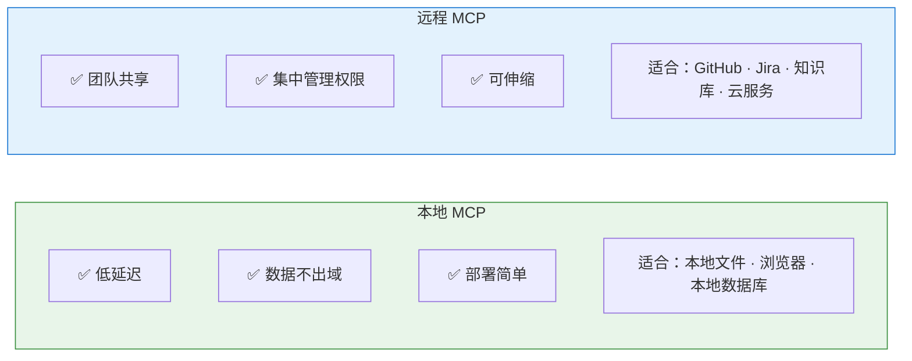

### MCP 与 A2A：互补的两大协议

除了 MCP，Google 于 2025 年 4 月推出了 **A2A（Agent-to-Agent Protocol）**，同样于 2025 年捐赠给 Linux Foundation。两者是互补关系：

| 协议 | 方向 | 解决什么 |
|------|------|---------|
| **MCP** | 纵向（Agent ↔ 工具） | Agent 如何连接和使用外部工具和数据 |
| **A2A** | 横向（Agent ↔ Agent） | 多个 Agent 如何发现、通信和协作 |

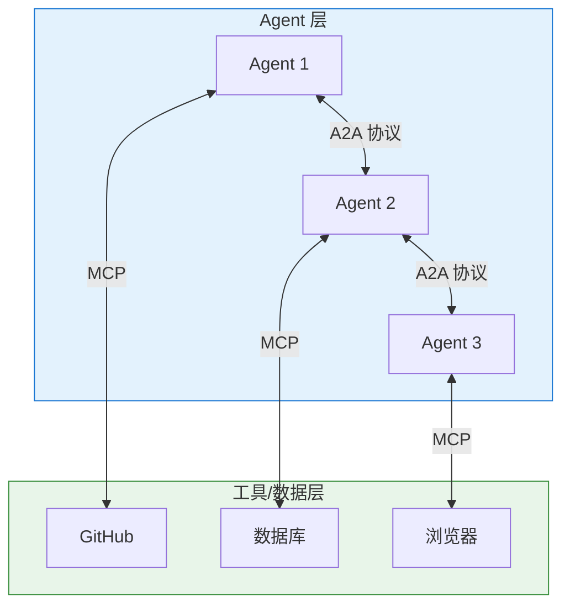

### 谁支持 MCP？

截至 2026 年 3 月，MCP 已被广泛支持：

| 工具/平台 | MCP 支持情况 |
|----------|------------|
| Claude Code | 原生支持（Anthropic 自家协议） |
| Cursor | 支持 |
| Cline | 支持（社区 MCP 生态活跃） |
| Codex CLI | 部分支持 |
| VS Code Copilot | 支持 |
| OpenCode | 支持 |

### 常见 MCP Server 举例

| MCP Server | 提供的能力 |
|-----------|-----------|
| **@anthropic/mcp-server-github** | 仓库浏览、PR/Issue 操作 |
| **@anthropic/mcp-server-filesystem** | 受控的文件系统访问 |
| **@anthropic/mcp-server-puppeteer** | 浏览器自动化、网页截图 |
| **@anthropic/mcp-server-sqlite** | SQLite 数据库查询 |
| **社区贡献** | Notion、Slack、Google Drive、PostgreSQL 等 |

### 什么时候需要 MCP，什么时候不需要

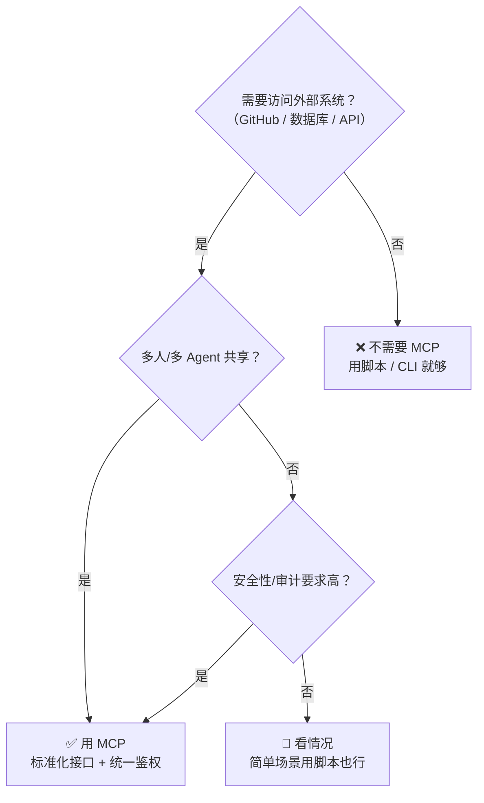

---

## 2. Skills 体系详解

### Skills 的定位

Skills 是一种**把工作经验和方法论封装为可复用模块**的机制。它不给 Agent 新的工具或能力，而是**教 Agent 怎么更好地使用已有能力**。

| | 没有 Skill | 有 Skill |
|---|---|---|
| Agent 做代码审查 | 每次自由发挥，质量不稳定 | 按照固定清单逐项检查 |
| Agent 做 TDD | 可能先写代码后补测试 | 严格遵循"红→绿→重构"流程 |
| Agent 做调试 | 可能乱猜原因 | 按照系统化诊断流程定位问题 |

### Skill 的结构

一个典型的 Skill 包含：

```
my-skill/
├── SKILL.md          # 核心：触发条件、工作流程、规则
├── scripts/          # 确定性脚本（可选）
├── templates/        # 可复用模板（可选）
└── references/       # 补充资料（可选）
```

### SKILL.md 应该写什么

一个好的 SKILL.md 至少回答四个问题：

| 问题 | 说明 | 示例 |
|------|------|------|
| **什么时候触发？** | 触发条件 | "当用户要求做代码审查时" |
| **帮 Agent 做什么？** | 核心价值 | "按照标准清单逐项检查代码质量" |
| **需要什么输入？** | 前置条件 | "需要知道要审查的文件范围" |
| **交付什么？** | 输出定义 | "输出审查报告，包含问题列表和建议" |

### Skill 的三层加载机制（渐进式披露）

这是 Skill 相比传统 Prompt 最大的优势——**不是一次性加载所有内容，而是按需逐层展开**：

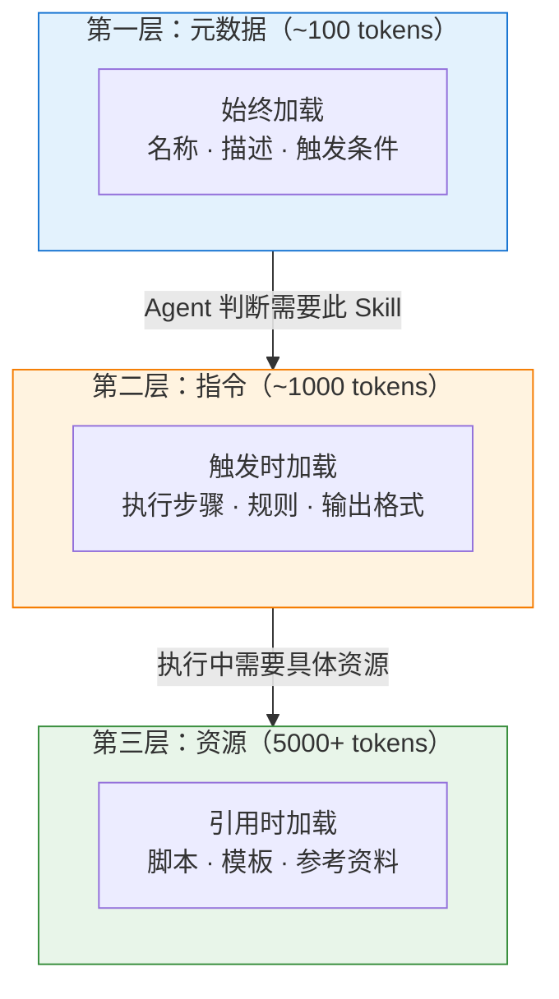

**对比传统 Prompt**：把所有规则一次性写进 System Prompt（可能 40,000 tokens），每次对话全量加载。Skill 通过渐进加载，可以将 token 消耗降低 50-80%。

### 写好 Skill 的原则

| 原则 | 说明 |
|------|------|
| **聚焦单一场景** | 一个 Skill 只解决一类问题，不要试图覆盖十种场景 |
| **步骤明确** | 给 Agent 清晰的执行步骤，而不是模糊的原则 |
| **控制上下文** | Skill 本身不应引入大量噪音 |
| **可测试** | 能明确判断 Skill 是否被正确执行 |
| **迭代优化** | 根据实际使用效果持续调整 |

---

## 3. Skills vs MCP：最新趋势与深度对比

> 2025-2026 年社区出现了明显趋势：越来越多团队优先使用 Skills 来扩展 Agent 能力。但这**不是**"抛弃 MCP"——两者解决的是完全不同层面的问题。

### 核心比喻：Skills = 大脑，MCP = 双手

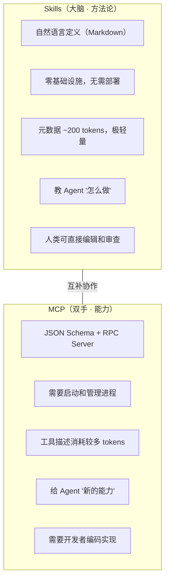

### 详细维度对比

| 维度 | Skills | MCP |
|------|--------|-----|
| **本质** | 知识注入（"怎么做"） | 能力扩展（"能做什么"） |
| **载体** | Markdown 文本 | JSON-RPC Server |
| **部署** | 放个文件即可 | 需要启动/管理进程 |
| **维护成本** | 极低 | 中-高 |
| **Token 消耗** | 极低（渐进加载，元数据 ~200 tokens） | 中等（工具描述预注入上下文） |
| **人类可编辑** | 自然语言，任何人都能写和审查 | 需要开发能力 |
| **确定性** | 低（LLM 解读自然语言指令） | 高（JSON Schema 严格约束） |
| **适合场景** | 工作流 SOP、代码审查清单、调试方法论 | GitHub/Jira/数据库/浏览器集成 |
| **跨 Agent 通用性** | 高（Markdown 格式通用） | 中（协议标准但实现各异） |

### 为什么 Skills 趋势上升？

1. **自然语言天然适合人-Agent 协作**：人写方法论（Markdown），Agent 执行。不需要任何编码。
2. **极低的引入成本**：不需要部署 Server、管理进程、处理错误——放个 `.md` 文件就生效。
3. **渐进加载节省 token**：元数据层仅 ~200 tokens 始终加载，完整指令仅在触发时展开。对比 MCP 工具描述可能预占数千 tokens。
4. **团队 SOP 沉淀**：Skills 让非技术成员也能贡献工作流——PM 可以写代码审查规范，QA 可以写测试方法论。

### 最佳实践：Skills + MCP 组合

两者不是竞争关系，最佳实践是**组合使用**：

| 场景 | Skills 负责 | MCP 负责 |
|------|-----------|---------|
| 代码审查 + PR | 定义审查清单、评分标准、流程 | 连接 GitHub 读取 diff、提交评论 |
| 数据库迁移 | 定义迁移流程、回滚策略、检查点 | 连接数据库执行 SQL、验证 Schema |
| Bug 调试 | 定义系统化诊断流程（日志→复现→定位→修复） | 连接监控系统获取日志和指标 |
| 项目初始化 | 定义技术栈选择、目录结构、配置模板 | 连接 GitHub 创建仓库、配置 CI |

### 常见误区

| 误区 | 现实 |
|------|------|
| "Skills 要取代 MCP" | 不会。Skills 无法给 Agent 新的外部访问能力 |
| "有了 MCP 就不需要 Skills" | MCP 只解决"能不能做"，不解决"怎么做好" |
| "Skills 不可靠，因为是自然语言" | 配合确定性脚本（lint、test）做验证，可靠性不亚于硬编码工作流 |

---

## 4. Skill / MCP / 插件 / 脚本：四者完整对比

### 本质定义

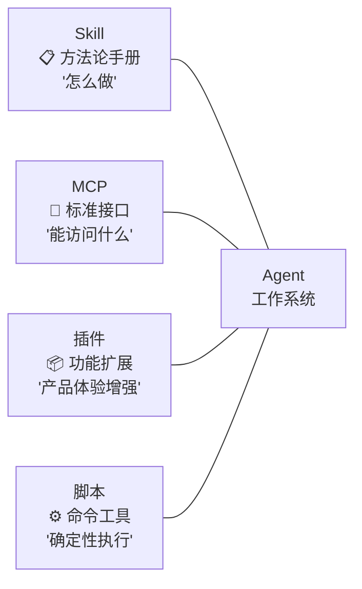

### 详细对比表

| 维度 | Skill | MCP | 插件 | 脚本 |
|------|-------|-----|------|------|
| **核心价值** | 复用经验和流程 | 标准化外部连接 | 产品集成和体验 | 确定性自动化 |
| **类比** | 应用程序 | USB-C 接口 | 应用商店扩展 | 命令行工具 |
| **技术门槛** | 低（Markdown） | 高（需编码+部署） | 中等 | 低-中 |
| **Token 消耗** | 低（渐进加载） | 中等 | 取决于实现 | 无（不占上下文） |
| **跨平台** | 强 | 中等 | 弱（通常绑平台） | 强 |
| **网络需求** | 无 | 可能需要 | 取决于实现 | 无 |
| **维护成本** | 低 | 高 | 中 | 低 |

### 组合使用示例

一个完整的 Agent 工作流通常会**组合使用**这四种能力：

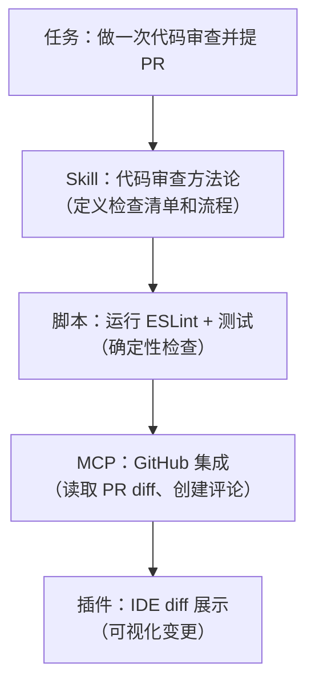

---

## 5. 工具调用的"四大魔咒"

在生产环境中使用 Agent 工具调用，会遇到四个核心挑战：

### 1. 执行幻觉（Execution Hallucination）

Agent 选错 API、编造参数、甚至"以为"自己已经执行成功。最糟糕的是**静默失败**——Agent 报告"已完成"但实际什么都没做。

**应对**：始终要求 Agent 展示工具调用的实际输出，而不是只接受它的"自我报告"。

### 2. 上下文衰退（Context Rot）

工具返回的结果、日志、历史对话不断堆积，token 越用越多，模型越来越难"记住"早期的重要信息。

**应对**：控制工具输出长度，定期做摘要，分阶段执行任务。

### 3. 延迟与成本爆炸（Delay and Cost Explosion）

每个小请求都要经过"意图判断→选工具→填参数→执行→处理结果"的完整链路，延迟和费用迅速上升。

**应对**：简单操作用脚本直接执行，不经过 LLM 决策；利用 Prompt Cache 减少重复上下文的费用。

### 4. 安全边界崩塌（Prompt Injection）

用户输入和系统指令共用一条文本流，攻击者可能通过精心构造的输入劫持工具调用。

**应对**：对高风险操作设置人工确认；MCP Server 实现最小权限原则；审计工具调用日志。

---

## 6. 工具数量的"Less is More"原则

### 为什么工具多了反而效果差

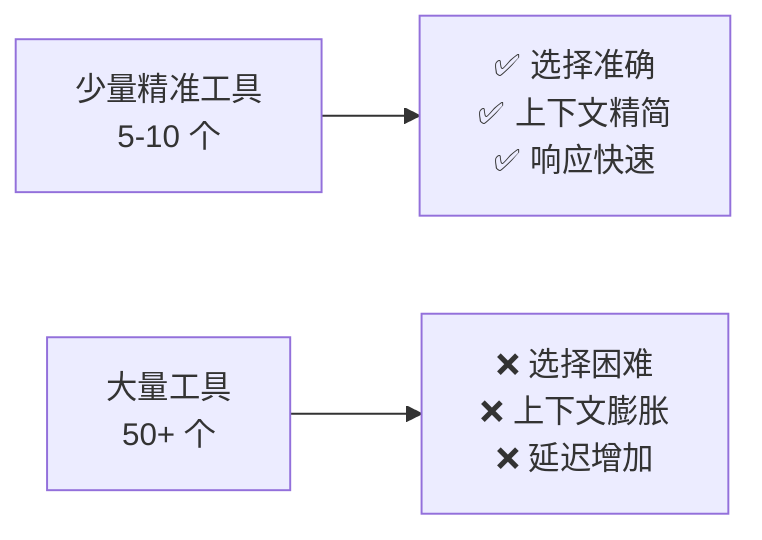

### 实证数据

多项研究和实践表明：

- 工具描述占据的上下文空间随数量线性增长
- 工具选择准确率在工具数量超过 ~20 个后明显下降
- LangChain 团队通过精简工具栈，将 Agent 性能显著提升

### 工具管理的最佳实践

| 策略 | 说明 |
|------|------|
| **动态加载** | 不要一次性加载所有工具，根据任务按需加载 |
| **分层组织** | 核心工具始终可用，专业工具按需启用 |
| **优先 CLI** | 能用脚本/CLI 解决的不要做成 MCP |
| **定期清理** | 删除不再使用的 MCP 配置 |
| **文档清晰** | 每个工具的描述要精准，帮助模型正确选择 |

---

## 7. 工业界的三大护栏

面对工具调用的挑战，工业界发展出三层防护机制：

### 1. 路由层

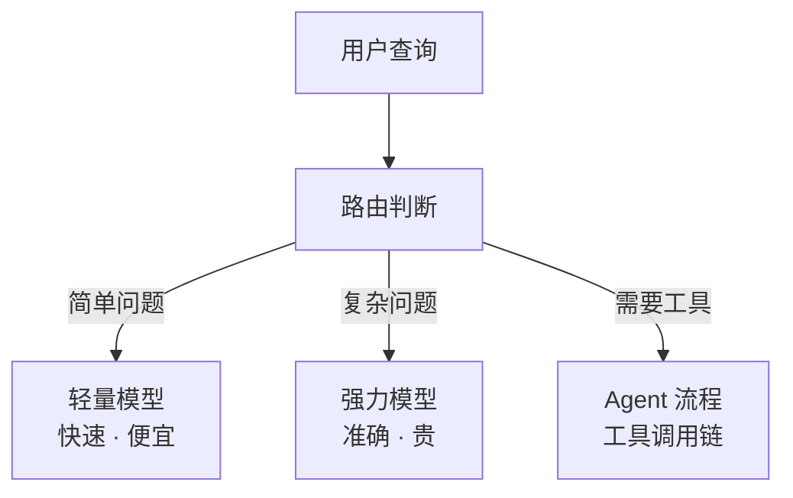

### 2. 缓存体系

- **Prompt Cache**：重复的系统指令前缀自动缓存，减少计费
- **KV Cache**：模型推理中的中间计算结果缓存
- **语义缓存**：相似问题命中历史回答，避免重复推理

### 3. MCP 标准化连接

把 N 种 Agent × M 种工具的集成复杂度，从 O(N×M) 降低到 O(N+M)——每种 Agent 只需对接 MCP 协议，每种工具只需实现 MCP Server。

---

返回主文档：[Chapter 2 · Agent 运作原理与核心概念](./part-2-concepts.md)
