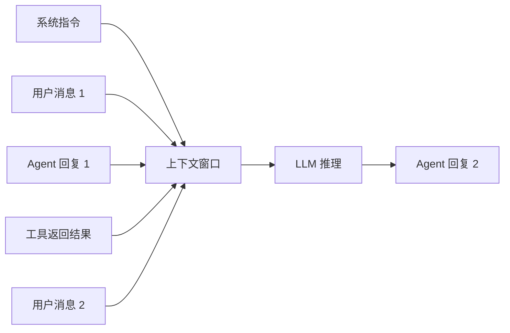
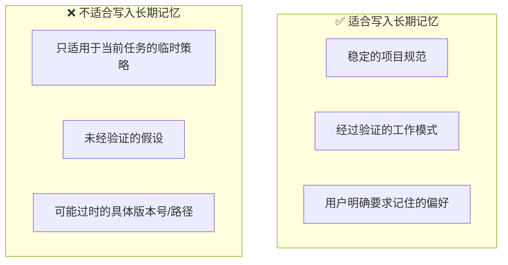
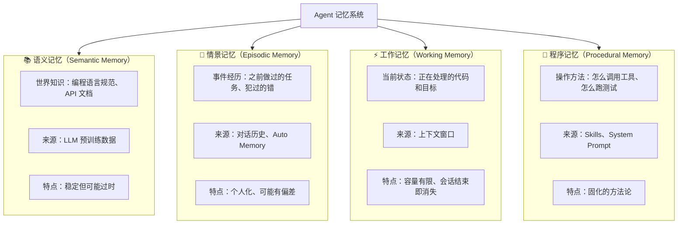
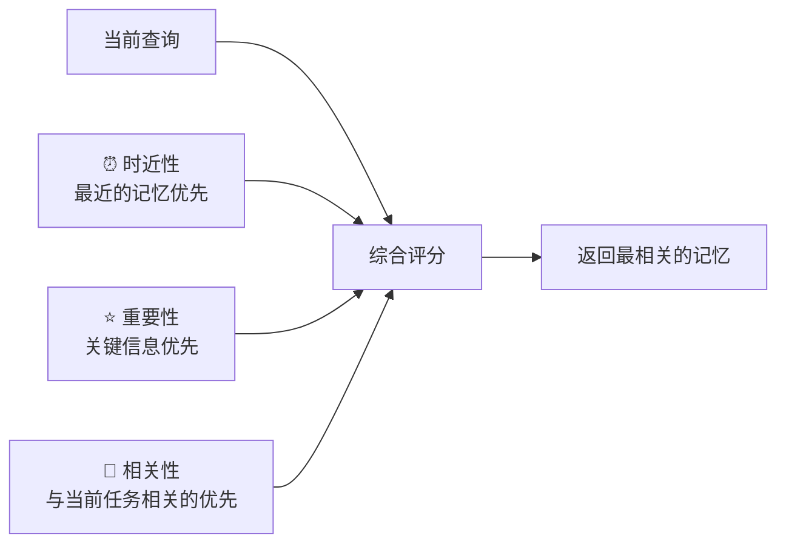
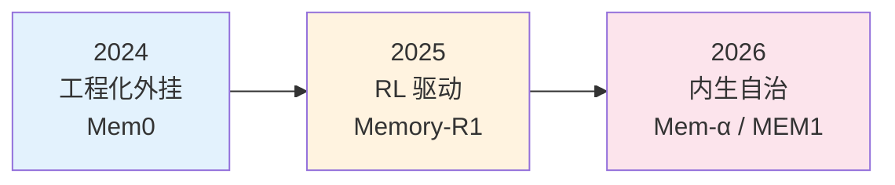
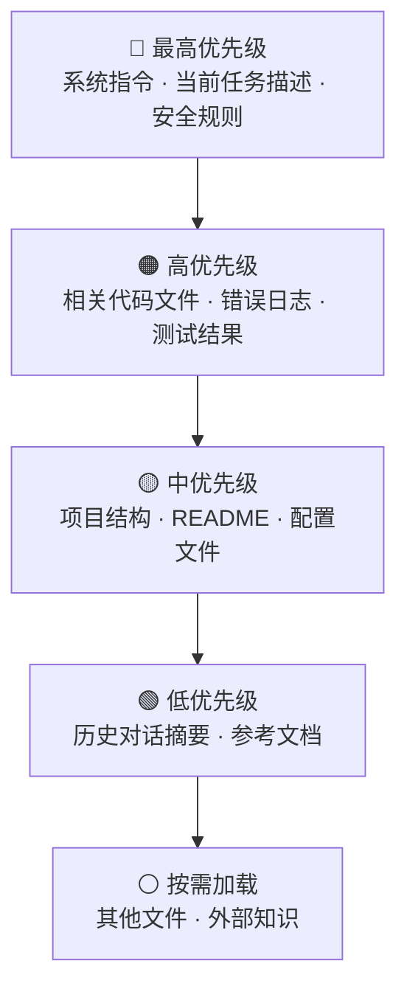
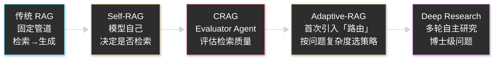

# 附录：Memory 与上下文工程详解

> 本文是 [Chapter 2 · Agent 运作原理与核心概念](./part-2-concepts.md) 的扩展附录，深入讲解 Agent 的记忆系统和上下文管理技术。

---

## 1. 为什么 Memory 是 Agent 的核心能力

Agent 和普通 LLM 对话的最大区别之一就是**记忆**。没有记忆的 LLM 每次对话都从零开始；有记忆的 Agent 能积累经验、保持任务状态、跨会话复用知识。

Memory 直接决定了三个关键指标：

| 指标 | Memory 好的表现 | Memory 差的表现 |
|------|----------------|----------------|
| **任务连贯性** | 记住任务进度，不重复已完成的步骤 | 反复做同样的事，忘记上下文 |
| **个性化** | 记住你的偏好和项目规范 | 每次都要重新告诉它你的习惯 |
| **长任务稳定性** | 在长对话中保持目标不漂移 | 越聊越偏题，忘记原始目标 |

---

## 2. 短期记忆：上下文窗口

### 工作原理

LLM 的短期记忆就是**上下文窗口（Context Window）**——把所有对话历史、系统指令、工具返回结果拼接成一个序列，送给模型处理。



### 上下文窗口大小对比（2026 年 3 月）

| 模型 | 上下文窗口 | 约等于 |
|------|-----------|--------|
| Claude Opus 4.6 | 200K tokens（1M Beta） | ~500 页文档 / ~15 万行代码 |
| GPT-5.4 | 128K tokens | ~320 页文档 |
| Gemini 3 Pro | 1M tokens | ~2500 页文档 |
| DeepSeek V3.2 | 128K tokens | ~320 页文档 |

### 上下文窗口的局限

即使窗口很大，也不意味着"塞越多越好"：

1. **注意力衰减**：窗口中间的信息比头部和尾部更容易被"遗忘"（"Lost in the Middle"现象）
2. **成本线性增长**：输入 token 越多，API 费用越高
3. **质量稀释**：无关信息越多，模型对关键信息的关注度越低

---

## 3. 对话摘要：压缩记忆

当对话太长，快要超出上下文窗口时，Agent 会自动触发**对话摘要**——把之前的详细对话压缩成精炼摘要，保留关键信息，丢弃细节。


### Claude Code 的 Context Compaction

Claude Code 内置了自动上下文压缩机制（Context Compaction）：当上下文接近窗口极限时，自动对已完成阶段进行摘要，释放空间给新任务。这使得 Agent 可以处理远超单次窗口容量的长任务。

**你需要知道的**：
- 摘要是有损的——细节会丢失
- 如果某个关键信息在早期对话中，摘要后可能被遗忘
- 所以关键指令（如"不要修改生产配置"）应该放在系统指令或 CLAUDE.md 中，而不是依赖对话记忆

---

## 4. 长期记忆：跨会话持久化

短期记忆和对话摘要都随会话结束而消失。要让 Agent 跨会话记住信息，需要**长期记忆**。

### Coding Agent 中的长期记忆实现

| 机制 | 存储位置 | 内容 | 生命周期 |
|------|---------|------|---------|
| **CLAUDE.md / AGENTS.md** | 项目根目录 | 项目规范、编码风格、常用命令 | 永久（跟随代码库） |
| **Auto Memory** | `~/.claude/projects/` | Agent 自动记录的用户偏好和项目知识 | 跨会话持久化 |
| **全局设置** | `~/.claude/settings.json` | 全局规则和 API 配置 | 所有项目共享 |
| **会话文件** | 项目中的 notes/logs 文件 | 阶段成果、研究笔记 | 永久（写入文件系统） |

### 长期记忆的最佳实践



---

## 5. 认知记忆架构

从认知科学角度，Agent 的记忆系统可以对应人类大脑的四种记忆模式：



### 记忆检索评分

当 Agent 需要从记忆中调取信息时，通常会综合三个维度打分：



---

## 6. Memory 的三大进化阶段（2024-2026）

Agent Memory 技术正在快速演进：

### 阶段一：工程化外挂（2024）

- **代表**：Mem0（生产级 Memory 基建）
- **做法**：不再只是向量数据库，而是维护 Memory Graph——抽取实体、建立关系、合并相似信息、更新状态
- **适用**：个性化 Agent、长对话客服、企业知识管理

### 阶段二：强化学习驱动（2025）

- **代表**：Memory-R1
- **做法**：用双 Agent 框架——Memory Manager 决定"记什么、更新什么、删什么"，Answer Agent 负责"用记忆"
- **突破**：在很小的数据集上就能学到比复杂规则更好的记忆管理策略

### 阶段三：内生化与自治（2025-2026）

- **代表**：MEM1（恒定内存状态机）、Mem-α（完全自治记忆系统）
- **做法**：不再堆叠上下文，而是维护高度压缩的内部状态变量
- **趋势**：Memory 正在从"RAG 工具层"升级为"Agent 的核心决策能力"



---

## 7. 上下文工程实战

### 上下文组装的原则

Agent 不可能把整个仓库永远完整放进上下文，它必须动态组装。好的上下文组装遵循以下优先级：



### RAG vs Markdown：知识存储的选择

| 方面 | Markdown 文件 | RAG（向量检索） |
|------|-------------|----------------|
| **适合场景** | 本地 Agent、项目规则、行为引导 | 大规模知识库、外部文档 |
| **上下文消耗** | 可控（直接读取） | 不确定（检索结果数量波动） |
| **调试性** | 高（直接看文件） | 低（向量检索是黑盒） |
| **LLM 理解** | 天然理解 Markdown 结构 | 依赖检索质量 |
| **维护成本** | 低 | 高（需要索引、更新、清理） |

**实用建议**：
- **行为逻辑 / 规则 / 工作流** → 用 Markdown（CLAUDE.md、Skill）
- **大量文档 / 外部知识 / 历史数据** → 用 RAG
- **混合最佳**：Markdown 存行为逻辑，RAG 存长文档

### Contextual Retrieval：让 RAG 真正好用

📌 **问题根源**：传统 RAG 把文档切成 chunk 后，每段文字往往丢失了原始语境，导致向量检索时「明明应该找到，却没找到」。

**示例**：一份 API 文档中有这样一个 chunk：

> "The default timeout is 30 seconds."

单独看这句话，没有人（也没有向量模型）知道它讲的是哪个模块的超时。

💡 **Contextual Retrieval 的解法**（Anthropic 提出）：在每个 chunk 存入向量库**之前**，先让模型为它生成一段「解释性上下文」并拼接在前面：

```
[自动生成的上下文]
本段来自 Payments SDK 的 API 参考文档，描述的是 charge() 方法的超时配置。

[原始 chunk]
The default timeout is 30 seconds.
```

这样检索时，语义更完整，相关性更准确，Anthropic 的测试显示检索失败率可降低 **49%**。

| 方式 | 检索失败率降低幅度（相对基准） | 说明 |
|------|-------------------------------|------|
| 传统向量 RAG | 基准 | chunk 缺乏上下文 |
| + BM25 混合检索 | 约降低 ~30% | 补充关键词匹配 |
| + Contextual Retrieval | 降低 ~49% | chunk 前加入上下文描述 |
| + 两者结合 | 降低 ~67% | 效果最佳 |

> 数据来源：Anthropic 官方博客；BM25 单独使用的降低幅度因数据集而异，此处为近似值。

⚠️ **适用场景**：Contextual Retrieval 适合文档量大、chunk 语境依赖强的知识库（如大型 API 文档、技术手册）。对于结构化的代码仓库，直接用文件系统 + ripgrep 通常更简单有效。

---

### 上下文缓存：让生产 Agent 可负担

📌 **问题**：生产环境中每次调用 Agent 都要重新传入系统提示、工具定义、项目说明，而这些内容往往几乎不变。重复传入相同前缀 = 重复付 token 费用。

💡 **上下文缓存（Context Caching / Prompt Caching）**：将不变的前缀部分缓存在 API 侧，后续调用命中缓存后，这部分 token 按缓存价格计费（通常比正常输入 token 便宜 **70-90%**）。

**核心设计原则 — 前缀稳定性（Prefix Stability）**：

```
✅ 正确的上下文结构（稳定前缀在前）：
┌─────────────────────────────┐
│ 系统提示（固定，最长）        │  ← 缓存命中率最高
│ 工具定义列表（固定）          │  ← 缓存命中
│ 项目说明 / CLAUDE.md（固定）  │  ← 缓存命中
│ 当前任务描述（变化）          │  ← 每次新生成
│ 本轮对话历史（变化）          │  ← 每次新生成
└─────────────────────────────┘

❌ 错误做法：把动态内容插入前缀中间
→ 破坏缓存前缀，每次都要重新计算整个上下文
```

**实践建议**：

| 建议 | 说明 |
|------|------|
| 固定内容放最前 | 系统提示、工具列表、项目规范永远在上下文开头 |
| 变化内容追加在末尾 | 当前任务、本轮历史放在最后 |
| 不要在固定前缀中插入时间戳等动态值 | 会破坏缓存 |
| 工具列表保持稳定顺序 | 顺序变化也会破坏前缀匹配 |

> 📌 对于频繁调用的生产 Agent，前缀稳定性是让系统在可负担成本内运行的关键指标，不亚于模型选择本身。

---

### 上下文生命周期管理


---

## 8. Agentic RAG：从检索增强到自主检索决策

> 📌 传统 RAG 是"检索 → 生成"的固定管道；Agentic RAG 让 Agent 自主决策**是否检索、检索什么、检索多少轮**。

### 演化路线（2023–2026）



### 三个关键里程碑

| 系统 | 核心创新 | 解决的问题 |
|------|---------|-----------|
| **Self-RAG** | 引入 reflection tokens，模型为自己打分 | 判断是否需要检索、文档是否相关、答案是否可靠 |
| **CRAG** | 引入 Evaluator Agent | 检索质量差时自动触发 Web Search fallback，不再盲目相信检索结果 |
| **Adaptive-RAG** | 首次显式路由 | 先判断问题复杂度：简单问题→直接回答，中等→普通检索，复杂→多步 Agent 推理 |

### 两类失败模式（AgenticRAGTracer 发现）

在多跳推理场景中，Agentic RAG 系统存在两类典型失败：

- **Premature Collapse（过早停止）**：Agent 在还没找到足够信息时就停止检索，给出不完整答案
- **Over-Extension（过度延伸）**：Agent 无限制地调用检索工具，推理链越来越长但答案质量不再提升

> 💡 **结论**：好的 Agentic RAG 不在于"推理更长"，而在于"推理更合理"——知道什么时候停下来。

### 未来形态：混合系统

```
简单问题  →  直接回答（无需检索）
中等问题  →  单次检索 + 生成
复杂问题  →  Adaptive-RAG（多步推理）
深度研究  →  多工具自治（Deep Research）
```

> ⚠️ 对于日常 Coding Agent 场景，直接用文件系统 + ripgrep 检索代码仓库通常比搭 RAG 更简单、更可靠。Agentic RAG 更适合需要跨大量外部文档的知识密集型场景。

---

## 9. 上下文问题的诊断与修复

### 诊断清单

当 Agent 表现异常时，先检查上下文相关问题：

| 症状 | 可能的上下文问题 | 修复方案 |
|------|----------------|---------|
| Agent 无视你的指令 | 指令被大量其他信息淹没 | 把关键指令放在 Prompt 开头或 CLAUDE.md |
| Agent 行为前后矛盾 | 多处规则相互矛盾 | 审查并统一 CLAUDE.md 和会话指令 |
| Agent 重复已完成的步骤 | 压缩后丢失了进度信息 | 让 Agent 先总结当前进度再继续 |
| Agent 给出过时建议 | 依赖训练数据而非实际代码 | 明确要求读取实际文件而非"凭记忆" |
| Agent 生成已删除的代码 | 上下文中有旧版本代码残留 | 重开会话，只提供当前版本 |
| 成本异常高 | 上下文中有大量无关日志/输出 | 控制命令输出长度，清理冗余 |

### 预防策略

1. **规则分层**：全局规则放 `~/.claude/settings.json`，项目规则放 `CLAUDE.md`，任务规则在会话中说
2. **定期清理**：长会话每完成一个子任务就做总结，保持上下文精简
3. **关键信息前置**：最重要的指令放在 Prompt 最开头
4. **显式声明**：不要假设 Agent 知道你的环境，用 CLAUDE.md 显式写出项目信息

---

返回主文档：[Chapter 2 · Agent 运作原理与核心概念](./part-2-concepts.md)
