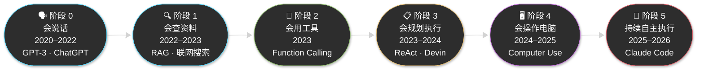
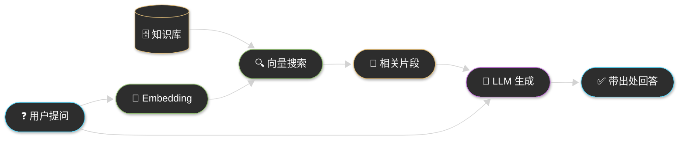
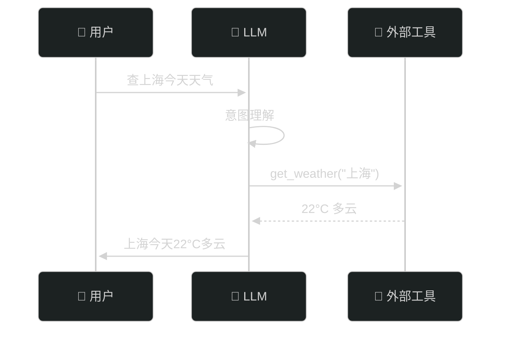
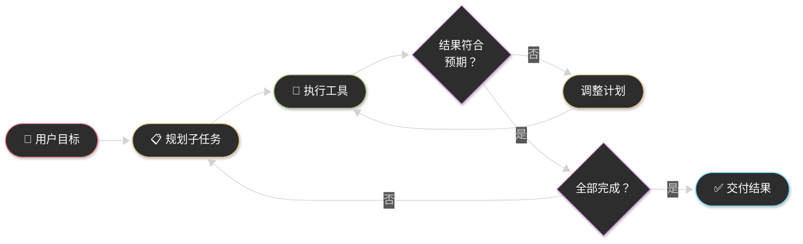
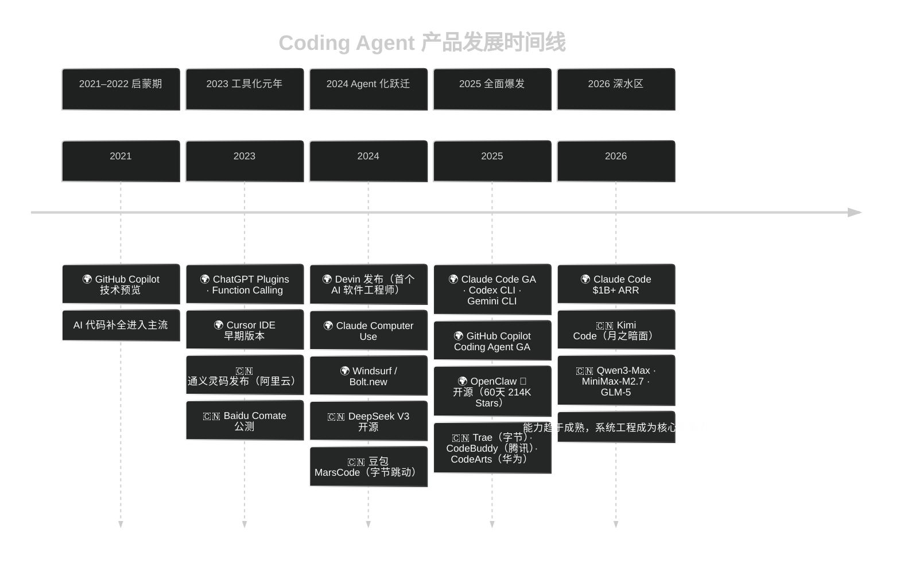
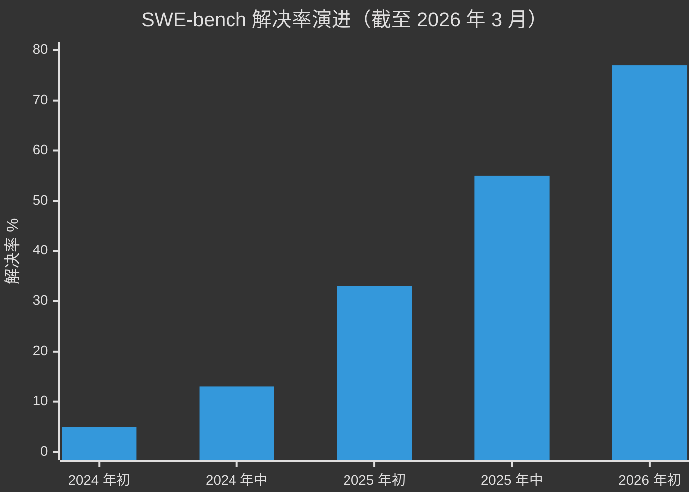
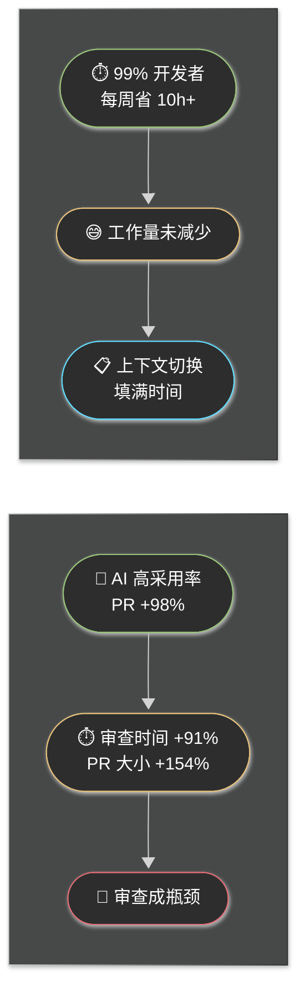
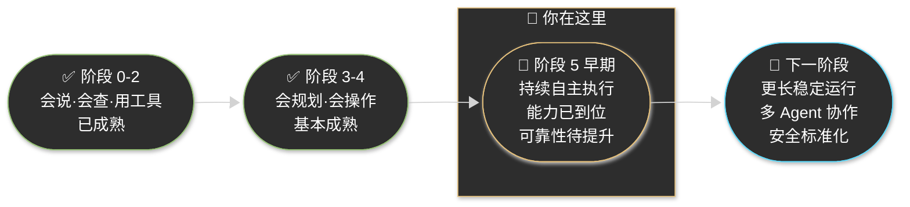

# Chapter 3 · 📜 Agent 技术发展简史

> **目标**：建立 Agent 技术的时间线认知——从自动补全到自主代理，理解我们在哪里、怎么走到这里的。

## 目录

- [1. ⏳ 从自动补全到自主代理：六阶段演进](#1-从自动补全到自主代理六阶段演进)
- [2. 🗺️ 产品大爆发：Coding Agent 群雄并起](#2-产品大爆发coding-agent-群雄并起)
- [3. 🔄 "80% 翻转"：范式变化的临界点](#3-80-翻转范式变化的临界点)
- [4. 👥 Agent 时代的职业冲击（浅析）](#4-agent-时代的职业冲击浅析)
- [5. 📍 我们在哪里？当前阶段定位](#5-我们在哪里当前阶段定位)
- [📌 本章总结](#本章总结)

---

## 1. ⏳ 从自动补全到自主代理：六阶段演进

业界让 AI 走过了一条清晰的能力升级路径：先让它**会说**，再让它**会查**，接着让它**会用工具**，然后让它**会规划执行**，最后让它**会操作电脑**和**持续自主运行**。

---

### 🗣️ 阶段 0：会说话（2020–2022）

**核心突破**：Transformer 大规模预训练，LLM 具备流畅的自然语言交互能力。

| 时间 | 事件 | 意义 |
|------|------|------|
| 2020.06 | GPT-3（175B 参数） | 证明 few-shot learning 可行性 |
| 2021 | OpenAI Codex | 首次证明 LLM 可以写代码 |
| 2021.06 | GitHub Copilot 技术预览 | 开启 AI 辅助编程时代 |
| 2022.11 | ChatGPT 发布 | LLM 从研究工具变成大众产品，2 个月破亿用户 |

**为什么不够**：只会说、不能行动。知识有截止日期，容易幻觉，无法修改文件或调用工具。ChatGPT 的爆火让所有人意识到——LLM 可以成为新的交互层，但"只会对话，不足以形成生产力闭环"。

---

### 🔍 阶段 1：会查资料（2022–2023）

**核心突破**：RAG（检索增强生成）——模型从"封闭脑袋"升级为"能查资料的脑袋"。

| 时间 | 事件 | 意义 |
|------|------|------|
| 2020 | RAG 论文（Meta AI） | 提出检索增强生成范式 |
| 2022–2023 | 向量数据库生态爆发 | Pinecone、Weaviate、Chroma 等 |
| 2023 | ChatGPT / Bing Chat 联网 | 联网搜索进入消费级产品 |

**为什么不够**：仍然是"查完再说"——有了信息，但没有行动能力，无法完成多步骤闭环任务。

---

### 🔧 阶段 2：会用工具（2023）

**核心突破**：Function Calling——模型不再只是生成文本，而是输出**结构化调用指令**，让外部系统去执行。这是从 LLM 走向 Agent 的**第一个真正分水岭**。

| 时间 | 事件 | 意义 |
|------|------|------|
| 2023.03 | ChatGPT Plugins | 首次让 LLM 调用第三方服务 |
| 2023.06 | OpenAI Function Calling API | 结构化工具调用标准化，Agent 的"手"正式接上 |
| 2023.07 | Claude Tool Use | Anthropic 跟进，工具调用普及 |

**为什么不够**：大多数仍是单步调用，缺少任务规划和长期状态管理，稍复杂的任务就容易失败。

---

### 📋 阶段 3：会规划执行（2023–2024）

**核心突破**：Agent 不再只是"看到问题 → 调一个工具"，而是能把任务**拆分成多步**，按步骤执行、检查、修正。"Agent"这个词在这个阶段真正进入主流。

| 时间 | 事件 | 意义 |
|------|------|------|
| 2022.10 | ReAct 论文 | 提出 Reasoning + Acting 统一范式，Agent 理论基石 |
| 2023.03 | AutoGPT 开源 | 引爆 Agent 概念热潮（不稳定但启发了整个行业） |
| 2023–2024 | MetaGPT、AutoGen、CrewAI | 多 Agent 协作框架涌现 |
| 2024.02 | Devin 发布 | 首个"AI 软件工程师"产品化尝试，引发行业震动 |

**为什么不够**：强依赖预定义工具和 API，遇到"只有图形界面、没有 API"的软件就卡住了。长任务稳定性仍然不足。

---

### 🖥️ 阶段 4：会操作电脑（2024–2025）

**核心突破**：Computer Use——即使没有 API，也能通过**看屏幕、点按钮、输入文字**像人一样操作软件。AI 从"数字接口层"进入了"软件操作层"。

| 时间 | 事件 | 意义 |
|------|------|------|
| 2024.10 | Claude Computer Use（Beta） | 首个商业化 Computer Use 能力 |
| 2025.01 | OpenAI Operator | 浏览器自动化 Agent |

**为什么不够**：稳定性、安全性、执行速度仍是重大挑战。适合简单重复的 GUI 流程，复杂操作容错能力仍不足。

---

### 🤖 阶段 5：持续自主执行（2025–2026，当前阶段）

**核心突破**：不是某个模型能力的单点突破，而是**产品范式的整体变化**——AI 从"给建议的助手"变成"真正替你执行任务的代理系统"。

| 时间 | 事件 | 意义 |
|------|------|------|
| 2025.02 | Claude Code 研究预览 | 🔑 终端原生 Coding Agent 标杆，伴随 Claude 3.7 Sonnet 发布 |
| 2025.05 | Claude Code GA | 正式发布，伴随 Claude Opus 4 / Sonnet 4 |
| 2025.05 | Codex CLI 开源 | OpenAI 开源终端 Agent，沙箱权限分级 |
| 2025.06 | Gemini CLI 开源 | Google 进入 CLI Agent 赛道，1M 上下文 |
| 2025.11 | Claude Code 达 $1B+ ARR | 仅研究预览后 9 个月即达十亿美元年化收入 |
| 2025.11 | OpenClaw 🦞 开源 | 首个"全自主生活 Agent"，60 天 214K+ Stars |
| 2026.01 | 🇨🇳 Kimi Code 发布 | 国产终端 + IDE Agent，Kimi K2.5 驱动 |

这个阶段带来了三大转变：

| 维度 | 之前 | 现在 |
|------|------|------|
| 执行位置 | ☁️ 云端建议 | 💻 本地真实执行 |
| 任务时长 | ⚡ 单次对话 | ⏱️ 持续数小时任务 |
| 竞争焦点 | 🧠 模型能力 | ⚙️ 系统工程（上下文管理、工具编排、状态持久化） |

> **📎 延伸阅读**：完整的产品里程碑时间线见 [附录：Agent 产品完整时间线](./reference-product-timeline-full.md)

---

## 2. 🗺️ 产品大爆发：Coding Agent 群雄并起

### 国际 vs 国产双线演进（2021–2026）

### 🌍 国际阵营：几个关键产品故事

**GitHub Copilot（2021）** — 开那道门的人
第一个让代码补全变成"大众日用品"的产品。2022 年 GA 时 $10/月，迅速获百万用户，让"AI 写的代码"从新奇变为习惯。Copilot 定义了"AI 辅助编程"这个品类，但它本质上仍是"补全"，不是"执行"。

**Devin（2024.02）** — 震动行业的"AI 软件工程师"
Cognition AI 用一段演示视频震动了整个行业——Devin 可以接收一个 GitHub Issue，自主规划、编码、测试、提交 PR，全程不需要人工介入。这是第一次让业界认真讨论"AI 会不会取代工程师"。正式 GA 时定价 $500/月，而非流传的"$2/小时替代人类"。

**Claude Code（2025）** — 当前标杆
研究预览发布 9 个月即突破 $1B ARR，在 2026 年开发者调研中获得 46% 的"最喜爱"评分（Cursor 19%，Copilot 12%）。核心差异化：终端原生、最强的代码库理解能力、多 Agent 编排支持。

**OpenClaw 🦞（2025.11）** — 从 Coding Agent 到"全自主生活 Agent"
奥地利开发者 Peter Steinberger 开源的 OpenClaw 不只是 Coding Agent，而是一个**全自主生活代理**——通过 WhatsApp / Telegram 发一条消息，它就能执行 shell 命令、读写文件、浏览网页、发邮件、管理日历，并跨会话保持持久记忆。发布 48 小时内获得 10 万 GitHub Stars，60 天突破 21.4 万 Stars，成为 GitHub 历史上增长最快的项目之一。但也同时暴露了严峻的安全问题（→ 见 CH12）。

### 🇨🇳 国产阵营的崛起

国产 Coding Agent 在 2023-2025 年快速追赶，形成了覆盖 IDE 插件、终端 Agent、云 IDE 的完整生态：

| 产品 | 公司 | 特点 |
|------|------|------|
| 🇨🇳 通义灵码 | 阿里云 | Qwen 驱动，IDE 插件，代码生成/补全/审查 |
| 🇨🇳 CodeBuddy | 腾讯 | IDE + 插件 + CLI 全形态，85-90% 腾讯工程师在用 |
| 🇨🇳 Trae | 字节跳动 | 免费 AI IDE，Builder 模式一键生成项目 |
| 🇨🇳 Baidu Comate | 百度 | 多模态输入（文字/语音/图片），多 Agent 协作 |
| 🇨🇳 Kimi Code | 月之暗面 | 终端 + IDE Agent，Kimi K2.5 驱动，支持 ACP 协议 |
| 🇨🇳 CodeArts | 华为 | 自动驾驶式研发，覆盖需求→开发→测试→运维全流程 |
| 🇨🇳 DeepSeek V3/R1 | 深度求索 | 671B MoE 开源模型，R1 推理链透明，编码能力逼近闭源 |
| 🇨🇳 Qwen3-Max | 阿里云 | 千问旗舰线，适合复杂多步骤任务，支持思考模式 + 内置工具 |
| 🇨🇳 GLM-5 | 智谱 AI | 智谱新一代旗舰基座，面向 Agentic Engineering、复杂系统工程 |
| 🇨🇳 MiniMax-M2.7 | MiniMax | 当前最新 M 系旗舰，强调 real-world engineering / tool calling / search |

### 📊 SWE-bench：Agent 能力飙升的硬数据

SWE-bench 是目前最权威的 Coding Agent 评测基准（真实 GitHub Issue 的解决率）。能力提升的速度超出所有人预期：

| 时间 | 最优解决率 | 代表模型 |
|------|-----------|---------|
| 2024 年初 | < 5% | GPT-4 早期 Agent |
| 2024 年中 | ~13% | Claude 3 Opus |
| 2025 年初 | ~33% | Claude 3.7 Sonnet |
| 2025 年中 | ~55% | Claude 4 Sonnet |
| 2026 年初 | **~77%** | Claude 4.5 Opus |

两年内从 5% 飙升到 77%——这个速度在软件工程工具史上前所未有。

> ⚠️ **时效性声明**：以上数据截至 2026 年 3 月，AI 领域演进极快，请以各产品最新官方信息为准。

---

## 3. 🔄 "80% 翻转"：范式变化的临界点

### Karpathy 的反转

2025 年末，AI 领域最具影响力的工程师之一 Andrej Karpathy（前 OpenAI、特斯拉）公开分享了一个数据点：

> 他在数周内从 **"80% 手动编码 + 20% Agent 辅助"** 翻转为 **"80% Agent 编码 + 20% 手动修改"**。他现在基本上是用英语编程了。

Claude Code 创始人 Boris Cherny 的数据更为极端：**连续两个月 100% 依靠 Claude 编写所有代码，每天合并 22-27 个 PR。**

这不是孤例，而是一批精通 AI 工具的工程师的普遍体验。"80% 翻转"确实发生了。

### 旧范式 vs 新范式

| 维度 | 旧范式（AI 辅助编程） | 新范式（Agentic 编程） |
|------|---------------------|----------------------|
| 主角 | 👤 人写代码 | 🤖 AI 写代码 |
| AI 的角色 | 💡 给建议、补全片段 | 🔧 执行完整任务 |
| 人的角色 | ✍️ 编写代码 | 🎯 提需求、审结果、验正确性 |
| 交互粒度 | 行 / 函数 | 功能 / PR / Epic |
| 瓶颈 | 人写代码的速度 | 人审查代码的速度 |
| 核心技能 | 编写正确代码 | 描述清晰需求 + 验证 AI 输出 |

### "80% 问题"：翻转了，但新问题也来了

Google Chrome 工程总监 Addy Osmani 在 2026 年初提出了"**80% 问题**"：反转确实发生了，但问题并没有消失，而是**转移且变形**了：

- 🔴 **假设传播**：Agent 早期误解了某个需求，然后基于错误前提构建了整个功能。五个 PR 之后架构已固化，才发现根源问题。
- 🔴 **抽象膨胀**：Agent 在有充分自由度时会过度复杂化——用 1000 行代码实现本可 100 行完成的功能。
- 🔴 **理解债务**：当 Agent 一次性完成某个功能时，你很容易直接继续。随着时间积累，**你可能越来越不理解自己的代码库**。
- 🔴 **谄媚式同意**：Agent 倾向于顺着你的思路走，不主动反驳矛盾的需求。

**Faros AI 的数据**（截至 2026 年 3 月）揭示了一个悖论：

> **核心结论**：我们不是在"省时间"，而是在"转换工作类型"——从写代码转向管理 AI、审查输出、设计任务结构。

---

## 4. 👥 Agent 时代的职业冲击（浅析）

> **说明**：本节仅呈现关键数据快照，不做深度预测。关于职业路线图、SaaSpocalypse 商业影响和一人独角兽案例，留待 CH14 深度分析。

### 📊 关键数据（截至 2026 年 3 月）

| 指标 | 数据 | 来源 |
|------|------|------|
| 开发者月度 AI 工具使用率 | **92.6%** | Stack Overflow 调研 |
| 计算机程序员任务 AI 覆盖率（理论） | **75%** | Anthropic 劳动力研究 |
| 实际应用覆盖率（Computer & Math 职业） | **33%** | Anthropic 劳动力研究 |
| 入门级开发者岗位变化（2022 以来） | **-35% ~ -60%** | Deloitte / WEF |
| AI 高暴露职业 22-25 岁就业率变化 | **-6% ~ -16%** | Brynjolfsson et al. |

**三个信号值得关注**：
1. **理论覆盖率（75%）远高于实际落地率（33%）**——大规模失业的恐慌目前还未成为现实，但趋势已清晰
2. **招聘放缓 > 裁员增加**——影响是渐进式的，不是突然断崖
3. **"初级岗位消失"的深层隐患**：如果初级开发者入行通道萎缩，未来的高级架构师将从哪里来？

### 🌱 新角色的涌现

Agentic 时代不只是消灭旧角色，也在创造新角色：

| 新角色 | 核心职责 |
|--------|---------|
| 🛡️ **AI 治理专家** | 制定 AI 代码生成的使用规范、审查流程、合规框架 |
| 🎛️ **Agent 编排师** | 设计和维护多 Agent 协作系统，优化工作流 |
| 📝 **上下文设计师** | 设计 CLAUDE.md、Skills 库、Prompt 脚手架 |
| 🧪 **AI 增强型 QA** | 设计测试策略，验证 AI 生成代码的质量 |

### 💡 给开发者的定心丸

技术栈会变，工具会换代，但有一类能力**跨工具、跨时代**不会过时：

- **任务拆解**：把模糊的大目标分解为清晰的可验证子任务
- **工作流设计**：理解系统如何协作，而不只是某个具体实现
- **验证策略**：知道如何确认"AI 的输出是正确的"
- **批判性判断**：不盲目接受 AI 的答案，能发现假设传播和抽象膨胀

这些能力，恰恰是 Agentic 时代最稀缺的。

---

## 5. 📍 我们在哪里？当前阶段定位

### 三个核心判断

**① 我们还在早期**

Agent 已经有用，但远没有达到"完全自主可靠"的程度。任何声称 Agent 可以"无需人工监督完成复杂生产任务"的说法，都值得怀疑。当前的最佳实践是**"信任但验证"**——让 Agent 执行，但设计好验证机制。

**② 系统工程比模型选择更重要**

选对模型是基线（Claude 4、GPT-5.x、Gemini 3 等都足够强），但真正的差异化在于：
- 上下文如何管理（CLAUDE.md、/compact、精准引用）
- 任务如何拆解（SPEC 驱动、阶段化验证）
- 工具如何编排（哪些工具给 Agent、哪些留给人）

**③ 下一阶段的方向**

| 方向 | 当前状态 | 下一步 |
|------|---------|--------|
| 🕐 运行稳定性 | 长任务容易跑偏 | 更长稳定无需打断的连续执行 |
| 👥 多 Agent 协作 | 能用但不稳定 | 更可靠的 Agent 间通信和协调 |
| 🔒 安全与权限 | OpenClaw 已敲警钟 | Agent 权限治理的标准化 |
| 👁️ 可观测性 | 黑盒执行，难以调试 | 执行轨迹可追踪、可解释 |

---

## 📌 本章总结

| 阶段 | 时间 | 核心能力 | 代表产品 |
|------|------|---------|---------|
| 0 🗣️ | 2020–2022 | 自然语言交互、代码补全 | GPT-3、ChatGPT、Copilot |
| 1 🔍 | 2022–2023 | 检索增强、联网查询 | RAG、Bing Chat |
| 2 🔧 | 2023 | 工具调用、API 集成 | Function Calling、Plugins |
| 3 📋 | 2023–2024 | 多步规划、自主执行 | ReAct、AutoGPT、Devin |
| 4 🖥️ | 2024–2025 | GUI 操作、Computer Use | Claude Computer Use |
| 5 🤖 | 2025–2026 | 持续自主、系统工程 | Claude Code、OpenClaw 🦞 |

**三条核心原则**：

> 🔑 **能力已经到位，可靠性还需工程投入**——不要高估现阶段 Agent 的自主性，也不要低估它能节省的时间。
>
> 🔑 **系统工程 > 模型选择**——上下文管理、任务结构和验证策略，比选哪个模型更重要。
>
> 🔑 **转型是渐进的，不是断崖的**——职业影响已经在发生，但节奏给了我们调整的空间。用这个空间建立跨时代的核心能力。

---

⬅️ 上一章：[Chapter 2 · Agent 核心概念](../ch02-concepts/part-2-concepts.md)

➡️ 下一章：[Chapter 4 · Agent 驱动的软件工程工作流](../ch04-engineering/part-4-engineering.md)
