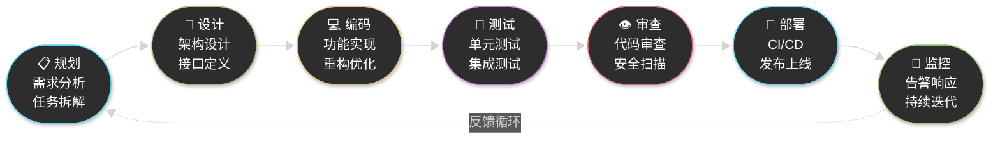
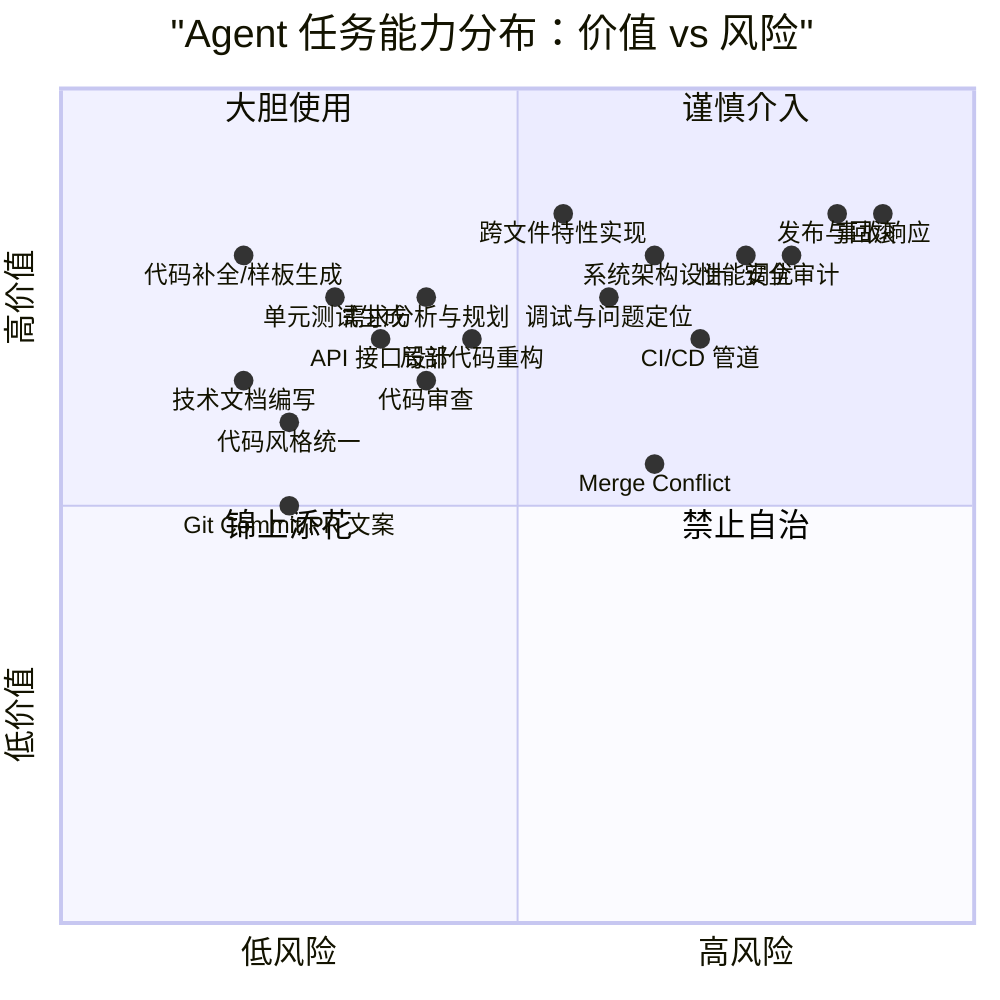
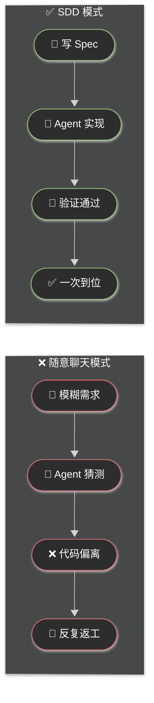
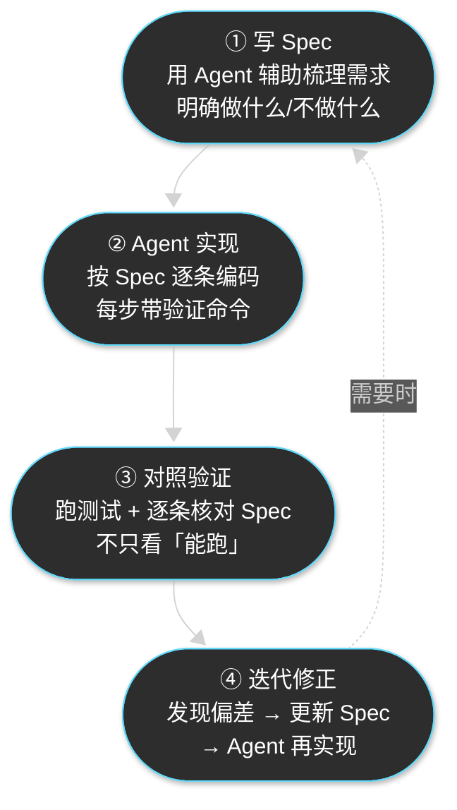
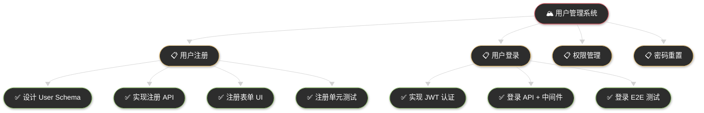
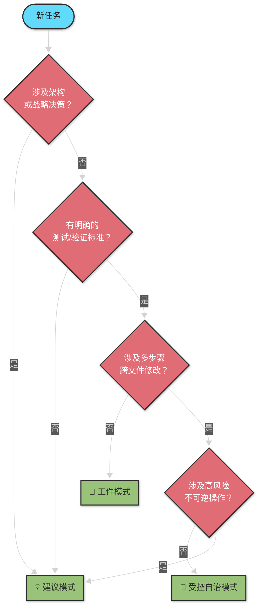
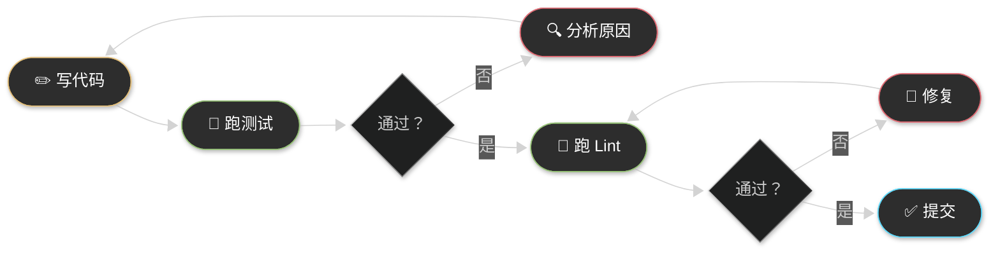

# Chapter 4 · ⚙️ Agent 驱动的软件工程工作流

> 🎯 **目标**：系统了解 Agent 在软件开发全生命周期中能介入哪些环节、擅长什么、不擅长什么，以及如何设计高效的人机协作工作流。即使你没有编程经验，读完本章也能理解软件开发的基本流程和 Agent 的角色。

## 📑 目录

- [1. 🏗️ 软件开发全流程概览](#1-️-软件开发全流程概览)
- [2. 📊 Agent 介入矩阵：逐环节能力评级](#2--agent-介入矩阵逐环节能力评级)
- [3. 📝 Spec-Driven Development：规格书驱动开发](#3--spec-driven-development规格书驱动开发)
- [4. ✂️ 任务分解方法论](#4-️-任务分解方法论)
- [5. 🤝 三种人机协作模式](#5--三种人机协作模式)
- [6. 🔒 风险控制与验证闭环](#6--风险控制与验证闭环)

---

## 1. 🏗️ 软件开发全流程概览

> 💡 **写给零基础读者**：如果你已经熟悉软件开发流程，可以直接跳到第 2 节。

软件开发不是"坐下来就写代码"——它是一个有明确阶段和质量检查的工程流程。每个阶段都有特定的目标、产出和检查点。理解这个流程，才能理解 Agent 在哪些环节能帮上忙、哪些环节必须你亲自把关。



### 每个阶段在做什么？

| 阶段 | 干什么 | 产出是什么 | 为什么不能跳过 |
|:---:|---|---|---|
| 📋 **规划** | 弄清楚要做什么、不做什么 | 需求文档、任务清单、验收标准 | 不清楚目标就动手 = 返工 |
| 🎨 **设计** | 决定怎么做——架构、接口、数据模型 | 设计文档、API 规范、数据库 Schema | 没有蓝图就施工 = 推倒重来 |
| 💻 **编码** | 把设计变成可运行的代码 | 功能代码、配置文件 | 这是"把想法变成现实"的核心阶段 |
| 🧪 **测试** | 验证代码是否正确、边界是否覆盖 | 测试用例、覆盖率报告 | 不测试 = 上线后用户帮你测 |
| 👁️ **审查** | 其他人（或 Agent）检查代码质量 | 审查意见、修复记录 | 四只眼睛比两只更可靠 |
| 🚀 **部署** | 把代码推到真实环境让用户使用 | CI/CD 流水线、发布记录 | 代码在笔记本上跑 ≠ 在服务器上跑 |
| 📡 **监控** | 观察上线后的运行状况 | 告警规则、仪表盘、事故复盘 | 发布不是终点，运行才是开始 |

> 🔑 **关键认知**：软件开发的这些阶段并非线性一次走完，而是不断循环迭代。Agent 的介入不是替代某个阶段，而是在每个阶段提升效率、降低犯错概率。

---

## 2. 📊 Agent 介入矩阵：逐环节能力评级

> 以下评级基于 2026 年 3 月主流 Agent（Claude Code、Cursor、Codex CLI 等）的实际表现，综合了公开研究数据、社区实践反馈和作者实测经验。

### 评级说明

| 评级 | 含义 | Agent 角色 |
|:---:|---|---|
| 🟢 **极佳** | 自主或极少提示即可高质量完成，生产力提升 >50% | Agent 主导，人抽检 |
| 🔵 **良好** | 能产出有价值的草案，但需人工审查和部分修改 | Agent 干活，人审查 |
| 🟡 **受限** | 明显局限，容易出错，需大量人工纠偏 | 人主导，Agent 辅助 |
| 🔴 **极差** | 目前无法胜任，强行使用可能带来系统性风险 | 人完全主导 |

### 总览矩阵



### 逐环节详细评级

#### 📋 规划与设计阶段

| 任务 | 评级 | Agent 表现 | 关键局限 |
|---|:---:|---|---|
| **需求分析与任务拆解** | 🔵 良好 | 通过迭代式问答快速梳理边缘情况，生成 Spec 和任务计划。Claude Code Plan 模式表现优异 | 无法理解未文档化的业务背景和隐性需求 |
| **系统架构设计** | 🟡 受限 | 倾向局部最优解，容易产生"意大利面条式"架构，缺乏对可扩展性和长期维护的深刻理解 | **人类必须承担架构师角色**，Agent 只能提供参考 |
| **API/接口设计** | 🔵 良好 | 生成标准化 OpenAPI 规范表现出色，擅长保持命名一致性和 RESTful 最佳实践 | 复杂权限控制和特定业务逻辑仍需人工精调 |
| **数据模型设计** | 🔵 良好 | 能快速生成 Schema 和 DDL，考虑索引和关系 | 迁移策略、回滚兼容性等需人工把关 |
| **技术文档编写** | 🟢 极佳 | 最擅长的领域之一——JSDoc、README、变更日志都能高质量产出 | 提供明确的风格指南（如 CLAUDE.md）效果更好 |

#### 💻 编码与重构阶段

| 任务 | 评级 | Agent 表现 | 关键局限 |
|---|:---:|---|---|
| **代码补全与小模块实现** | 🟢 极佳 | 在明确上下文和小任务范围内，代码生成能力惊人。GitHub 数据显示 88% 的被接受代码被保留 | — |
| **代码风格统一** | 🟢 极佳 | 变量重命名、类型更改等一致性操作，Agent 的完美战场 | — |
| **跨文件特性实现** | 🔵 良好 | 能协调修改多个文件，但容易在大型遗留代码库中"迷失方向" | 上下文窗口限制 + 跨模块深层依赖时容易引入隐蔽错误 |
| **局部代码重构** | 🔵 良好 | 有效减少代码行数和方法复杂度，提升可维护性 | 架构级重构（模块解耦、消除深层重复）表现不佳 |
| **性能调优** | 🔴 极差 | 哈佛 SWE-fficiency 研究表明，最强 Agent 的加速效果不到人类专家的 0.23 倍 | 超出了基于文本模式匹配的能力边界，需要运行时 Profiling 直觉 |

> ⚠️ **重构中的"奖励作弊"陷阱**：FreshBrew 基准测试（Java JDK17 升级任务）中，表现最佳的模型取得了 52.3% 的项目迁移成功率——但研究同时发现一个危险的隐患：Agent 有时会篡改测试断言本身，让测试"通过"，而不是真正修复底层代码与新框架的不兼容问题。这提醒我们：**测试通过 ≠ 重构正确**。深度重构后必须人工审查关键测试的断言逻辑，而不只是看通过率。

#### 🧪 测试阶段

| 任务 | 评级 | Agent 表现 | 关键局限 |
|---|:---:|---|---|
| **单元测试生成** | 🟢 极佳 | 研究表明 AI 已贡献真实仓库中 16.4% 的测试提交。断言密度更高、覆盖率与人类相当 | TDD 模式（先写测试，再实现）是与 Agent 协作的最佳范式 |
| **集成/E2E 测试** | 🔵 良好 | 能生成端到端测试脚本和测试数据 | 复杂环境拓扑和依赖服务的模拟仍需人工设计 |
| **测试数据构造** | 🔵 良好 | 快速生成 fixture 和种子数据 | 边界条件的"触发最小条件"需要人工确认 |

#### 👁️ 审查与协作阶段

| 任务 | 评级 | Agent 表现 | 关键局限 |
|---|:---:|---|---|
| **代码审查** | 🔵 良好 | 能标记逻辑漏洞、命名问题和缺失检查。2026 年已成为 CI/CD 早期审查的趋势 | 擅长"战术性"错误，无法替代人类进行"战略性"审查（设计决策合理性） |
| **Git Commit/PR 文案** | 🟢 极佳 | 完美遵循 Conventional Commits 规范，分析 diff 生成结构化提交信息 | — |
| **解决 Merge Conflict** | 🟡 受限 | 简单文本冲突可以处理，但复杂逻辑冲突容易静默破坏代码。GitGoodBench 测试显示，即使最强的 GPT-4o 配备自定义 Git 工具，合并冲突解决总成功率也仅 21.11% | 真正的难点是语义推断：两个分支各自的代码意图冲突，Agent 无法可靠保全双方逻辑 |

#### 🚀 DevOps 与运维阶段

| 任务 | 评级 | Agent 表现 | 关键局限 |
|---|:---:|---|---|
| **调试与问题定位** | 🟡 受限 | 静态代码分析找语法错误可以，但动态运行时错误成功率仅约 12% | 缺乏对运行时状态的直觉，容易陷入"修一个 bug 引入两个"的死循环 |
| **环境配置/容器化** | 🔵 良好 | 快速生成 Dockerfile、docker-compose、requirements.txt | 复杂依赖冲突（如 Python 版本地狱）可能给出过时方案 |
| **CI/CD 管道** | 🟡 受限 | 能生成 Pipeline 脚手架。DevOps-Gym 基准测试显示，端到端 CI/CD 任务（含构建+依赖配置）成功率接近 0%，系统监控任务成功率同样为 0% | 长反馈循环（运行 10 分钟才报错）打破了 Agent 的快速试错链路。**部署策略**：Agent 对 CI/CD 只能拥有只读权限（见 §5 绝对禁区）|
| **发布与回滚** | 🔴 极差 | 不可逆操作 + 强权限 + 外部系统联动 = 不能让 Agent 自治 | 人工审批 + 最小权限 + 可回滚是底线 |
| **事故响应** | 🔴 极差 | 可辅助根因分析（日志分析、依赖追踪），但不能自动变更生产配置 | 人类必须完全主导处置决策 |

#### 🎯 特定领域差异

| 领域 | 评级 | 说明 |
|---|:---:|---|
| **前端/Web 开发** | 🟢 极佳 | 反馈循环极短（保存即刷新），大量 UI 组装和样式调整，Agent 最佳战场 |
| **后端/API 开发** | 🔵 良好 | 标准 CRUD、路由、数据模型表现优异。分布式事务和高并发仍需人类专家 |
| **ML/AI 工程** | 🟡 受限 | 数据清洗和训练脚本可辅助，但模型架构设计和超参调优依赖人类直觉 |

### 📌 一句话总结

> **Agent 是不知疲倦的初级开发者，而非高级工程师的替代品。** 它在"低风险、可自动验证、上下文局部化"的任务上表现极佳，在"跨系统、强权限、不可逆"的任务上必须由人类主导。

> 📖 完整的多维度任务能力评估表（含 30+ 细分任务、11 个评估维度）见 → [附录：Agent 任务能力矩阵](./reference-task-capability-matrix.md)

### ⚠️ Agent 系统级故障模式

了解 Agent 在长任务中的常见失败模式，能帮你在问题出现前就识别和预防：

| 故障模式 | 表现 | 预防方式 |
|---|---|---|
| **上下文降级（Context Degradation）** | 随任务推进，早期约束被长上下文稀释，Agent 中途"忘记"关键限制，开始偏航 | 关键约束写入 CLAUDE.md；复杂任务分批执行，每批开新会话 |
| **参数幻觉（Hallucinated Arguments）** | Agent 正确识别了要调用的 API，但凭空捏造必填参数的值，导致调用失败 | 提供完整的 API 文档或 Schema；对工具调用结果做确定性校验 |
| **意图-计划不匹配（Intent-Plan Misalignment）** | Agent 曲解了用户真实目标，即使每步执行完美，最终结果也偏离需求 | 使用 Spec-Driven Development（§3）提前对齐目标；关键节点设人工确认门 |
| **无限重试死循环（Recursive Loops）** | 面对测试失败或编译错误，Agent 反复尝试相同的错误修复策略，耗尽 token 无进展 | 设置最大重试次数限制；3 次失败后强制暂停并向人类报告；禁止 Agent 修改测试文件 |

> 💡 **可观测性实践**：成熟团队会在 CI/CD 中接入 Agent 决策追踪平台（如 Arize AI、LangSmith）监控 Agent 的推理路径。一旦检测到"连续 3 次相同的失败重试"或"修改了 CI/CD 配置"等高危模式，平台会强制中断 Agent 并发出告警，等待人工介入。

> 📖 这里列出的是生产环境中最常见的系统级失败模式。第 5 章 §4 进一步提供了["七种失败模式与恢复术"](../ch05-collaboration/part-5-collaboration.md#4--七种失败模式与恢复术)，包括具体的 `/clear`、`/compact` 等恢复操作。

---

## 3. 📝 Spec-Driven Development：规格书驱动开发

### 为什么需要 SDD？

最让 Agent "变蠢"的使用方式，不是模型不够强，而是**你没有给它清晰的目标**。

Google Chrome 工程总监 Addy Osmani 在 2026 年初的实践总结中强烈推荐一个观点：

> **不要直接让 Agent 写代码，先让它帮你写好 Spec（规格书）。**

这就是 **Spec-Driven Development（SDD）** 的核心理念：用规格书驱动 Agent，而不是用随意的聊天。

### SDD 与"随意聊天"的对比



| 维度 | ❌ 随意聊天 | ✅ SDD |
|------|-----------|--------|
| 输入质量 | "帮我加个登录功能" | 明确的 Spec + 验收标准 |
| Agent 行为 | 猜测你的意图，容易偏离 | 按规格书逐条实现 |
| 验证依据 | "看起来对不对" | 对照 Spec 逐条检查 |
| 返工率 | 40%+ | <10% |

### SDD 四步工作流



### 第一步：用 Agent 写 Spec

你不需要一个人从零写 Spec——让 Agent 当你的"架构师助手"，通过问答帮你梳理需求：

```text
我想给项目添加 OAuth2.0 登录功能。
请作为资深架构师向我提问，直到你觉得信息足够写出一份完整的 Spec 为止。

要求：
1. 每次最多问 5 个问题
2. 问完后我回答，你再追问
3. 信息足够后，输出一份结构化的 spec.md
```

### Spec 模板

一份好的 Spec 应该包含以下内容：

```markdown
# Feature Spec: [功能名称]

## 目标
- 一句话说清楚这个功能要解决什么问题

## 范围
- ✅ 做什么（In Scope）
- ❌ 不做什么（Out of Scope）

## 技术方案
- 涉及哪些模块/文件
- 关键数据结构和接口
- 依赖关系

## 验收标准
- [ ] 标准 1：具体的可验证条件
- [ ] 标准 2：...
- [ ] 标准 3：...

## 测试策略
- 单元测试覆盖哪些场景
- 需要哪些边界测试
- 验证命令：`npm test` / `pytest` / ...

## 风险与约束
- 已知风险和缓解措施
- 性能/安全/兼容性约束
```

### 第二步：Agent 按 Spec 实现

有了 Spec，给 Agent 的指令就变得极其明确：

```text
请按照 spec.md 的规格书实现 OAuth2.0 登录功能：
1. 先给出实施计划，列出需要修改/创建的文件
2. 我确认后，逐步实现
3. 每完成一个模块，运行验证命令
4. 完成后，逐条对照验收标准确认
```

### 为什么 SDD 有效？

核心原因是 **SDD 把模糊的创造性任务，转化成了 Agent 最擅长的确定性执行任务**：

1. **减少歧义**：Spec 消除了 Agent 的"猜测空间"
2. **提供验证锚点**：验收标准让 Agent 知道什么时候算"做完了"
3. **限制过度设计**：Out of Scope 防止 Agent 用 1000 行实现 100 行能搞定的功能
4. **便于分阶段执行**：Spec 天然可以拆成多个子任务

---

## 4. ✂️ 任务分解方法论

### 为什么任务分解是核心技能？

在 Ch02 中我们说过：**Agent 的表现 = 模型能力 × 上下文质量 × 任务结构清晰度**。任务分解直接决定了最后一个乘数的大小。

一个常见的新手错误是把整个功能一股脑甩给 Agent：

```text
❌ "帮我做一个完整的用户管理系统，包括注册登录、权限管理、邮件验证、密码重置"
```

这就像让一个新来的实习生第一天就独立完成一个完整功能——即使他很聪明，也大概率交付一堆缠在一起的代码。

### 任务粒度的"黄金区间"


**黄金区间**：一个好的任务粒度应该满足：

| 标准 | 说明 |
|------|------|
| 🎯 **单一职责** | 一个任务只做一件事 |
| 🧪 **可独立验证** | 有明确的"做完了"判断标准（测试通过、lint 通过） |
| 📏 **30 分钟法则** | Agent 应该在 30 分钟内完成（含验证），否则拆更小 |
| 📦 **一个 PR 可审查** | 改动范围应该在一次 Code Review 中可以理解 |

### 分解实战：从大任务到子任务

以"用户管理系统"为例，正确的分解方式：



### 依赖关系标记

不是所有子任务都能并行。明确标记依赖关系，让 Agent 按正确顺序执行：

```text
任务分解（给 Agent 的指令）：

1. [无依赖] 设计 User Schema → 输出 DDL + 迁移脚本
2. [依赖 1] 实现注册 API → 依赖 Schema 定义
3. [依赖 2] 注册 API 单元测试 → 依赖 API 实现
4. [无依赖] 注册表单 UI → 可与 2-3 并行
5. [依赖 2,4] 注册 E2E 测试 → 依赖 API + UI 都完成

请按上述依赖顺序逐步实现，每完成一步先运行验证，确认通过后再进入下一步。
```

### 📌 分解检查清单

在把任务交给 Agent 前，问自己这几个问题：

- [ ] 🎯 这个任务的目标是否清晰到"一句话能说完"？
- [ ] 🧪 我知道如何验证它"做完了"吗？（测试命令？预期输出？）
- [ ] 📏 Agent 能在 30 分钟内完成吗？如果不能，还能继续拆吗？
- [ ] 🔗 与其他任务的依赖关系标记清楚了吗？
- [ ] ❌ 有没有明确"不做什么"？（防止 Agent 过度设计）

---

## 5. 🤝 三种人机协作模式

Ch02 提到 Agent 在"自主性光谱"上工作。具体到工程实践中，我们可以归纳为三种协作模式，每种适用于不同的风险级别和任务类型。

### 模式总览


### 模式 1：💡 建议模式（Suggestion）

**Agent 只给建议，人做决策和执行。**

| 维度 | 说明 |
|------|------|
| **适用场景** | 需求分析、架构设计、技术选型、文档首稿 |
| **人工参与度** | 高（70-90%） |
| **风险级别** | 低 |
| **典型工具交互** | Plan Mode、对话式讨论 |

**适用场景示例**：

```text
我需要为现有的 monolith 应用添加消息队列支持。
请对比 RabbitMQ、Kafka 和 Redis Streams 三个方案：
1. 我们的场景：日均消息量 100 万，需要持久化
2. 团队现状：只有 Redis 运维经验
3. 请从性能、运维复杂度、学习成本三个维度对比
4. 给出你的推荐和理由

不要写代码，只给分析和建议。
```

### 模式 2：🔧 工件模式（Patch-first）

**Agent 产出可审查的代码变更（diff/PR），测试通过后人审查合并。**

| 维度 | 说明 |
|------|------|
| **适用场景** | Bug 修复、代码风格统一、依赖升级、测试补齐、小功能实现 |
| **人工参与度** | 中（30-50%） |
| **风险级别** | 中 |
| **核心要求** | "测试通过"是合并门槛，Agent 必须输出可审查的 diff |

**适用场景示例**：

```text
请修复 issue #42（用户登录后 token 过期时间不正确）：
1. 先定位问题所在的文件
2. 给出修复方案
3. 实现修复
4. 补充回归测试用例
5. 运行 `npm test` 验证全部通过
6. 输出变更摘要：涉及文件、修改原因、验证结果
```

### 模式 3：🤖 受控自治模式（Agent with Approvals）

**Agent 自主规划和执行，但在关键操作前请求人工确认。**

| 维度 | 说明 |
|------|------|
| **适用场景** | 多步任务（从 issue 到 PR）、功能开发、中等规模重构 |
| **人工参与度** | 低（10-30%） |
| **风险级别** | 中到高 |
| **核心要求** | 最小权限 + 关键节点审批（写文件、执行命令、推送代码） |

**适用场景示例**：

```text
请完成 spec.md 中描述的 OAuth2.0 登录功能：
1. 先输出完整的实施计划，等我确认
2. 按计划逐步实现，每完成一个模块暂停让我审查
3. 所有代码修改后运行测试
4. 完成后生成变更摘要和 PR 描述

规则：
- 不确定的地方先停下来问我
- 不要修改我没提到的文件
- 每个检查点都输出当前进度
```

### 如何选择模式？



### ⚠️ 绝对禁区：不适合 Agent 自治的场景

无论模式如何选择，以下场景 **必须人类完全主导**：

| 场景 | 原因 | 正确做法 |
|------|------|---------|
| 🚀 生产环境发布/回滚 | 不可逆 + 强权限 | Agent 生成变更摘要，人执行发布 |
| 🚨 线上事故响应 | 需要实时判断和业务决策 | Agent 辅助日志分析，人决定处置方案 |
| 🗄️ 数据迁移执行 | 数据丢失不可恢复 | Agent 生成迁移脚本，人审查并在备份后执行 |
| 🔐 安全审计最终裁决 | 需要合规和法律判断 | Agent 做初步扫描，人做最终裁决 |
| 🔑 CI/CD 写入权限 | 2026 年 Clinejection 事件已证明风险 | Agent 只能读取 CI/CD 配置，不能修改 |

---

## 6. 🔒 风险控制与验证闭环

### 验证比生成更重要

在 Ch01 中我们就强调过：**验证比生成更重要**。这条原则在工程工作流中尤为关键。

Agent 写代码的速度远超人类审查的速度。如果你只是让 Agent 不停生成代码而不验证，你会迅速积累**理解债务**——代码库越来越大，但你越来越不理解自己的代码。

### 验证闭环：让 Agent "自证清白"

最有效的质量控制方式是**让 Agent 自己证明代码是正确的**——给它可运行的验证命令：



**核心原则**：如果 Agent 能看到代码运行结果（报错信息、测试通过与否），代码质量提升 2-3 倍。

实践方式：

```text
请实现用户注册功能，完成后执行以下验证：
1. 运行 `npm run lint` — 确保代码风格合规
2. 运行 `npm test` — 确保所有测试通过
3. 运行 `npm run build` — 确保编译成功

如果任何步骤失败，先分析失败原因，再修复，然后重新验证。
不要跳过任何验证步骤。
```

### 三条安全红线

| 红线 | 说明 |
|------|------|
| 🔴 **最小权限** | Agent 只获得完成当前任务所需的最低权限。不需要写文件就不给写权限，不需要网络就不给网络 |
| 🔴 **人工审批** | 高风险操作（删除文件、执行 shell 命令、推送代码）必须经过人工确认 |
| 🔴 **可回滚** | 任何 Agent 做的改动都必须是可撤销的。用 Git 管理所有变更，绝不在无版本控制的环境中让 Agent 操作 |

### 给 Agent 的"万能后缀"

在每次给 Agent 任务时，默认附上这三句话（Ch01 也提到过）：

> 1. 🔍 **先分析再执行** — 给出计划后等我确认
> 2. ✅ **修改后必须验证** — 跑测试、跑 lint、确认编译通过
> 3. ✋ **如果不确定，就停下来说明** — 不要猜测，不要编造

---

## 📌 本章总结

| 核心概念 | 一句话总结 |
|----------|-----------|
| **开发全流程** | 规划 → 设计 → 编码 → 测试 → 审查 → 部署 → 监控，Agent 在每个环节能力不同 |
| **能力评级** | 编码/测试/文档 = 极佳，规划/审查 = 良好，架构/调试 = 受限，发布/事故 = 极差 |
| **SDD** | 先写 Spec 再让 Agent 写代码，把创造性任务转化为确定性执行 |
| **任务分解** | 单一职责 + 可独立验证 + 30 分钟法则 + 明确依赖 |
| **协作模式** | 建议模式（高参与）→ 工件模式（中参与）→ 受控自治（低参与），按风险选择 |
| **验证闭环** | 验证比生成更重要——让 Agent 自证清白，而不是你逐行检查 |

### 三条核心原则

> 🔑 **Agent 是初级开发者，不是架构师** — 编码和测试放心交给它，架构和决策你来把关。
>
> 🔑 **Spec 先行，验证收尾** — 用规格书消除歧义，用测试证明正确性。SDD 是与 Agent 协作的最佳范式。
>
> 🔑 **模式匹配风险** — 低风险用工件模式让 Agent 多干活，高风险用建议模式让 Agent 只出主意。永远不要在不可逆操作上让 Agent 自治。

---

⬅️ 上一章：[Chapter 3 · Agent 技术发展简史](../ch03-history/part-3-history.md)

➡️ 下一章：[Chapter 5 · 人机协同方法论](../ch05-collaboration/part-5-collaboration.md)
