# Chapter 4 · 🎮 你的第一批实战 — 从动手开始建立信任

> 🎯 **目标**：通过 6 个可立即上手的实战练习，掌握 **Plan → Act** 的核心工作方法，建立对 Agent 能力边界的直觉。完成本章后，你将拥有与 Agent 协作的六个关键习惯。

---

## 0. 本章核心方法：先 Plan 再 Act

### 为什么不要上来就让 Agent 改代码

新手最常犯的错误：

```
帮我重构这个模块，加上测试。
```

这看起来没问题，但你会遇到：
- Agent 一口气改了 15 个文件，你看不过来
- 改完才发现方向不对，回退成本极高
- Agent 做了很多你没预期的"优化"，引入新问题

**根本原因**：你跳过了方案确认环节，让 Agent 既当设计师又当施工队，而你连图纸都没看。

### Plan-Act 两步法

所有实战都遵循同一个模式：


| 阶段 | 你做什么 | Agent 做什么 |
|:---:|---|---|
| **Plan** | 描述目标和约束 | 分析现状、给出方案 |
| **确认** | 审查方案、提出修改 | 等你确认 |
| **Act** | 观察执行过程 | 按确认的方案执行 |
| **Verify** | 检查结果、判断是否通过 | 跑测试、输出 diff |

### 三句话万能后缀

在 Ch01 中我们已经介绍过，这三句话应该成为你与 Agent 对话的下意识习惯：

```
先分析再执行。
修改后必须验证。
如果不确定，就停下来说明。
```

> 💡 **Pro Tip**：把这三句话写进项目的 `CLAUDE.md`，Agent 每次启动都会读到，你就不用每次手打了。

```markdown
# CLAUDE.md
## 工作规则
- 先给方案，等我确认后再动手
- 每次修改后运行相关测试
- 遇到不确定的地方，停下来问我
```

---

## 1. 🔍 实战一：用 Agent 理解一个真实仓库（20min）

> 🎯 **场景**：你刚接手一个陌生项目（或想深入了解一个开源仓库），需要快速建立全局认知。

### 为什么从这里开始

理解代码是 Agent 最高 ROI 的用法。传统做法需要数小时翻目录、搜关键词、读文件；Agent 可以把这个过程压缩到 20 分钟。更重要的是，这个练习不会修改任何文件——零风险，纯收益。

### 准备工作

选择一个仓库。推荐以下任意一个：

| 仓库 | 特点 | 适合 |
|------|------|------|
| **本教程仓库** (`AgenticCodingTutorial`) | 你正在读的项目，结构清晰 | 所有人 |
| **[obra/superpowers](https://github.com/obra/superpowers)** | Agent Skills 框架，代码量适中 | 想了解 Skill 体系 |
| **你自己的项目** | 你最熟悉，能验证 Agent 分析是否准确 | 有工程经验的读者 |

```bash
# 如果用 superpowers
git clone https://github.com/obra/superpowers
cd superpowers
claude
```

### Step 1：结构化提问

```
请帮我全面理解这个仓库：

1. 项目定位：一句话说清楚这个项目解决什么问题
2. 目录结构：列到第二级，标注每个目录的作用
3. 核心模块：哪 3-5 个文件/目录最重要？为什么？
4. 技术栈：语言、框架、依赖
5. 启动命令：如何安装、运行、测试

先不要修改任何文件，只做分析。
```

Agent 会遍历目录、读关键文件，然后给你一份结构化的项目概览。

### Step 2：追问式深入

概览之后，选择你最感兴趣的部分深入追问：

```
你提到 [核心模块名] 是最重要的模块。
请追踪它的核心调用链：从入口到最终执行，中间经历了哪些步骤？
用简明的流程图或列表说明。
```

### Step 3：交叉验证

Agent 的分析不一定 100% 准确。用这个方法验证：

```
请列出你在分析中做了哪些假设。
有没有你不确定的地方？哪些结论是你从代码中直接读到的，哪些是推测的？
```

> ⚠️ **重要**：Agent 在理解代码时会出现"自信地胡说"的情况——它可能编造一个听起来合理但实际不存在的调用链。追问假设是防御手段。

### ✅ 检查点

完成后问自己：

- [ ] 我能用自己的话向别人介绍这个项目吗？
- [ ] 我知道项目的核心入口在哪里吗？
- [ ] 如果要改一个功能，我大概知道该从哪个文件开始看吗？

> 📌 **经验沉淀**：在 `CLAUDE.md` 中记录你总结出的项目探索 prompt 模板，下次换项目时直接复用。

---

## 2. 🐛 实战二：用 Agent 定位并修复一个 Bug（30min）

> 🎯 **场景**：项目中有一个已知问题（或你故意制造一个），用 Agent 完成"定位 → 分析 → 修复 → 验证"全流程。

### 准备工作

如果手头没有现成 Bug，可以故意引入一个：修改某个函数的返回值、删掉一行关键代码、或改错一个条件判断，然后假装不知道原因。

### Step 1：描述现象，不要描述原因

**正确**做法：

```
运行 `npm test` 后，test/utils.test.js 中的 "should parse date correctly"
这个测试用例失败了。错误信息是 "Expected '2026-03-23' but got 'NaN-NaN-NaN'"。

请帮我分析可能的原因。先不要改代码，给出 2-3 个可能的原因和排查顺序。
```

**错误**做法：

```
我觉得 parseDate 函数的正则写错了，帮我修一下。
```

> 💡 **为什么**：如果你直接告诉 Agent 原因，它会"顺着你的思路"修——即使你猜错了。描述现象让 Agent 独立分析，往往能发现你没想到的根因。

### Step 2：确认排查顺序

Agent 会给出类似这样的分析：

```
可能原因（按可能性排序）：
1. parseDate 函数接收到了非预期格式的字符串输入
2. 日期格式化时 locale 设置与测试环境不一致
3. 依赖库版本升级导致 API 变化

建议排查顺序：先检查 #1（成本最低），再检查 #2...
```

你确认后：

```
同意，请按这个顺序排查。找到根因后先给出修复方案，不要直接改。
```

### Step 3：确认修复方案后执行

```
方案看起来合理。请执行修复，修复后：
1. 运行失败的测试用例确认通过
2. 运行完整测试套件确认没有引入新问题
3. 输出你改了哪些文件、每个文件改了什么
```

### Step 4：审查修复

```
请解释你修复的核心逻辑。为什么这个改动能解决问题？有没有其他地方存在同样的问题？
```

### ✅ 检查点

- [ ] 你看懂了 Agent 的修复逻辑吗？
- [ ] 测试通过了吗？
- [ ] Agent 有没有"顺手"改了你没要求的东西？（如果有，检查是否合理）

> 📌 **经验沉淀**：Bug 修复标准流程 → 描述现象 → 分析原因 → 确认方案 → 执行修复 → 验证结果。

---

## 3. 🧪 实战三：让 Agent 自动写测试用例（20min）

> 🎯 **场景**：选一个没有测试覆盖的函数或模块，让 Agent 补上测试。

### Step 1：让 Agent 分析测试缺口

```
请分析这个项目的测试覆盖情况：
1. 哪些模块已经有测试？
2. 哪些模块缺少测试但应该有？
3. 按"业务重要性 × 出错成本"排序，推荐最该先补测试的 3 个模块

先给分析，不要写测试代码。
```

### Step 2：确认测试场景

Agent 会推荐目标模块，然后你让它列出测试场景：

```
请为 [模块名] 列出应覆盖的测试场景，包括：
- 正常路径（happy path）
- 边界条件（空值、极大值、特殊字符）
- 错误处理路径（异常输入、网络失败）

只列场景，不写代码。我确认后再写。
```

### Step 3：确认后生成测试

```
场景列表认可。请按以下规范生成测试代码：
- 每个测试用例一个清晰的描述
- 使用项目已有的测试框架和风格
- 确保测试能独立运行，不依赖其他测试的执行顺序
- 写完后运行测试，确保全部通过
```

### Step 4：审查测试质量

这是关键步骤——Agent 写的测试常见问题：

| 常见问题 | 检查方法 |
|---------|---------|
| **只测 happy path** | 检查是否有边界条件和错误处理的用例 |
| **测试和实现耦合太紧** | 改了实现细节，测试是否全崩？ |
| **断言太弱** | `expect(result).toBeTruthy()` 这种几乎测不出 bug |
| **缺少独立性** | 测试之间是否有隐藏的顺序依赖？ |

```
请自检你写的测试：
1. 是否覆盖了所有我确认的场景？
2. 有没有断言过于宽松的用例？
3. 如果我把 [核心函数] 的返回值改成 null，有几个测试会失败？
```

### ✅ 检查点

- [ ] 所有测试通过
- [ ] 你认同测试覆盖的场景（特别是边界条件）
- [ ] 测试代码的风格与项目一致

---

## 4. 📝 实战四：简单的 CRUD 增删改查（30min）

> 🎯 **场景**：从零实现一个小功能——TODO List API（或任何你需要的简单 CRUD）。这是 Agent 最擅长的领域之一。

### Step 1：给 Agent 一份简单的 Spec

```
请帮我实现一个 TODO List 的 REST API，技术要求：

功能：
- POST   /todos       — 创建 TODO（title 必填，status 默认 pending）
- GET    /todos       — 列出所有 TODO
- GET    /todos/:id   — 获取单个 TODO
- PUT    /todos/:id   — 更新 TODO
- DELETE /todos/:id   — 删除 TODO

技术约束：
- 使用 Node.js + Express（或 Python + FastAPI，你选）
- 用内存存储（不需要数据库）
- 包含基本的输入验证和错误处理
- 附带测试

请先给出实现方案（文件结构、技术选型、实现步骤），
不要立刻写代码。
```

> 💡 **为什么用内存存储**：降低复杂度，聚焦在 Agent 的代码生成和测试能力上。真实项目中你可以在后续让 Agent 替换为数据库。

### Step 2：确认方案后分步实现

```
方案认可。请按你给出的步骤逐步实现。
每完成一个接口（一个 endpoint），就：
1. 写对应的测试
2. 运行测试确认通过
3. 告诉我进度

不要一口气全写完。
```

### Step 3：全部完成后做集成验证

```
所有接口都实现了。请：
1. 运行完整测试套件
2. 用 curl 或类似方式演示一个完整的使用流程：
   创建 → 列出 → 更新 → 查看 → 删除 → 确认已删除
3. 检查边界情况：创建时 title 为空会怎样？访问不存在的 id 呢？
```

### ✅ 检查点

- [ ] 全部接口可用且测试通过
- [ ] 错误处理合理（400 / 404 / 500 区分正确）
- [ ] 你能读懂生成的代码结构

> ⚠️ **注意**：Agent 生成的 CRUD 代码通常质量不错，但要注意检查它是否加了你没要求的"锦上添花"功能——比如自动加分页、自动加认证。保持简单。

---

## 5. 🔀 实战五：Git 工作流基础操作（15min）

> 🎯 **场景**：让 Agent 帮你完成日常 Git 操作——创建分支、提交代码、写 commit message、生成 PR 描述。

### Step 1：创建分支并提交

```
请帮我完成以下 Git 操作：
1. 基于当前分支创建一个新分支，命名为 feat/add-todo-api
2. 将当前所有改动暂存（stage）
3. 按 Conventional Commits 规范写 commit message
4. 提交

在执行每一步之前，先告诉我你要运行什么命令。
```

> 💡 **Conventional Commits** 是一种标准化的 commit message 格式：`feat:`, `fix:`, `docs:`, `refactor:` 等前缀。Agent 非常擅长生成符合规范的 commit message。

### Step 2：审查 commit message 质量

Agent 生成的 commit message 通常类似：

```
feat: add TODO list REST API with CRUD operations

- Implement POST/GET/PUT/DELETE endpoints for todo items
- Add input validation and error handling
- Include unit tests for all endpoints
```

检查要点：

| 维度 | 好的 commit message | 差的 commit message |
|------|-------------------|-------------------|
| **主题行** | 简洁、说清"做了什么" | 过长或含糊（如 "update code"） |
| **正文** | 说明"为什么"，而非只列"改了什么" | 只是重复 diff 内容 |
| **粒度** | 一个 commit 做一件事 | 把 3 个不相关改动塞一个 commit |

### Step 3：生成 PR 描述

```
请为当前分支生成一份 Pull Request 描述，包含：
1. 变更概要（3 句话以内）
2. 具体改动列表
3. 测试情况
4. 需要 reviewer 重点关注的地方

使用 Markdown 格式。
```

### ✅ 检查点

- [ ] commit 粒度合理（一个 commit 一件事）
- [ ] commit message 可读、符合规范
- [ ] PR 描述准确反映了改动内容

> 📌 如果你的团队有特定的 commit 和 PR 规范，把它写进 `CLAUDE.md`，Agent 会自动遵守。

---

## 6. 📄 实战六：让 Agent 生成/改善文档（15min）

> 🎯 **场景**：让 Agent 为一个模块补充 README、函数注释或 API 文档。

### Step 1：指定目标和格式

```
请阅读 [目标模块/文件]，然后生成使用文档。

要求格式：
1. 一句话说明模块功能
2. 使用场景（什么时候该用，什么时候不该用）
3. 前置条件和依赖
4. 快速上手示例（可直接运行）
5. API 参考（参数、返回值、异常）
6. 常见问题

输出 Markdown 格式。先输出草稿，我审查后再定稿。
```

### Step 2：审查文档质量

Agent 生成的文档有几个典型盲区：

| 盲区 | 你需要做什么 |
|------|------------|
| **只写了"适用场景"，没写"不适用场景"** | 补充限制条件和已知边界 |
| **示例代码未经验证** | 复制示例实际运行一遍 |
| **措辞过于乐观** | Agent 倾向正面描述，你需要补充注意事项 |
| **和代码实际行为不一致** | 对照源码核实参数名、返回值、异常类型 |

```
请自检文档：
1. 示例代码能直接运行吗？
2. 描述的参数和返回值与源码一致吗？
3. 有没有遗漏"不适用场景"或"已知限制"？
```

### Step 3：让 Agent 检查一致性

```
请检查新文档和代码中的注释/docstring 是否一致。
如果有矛盾，列出来让我决定以哪个为准。
```

### ✅ 检查点

- [ ] 文档能帮到一个从未接触过该模块的新人
- [ ] 示例代码可运行
- [ ] 包含了"不适用场景"或"注意事项"

---

## 7. 📌 本章总结：你已建立的六个关键习惯

通过这六个实战，你不只是完成了六个任务——你建立了一套可复用的 Agent 协作方法论。

| # | 习惯 | 核心行为 | 反面教材 |
|:---:|------|---------|---------|
| ① | **先 Plan 再 Act** | 让 Agent 先给方案，你确认后再执行 | 直接说"帮我重构" |
| ② | **修改后必须验证** | 每次改动跑测试、检查 diff | "看起来对就行" |
| ③ | **不确定就停下来** | 遇到模糊的地方让 Agent 说明 | Agent 猜错了继续猜 |
| ④ | **分步推进** | 一次只做一件事，逐步验证 | 一口气让 Agent 做完所有事 |
| ⑤ | **审查 Agent 的输出** | 检查生成的代码/文档/测试 | 无脑接受所有建议 |
| ⑥ | **经验沉淀** | 好的做法写进 `CLAUDE.md` / Skill | 每次都从零开始 prompt |

### 你的 CLAUDE.md 应该长成这样了

经过六个实战，你的 `CLAUDE.md` 至少应该包含这些沉淀：

```markdown
# CLAUDE.md

## 工作规则
- 先给方案，等我确认后再动手
- 每次修改后运行相关测试
- 遇到不确定的地方，停下来问我
- 一次只做一件事，不要批量修改

## Bug 修复流程
- 先描述现象，不要猜原因
- 要求 2-3 个可能原因并排优先级
- 确认后再修，修完跑测试

## 测试规范
- 覆盖 happy path + 边界条件 + 错误处理
- 断言要具体，不用 toBeTruthy 这种弱断言

## Git 规范
- Commit message 使用 Conventional Commits
- PR 描述包含：概要、改动列表、测试情况、关注点

## 上下文与记忆分层
# 索引层（常驻上下文）：工具列表、目录结构、关键模块名
# 摘要层（按需加载）：重要模块说明、任务阶段总结
# 详情层（按需读取）：完整源码、日志、长文档
# → 中间产物写入文件，不要全部留在对话上下文里
```

> 💡 **`CLAUDE.md` 是复利资产**——你沉淀得越多，后续 Agent 的表现就越好，因为它每次启动都会读这个文件。

---

## 8. 🗂️ 补充认知：三种基础设施的分工

在你积累更多实战经验后，会发现 Agent 的行动空间其实建立在三层基础设施上，搞清楚它们的分工，能帮你少走很多弯路：

| 基础设施 | 定位 | 典型用法 |
|---------|------|---------|
| **CLI / Shell** | 统一行动总线，把各种系统能力暴露给 Agent | 执行构建、测试、Git 操作、调用外部服务 |
| **文件系统** | 默认的长期记忆与工作空间 | 存放代码、日志、`CLAUDE.md`、经验总结、阶段产物 |
| **RAG / 向量库** | 处理体量大、结构松散的知识 | 大量 PDF、网页爬取、历史工单等 |

📌 **实践原则**：

- 对工程类任务，优先用**文件系统 + ripgrep** 检索项目内容，而不是把代码塞进向量库
- 能用 **CLI 命令**完成的操作，不需要专门设计一个工具；Agent 本身就会写代码来调用命令
- **RAG** 适合体量特别大、和代码仓库分离的外部知识，不是默认选项

> 💡 初学者常犯的错误：一上来就搭向量库，结果发现 Agent 直接读文件效果更好、更容易调试。

---

## 9. 📐 补充认知：渐进式披露 — 只在需要时才加载信息

上一节讲了三层基础设施的分工。这里补充一个和上下文管理密切相关的设计模式：**渐进式披露（Progressive Disclosure）**。

### 什么是渐进式披露

**核心原则**：不要在系统提示里一次性塞入所有工具说明和背景文档——只在 Agent 真正需要某个信息时，再加载对应的详细内容。

这和 UI 设计中的「渐进式披露」是同一个思想：先给概览，用户（Agent）需要细节时再展开。

### 三层结构实践

```mermaid
flowchart TB
    L1["📑 索引层（常驻上下文）<br/>工具名列表 · 文档目录 · 模块名"]
    L2["📋 摘要层（按需加载）<br/>工具一句话说明 · 模块功能简介 · 任务阶段摘要"]
    L3["📄 详情层（按需读取）<br/>完整工具文档 · 源代码 · 日志 · 长文档"]

    L1 -->|"需要了解某工具"| L2
    L2 -->|"需要深入使用"| L3

    style L1 fill:#2d2d2d,stroke:#61dafb
    style L2 fill:#2d2d2d,stroke:#e5c07b
    style L3 fill:#2d2d2d,stroke:#98c379
```



| 层级 | 始终保留在上下文 | 内容示例 |
|------|--------------|---------|
| **索引层** | 是 | 工具名与一句话简介、目录结构、关键模块名 |
| **摘要层** | 按需 | 某工具的输入输出说明、某模块的职责描述 |
| **详情层** | 按需 | 完整 API 文档、源代码、历史日志 |

### 为什么这很重要

工具描述本身会吃掉大量 token。如果你有 30 个工具，每个工具的 JSON schema 描述平均 200 token，那光工具定义就占去 6000 token——而其中可能 25 个工具在当前任务里根本用不到。

渐进式披露的好处：
- **上下文更干净**：减少无关信息干扰，Agent 更容易聚焦
- **成本可控**：只为真正需要的内容付费
- **决策更准确**：工具越少越精准，避免 Agent 选错工具

### Skill 本身就是渐进式披露的最佳实践

渐进式披露不只是一个 prompt 设计技巧——在 Skill 体系里，它被设计成了三层物理结构：

| 层级 | 文件形式 | 内容 | 加载时机 | token 量级 |
|------|---------|------|---------|-----------|
| **元数据层** | YAML 头 | 技能名、描述、触发条件 | 始终加载 | ~100 tokens |
| **指令层** | SKILL.md 主体 | 执行步骤、规则逻辑、输出格式 | 触发时加载 | ~1000 tokens |
| **资源层** | scripts / 参考文件 | 脚本、模板、示例代码 | 引用时加载 | 5000+ tokens |

📌 **对比传统做法**：把所有工具说明、规则、示例一股脑放进系统提示 = 每次都把三层全部加载（可能 40,000+ tokens）。Skill 的三层结构让你只在真正需要时才付出上下文代价。

```
# 示意：一个 Skill 的三层结构
.claude/skills/code-review/
├── skill.yaml          ← 元数据层（始终加载）
│   # name: code-review
│   # description: 对照检查清单执行代码审查
│   # trigger: 当用户说"review"或"审查代码"时
│
├── SKILL.md            ← 指令层（触发时加载）
│   # 步骤1: 读取目标文件
│   # 步骤2: 按清单逐项检查
│   # 步骤3: 按严重性输出报告
│
└── resources/
    ├── checklist.md    ← 资源层（引用时加载）
    └── report-template.md
```

> 💡 这正是为什么 superpowers 框架中每个 Skill 都是独立文件而不是一个大的系统提示——它在架构层面强制实现了渐进式披露。

### 在实践中落地

把渐进式披露原则写进 `CLAUDE.md`：

```markdown
## 工具与文档加载规则
- 启动时只加载工具索引（名称 + 一句话描述）
- 需要使用某工具时，再读取其完整文档
- 大文件按需读取，不要一次性加载整个目录
- 每个任务阶段结束时，把中间产物写入文件而不是留在对话中
```

> ⚠️ 反模式：把项目所有文档、所有工具说明统统放进系统提示——这是把 Agent 的注意力预算当作无限资源在挥霍。

---

## 📋 本章实战速查

| # | 实战 | 时间 | 难度 | 核心技能 |
|:---:|------|:---:|:---:|---------|
| 1 | 🔍 理解仓库 | 20min | ⭐ | 结构化提问、追问调用链 |
| 2 | 🐛 修复 Bug | 30min | ⭐⭐ | 现象描述、分步排查、验证 |
| 3 | 🧪 写测试 | 20min | ⭐⭐ | 测试场景设计、质量审查 |
| 4 | 📝 CRUD 开发 | 30min | ⭐⭐ | Spec 编写、分步实现、集成验证 |
| 5 | 🔀 Git 工作流 | 15min | ⭐ | commit 规范、PR 描述 |
| 6 | 📄 生成文档 | 15min | ⭐ | 文档审查、一致性检查 |

> 建议按顺序完成前两个，后面四个可以根据你的工作需要选择性练习。

---

## 🎉 下一步：从"能用"走向"善用"

恭喜你完成了第一批实战！你已经掌握了与 Agent 协作的基本节奏：

- ✅ 你知道怎么让 Agent 先出方案再动手
- ✅ 你知道怎么验证 Agent 的输出
- ✅ 你开始积累自己的 `CLAUDE.md`

接下来，我们将深入理解 Agent 的工作原理和工具体系——了解引擎盖下面发生了什么，让你从"能开车"变成"会调车"。

👉 下一章：[Chapter 5 · Agent 工作原理与工具体系](../ch05-agent-mechanics/part-5-agent-mechanics.md)

---

<div align="center">

[📚 返回目录](../../README.md#tutorial-contents) | [⬅️ 上一章：Ch03 术语速查手册](../ch03-glossary/part-3-glossary.md) | [➡️ 下一章：Ch05 Agent 内部机制](../ch05-agent-mechanics/part-5-agent-mechanics.md)

</div>
