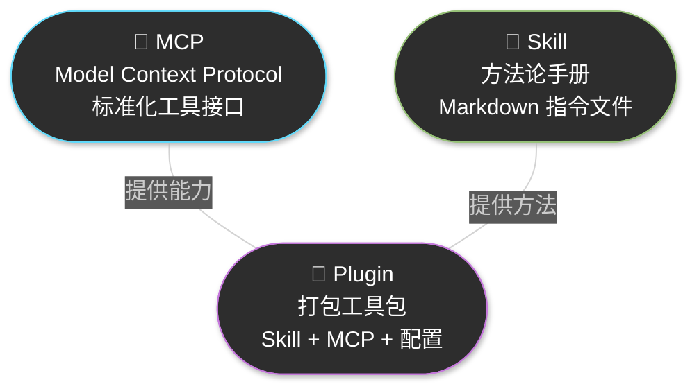
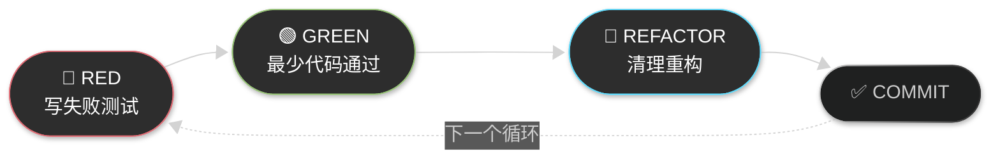

# Chapter 8 · ⚙️ 扩展生态与会话管理

> 🎯 **目标**：掌握权限与安全配置、MCP/Skill/Plugin 三大扩展机制的实操安装，以及会话管理的核心技巧。本章实验最多——完成 F-1 到 F-5 五个动手实验后，你将拥有一个功能完备的 Agent 工作环境。

## 📑 目录

- [1. 🔒 权限与安全配置](#1--权限与安全配置)
- [2. 🧩 MCP / Skill / Plugin：三种扩展能力](#2--mcp--skill--plugin三种扩展能力)
- [3. 💬 会话管理：保持 Agent 精准的关键](#3--会话管理保持-agent-精准的关键)
- [📌 Part II 总结](#-part-ii-总结)

---

## 1. 🔒 权限与安全配置

Agent 会在你的本地环境中读写文件、执行命令。在放手让它干活之前，你需要理解权限控制——既不能让它束手束脚，也不能让它为所欲为。

### 三种权限模式

Claude Code 提供三种权限模式，适用于不同的信任级别和工作场景：


| 模式 | 文件编辑 | 命令执行 | 适用场景 |
|:---:|:---:|:---:|---|
| 🛡️ **默认** | 需确认 | 需确认 | 初次使用、敏感项目、不熟悉的代码库 |
| ✏️ **Edit Before Ask** | ✅ 自动 | 需确认 | 日常开发——Agent 可自由编辑，但执行命令前你把关 |
| ⚡ **Bypass All** | ✅ 自动 | ✅ 自动 | 隔离沙箱内的快速原型、有完善 Git 保护的低风险任务 |

**在 CLI 中切换权限模式：**

```bash
# 使用 --dangerously-skip-permissions 启动 Bypass 模式
claude --dangerously-skip-permissions

# 日常推荐：在 CLI 交互中使用 /permissions 查看和调整
/permissions
```

**在 VS Code 插件中：**

打开 Claude Code 侧边栏 → 设置（齿轮图标）→ Permission Mode 下拉选择。

> ⚠️ **Bypass All 模式的安全提醒**：此模式下 Agent 可以不经确认执行任意 Shell 命令。只建议在以下情况使用：(1) Docker/沙箱隔离环境中，(2) 已在 Git 中保存所有重要变更，(3) 不涉及生产环境或敏感数据。

### 沙箱配置

如果你想在 Bypass 模式下安全工作，沙箱是最佳搭档。常见方案：

| 方案 | 说明 | 命令示例 |
|------|------|---------|
| **Docker 容器** | 在隔离容器中运行 Claude Code | `docker run -it -v $(pwd):/workspace node:20 bash` |
| **Git Worktree** | 在独立工作树中实验，主分支不受影响 | `git worktree add ../experiment feature-x` |
| **虚拟机/远程** | 在远程开发容器中操作 | VS Code Remote Containers |

> 💡 最轻量的"沙箱"其实就是 **Git**：确保所有修改都在版本控制下，随时可以 `git checkout -- .` 或 `git stash` 回退。

### 💡 实用小技巧：修改发送键

Claude Code CLI 默认按 `Enter` 发送消息。写多行 Prompt 时很容易误触发。

**CLI 中修改：**

```bash
# 进入 Claude Code 后执行
/config

# 找到 "Send Message Keybinding"，改为 Cmd+Enter（macOS）或 Ctrl+Enter（Linux/Windows）
```

**VS Code 插件中修改：**

1. 打开设置（`Cmd+,`）
2. 搜索 `claude code submit`
3. 将 Submit Key 从 `Enter` 改为 `Cmd+Enter`

> 💡 强烈建议新手第一时间修改此设置。在精心构建多行 Prompt 时误按 Enter 发出半成品指令，会浪费 Token 且干扰 Agent 理解。

> 📖 更多安全配置细节（权限治理框架、企业级审计、CI/CD 权限边界等）→ Part IV · 安全、权限与合规专题

---

## 2. 🧩 MCP / Skill / Plugin：三种扩展能力

Claude Code 的能力不是固定的——你可以通过三种机制扩展它。在动手之前，先建立清晰的概念区分。

### 概念速查



| 扩展类型 | 类比 | 核心作用 | 典型例子 |
|:---:|------|---------|---------|
| 🔌 **MCP** | USB-C 接口 | 让 Agent 连接外部服务（GitHub、数据库、浏览器） | `@anthropic/github-mcp-server` |
| 📝 **Skill** | 经验丰富的同事写的操作手册 | 教 Agent "怎么做"——注入方法论和流程 | `superpowers/brainstorming` |
| 🧰 **Plugin** | 应用商店里的"一键安装包" | 把 Skill + MCP + 配置打包成开箱即用的套件 | `obra/superpowers` |

> 🔑 **一句话记忆**：MCP 给 Agent **双手**（连接外部工具），Skill 给 Agent **大脑**（注入方法论），Plugin 把两者**打包成产品**。

### 实验 F-1：安装 Superpowers Plugin

[obra/superpowers](https://github.com/obra/superpowers) 是目前最知名的 Agent Skills 框架（75K+ Stars），入选 Anthropic 官方 Marketplace。它把软件开发的完整生命周期编码成了可复用的 Skill。

**安装步骤：**

```bash
# 在 Claude Code CLI 中执行（确保你在一个项目目录下）
claude

# 进入交互后，安装 Plugin
/install-plugin obra/superpowers
```

**验证安装成功：**

```bash
# 退出并重新启动 Claude Code
/exit
claude

# 输入以下内容，观察 Agent 是否自动使用 superpowers 的 brainstorming Skill
brainstorm 一下如何改进这个项目的错误处理机制
```

如果安装成功，Agent 会进入苏格拉底式提问模式——不是直接给答案，而是先通过一系列问题帮你厘清需求。

**你会看到类似这样的交互：**

```
Agent: 在我们开始设计错误处理方案之前，让我先了解几个关键问题：
1. 当前项目中最常见的错误类型是什么？
2. 这些错误通常在什么阶段被发现？
3. 你希望用户看到什么样的错误信息？
...
```

> ✅ **检查点**：Agent 能识别并使用 superpowers 的 Skill，而不是直接给你一个代码方案。

### 实验 F-2：安装 Claude 官方 Skill Creator

Anthropic 提供了一个官方的 Skill Creator——它能帮你从零创建新的 Skill。这是一个"meta 工具"：用 Skill 来写 Skill。

**安装步骤：**

```bash
claude

# 安装 Anthropic 官方 Skill Creator
/install-skill https://github.com/anthropics/claude-code-skill-creator
```

如果上述仓库路径有变，也可以使用 Anthropic 官方文档提供的最新安装方式。安装后，Skill Creator 会出现在你的 `~/.claude/skills/` 目录下。

**快速验证：**

```bash
# 让 Agent 使用 Skill Creator
请帮我为这个项目创建一个"代码审查"Skill，
当我说"审查代码"时，Agent 应该按照固定清单检查。
```

Agent 会引导你定义：
- Skill 的名称和触发条件
- 执行步骤和检查清单
- 输出格式

最终在项目的 `.claude/skills/` 目录下生成 `SKILL.md` 文件。

> ✅ **检查点**：你的项目中应该新增了一个 `.claude/skills/<skill-name>/SKILL.md` 文件。

### 实验 F-3：安装并使用一个 MCP

MCP（Model Context Protocol）让 Agent 可以连接外部服务。我们以 **filesystem MCP** 为例——它允许 Agent 对指定目录进行更精细的文件操作。

**方式一：使用 Claude Code 内置命令添加 MCP**

```bash
claude

# 添加 filesystem MCP Server
/mcp add filesystem npx -y @anthropic/mcp-filesystem --dir /path/to/your/project
```

**方式二：手动编辑配置文件**

编辑 `~/.claude/settings.json`，在 `mcpServers` 字段中添加：

```json
{
  "mcpServers": {
    "filesystem": {
      "command": "npx",
      "args": ["-y", "@anthropic/mcp-filesystem", "--dir", "/path/to/your/project"]
    }
  }
}
```

**如果你更想体验 GitHub MCP：**

```bash
# 需要先准备 GitHub Personal Access Token
# 在 GitHub Settings → Developer Settings → Personal Access Tokens → Fine-grained tokens 中创建

claude

/mcp add github npx -y @anthropic/github-mcp-server

# Agent 会提示你配置 GITHUB_TOKEN 环境变量
```

**验证 MCP 工作正常：**

```bash
# 重启 Claude Code 后
/mcp

# 应看到已配置的 MCP Server 及其状态
# 然后尝试让 Agent 使用它
请通过 MCP 列出当前项目根目录下的所有文件和它们的大小。
```

> 💡 **MCP 的上下文成本**：每个 MCP Server 会在每次对话中消耗约 8K-18K tokens 的上下文空间（用于工具描述和通信协议）。不需要的 MCP 不要一直挂着。

> ✅ **检查点**：`/mcp` 命令能看到你添加的 Server，且 Agent 能通过 MCP 执行对应操作。

### 实验 F-4（Meta 实验）：用 Skill Creator 生成环境配置 Skill

这个实验把前面的知识串联起来——用 F-2 安装的 Skill Creator，把"配置开发环境"这件事本身沉淀为一个可复用的 Skill。

**为什么这是"Meta 实验"**：你在教 Agent 如何教未来的 Agent（或新同事的 Agent）配置环境。这就是 Skill 体系的递归价值。

**步骤一：回顾你的配置过程**

```
请回顾我们在这个项目中做过的所有配置：
1. 安装了哪些依赖
2. 配置了哪些环境变量
3. 安装了哪些 Plugin/Skill/MCP
4. 有哪些关键的配置文件

列出来，按顺序整理。
```

> 💡 **推荐安装 Claude Code History Viewer**：这是一个可以浏览和搜索 Claude Code 对话历史的工具，帮你回溯过去的操作记录。
>
> ```bash
> # 在另一个终端中安装和使用
> npx @anthropic/claude-code-history
> ```
>
> 有了对话历史回顾，你的环境配置 Skill 会更完整。

**步骤二：让 Skill Creator 生成 Skill**

```
基于上面整理的配置步骤，请用 Skill Creator 为这个项目创建一个
"环境配置" Skill。要求：

1. Skill 名称：project-setup
2. 触发条件：当新成员说"配置开发环境"或"setup"时
3. 包含完整的依赖安装、环境变量配置、工具安装步骤
4. 每步都有验证命令，确保配置成功
5. 列出常见的配置错误和解决方法
```

**预期产出：**

```
.claude/skills/project-setup/
├── SKILL.md              # 配置流程和验证步骤
└── scripts/
    └── verify-setup.sh   # 一键验证环境配置是否完整
```

> ✅ **检查点**：你已经创建了一个可复用的 Skill。以后任何人 clone 这个项目，Agent 都能按照这个 Skill 自动配置环境。

### 实验 F-5：Superpowers 实战体验

在 F-1 中你已经安装了 superpowers。现在用它体验三个核心 Skill——brainstorming、writing-plans 和 TDD。

**体验 1：Brainstorming Skill**

进入你的项目目录，给 Agent 一个功能需求：

```
我想给这个项目添加一个自动生成 Changelog 的功能。
请先帮我梳理需求。
```

superpowers 的 brainstorming Skill 会自动激活，引导你回答：
- Changelog 覆盖哪些变更类型？
- 输入来源是 Git log 还是 Conventional Commits？
- 输出格式是什么？
- 目标受众是开发者还是最终用户？

**体验 2：Writing Plans Skill**

在 brainstorming 完成后：

```
基于刚才的讨论，请生成一份实现计划。
```

Agent 会生成一份结构化的实施计划，包含：
- 要创建/修改的文件列表
- 每个步骤的详细操作
- 验证标准
- 依赖关系

**体验 3：TDD Skill**

选择计划中的一个小模块，体验 RED → GREEN → REFACTOR 循环：

```
请用 TDD 方式实现计划中的 [模块名]：
1. 先写一个会失败的测试
2. 让我看到测试确实失败
3. 再写最少代码让测试通过
4. 看看有没有需要重构的地方
```

superpowers 的 TDD Skill 有一条硬性约束：**如果 Agent 试图在写测试之前先写实现代码，Skill 会要求它删掉代码重新来过。** 这正是 Skill 的价值——用规则约束 Agent 的行为，防止它"自作主张"。



> ✅ **总检查点**：完成 F-1 到 F-5 后，你应该：
> - 安装并使用了 superpowers Plugin
> - 用 Skill Creator 创建了自定义 Skill
> - 配置并使用了 MCP Server
> - 体验了 Skill 的递归价值（用 Skill 写 Skill）
> - 亲历了 brainstorming → plans → TDD 的完整流程

> 📖 MCP、Skill、Plugin 的深度指南见 → Part IV 进阶专题：
> - [Skill 系统专题](../topics/topic-skills.md)
> - [MCP 协议专题](../topics/topic-mcp.md)

---

## 3. 💬 会话管理：保持 Agent 精准的关键

工具装好了，权限配好了——但如果不会管理会话，Agent 的表现会随着对话变长而快速退化。会话管理是让 Agent **持续高效**的核心技能。

### 核心原则：尽早且经常纠正方向


Agent 不是自动驾驶——它是一个需要你不断"微调方向盘"的副驾驶。两条铁律：

1. **发现 Agent 理解偏差，立刻纠正**——不要想着"再看看"，越晚纠偏成本越高
2. **任务完成一个阶段，立刻压缩或清理**——不要让历史信息污染后续判断

### 积极管理 Context

Agent 的上下文窗口是有限资源。随着对话增长，窗口逐渐填满，Agent 开始"遗忘"早期指令，产生更多错误。


你需要主动帮 Agent 管理它的"注意力"——这就是会话管理的全部意义。

### 七个关键会话操作

#### ① `/clear` — 清空上下文，重新开始

```bash
/clear
```

**使用时机**：
- 切换到一个完全不同的任务
- Agent 陷入死循环，反复犯同一个错误
- 对话中有大量已过时或无关的信息
- 调试失败尝试的历史在污染 Agent 判断

> 🔑 **`/clear` 是最强大的"重置按钮"**。遇到 Agent 行为异常时，80% 的情况 `/clear` 后重新开始就能解决。

#### ② `/compact` — 压缩历史，保留精华

```bash
# 默认压缩（Agent 自动总结关键信息）
/compact

# 带自定义摘要（推荐，更精准）
/compact "已完成用户注册 API，测试全通过。下一步实现登录功能，需要 JWT 认证。"
```

**使用时机**：
- 完成一个子任务后，要进入下一个子任务
- 对话超过 15 分钟或来回超过 10 轮
- 感觉 Agent 开始"变蠢"（忘记约束、重复提问）

> 💡 带自定义摘要的 `/compact` 比让 Agent 自动总结更可靠。你比 Agent 更清楚哪些信息对下一步最重要。

#### ③ `undo` — 撤销最后一次操作

在 Claude Code 交互中，你可以按 `Ctrl+Z`（CLI）或在 VS Code 中使用撤销按钮来回退 Agent 最近的文件修改。

**使用时机**：Agent 刚做了一个你不满意的修改，想回到上一步。

#### ④ 检查点策略 — 在关键节点生成进度摘要

```
当前任务进度如何？请给出：
1. 已完成的工作（带验证状态）
2. 当前正在进行的工作
3. 剩余未完成的工作
4. 遇到的问题或风险
```

**使用时机**：每完成一个里程碑、准备 `/compact` 之前、或交接给新会话之前。

#### ⑤ `--resume` — 恢复之前的会话

```bash
# 恢复最近一次会话
claude --resume

# 恢复指定会话（需要 session ID）
claude --resume <session-id>
```

**使用时机**：昨天没做完的任务，今天继续。Agent 会从上次的上下文继续。

> ⚠️ **注意**：恢复的会话仍然携带之前的全部历史。如果之前的上下文已经很长，考虑先 `/compact` 再继续工作。

#### ⑥ `--history` — 浏览会话历史

```bash
# 查看最近的会话列表
claude --history
```

这会显示你最近的会话列表，包含时间和摘要信息。你可以从中选择一个恢复。

#### ⑦ 跨会话交接 — 结束时生成交接摘要

```
这个任务我需要在新会话中继续。请生成任务交接摘要：
1. 当前任务的总体目标
2. 已完成的工作和关键决策
3. 未完成的工作和下一步计划
4. 需要特别注意的约束或陷阱
5. 关键文件路径列表

输出为 Markdown 格式，我好直接粘贴到新会话中。
```

在新会话中，把摘要粘贴进去：

```
这是上一个会话的任务交接：

[粘贴摘要]

请基于以上背景，继续完成未完成的工作。先确认你理解了交接内容，再开始执行。
```

### 什么时候该新开会话？

四个明确信号：

| 🚩 信号 | 说明 |
|---------|------|
| **任务已变** | 当前任务和上一个任务已经不是同一件事——不要在同一个会话里混多个不相关任务 |
| **约束遗忘** | Agent 开始忘记你反复强调的约束（比如"不要改那个文件"，结果它又改了） |
| **重复纠错** | 你已经纠正它两次以上同一个错误——失败尝试的历史在污染它的判断 |
| **对话过长** | 你感觉对话明显变长变慢——上下文窗口接近极限 |

> 🔑 **宁可多开几个短会话，也不要死守一个长会话。** 新会话的"新鲜上下文"是免费的，而污染的上下文会让 Agent 越来越蠢。

### 会话管理速查表

| 场景 | 操作 | 原因 |
|------|------|------|
| 完成一个子任务 | `/compact "保留要点：已完成 X，下一步做 Y"` | 压缩历史，保留关键信息 |
| 切换到不相关任务 | `/clear` | 彻底清空，避免上下文污染 |
| 长对话超过 15 分钟 | `/compact` 或新开会话 | 历史越多，精度越低 |
| 调试陷入死循环 | `/clear` + 重新开始 | 失败尝试的历史在干扰 Agent |
| 昨天的任务今天继续 | `claude --resume` | 保持上下文连续性 |
| 需要回看某次对话 | `claude --history` | 查找和恢复历史会话 |
| 准备交接给新会话 | 生成交接摘要 → 新会话粘贴 | 精准携带必要上下文 |

> ✅ **检查点**：你是否能回答以下问题？
> - `/clear` 和 `/compact` 的区别是什么？
> - 什么时候该新开会话，而不是继续当前会话？
> - 如何让新会话继承老会话的关键上下文？

---

## 📌 Part II 总结

恭喜你完成了基础实战篇的全部内容！从 Ch04 到 Ch08，你已经从零开始建立了完整的 Agent 使用能力：


### 你已掌握的核心能力

| 章节 | 你学到了什么 | 核心收获 |
|:---:|---|---|
| **Ch04** | 第一批实战任务 | 亲手体验 Agent 闭环，建立基本信任 |
| **Ch05** | Agent 工作原理与工具体系 | 理解 Agent 循环、五类工具、Session 与 Context |
| **Ch06** | 代码仓探索与验证驱动 | 初始化 CLAUDE.md、测试驱动、Bug 修复 |
| **Ch07** | 规划优先与高效提示术 | 探索→规划→编码三步法、@引用、Prompt 约束 |
| **Ch08** | 配置、工具生态与会话管理 | 权限配置、MCP/Skill/Plugin 实操、会话生命周期管理 |

### Part II 的三条核心原则

> 🔑 **验证比生成更重要** — Agent 写代码很快，但不验证的代码不值得信任。测试、Lint、构建是你的安全网。
>
> 🔑 **上下文是有限资源** — 精准引用 > 全量搜索，定期压缩 > 放任增长，写进文件 > 留在会话。管理好 Agent 的"注意力"。
>
> 🔑 **工具是手段，方法论是目的** — MCP、Skill、Plugin 只是载体，真正有价值的是你沉淀下来的工作流和最佳实践。Skill 体系的递归价值在于：每次实战经验都能变成下一次的加速器。

### 接下来

Part III 将把你在 Part II 中积累的实操经验系统化为工程方法论。你将学到：

- Agent 技术的发展脉络和趋势
- 六大 Agent 设计模式
- 完整的软件工程工作流
- 系统化的人机协同方法论
- AI Code Review 与质量保障体系

从"会用 Agent"到"善用 Agent"，方法论是关键的跃迁。

---

<div align="center">

[📚 返回目录](../../README.md) | [⬅️ 上一章：Ch07 规划与 Prompt 工程](../ch07-plan-prompt/index.md) | [➡️ 下一章：Ch09 工程化工作流](../ch09-engineering/index.md)

</div>
