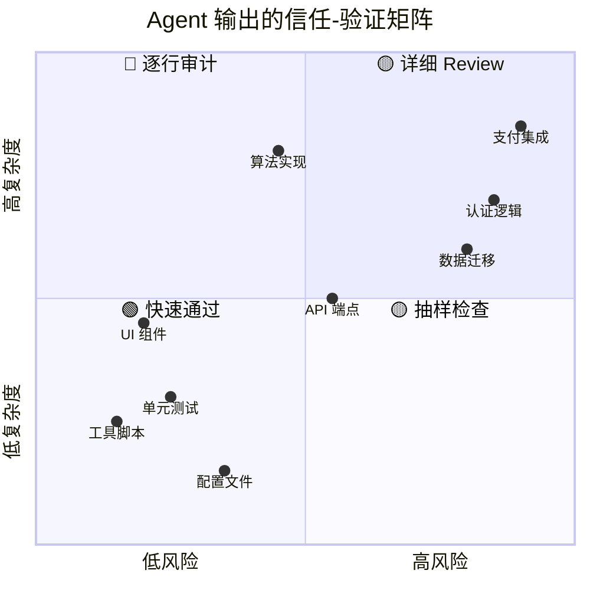

# Chapter 12 · 👁️ AI Code Review 与质量保障

> 🎯 **目标**：掌握如何使用 Agent 系统化地审查 AI 生成的代码，建立多层质量保障体系。读完本章，你将从"只会让 Agent 写代码"升级到"能让 Agent 自证清白"，在开发速度和代码质量之间找到最佳平衡点。

## 📑 目录

- [1. 🔍 为什么需要 Agent 参与 Code Review](#1--为什么需要-agent-参与-code-review)
- [2. 🔄 Agent Code Review 实战工作流](#2--agent-code-review-实战工作流)
- [3. ⚙️ GitHub Actions 集成模板](#3-️-github-actions-集成模板)
- [4. 🛡️ AI 幻觉与常见陷阱](#4-️-ai-幻觉与常见陷阱)

---

## 1. 🔍 为什么需要 Agent 参与 Code Review

### 代码生成加速 → 审查成为新瓶颈

Agent 让代码产出速度提升了 3-10 倍，但代码审查的速度并没有跟上。传统的纯人工 Review 正在成为开发流程中最大的瓶颈：

```mermaid
flowchart LR
    classDef fast fill:#2d2d2d,stroke:#98c379
    classDef slow fill:#2d2d2d,stroke:#e06c75
    classDef neutral fill:#2d2d2d,stroke:#61dafb

    Write(["💻 Agent 编码<br/>速度：3-10x ⬆️"]):::fast
    PR(["📬 提交 PR<br/>每天 5-15 个"]):::neutral
    Review(["👁️ 人工审查<br/>速度：1x 不变"]):::slow
    Merge(["✅ 合并上线"]):::neutral

    Write --> PR --> Review --> Merge

    Review -.-|"⏳ 瓶颈在这里"| Review
```



这带来了两个连锁问题：

| 问题 | 表现 | 后果 |
|:---:|------|------|
| **PR 积压** | Review 速度跟不上生成速度，PR 队列越来越长 | 合并冲突增加、开发节奏被打断 |
| **审查质量下滑** | 面对 Agent 生成的大量代码，审查者倾向于"快速通过" | 低质量代码悄悄进入主干 |

> 🔑 **核心洞察**：当 AI 加速了代码生成，你必须同步加速代码审查——否则瓶颈只是从"写得慢"转移到了"审得慢"。

### Agent 审查 vs 人类审查：互补而非替代

Agent 和人类在 Code Review 上各有明确的优势区间，最佳策略是互补组合：

| 审查维度 | Agent 🤖 | 人类 👤 | 谁更强 |
|:---:|:---:|:---:|:---:|
| **代码风格一致性** | 逐行扫描，永不疲倦 | 容易忽略细节 | 🤖 |
| **已知反模式检测** | 规则匹配精准 | 依赖经验和记忆 | 🤖 |
| **跨文件依赖分析** | 可同时读取大量文件 | 受限于工作记忆 | 🤖 |
| **安全漏洞初筛** | 覆盖 OWASP Top 10 等已知模式 | 容易遗漏不常见漏洞 | 🤖 |
| **业务逻辑正确性** | 缺乏业务上下文 | 理解需求和意图 | 👤 |
| **架构合理性** | 只看局部，难判全局 | 拥有系统全景视角 | 👤 |
| **性能瓶颈评估** | 能标记常见问题，但缺运行时数据 | 理解真实负载和瓶颈 | 👤 |
| **API 设计合理性** | 能检查命名规范 | 能判断易用性和扩展性 | 👤 |
| **团队规范传承** | 执行已文档化的规范 | 传递隐性知识 | 👤 |

> 🔑 **关键认知**：Agent 是"永不倦怠的初审员"——它擅长在人类审查之前过滤掉 60-80% 的低级问题，让人类把精力聚焦在真正需要判断力的地方。

---

## 2. 🔄 Agent Code Review 实战工作流

### Writer-Reviewer 双 Agent 模式

核心思路很简单：**写代码的 Agent 和审查代码的 Agent 不能是同一个会话**。这就像"不能自己批改自己的考卷"——同一个上下文窗口中的 Agent 倾向于对自己生成的代码"视而不见"。

```mermaid
flowchart TB
    classDef writer fill:#2d2d2d,stroke:#98c379
    classDef reviewer fill:#2d2d2d,stroke:#e06c75
    classDef human fill:#2d2d2d,stroke:#e5c07b
    classDef action fill:#2d2d2d,stroke:#61dafb

    subgraph PHASE1["Phase 1 · Agent 编写"]
        W1(["🖊️ Writer Agent<br/>编写功能代码"]):::writer
        W2(["🧪 自动测试<br/>lint + test"]):::action
    end

    subgraph PHASE2["Phase 2 · Agent 审查"]
        R1(["👁️ Reviewer Agent<br/>独立会话审查"]):::reviewer
        R2(["📋 生成审查报告<br/>问题 + 建议 + 评分"]):::action
    end

    subgraph PHASE3["Phase 3 · 人工裁决"]
        H1(["👤 人类审查者<br/>聚焦 Agent 标记的问题"]):::human
        H2(["✅ 合并 / 🔄 打回"]):::action
    end

    W1 --> W2 --> R1 --> R2 --> H1 --> H2
    H2 -.->|"打回修改"| W1

    style PHASE1 fill:#1a1a2e,stroke:#98c379
    style PHASE2 fill:#1a1a2e,stroke:#e06c75
    style PHASE3 fill:#1a1a2e,stroke:#e5c07b
```



**实操步骤**（以 Claude Code 为例）：

1. **Writer Agent**：在会话 A 中完成功能开发，跑通测试
2. **提交 PR**：`git checkout -b feat/xxx && git push`
3. **Reviewer Agent**：打开新会话 B，给出明确审查指令：

```
请审查 feat/xxx 分支相对于 main 的所有改动。

审查重点：
1. 是否有安全漏洞（SQL 注入、XSS、硬编码密钥）
2. 错误处理是否完整
3. 是否符合项目的命名规范和架构风格
4. 测试覆盖率是否充分

输出格式：
- 🔴 必须修复（阻塞合并）
- 🟡 建议修复（不阻塞但应跟进）
- 🟢 可选优化（锦上添花）

请只报告真正的问题，不要为了凑数而报告无关紧要的问题。
```

4. **人工裁决**：review Reviewer Agent 的报告，做最终决定

### 配置 Reviewer Agent（CLAUDE.md 审查规则）

为 Reviewer Agent 编写专用的审查规则是提高审查质量的关键。以下是一个生产级的 CLAUDE.md 审查配置示例：

```markdown
# Code Review Rules

## 角色定义
你是一位严格的代码审查员。你的职责是发现真正的问题，而非挑剔风格偏好。

## 审查优先级（从高到低）
1. **安全性** — 注入攻击、密钥泄露、权限绕过
2. **正确性** — 逻辑错误、边界条件、竞态条件
3. **可靠性** — 错误处理缺失、资源泄漏、空指针
4. **可维护性** — 过度复杂、重复代码、命名不清
5. **性能** — 仅在存在明显瓶颈时标记

## 审查规则
- 每个问题必须给出具体的文件路径和行号
- 必须解释**为什么**这是一个问题，而不仅仅是**什么**是问题
- 必须提供修复建议或示例代码
- 不要报告纯风格问题（已有 linter 处理）
- 不要报告你不确定的问题——宁可漏报也不误报

## 输出格式
每个问题使用以下模板：

### [🔴/🟡/🟢] 问题标题
- **文件**: `path/to/file.ts:42`
- **问题**: 具体描述
- **原因**: 为什么这是一个问题
- **修复**: 建议的修复方式

## 审查总结
审查结束后输出：
- 总体评分（1-10）
- 🔴 数量 / 🟡 数量 / 🟢 数量
- 是否建议合并（是/否/有条件）
```

> 💡 **实用技巧**：将这套审查规则放在项目根目录的 `review-rules.md` 中，每次启动 Reviewer Agent 时引用它，确保审查标准一致。

### 多层审查策略：自动化 + Agent + 人

生产环境中，最稳健的审查体系是三层过滤：

```mermaid
flowchart TB
    classDef auto fill:#2d2d2d,stroke:#61dafb
    classDef agent fill:#2d2d2d,stroke:#c678dd
    classDef human fill:#2d2d2d,stroke:#e5c07b
    classDef pass fill:#2d2d2d,stroke:#98c379

    PR(["📬 提交 PR"]):::auto

    subgraph L1["Layer 1 · 自动化门禁（秒级）"]
        CI1(["🔧 Lint / Format"]):::auto
        CI2(["🧪 单元测试"]):::auto
        CI3(["🔒 安全扫描<br/>Snyk / Trivy"]):::auto
    end

    subgraph L2["Layer 2 · Agent 审查（分钟级）"]
        A1(["👁️ Reviewer Agent<br/>逻辑 + 风格 + 安全"]):::agent
        A2(["📊 生成审查报告"]):::agent
    end

    subgraph L3["Layer 3 · 人工审查（小时级）"]
        H1(["👤 Tech Lead / 同事<br/>架构 + 业务 + 最终裁决"]):::human
    end

    MERGE(["✅ 合并到主干"]):::pass

    PR --> L1 --> L2 --> L3 --> MERGE

    style L1 fill:#1a1a2e,stroke:#61dafb
    style L2 fill:#1a1a2e,stroke:#c678dd
    style L3 fill:#1a1a2e,stroke:#e5c07b
```



| 层级 | 负责什么 | 速度 | 拦截率 |
|:---:|----------|:---:|:---:|
| **L1 自动化** | 格式、类型、测试、已知漏洞 | 秒级 | ~40% 的问题 |
| **L2 Agent** | 逻辑缺陷、反模式、文档缺失、测试盲区 | 分钟级 | ~30% 的问题 |
| **L3 人工** | 架构决策、业务正确性、边界判断 | 小时级 | ~30% 的问题 |

> 🔑 **分层原则**：能用规则解决的不用 Agent，能用 Agent 解决的不用人。每一层只做自己最擅长的事。

---

## 3. ⚙️ GitHub Actions 集成模板

将 Agent 审查集成到 CI/CD 流程中，可以让每个 PR 自动获得一份审查报告。以下是一个可直接使用的 GitHub Actions 模板：

### agent-review.yml 模板

```yaml
name: Agent Code Review

on:
  pull_request:
    types: [opened, synchronize, reopened]

permissions:
  contents: read
  pull-requests: write

jobs:
  agent-review:
    runs-on: ubuntu-latest
    timeout-minutes: 10

    steps:
      - name: Checkout code
        uses: actions/checkout@v4
        with:
          fetch-depth: 0

      - name: Get changed files
        id: changed
        run: |
          FILES=$(git diff --name-only origin/${{ github.base_ref }}...HEAD \
            | grep -E '\.(ts|tsx|js|jsx|py|go|rs)$' \
            | head -20)
          echo "files<<EOF" >> $GITHUB_OUTPUT
          echo "$FILES" >> $GITHUB_OUTPUT
          echo "EOF" >> $GITHUB_OUTPUT

      - name: Generate diff context
        id: diff
        run: |
          DIFF=$(git diff origin/${{ github.base_ref }}...HEAD \
            -- ${{ steps.changed.outputs.files }} \
            | head -3000)
          echo "content<<EOF" >> $GITHUB_OUTPUT
          echo "$DIFF" >> $GITHUB_OUTPUT
          echo "EOF" >> $GITHUB_OUTPUT

      - name: AI Code Review
        uses: actions/github-script@v7
        env:
          ANTHROPIC_API_KEY: ${{ secrets.ANTHROPIC_API_KEY }}
        with:
          script: |
            const diff = `${{ steps.diff.outputs.content }}`;
            if (!diff.trim()) {
              console.log('No reviewable changes found.');
              return;
            }

            const response = await fetch('https://api.anthropic.com/v1/messages', {
              method: 'POST',
              headers: {
                'Content-Type': 'application/json',
                'x-api-key': process.env.ANTHROPIC_API_KEY,
                'anthropic-version': '2023-06-01'
              },
              body: JSON.stringify({
                model: 'claude-sonnet-4-20250514',
                max_tokens: 4096,
                messages: [{
                  role: 'user',
                  content: `你是一位严格的代码审查员。请审查以下 PR diff：

            ${diff}

            审查重点：安全漏洞、逻辑错误、错误处理缺失、性能问题。
            使用 🔴（必须修复）、🟡（建议修复）、🟢（可选优化）标记问题。
            只报告真正的问题。如果代码质量良好，直接给出正面评价。
            用中文回复。`
                }]
              })
            });

            const result = await response.json();
            const review = result.content[0].text;

            await github.rest.issues.createComment({
              owner: context.repo.owner,
              repo: context.repo.repo,
              issue_number: context.issue.number,
              body: `## 🤖 Agent Code Review\n\n${review}\n\n---\n*由 AI 自动生成，仅供参考。最终决策请以人工审查为准。*`
            });
```

### PR 自动审查 → 人工最终裁决

这个模板的设计遵循一个关键原则：

> 🔑 **Agent 建议，人类裁决** — Agent 的审查报告以 PR Comment 形式呈现，不会自动阻塞合并。人类审查者阅读 Agent 报告后做最终决定。

**使用时的注意事项**：

| 配置项 | 推荐做法 | 原因 |
|------|---------|------|
| `timeout-minutes` | 设为 10 | 避免 API 超时导致 CI 永久挂起 |
| `head -3000` | 限制 diff 大小 | 超长 diff 会超出上下文窗口 |
| `head -20` | 限制文件数量 | 聚焦核心变更，避免噪声 |
| `fetch-depth: 0` | 拉取完整历史 | 确保 diff 计算准确 |
| 模型选择 | Sonnet 级别即可 | 性价比最优，Opus 用于特别复杂的审查 |

---

## 4. 🛡️ AI 幻觉与常见陷阱

Agent 生成的代码看起来"自信且完整"，但可能包含人眼难以察觉的幻觉。理解这些陷阱并建立防御策略是质量保障的最后一道防线。

### API 虚构、上下文遗忘、依赖幻觉

| 幻觉类型 | 典型表现 | 危险程度 | 真实案例 |
|:---:|----------|:---:|------|
| **API 虚构** | 调用了不存在的函数或参数 | 🔴 | `response.data.items` 实际应为 `response.items` |
| **版本幻觉** | 使用了当前版本不支持的语法 | 🔴 | 调用 Node 22 才有的 API 但项目锁定 Node 18 |
| **依赖幻觉** | import 了不存在的包 | 🔴 | `from utils.helpers import validate_schema` 但该模块不存在 |
| **上下文遗忘** | 前面约定的接口后面就忘了 | 🟡 | 前文定义 `userId: string` 后面却按 `number` 处理 |
| **自信式错误** | 代码结构完美但逻辑反转 | 🟡 | `if (isValid)` 写成 `if (!isValid)` 却继续正常流程 |
| **测试幻觉** | 测试通过但实际什么都没验证 | 🔴 | 断言和被测函数都是 Agent 写的，形成"自洽闭环" |

> ⚠️ **最危险的幻觉是"测试幻觉"**——Agent 同时编写代码和测试，测试可能恰好验证了错误的行为。测试绿灯不等于逻辑正确。

### 检测策略与防御性编程

针对每类幻觉，建立对应的检测策略：

**1. 对抗 API 虚构 — 编译即验证**

```
规则：Agent 写完代码后，必须运行 tsc --noEmit（TypeScript）
     或 mypy --strict（Python）确认类型和 API 存在。
```

**2. 对抗依赖幻觉 — 锁定依赖源**

在 CLAUDE.md 中明确限制：

```markdown
## 依赖管理规则
- 禁止添加新依赖，除非我明确同意
- 只能使用 package.json / requirements.txt 中已有的包
- 如需新依赖，先列出包名、版本、用途，等我确认
```

**3. 对抗测试幻觉 — 变异测试思维**

```
在要求 Agent 写测试时追加：
"写完测试后，故意在被测函数中引入一个 bug（如反转条件），
 确认测试能检测到这个 bug 并失败。然后恢复原始代码。"
```

**4. 对抗上下文遗忘 — 接口契约文件**

```markdown
## 接口契约（供 Agent 参考）
- User.id: string (UUID v4)
- User.createdAt: ISO 8601 string
- API 响应统一格式: { data: T, error: null } | { data: null, error: string }
```

### "信任但验证"的量化标准

不同场景下，对 Agent 输出的信任程度应该不同：



将这个矩阵转化为可执行的验证标准：

| 信任等级 | 适用场景 | 验证动作 | 时间投入 |
|:---:|----------|---------|:---:|
| 🟢 **高信任** | 格式化、重命名、简单 CRUD、配置生成 | 快速浏览 + 跑测试 | 2-5 分钟 |
| 🟡 **中信任** | 业务逻辑、API 开发、算法实现 | 逐函数审查 + 边界测试 | 10-20 分钟 |
| 🔴 **低信任** | 安全相关、支付、数据迁移、权限控制 | 逐行审计 + 手动测试 + 同事互审 | 30+ 分钟 |

**一条实用的经验法则**：

> 🔑 **"不可逆程度"决定验证深度** — 如果这段代码出 bug 的后果是"用户看到一个错位的按钮"，快速通过即可。如果后果是"用户数据丢失"或"资金损失"，必须逐行审计。

### 五条防御性编程原则

在使用 Agent 生成代码的场景下，以下原则能显著降低幻觉带来的风险：

| # | 原则 | 实操 |
|:---:|------|------|
| 1 | **先测试后信任** | 永远在 Agent 生成代码后运行完整测试套件 |
| 2 | **分层验证** | 类型检查 → lint → 单元测试 → 集成测试，每层拦截不同类型的错误 |
| 3 | **接口契约先行** | 在 CLAUDE.md 中写死关键接口定义，防止 Agent 自行"发明"接口 |
| 4 | **增量提交** | 小步提交、频繁验证，而非一次性生成大量代码后才检查 |
| 5 | **人类守住决策权** | Agent 提建议，人类做决定——特别是在架构变更、依赖引入、安全策略上 |

---

## 📌 本章总结

| 核心概念 | 一句话总结 |
|----------|-----------|
| **审查新瓶颈** | Agent 让代码产出提速 3-10x，审查速度不变 → 审查成为新瓶颈 |
| **互补而非替代** | Agent 擅长规则检查和模式匹配，人类擅长业务判断和架构决策 |
| **Writer-Reviewer 分离** | 写代码和审代码必须在不同会话中进行，避免"自己批改自己的考卷" |
| **三层审查** | L1 自动化门禁 → L2 Agent 审查 → L3 人工裁决，逐层过滤 |
| **AI 幻觉防御** | API 虚构、依赖幻觉、测试幻觉是最常见的三类陷阱 |
| **信任但验证** | 按"不可逆程度"决定验证深度，低风险快速通过、高风险逐行审计 |

### 三条核心原则

> 🔑 **Agent 是初审员，不是裁判** — 让 Agent 过滤掉 60-80% 的低级问题，把人类的注意力释放给真正需要判断力的决策。自动化能解决的交给自动化，Agent 能解决的交给 Agent，人只做人最擅长的事。
>
> 🔑 **幻觉是常态，不是意外** — 不要假设 Agent 的输出是正确的，要假设它可能出错并建立检测机制。编译检查、类型系统、测试套件是你的三道安全网。
>
> 🔑 **不可逆程度决定验证深度** — 按钮颜色错了可以热修复，数据库迁移错了可能无法回滚。对 Agent 输出的信任等级应该与出错后果的严重性成反比。

---

<div align="center">

[📚 返回目录](../../README.md#tutorial-contents) | [⬅️ 上一章：Ch11 Agent 设计模式](../ch11-design-patterns/part-11-design-patterns.md) | [➡️ 下一章：Ch13 技术发展简史](../ch13-history/part-13-history.md)

</div>
