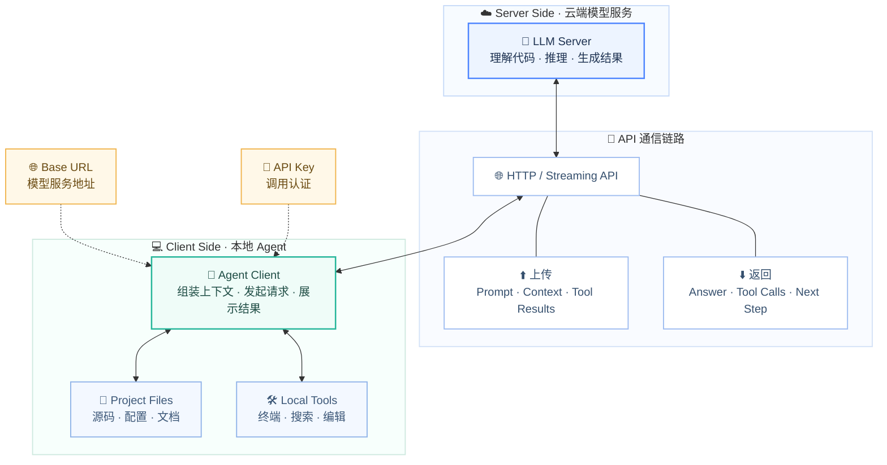

# Chapter 1 · 🚀 快速开始

> 🎯 目标：用 30 分钟建立一套最低可用环境，先把 Agent 真正跑起来，再进入后续的 Claude Code / Codex 入门实战。

## 📑 目录

- [Chapter 1 · 🚀 快速开始](#chapter-1--快速开始)
  - [📑 目录](#-目录)
  - [1. 🧩 Agent 与大模型的关系：一张图看懂架构](#1--agent-与大模型的关系一张图看懂架构)
  - [2. ⭐ TLDR：小编推荐的 Agent + Model 组合](#2--tldr小编推荐的-agent--model-组合)
    - [a. 💼 `Cursor Pro`](#a--cursor-pro)
    - [b. 🤖 `Claude Pro` / `GPT Plus/Team` 二选一](#b--claude-pro--gpt-plusteam-二选一)
    - [c. 🏗️ `GPT Plus/Team + Claude Pro`](#c-️-gpt-plusteam--claude-pro)
    - [d. 🔌 第三方API中转站例如`OpenRouter`](#d--第三方api中转站例如openrouter)
    - [e. 🇨🇳 `国产模型` / `GPT Plus + OpenRouter + 国内中转API聚合站`](#e--国产模型--gpt-plus--openrouter--国内中转api聚合站)
    - [f. 💸 `Gemini Pro` / `Manus` / `OpenClaw` / `Perplexity`](#f--gemini-pro--manus--openclaw--perplexity)
  - [3. 📦 前置知识：Node.js](#3--前置知识nodejs)
    - [Node.js 是什么？](#nodejs-是什么)
    - [安装](#安装)
  - [4. 💻 安装指南](#4--安装指南)
    - [各工具安装命令](#各工具安装命令)
  - [5. 🔑 配置第三方 API 供应商](#5--配置第三方-api-供应商)
    - [Claude Code 配置（推荐方式：settings.json）](#claude-code-配置推荐方式settingsjson)
  - [6. ✅ 验证你的第一次对话](#6--验证你的第一次对话)
  - [7. 🎮 新手 QuickStart：你的第一个 Agent 任务](#7--新手-quickstart你的第一个-agent-任务)
    - [第一个任务：理解一个真实仓库](#第一个任务理解一个真实仓库)
    - [第二个任务：完成一个最小修改](#第二个任务完成一个最小修改)
    - [📋 新手第一周三个目标](#-新手第一周三个目标)
    - [💬 所有任务都应默认带的三句话](#-所有任务都应默认带的三句话)
  - [🎉 下一步](#-下一步)

---

## 1. 🧩 Agent 与大模型的关系：一张图看懂架构

> 🧠 在开始安装之前，你最好先建立一个核心认知：**你本地运行的 Agent 软件，本身并不具备“智能”**。它更像一个客户端，默认通过网络连接到远程的 LLM 大模型服务端，才能完成代码生成、理解和推理。（多数主流产品默认使用云端模型，但部分工具如 OpenCode 也支持本地模型和自托管路线。）



**🔑 关键要点：**

- 🤖 **Agent = 客户端软件**：负责读取项目文件、构建 Prompt、调用工具、展示结果
- 🧠 **LLM = 远程服务端**：负责理解代码、推理、生成回答和工具调用指令
- 🔗 **连接桥梁**：你需要配置 **Base URL**（API 地址）和 **API Key**（认证），Agent 才能与 LLM 通信

> 💡 因此，"部署一个 Agent" 实际上就是：**安装客户端 → 配置连接信息 → 开始使用**。

---

## 2. ⭐ TLDR：小编推荐的 Agent + Model 组合

> ⚠️ **时效性声明**：以下推荐于 2026 年 3 月校对。AI 工具和模型更新极快，请以各厂商最新官方文档为准。
>
> 📖 想了解详细的选型分析，见 Reference 文档：
> - [《模型、工具与评测怎么看》](./ch23-models-tools-benchmarks.md)

> 🧭 完整工具/模型名单与深度分析都放在附录，正文这里只给最短推荐。
>
> ━━━━━━━━━━━━━━━━━━━━━━━
> 💸 **Money is All You Need** 💸
> 💳 买订阅  ·  ⚡ 买效率  ·  🚀 买时间
> 🪙 在 Agent 时代，最贵的通常不是模型费，而是你自己反复试错的时间。
> ━━━━━━━━━━━━━━━━━━━━━━━

### 💼 A. `Cursor Pro`

> 👤 **适合谁**：有开发经验、习惯 `VS Code`、希望 AI 更像结伴开发的助手实习生
> ✅ **一句话推荐**：直接充 `Cursor Pro`，\$20/月，省心起步
> 🏷️ **关键词**：`VS Code` · `订阅即用` · `传统开发流`

- 🔧 **模型特点**：后端模型可自由切 `Claude`、`GPT` 系列最新顶尖模型，也能选很多高性价比模型
- ⚠️ **核心提醒**：前端 Agent 产品的设计哲学差异很大，即使后端模型一模一样，使用效果也可能天差地别
- 🚗 **怎么理解 `Cursor` 和 `Claude Code` 的区别**：
  - `Cursor` 更贴近传统开发流，人依然主导，Agent 主要代劳脏活累活
  - `Claude Code`、`Codex` 这类新一代 Agent 更强调 AI 自主，自动化程度更高
  - 后者对开发流程和习惯的改造更强，更适合从 0 到 1 做新特性或新应用，用法与生态更丰富，能力上限也更高

### 🤖 B. `Claude Pro` / `GPT Plus/Team` 二选一

> 👤 **适合谁**：想认真学习新一代 Agent 工作流，而不只是把 AI 当补全工具的人
> ✅ **一句话推荐**：直接上 `Claude Code` 或 `Codex`，并配一个主力订阅
> 🏷️ **关键词**：`新一代 Agent` · `主力订阅` · `认真入门`

- 💳 **订阅建议**：在 [`Claude Pro`](https://claude.ai/upgrade) 或 [`ChatGPT Plus / Team`](https://openai.com/pricing) 这类 plan 里选一个就够了
- 🇨🇳 **中国区建议**：更建议选 `GPT` 系列，`Claude` 封号风险较高
- 💰 **额度搭配**：包月订阅通常比单买 API 划算，常见搭配是先用订阅额度、用完再补 API（API 额度无时间限制，可长期保留）
- 🎁 **订阅附加价值**：网页端通常还能顺带用 `deep research`、`web search`、生图等实用功能

### 🏗️ C. `GPT Plus/Team + Claude Pro`

> 👤 **适合谁**：有大型重构、重大特性、复杂功能设计开发需求的人
> ✅ **一句话推荐**：[`ChatGPT Plus / Team`](https://openai.com/pricing) + [`Claude Pro`](https://claude.ai/upgrade) 双订阅，直接拉满主力组合
> 🏷️ **关键词**：`复杂工程` · `双订阅` · `互补 review`

- 🔄 **组合优势**：两套 Agent 互补 + 互相 review，两边订阅各用各家顶尖模型
- 🧠 **实际体感**：虽然 `GPT-5.4` 这类模型已经很有竞争力，性价比也不错，但按我最近半个月的实际使用体感，做复杂工程任务时和 `Claude Opus 4.6` 相比，仍然有一段可感知的差距
- ⏱️ **怎么权衡**：`Opus 4.6` 这类顶尖模型虽然更贵，但往往能帮你少走很多弯路；效果逊色一些的模型更容易误解需求、忽略细节，把小坑一路积累成返工成本。归根结底，取决于你更看重节省时间，还是更看重节省 Token 费用

### 🔌 D. 第三方 API 中转站，例如 `OpenRouter`

> 👤 **适合谁**：如果你走 API Token 路线
> ✅ **一句话推荐**：想要正规、不掺假、稳定可靠，优先 [`OpenRouter`](https://openrouter.ai/pricing)，但 **缺点**是贵 💸
> 🏷️ **关键词**：`API Token` · `自动化接入` · `按量付费`

- ✨ **补充定位**：API 既可以作为订阅额度用完后的补充，也有额外优势
- 🚀 **额外优势**：API 更适合接脚本、自动化和自建工作流；通常按量付费更灵活；部分平台还有额外能力，比如 `OpenAI API` 的 `Batch API` 有单独速率池和更低成本，`OpenRouter` 还能做跨 provider 路由、流式输出和故障回退
- 🧭 **价格敏感用户**：可看其它 API 聚合平台或国内三方中转站，价格经常能差 5–10 倍，但需要接受掺假、降智、不稳定、乱涨价、数据隐私、安全、合规等风险⚠️（口碑好的平台通常风险会小一些，但依旧不是零风险）

### 🇨🇳 E. `国产模型` / `GPT Plus + OpenRouter + 国内中转 API 聚合站`

> 👤 **适合谁**：中国大陆用户
> ✅ **一句话推荐**：有外网条件就优先国际订阅 + API 补充；没有就走国产模型或国内中转
> 🏷️ **关键词**：`中国大陆` · `灵活组合` · `网络条件敏感`

- 🚫 **如果没法稳定访问国际互联网**：
  - 选择国产模型
  - 通过国内三方 API 中转站使用国外模型
- ✅ **如果可以稳定访问外网**：
  - 更推荐订阅 [`ChatGPT Plus`](https://openai.com/pricing) 或 `GPT Team` 拼车
  - 然后再补一些 [`OpenRouter`](https://openrouter.ai/pricing) 和 [`Yunwu API`](https://yunwu.ai/register?aff=GTlx) 额度，这样可以灵活按需调用 `Claude` 系最强 coding 模型
- 🧩 **国产模型补充**：`GLM` 可接入 `Claude Code` 前端，`Kimi` 在前端场景表现也不错
- 🔁 **API中转站补充**：相对更推荐 [`Yunwu API`](https://yunwu.ai/register?aff=GTlx)
- ⚠️ **重点提醒**：国内用户不建议直接充 `Claude` 官方订阅，除非你能搞定国外家庭IP、住址、银行卡、手机号，否则封号风险依旧很高

### 💸 F. `Gemini Pro` / `Manus` / `OpenClaw` / `Perplexity`

> 👤 **适合谁**：预算还有空间
> ✅ **一句话推荐**：先补 [`Gemini`](https://gemini.google/us/subscriptions/?hl=en)，再按场景补 `Manus` / `Perplexity` 这类专项工具
> 🏷️ **关键词**：`预算充足` · `搜索研究` · `专项补强`

- 🛠️ **还可以补**：[`Manus`](https://manus.im/pricing) / `OpenClaw`（干代码之外的日常活）、[`Perplexity`](https://www.perplexity.ai/help-center/en/articles/11187416-which-perplexity-subscription-plan-is-right-for-you)（更强的联网搜索）
- 👑 **土豪玩家**：[`Claude Max`](https://claude.ai/upgrade)、[`ChatGPT Pro`](https://openai.com/pricing) 这类高阶 plan 弹药更足、思考深度上限也更高

> 💡 小编这半个月高强度用下来，一个很直观的感受是：`GPT-5.4` 确实很能打，价格也友好，但真碰上复杂工程任务，和 `Claude Opus 4.6` 这种顶尖模型相比，还是会有一点“关键时刻差一口气”的感觉。
>
> 💸 反过来看，`Opus 4.6` 虽然贵，但贵的地方往往不是“回答更好看”，而是它更容易一次把事情想对、把细节做稳，帮你省掉很多来回返工。便宜一些的模型如果频繁误解需求、忽略边角条件，小坑一路滚大，最后烧掉的其实是你的时间。
>
> 🎯 所以别只盯着 `Token` 单价看，真正该算的是：你现在更缺钱，还是更缺时间。
>
> 🧰 顺手补一句，`Claude Code` 和 `Codex` 都提供了 `CLI`、IDE 插件、App 等不同形态。小编现在这三个版本都会装在电脑里，按任务灵活切换；但日常用得最顺手的，还是 `VSCode` 里的 `Claude Code` 和 `Codex` 插件。

### 🔀 补充判断：Agent、代码补全、NoCode 平台怎么分

很多新手刚接触这类工具时，最容易把它们混成一类。其实三者解决的是三层完全不同的问题：

| 形态 | 你提供什么 | 它最擅长什么 | 更适合谁 |
|------|-----------|-------------|---------|
| **代码补全** | 你已经在写某一段代码 | 把一行或一个函数写得更快 | 已经知道怎么实现，只想提速的人 |
| **Coding Agent** | 你给目标、约束、仓库上下文 | 读代码、改文件、跑命令、验证结果 | 想把一个完整开发任务交给 AI 推进的人 |
| **NoCode / Workflow 平台** | 你配置节点、表单、触发器 | 搭固定流程、机器人、内容流转 | 更重业务编排、而非直接写代码的人 |

一句话记忆：

- **补全工具** 帮你把“这一段”写快
- **Coding Agent** 帮你把“这件事”做完
- **NoCode 平台** 帮你把“这条流程”搭起来

如果你本来就是开发者，默认优先学 `Coding Agent`。因为它和真实软件工程的距离最近，也最能直接放大你的代码理解、任务拆解和验证能力。

### 💳 补充判断：API 按量付费 vs 订阅怎么选

定价模式本质上是在回答一个问题：你更像“天天高频手工使用”，还是“偶尔跑大任务、脚本或自动化”？

| 方案 | 优点 | 缺点 | 更适合谁 |
|------|------|------|---------|
| **订阅制** | 简单、省心、开箱即用 | 往往有额度或速率上限 | 新手入门、日常手工高频使用 |
| **API 按量** | 灵活、可自动化、适合脚本和批处理 | 需要自己管预算、Key、Base URL | 跑长任务、做自动化、团队集成 |
| **混合搭配** | 日常走订阅，重任务补 API | 配置略复杂 | 想兼顾省心与上限的人 |

默认建议很简单：

1. **第一次入门**：先买一个主力订阅，不要一上来就折腾最复杂的 API 路线。
2. **开始跑长任务或多工具协作**：再补 API，尤其是你要接脚本、CI、批处理时。
3. **团队或自动化场景**：优先考虑 API，因为订阅制通常不适合稳定编排。

---

## 3. 📦 前置知识：Node.js

> 📦 很多 Agent 工具（Codex CLI、Gemini CLI 等）都是通过 `npm` 安装的。如果你是后端 / 算法工程师，之前没怎么碰过 Node.js，这里用最短篇幅帮你补一下。

### Node.js 是什么？

**Node.js 是一个让 JavaScript 脱离浏览器运行的运行时环境。** 它最初是为了让 JS 也能写服务端程序，但现在它最大的实际用途之一是**作为命令行工具的分发平台**——很多开发者工具（包括 AI Agent）都选择用 JS/TS 编写，然后通过 npm 分发，因为这样跨平台（macOS/Linux/Windows）且安装一行命令搞定。

🔁 你可以把它类比为 Python 之于 pip：
- **Node.js** ≈ Python 解释器（运行环境）
- **npm** ≈ pip（包管理器，`npm install -g xxx` ≈ `pip install xxx`）
- **npx** ≈ `python -m xxx`（直接运行包，不需要全局安装）

### 安装

```bash
# macOS（Homebrew）
brew install node

# 或使用 nvm 管理多版本
curl -o- https://raw.githubusercontent.com/nvm-sh/nvm/v0.40.0/install.sh | bash
nvm install --lts

# 验证
node --version   # 建议 v18+
npm --version
```

> ℹ️ 注意：`Claude Code` 现已支持 `curl` 直接安装二进制文件，不依赖 Node.js。但只要你后面还会折腾别的 Agent 工具，了解 `npm` 依然很有用。

---

## 4. 💻 安装指南

> 🛠️ 这一节你不需要一次全装完。按你上面选好的主路线，先装一个能跑起来的就够了。

### 各工具安装命令

| 工具 | 官方文档 | 安装命令 |
|------|---------|---------|
| **Claude Code** | [code.claude.com/docs](https://code.claude.com/docs/en/setup) / [GitHub](https://github.com/anthropics/claude-code) | `curl -fsSL https://claude.ai/install.sh \| bash` |
| **Codex CLI** | [GitHub](https://github.com/openai/codex) | `npm install -g @openai/codex` |
| **Gemini CLI** | [geminicli.com](https://geminicli.com/) / [GitHub](https://github.com/google-gemini/gemini-cli) | `npm install -g @google/gemini-cli` |
| **Cursor** | [cursor.com](https://cursor.com/) / [CLI 文档](https://cursor.com/docs/cli/overview) | 下载桌面应用（CLI 可通过 `curl https://cursor.com/install -fsSL \| bash` 安装，beta） |
| **Antigravity** | [antigravity.google](https://antigravity.google/) | 下载桌面应用 |
| **OpenCode** | [opencode.ai](https://opencode.ai/docs) / [GitHub](https://github.com/opencode-ai/opencode) | 参考官方安装页（支持安装脚本 / npm / Homebrew 等方式） |
| **Trae** | [trae.ai](https://www.trae.ai/) | 下载桌面应用 |

---

## 5. 🔑 配置第三方 API 供应商

> 🔌 如果你不直接使用官方 subscription，而是通过第三方供应商（如 `OpenRouter`、国内中转）购买 Token，就需要自己配置 **Base URL** 和 **API Key**。

> 🧭 `Base URL` = 请求发到哪台服务，`API Key` = 你是谁、按谁计费。

### Claude Code 配置（推荐方式：settings.json）

编辑 `~/.claude/settings.json`：

| 系统 | 路径 |
|------|------|
| 🍎 macOS / 🐧 Linux | `~/.claude/settings.json` |
| 🪟 Windows | `%USERPROFILE%\.claude\settings.json` |

```json
{
  "env": {
    "ANTHROPIC_BASE_URL": "https://your-provider.com",
    "ANTHROPIC_API_KEY": "sk-your-api-key-here"
  }
}
```

✅ 这种方式不污染 shell 环境变量，而且 `CLI`、`VS Code` 插件、桌面 `App` 都会自动生效。

⚡ **或用环境变量（快速测试）**：

```bash
export ANTHROPIC_BASE_URL="https://your-provider.com"
export ANTHROPIC_API_KEY="sk-your-api-key-here"
claude
```

> ⚠️ **安全提示**：永远不要把 API Key 提交到 Git 仓库。
>
> 💡 其它工具（Codex CLI / Cursor / OpenCode / Gemini CLI）的配置逻辑也类似：核心都是填好对应供应商的 `Base URL` 和 `API Key`。

---

## 6. ✅ 验证你的第一次对话

> 🧪 配置好后，先别急着开干，第一步是确认 **连接真的通了**。

- 🤖 **Claude Code**：`cd` 到项目目录，输入 `claude`，进入交互界面后再输入 `你好，简单介绍你自己`
- 🧠 **Codex CLI**：终端运行 `codex`，输入一个简单问题做验证
- 🖥️ **Cursor**：`Cmd+L`（macOS）/ `Ctrl+L` 打开 Chat 面板，随便问一个问题

🚨 如果报错，最常见的原因就三个：`API Key` 填错、`Base URL` 不对、网络不通。别硬猜，直接回到第 5 节逐项检查。

> **各工具详细使用教程**：[Claude Code Docs](https://code.claude.com/docs/en/overview) · [Codex CLI](https://developers.openai.com/codex/cli/) · [Cursor Docs](https://docs.cursor.com/)

---

## 7. 🎮 新手 QuickStart：你的第一个 Agent 任务

> 🎯 新手最容易犯的错，不是“不会用”，而是一上来就把一堆工具全装上。先选一条主线，跑通一个最小闭环，体感通常会好很多。


### 第一个任务：理解一个真实仓库

📂 进入你的真实项目目录，先给 Agent 这个提示词：

```
先阅读这个仓库，告诉我项目结构、启动命令、测试命令和最值得优先了解的三个模块。
不要修改代码，先给出你的判断。
```

👀 这个任务的价值，不是让它立刻产出代码，而是让你亲眼看到 Agent 怎么读文件、怎么理解结构、怎么组织信息。这是建立信任感的第一步。

### 第二个任务：完成一个最小修改

🛠️ 当你确认它“看得懂”仓库之后，再让它做一个低风险、可验证的小改动：

```
基于你对仓库的理解，完成一个最小但真实的改动：
1. 选一个低风险小问题（补测试、修小 bug、改善错误信息）
2. 先给出计划，不要立刻改
3. 我确认后再执行
4. 修改后运行验证命令
5. 输出改动摘要、涉及文件、验证结果
```

✅ 这一步的重点不是改得多，而是让你开始建立一套正确节奏：先计划，再执行；执行完，一定验证。

### 📋 新手第一周三个目标

1. 🔄 **体验完整闭环**：Agent 读仓库 → 改文件 → 跑命令 → 继续修
2. 📝 **知道何时该先出计划**：复杂任务先让 Agent 给方案再执行
3. ✅ **理解验证比生成更重要**：不只看 diff，让它跑测试证明

### 💬 所有任务都应默认带的三句话

- 🔍 **先分析再执行**
- ✅ **修改后必须验证**
- ✋ **如果不确定，就停下来说明**

---

## 🎉 下一步

> 🎉 到这里，你已经完成了 Agent 的部署和第一次上手体验。下一章我们会继续往下拆，把 Agent 的运作原理和核心概念讲透，帮助你从“能用”走向“会用”。

👉 下一章：[Chapter 2 · 🎮 Agent 入门实战](./ch02-agent-first-practice.md)

---

<div align="center">

[📚 返回目录](../../README.md#tutorial-contents) | [➡️ 下一章：Ch02 Agent 入门实战](./ch02-agent-first-practice.md)

</div>


