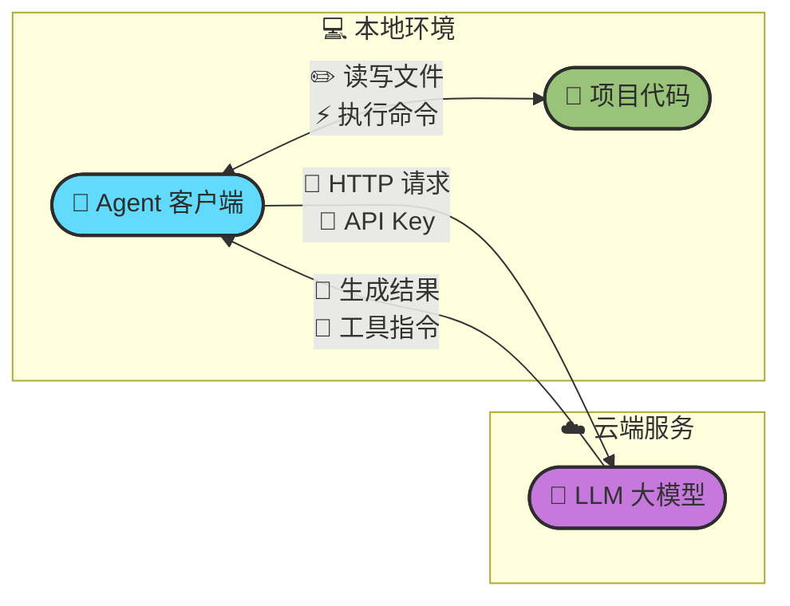

# Chapter 1 · 🚀 快速上手部署 Agent

> 🎯 目标：用 30 分钟，把一个「能改你项目代码」的 Agent 真正跑起来。

## 📑 目录

- [Chapter 1 · 🚀 快速上手部署 Agent](#chapter-1---快速上手部署-agent)
  - [📑 目录](#-目录)
  - [1. 🧩 Agent 与大模型的关系：一张图看懂架构](#1--agent-与大模型的关系一张图看懂架构)
  - [2. ⭐ TLDR：小编推荐的 Agent + Model 组合](#2--tldr小编推荐的-agent--model-组合)
    - [纯新手 / 想先尝尝鲜](#纯新手--想先尝尝鲜)
    - [有正式开发任务的用户（推荐）](#有正式开发任务的用户推荐)
    - [进阶用户](#进阶用户)
    - [中国大陆用户特别提醒](#中国大陆用户特别提醒)
  - [3. 📦 前置知识：Node.js](#3--前置知识nodejs)
    - [Node.js 是什么？](#nodejs-是什么)
    - [安装](#安装)
  - [4. 💻 安装指南](#4--安装指南)
    - [各工具安装命令](#各工具安装命令)
  - [5. 🔑 配置第三方 API 供应商](#5--配置第三方-api-供应商)
    - [Claude Code 配置（推荐方式：settings.json）](#claude-code-配置推荐方式settingsjson)
  - [6. 🇨🇳 中国大陆用户：API 中转服务](#6--中国大陆用户api-中转服务)
    - [什么是 API 中转？](#什么是-api-中转)
    - [⚠️ 如果必须使用中转，先确认这几件事](#️-如果必须使用中转先确认这几件事)
    - [🔍 选择中转商注意事项](#-选择中转商注意事项)
  - [7. ✅ 验证你的第一次对话](#7--验证你的第一次对话)
  - [8. 🎮 新手 QuickStart：你的第一个 Agent 任务](#8--新手-quickstart你的第一个-agent-任务)
    - [推荐起步路线](#推荐起步路线)
    - [第一个任务：理解一个真实仓库](#第一个任务理解一个真实仓库)
    - [第二个任务：完成一个最小修改](#第二个任务完成一个最小修改)
    - [📋 新手第一周三个目标](#-新手第一周三个目标)
    - [💬 所有任务都应默认带的三句话](#-所有任务都应默认带的三句话)
  - [🎉 下一步](#-下一步)

---

## 1. 🧩 Agent 与大模型的关系：一张图看懂架构

在开始安装之前，你需要先建立一个核心认知：**你本地运行的 Agent 软件，本身并不具备“智能”——它是一个客户端，默认通过网络连接到远程的 LLM 大模型服务端，才能完成代码生成、理解和推理。（多数主流产品默认使用云端模型，但部分工具如 OpenCode 也支持本地模型和自托管路线。）**



**🔑 关键要点：**

- 🤖 **Agent = 客户端软件**：负责读取项目文件、构建 Prompt、调用工具、展示结果
- 🧠 **LLM = 远程服务端**：负责理解代码、推理、生成回答和工具调用指令
- 🔗 **连接桥梁**：你需要配置 **Base URL**（API 地址）和 **API Key**（认证），Agent 才能与 LLM 通信

> 💡 因此，"部署一个 Agent" 实际上就是：**安装客户端 → 配置连接信息 → 开始使用**。

---

## 2. ⭐ TLDR：小编推荐的 Agent + Model 组合

> ⚠️ **时效性声明**：以下推荐于 2026 年 3 月校对。AI 工具和模型更新极快，请以各厂商最新官方文档为准。
>
> 📖 想了解详细的选型分析，见 Reference 文档：
> - [附录：主流 Agent 工具对比](../topics/topic-agent-tools-comparison.md)
> - [附录：主流 Coding 模型对比](../topics/topic-model-comparison.md)
> - [附录：模型与 Agent 评测体系详解](../topics/topic-benchmarks.md)

工具和模型太多，选择困难？正文里我只给**作者主推路线 + 最短结论**，深度对比都放在附录。先记住这四句话：

- **先选一条主线**，不要一上来装 6 个 Agent。
- **工具是工作台，模型是底层马力**，不要混为一谈。
- **正式开发任务**优先从 `Claude Code`、`Cursor`、`Codex CLI` 这三条主线里选。
- **排行榜只能帮你缩小范围**，真正决定体验的还有工作流、上下文管理和验证习惯。

> 🧭 本组附录完整覆盖的工具/模型名单见导航页，包含 `Claude Code`、`Cursor`、`GitHub Copilot`、`Codex CLI`、`Gemini CLI`、`Antigravity`、`通义灵码`、`Trae`、`Baidu Comate`、`CodeBuddy`、`Kimi Code`、`CodeArts`、`OpenCode`、`CodeGeeX`、`Aider`、`Cline`、`Windsurf`、`Devin`、`OpenClaw`、`Manus`、`ChatGPT Tasks`、`Perplexity`、`Kimi Agent`、`ArkClaw`，以及 `Claude Opus 4.6`、`GPT-5.4 Pro`、`Gemini 3.1 Pro`、`Llama 4 Maverick`、`nemotron-3-super`、`grok-code-fast`、`Kimi K2.5`、`GLM-5`、`MiniMax-M2.7`、`DeepSeek-V3.2`、`Qwen3-Max`。

### 纯新手 / 想先尝尝鲜

购买 **Cursor Pro 会员**（\$20/月），开箱即用的 IDE 体验，不需要折腾终端和 API Key。适合零基础用户快速体验 Vibe Coding。

如果你在中文环境里更想先低门槛试水，也可以先看 `Trae` / `通义灵码`；但本教程的主线工作流仍然更偏 `Claude Code` / `Cursor` 这两条。

### 有正式开发任务的用户（推荐）

如果你真的要拿 Agent 干活，我更推荐先准备一条“主力线”：

| 主力 Agent | 主力模型 | 定位 |
|-----------|---------|------|
|  **Claude Code** | **Sonnet 4.6**（日常主力）/ **Opus 4.6**（复杂任务）/ **Haiku 4.5**（简单批量） | 我最推荐的新主线：闭环能力强，适合正式工程任务 |
|  **Codex CLI** | **GPT-5.4 Pro** / **GPT-5.3-Codex** | 更像高智商参谋和审查搭档，沙箱隔离与可控性很好 |
|  **Cursor** | **Claude / GPT / Gemini**（按套餐与配置选择） | 上手最快的 AI IDE 路线，适合把 Agent 当日常编辑器搭档 |

一句话说三者区别：

- **Claude Code**：最像“真正能持续推进任务的工程搭档”
- **Codex CLI**：最像“擅长 plan / review / 风险分析的参谋”
- **Cursor**：最像“最好上手的日常 AI IDE”

> 💡 **选择你喜欢的使用方式：**
> - 🖥️ **喜欢终端操作**：直接安装 CLI 版（`claude`、`codex`），终端即战场
> - 🧩 **喜欢在 IDE 中使用**：安装 VS Code / JetBrains 的 Claude Code 插件或 Copilot 插件，在编辑器内直接与 Agent 协作
> - 🌱 **没有开发经验**：下载 [Claude 桌面应用](https://claude.ai/download) 或 [ChatGPT 桌面应用](https://openai.com/chatgpt/desktop/)，图形界面更友好

### 进阶用户

在上述基础上，再去补“第二条路线”会更稳，例如：

- `Gemini CLI`：免费额度友好、长上下文强，适合探索和补位
- `OpenCode + DeepSeek-V3.2`：极致低成本、多模型工作流
- `Kimi Code + Kimi K2.5`：中文友好，适合中国大陆用户
- `GLM-5`、`Qwen3-Max`、`MiniMax-M2.7`：适合你认真比较国产模型路线时再深入看

### 中国大陆用户特别提醒

> ⚠️ **不推荐直接充值 Claude Pro 会员**——Anthropic 对中国区有风控策略，存在封号风险。推荐通过**专用第三方 API 供应商**使用 Claude 模型（详见第 5-6 节配置指南）。
>
> ChatGPT Plus 会员相对更稳定，但也建议使用稳定的网络环境。

| 场景 | 推荐组合 | 说明 |
|------|---------|------|
| 网络/合规限制 | **Claude Code + GLM-5** | 智谱模型，中文和工程任务都比较稳；与华为昇腾生态已有适配/支持 |
| 国产最强性价比 | **Kimi Code + Kimi K2.5** | 月之暗面官方 Agent，中文体验友好 |
| 极致低成本 | **OpenCode + DeepSeek-V3.2** | 开源 Agent + 最便宜模型 |

> 📖 中国大陆用户的完整配置指南和注意事项见 → [附录：中国大陆用户推荐配置](../topics/topic-china-users.md)

> 💡 核心原则：**先跑通一个组合，再横向对比**。不要同时装太多工具，每个都只会一点点。

---

## 3. 📦 前置知识：Node.js

很多 Agent 工具（Codex CLI、Gemini CLI 等）通过 `npm` 安装。如果你是后端/算法工程师，可能没接触过 Node.js，这里快速科普。

### Node.js 是什么？

**Node.js 是一个让 JavaScript 脱离浏览器运行的运行时环境。** 它最初是为了让 JS 也能写服务端程序，但现在它最大的实际用途之一是**作为命令行工具的分发平台**——很多开发者工具（包括 AI Agent）都选择用 JS/TS 编写，然后通过 npm 分发，因为这样跨平台（macOS/Linux/Windows）且安装一行命令搞定。

你可以把它类比为 Python 之于 pip：
- **Node.js** ≈ Python 解释器（运行环境）
- **npm** ≈ pip（包管理器，`npm install -g xxx` ≈ `pip install xxx`）
- **npx** ≈ `python -m xxx`（直接运行包，不需要全局安装）

### 安装

```bash
# macOS（Homebrew）
brew install node

# 或使用 nvm 管理多版本
curl -o- https://raw.githubusercontent.com/nvm-sh/nvm/v0.40.0/install.sh | bash
nvm install --lts

# 验证
node --version   # 建议 v18+
npm --version
```

> 注意：Claude Code 现已支持 `curl` 直接安装二进制文件，不依赖 Node.js。但了解 npm 仍有用。

---

## 4. 💻 安装指南

### 各工具安装命令

| 工具 | 官方文档 | 安装命令 |
|------|---------|---------|
| **Claude Code** | [code.claude.com/docs](https://code.claude.com/docs/en/setup) / [GitHub](https://github.com/anthropics/claude-code) | `curl -fsSL https://claude.ai/install.sh \| bash` |
| **Codex CLI** | [GitHub](https://github.com/openai/codex) | `npm install -g @openai/codex` |
| **Gemini CLI** | [geminicli.com](https://geminicli.com/) / [GitHub](https://github.com/google-gemini/gemini-cli) | `npm install -g @google/gemini-cli` |
| **Cursor** | [cursor.com](https://cursor.com/) / [CLI 文档](https://cursor.com/docs/cli/overview) | 下载桌面应用（CLI 可通过 `curl https://cursor.com/install -fsSL \| bash` 安装，beta） |
| **Antigravity** | [antigravity.google](https://antigravity.google/) | 下载桌面应用 |
| **OpenCode** | [opencode.ai](https://opencode.ai/docs) / [GitHub](https://github.com/opencode-ai/opencode) | 参考官方安装页（支持安装脚本 / npm / Homebrew 等方式） |
| **Trae** | [trae.ai](https://www.trae.ai/) | 下载桌面应用 |

> 📖 想了解 CLI、VS Code 插件、桌面应用之间的关系？见 → [附录：CLI / IDE 插件 / 桌面应用形态详解](../topics/topic-cli-vs-ide.md)

---

## 5. 🔑 配置第三方 API 供应商

如果你不直接使用官方 API，而是通过第三方供应商（如 OpenRouter、国内中转）购买 Token，需要配置 **Base URL** 和 **API Key**。

> `Base URL` = 请求发到哪台服务，`API Key` = 你是谁、按谁计费。

### Claude Code 配置（推荐方式：settings.json）

编辑 `~/.claude/settings.json`：

| 系统 | 路径 |
|------|------|
| 🍎 macOS / 🐧 Linux | `~/.claude/settings.json` |
| 🪟 Windows | `%USERPROFILE%\.claude\settings.json` |

```json
{
  "env": {
    "ANTHROPIC_BASE_URL": "https://your-provider.com",
    "ANTHROPIC_API_KEY": "sk-your-api-key-here"
  }
}
```

这种方式不污染 shell 环境变量，且 CLI、VS Code 插件、桌面 App 都会自动生效。

**或用环境变量（快速测试）：**

```bash
export ANTHROPIC_BASE_URL="https://your-provider.com"
export ANTHROPIC_API_KEY="sk-your-api-key-here"
claude
```

> ⚠️ **安全提示**：永远不要把 API Key 提交到 Git 仓库。
>
> 📖 其它工具（Codex CLI / Cursor / OpenCode / Gemini CLI）的配置方法见 👉 [附录：各工具 API 配置详解](../topics/topic-china-users.md)

---

## 6. 🇨🇳 中国大陆用户：API 中转服务

由于网络限制，国内直接访问 Anthropic / OpenAI / Google API 可能不稳定。**第三方 API 中转只能算备选方案，不应作为默认路径。**

### 什么是 API 中转？

中转商在海外部署代理节点，转发你的 API 请求。你只需将 Base URL 指向中转商地址，使用中转商提供的 Token。

### ⚠️ 如果必须使用中转，先确认这几件事

- 🔧 **工具调用兼容性**：不是所有代理都完整支持 tool use、流式输出、长连接和多轮上下文
- 🔒 **隐私与留存**：先确认代码、日志、提示词和响应会不会被记录、保留多久、能否关闭
- 🏷️ **模型映射是否透明**：模型 ID、上下文长度、价格和限流策略要写清楚
- 📋 **账单归属与 SLA**：出问题时到底按谁的服务条款、谁来背可用性和退款责任

如果确认要接入第三方代理，Claude Code 的配置方式通常类似下面这样：

```json
{
  "env": {
    "ANTHROPIC_BASE_URL": "https://your-provider.com",
    "ANTHROPIC_API_KEY": "your-provider-token"
  }
}
```

> 更稳妥的顺序通常是：**先尝试官方直连 → 再尝试企业网络方案 / 合规出口 → 最后才考虑第三方代理。**

### 🔍 选择中转商注意事项

- 📄 **文档完整、模型映射透明**：确保模型 ID 与官方一致
- 🔧 **注意兼容性**：部分中转不完整支持工具调用（tool use）
- 🔒 **关注隐私**：了解代码是否被记录
- ❌ **不要用逆向方案**：短期便宜但随时失效

---

## 7. ✅ 验证你的第一次对话

配置好后，先确认**连接正常**：

**Claude Code**：`cd` 到项目目录，输入 `claude`，进入交互界面后输入 `你好，简单介绍你自己`。

**Codex CLI**：终端运行 `codex`，输入简单问题验证。

**Cursor**：`Cmd+L`（macOS）/ `Ctrl+L` 打开 Chat 面板，输入问题。

如果报错，常见原因：API Key 填错、Base URL 不对、网络不通。回到第 5/6 节检查。

> **各工具详细使用教程**：[Claude Code Docs](https://code.claude.com/docs/en/overview) · [Codex CLI](https://developers.openai.com/codex/cli/) · [Cursor Docs](https://docs.cursor.com/)

---

## 8. 🎮 新手 QuickStart：你的第一个 Agent 任务

新手最容易犯的错不是"不会用"，而是**同时装太多工具**。先选一条主线，跑通最小闭环。

### 推荐起步路线

| 偏好 | 推荐 |
|------|------|
| 终端工作流，想体验最强 Agent | **Claude Code** |
| OpenAI 生态，想试并行 Agent | **Codex CLI** |
| IDE 可视化，边看 diff 边操作 | **Claude Code VS Code 插件** / **Cursor** |

### 第一个任务：理解一个真实仓库

进入你的真实项目目录，给 Agent 这个提示词：

```
先阅读这个仓库，告诉我项目结构、启动命令、测试命令和最值得优先了解的三个模块。
不要修改代码，先给出你的判断。
```

这让你亲眼看到 Agent 如何读取文件、理解结构、组织信息——建立信任的第一步。

### 第二个任务：完成一个最小修改

```
基于你对仓库的理解，完成一个最小但真实的改动：
1. 选一个低风险小问题（补测试、修小 bug、改善错误信息）
2. 先给出计划，不要立刻改
3. 我确认后再执行
4. 修改后运行验证命令
5. 输出改动摘要、涉及文件、验证结果
```

### 📋 新手第一周三个目标

1. 🔄 **体验完整闭环**：Agent 读仓库 → 改文件 → 跑命令 → 继续修
2. 📝 **知道何时该先出计划**：复杂任务先让 Agent 给方案再执行
3. ✅ **理解验证比生成更重要**：不只看 diff，让它跑测试证明

### 💬 所有任务都应默认带的三句话

- 🔍 **先分析再执行**
- ✅ **修改后必须验证**
- ✋ **如果不确定，就停下来说明**

---

## 🎉 下一步

恭喜你完成了 Agent 的部署和初次体验！在下一章中，我们将深入理解 Agent 的运作原理和核心概念，帮助你从"能用"走向"会用"。

👉 下一章：[Chapter 2 · 🧩 Agent 核心概念](./ch02-concepts.md)

---

<div align="center">

[📚 返回目录](../../README.md#tutorial-contents) | [➡️ 下一章：Ch02 Agent 核心原理](./ch02-concepts.md)

</div>
