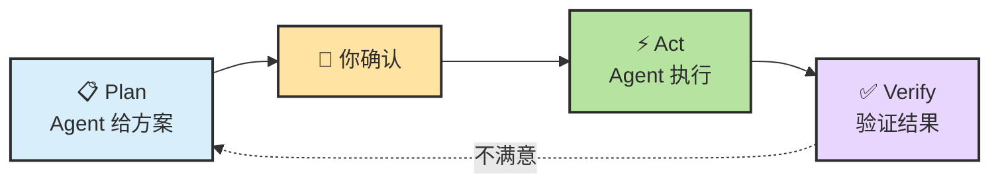
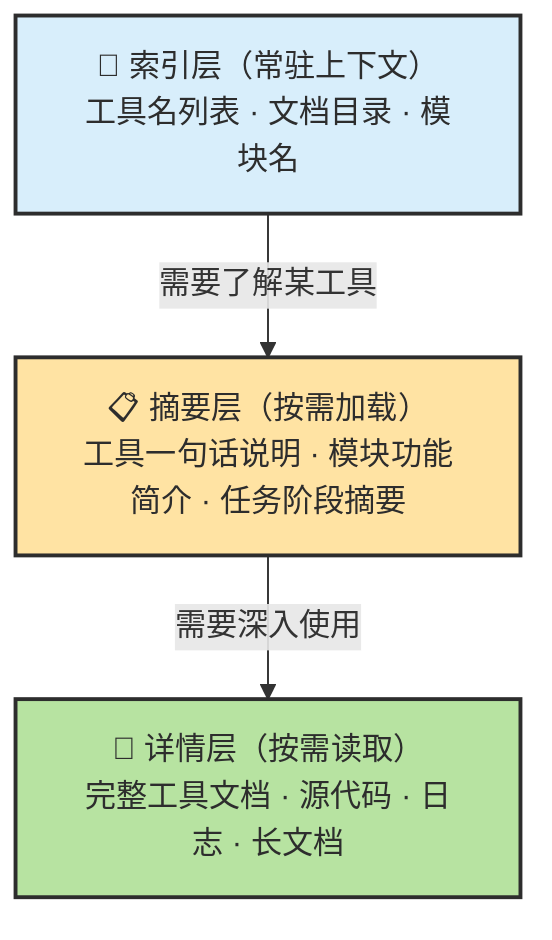
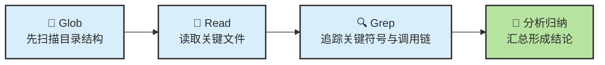
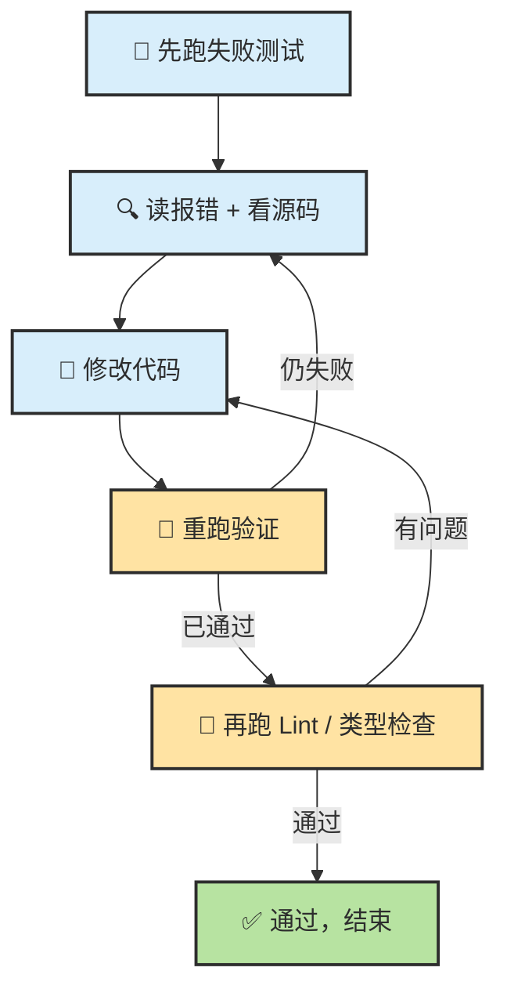
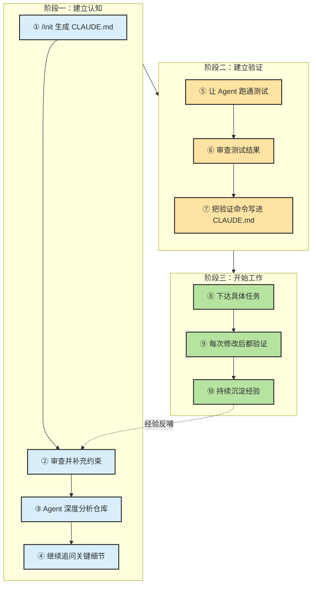
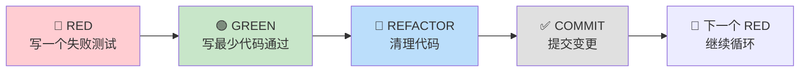
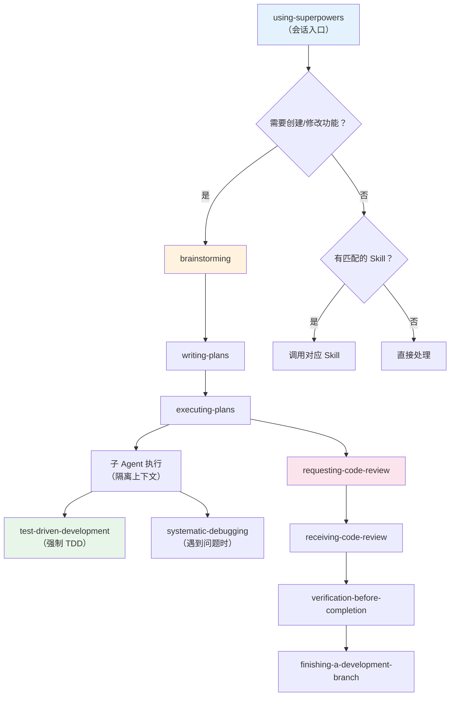
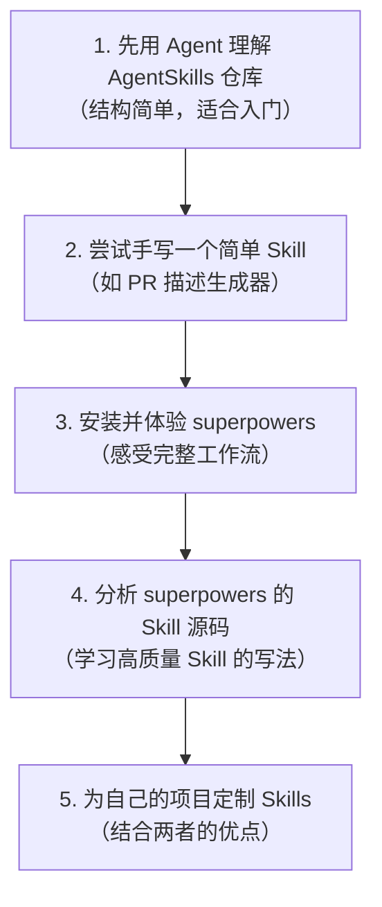
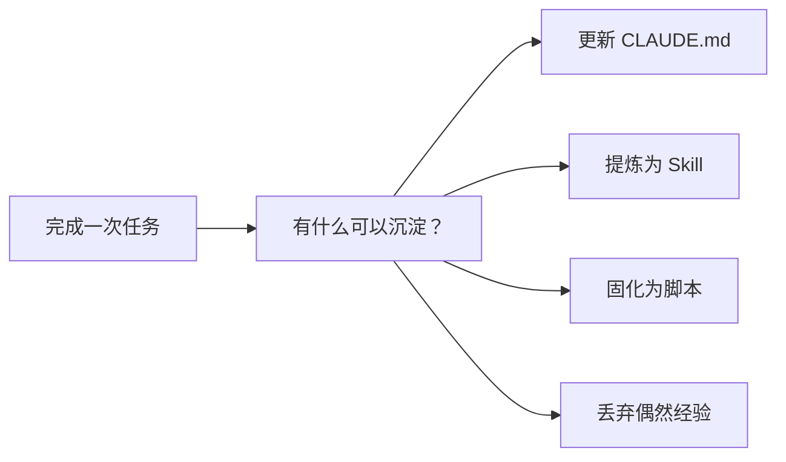

# Chapter 2 · 🎮 Agent 入门实战

> 🎯 **目标**：通过一组不绑定具体产品的基础实验，掌握 Agent 协作最值得先练熟的动作：理解仓库、修 Bug、补测试、看 diff、做验证。完成本章后，你会真正建立“Agent 已经能帮我干活”的第一批直觉。
>
> 📌 **建议通读顺序**：第一次读本章，先完成实战 1-3，把“理解仓库 → 修 Bug → 写测试”这条最短闭环跑通；实战 4-6 更适合作为第二轮的扩展练习。

---

## 0. 本章核心方法：先 Plan 再 Act

### 为什么不要上来就让 Agent 改代码

新手最常犯的错误：

```
帮我重构这个模块，加上测试。
```

这看起来没问题，但你会遇到：
- Agent 一口气改了 15 个文件，你看不过来
- 改完才发现方向不对，回退成本极高
- Agent 做了很多你没预期的"优化"，引入新问题

**根本原因**：你跳过了方案确认环节，让 Agent 既当设计师又当施工队，而你连图纸都没看。

### Plan-Act 两步法

所有实战都遵循同一个模式：



| 阶段 | 你做什么 | Agent 做什么 |
|:---:|---|---|
| **Plan** | 描述目标和约束 | 分析现状、给出方案 |
| **确认** | 审查方案、提出修改 | 等你确认 |
| **Act** | 观察执行过程 | 按确认的方案执行 |
| **Verify** | 检查结果、判断是否通过 | 跑测试、输出 diff |

### 三句话万能后缀

在 Ch01 中我们已经介绍过，这三句话应该成为你与 Agent 对话的下意识习惯：

```
先分析再执行。
修改后必须验证。
如果不确定，就停下来说明。
```

> 💡 **Pro Tip**：把这三句话写进项目的 `CLAUDE.md`，Agent 每次启动都会读到，你就不用每次手打了。

```markdown
# CLAUDE.md
## 工作规则
- 先给方案，等我确认后再动手
- 每次修改后运行相关测试
- 遇到不确定的地方，停下来问我
```

---

## 1. 🔍 实战一：用 Agent 理解一个真实仓库（20min）

> 🎯 **场景**：你刚接手一个陌生项目（或想深入了解一个开源仓库），需要快速建立全局认知。

### 为什么从这里开始

理解代码是 Agent 最高 ROI 的用法。传统做法需要数小时翻目录、搜关键词、读文件；Agent 可以把这个过程压缩到 20 分钟。更重要的是，这个练习不会修改任何文件——零风险，纯收益。

### 准备工作

先选一个适合“纯理解、不改代码”的仓库。这里推荐直接用 `Ascend/DrivingSDK` 做主案例；如果你更想学以致用，也可以换成你自己的项目。

| 仓库 | 特点 | 适合 |
|------|------|------|
| **[Ascend/DrivingSDK](https://gitcode.com/Ascend/DrivingSDK)** | 昇腾 NPU 上的自动驾驶 / 具身智能 / 世界模型加速库，目录层次清晰，文档较完整，同时包含 C++ / Python / CMake | 想练“陌生仓快速建模”的读者 |
| **你自己的项目** | 你最熟悉，能验证 Agent 分析是否准确 | 有工程经验的读者 |

```bash
# 推荐先用 DrivingSDK
git clone https://gitcode.com/Ascend/DrivingSDK.git
cd DrivingSDK
claude
```

> 📌 **为什么这里不再用 superpowers**：这一节的目标是练“理解陌生仓库”，不是安装或体验 Skill 工作流。`superpowers` 这类 Skill 框架放到后面的 Skill 安装章节再展开，更不容易把两个学习目标混在一起。

### Step 1：结构化提问

```
请帮我全面理解这个仓库：

1. 项目定位：一句话说清楚这个项目解决什么问题
2. 目录结构：列到第二级，标注每个目录的作用
3. 核心模块：哪 3-5 个文件/目录最重要？为什么？
4. 技术栈：语言、框架、依赖
5. 启动命令：如何安装、运行、测试

先不要修改任何文件，只做分析。
```

Agent 会遍历目录、读关键文件，然后给你一份结构化的项目概览。

### Step 2：如果支持 subagent，先让它做第一轮扫仓

如果你用的 Agent 支持子 Agent，可以先把“低风险的第一轮探索”分出去，让主 Agent 后面专门做汇总和追问：

```
请指定一个 subagent 先做第一轮仓库探索：
- 只读取目录、README、安装/构建相关文件
- 输出：项目定位、关键目录、技术栈/构建方式、建议下一步阅读路径
- 明确标出不确定点

主 Agent 不要立刻下结论，先等 subagent 回来后再汇总。
```

下面是一段基于 `DrivingSDK` 的 **subagent 精简回复示例**：

> `DrivingSDK` 是面向昇腾 NPU 的自动驾驶 / 具身智能 / 世界模型加速套件，核心由高性能算子库、PyTorch 扩展和模型迁移示例组成。目录上，`kernels` / `kernels_arch35` 负责算子实现，`onnx_plugin` 做 ONNX 适配，`mx_driving` 提供 Python API、patcher、dataset 和 `csrc` 扩展，`model_examples` 放 BEVFormer、BEVFusion 等案例。技术栈以 C++17 + CMake + Python packaging 为主，构建通过 `setup.py` 或 `ci/build.sh` 调 CMake，依赖 `torch` / `torch_npu` / CANN。建议先看 `docs/zh/introduction/Introduction.md`、`docs/zh/api/README.md`，再挑一个 `model_examples/*/README.md` 跟跑。不确定点：仓内模型与算子很多，我未逐个核对；`USE_ARCH35` 的适用范围还需结合实际硬件确认。`

### Step 3：追问式深入

概览之后，选择你最感兴趣的部分深入追问：

```
你提到 [核心模块名] 是最重要的模块。
请追踪它的核心调用链：从入口到最终执行，中间经历了哪些步骤？
用简明的流程图或列表说明。
```

对于 `DrivingSDK`，一个自然的追问方向是：

```
请以 `mx_driving` 为中心，说明它和 `kernels`、`onnx_plugin`、`model_examples`
分别是什么关系。哪些目录更像“库本体”，哪些更像“示例和适配层”？
```

### Step 4：交叉验证

Agent 的分析不一定 100% 准确。用这个方法验证：

```
请列出你在分析中做了哪些假设。
有没有你不确定的地方？哪些结论是你从代码中直接读到的，哪些是推测的？
```

> ⚠️ **重要**：Agent 在理解代码时会出现"自信地胡说"的情况——它可能编造一个听起来合理但实际不存在的调用链。追问假设是防御手段。

### ✅ 检查点

完成后问自己：

- [ ] 我能用自己的话向别人介绍这个项目吗？
- [ ] 我知道项目的核心入口在哪里吗？
- [ ] 如果要改一个功能，我大概知道该从哪个文件开始看吗？

> 📌 **经验沉淀**：在 `CLAUDE.md` 中记录你总结出的项目探索 prompt 模板，下次换项目时直接复用。

---

## 2. 🐛 实战二：用 Agent 定位并修复一个 Bug（30min）

> 🎯 **场景**：项目中有一个已知问题（或你故意制造一个），用 Agent 完成"定位 → 分析 → 修复 → 验证"全流程。

### 准备工作

如果手头没有现成 Bug，可以故意引入一个：修改某个函数的返回值、删掉一行关键代码、或改错一个条件判断，然后假装不知道原因。

### Step 1：描述现象，不要描述原因

**正确**做法：

```
运行 `npm test` 后，test/utils.test.js 中的 "should parse date correctly"
这个测试用例失败了。错误信息是 "Expected '2026-03-23' but got 'NaN-NaN-NaN'"。

请帮我分析可能的原因。先不要改代码，给出 2-3 个可能的原因和排查顺序。
```

**错误**做法：

```
我觉得 parseDate 函数的正则写错了，帮我修一下。
```

> 💡 **为什么**：如果你直接告诉 Agent 原因，它会"顺着你的思路"修——即使你猜错了。描述现象让 Agent 独立分析，往往能发现你没想到的根因。

### Step 2：确认排查顺序

Agent 会给出类似这样的分析：

```
可能原因（按可能性排序）：
1. parseDate 函数接收到了非预期格式的字符串输入
2. 日期格式化时 locale 设置与测试环境不一致
3. 依赖库版本升级导致 API 变化

建议排查顺序：先检查 #1（成本最低），再检查 #2...
```

你确认后：

```
同意，请按这个顺序排查。找到根因后先给出修复方案，不要直接改。
```

### Step 3：确认修复方案后执行

```
方案看起来合理。请执行修复，修复后：
1. 运行失败的测试用例确认通过
2. 运行完整测试套件确认没有引入新问题
3. 输出你改了哪些文件、每个文件改了什么
```

### Step 4：审查修复

```
请解释你修复的核心逻辑。为什么这个改动能解决问题？有没有其他地方存在同样的问题？
```

### ✅ 检查点

- [ ] 你看懂了 Agent 的修复逻辑吗？
- [ ] 测试通过了吗？
- [ ] Agent 有没有"顺手"改了你没要求的东西？（如果有，检查是否合理）

> 📌 **经验沉淀**：Bug 修复标准流程 → 描述现象 → 分析原因 → 确认方案 → 执行修复 → 验证结果。

---

## 3. 🧪 实战三：让 Agent 自动写测试用例（20min）

> 🎯 **场景**：选一个没有测试覆盖的函数或模块，让 Agent 补上测试。

### Step 1：让 Agent 分析测试缺口

```
请分析这个项目的测试覆盖情况：
1. 哪些模块已经有测试？
2. 哪些模块缺少测试但应该有？
3. 按"业务重要性 × 出错成本"排序，推荐最该先补测试的 3 个模块

先给分析，不要写测试代码。
```

### Step 2：确认测试场景

Agent 会推荐目标模块，然后你让它列出测试场景：

```
请为 [模块名] 列出应覆盖的测试场景，包括：
- 正常路径（happy path）
- 边界条件（空值、极大值、特殊字符）
- 错误处理路径（异常输入、网络失败）

只列场景，不写代码。我确认后再写。
```

### Step 3：确认后生成测试

```
场景列表认可。请按以下规范生成测试代码：
- 每个测试用例一个清晰的描述
- 使用项目已有的测试框架和风格
- 确保测试能独立运行，不依赖其他测试的执行顺序
- 写完后运行测试，确保全部通过
```

### Step 4：审查测试质量

这是关键步骤——Agent 写的测试常见问题：

| 常见问题 | 检查方法 |
|---------|---------|
| **只测 happy path** | 检查是否有边界条件和错误处理的用例 |
| **测试和实现耦合太紧** | 改了实现细节，测试是否全崩？ |
| **断言太弱** | `expect(result).toBeTruthy()` 这种几乎测不出 bug |
| **缺少独立性** | 测试之间是否有隐藏的顺序依赖？ |

```
请自检你写的测试：
1. 是否覆盖了所有我确认的场景？
2. 有没有断言过于宽松的用例？
3. 如果我把 [核心函数] 的返回值改成 null，有几个测试会失败？
```

### ✅ 检查点

- [ ] 所有测试通过
- [ ] 你认同测试覆盖的场景（特别是边界条件）
- [ ] 测试代码的风格与项目一致

---

> 🧭 **从这里开始是扩展实战**：如果你是第一次通读教程，做完实战 1-3 就已经建立了最关键的协作手感。实战 4-6 更适合在你开始把 Agent 用到真实项目时再回来补。

## 4. 📝 实战四：简单的 CRUD 增删改查（30min）

> 🎯 **场景**：从零实现一个小功能——TODO List API（或任何你需要的简单 CRUD）。这是 Agent 最擅长的领域之一。

### Step 1：给 Agent 一份简单的 Spec

```
请帮我实现一个 TODO List 的 REST API，技术要求：

功能：
- POST   /todos       — 创建 TODO（title 必填，status 默认 pending）
- GET    /todos       — 列出所有 TODO
- GET    /todos/:id   — 获取单个 TODO
- PUT    /todos/:id   — 更新 TODO
- DELETE /todos/:id   — 删除 TODO

技术约束：
- 使用 Node.js + Express（或 Python + FastAPI，你选）
- 用内存存储（不需要数据库）
- 包含基本的输入验证和错误处理
- 附带测试

请先给出实现方案（文件结构、技术选型、实现步骤），
不要立刻写代码。
```

> 💡 **为什么用内存存储**：降低复杂度，聚焦在 Agent 的代码生成和测试能力上。真实项目中你可以在后续让 Agent 替换为数据库。

### Step 2：确认方案后分步实现

```
方案认可。请按你给出的步骤逐步实现。
每完成一个接口（一个 endpoint），就：
1. 写对应的测试
2. 运行测试确认通过
3. 告诉我进度

不要一口气全写完。
```

### Step 3：全部完成后做集成验证

```
所有接口都实现了。请：
1. 运行完整测试套件
2. 用 curl 或类似方式演示一个完整的使用流程：
   创建 → 列出 → 更新 → 查看 → 删除 → 确认已删除
3. 检查边界情况：创建时 title 为空会怎样？访问不存在的 id 呢？
```

### ✅ 检查点

- [ ] 全部接口可用且测试通过
- [ ] 错误处理合理（400 / 404 / 500 区分正确）
- [ ] 你能读懂生成的代码结构

> ⚠️ **注意**：Agent 生成的 CRUD 代码通常质量不错，但要注意检查它是否加了你没要求的"锦上添花"功能——比如自动加分页、自动加认证。保持简单。

---

## 5. 🔀 实战五：Git 工作流基础操作（15min）

> 🎯 **场景**：让 Agent 帮你完成日常 Git 操作——创建分支、提交代码、写 commit message、生成 PR 描述。

### Step 1：创建分支并提交

```
请帮我完成以下 Git 操作：
1. 基于当前分支创建一个新分支，命名为 feat/add-todo-api
2. 将当前所有改动暂存（stage）
3. 按 Conventional Commits 规范写 commit message
4. 提交

在执行每一步之前，先告诉我你要运行什么命令。
```

> 💡 **Conventional Commits** 是一种标准化的 commit message 格式：`feat:`, `fix:`, `docs:`, `refactor:` 等前缀。Agent 非常擅长生成符合规范的 commit message。

### Step 2：审查 commit message 质量

Agent 生成的 commit message 通常类似：

```
feat: add TODO list REST API with CRUD operations

- Implement POST/GET/PUT/DELETE endpoints for todo items
- Add input validation and error handling
- Include unit tests for all endpoints
```

检查要点：

| 维度 | 好的 commit message | 差的 commit message |
|------|-------------------|-------------------|
| **主题行** | 简洁、说清"做了什么" | 过长或含糊（如 "update code"） |
| **正文** | 说明"为什么"，而非只列"改了什么" | 只是重复 diff 内容 |
| **粒度** | 一个 commit 做一件事 | 把 3 个不相关改动塞一个 commit |

### Step 3：生成 PR 描述

```
请为当前分支生成一份 Pull Request 描述，包含：
1. 变更概要（3 句话以内）
2. 具体改动列表
3. 测试情况
4. 需要 reviewer 重点关注的地方

使用 Markdown 格式。
```

### ✅ 检查点

- [ ] commit 粒度合理（一个 commit 一件事）
- [ ] commit message 可读、符合规范
- [ ] PR 描述准确反映了改动内容

> 📌 如果你的团队有特定的 commit 和 PR 规范，把它写进 `CLAUDE.md`，Agent 会自动遵守。

---

## 6. 📄 实战六：让 Agent 生成/改善文档（15min）

> 🎯 **场景**：让 Agent 为一个模块补充 README、函数注释或 API 文档。

### Step 1：指定目标和格式

```
请阅读 [目标模块/文件]，然后生成使用文档。

要求格式：
1. 一句话说明模块功能
2. 使用场景（什么时候该用，什么时候不该用）
3. 前置条件和依赖
4. 快速上手示例（可直接运行）
5. API 参考（参数、返回值、异常）
6. 常见问题

输出 Markdown 格式。先输出草稿，我审查后再定稿。
```

### Step 2：审查文档质量

Agent 生成的文档有几个典型盲区：

| 盲区 | 你需要做什么 |
|------|------------|
| **只写了"适用场景"，没写"不适用场景"** | 补充限制条件和已知边界 |
| **示例代码未经验证** | 复制示例实际运行一遍 |
| **措辞过于乐观** | Agent 倾向正面描述，你需要补充注意事项 |
| **和代码实际行为不一致** | 对照源码核实参数名、返回值、异常类型 |

```
请自检文档：
1. 示例代码能直接运行吗？
2. 描述的参数和返回值与源码一致吗？
3. 有没有遗漏"不适用场景"或"已知限制"？
```

### Step 3：让 Agent 检查一致性

```
请检查新文档和代码中的注释/docstring 是否一致。
如果有矛盾，列出来让我决定以哪个为准。
```

### ✅ 检查点

- [ ] 文档能帮到一个从未接触过该模块的新人
- [ ] 示例代码可运行
- [ ] 包含了"不适用场景"或"注意事项"

---

## 7. 📌 本章总结：你已建立的六个关键习惯

通过这六个实战，你不只是完成了六个任务——你建立了一套可复用的 Agent 协作方法论。

| # | 习惯 | 核心行为 | 反面教材 |
|:---:|------|---------|---------|
| ① | **先 Plan 再 Act** | 让 Agent 先给方案，你确认后再执行 | 直接说"帮我重构" |
| ② | **修改后必须验证** | 每次改动跑测试、检查 diff | "看起来对就行" |
| ③ | **不确定就停下来** | 遇到模糊的地方让 Agent 说明 | Agent 猜错了继续猜 |
| ④ | **分步推进** | 一次只做一件事，逐步验证 | 一口气让 Agent 做完所有事 |
| ⑤ | **审查 Agent 的输出** | 检查生成的代码/文档/测试 | 无脑接受所有建议 |
| ⑥ | **经验沉淀** | 好的做法写进 `CLAUDE.md` / Skill | 每次都从零开始 prompt |

### 你的 CLAUDE.md 应该长成这样了

经过六个实战，你的 `CLAUDE.md` 至少应该包含这些沉淀：

```markdown
# CLAUDE.md

## 工作规则
- 先给方案，等我确认后再动手
- 每次修改后运行相关测试
- 遇到不确定的地方，停下来问我
- 一次只做一件事，不要批量修改

## Bug 修复流程
- 先描述现象，不要猜原因
- 要求 2-3 个可能原因并排优先级
- 确认后再修，修完跑测试

## 测试规范
- 覆盖 happy path + 边界条件 + 错误处理
- 断言要具体，不用 toBeTruthy 这种弱断言

## Git 规范
- Commit message 使用 Conventional Commits
- PR 描述包含：概要、改动列表、测试情况、关注点

## 上下文与记忆分层
# 索引层（常驻上下文）：工具列表、目录结构、关键模块名
# 摘要层（按需加载）：重要模块说明、任务阶段总结
# 详情层（按需读取）：完整源码、日志、长文档
# → 中间产物写入文件，不要全部留在对话上下文里
```

> 💡 **`CLAUDE.md` 是复利资产**——你沉淀得越多，后续 Agent 的表现就越好，因为它每次启动都会读这个文件。

---

## 8. 🗂️ 补充认知：三种基础设施的分工

在你积累更多实战经验后，会发现 Agent 的行动空间其实建立在三层基础设施上，搞清楚它们的分工，能帮你少走很多弯路：

| 基础设施 | 定位 | 典型用法 |
|---------|------|---------|
| **CLI / Shell** | 统一行动总线，把各种系统能力暴露给 Agent | 执行构建、测试、Git 操作、调用外部服务 |
| **文件系统** | 默认的长期记忆与工作空间 | 存放代码、日志、`CLAUDE.md`、经验总结、阶段产物 |
| **RAG / 向量库** | 处理体量大、结构松散的知识 | 大量 PDF、网页爬取、历史工单等 |

📌 **实践原则**：

- 对工程类任务，优先用**文件系统 + ripgrep** 检索项目内容，而不是把代码塞进向量库
- 能用 **CLI 命令**完成的操作，不需要专门设计一个工具；Agent 本身就会写代码来调用命令
- **RAG** 适合体量特别大、和代码仓库分离的外部知识，不是默认选项

> 💡 初学者常犯的错误：一上来就搭向量库，结果发现 Agent 直接读文件效果更好、更容易调试。

---

## 9. 📐 补充认知：渐进式披露 — 只在需要时才加载信息

上一节讲了三层基础设施的分工。这里补充一个和上下文管理密切相关的设计模式：**渐进式披露（Progressive Disclosure）**。

### 什么是渐进式披露

**核心原则**：不要在系统提示里一次性塞入所有工具说明和背景文档——只在 Agent 真正需要某个信息时，再加载对应的详细内容。

这和 UI 设计中的「渐进式披露」是同一个思想：先给概览，用户（Agent）需要细节时再展开。

### 三层结构实践



| 层级 | 始终保留在上下文 | 内容示例 |
|------|--------------|---------|
| **索引层** | 是 | 工具名与一句话简介、目录结构、关键模块名 |
| **摘要层** | 按需 | 某工具的输入输出说明、某模块的职责描述 |
| **详情层** | 按需 | 完整 API 文档、源代码、历史日志 |

### 为什么这很重要

工具描述本身会吃掉大量 token。如果你有 30 个工具，每个工具的 JSON schema 描述平均 200 token，那光工具定义就占去 6000 token——而其中可能 25 个工具在当前任务里根本用不到。

渐进式披露的好处：
- **上下文更干净**：减少无关信息干扰，Agent 更容易聚焦
- **成本可控**：只为真正需要的内容付费
- **决策更准确**：工具越少越精准，避免 Agent 选错工具

### Skill 本身就是渐进式披露的最佳实践

渐进式披露不只是一个 prompt 设计技巧——在 Skill 体系里，它被设计成了三层物理结构：

| 层级 | 文件形式 | 内容 | 加载时机 | token 量级 |
|------|---------|------|---------|-----------|
| **元数据层** | YAML 头 | 技能名、描述、触发条件 | 始终加载 | ~100 tokens |
| **指令层** | SKILL.md 主体 | 执行步骤、规则逻辑、输出格式 | 触发时加载 | ~1000 tokens |
| **资源层** | scripts / 参考文件 | 脚本、模板、示例代码 | 引用时加载 | 5000+ tokens |

📌 **对比传统做法**：把所有工具说明、规则、示例一股脑放进系统提示 = 每次都把三层全部加载（可能 40,000+ tokens）。Skill 的三层结构让你只在真正需要时才付出上下文代价。

```
# 示意：一个 Skill 的三层结构
.claude/skills/code-review/
├── skill.yaml          ← 元数据层（始终加载）
│   # name: code-review
│   # description: 对照检查清单执行代码审查
│   # trigger: 当用户说"review"或"审查代码"时
│
├── SKILL.md            ← 指令层（触发时加载）
│   # 步骤1: 读取目标文件
│   # 步骤2: 按清单逐项检查
│   # 步骤3: 按严重性输出报告
│
└── resources/
    ├── checklist.md    ← 资源层（引用时加载）
    └── report-template.md
```

> 💡 这正是为什么成熟的 Skill 体系通常会把每个 Skill 拆成独立文件，而不是塞进一个巨大的系统提示——它在架构层面强制实现了渐进式披露。具体到 `superpowers` 这类框架，我们放到后面的 Skill 安装章节再展开。

### 在实践中落地

把渐进式披露原则写进 `CLAUDE.md`：

```markdown
## 工具与文档加载规则
- 启动时只加载工具索引（名称 + 一句话描述）
- 需要使用某工具时，再读取其完整文档
- 大文件按需读取，不要一次性加载整个目录
- 每个任务阶段结束时，把中间产物写入文件而不是留在对话中
```

> ⚠️ 反模式：把项目所有文档、所有工具说明统统放进系统提示——这是把 Agent 的注意力预算当作无限资源在挥霍。

---

## 📋 本章实战速查

| # | 实战 | 时间 | 难度 | 核心技能 |
|:---:|------|:---:|:---:|---------|
| 1 | 🔍 理解仓库 | 20min | ⭐ | 结构化提问、追问调用链 |
| 2 | 🐛 修复 Bug | 30min | ⭐⭐ | 现象描述、分步排查、验证 |
| 3 | 🧪 写测试 | 20min | ⭐⭐ | 测试场景设计、质量审查 |
| 4 | 📝 CRUD 开发 | 30min | ⭐⭐ | Spec 编写、分步实现、集成验证 |
| 5 | 🔀 Git 工作流 | 15min | ⭐ | commit 规范、PR 描述 |
| 6 | 📄 生成文档 | 15min | ⭐ | 文档审查、一致性检查 |

> 建议按顺序完成前两个，后面四个可以根据你的工作需要选择性练习。

---

## 🎉 下一步：从"能用"走向"善用"

恭喜你完成了第一批实战！你已经掌握了与 Agent 协作的基本节奏：

- ✅ 你知道怎么让 Agent 先出方案再动手
- ✅ 你知道怎么验证 Agent 的输出
- ✅ 你开始积累自己的 `CLAUDE.md`

接下来，先别急着冲进大段理论。更稳的顺序是先把规则、会话和扩展三层分清，再去学具体产品的实用技巧，这样后面无论切到 Claude Code 还是 Codex，都不容易越用越乱。

👉 下一章：[Chapter 3 · ⚙️ 配置使用第一个](./ch03-first-extension-setup.md)

---

<div align="center">

[📚 返回目录](../../README.md#tutorial-contents) | [⬅️ 上一章：Ch01 快速开始](./ch01-quickstart.md) | [➡️ 下一章：Ch03 配置使用第一个](./ch03-first-extension-setup.md)

</div>

---

## 📎 保留原文与延伸材料

这一章已经承接了大部分基础实验，但 main 分支里还有探索/验证/基础案例的原文。先整体并进来，后面再决定如何拆成更清晰的小节。

<details>
<summary>📎 保留原文：原 Chapter 5：代码探索与验证驱动</summary>

# Chapter 5 · 🔍 代码探索与验证驱动

> 🎯 **目标**：通过两个实验掌握两项关键 Agent 技能——用 CLAUDE.md 建立项目长期记忆并深度理解代码仓，以及用验证驱动工作流让 Agent 自证其工作质量。读完本章，你将具备在任何真实项目中高效使用 Agent 的核心能力。

## 📑 目录

- [实验 A：初始化 CLAUDE.md 并理解代码仓](#实验-a初始化-claudemd-并理解代码仓)
  - [1. 用 /init 生成 CLAUDE.md](#1-用-init-生成-claudemd)
  - [2. 让 Agent 深度分析代码仓](#2-让-agent-深度分析代码仓)
  - [3. 向 Agent 提问不清楚的细节](#3-向-agent-提问不清楚的细节)
  - [检查点 A](#-检查点-a)
- [实验 B：验证驱动工作流 — 让 Agent 自证清白](#实验-b验证驱动工作流--让-agent-自证清白)
  - [1. 核心原理](#1-核心原理当-agent-能验证自己的工作时表现显著提升)
  - [2. 告诉 Agent 你的测试环境](#2-告诉-agent-你的测试环境)
  - [3. 验证驱动的 Bug 修复流程](#3-验证驱动的-bug-修复流程)
  - [4. 前端/可视化场景的验证技巧](#4-前端可视化场景的验证技巧)
  - [检查点 B](#-检查点-b)
- [📌 关键 Takeaway](#-关键-takeaway)

---

> ✅ **读完本章你手上应该有三样东西**：
> 1. 一份可以长期复用的 `CLAUDE.md`
> 2. 一组 Agent 能直接执行的验证命令
> 3. 一条从“发现问题”到“验证修复”的最小闭环

## 实验 A：初始化 CLAUDE.md 并理解代码仓

> 🎯 场景：你刚 clone 了一个项目（自己的或开源的），想让 Agent 快速建立对项目的全面理解，并把关键信息固化下来供后续会话复用。

### 1. 用 /init 生成 CLAUDE.md

**第一步：进入项目目录，启动 Claude Code**

```bash
cd your-project
claude
```

**第二步：输入 `/init` 命令**

在 Claude Code 交互界面中直接输入：

```
/init
```

Agent 会自动扫描项目的目录结构、README、配置文件、依赖清单，然后在项目根目录生成一份 `CLAUDE.md`。

**第三步：查看生成的 CLAUDE.md**

```bash
cat CLAUDE.md
```

一个典型的自动生成结果类似这样：

```markdown
# Project Overview
This is a Python web application using FastAPI...

# Tech Stack
- Python 3.11, FastAPI, SQLAlchemy, Alembic
- PostgreSQL, Redis
- pytest for testing

# Project Structure
src/
  api/         # API 路由
  models/      # 数据模型
  services/    # 业务逻辑
  utils/       # 工具函数
tests/         # 测试文件

# Development Commands
- Install: `pip install -e ".[dev]"`
- Test: `pytest`
- Lint: `ruff check .`
- Run: `uvicorn src.main:app --reload`
```

**第四步：审查并手动调整**

`/init` 生成的内容是 Agent 对项目的"第一印象"，通常准确但不完整。你需要补充 Agent 无法从代码中推断的信息：

```markdown
# 补充建议添加的内容

## 编码规范
- 所有 API 端点必须返回统一的 ResponseModel 格式
- 数据库操作必须在 service 层，不允许在 route 层直接操作 ORM
- 新增 API 必须同步补充 OpenAPI 文档和测试

## Agent 注意事项
- 不要修改 alembic/versions/ 下的迁移文件
- 环境变量统一从 src/config.py 读取，不要使用 os.getenv
- 测试数据库和生产数据库 schema 可能不一致，以 alembic 迁移为准

## 提交规范
- Commit message 使用 Conventional Commits 格式
- PR 必须附带测试和变更说明
```

> 💡 **经验**：CLAUDE.md 不需要事无巨细——写入的应该是 **Agent 容易犯错的地方**和**项目独有的约束**。Agent 能从代码中读到的信息（如"这个文件有 200 行"）不需要写进去。

> 🔑 **核心原则**：把 CLAUDE.md 当作给新同事的入职手册——你希望他第一天就知道哪些"潜规则"？

### 2. 让 Agent 深度分析代码仓

CLAUDE.md 建立了基础记忆，接下来让 Agent 做一次深度分析。在同一个会话中输入：

```
请全面分析这个仓库：

1. 整体架构和模块划分
2. 核心数据流：一个请求从进入到返回经历了哪些模块
3. 关键依赖：哪些第三方库是核心的，各自负责什么
4. 代码质量现状：有没有明显的技术债或不一致

先不要修改任何文件，只做分析。
```

**观察 Agent 的行为**

此时你会看到 Agent 使用一系列工具来理解项目：



Agent 通常会按以下顺序探索：

1. **扫描根目录** — 读取 `README.md`、`pyproject.toml`（或 `package.json`）、`Makefile`
2. **遍历源码目录** — 通过 Glob 找到所有模块入口
3. **追踪关键路径** — 从 `main.py` 或路由定义出发，Grep 关键函数调用链
4. **读测试文件** — 理解现有测试覆盖了哪些场景

**结果审查：Agent 的理解是否准确？**

Agent 给出分析后，重点审查以下几点：

| 审查项 | 怎么判断 | 如果有误 |
|--------|---------|---------|
| 架构理解 | 核心模块的职责描述是否正确 | 指出错误，让 Agent 重新阅读相关文件 |
| 数据流 | 关键路径是否完整，有没有遗漏中间件 | 提示 Agent 检查被遗漏的文件 |
| 依赖分析 | 关键库是否识别正确，版本有无遗漏 | 通常准确度很高，偶尔遗漏不常见的库 |
| 技术债判断 | 是否过度武断或过于保守 | Agent 倾向于"礼貌性"淡化问题，可以追问 |

> ⚠️ **常见陷阱**：Agent 可能把项目描述得"比实际更好"——它倾向于假设代码是合理的。如果你知道项目有问题，主动指出让 Agent 重新评估。

### 3. 向 Agent 提问不清楚的细节

在 Agent 给出全局分析后，针对你不理解或想确认的细节追问。越具体的问题，Agent 回答越准确：

```
# ❌ 太宽泛的问题
这个项目的认证是怎么做的？

# ✅ 具体的问题
src/middleware/auth.py 中的 verify_token 函数：
1. 它校验的是 JWT 还是 session token？
2. token 过期后的处理逻辑是什么？
3. 有没有处理 token 刷新的场景？
```

```
# ❌ 模糊的追问
数据库操作有什么问题吗？

# ✅ 聚焦的追问
src/services/user_service.py 中的 create_user 函数：
1. 它是否在事务中执行？
2. 如果邮箱已存在，返回什么错误？
3. 密码是在哪一层做的哈希？
```

> 💡 **经验法则**：如果你的问题能适用于任何项目（"这个项目怎么做认证"），那就太宽泛了。好的问题应该包含**具体的文件名、函数名或行为描述**。

### ✅ 检查点 A

完成实验 A 后，你应该具备：

- [ ] 项目根目录有一份 `CLAUDE.md`，包含技术栈、项目结构、常用命令
- [ ] 你已手动补充了项目特有的编码规范和 Agent 注意事项
- [ ] Agent 对项目架构的分析与你的理解一致（或你已纠正了偏差）
- [ ] 你能用具体的文件和函数名向 Agent 提出聚焦的问题

---

## 实验 B：验证驱动工作流 — 让 Agent 自证清白

### 1. 核心原理：当 Agent 能验证自己的工作时，表现显著提升

Anthropic 官方最佳实践中有一条被反复强调的原则：

> **"When Claude can verify its own work—by running tests, comparing screenshots, and validating output—it performs significantly better."**
>
> — Anthropic, Claude Code Best Practices

这不是一句口号，而是一个有数据支撑的结论。给 Agent 可运行的验证命令后：

| 维度 | 无验证 | 有验证 | 提升幅度 |
|------|--------|--------|:---:|
| 首次正确率 | ~40-50% | ~70-85% | **+30~35%** |
| Bug 修复成功率 | ~50% | ~80-90% | **+30~40%** |
| 代码规范一致性 | 经常偏离 | 高度一致 | 显著 |

**为什么验证能带来如此大的提升？**


没有验证时，Agent 只能依赖训练数据中的模式匹配来判断"应该没问题"。有验证时，Agent 获得了**明确的对错信号**，可以进入"修改→验证→再修改"的闭环，就像人类开发者做 TDD 一样。

### 2. 告诉 Agent 你的测试环境

验证驱动的前提是：**Agent 知道怎么运行验证命令**。

**第一步：让 Agent 了解项目环境**

```
请阅读项目的 README 和配置文件，然后：
1. 安装项目依赖
2. 运行全部测试
3. 把测试结果汇报给我

如果安装或运行过程中有报错，先分析原因再尝试解决。
```

Agent 会执行类似以下操作（以 Python 项目为例）：

```bash
# Agent 自动执行的命令序列
pip install -e ".[dev]"    # 安装项目和开发依赖
pytest                      # 运行测试
pytest --tb=short -q        # 如果输出太长，Agent 会精简参数
```

**第二步：审查测试报告**

Agent 会汇报测试结果。你需要关注：

```
# Agent 可能的汇报
测试结果：
- 总计 47 个测试
- 通过 43 个
- 失败 3 个（test_auth.py::test_token_refresh, ...）
- 跳过 1 个

失败用例分析：
1. test_token_refresh: 预期返回 200，实际返回 401
   可能原因：refresh token 的过期时间设置有误
2. ...
```

> 💡 **关键细节**：确保 CLAUDE.md 中包含测试命令。这样每次新会话开始时，Agent 就知道该怎么验证，无需你重复说明。

```markdown
# 建议添加到 CLAUDE.md 的验证命令
## 验证命令
- 单元测试：`pytest tests/ -x --tb=short`
- Lint 检查：`ruff check . && mypy src/`
- 类型检查：`mypy src/ --strict`
- 全量验证：`make check`（运行 lint + test + type check）
```

### 3. 验证驱动的 Bug 修复流程

这是验证驱动工作流最典型的应用场景：用失败的测试来驱动修复。

**标准流程**



**实操：用一个 Prompt 启动整个循环**

```
test_auth.py::test_token_refresh 这个测试失败了。

请按以下流程修复：
1. 先运行 `pytest tests/test_auth.py::test_token_refresh -v` 看到失败信息
2. 分析失败原因，阅读相关源码
3. 给出你的修复方案，说明改什么、为什么
4. 实施修复
5. 重新运行测试，确认通过
6. 运行 `ruff check .` 确保没有引入 lint 问题
7. 如果失败，继续修复，直到全部通过
```

Agent 会自动进入"修改→跑测试→看结果→继续修改"的循环，直到所有验证通过。

**一个更进阶的用法：写测试 → 再修 Bug**

```
src/services/payment_service.py 中的 process_refund 函数
在金额为 0 时会抛出未处理的 ZeroDivisionError。

请按以下步骤修复：
1. 先写一个会重现这个 bug 的测试用例（应该失败）
2. 运行测试，确认它确实失败
3. 修复 process_refund 函数
4. 重新运行测试，确认通过
5. 运行完整测试套件，确认没有引入回归
```

这就是 TDD 的经典 RED→GREEN 循环，由 Agent 执行但由你驱动。

> 🔑 **关键区别**：普通修复是"改代码→希望没问题"；验证驱动修复是"有失败测试→改代码→测试通过→确认没问题"。后者的可靠性远高于前者。

### 4. 前端/可视化场景的验证技巧

后端项目有 pytest、Jest 等自动化测试工具。但前端和可视化场景怎么验证？

**方法一：截图验证**

如果你使用 Claude Code 的 VS Code 插件，可以直接在聊天中粘贴截图：

```
我在浏览器中看到这个页面（粘贴截图）。
导航栏的下拉菜单在移动端展开后溢出了屏幕右侧。
请修复这个 CSS 问题，修复后我会再截图给你确认。
```

**方法二：让 Agent 自己跑截图对比**

对于有自动化 UI 测试的项目：

```
运行 Playwright 的视觉回归测试：
npx playwright test --update-snapshots

然后对比新旧截图，告诉我有哪些页面的渲染发生了变化。
```

**方法三：让 Agent 生成可预览的产物**

```
修改完组件后，请启动 Storybook 并告诉我哪个 URL 可以预览。
我会在浏览器中查看效果后告诉你是否 OK。
```

**方法四：用结构化输出做间接验证**

当没有自动化测试框架时，让 Agent 做可验证的声明：

```
修改完 CSS 后，请列出：
1. 改了哪些文件、哪些属性
2. 预期的视觉变化是什么
3. 在哪些屏幕尺寸下需要检查（手机/平板/桌面）

我来逐个验证。
```

> 💡 **前端验证的核心**：即使没有自动化测试，也要让 Agent 明确声明"我改了什么、预期效果是什么"，这样你的人工验证才有焦点。

**方法五：把多模态输入当作“证据”而不是“装饰”**

如果工具支持图片、PDF、设计稿或截图输入，不要只把它当成“方便描述问题”的附件，而要把它当作验证链的一部分：

- **报错截图**：让 Agent 直接看浏览器报错、终端报错、移动端 UI 异常
- **前后对比图**：让 Agent 基于“修改前/修改后”两张图说明差异是否符合预期
- **设计稿 / 标注文档**：让 Agent 对照 Figma、原型图或 PDF 检查实现是否跑偏
- **扫描件 / 结构化文档**：把表格、合同、规范 PDF 当作事实来源，而不是让 Agent 凭印象复述

一条实战原则：**多模态输入最有价值的时候，不是让 Agent“看个热闹”，而是让它基于视觉证据做定位、比对和复核。**

### ✅ 检查点 B

完成实验 B 后，你应该具备：

- [ ] CLAUDE.md 中包含了项目的测试命令和 Lint 命令
- [ ] Agent 能自主运行测试并分析失败原因
- [ ] 你体验过至少一次完整的"失败→分析→修复→通过"循环
- [ ] 你知道在无自动化测试的场景下如何做间接验证

---

## 把两个实验串起来：完整工作流

实验 A 和实验 B 不是孤立的——它们构成了你在**任何新项目**中使用 Agent 的标准起步流程：



每次你接手一个新项目或新仓库，都可以按这个流程走一遍。前两个阶段通常在 30-60 分钟内完成，但它们带来的效率提升会贯穿整个项目生命周期。

---

## 📌 关键 Takeaway

### 三条核心原则

> 🔑 **CLAUDE.md 是 Agent 的"长期记忆"** — 它不是可选配置，而是与 Agent 高效协作的基础设施。每个项目都应该有一份，并且随项目演进持续更新。
>
> 🔑 **给 Agent 可运行的验证命令 = 代码质量提升 2-3x** — 这是性价比最高的一个习惯。把 `pytest`、`ruff check`、`npm test` 写进 CLAUDE.md，每次让 Agent 改完代码就跑一遍。
>
> 🔑 **验证比生成更重要** — Agent 生成代码的速度已经极快，瓶颈早已不是"写得够不够快"，而是"写得对不对"。把注意力放在验证环节，而不是纠结 Prompt 怎么写更好。

### 速查表

| 场景 | 做什么 | 对应命令/操作 |
|------|--------|-------------|
| 初次接触项目 | 生成 CLAUDE.md | `/init` |
| 补充项目约束 | 手动编辑 CLAUDE.md | 添加编码规范、注意事项 |
| 理解项目架构 | 让 Agent 做全局分析 | 结构化 Prompt + "不要修改代码" |
| 不理解某段代码 | 给出具体文件和函数名提问 | 越具体越好 |
| 修改代码后 | 让 Agent 运行验证 | `pytest` / `npm test` / `ruff check` |
| 修 Bug | 失败测试驱动修复循环 | RED → 分析 → 修复 → GREEN |
| 前端验证 | 截图 + 结构化变更说明 | 粘贴截图或让 Agent 声明预期变化 |
| 经验沉淀 | 更新 CLAUDE.md | 踩过的坑、新发现的约束 |

### 与后续章节的衔接

本章你学会了**探索**和**验证**。接下来：

- **Ch06 · 规划优先与高效提示术** — 在探索的基础上，学习如何给 Agent 写出更好的任务指令
- **Ch07 · 配置、工具生态与会话管理** — 深入 CLAUDE.md 之外的配置体系：MCP、Skills、Hooks

---

<div align="center">

[📚 返回目录](../../README.md#tutorial-contents) | [⬅️ 上一章：Ch04 第一批实战](./ch02-agent-first-practice.md) | [➡️ 下一章：Ch06 规划与 Prompt 工程](./ch10-planning.md)

</div>

</details>

<details>
<summary>📎 保留原文：原专题：基础案例补充</summary>

# Agent 基础实战案例

> 目标：通过一系列真实场景案例，掌握 Agent 在日常开发中的基础用法。本章以 [zht043/AgentSkills](https://github.com/zht043/AgentSkills) 和 [obra/superpowers](https://github.com/obra/superpowers) 两个开源项目为实战案例，边学边练。

---

## 为什么选这两个项目

本章不会用虚构的 Todo App 做示范，而是选择两个**真实的 Agent 生态项目**作为贯穿案例：

| 项目 | 定位 | 为什么选它 |
|------|------|-----------|
| **[zht043/AgentSkills](https://github.com/zht043/AgentSkills)** | 笔者维护的 Agent Skills 集合 | 结构简洁、适合入门，天然体现 Skill 体系的递归价值 |
| **[obra/superpowers](https://github.com/obra/superpowers)** | 最知名的 Agent Skills 框架（75K+ Stars） | 完整的 7 阶段工作流、入选 Anthropic 官方 Marketplace，代表行业最佳实践 |

用 Agent 生态项目来学 Agent，本身就是一种「meta」式学习——**你在用 Agent 学习如何给 Agent 写工具**。

---

## 案例一：用 Agent 快速理解一个陌生仓库

> 🎯 场景：你刚 clone 了 `obra/superpowers`，想在 30 分钟内建立结构感。

### 为什么这是高 ROI 场景

接手陌生仓库是 Agent 最擅长的事之一。传统做法：打开 README → 翻目录 → 搜关键词 → 逐文件阅读 → 心里拼出全貌。这个过程对人类来说至少需要数小时。Agent 可以帮你大幅压缩这个周期。

### 实战步骤

**第一步：Clone 并启动 Agent**

```bash
git clone https://github.com/obra/superpowers
cd superpowers
claude  # 启动 Claude Code
```

**第二步：用结构化 prompt 让 Agent 产出项目导览**

```
请帮我理解这个仓库：

1. 项目定位和核心功能
2. 目录结构（只列到第二级，标注每个目录的作用）
3. 核心文件（哪些文件最重要，为什么）
4. 依赖关系和技术栈
5. 启动/安装/测试命令

先不要修改任何文件，只做分析。
```

**第三步：深入理解核心机制**

在 Agent 给出概览后，你可以针对性地追问：

```
superpowers 的 Skill 是如何被发现和加载的？
从用户输入 /superpowers:brainstorm 到 Skill 实际执行，中间经历了哪些步骤？
请追踪代码给出调用链。
```

### 你会发现什么

通过 Agent 分析 superpowers 仓库，你会发现它包含以下核心 Skills：

| Skill | 功能 | 工作流阶段 |
|-------|------|-----------|
| `brainstorming` | 苏格拉底式需求澄清，探索用户真正意图 | 🧠 第 1 阶段：需求理解 |
| `writing-plans` | 基于 spec 生成分步实现计划 | 📋 第 2 阶段：计划 |
| `executing-plans` | 在子 Agent 中执行计划，带审查检查点 | ⚙️ 第 3 阶段：执行 |
| `test-driven-development` | 强制 RED→GREEN→REFACTOR 循环 | 🧪 贯穿执行阶段 |
| `systematic-debugging` | 四阶段根因分析流程 | 🔍 问题定位 |
| `requesting-code-review` | 对照计划审查代码，按严重性报告问题 | ✅ 第 4 阶段：审查 |
| `receiving-code-review` | 收到审查反馈后的处理流程 | 🔄 第 5 阶段：修正 |
| `verification-before-completion` | 完成前必须运行验证命令 | ✔️ 第 6 阶段：验证 |
| `finishing-a-development-branch` | 引导合并、PR 或清理 | 🏁 第 7 阶段：收尾 |
| `dispatching-parallel-agents` | 子 Agent 驱动的并行开发 | ⚡ 可选加速 |
| `using-git-worktrees` | 用 Git worktree 隔离特性开发 | 🌿 隔离开发 |

这就是 superpowers 最核心的设计理念：**把软件开发的完整生命周期拆成离散的、可复用的 Skill，让 Agent 在每个阶段都有明确的方法论指导。**

### 经验沉淀

完成这个案例后，你可以把以下内容沉淀到自己的 `CLAUDE.md`：

```markdown
## 探索陌生仓库的标准流程
1. 先让 Agent 产出项目概览（目录 + 核心文件 + 技术栈）
2. 再针对核心机制追问调用链
3. 不要一上来就让 Agent 改代码
```

---

## 案例二：用 Agent 修复一个真实 Bug

> 🎯 场景：在 AgentSkills 仓库中，某个 Skill 的触发条件写得不准确，导致不该触发时被误触发。

### 实战步骤

**第一步：描述问题，让 Agent 先定位**

```
这个项目的某个 Skill 存在一个问题：描述（description）写得过于宽泛，
导致在不相关的场景下也会被 Agent 隐式触发。

请帮我：
1. 检查所有 SKILL.md 文件的 description 字段
2. 找出描述过于宽泛、可能导致误触发的 Skill
3. 给出修改建议，但先不要改
```

**第二步：确认分析结果后再执行**

Agent 会列出它认为有问题的 Skill 及原因。你确认后再说：

```
同意你对 X 和 Y 的分析。请修改这两个 Skill 的 description，
让触发条件更精确。修改后请说明改了什么、为什么。
```

**第三步：验证修改**

```
请说明如何验证这些修改确实解决了误触发问题。
有没有办法在不实际触发的情况下测试 description 的匹配行为？
```

### 为什么这个案例重要

这个案例展示了 Agent 修 bug 的正确姿势：

1. **先定位，再修改** — 不要一上来就说"帮我修这个 bug"
2. **给出分析，等你确认** — 让 Agent 先展示理解，你做决策
3. **要求验证路径** — 修完后怎么知道真的修好了

> 📌 这也是 superpowers 中 `systematic-debugging` Skill 的核心理念：**四阶段根因分析**——观察 → 假设 → 验证 → 修复，而不是靠直觉乱猜。

### 经验沉淀

```markdown
## Bug 修复的标准 prompt 结构
1. 描述现象（而非你猜测的原因）
2. 要求 Agent 先分析可能原因并排优先级
3. 确认后再动手
4. 要求给出验证方案
```

---

## 案例三：用 Agent 补测试

> 🎯 场景：AgentSkills 仓库中的某些工具脚本缺少测试，你想补上最有价值的测试。

### 实战步骤

**第一步：让 Agent 识别测试缺口**

```
请分析这个仓库的测试覆盖情况：
1. 哪些模块/脚本有测试？
2. 哪些模块/脚本没有测试但应该有？
3. 按"业务重要性 × 缺失严重度"排序，推荐最该先补的 3 个

先给分析，不要写测试代码。
```

**第二步：用 TDD 方式补测试**

如果你安装了 superpowers，这里可以直接体验它的 TDD Skill：

```
请使用 TDD 方式为 [模块名] 补充测试。

要求：
1. 先写一个会失败的测试（RED）
2. 让我看到测试失败
3. 再写最少代码让测试通过（GREEN）
4. 最后看看有没有需要重构的地方（REFACTOR）
```

这就是 superpowers 的 `test-driven-development` Skill 的核心流程——**如果 Agent 试图在测试之前写实现代码，这个 Skill 会让它删掉代码重新来过。**

### Superpowers TDD Skill 深度解析

让我们仔细看看 superpowers 是怎么强制 TDD 的：



关键约束：
- **不允许跳过 RED**：必须先看到测试失败，证明测试是有意义的
- **GREEN 阶段只写最少代码**：遵循 YAGNI（You Aren't Gonna Need It）
- **每个 RED→GREEN→REFACTOR 循环都提交一次**：保持原子性

这种严格的约束对人类开发者可能显得繁琐，但对 Agent 来说恰恰是防止它「过度发挥」的最佳护栏。

### 经验沉淀

```markdown
## 补测试的优先级判断
- 先补业务核心路径的测试，而不是工具函数
- 先补"出错成本高"的模块，再补"出错容易发现"的模块
- 用 TDD 循环而非"一口气写完所有测试"
```

---

## 案例四：用 Agent 生成文档

> 🎯 场景：为 AgentSkills 仓库中新增的 Skill 补充使用文档。

### 实战步骤

**第一步：让 Agent 读代码后生成文档草稿**

```
请阅读 [skill-name]/SKILL.md 和相关脚本文件，然后生成这个 Skill 的用户文档。

要求格式：
1. 一句话说明这个 Skill 干什么
2. 使用场景（什么时候该用）
3. 前置条件
4. 使用方法（含示例命令）
5. 常见问题

请输出 Markdown 格式。
```

**第二步：审查并调整**

Agent 生成的文档通常需要你做以下调整：
- **补充「不适用场景」** — Agent 倾向于只写好的方面
- **校验示例命令** — 确保示例在真实环境中可运行
- **添加你的个人经验** — Agent 不知道你在实际使用中踩过的坑

**第三步：让 Agent 检查一致性**

```
请检查新文档和 SKILL.md 中的描述是否一致。
如果有矛盾，指出来让我决定以哪个为准。
```

### 经验沉淀

```markdown
## Agent 生成文档的审查清单
- [ ] 示例命令是否可运行
- [ ] 是否说明了"不适用场景"
- [ ] 是否和代码中的行为一致
- [ ] 语气和风格是否和项目其他文档一致
```

---

## 案例五：用 Agent 开发一个小功能

> 🎯 场景：为 AgentSkills 仓库添加一个新的 Skill，用于自动化生成 Changelog。

### 这个案例的特殊之处

这是一个「meta 案例」——**用 Agent 来给 Agent 写 Skill**。这正好体现了 Skill 体系的递归价值：

1. 先用 Agent 澄清目标（brainstorming）
2. 再用 Agent 设计方案（planning）
3. 然后用 Agent 实现代码（executing）
4. 最后用 Agent 审查结果（reviewing）

如果你安装了 superpowers，可以完整体验这套 7 阶段工作流。

### 实战步骤：用 Superpowers 完整工作流

**第 1 阶段：Brainstorming（需求澄清）**

```
/superpowers:brainstorm

我想为 AgentSkills 仓库添加一个"changelog 生成器" Skill。
```

superpowers 的 brainstorming Skill 会用苏格拉底式提问来帮你厘清需求：

- Changelog 覆盖哪些类型的变更？（feature / fix / breaking change / …）
- 输入来源是什么？（Git log? Conventional Commits?）
- 输出格式？（Markdown? 按版本分组?）
- 是否需要自动分类？
- 目标受众是开发者还是最终用户？

> 💡 很多人会跳过这一步直接让 Agent 写代码。但 superpowers 的设计哲学是：**写代码前先把需求想清楚，比写出来再改要便宜得多。**

**第 2 阶段：Writing Plans（计划）**

```
/superpowers:writing-plans
```

Agent 会基于 brainstorming 阶段的输出，生成分步实现计划。一个好的计划应该具体到：

- 会创建哪些文件
- 每个文件的作用
- 实现的先后顺序
- 验证标准

**第 3 阶段：Executing Plans（执行）**

```
/superpowers:executing-plans
```

这一步 superpowers 会在**子 Agent** 中执行计划，带有审查检查点。执行过程中遵循 TDD：先写测试，再写实现。

**第 4-5 阶段：Code Review（审查与修正）**

执行完成后，superpowers 的 `requesting-code-review` Skill 自动激活：

- 对照计划审查实现
- 按严重性分级报告问题（Critical / Major / Minor）
- Critical 问题会阻塞进度直到修复

**第 6 阶段：Verification（验证）**

`verification-before-completion` Skill 确保：
- 所有测试通过
- 构建成功
- 没有遗留的 TODO 或 FIXME

**第 7 阶段：Finishing（收尾）**

`finishing-a-development-branch` Skill 引导你选择：
- 合并到主分支
- 创建 PR
- 或继续迭代

### 最终产物

一个完整的 Changelog 生成器 Skill：

```
.claude/skills/changelog-generator/
├── SKILL.md              # Skill 定义和工作流
├── scripts/
│   └── parse-commits.sh  # 解析 Git log 的脚本
└── templates/
    └── changelog.md      # Changelog 输出模板
```

### 经验沉淀

```markdown
## 用 Superpowers 7 阶段工作流开发功能
1. Brainstorm → 不要跳过，需求澄清比写代码重要
2. Plan → 计划要具体到文件和步骤
3. Execute → 用 TDD，先测试后实现
4. Review → 让 Agent 对照计划审查
5. Verify → 必须运行验证命令，不能只"看起来对"
6. Finish → 明确收尾方式（merge / PR / 继续迭代）
```

---

## Superpowers 深度解析：为什么它值得学习

上面的案例中我们多次提到 superpowers，这里做一个系统性的深度解析。

### 核心设计哲学

superpowers 不是「一堆快捷命令的集合」，而是一套**完整的软件开发方法论**被编码成了 Skill。它的核心信念：

1. **Agent 不应该一看到任务就开始写代码** — 先 brainstorm，再 plan，最后才 execute
2. **TDD 不是可选的** — RED→GREEN→REFACTOR 是强制流程
3. **审查内建于流程中** — 不是做完才审查，而是每个微任务完成后都审查
4. **验证必须有证据** — 不允许 Agent 声称"已完成"而没有运行验证命令

### Skill 间的协作机制

superpowers 的 Skills 不是孤立的，它们通过一个 `using-superpowers` 入口 Skill 来协调：



### 为什么它有 75K+ Stars

1. **解决了真实痛点**：Agent 在没有方法论指导下容易「过度发挥」——随意重构、跳过测试、扩大任务范围。superpowers 用严格的阶段化流程来约束这种倾向
2. **降低了 Agent 的使用门槛**：新手不需要知道「怎么写好的 Agent prompt」，安装 superpowers 后按流程走就行
3. **入选 Anthropic 官方 Marketplace**：2026 年 1 月被官方收录，获得了巨大的曝光

### 实际使用技巧

```bash
# 安装
/plugin marketplace add obra/superpowers
/plugin install superpowers

# 常用的调用方式
/superpowers:brainstorm      # 需求澄清
/superpowers:writing-plans    # 生成计划
/superpowers:executing-plans  # 执行计划

# 也可以自然语言调用
# "用 superpowers 帮我分析这个任务"
# "brainstorm 一下这个功能的设计"
```

### 适合什么项目

| 适合 | 不太适合 |
|------|---------|
| 需要多步骤实现的功能开发 | 一行代码的快速修复 |
| 团队希望统一开发流程 | 个人随意探索和原型 |
| 代码质量要求高的项目 | 一次性脚本和 demo |
| 想要学习工程最佳实践 | 已有成熟流程的团队（可能冲突） |

---

## AgentSkills 仓库深度解析

[zht043/AgentSkills](https://github.com/zht043/AgentSkills) 是笔者个人维护的 Agent Skills 集合，相比 superpowers 的「完整方法论框架」，AgentSkills 更偏向「实用工具箱」。

### 设计理念

AgentSkills 的定位：

- **轻量**：每个 Skill 独立可用，不要求安装完整框架
- **实战驱动**：每个 Skill 都来自真实项目中的需求
- **可组合**：Skills 之间没有强依赖，可以自由组合

### Meta Skill：用 Skill 写 Skill

AgentSkills 中有一个特别有意思的设计——**Meta Skill**，它能帮你从零创建新的 Skill：

1. 先用 Meta Skill 帮你澄清「你想让 Agent 在什么场景下做什么」
2. 再帮你拆出 SKILL.md 的结构（触发条件、步骤、模板、输出格式）
3. 最后产出可直接使用的 Skill 目录

这完美体现了 Skill 体系的递归价值：**最好的 Skill 之一，是帮你写出更多 Skill 的 Skill。**

### 学习路径建议

如果你想通过这两个仓库系统学习 Agent Skills：



---

## 每个案例都要做的一件事：经验沉淀

贯穿本章所有案例的一个核心习惯：**每次任务结束后，问自己三个问题。**

| 问题 | 沉淀方向 |
|------|---------|
| 这次任务对 `CLAUDE.md` 有什么补充？ | 长期项目规则 |
| 有哪些步骤值得提炼成 Skill 或脚本？ | 可复用工作流 |
| 有哪些错误经验需要避免写进长期记忆？ | 防止固化错误 |

这就是 [Chapter 2](../chapters/ch08-agent-formula.md) 中提到的「上下文演化」在实践中的样子：



> 📌 **核心理念**：Agent 不是一次性工具。每次使用后的经验沉淀，才是让你的 Agent 工作流越来越强的关键。superpowers 和 AgentSkills 本身就是这种沉淀的产物。

---

## 本章小结

| 案例 | 核心技能 | 对应 Superpowers Skill |
|------|---------|----------------------|
| 理解陌生仓库 | 结构化提问、阶段性深入 | — |
| 修复 Bug | 先定位再修改、证据链 | `systematic-debugging` |
| 补测试 | TDD 循环、优先级判断 | `test-driven-development` |
| 生成文档 | 人机协作审查 | — |
| 开发小功能 | 完整 7 阶段工作流 | 全流程 |

关键 takeaway：

1. **Agent 最强的不是写代码，而是理解代码** — 探索仓库是最高 ROI 的起点
2. **先分析再执行** — 让 Agent 展示理解后再动手，是最稳的工作方式
3. **工作流比单次 prompt 更重要** — superpowers 证明了系统化流程的价值
4. **经验沉淀是复利** — 每次任务后的 CLAUDE.md / Skill 更新，让系统越来越强
5. **Meta 思维** — 用 Agent 学 Agent、用 Skill 写 Skill，是这个时代的核心能力

---

返回总览：[返回仓库 README](../../README.md)

返回目录：[README · 章节目录](../../README.md#tutorial-contents)

</details>
