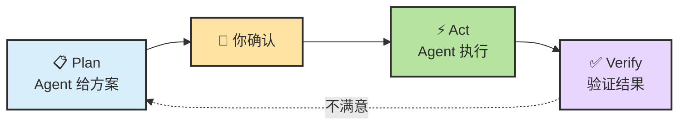
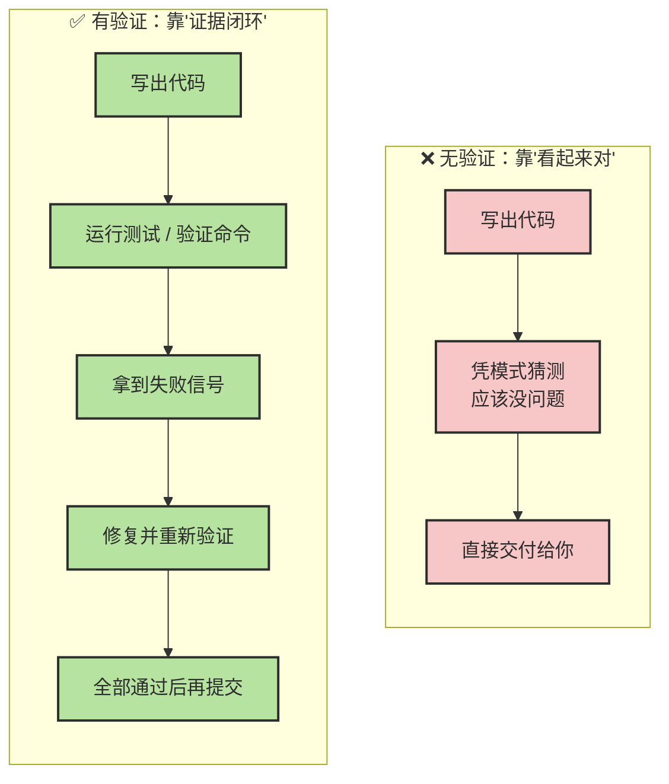

# Chapter 2 · 🎮 Agent 入门实战

> 🎯 **目标**：通过一条贯穿开发闭环的实战主线，掌握 Agent 协作最值得先练熟的动作：理解仓库、制定计划、配环境、安全改动、补测试、修 Bug、做 feature、交付到 Git。完成本章后，你会真正建立"Agent 已经能帮我干活"的第一批直觉。
>
> 📌 **建议通读顺序**：第一次读本章，先完成核心实战 1-6，把"理解 → 计划 → 改动 → 测试 → 修 Bug"这条最短闭环跑通；扩展实战 7-8 和 Capstone 更适合在你开始把 Agent 用到真实项目时再回来补。
>
> 🧬 **编排原则**：Agent 不是"帮你写代码"，而是"帮你完成一个有验证信号的开发闭环"。每个实战都固定 5 栏：**任务目标 / 输入上下文 / 操作边界 / 验证方式 / 反思问题**。

## 📑 目录

- [0. 本章核心方法：先 Plan 再 Act](#0-本章核心方法先-plan-再-act)
- [0.5 在开始实战之前：认识你的工作环境](#05-在开始实战之前认识你的工作环境)
- **核心实战**
  - [1. 🔍 只读理解代码库（20min）](#1--只读理解代码库20min)
  - [2. 📋 先 plan，再动手（15min）](#2--先-plan再动手15min)
  - [3. 🚀 冷启动 onboarding（20min）](#3--冷启动-onboarding20min)
  - [4. 🔧 小步安全重构（20min）](#4--小步安全重构20min)
  - [5. 🧪 补测试并让测试闭环（20min）](#5--补测试并让测试闭环20min)
  - [6. 🐛 基于复现信号修 Bug（30min）](#6--基于复现信号修-bug30min)
- **扩展实战**
  - [7. 🛠️ 开发一个小而完整的 feature（30min）](#7-️-开发一个小而完整的-feature30min)
  - [8. 🔀 Git / PR / 协作自动化（15min）](#8--git--pr--协作自动化15min)
  - [Capstone：端到端做一个真实小功能](#capstone端到端做一个真实小功能)
- [9. 📌 本章总结](#9--本章总结)
- [10. 🗂️ 补充认知：三种基础设施的分工](#10-️-补充认知三种基础设施的分工)

---

## 0. 本章核心方法：先 Plan 再 Act

### 为什么不要上来就让 Agent 改代码

新手最常犯的错误：

```
帮我重构这个模块，加上测试。
```

这看起来没问题，但你会遇到：
- Agent 一口气改了 15 个文件，你看不过来
- 改完才发现方向不对，回退成本极高
- Agent 做了很多你没预期的"优化"，引入新问题

**根本原因**：你跳过了方案确认环节，让 Agent 既当设计师又当施工队，而你连图纸都没看。

### Plan-Act 两步法

所有实战都遵循同一个模式：



| 阶段 | 你做什么 | Agent 做什么 |
|:---:|---|---|
| **Plan** | 描述目标和约束 | 分析现状、给出方案 |
| **确认** | 审查方案、提出修改 | 等你确认 |
| **Act** | 观察执行过程 | 按确认的方案执行 |
| **Verify** | 检查结果、判断是否通过 | 跑测试、输出 diff |

### 三句话万能后缀

在 Ch01 中我们已经介绍过，这三句话应该成为你与 Agent 对话的下意识习惯：

```
先分析再执行。
修改后必须验证。
如果不确定，就停下来说明。
```

> 💡 **Pro Tip**：把这三句话写进项目的 `CLAUDE.md`，Agent 每次启动都会读到，你就不用每次手打了。

```markdown
# CLAUDE.md
## 工作规则
- 先给方案，等我确认后再动手
- 每次修改后运行相关测试
- 遇到不确定的地方，停下来问我
```

<details>
<summary><span style="color: #e67e22; font-weight: bold;">📊 进阶：验证到底能提升多少？（Anthropic 官方数据）</span></summary>

Anthropic 官方最佳实践中有一条被反复强调的原则：

> **"When Claude can verify its own work—by running tests, comparing screenshots, and validating output—it performs significantly better."**
>
> — Anthropic, Claude Code Best Practices

给 Agent 可运行的验证命令后，效果提升显著：

| 维度 | 无验证 | 有验证 | 提升幅度 |
|------|--------|--------|:---:|
| 首次正确率 | ~40-50% | ~70-85% | **+30~35%** |
| Bug 修复成功率 | ~50% | ~80-90% | **+30~40%** |
| 代码规范一致性 | 经常偏离 | 高度一致 | 显著 |

**为什么验证能带来如此大的提升？**



没有验证时，Agent 只能依赖训练数据中的模式匹配来判断"应该没问题"。有验证时，Agent 获得了**明确的对错信号**，可以进入"修改→验证→再修改"的闭环，就像人类开发者做 TDD 一样。

> 🔑 **核心结论**：给 Agent 可运行的验证命令 = 代码质量提升 2-3x。这是性价比最高的一个习惯。把 `pytest`、`ruff check`、`npm test` 写进 CLAUDE.md，每次让 Agent 改完代码就跑一遍。

</details>

---

## 0.5 在开始实战之前：认识你的工作环境

在进入动手环节之前，先花几分钟搞清楚 Agent 工作时的几个核心概念和文件体系。这会让后面所有实战的"为什么这样做"变得更好理解。

> 📖 如果你想要更完整的术语词典，可以随时查阅 [Ch6 · 基础概念与术语](./ch06-glossary.md)。本节只介绍最影响实战效果的几个概念。

### a. Prompt、每轮对话、Session、Context 的区别

这四个词经常被混用，但它们不在同一层：

| 概念 | 一句话定义 | 类比 |
|------|----------|------|
| **Prompt** | 你这一轮对 Agent 说的话 | 你在会议上说的那句发言 |
| **每轮对话（Turn）** | 一次"你说 → Agent 回"的完整来回 | 会议里的一轮讨论 |
| **Session** | 一段连续的工作对话，包含多轮对话的完整轨迹 | 整场会议（从开始到结束） |
| **Context** | 当前这一轮模型**实际看到的所有信息** | 摊在桌上的全部材料（不是整场会议的逐字记录） |

> 🎯 **最容易踩的坑**：Session ≠ Context。你觉得"我们一直在聊"，但模型每一轮实际看到的只是 runtime 从 session 里挑出来的一份**工作集**。聊得越久，早期内容越可能被截断或压缩。
>
> 这就是为什么本教程反复强调"长任务要定期压缩 / 重要约束要写进文件"——留在对话里的信息随时可能被挤出 Context。

### b. 三层分离：规则、会话、扩展

搞清楚 Agent 工作流里的三层分工，能帮你避免"越用越乱"：

| 层 | 它负责什么 | 典型载体 |
|---|---|---|
| 📜 **规则层** | 项目事实、长期约束、默认行为 | `CLAUDE.md`（Codex: `AGENTS.md`）/ `.claude/rules/` |
| 💬 **会话层** | 当前任务、阶段目标、临时上下文 | 对话历史 / `/compact` 摘要 / `HANDOFF.md` |
| 🔌 **扩展层** | 新工具、新方法、新自动化入口 | MCP / Skill / Hook / Command / Plugin |

如果这三层不分，常见结果就是：

- 永久规则留在临时对话里 → 下一轮就忘了
- 临时任务被写进永久规则文件 → 规则文件越来越臃肿
- 扩展越装越多，但没有真正解决问题

### c. Claude Code 的文件管理体系

Claude Code 通过一套分层的文件体系来管理规则、记忆、会话和扩展。搞清楚"什么放在哪"，是用好 Agent 的基础。

#### 项目级文件（`.claude/` + 根目录）

```
your-project/
├── CLAUDE.md                  # 项目指令，每次启动都加载（Codex: AGENTS.md）
├── CLAUDE.local.md            # 个人覆盖，gitignored（Codex: AGENTS.override.md）
│
└── .claude/                   # 项目配置目录（Codex: .codex/ 或 .agents/）
    ├── settings.json          # 权限 allow/deny（Codex: config.toml）
    ├── settings.local.json    # 个人权限覆盖，gitignored
    ├── rules/                 # 模块化规则（支持按路径生效）
    ├── commands/              # 自定义斜杠命令
    ├── skills/                # 自动触发的方法手册
    │   └── <skill-name>/
    │       └── SKILL.md
    └── agents/                # 子代理角色定义
        └── code-reviewer.md
```

#### 用户级文件（`~/.claude/`）

```
~/.claude/                     # 个人全局配置（Codex: ~/.codex/）
├── CLAUDE.md                  # 全局个人指令（Codex: ~/.codex/AGENTS.md）
├── settings.json              # 全局设置
├── skills/                    # 个人 Skills（所有项目可用）
├── commands/                  # 个人命令
├── agents/                    # 个人子代理
│
└── projects/                  # ★ 项目数据与会话存储（自动生成）
    └── <encoded-cwd>/         # 按项目路径编码（如 -Users-me-proj）
        ├── <session-id>.jsonl # 会话完整记录（逐行 JSON）
        ├── sessions-index.json# 会话索引
        └── memory/            # ★ Auto Memory（自动记忆）
            ├── MEMORY.md      # 记忆索引（每次会话加载前 200 行）
            ├── debugging.md   # 主题记忆文件（按需读取）
            └── api-conventions.md
```

#### 三个最值得记住的文件

| 文件 | 作用 | 谁写 | 何时加载 |
|------|------|------|---------|
| **`CLAUDE.md`** | 项目规则与约束 | 你手写 | 每次会话启动时全文加载 |
| **`MEMORY.md`** | 自动记忆索引 | Agent 自动积累 | 每次会话启动时加载前 200 行 |
| **`settings.json`** | 权限边界（allow / deny） | 你手写 | 每次会话启动时加载 |

> 💡 **CLAUDE.md 与 Auto Memory 的关系**：`CLAUDE.md` 是你给 Agent 的**指令**（编码规范、工作流、项目架构）；Auto Memory 是 Agent 自己积累的**笔记**（构建命令、调试经验、你的偏好）。两者互补，都在每次会话开始时进入 Context。

> 📖 想看 `.claude` 文件夹的完整深度解析（rules 路径作用域、commands vs skills 区别、settings.json 权限三区等），见 [Ch3 · .claude 文件夹全景图](./ch03-first-extension-setup.md#6-claude-文件夹全景图)。

### d. 会话何时该清理

会话污染通常来自三件事：不相关任务混入、错误尝试累积、重要约束只留在对话里没写进文件。

**四个清理信号：**

| 信号 | 建议动作 |
|------|---------|
| Agent 忘了前面强调过的约束 | `/compact` 或新开会话 |
| 同一个问题来回修两三轮还在原地 | 新开会话（失败尝试在污染判断） |
| 对话越来越长但有效推进越来越少 | `/compact` |
| 你自己也看不懂这轮历史了 | 压缩结论 + 新开会话 |

清理的正确做法：压缩关键结论 → 把长期规则写回文件 → 为新阶段开干净会话。

> 📖 具体的 `/clear`、`/compact`、`--resume` 等命令用法，见 [Ch4 · 会话管理与模型切换](./ch04-claude-code-tips.md#5-会话管理与模型切换)。

---

## 1. 🔍 只读理解代码库（20min）

> 🎯 **场景**：你刚接手一个陌生项目（或想深入了解一个开源仓库），需要快速建立全局认知。

| 栏位 | 说明 |
|:---:|------|
| **任务目标** | 不改任何代码，让 Agent 给出项目的结构化概览 |
| **输入上下文** | 项目根目录、README、构建文件 |
| **操作边界** | 只读——不允许修改任何文件 |
| **验证方式** | 你能用自己的话向别人介绍这个项目 |
| **反思问题** | 为什么从"只读理解"开始，而不是直接上手改代码？ |

### 为什么从这里开始

理解代码是 Agent 最高 ROI 的用法。传统做法需要数小时翻目录、搜关键词、读文件；Agent 可以把这个过程压缩到 20 分钟。更重要的是，这个练习不会修改任何文件——零风险，纯收益。

### 准备工作

先选一个适合"纯理解、不改代码"的仓库：

| 仓库 | 特点 | 适合 |
|------|------|------|
| **[Ascend/DrivingSDK](https://gitcode.com/Ascend/DrivingSDK)** | 昇腾 NPU 上的自动驾驶加速库，目录层次清晰，文档较完整，同时包含 C++ / Python / CMake | 想练"陌生仓快速建模"的读者 |
| **[fastapi/fastapi](https://github.com/fastapi/fastapi)** | Python Web 框架，结构清晰、文档完善、代码量适中，社区活跃 | Web 后端开发者，想用熟悉技术栈练手 |
| **[expressjs/express](https://github.com/expressjs/express)** | Node.js 经典 Web 框架，代码量不大，适合 JS/TS 开发者 | 前端 / Node.js 开发者 |
| **你自己的项目** | 你最熟悉，能验证 Agent 分析是否准确 | 有工程经验的读者 |

```bash
# 示例：使用 DrivingSDK
git clone https://gitcode.com/Ascend/DrivingSDK.git
cd DrivingSDK
claude
```


### Step 1：结构化提问

```
请帮我全面理解这个仓库：

1. 项目定位：一句话说清楚这个项目解决什么问题
2. 目录结构：列到第二级，标注每个目录的作用
3. 核心模块：哪 3-5 个文件/目录最重要？为什么？
4. 技术栈：语言、框架、依赖
5. 启动命令：如何安装、运行、测试

先不要修改任何文件，只做分析。
```

### Step 2：如果支持 subagent，先让它做第一轮扫仓

如果你用的 Agent 支持子 Agent，可以先把"低风险的第一轮探索"分出去：

```
请指定一个 subagent 先做第一轮仓库探索：
- 只读取目录、README、安装/构建相关文件
- 输出：项目定位、关键目录、技术栈/构建方式、建议下一步阅读路径
- 明确标出不确定点

主 Agent 不要立刻下结论，先等 subagent 回来后再汇总。
```

### Step 3：追问式深入

概览之后，选择你最感兴趣的部分深入追问：

```
你提到 [核心模块名] 是最重要的模块。
请追踪它的核心调用链：从入口到最终执行，中间经历了哪些步骤？
用简明的流程图或列表说明。
```

### Step 4：交叉验证

Agent 的分析不一定 100% 准确。用这个方法验证：

```
请列出你在分析中做了哪些假设。
有没有你不确定的地方？哪些结论是你从代码中直接读到的，哪些是推测的？
```

> ⚠️ **重要**：Agent 在理解代码时会出现"自信地胡说"的情况——它可能编造一个听起来合理但实际不存在的调用链。追问假设是防御手段。

### ✅ 检查点

- [ ] 我能用自己的话向别人介绍这个项目吗？
- [ ] 我知道项目的核心入口在哪里吗？
- [ ] 如果要改一个功能，我大概知道该从哪个文件开始看吗？

---

## 2. 📋 先 plan，再动手（15min）

> 🎯 **场景**：你要让 Agent 做一个有意义的改动，但不是直接让它写代码，而是先让它产出一份**可审查的实施计划**。

| 栏位 | 说明 |
|:---:|------|
| **任务目标** | 让 Agent 产出一份结构化计划，而不是直接改代码 |
| **输入上下文** | 一个明确的功能需求或改进方向 |
| **操作边界** | 只产出计划——不允许修改任何文件 |
| **验证方式** | 计划包含涉及文件、风险点、测试点、回滚点 |
| **反思问题** | 为什么"先产出计划"比"直接让 Agent 改"更安全？ |

### 为什么要单独练这一步

这是最容易被跳过、又最值得养成的习惯。新手最常见的坑不是 Agent 写不出代码，而是 Agent 一口气改了十几个文件，你完全看不过来。**先 plan 后 act** 是所有主流 Agent 工作流（Claude Code、Codex、Cursor）都在强调的第一原则。

### 示例任务

```
我想给通知模块加上"批量发送"的能力。

请先给我一份实施计划，不要改代码：
1. 需要修改哪些文件？每个文件改什么？
2. 有哪些风险点？
3. 完成后用什么方式验证？
4. 如果出问题，回滚策略是什么？
```

### Agent 应该输出什么

一份好的计划至少包含：

| 要素 | 说明 |
|------|------|
| **涉及文件清单** | 具体到文件路径和改动内容 |
| **实施步骤** | 按顺序列出，标注依赖关系 |
| **风险点** | 可能出问题的地方 |
| **测试策略** | 用什么命令验证、哪些用例需要通过 |
| **回滚方案** | 如果出问题怎么退回 |

### 你的审查要点

```
请回答：
1. 这个计划有没有遗漏的文件？
2. 步骤之间有没有隐含的依赖没写明？
3. 如果第 3 步失败了，前面的步骤需要回退吗？
```

### ✅ 检查点

- [ ] 你拿到了一份看得懂、可审查的计划
- [ ] 计划包含风险点和验证方式
- [ ] Agent 没有偷偷改任何文件

> 📌 **经验沉淀**：好的计划模板可以写进 `CLAUDE.md`，以后每次大改动前自动要求 Agent 先出 plan。

---

## 3. 🚀 冷启动 onboarding（20min）

> 🎯 **场景**：让 Agent 帮你按 README 把项目跑起来，遇到环境问题时自主排障，最后产出一份"本地启动补充说明"。

| 栏位 | 说明 |
|:---:|------|
| **任务目标** | 从 clone 到项目能跑起来，并记录遇到的坑 |
| **输入上下文** | README、安装脚本、依赖配置文件 |
| **操作边界** | 允许执行安装命令和测试命令，不改业务代码 |
| **验证方式** | 项目启动成功 / 测试通过 / 构建通过 |
| **反思问题** | README 漏了什么？Agent 在环境排障时的表现如何？ |

### 为什么这一课很重要

"按 README 跑起项目"听起来简单，但在真实工作中经常卡在：缺依赖、版本不匹配、环境变量缺失、构建脚本报错。这恰好是 Agent 的强项——它会读报错、搜原因、尝试修复。

### 示例任务

```
请按照 README 的说明配置本地开发环境：
1. 安装所有依赖
2. 如果遇到报错，分析原因并尝试修复
3. 确保项目能正常启动 / 测试能通过
4. 最后产出一份"本地启动补充说明"，记录 README 里没写但实际需要的步骤

允许执行安装和测试命令，但不要修改业务代码。
```

### 你应该关注什么

| 关注点 | 怎么看 |
|--------|--------|
| Agent 遇到报错时是直接猜，还是先读错误信息？ | 看它的排查过程 |
| 它有没有在未经确认时执行高风险命令？ | 关注 `sudo`、全局安装等 |
| 产出的"补充说明"是否真的有用？ | 拿给一个不熟悉项目的同事看看 |

### ✅ 检查点

- [ ] 项目能在本地跑起来
- [ ] Agent 产出了一份可用的"启动补充说明"
- [ ] 你理解了 Agent 在排障时的思路

---

## 4. 🔧 小步安全重构（20min）

> 🎯 **场景**：在已有项目中做一个**约束清晰、行为不变、可验证**的安全重构。不是玩具级的"rename 变量"，而是有真实工程价值的改动。

| 栏位 | 说明 |
|:---:|------|
| **任务目标** | 完成一个行为不变的安全改动 |
| **输入上下文** | 目标代码文件、相关测试文件 |
| **操作边界** | 只改目标文件，不改外部接口，行为必须不变 |
| **验证方式** | 现有测试全部通过，diff 范围符合预期 |
| **反思问题** | 为什么要求"行为不变"？Agent 有没有偷偷改了你没要求的东西？ |

### 推荐的重构任务（选一个）

| 任务 | 适合什么技术栈 |
|------|-------------|
| 把一个 legacy util 改成现代语法（如 callback → async/await） | Node.js / Python |
| 拆一个过长函数（超过 80 行），不改外部接口 | 任意 |
| 消除一个 `@ts-ignore` / `# type: ignore` / deprecated API 调用 | TypeScript / Python |

### 示例 Prompt

```
请帮我重构 src/utils/legacy-parser.js：
- 把 callback 风格改成 async/await
- 行为必须完全不变
- 不修改这个文件的导出接口

请先给出计划（要改哪些函数、预期 diff 范围），我确认后再改。
改完后运行 npm test 确认所有测试通过。
```

### 审查要点

```
请回答：
1. 改动前后的导出接口完全一致吗？
2. 有没有改到目标文件以外的文件？
3. 如果我运行 git diff，你预期看到的变更范围是什么？
```

### ✅ 检查点

- [ ] 所有现有测试通过
- [ ] `git diff` 范围符合预期，没有意外改动
- [ ] 外部接口没有变化

---

## 5. 🧪 补测试并让测试闭环（20min）

> 🎯 **场景**：选一个没有测试覆盖的函数或模块，让 Agent 完成"识别缺口 → 设计用例 → 生成测试 → 跑通 → 修到通过"的完整闭环。

| 栏位 | 说明 |
|:---:|------|
| **任务目标** | 为一个未覆盖的模块补上高质量测试 |
| **输入上下文** | 目标模块代码、现有测试文件、测试框架配置 |
| **操作边界** | 只新增测试文件，不改业务代码 |
| **验证方式** | 新测试全部通过，覆盖 happy path + 边界条件 + 错误处理 |
| **反思问题** | Agent 写的测试是否真的能捕获 bug？如果你把核心函数的返回值改成 null，有几个测试会失败？ |

### Step 1：让 Agent 识别测试缺口

```
请分析这个项目的测试覆盖情况：
1. 哪些模块已经有测试？
2. 哪些模块缺少测试但应该有？
3. 按"业务重要性 × 出错成本"排序，推荐最该先补测试的 3 个模块

先给分析，不要写测试代码。
```

### Step 2：确认测试场景

```
请为 [模块名] 列出应覆盖的测试场景，包括：
- 正常路径（happy path）
- 边界条件（空值、极大值、特殊字符）
- 错误处理路径（异常输入、网络失败）

只列场景，不写代码。我确认后再写。
```

### Step 3：确认后生成测试

```
场景列表认可。请按以下规范生成测试代码：
- 每个测试用例一个清晰的描述
- 使用项目已有的测试框架和风格
- 确保测试能独立运行，不依赖其他测试的执行顺序
- 写完后运行测试，确保全部通过
```

### Step 4：审查测试质量

| 常见问题 | 检查方法 |
|---------|---------|
| **只测 happy path** | 检查是否有边界条件和错误处理的用例 |
| **测试和实现耦合太紧** | 改了实现细节，测试是否全崩？ |
| **断言太弱** | `expect(result).toBeTruthy()` 这种几乎测不出 bug |
| **缺少独立性** | 测试之间是否有隐藏的顺序依赖？ |

```
请自检你写的测试：
1. 是否覆盖了所有我确认的场景？
2. 有没有断言过于宽松的用例？
3. 如果我把 [核心函数] 的返回值改成 null，有几个测试会失败？
```

### ✅ 检查点

- [ ] 所有测试通过
- [ ] 你认同测试覆盖的场景（特别是边界条件）
- [ ] 测试代码的风格与项目一致

---

## 6. 🐛 基于复现信号修 Bug（30min）

> 🎯 **场景**：从一个**失败命令 / 报错 / 栈追踪**出发，让 Agent 完成"定位 → 分析 → 修复 → 验证"全流程。重点是**给 Agent 复现信号**，而不是让它猜。

| 栏位 | 说明 |
|:---:|------|
| **任务目标** | 定位根因、最小改动修复、通过测试 |
| **输入上下文** | 失败命令、错误信息、栈追踪、是否稳定复现 |
| **操作边界** | 只改与 bug 相关的文件，不做无关重构 |
| **验证方式** | 失败测试变绿 + 完整测试套件通过 |
| **反思问题** | 为什么"描述现象"比"猜原因"更有效？Agent 有没有"顺手"改了不相关的代码？ |

### 准备工作

如果手头没有现成 Bug，可以故意引入一个：修改某个函数的返回值、删掉一行关键代码、或改错一个条件判断，然后假装不知道原因。

### Step 1：描述现象，不要描述原因

**正确**做法——给复现信号：

```
运行 `npm test` 后，test/utils.test.js 中的 "should parse date correctly"
这个测试用例失败了。错误信息是 "Expected '2026-03-23' but got 'NaN-NaN-NaN'"。
这个失败是稳定复现的。

请帮我分析可能的原因。先不要改代码，给出 2-3 个可能的原因和排查顺序。
```

**错误**做法——直接猜原因：

```
我觉得 parseDate 函数的正则写错了，帮我修一下。
```

> 💡 **为什么**：如果你直接告诉 Agent 原因，它会"顺着你的思路"修——即使你猜错了。描述现象让 Agent 独立分析，往往能发现你没想到的根因。

### Step 2：确认排查顺序

Agent 会给出可能的原因和排查顺序。你确认后：

```
同意，请按这个顺序排查。找到根因后先给出修复方案，不要直接改。
```

### Step 3：确认修复方案后执行

```
方案看起来合理。请执行修复，修复后：
1. 运行失败的测试用例确认通过
2. 运行完整测试套件确认没有引入新问题
3. 输出你改了哪些文件、每个文件改了什么
```

### Step 4：审查修复

```
请解释你修复的核心逻辑。为什么这个改动能解决问题？
有没有其他地方存在同样的问题？
```

### ✅ 检查点

- [ ] 你看懂了 Agent 的修复逻辑吗？
- [ ] 测试通过了吗？
- [ ] Agent 有没有"顺手"改了你没要求的东西？

> 📌 **经验沉淀**：Bug 修复标准流程 → 给复现信号 → 分析原因 → 确认方案 → 执行修复 → 验证结果。

---

> 🧭 **从这里开始是扩展实战**：如果你是第一次通读教程，做完核心实战 1-6 就已经建立了最关键的协作手感。扩展实战 7-8 和 Capstone 更适合在你开始把 Agent 用到真实项目时再回来补。

## 7. 🛠️ 开发一个小而完整的 feature（30min）

> 🎯 **场景**：在已有项目中添加一个**单需求、多文件、可验收**的小功能。不是从零做全栈项目，而是有边界的增量开发。

| 栏位 | 说明 |
|:---:|------|
| **任务目标** | 在现有项目里完成一个可验收的小功能 |
| **输入上下文** | 功能需求、涉及的模块、现有接口 |
| **操作边界** | 只改需求涉及的文件，附带测试 |
| **验证方式** | 新功能可用 + 新测试通过 + 旧测试不破 |
| **反思问题** | Agent 有没有加你没要求的"锦上添花"功能？feature 边界是否守住了？ |

### 推荐的 feature 任务（选一个）

- 给表格加筛选功能
- 给某接口加分页支持
- 给通知系统加静默模式
- 给日志输出加结构化格式

### 示例 Prompt

```
请帮我给 GET /todos 接口加上分页支持：
- 支持 ?page=1&pageSize=20 参数
- 返回结果包含 { data, total, page, pageSize }
- 不改变现有不带参数时的默认行为
- 附带测试

请先给出实施计划（涉及文件、改动内容、测试用例），
我确认后再分步实现。每完成一步就运行测试确认。
```

### ✅ 检查点

- [ ] 新功能可用且测试通过
- [ ] 旧功能不受影响（回归测试通过）
- [ ] Agent 没有加你没要求的额外功能

---

## 8. 🔀 Git / PR / 协作自动化（15min）

> 🎯 **场景**：让 Agent 帮你完成 Git 协作流程——创建分支、写 commit message、生成 PR 描述、辅助处理 merge conflict。

| 栏位 | 说明 |
|:---:|------|
| **任务目标** | 完成从提交到 PR 的完整交付流程 |
| **输入上下文** | 当前改动 diff、分支状态 |
| **操作边界** | Git 操作需逐步确认，不允许 force push |
| **验证方式** | commit message 可读、PR 描述准确反映改动 |
| **反思问题** | Agent 生成的 commit message 是说"做了什么"还是说"为什么做"？ |

### Step 1：创建分支并提交

```
请帮我完成以下 Git 操作：
1. 基于当前分支创建一个新分支，命名为 feat/add-pagination
2. 将当前所有改动暂存（stage）
3. 按 Conventional Commits 规范写 commit message
4. 提交

在执行每一步之前，先告诉我你要运行什么命令。
```

### Step 2：审查 commit message 质量

| 维度 | 好的 commit message | 差的 commit message |
|------|-------------------|-------------------|
| **主题行** | 简洁、说清"做了什么" | 过长或含糊（如 "update code"） |
| **正文** | 说明"为什么"，而非只列"改了什么" | 只是重复 diff 内容 |
| **粒度** | 一个 commit 做一件事 | 把 3 个不相关改动塞一个 commit |

### Step 3：生成 PR 描述

```
请为当前分支生成一份 Pull Request 描述，包含：
1. 变更概要（3 句话以内）
2. 具体改动列表
3. 测试情况
4. 需要 reviewer 重点关注的地方

使用 Markdown 格式。
```

### ✅ 检查点

- [ ] commit 粒度合理（一个 commit 一件事）
- [ ] commit message 可读、符合规范
- [ ] PR 描述准确反映了改动内容

> 📌 如果你的团队有特定的 commit 和 PR 规范，把它写进 `CLAUDE.md`，Agent 会自动遵守。

---

## Capstone：端到端做一个真实小功能

> 🎯 **场景**：把前面学到的所有技能串联起来——在已有项目里新增一个可见成果的小功能，从理解到交付走完全流程。

这是本章的综合练习。选一个你真实需要的小功能，按这条流程走一遍：


| 步骤 | 对应实战 | 你该做什么 |
|:---:|:---:|------|
| 理解现有代码 | 实战 1 | 让 Agent 分析要改动的模块 |
| 先出计划 | 实战 2 | 审查计划，确认后再动手 |
| 分步实现 | 实战 4+7 | 每步验证，不一口气写完 |
| 写测试 | 实战 5 | 覆盖 happy path + 边界条件 |
| 验证通过 | 全流程 | 所有测试通过，diff 符合预期 |
| 提交 PR | 实战 8 | 规范的 commit + PR 描述 |

### 推荐的 Capstone 任务

- 给日志页面做可视化面板
- 给管理后台加一个数据列表页
- 给现有功能加前端配置面板
- 给 CLI 工具加一个新的子命令

> 💡 选择比"从零做一个应用"更小的任务。它天然会串起理解 → 计划 → 多文件改动 → 测试 → 调试 → PR 交付。

---

## 9. 📌 本章总结：你已建立的关键习惯

通过这条开发闭环主线，你建立了一套可复用的 Agent 协作方法论：

| # | 习惯 | 核心行为 | 反面教材 |
|:---:|------|---------|---------|
| ① | **先读后改** | 先让 Agent 理解代码，再动手 | 不看仓库直接"帮我重构" |
| ② | **先 Plan 再 Act** | 让 Agent 先给方案，你确认后再执行 | 跳过计划直接开写 |
| ③ | **给复现信号** | 给 Agent 失败命令、报错、栈追踪 | 只说"有个 bug 帮我修" |
| ④ | **修改后必须验证** | 每次改动跑测试、检查 diff | "看起来对就行" |
| ⑤ | **不确定就停下来** | 遇到模糊的地方让 Agent 说明 | Agent 猜错了继续猜 |
| ⑥ | **分步推进** | 一次只做一件事，逐步验证 | 一口气让 Agent 做完所有事 |
| ⑦ | **审查 Agent 的输出** | 检查代码/测试/commit | 无脑接受所有建议 |
| ⑧ | **经验沉淀** | 好的做法写进 `CLAUDE.md` / Skill | 每次都从零开始 prompt |

### 你的 CLAUDE.md 应该长成这样了

```markdown
# CLAUDE.md

## 工作规则
- 先给方案，等我确认后再动手
- 每次修改后运行相关测试
- 遇到不确定的地方，停下来问我
- 一次只做一件事，不要批量修改

## Bug 修复流程
- 先给我复现命令和错误信息
- 要求 2-3 个可能原因并排优先级
- 确认后再修，修完跑测试

## 测试规范
- 覆盖 happy path + 边界条件 + 错误处理
- 断言要具体，不用 toBeTruthy 这种弱断言

## Git 规范
- Commit message 使用 Conventional Commits
- PR 描述包含：概要、改动列表、测试情况、关注点

## 重构规则
- 行为不变是硬约束
- 改动前后跑完整测试
- 不改目标文件以外的文件
```

> 💡 **`CLAUDE.md` 是复利资产**——你沉淀得越多，后续 Agent 的表现就越好，因为它每次启动都会读这个文件。

---

## 10. 🗂️ 补充认知：三种基础设施的分工

在你积累更多实战经验后，会发现 Agent 的行动空间其实建立在三层基础设施上，搞清楚它们的分工，能帮你少走很多弯路：

| 基础设施 | 定位 | 典型用法 |
|---------|------|---------|
| **CLI / Shell** | 统一行动总线，把各种系统能力暴露给 Agent | 执行构建、测试、Git 操作、调用外部服务 |
| **文件系统** | 默认的长期记忆与工作空间 | 存放代码、日志、`CLAUDE.md`、经验总结、阶段产物 |
| **RAG / 向量库** | 处理体量大、结构松散的知识 | 大量 PDF、网页爬取、历史工单等 |

📌 **实践原则**：

- 对工程类任务，优先用**文件系统 + ripgrep** 检索项目内容，而不是把代码塞进向量库
- 能用 **CLI 命令**完成的操作，不需要专门设计一个工具；Agent 本身就会写代码来调用命令
- **RAG** 适合体量特别大、和代码仓库分离的外部知识，不是默认选项

> 💡 初学者常犯的错误：一上来就搭向量库，结果发现 Agent 直接读文件效果更好、更容易调试。

---

## 📋 本章实战速查

| # | 实战 | 时间 | 难度 | 核心技能 |
|:---:|------|:---:|:---:|---------|
| 1 | 🔍 只读理解代码库 | 20min | ⭐ | 结构化提问、追问调用链 |
| 2 | 📋 先 plan 再动手 | 15min | ⭐ | 产出可审查计划、审查风险点 |
| 3 | 🚀 冷启动 onboarding | 20min | ⭐ | 按 README 配环境、排障 |
| 4 | 🔧 小步安全重构 | 20min | ⭐⭐ | 行为不变约束、diff 审查 |
| 5 | 🧪 补测试闭环 | 20min | ⭐⭐ | 测试场景设计、质量审查 |
| 6 | 🐛 基于复现信号修 Bug | 30min | ⭐⭐ | 复现信号、分步排查、验证 |
| 7 | 🛠️ 小 feature 开发 | 30min | ⭐⭐ | Spec 编写、分步实现、集成验证 |
| 8 | 🔀 Git / PR 自动化 | 15min | ⭐ | commit 规范、PR 描述 |
| 🏆 | Capstone 端到端交付 | 60min | ⭐⭐⭐ | 全流程串联 |

> 建议按顺序完成核心实战 1-6，扩展实战和 Capstone 可以在实际项目中随时回来练。

---

## 🎉 下一步：从"能用"走向"善用"

恭喜你完成了第一批实战！你已经掌握了与 Agent 协作的基本节奏：

- ✅ 你知道怎么让 Agent 先出方案再动手
- ✅ 你知道怎么给 Agent 有效的复现信号
- ✅ 你知道怎么验证 Agent 的输出
- ✅ 你开始积累自己的 `CLAUDE.md`

接下来，先别急着冲进大段理论。更稳的顺序是先把规则、会话和扩展三层分清，再去学具体产品的实用技巧，这样后面无论切到 Claude Code 还是 Codex，都不容易越用越乱。

👉 下一章：[Chapter 3 · ⚙️ 配置使用第一个](./ch03-first-extension-setup.md)

---

<div align="center">

[📚 返回目录](../../README.md#tutorial-contents) | [⬅️ 上一章：Ch01 快速开始](./ch01-quickstart.md) | [➡️ 下一章：Ch03 配置使用第一个](./ch03-first-extension-setup.md)

</div>
