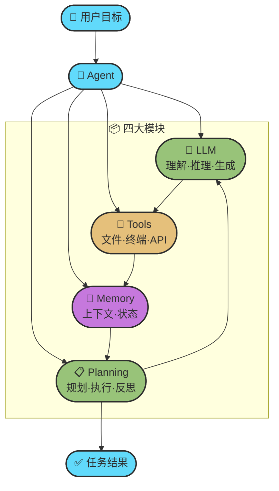
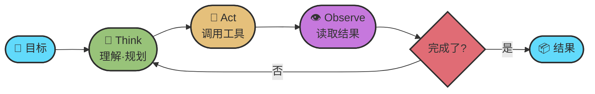
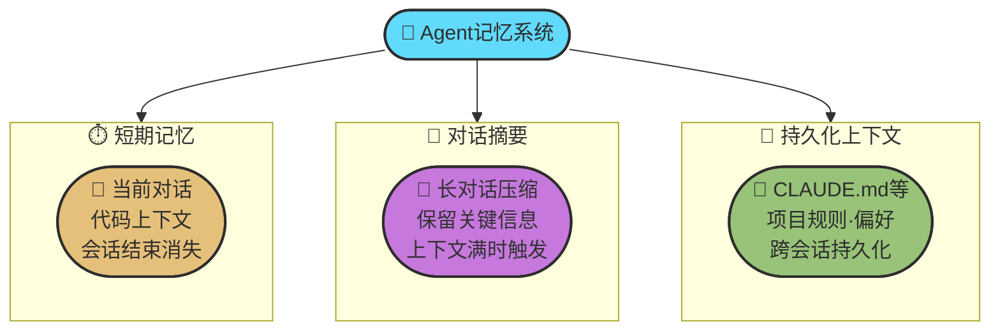
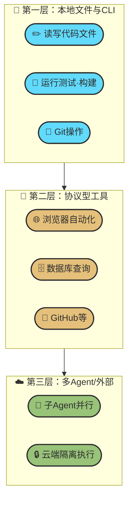
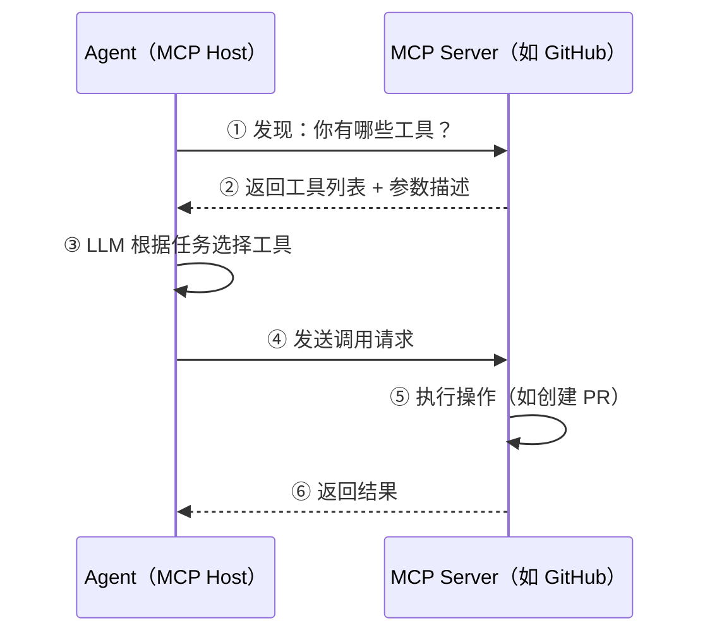
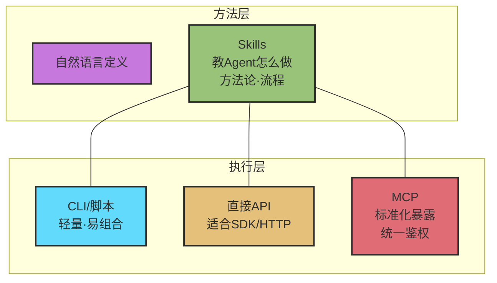
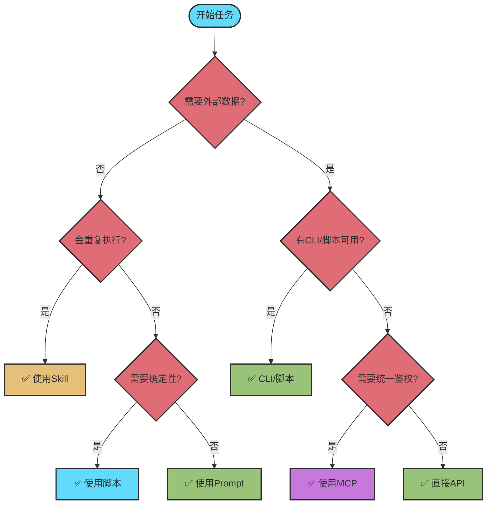
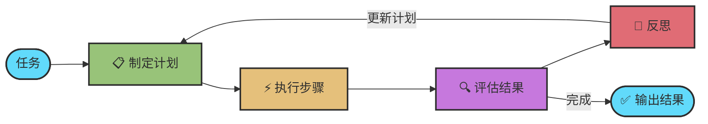

# Chapter 2 · 🧩 Agent 核心原理

> 目标：建立一套清晰的 Agent 心智模型——知道它是什么、怎么工作、为什么有时聪明有时蠢。

## 目录

- [0. 先问自己三个问题](#0-先问自己三个问题)
- [1. Agent 的本质：一张图搞懂](#1-agent-的本质一张图搞懂)
- [2. Memory：上下文是 Agent 的命脉](#2-memory上下文是-agent-的命脉)
- [3. Tools、MCP 与 Skills：Agent 的手脚](#3-toolsmcp-与-skillsagent-的手脚)
- [4. Planning：Agent 如何规划任务](#4-planning-agent-如何规划任务)

---

## 0. 先问自己三个问题

在深入原理之前，先检视一下你对 Agent 的直觉——以下哪些你觉得是对的？

| # | 常见直觉 | 实际情况 |
|---|---------|---------|
| 1 | “Agent 就是更聪明的 ChatGPT” | **不准确。** Agent = LLM + 工具 + 记忆 + 规划循环。ChatGPT 默认交互形态更像对话，而 Agent 会自己动手改代码、跑测试、修 bug（ChatGPT 本身也已具备搜索、文件分析、跨会话记忆等能力） |
| 2 | "模型越强，Agent 就越好用" | **半对。** Agent 表现 = 模型能力 × 上下文质量 × 任务结构清晰度。后两者完全在你手中 |
| 3 | "我给 Agent 的信息越全面越好" | **错。** 信息过多会淹没关键指令，导致 Agent 行为退化。精准 > 全面 |
| 4 | "Agent 每次回答都是一次性生成的" | **错。** Agent 在内部跑了一个 Think→Act→Observe 的循环，可能迭代十几轮才给你最终结果 |
| 5 | "工具和插件越多越好" | **错。** 工具太多会让 Agent 决策混乱、上下文膨胀。Less is More |

带着这些认知，我们开始拆解 Agent 的运作原理。

---

## 1. Agent 的本质：一张图搞懂

### Agent ≠ 更聪明的模型

- **LLM**（大语言模型）是"大脑"——负责理解、推理、生成
- **Agent** 是围绕这个大脑构建的"任务执行系统"——负责规划、记忆、调用工具、持续迭代

> **Agent = LLM + Memory + Tools + Planning**（这是常见的教学框架，不是所有实现的唯一定义）



### LLM vs Agent：核心区别

| 维度 | LLM | Agent |
|------|-----|-------|
| 核心模式 | 输入 → 输出（默认对话形态） | 目标 → 循环 → 完成 |
| 是否行动 | 通常不会 | 会调用工具、执行命令 |
| 是否记忆 | 仅当前对话窗口 | 短期 + 长期记忆 |
| 是否规划 | 有限 | 主动拆解任务、分步执行 |
| 失败处理 | 一次性回答 | 观察结果 → 反思 → 重试 |

### 核心闭环：Think → Act → Observe

所有 Agent 的工作本质都是同一个循环：



当你对 Agent 说"帮我重构这段代码并补上测试"，它不是一次性生成答案，而是在内部跑了这个循环很多次——先读代码理解结构，再规划修改方案，然后逐步执行修改、运行测试、根据测试结果修复问题，直到通过。

### 自主性光谱

Agent 不是"全自动或全手动"，而是存在一个自主性光谱。目前主流 Coding Agent（Claude Code、Codex、Cursor）大多工作在**半自主**区间：Agent 自己规划和执行，但在关键操作（写入文件、执行危险命令、推送代码）时请求你确认。


### 产品实例：Claude Code 与 Opus 4.6

**Claude Code 是 Agent 容器（壳 + 工具 + 工作流），Opus 4.6 是其中的大脑（推理 + 编码 + 规划）。** 同理，Codex CLI 之于 GPT-5.x、Gemini CLI 之于 Gemini 3 Pro，都是这个关系。

### 📌 Harness 改变性能的真实数据

> **"模型是 CPU，Harness 是操作系统——CPU 再强，OS 拉胯也白搭。"**
> —— Harrison Chase, LangChain CEO

同一个模型（Claude Opus），套上不同的 Harness，在权威 Benchmark 上的差距触目惊心：

| 环境 | CORE-Bench 得分 |
|------|----------------|
| 原始 Claude Opus 4.5（无专属 Harness） | 42% |
| 同模型 + 优化后的编排框架（Harness） | **78%** |

LangChain 在 Terminal Bench 2.0 中也有类似案例：仅优化 Harness（不换模型），排名从 Top 30 跃升至 **Top 5**。

💡 **实践含义**：与其追逐下一个更强的模型，不如先把当前模型的 Harness 打磨好。

---

> 想深入了解 Agent 与 LLM 的交互细节（API 五层结构、Agentic Loop 伪代码、可靠性机制、安全编辑原理）？见 → [附录：Agent-LLM 交互解剖](../topics/topic-agent-llm-internals.md)

---

## 2. Memory：上下文是 Agent 的命脉

Memory 决定了 Agent 能"记住"多少——直接影响它能处理多复杂的任务、能保持多长时间的连贯性。

### 三种记忆类型



### 上下文 ≠ 越多越好

新手最容易犯的错是"一股脑把所有信息塞给 Agent"。现实往往相反：

| 问题 | 症状 | 解法 |
|------|------|------|
| **重要信息被淹没** | Agent 忽略了你的明确指令 | 精简上下文，突出关键信息 |
| **矛盾指令** | Agent 行为前后不一致 | 检查规则文件是否自相矛盾 |
| **过拟合噪音** | Agent 对无关细节投入过多注意力 | 只给完成当前目标最相关的信息 |

> **黄金原则：不是"尽可能多给"，而是"只给完成当前目标最相关的高密度信息"。**

### Agent 变蠢的三大原因

**上下文污染**：Agent 抓着旧结论不放，或被无关日志带偏。
→ 重开会话，只保留当前任务必要背景。

**Memory 污染**：Agent 学到了错误偏好并不断重复。
→ 定期审查 CLAUDE.md / AGENTS.md 等规则文件，区分永久规则和临时偏好（这些文件是持久化上下文，不等同于产品级 memory）。

**长任务漂移**：任务一长，Agent 忘记原目标，纠结细枝末节。
→ 分阶段执行：先出计划 → 每阶段结束做总结 → 必要时重开会话带上摘要。

### 🔍 混合检索：让长期记忆用起来更准

仅靠向量语义搜索往往不够——关键词精确匹配在某些场景下更可靠。成熟的 RAG 记忆系统通常采用**混合检索**策略：

| 技术 | 建议权重 | 作用 |
|------|---------|------|
| **Vector Search（向量语义）** | ~70% | 语义相似度匹配，理解意图 |
| **BM25（关键词精确）** | ~30% | 关键词精确匹配，补向量的盲点 |
| **检索时效衰减（halfLifeDays≈30）** | 辅助因子 | 新内容优先，旧检索结果降权（注：此为检索排序衰减，有别于记忆文件的 GC 衰减） |
| **MMR 去重（lambda≈0.7）** | 辅助因子 | 结果多样性，避免同质化 |

> 📌 **核心原则**：文件 = 事实来源。你不写进文件的东西 = 你从来不知道的东西。重要信息主动写入文件系统，才能跨会话被检索利用。

> 📖 Memory 的深度技术细节（认知架构演进、向量数据库 RAG、Memory 强化学习）见 👉 [附录：Memory 与上下文工程详解](../topics/topic-memory-system.md)

### 💡 从 Prompt Engineering 到 Context Engineering

理解上下文管理，还需要完成一个观念迁移：

| 维度 | Prompt Engineering 时代 | Context Engineering 时代 | Harness Engineering 时代 |
|------|------------------------|-------------------------|-------------------------|
| **人类角色** | 严格指挥的老师——把专业经验拆成一条条指令 | 产品经理 / 项目经理——拆解任务、规划流程、准备资料 | 架构师与掌舵人——定义业务目标、划定安全红线、设计自动闭环体系 |
| **模型角色** | 听话的学生——按步骤执行，出错要人类干预 | 执行者——在定义好的行动空间内自主决策与实现 | 全链路自主演化执行者——自主择路径、自主调用工具、自主校验与修复 |
| **设计重点** | 一句话 / 一段话如何写清楚指令 | 整个工作空间（文件、历史、工具、状态）如何构造与演化 | 在沙箱与权限层级中为 Agent 释放最大合理自由度，同时构建约束→告知→验证→纠正的闭环 |
| **本质** | 高级自动补全 | 构建围绕 Agent 的记忆与工具系统 | 管控计算环境，让 Agent 超强自主能力转化为工业化生产力 |

📌 **实践含义**：
- **Prompt** 关注「怎么说清楚这一次任务」
- **Context** 关注「整个工作环境是否让 Agent 始终有足够的、正确的信息来完成任务」
- **Harness** 关注「如何在 Agent 能力趋近无限时，用护栏（Constrain）、知识注入（Inform）、自动验证（Verify）、错误闭环（Correct）四层机制保障系统可控」

换句话说：工程重心从「如何告诉 Agent 做什么」→「如何为 Agent 设计持续工作的信息环境」→「如何构建让 Agent 全链路自主又不失控的运行基础设施」。

---

## 3. Tools、MCP 与 Skills：Agent 的手脚

Agent 光有"大脑"不够，还需要"手脚"来与真实世界交互。

### 三层行动空间



**实用原则**：先把第一层打磨好，再考虑第二层和第三层。

### MCP：Agent 的"USB-C 接口"

**MCP（Model Context Protocol）** 是标准化的工具集成协议，最初由 Anthropic 提出，已捐赠给 **Agentic AI Foundation（AAIF）**——这是 Linux Foundation 旗下由 Anthropic、Block、OpenAI 联合创建的定向基金。到 2026 年 3 月，OpenAI、Google、Microsoft 等公司都已公开宣布支持或接入 MCP 生态。

**理解 Function Calling 与 MCP 的关系**：二者不是替代关系，而是"底层能力"与"协议标准"的关系：

```
┌─────────────────────────────────────────────────────────┐
│                AI Agent 工具调用架构                      │
├─────────────────────────────────────────────────────────┤
│  Function Calling（底层能力）                             │
│  ├── 模型原生能力：直接调用 API/工具                       │
│  └── 类比：浏览器调用底层 OS API                          │
│                      ↓                                  │
│  MCP（协议标准）                                          │
│  ├── 定义标准框架：统一工具描述与调用方式                   │
│  └── 类比：浏览器扩展开发规范（一次开发，到处运行）          │
│                      ↓                                  │
│  实际应用：Cursor、Windsurf、Claude Code 等均已支持        │
└─────────────────────────────────────────────────────────┘
```



#### 💡 为什么 MCP 上下文代价不可小视

MCP 通过把工具定义（名称、描述、参数）预加载进上下文实现「即插即用」，但这带来了真实的 token 代价：

| MCP Server | 工具数量 | 预加载消耗 |
|------------|---------|-----------|
| GitHub MCP Server | 27 个 | ~18,000 tokens |
| Playwright MCP Server | 21 个 | ~13,600 tokens |
| mcp-omnisearch | 20 个 | ~14,200 tokens |

有开发者同时接入 7 个 MCP Server，还没开始对话，上下文就被吃掉了 **67,000 tokens**——占一个 200K 窗口的 **33%**，极端案例可达 **41%**（约 82,000 tokens）。

这正是「先用 CLI/脚本，MCP 留给真正需要协议标准化的场景」的工程原因之一：对于能用脚本调用的操作（Git、本地文件、已有 CLI 工具），避开 MCP 可以节省大量上下文预算。

### Skills：Agent 的"方法论手册"

MCP 给 Agent **能力**（"能访问什么"），Skills 教 Agent **方法**（"怎么做"）。Skill 的本质是把经验沉淀为可复用的工作流模板。

### Skills vs MCP：互补而非替代

更准确地说，2026 年很多团队的实战路线不是 **"用 Skills 取代 MCP"**，而是：

- 先用 **CLI / 脚本 / 直接 API** 解决确定性执行和已有系统接入
- 用 **Skills** 固化方法论、检查清单和协作流程
- 只有在需要**标准化工具暴露、统一鉴权、跨工具复用、远程连接**时，再引入 **MCP**

所以趋势更像是：**从“万物皆 MCP”转向“能用 CLI/API 就先用 CLI/API + Skills，MCP 留给真正需要协议层治理的场景”。** 这不是抛弃 MCP，而是把它放回更合适的位置。



| 维度 | Skills | CLI / 脚本 / 直接 API | MCP |
|------|--------|-------------------------|-----|
| **本质** | 知识注入（"怎么做"） | 执行动作（"具体怎么跑"） | 能力标准化（"怎样统一暴露给 Agent"） |
| **载体** | Markdown 文本 | Shell、脚本、SDK、HTTP 调用 | JSON-RPC Server |
| **部署** | 放个文件即可 | 通常最轻量，很多环境现成可用 | 需要启动/管理 Server 或远程端点 |
| **维护成本** | 低 | 低到中 | 中到高 |
| **上下文开销** | 低（按需加载） | 最低或接近最低 | 取决于工具数量、描述长度和发现方式 |
| **人类可编辑** | 强 | 强 | 中 |
| **适合场景** | 工作流、SOP、代码审查清单、调试方法 | 已有命令行工具、脚本化流程、稳定 API 集成 | GitHub/Jira/数据库/浏览器等需要标准化治理的外部能力 |

**为什么很多团队会先写 Skills，再优先走 CLI/API？** 因为这条路线通常更轻量：人可以直接写方法论，Agent 可以直接调用已有命令和接口，不必先把所有能力都包装成 MCP Server。

**最佳实践：Skills + CLI/API/MCP 组合使用**。例如"代码审查"工作流：Skill 定义审查清单和流程（方法论），脚本负责跑 lint/test，能直接用 `gh` CLI 就直接用；只有当你需要标准化连接 GitHub、数据库或远程 SaaS 时，再补 MCP。

### 快速决策树



### Less is More：工具不是越多越好

给 Agent 配置的工具越多，效果不一定越好。原因：

- **上下文膨胀**：每个工具描述都占 token，挤压有用的上下文空间
- **决策混乱**：面对 50 个工具，模型更难选对正确的那个
- **延迟增加**：工具发现和选择的开销随数量增长
- **认证摩擦**：远程工具越多，鉴权、权限边界和失败恢复越复杂

**实用建议**：只配置当前任务需要的工具；优先用 CLI/脚本解决能解决的问题；直接 API 适合小而稳的集成；MCP 留给真正需要标准化集成、统一鉴权或远程共享的外部服务。

> 📖 MCP 协议细节、Skill 开发入门、工具生态对比见 👉 [附录：MCP 与 Skills 详解](../topics/topic-mcp.md)
>
> 🧩 热门 Skills 框架与资源推荐见 👉 [Skill 系统专题](../topics/topic-skills.md)

---

## 4. Planning：Agent 如何规划任务

### 规划循环

优秀的 Agent 面对复杂任务时会：

1. **拆解子任务**：分析需求 → 设计数据模型 → 实现逻辑 → 写测试
2. **标记依赖**：哪些可以并行、哪些必须串行
3. **定义完成条件**：每个子任务怎样算"做完了"
4. **执行中反思**：测试失败？分析原因，调整方案，不在同一个错误上打转



#### 评估与终止：Agent 怎么知道自己做完了

Agent 没有"工作软件"的内在概念。它依赖确定性系统来锚定自己的概率输出：

- **测试套件**：跑 `npm test` / `pytest`，通过 = 完成，失败 = 继续修
- **反思机制**：测试失败后强制 LLM 先分析原因再修改，避免盲目重试
- **熔断器**：超过最大迭代次数（如 5-7 次）仍未通过，自动停止并汇报

> 评估与终止的完整实现逻辑（含伪代码）见 → [Agent 与 LLM 的交互内幕](../topics/topic-agent-llm-internals.md)

### 多 Agent 协作（预览）

复杂任务靠单个 Agent 容易失控，多 Agent 通过角色分工提升可靠性。常见架构包括 **Planner-Worker**（强模型规划 + 快速模型执行）和 **Writer-Reviewer**（互审纠错）。

| 场景 | 推荐 |
|------|------|
| 单个小 bug 修复 | 单 Agent |
| 中等功能开发 | 单 Agent + 分阶段执行 |
| 大型重构 / 多模块修改 | 多 Agent 并行 |
| 高风险操作 | 多 Agent 互审 + 人工把关 |

> 多 Agent 协作的完整架构和实战指南见 → [多 Agent 组合专题](../topics/topic-multi-agent.md)

---

## 本章总结

| 核心概念 | 一句话总结 |
|----------|-----------|
| **Agent** | 不是更聪明的模型，是围绕 LLM 构建的任务执行系统 |
| **Memory** | 越精准越好，不是越多越好 |
| **Tools/MCP/Skills** | Agent 的双手（MCP/CLI）和大脑（Skills），Less is More |
| **Planning** | 先规划再执行，反思后迭代，测试驱动终止 |

### 三条核心原则

1. **Agent 的表现 = 模型能力 × 上下文质量 × 任务结构清晰度** —— 后两者在你手中
2. **Less is More** —— 精简的工具、精准的上下文、清晰的任务描述，比堆砌更有效
3. **人在环里** —— Agent 是高效协作者，不是自动驾驶；你负责判断和验收

> 📖 更多深度内容：
> - [附录：Agent-LLM 交互解剖](../topics/topic-agent-llm-internals.md)（API 五层结构、Agentic Loop、可靠性机制）
> - [附录：Memory 与上下文工程详解](../topics/topic-memory-system.md)
> - [附录：MCP 与 Skills 详解](../topics/topic-mcp.md)
> - [附录：技术演进六阶段详解](../topics/topic-agent-evolution.md)

---

<div align="center">

[📚 返回目录](../../README.md#tutorial-contents) | [⬅️ 上一章：Ch01 快速上手](./ch01-quickstart.md) | [➡️ 下一章：Ch03 术语速查手册](./ch03-glossary.md)

</div>
