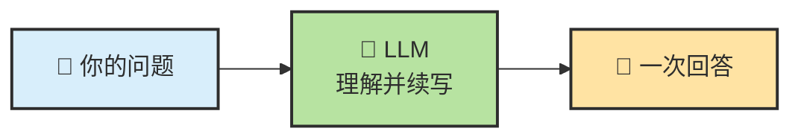
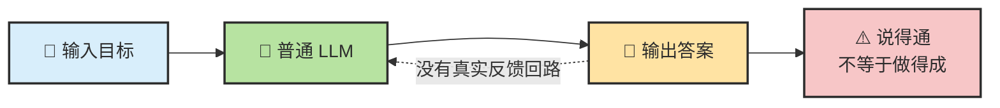
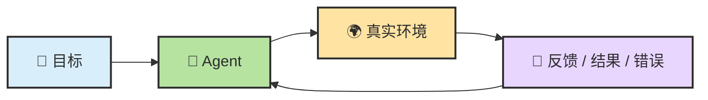
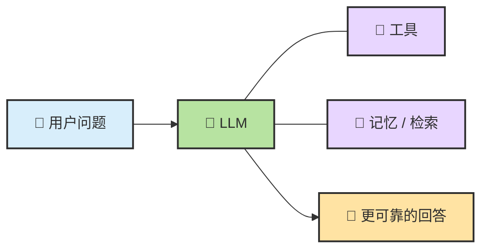
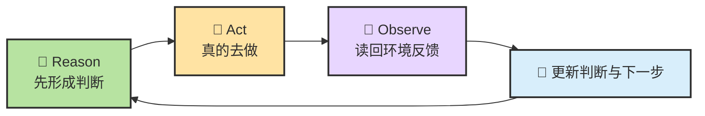
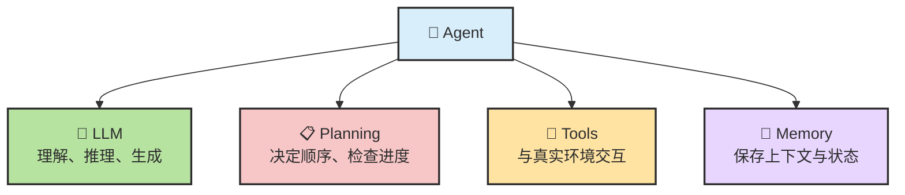
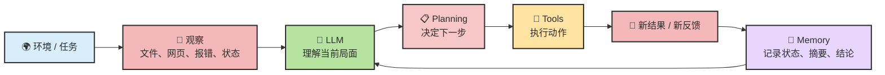
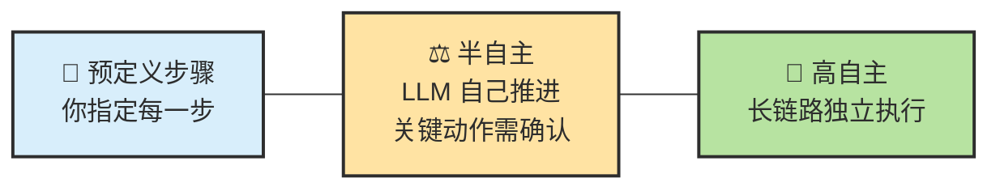
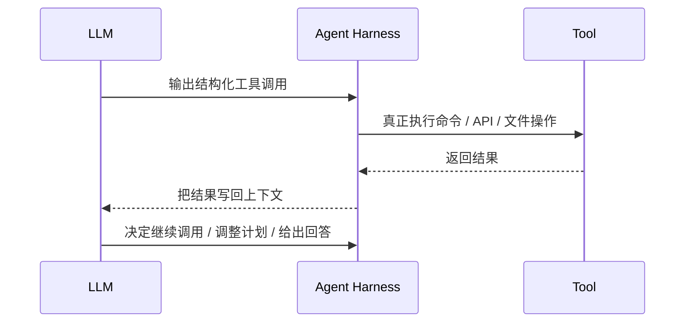
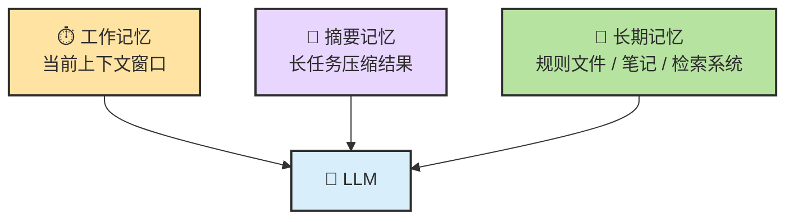

# Chapter 2 · 🧩 Agent 核心原理

> 目标：建立一套清晰的 Agent 心智模型。读完这一章，你应该能回答三个问题：Agent 到底比普通 LLM 多了什么？它为什么能“自己干活”？它又为什么会突然变蠢？

## 目录

- [0. 先校准几个直觉](#0-先校准几个直觉)
- [1. 先看清：LLM 为什么不等于 Agent](#1-先看清llm-为什么不等于-agent)
- [2. Agent = LLM + Planning + Tools + Memory](#2-agent--llm--planning--tools--memory)
- [3. 为什么 Agent 会突然变蠢](#3-为什么-agent-会突然变蠢)
- [本章总结](#本章总结)

---

## 0. 先校准几个直觉

在进入原理之前，先把几个最常见的误解摆出来。很多人不是不会用 Agent，而是一开始就把它想错了。

| # | 常见直觉 | 更接近现实的说法 |
|---|---|---|
| 1 | “Agent 就是更聪明的 ChatGPT” | **不准确。** Agent 不是单纯更强的回答器，而是一个会循环工作、会调用工具、会维护状态的任务执行系统 |
| 2 | “模型越强，Agent 就越好用” | **只说对一半。** Agent 表现 = 模型能力 × 上下文质量 × 任务结构清晰度。后两项往往更影响结果 |
| 3 | “给 Agent 的信息越多越好” | **通常是错的。** 信息太多会把关键约束淹没，精准上下文比堆料更重要 |
| 4 | “Agent 的结果就是一口气生成出来的” | **错。** Agent 通常在内部反复运行 `Think -> Act -> Observe -> Continue` |
| 5 | “工具越多越强” | **也不对。** 工具太多会增加上下文负担和决策噪音，常见结果反而是变慢、变乱、变不稳定 |

先记住一句最重要的话：

> **Agent 不是“会聊天的模型升级版”，而是“围绕模型搭出来的行动系统”。**

---

## 1. 先看清：LLM 为什么不等于 Agent

如果一上来就讲 `Memory / Tools / Planning`，很多读者会有一种“知道这些词，但还是没感觉”的状态。更自然的切入方式，是先看普通 LLM 到底在做什么。

### 1.1 普通 LLM 很像“缸中大脑”

如果要给普通 LLM 找一个最有画面感的比喻，我会选：

> **它像一个被放在培养缸里的大脑。**

这个大脑非常会思考，也非常会语言表达。你问它“如果你是一个程序员，你会怎么修这个 bug”，它可以把步骤讲得头头是道，甚至听起来比很多真人都像那么回事。

但问题在于，它首先是一个**脱离真实环境的大脑**。它擅长的是脑内推演，而不是和外部世界持续交互。

不管界面多像对话框，普通 LLM 的底层本质依然很朴素：它看到输入，然后继续生成最合理的下一个 token，连续很多个 token 后，看起来就像是在“回答问题”。



这类系统当然可以很强。它能解释概念、写文案、生成代码、改写文本，很多时候表现甚至已经相当惊艳。因为在“脑内模拟”这件事上，它真的很擅长。

但这里有一个关键边界：

> **普通 LLM 默认是在“回答”，不是在“执行”。**

### 1.2 为什么它看起来很聪明，却经常在关键时刻掉链子

大众读者第一次接触 Agent，最容易困惑的一点是：既然模型已经这么聪明，为什么还要搞 Agent 这套复杂结构？

因为只靠“输入一次，回答一次”，很多任务根本做不完。


比如你说：

- “帮我总结这个仓库最近 5 次提交的变化”
- “把这个 bug 修掉，并且补上测试”
- “查一下现在的汇率，再帮我比较两个付款方案”

这些任务都不只是“想一想”，还需要：

- 去拿外部信息
- 去操作真实环境
- 记住前面做过什么
- 根据结果决定下一步

而这，已经开始超出普通 LLM 的默认工作方式了。

换句话说，**缸中大脑最大的问题，不是不会想，而是想完以后碰不到世界。**

它可以：

- 想象执行一条命令后“理论上”会发生什么
- 猜测某个 API 大概会返回什么
- 推演一段代码改完后“应该”能过测试

但只要它没有真的去执行、真的去观察、真的去拿回反馈，它就仍然只能停留在“可能对”的状态里。

### 1.3 从控制论看：普通 LLM 更像开环，Agent 更像闭环

如果借控制论的语言来看，这个差别会更清楚。

普通 LLM 更像一个**开环系统**：

- 你给输入
- 它给输出
- 这一轮就结束了

它当然可以把答案说得很漂亮，但它缺少一个最关键的东西：**根据环境反馈持续修正自己的能力**。



而 Agent 更像**闭环系统**：

- 先决定动作
- 再作用到环境
- 再读取反馈
- 再调整下一步

这时候系统不再只是“生成一个看起来合理的答案”，而是在真实反馈中不断**收束解空间**。



你可以把“收束解空间”理解成：

- 没有反馈时，模型只能在很多“也许对”的路径里猜
- 有了反馈后，错误路径会被排除，正确路径会越来越清晰

这也是为什么控制论和反馈系统对理解 Agent 很有帮助。一个系统想在动态环境里稳定地完成目标，不能只会规划，还得能**根据误差和反馈不断修正**。

### 1.4 第一步升级：从 LLM 到 Augmented LLM

所以，现实世界里大家做的第一件事，不是直接造 Agent，而是先给模型外挂能力。

这一步常被叫做 **Augmented LLM**，也就是“增强型 LLM”。



你可以把它理解成：

- 模型负责理解和判断
- 工具负责连到真实世界
- 记忆负责补足“它本来不记得”的信息

这一层已经比纯聊天模型强很多了，但还差最后一步。

### 1.5 ReAct：关键不只是“会想”，而是“边想边试边看”

从“缸中大脑”跨到 Agent，中间有一个非常关键的思想桥梁，就是 **ReAct**。

ReAct 这个名字本身就说明了重点：

- **Reason**：先想一想，现在最合理的动作是什么
- **Act**：真的去做这个动作
- **Observe**：看环境返回了什么结果

然后再进入下一轮。

这件事看上去朴素，但它改变了系统的性质。因为模型不再只是靠脑内推演一路写到结尾，而是会让**推理**和**环境反馈**互相纠正。



这就是 ReAct 真正厉害的地方：

- 推理不再是终点，而是行动前的准备
- 行动不再是盲做，而是为了拿回新信息
- 观察不再是附属步骤，而是下一轮推理的输入

如果用更直白的话说：

> **ReAct 让模型不只是“会讲步骤”，而是开始“用步骤去试探现实”。**

### 1.6 真正的跨越：Agent 不是一次回答，而是一个循环

Agent 最重要的变化，不是“工具更多了”，而是**系统开始对反馈负责**。

到这一步，普通 LLM 和 Agent 的差别就可以压缩成两组对比：

- 普通 LLM 是**给一个答案**
- Agent 是**追一个目标**

- 普通 LLM 停在脑内推演
- Agent 必须在真实反馈里不断修正，直到接近完成条件

所以 Agent 的本质，不是多一轮回答，也不是多几个插件，而是把“推理”改造成了“带反馈的连续行动”。

### 1.7 先有这个画面，后面一切就顺了

如果你把 Agent 想成一个实习生，这个循环就很好理解：

1. 先理解任务
2. 决定先做什么
3. 去实际操作
4. 看操作结果
5. 如果没完成，就继续

Agent 原理并不神秘。神秘感大多来自于很多产品把这条内部循环藏了起来，你只看到它最后给你的结果。

如果把这一小节压缩成一句最值得记住的话，就是：

> **LLM 像缸中大脑，擅长脑内推演；Agent 则像接上了眼睛、手和反馈回路的大脑，能在真实环境里边做边收束。**

而一旦你接受了这个画面，后面的问题也就顺理成章了：

- 它靠什么记住当前状态？
- 它靠什么真的去行动？
- 它靠什么决定先做哪一步？

这也就是下一节要拆开的四个部件。

---

## 2. Agent = LLM + Planning + Tools + Memory

现在我们已经知道：Agent 不是“一次回答”，而是“围绕目标持续推进”的系统。那它到底多了什么？对大多数读者来说，最够用、也最好记的公式就是：

> **Agent = LLM + Planning + Tools + Memory**

这不是唯一的学术定义，但它非常适合入门，因为它既抓住了 Agent 的核心部件，也能解释为什么这些部件组合起来以后，系统会从“会说”变成“会做”。

### 2.1 一个够用的总公式

先把这四个词记成一句白话：

- **LLM**：大脑，负责理解、推理、生成
- **Planning**：规划层，负责决定下一步做什么、何时停
- **Tools**：行动层，负责读文件、跑命令、调 API、接触环境
- **Memory**：状态层，负责保存上下文、摘要、长期规则与阶段结果



但有一个特别容易误解的地方，要在一开始就说清：

> **这四件套不是四个平级的“外挂插件”，而是一个由 LLM 驱动、由 Agent 框架组织起来的闭环。**

也就是说，`Planning / Tools / Memory` 不是离开 LLM 还会自己“智能运转”的三个盒子；它们大多数时候都需要 LLM 提供判断依据，Agent 框架再把这些能力组织成稳定流程。

### 2.2 四部分如何组成一个闭环

如果借用经典 Agent 理论的语言，可以把这个系统理解成：

- 环境不断给出可观察信息
- LLM 负责理解这些信息
- Planning 负责把理解变成下一步
- Tools 负责把下一步施加到环境
- Memory 负责把结果留下来，供下一轮继续使用



这里最关键的不是“部件名称”，而是**回路方向**：

1. 先观察
2. 再理解
3. 再决定下一步
4. 再行动
5. 再把结果写回系统
6. 然后进入下一轮


### 2.3 LLM：大脑，但不是整个 Agent

讲 Agent 时最不能忘的一点是：**LLM 的底层仍然是 next-token prediction。**

也就是说，不管它看起来多像在“思考”，底层机制仍然是：

1. 读取当前上下文
2. 预测下一个最合理的 token
3. 再预测下一个
4. 连续很多次以后，形成一句解释、一段代码、一个计划，或者一次工具调用

所以严格说，LLM 本身并不是一个“会自动完成任务的程序”，而是一个**在上下文里持续续写最合理内容的概率引擎**。

那为什么它看起来又像会推理？

因为在复杂任务里，当前上下文本身就包含了：

- 用户目标
- 系统规则
- 环境约束
- 记忆摘要
- 最新观察
- 可能的中间推理痕迹

在这种上下文里连续生成 token，表现出来就很像：

- 先理解问题
- 再比较几种路径
- 再挑一个最合理的动作

这也是为什么我们既要说：

- **LLM 只是 next-token prediction**

又要同时承认：

- **对 Agent 来说，LLM 确实是大脑**

因为在 Agent 里，它承担的正是“理解当前局面并给出下一步判断”的角色。

但“大脑”这个比喻也有边界。LLM 自己通常不负责：

- 持久存储状态
- 真正执行外部动作
- 权限控制
- 停止条件
- 失败重试与回滚

这些事情需要 `Planning / Tools / Memory`，也需要外层的 **Harness / Agent 框架** 去组织。

### 2.4 Planning：由 LLM 驱动的规划与决策

很多人第一次看到 `Planning`，会以为这是一个独立的“智能模块”。更准确的说法是：

> **大多数产品里的 Planning，都是“固定编排 + LLM 动态规划”的混合体。**

你可以把它拆成两层看：

| 层级 | 谁负责 | 主要作用 |
|---|---|---|
| **外层编排** | Agent 框架 / 产品逻辑 | 提供循环骨架、权限审批、最大尝试次数、停止条件 |
| **内层规划** | LLM | 结合目标、Memory、最新反馈，决定“现在最该做什么” |

所以 `Planning` 并不是“有一个计划模块自己在思考”，而更像是：

- 框架先规定大规则
- LLM 再在这个规则里动态决定下一步

这也是为什么 `Planning` 离不开 `LLM`：

- 没有 LLM，Planning 更像固定 workflow 或状态机
- 有了 LLM，Planning 才开始具备“根据当前局面改主意”的能力

#### ReAct 和 Plan-and-Execute

`Planning` 常见的两种工作方式，可以先粗略分成：

- **ReAct**：边想边做边看，适合动态、不确定、要靠反馈收束的问题
- **Plan-and-Execute**：先给出较完整计划，再逐步执行，适合结构更清晰的问题

现实里的 Coding Agent 通常是混合体：

- 先用 LLM 产出一个粗计划
- 真正执行时再进入 ReAct 式局部修正

#### 自主性不是开关，而是一条光谱

Planning 还直接决定了系统到底有多“自主”。



今天大多数主流 Coding Agent 都落在中间这段：

- LLM 会自己做局部规划
- 但危险操作、权限边界、最终验收仍然有人类在环里

### 2.5 Tools：由 LLM 选择和调用的行动能力

`Tools` 解决的是一个最根本的问题：

> **普通 LLM 会想，但碰不到世界；Tools 让它开始真的接触世界。**

但工具调用本身也不是“工具自己会智能工作”，它通常分成两层：

1. **LLM 决定要不要用工具、用哪个工具、参数是什么**
2. **Agent 框架真的去执行工具，并把结果喂回给 LLM**



所以更准确的说法是：

- **LLM 负责决定**
- **Harness 负责执行**
- **Tools 负责接触环境**

这也解释了为什么 `Tools` 也离不开 `LLM`：

- 没有 LLM，工具只是脚本库
- 有了 LLM，系统才会根据当前局面动态选择合适工具

#### Function Calling、MCP、Skills 的关系

这三个词很容易混淆，但它们其实不在同一层。

| 概念 | 它回答什么问题 | 直白理解 |
|---|---|---|
| **Function Calling** | 模型怎么发出工具调用 | 一种结构化“我要调用这个工具”的表达方式 |
| **MCP** | 工具怎么被统一描述和连接 | 一种标准接口层 |
| **Skills** | Agent 应该按什么方法做事 | 一套方法手册，而不是外部能力接口 |

所以：

- `Function Calling` 是调用形式
- `MCP` 是工具接入标准
- `Skill` 是工作方法与流程约束

它们互补，不是替代关系。

#### 工具层也要做减法

工具不是越多越好。工具越多，通常也意味着：

- 上下文更重
- 决策空间更乱
- 权限面更大
- 失败恢复更复杂

对 Coding Agent 来说，一个很务实的顺序通常是：

1. 能直接用 `CLI / 文件` 就先用
2. 能直接调 `API / SDK` 就先用
3. 需要统一接入、鉴权和共享时，再上 `MCP`
4. 需要稳定方法论时，再补 `Skills`

> **先轻后重，先确定性执行，再上更复杂的协议层。**

### 2.6 Memory：由 LLM 读取和写回的状态系统

Memory 最容易被神化。很多人会把它想成“Agent 真的记住了一切”。更准确的理解是：

> **Memory 不是魔法记忆力，而是状态管理。**

它通常至少有三层：



你可以这样理解：

- **工作记忆**：当前对话、工具结果、系统提示，是 LLM 这一轮直接能看到的内容
- **摘要记忆**：当对话太长时，把旧过程压缩成更短摘要，保住高密度信息
- **长期记忆**：写进文件、知识库、检索系统的内容，跨会话保留

这里最关键的一点是：

> **Memory 只有在被重新读回上下文时，才会对 LLM 产生作用。**

也就是说：

- 一个文件躺在磁盘里，不等于 LLM“已经记住”
- 一个向量数据库里有记录，不等于当前这轮推理“已经用上”

Memory 真正发挥作用，要经过完整链条：

1. 过去的信息被保存下来
2. 当前任务触发检索或回读
3. 相关内容被注入当前上下文
4. LLM 读到以后，才会用它做判断

这也是为什么在工程上有一句很硬的原则：

> **写进文件的才是事实来源；留在会话里的，大多只是临时工作台。**

#### 上下文不是越多越好，而是越准越好

Memory 相关的最常见误区，不是“记不住”，而是“喂太多”。

| 问题 | 常见症状 | 更好的做法 |
|---|---|---|
| 重要信息被淹没 | Agent 忽略关键约束 | 把目标、边界、完成条件放在前面 |
| 规则互相打架 | 一会儿这样，一会儿那样 | 清理过时规则，避免多处重复定义 |
| 噪音过多 | 被旧日志和旧结论带偏 | 只保留当前目标最相关的高密度信息 |

### 2.7 关键澄清：Planning / Tools / Memory 也离不开 LLM

你前面提的问题非常关键：**`Planning / Tools / Memory` 的具体运作，也需要 LLM 作为大脑提供推理依据，对吗？**

答案是：

> **对。只要系统不是纯固定脚本，这三者大多都要靠 LLM 来决定“现在该怎么用”。**

可以把这个关系压缩成一张表：

| 组件 | 没有 LLM 时更像什么 | 有 LLM 时会发生什么 |
|---|---|---|
| **Planning** | 固定 workflow / 状态机 | 根据目标、状态、反馈动态调整下一步 |
| **Tools** | 一组静态脚本或 API | 由 LLM 决定何时调用、调用哪个、如何解释结果 |
| **Memory** | 一堆静态存储 | 由 LLM 决定当前哪些记忆重要、该写回什么、该忽略什么 |

这也是为什么很多工程师现在会把 Agent 更完整地写成：

> **Agent = Model + Harness**

其中：

- **Model** 决定推理与生成上限
- **Harness** 把 `Planning / Tools / Memory / 权限 / 验证 / 停止条件` 组织成可靠系统

如果你想把这个逻辑再压缩到最小，可以看成下面这样：

```python
while not done:
    context = goal + rules + selected_memory + latest_observations
    decision = LLM(context)
    if decision.is_tool_call:
        observation = execute_tool(decision)
        write_back_to_memory(observation)
    else:
        maybe_reply_or_update_plan(decision)
```

这就是四件套真正协作时的样子：**LLM 不是四件套中的一个“普通零件”，而是把其他三件套真正激活起来的大脑。**

> 📖 如果你想看这套闭环在工程实现里是怎样变成 payload、while 循环、工具执行与回写的，可继续读 [Agent 与 LLM 的交互内幕](../topics/topic-agent-llm-internals.md)

---

## 3. 为什么 Agent 会突然变蠢

本章开头说过，这一章要回答第三个问题：**它为什么会突然变蠢？**

大多数时候，问题不在于“模型突然智商下降”，而在于整个系统的状态变脏了。

### 3.1 最常见的五个原因

| 原因 | 典型表现 | 本质问题 |
|---|---|---|
| **上下文污染** | 老日志、老任务、老指令越堆越多 | 工作记忆密度下降 |
| **记忆污染** | `CLAUDE.md`、`AGENTS.md` 里有过时规则 | 长期状态失真 |
| **工具过载** | 工具很多，但经常选错、切换慢 | 决策空间太大 |
| **目标不清** | 一直忙，但越做越偏 | 完成条件没有锚点 |
| **验证不足** | 看起来很像做完了，实际一跑就错 | 没有外部反馈拉回系统 |

这些问题里，只有一部分是模型能力问题。更多时候是：

- 给了太多无关上下文
- 没定义清楚完成标准
- 没有验证回路
- 没把长期知识沉淀到文件

### 3.2 Prompt、Context、Harness 是三层不同问题

很多人还停留在“怎么写 Prompt”这个层面，但在 Agent 时代，这已经不够了。

| 维度 | Prompt Engineering | Context Engineering | Harness Engineering |
|---|---|---|---|
| 关注点 | 这一轮怎么说清楚 | 整个工作环境给了 Agent 什么信息 | 如何把权限、流程、验证、回退组织成闭环 |
| 人类角色 | 写提示的人 | 设计上下文的人 | 设计运行系统的人 |
| 模型角色 | 按指令回答 | 在信息环境中工作 | 在带护栏的系统中持续执行 |
| 本质 | 优化一句话 | 优化信息环境 | 优化行动系统 |

从实战价值看，重要性通常是：

> **Prompt 很重要，但 Context 更重要；当 Agent 足够会行动时，Harness 往往更重要。**

这也是为什么同一个模型，放到不同产品里，表现会差很多。原因常常不在模型本身，而在：

- 工具是否顺手
- 权限是否合适
- 上下文是否干净
- 是否有验证、反思、停止和回滚机制

### 3.3 一组最实用的应对原则

如果你只想记最实用的几条，用这组就够了：

1. **目标要有验收条件。** 不要只说“帮我做完”，要说清测试、截图、输出文件或完成标准。
2. **上下文要高密度。** 不是“尽量多给”，而是“只给完成当前目标最相关的高密度信息”。
3. **长期知识写进文件。** 稳定规则进 `CLAUDE.md / AGENTS.md`，临时偏好留在当前任务里。
4. **工具要做减法。** 少而稳的工具集，通常比大而全更可靠。
5. **一旦漂移，就重开会话。** 长对话不是荣誉勋章，干净上下文往往更值钱。

> 📖 想继续深挖 Memory、上下文工程和长期记忆，可跳转到 [Memory 与上下文工程详解](../topics/topic-memory-system.md)

---

## 本章总结

如果只记住几句话，这一章最值得带走的是这些。

| 核心概念 | 一句话总结 |
|---|---|
| **Agent** | 不是更聪明的聊天机器人，而是围绕目标持续循环的任务系统 |
| **LLM** | 本质仍是 next-token prediction，但在 Agent 里承担“理解当前局面并做判断”的大脑角色 |
| **Planning** | 不是独立智能体，而是“固定编排 + LLM 动态规划”的混合层 |
| **Tools** | 不是自己会智能工作，而是由 LLM 决定使用、由框架代为执行的行动能力 |
| **Memory** | 不是魔法记忆，而是工作记忆、摘要记忆、长期状态的组合系统 |
| **Harness** | 决定权限、验证、回退、停止条件，是把四件套组织成可靠系统的关键 |

### 三条最值得带走的判断

1. **Agent = LLM + Planning + Tools + Memory**，但后三者在运行时大多也需要 LLM 作为大脑提供推理依据。
2. **Agent 的表现 = 模型能力 × 上下文质量 × 任务结构清晰度。** 后两者往往比你想的更重要。
3. **不要只问“哪个模型最强”，也要问“这个产品把模型组织得好不好”。**

### 如果你还想继续往下学

- 想看这四件套在运行时怎么真正转起来： [Ch05 Agent 内部机制与工具体系](./ch05-agent-mechanics.md)
- 想看更细的底层交互机制和伪代码： [Agent 与 LLM 的交互内幕](../topics/topic-agent-llm-internals.md)
- 想继续深挖 Memory： [Memory 与上下文工程详解](../topics/topic-memory-system.md)
- 想理解 MCP 与 Skills： [MCP 与 Skills 详解](../topics/topic-mcp.md)
- 想看 Agent 发展脉络： [技术演进六阶段详解](../topics/topic-agent-evolution.md)

---

<div align="center">

[📚 返回目录](../../README.md#tutorial-contents) | [⬅️ 上一章：Ch01 快速上手](./ch01-quickstart.md) | [➡️ 下一章：Ch03 术语速查手册](./ch03-glossary.md)

</div>
