# Chapter 2 · 🧩 Agent 核心原理

> 目标：建立一套更完整、也更工程化的 Agent 心智模型。读完这一章，你应该能同时回答这些问题：Agent 和普通 LLM 到底差在哪？它为什么能“自己干活”？`LLM / Planning / Tools / Memory / Harness` 各自负责什么？这套闭环在运行时怎么转？为什么很多系统会继续走向 `Multi-Agent`？它为什么会在长任务里变蠢？作为使用者你该怎么应对？

## 目录

- [🧭 0. 先校准几个直觉](#ch2-sec-0)
- [🧠 1. 从 LLM 到闭环 Agent](#ch2-sec-1)
- [🧩 2. 一张总图：从四件套到三层坐标](#ch2-sec-2)
- [🧠 3. LLM：大脑，但不是整个系统](#ch2-sec-3)
- [🧭 4. Planning：把目标变成可执行闭环](#ch2-sec-4)
- [🛠️ 5. Tools：让 Agent 接触真实世界](#ch2-sec-5)
- [💾 6. Memory 与 Context Engineering：状态不是靠聊天硬记](#ch2-sec-6)
- [🧰 7. Harness / Control Plane：真正的杠杆在模型外侧](#ch2-sec-7)
- [👥 8. Multi-Agent：为什么单 Agent 不总够用](#ch2-sec-8)
- [⚠️ 9. 失效模式与恢复动作](#ch2-sec-9)
- [📝 本章总结](#ch2-sec-summary)

> 📖 **阅读方式建议**：如果你对 `LLM / Context / Token / MCP / Skill / Harness` 这些词还不熟，可以把 [术语速查手册](./ch03-glossary.md) 另开一页，边读边查；本章主线已经尽量自洽，不要求你先把术语全背下来。
>
> 🧠 **想深入理解原理**：本章先讲主线；如果你想把底层机制继续挖深，可以配合这三篇专题一起读：
> - [🧠 LLM 推理与 Agent](../topics/topic-llm-reasoning-and-agent.md)
> - [🧩 上下文工程](../topics/topic-context-engineering.md)
> - [💾 Agent 记忆系统](../topics/topic-memory-system.md)

---

<a id="ch2-sec-0"></a>
## 0. 先校准几个直觉

在进入原理之前，先把几件最容易想错的事摆正。很多人不是不会用 Agent，而是一开始就把它想成了错误的东西。

| #️⃣ | 🪤 常见直觉 | ✅ 更接近现实的说法 |
| --- | --- | --- |
| 1 | “Agent 就是更聪明的 ChatGPT” | **不准确。** Agent 不是单纯更强的回答器，而是会循环工作、会调用工具、会维护状态、会被验证和约束的任务执行系统 |
| 2 | “模型越强，Agent 就越好用” | **只说对一半。** Agent 效果更接近 `Model × Context × Task Structure × Verification` |
| 3 | “给 Agent 的信息越多越好” | **通常是错的。** 关键信息被噪音淹没，比“信息不够”更常见 |
| 4 | “Agent 的结果就是一口气生成出来的” | **错。** 多数 Agent 内部都在反复跑 `Observe -> Plan -> Act -> Verify -> Continue` |
| 5 | “工具越多越强” | **也不对。** 工具太多会增加上下文负担、选择噪音和风险面 |

先记住这一句，后面很多内容就不会学歪：

> 🎯 **Agent 的关键不是“一次回答更聪明”，而是“能在多轮行动里不断接触世界、检查结果、修正路径”。**

---

<a id="ch2-sec-1"></a>
## 1. 从 LLM 到闭环 Agent

### 1.1 普通 LLM 很像“缸中大脑”

如果要给普通 LLM 找一个最有画面感的比喻，我还是会保留原来的说法：

> 🧠 **它像一个被放在培养缸里的大脑。**

这个大脑非常会思考，也非常会语言表达。你问它“如果你是程序员，你会怎么修这个 bug”，它可以把步骤讲得头头是道，甚至听起来比很多真人都更像那么回事。

但问题在于，它首先是一个**脱离真实环境的大脑**。它擅长的是脑内推演，而不是和外部世界持续交互。


所以，严格说普通 LLM 更像一个**开环系统**：

- 你给输入
- 它给输出
- 这一轮就结束了

它当然可以很强，但它默认是在“回答”，不是在“执行”。

### 1.2 为什么它看起来很聪明，却经常在关键时刻掉链子

大众读者最容易困惑的一点是：既然模型已经这么聪明，为什么还要搞 Agent 这套复杂结构？

因为只靠“输入一次，回答一次”，很多任务根本做不完。

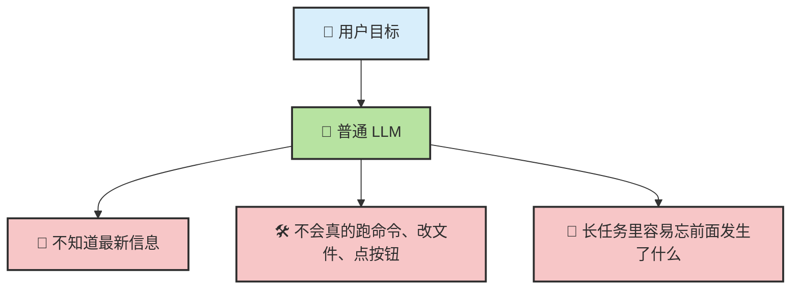

比如你说：

- “帮我总结这个仓库最近 5 次提交的变化”
- “把这个 bug 修掉，并且补上测试”
- “查一下现在的汇率，再帮我比较两个付款方案”

这些任务都不只是“想一想”，还需要：

- 去拿外部信息
- 去操作真实环境
- 记住前面做过什么
- 根据结果决定下一步

这里最容易误导新手的两个现象是：

| 现象 | 它真正说明什么 |
| --- | --- |
| 🧵 长对话里“说记住了”，后面却答不出来 | 它没有稳定持久记忆系统，只能依赖当前上下文窗口 |
| ➗ 简单计算或简单推理也可能答错，而且答得很自信 | 语言流畅不等于每一步中间推理都可靠 |

这两个现象后面还会再出现，但它们本质上分别属于：

- `Memory / Context` 问题
- `Verification` 问题

### 1.3 从开环到闭环：Agent 的关键跨越

如果借控制论的语言来看，这个差别会更清楚。


Agent 真正的跨越，不是“会说更多”，而是：

- 先决定动作
- 再作用到环境
- 再读取反馈
- 再调整下一步

这也是 `ReAct` 真正重要的地方。它的关键不只是“让模型多想几步”，而是把三件事接起来了：

- `Reason`：先根据目标和现状推下一步
- `Act`：真的去做这个动作
- `Observe`：把环境反馈重新送回系统

所以如果把这一节压成一句话，就是：

> 🔁 **普通 LLM 停在“给答案”，Agent 进入了“边想边试边看”的闭环。**

### 1.4 从 LLM 到 Augmented LLM，再到 Agent

现实世界里，大家做的第一件事通常不是直接造复杂 Agent，而是先给模型外挂能力。

这一步常被叫做 **Augmented LLM**，也就是“增强型 LLM”。

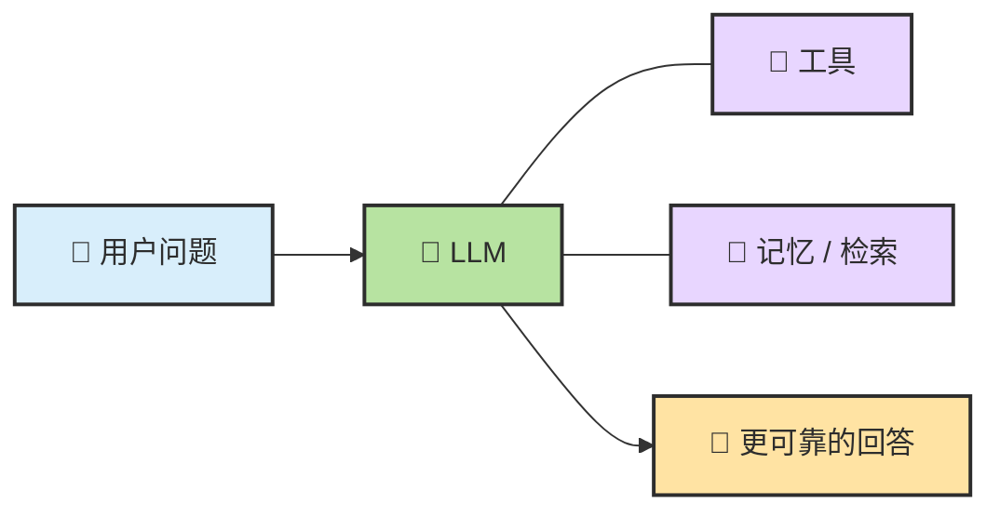

你可以把三者粗略区分成这样：

| 形态 | 核心特征 | 常见短板 |
| --- | --- | --- |
| 裸 LLM | 单次生成 | 看不到执行结果，缺少状态和验证 |
| Augmented LLM | 有工具和上下文增强 | 能力增强了，但未必有稳定控制面 |
| Agent | 有目标推进闭环 | 复杂度上升，需要更强的 Harness |

📌 **补充：经典 Agent 框架放到今天怎么理解？**

传统 Agent 常被拆成四件事：

- `Environment`：系统所处的外部世界
- `Sensors`：负责观察环境
- `Policy / Decision`：负责把观察变成下一步
- `Actuators`：负责对环境施加动作

放到今天的 Coding Agent 里，对应关系可以直白地记成：

| 经典说法 | 今天更像什么 |
| --- | --- |
| `Environment` | 文件、网页、终端、数据库、API、运行状态 |
| `Sensors` | 用户输入、搜索结果、文件内容、命令输出 |
| `Actuators` | Shell、文件写入、HTTP 调用、浏览器动作 |
| `Policy / Decision` | `LLM + Planning + Harness` |

这层映射的价值，不是为了堆术语，而是帮你看清：

> 🧭 **Agent 从来不是“只会说话的脑子”，而是“能观察、能决定、能行动、能拿回反馈”的系统。**

---

<a id="ch2-sec-2"></a>
## 2. 一张总图：从四件套到三层坐标

### 2.1 一个够用的总公式

对大多数读者来说，最够用、也最好记的公式就是：

> 🧩 **Agent = LLM + Planning + Tools + Memory**

先把这四个词记成一句白话：

- `LLM`：大脑，负责理解、推理、生成
- `Planning`：控制层，负责决定下一步做什么、何时停、何时重试
- `Tools`：行动层，负责读文件、跑命令、调 API、接触环境
- `Memory`：状态层，负责保存上下文、摘要、规则和阶段结果

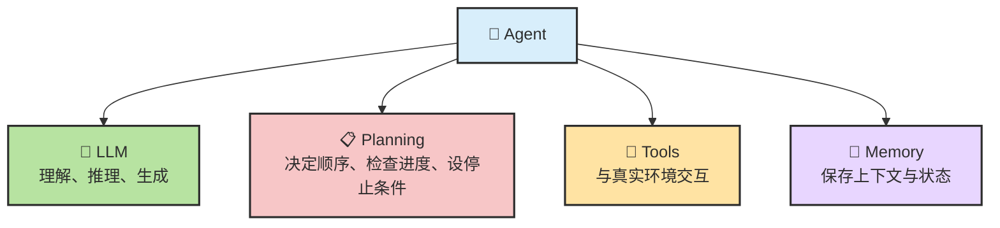

### 2.2 这四件套如何形成一个闭环

这四件套不是四个平级的“外挂插件”，而是一条由 LLM 驱动、由外层系统组织起来的闭环。

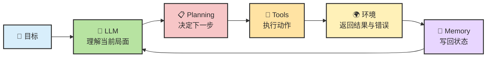

### 2.3 再压一层：Agent = Model + Harness

工程师常常还会把它再压缩成另一种写法：

> 🧰 **Agent = Model + Harness**

这里的意思不是把 `Planning / Tools / Memory` 否认掉，而是强调：

- `Model` 决定理解、推理、生成的上限
- `Harness` 把规划、工具、记忆、权限、验证、停止条件组织成一个可靠系统

```mermaid
flowchart LR
    classDef shell fill:#d8eefb,stroke:#2d2d2d,stroke-width:2px,color:#2d2d2d
    classDef model fill:#b7e3a1,stroke:#2d2d2d,stroke-width:2px,color:#2d2d2d
    classDef ctrl fill:#ffe3a3,stroke:#2d2d2d,stroke-width:2px,color:#2d2d2d
    classDef mem fill:#e8d6ff,stroke:#2d2d2d,stroke-width:2px,color:#2d2d2d

    subgraph H["🧰 Harness / Control Plane"]:::shell
        C["🧱 Context Assembly"]:::ctrl
        P["📋 Planning Gates"]:::ctrl
        T["🔧 Tool Orchestration"]:::ctrl
        V["✅ Verify / Recover"]:::ctrl
        R["💾 Rules / Memory"]:::mem
    end
    C --> M["🧠 Model"]:::model
    M --> T
    T --> V
    V --> C
    R --> C
```

### 2.4 Agent 效果为什么不只看模型

在真实工程里，更接近事实的判断是：

> 📈 **Agent 效果 = Model × Context × Task Structure × Verification**

| 变量 | 它在问什么 | 常见杠杆 |
| --- | --- | --- |
| `Model` | 模型本身会不会理解、归纳、生成 | 选型、推理能力、长度能力 |
| `Context` | 模型这一轮到底看到了什么 | 文件选择、摘要、检索、规则前置 |
| `Task Structure` | 任务有没有被拆成可执行闭环 | Spec、Plan、子任务、停止条件 |
| `Verification` | 系统能不能用证据纠错 | 测试、编译、检查、review、eval |

这条判断会直接改变你排查问题的顺序：

- 没有证据链，先别急着换模型
- 目标没澄清，先别急着优化 Prompt
- 上下文包混乱，先别怪模型“记性差”
- 任务结构太大太糊，先别让系统直接开写

### 2.5 Prompt、Context、Harness 不是一回事

很多工程问题之所以越修越乱，是因为这三层没有拆开。

| 层 | 它是什么 | 它改什么 | 常见误判 |
| --- | --- | --- | --- |
| `Prompt` | 这一轮你想让模型怎么做 | 输出风格、局部步骤、当前任务约束 | 把所有问题都归因到 Prompt |
| `Context` | 这一轮实际送进模型的全部信息 | 证据质量、信息密度、相关性 | 以为“消息越多越好” |
| `Harness` | 系统如何组织多轮动作、验证和恢复 | 整体稳定性、自治边界、失败恢复 | 以为工具一加就自动变成 Agent |

一个简单例子：

- “请先读测试再改代码”是 `Prompt`
- 真的把相关测试文件、错误日志、目标文件放进上下文包里，这是 `Context`
- 如果测试失败后系统会自动重读错误信息、更新计划、限制危险写操作，这是 `Harness`

📌 这也是为什么后面你会经常看到一句判断：

> 🧭 **很多所谓“Prompt 问题”，其实是 Context 问题，甚至是 Harness 问题。**

---

<a id="ch2-sec-3"></a>
## 3. LLM：大脑，但不是整个系统

### 3.1 底层机制仍是 next-token prediction

讲 Agent 时最不能忘的一点是：**LLM 的底层仍然是 next-token prediction。**

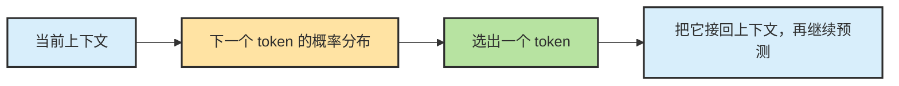

所以严格说，LLM 本身不是一个“会自动完成任务的程序”，而是一个**在上下文里持续续写最合理内容的概率引擎**。

### 3.2 为什么 next-token prediction 仍然会表现出“推理感”

很多人一听“next-token prediction”，就会误以为这意味着模型只会胡乱接龙。现实不是这样。

在复杂任务里，当前上下文本身往往已经包含了：

- 用户目标
- 系统规则
- 工具定义
- 记忆摘要
- 最新观察结果
- 中间结论和失败反馈

在这种高约束上下文里连续生成 token，表现出来就很像在：

- 先理解问题
- 再比较几种路径
- 再挑一个最合理的动作
- 再根据新反馈修正主意

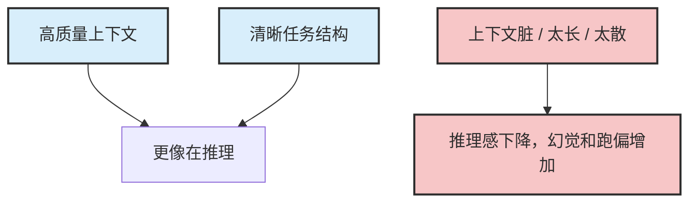

### 3.3 在 Agent 里，LLM 其实是一脑多用

同一个模型，在 Agent 里通常会不断切换角色。

| ⏱️ 运行时阶段 | 🎭 它更像什么 |
| --- | --- |
| 刚接收任务 | 目标理解者 |
| 决定下一步 | 任务规划器 |
| 选择工具时 | 工具调用决策器 |
| 读回结果后 | 结果解释器 |
| 长任务中途 | 摘要者 |
| 即将结束时 | 自我审查者 |

这也是为什么同一个模型在不同产品里表现会差很多。模型可能没变，但**外层给它的上下文组织方式、工具选择空间、验证闭环**全变了。

### 3.4 “大脑”这个比喻的边界

说 LLM 是大脑很有帮助，但也很容易过度拟人化。

LLM 自己通常**不负责**这些事：

| 🧩 事情 | 🚧 为什么通常不由 LLM 单独完成 |
| --- | --- |
| 持久存储状态 | 文件怎么存、什么能跨会话保留，取决于外层系统 |
| 真正执行外部动作 | 命令、文件写入、API 调用都需要工具层和权限层 |
| 权限控制 | 哪些动作需要你确认，不是模型自己说了算 |
| 停止条件 | 什么时候算完成，通常也要靠 Harness 和任务约束 |
| 失败重试与回滚 | 真正稳健的恢复策略需要外层工作流设计 |

所以最准确的说法是：

> 🧠 **LLM 是 Agent 的判断核心，但不是 Agent 的全部实现。**

---

<a id="ch2-sec-4"></a>
## 4. Planning：把目标变成可执行闭环

### 4.1 Planning 到底在规划什么

Planning 不是“先想一想”这么简单。它至少在管五件事：

1. 🎯 目标澄清：到底要完成什么，什么不在范围内
2. 🪓 任务拆解：该分成哪些步骤，哪些可以并行，哪些必须串行
3. 🧭 顺序安排：先探索什么，再执行什么，卡住了回到哪里
4. 🛑 停止条件：做到什么程度算完成，什么情况下必须停下
5. ✅ 验证路径：每一步完成以后，拿什么证据判断它是对的

没有这些东西，系统就很容易从“会生成”滑向“会乱写”。

### 4.2 一条统一母流程：Explore -> Spec -> Plan -> Act -> Verify -> Reflect

把后续章节里分散的工作流统一起来，可以压成这一条：

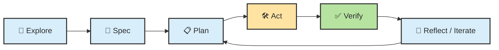

| 阶段 | 核心问题 | 产物 |
| --- | --- | --- |
| `Explore` | 先看清现状，不急着动手 | 仓库理解、问题边界、证据 |
| `Spec` | 先定义要做成什么 | 目标、约束、验收标准 |
| `Plan` | 决定怎么推进 | 步骤、顺序、风险点 |
| `Act` | 真的执行动作 | 改代码、跑命令、写文档 |
| `Verify` | 用证据检查 | 测试、编译、diff、对照 |
| `Reflect / Iterate` | 是否改计划、继续、停下 | 新计划、回退、升级处理 |

### 4.3 Spec、Plan、Task Breakdown、Stop Condition 各自管什么

这几个词经常混用，但它们其实不是一回事。

| 对象 | 它回答什么问题 | 常见形式 |
| --- | --- | --- |
| `Spec` | 这件事到底要做成什么 | 需求、约束、验收标准 |
| `Plan` | 我准备按什么顺序推进 | 步骤列表、里程碑、验证点 |
| `Task Breakdown` | 这件事能拆成哪些更小块 | 子任务、依赖关系、责任边界 |
| `Stop Condition` | 什么时候算完成或该停 | 测试通过、风险触发、人类确认 |

一个常见错误是：

- 还没搞清楚 `Spec`，就直接开始写 `Plan`
- `Plan` 里全是动作，没有停止条件和验证点

这种计划看起来很忙，实际上非常脆。

### 4.4 一份好计划，至少包含四件事

对于大多数工程任务，一份够用的计划至少要有这四件事：

| 要素 | 说明 |
| --- | --- |
| `Scope` | 明确本次只做什么，不做什么 |
| `Order` | 先后顺序和关键依赖 |
| `Verification` | 每一步之后如何确认没跑偏 |
| `Risk` | 哪些地方最容易炸，触发后怎么处理 |

这也是为什么“先 Plan 再 Act”并不是形式主义。它真正避免的是三种浪费：

- 在错误问题上做大量正确工作
- 在缺少证据的情况下扩大战果
- 明明已经跑偏，却因为没有停止条件而继续堆修改

### 4.5 计划不是合同，而是可回写草图

Planning 不是为了把未来一次性写死，而是为了给系统一个随时可改写的轨道。

正确的心态应该是：

- 计划先给出第一条可执行路径
- 一旦探索结果、工具输出、验证结果变了，就允许回写计划
- 计划的价值在于让偏航被看见，而不是让偏航被禁止

### 4.6 推理、ReAct、Plan-and-Execute 与 Reflecting 各在解决什么

为了尽量不丢旧版知识点，但也不把这一节写成“推理方法大全”，这里把几条高频路径压成一张表。

| 概念 | 它主要解决什么 | 在这一章里需要记住什么 |
| --- | --- | --- |
| `Reasoning / CoT` | 让模型更像会分步思考 | 推理先回答“怎么想得更稳” |
| `ReAct` | 把思考和行动、观察接成同一个循环 | ReAct 先回答“怎么边想边试边看” |
| `Plan-and-Execute` | 先做较完整计划，再逐步执行 | 更适合结构更清晰的任务 |
| `Reflecting` | 把“上一步哪里错了”沉淀下来 | 反思层让系统更会从失败里收敛 |

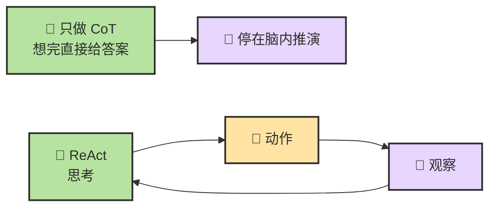

📌 这里保留一个很重要的判断：

> 🧭 **Planning 不是“先列个计划”那么简单，它其实是从推理、拆解、行动、反思到验证的一整条控制链。**

---

<a id="ch2-sec-5"></a>
## 5. Tools：让 Agent 接触真实世界

### 5.1 工具补上的不是“知识”，而是“行动与证据”

`Tools` 回答的是一个最根本的问题：

> 🛠️ **普通 LLM 会想，但碰不到世界；Tools 让它开始真的接触世界。**

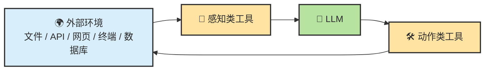

所以从工程视角看，工具至少补了两种能力：

| 工具类型 | 它在补什么 |
| --- | --- |
| `Read` 型工具 | 给系统补证据 |
| `Act` 型工具 | 让系统对外部世界施加动作 |

### 5.2 Function Calling：模型如何表达“我要用这个工具”

Function Calling 解决的不是“工具怎么实现”，而是：

> 📦 **模型怎么把自己的工具意图，稳定地表达给 Harness。**

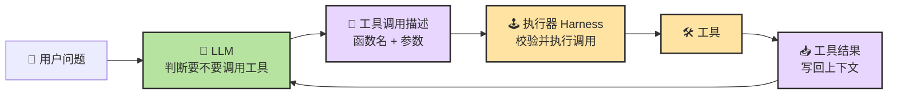

所以更准确的分工是：

- `LLM` 负责决定
- `Function Calling` 负责表达
- `Harness` 负责执行
- `Tool` 负责接触环境

### 5.3 稳定 Tool Use 的四个来源：schema、strict、validation、retry

很多人知道怎么让模型“发起一次工具调用”，却不知道为什么有些调用很稳，有些非常飘。

从工程上看，稳定 Tool Use 至少依赖四件事：

| 来源 | 它在解决什么 |
| --- | --- |
| `Schema` | 参数结构是否清晰，字段边界是否明确 |
| `Strict` | 模型是否必须按结构输出，而不是自由发挥 |
| `Validation` | 调用前后是否有类型、范围、状态检查 |
| `Retry` | 失败后是否有可控的重试或回退策略 |

📌 这件事的重要性在于：

> 🧪 **很多工具稳定性问题，根本不是采样参数问题，而是接口设计和执行护栏问题。**

### 5.4 工具链怎么分层：固定工具链、自主选工具、MCP、Skill、Hook、Plugin

先看两种常见系统设计：

| 方式 | 优点 | 风险 | 更适合什么 |
| --- | --- | --- | --- |
| **固定工具链** | 稳定、可预测、易审计 | 遇到例外情况僵硬 | 流程高度固定的任务 |
| **自主选工具** | 灵活、泛化能力强 | 更容易选错、绕路或过度调用 | 开放式、探索式任务 |

在这层之上，再把工具生态按层级记成一张总表：

| 层 | 代表概念 | 它主要解决什么 |
| --- | --- | --- |
| `调用层` | `Function Calling` | 模型如何表达工具调用意图 |
| `连接层` | `MCP` | 工具和资源如何被标准化接入 |
| `方法层` | `Skill` | 某类任务该按什么流程做更稳 |
| `自动化层` | `Hook` | 哪些动作应在特定时机自动触发 |
| `打包层` | `Plugin` | 如何把多种能力作为一个可安装单元分发 |

对 Coding Agent 来说，最常见的运行时工具也大多能压成五类：

| 🧰 类别 | 🎯 主要用途 |
| --- | --- |
| 读取类 | 理解项目和现状 |
| 写入类 | 修改文件或创建内容 |
| 执行类 | 跟开发环境互动 |
| 外部类 | 获取外部世界信息 |
| 编排类 | 把子任务交给其他 Agent 或工作单元 |

### 5.5 能力边界不等于权限边界

这是 Tools 章节里必须尽早讲清的一条。

- `能力边界` 是系统会不会做
- `权限边界` 是系统被不被允许做

一个系统可能知道如何删除文件，但并不被授权删除。也可能拥有写权限，但没有足够上下文去安全地修改。

所以工程控制面必须同时管理：

- 工具是否存在
- 调用是否允许
- 允许到什么范围
- 失败后如何停下

### 5.6 为什么很多场景默认先用 CLI + 文件系统

对 Coding Agent 来说，默认优先 `CLI + 文件系统`，通常是很合理的起点。

原因很简单：

- 📁 本地文件和命令通常最直接、最可验证
- 🧠 上下文成本低，不需要先搭复杂协议层
- 🧪 真实工程证据大多就躺在仓库、测试、日志和终端里

所以更务实的顺序通常是：

1. 先用最直接、最低上下文成本的本地能力
2. 当仓库太大、资源太分散、系统太多源时，再上检索和标准化连接层
3. 当工作流重复出现时，再把方法和自动化固化成 `Skill`、`Hook` 或更高层封装

---

<a id="ch2-sec-6"></a>
## 6. Memory 与 Context Engineering：状态不是靠聊天硬记

### 6.1 Memory 不是“记忆力”，而是“状态管理”

Memory 最容易被神化。很多人会把它想成“Agent 真的记住了一切”。更准确的理解是：

> 💾 **Memory 不是魔法记忆力，而是状态管理。**

它通常至少有三层：

- `工作台`：当前对话、最近观察、当前这一步需要的局部上下文
- `摘要层`：阶段总结、checkpoint、压缩后的已完成状态
- `稳定外置`：规则文件、Spec、清单、事实记录、文档和检索系统

📌 为了尽量不丢旧版知识点，这里把常见 Memory 视角也一并压成一张表：

| 类型 | 更像什么 | 例子 |
| --- | --- | --- |
| `Working` | 当前工作台 | 这轮对话、最新 diff、最近命令输出 |
| `Episodic` | 过去发生过的事 | “上次这个服务是因为端口占用挂的” |
| `Semantic` | 事实和规则 | API 文档、项目规范、团队约定 |
| `Procedural` | 做事方法 | TDD 流程、代码审查清单、调试 SOP |

### 6.2 三层状态：工作台、摘要、稳定外置

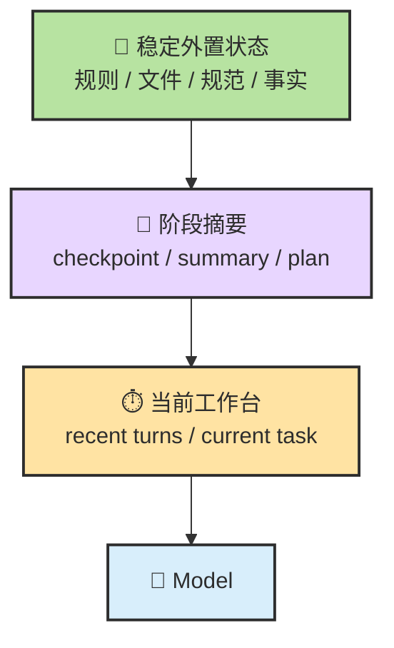

这三层各自的作用不同：

| 层 | 它放什么 | 它为什么重要 |
| --- | --- | --- |
| `当前工作台` | 当前步骤、最近观察、局部上下文 | 让模型完成眼前动作 |
| `阶段摘要` | 到目前为止的关键状态压缩 | 防止每轮都从零回忆 |
| `稳定外置状态` | 规则、Spec、清单、文件、事实记录 | 防止重要状态只存在聊天里 |

### 6.3 Context Engineering：当前这一轮到底让模型看到什么

`Context` 不是“当前用户这句话”，而是这一轮真正送进模型的全部信息。

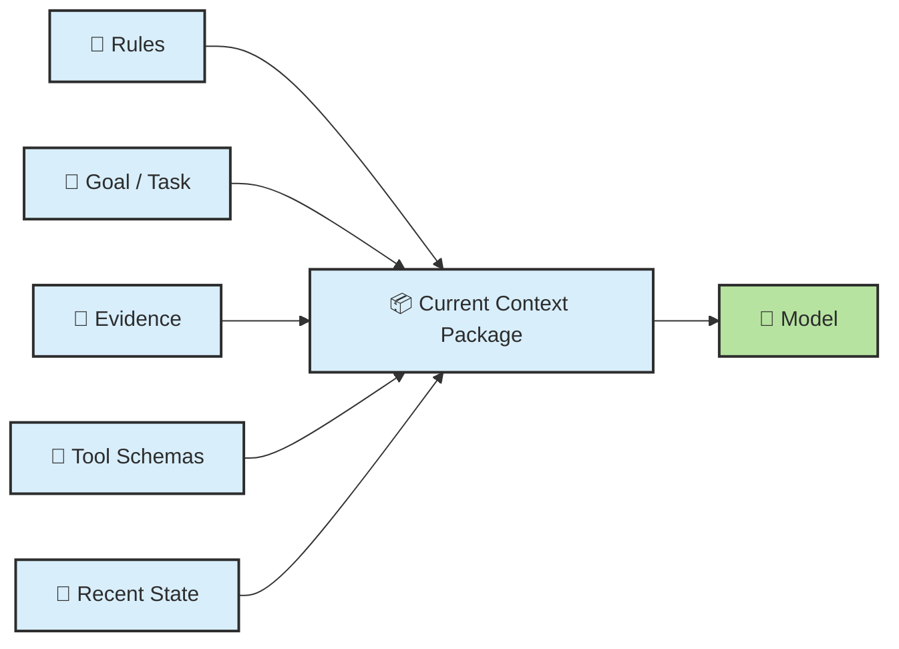

所以上下文工程的核心问题不是“怎样把更多东西塞进去”，而是：

- 哪些信息必须前置
- 哪些信息应该按需加载
- 哪些历史应该压缩成摘要
- 哪些状态应该根本不放聊天，而是外置成文件

### 6.4 Progressive Disclosure：只在需要时加载细节

长文档、大全量代码仓、多工具环境里，一个最关键的原则就是 `Progressive Disclosure`。

简单说，就是别一上来把所有细节全塞给模型，而是按层次加载：

| 层级 | 作用 |
| --- | --- |
| `Index` | 先知道有哪些材料 |
| `Summary` | 先看浓缩判断和定位信息 |
| `Detail` | 只在需要时再读原文或局部细节 |

这也是为什么“把整份长文档一次性塞进去”往往比“先看索引和摘要，再按需深入”更容易出问题。

### 6.5 文件比聊天更像稳定记忆

工程任务里，很多关键状态都应该优先外置到文件。

适合外置的内容通常包括：

- 📏 规则与约束
- 📝 Spec 和验收标准
- 📋 计划与阶段状态
- 🧭 决策记录
- ♻️ 可复用的操作清单

像 `CLAUDE.md`、`AGENTS.md`、项目规则文件，本质上就属于“可稳定重读的控制面记忆”。

### 6.6 为什么长任务会越来越糊：KV Cache 不是 Memory，长会话也不天然更好

这里要专门纠偏一次：

- `KV Cache` 更像推理时的运行缓存，不等于长期记忆
- 聊天历史更像临时工作台，不等于稳定状态库
- 很长的会话很可能比一个干净的新上下文更差


当出现这些信号时，通常应该考虑压缩、外置、甚至新开上下文：

- 系统开始反复遗忘已经确认过的边界
- 系统在旧假设上继续堆动作
- 你已经很难说清当前阶段到底完成到哪里
- 同样的错误在多轮里反复出现

### 6.7 压缩与回放：怎样尽量不忘

不是所有压缩都一样安全。

| 压缩方式 | 直白理解 | 风险 |
| --- | --- | --- |
| `可逆压缩` | 用文件路径、链接、引用位置代替大段正文 | 低，完整内容随时能取回 |
| `不可逆摘要` | 用 LLM 生成更短摘要代替原过程 | 高，信息一旦丢失就回不来了 |

工程上一个很实用的原则是：

> ♻️ **能可逆压缩，就先不要不可逆摘要。**

另外，长任务里还有一个非常实用的抗漂移技巧：

- 把当前阶段目标和待办写成简短 `todo`
- 每完成一个子任务，就更新这份清单
- 让下一轮决策总是基于最新清单来推进

---

<a id="ch2-sec-7"></a>
## 7. Harness / Control Plane：真正的杠杆在模型外侧

### 7.1 Harness 到底在管什么

如果说模型决定“会不会想”，那么 Harness 决定“这个系统到底怎么工作”。

它至少在管理这些事情：

- 📏 指令与规则如何进入系统
- 📦 上下文如何被组装
- 📋 计划在哪些地方必须显式化
- 🔧 工具如何被调用、限制和回写
- ✅ 结果怎么验证
- 🔁 失败后怎么恢复、重试、停下或升级
- 🙋 哪些动作必须人类批准

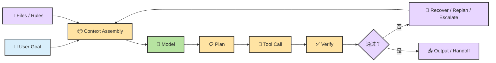

### 7.2 为什么规则文件属于控制面

像 `CLAUDE.md`、`AGENTS.md`、项目规则、审查清单这类文件，最适合被看成控制面的一部分，而不是普通知识材料。

| 适合写入控制面文件 | 不适合写入控制面文件 |
| --- | --- |
| 代码约束、目录边界、验证命令 | 某次对话的临时吐槽 |
| 不可触碰区域、危险动作红线 | 大段瞬时日志 |
| 升级条件、人工确认点 | 高频变动且无复用价值的细节 |
| 复用型工作流与交付标准 | 原样复制的大量外部文档 |

一句话说，控制面文件应该承载“可重用、可重读、可稳定执行的约束”，而不是把一切信息都堆进去。

### 7.3 Verify、Review、Eval 不是一回事

这三个词如果不拆开，后面质量体系会一直混乱。

| 概念 | 它在问什么 | 常见证据 |
| --- | --- | --- |
| `Verify` | 这一步是不是客观成立 | 测试、编译、运行结果、diff 对照 |
| `Review` | 这东西有没有风险、缺陷、遗漏 | 代码审查、设计审查、人工判断 |
| `Eval` | 它是否符合预设标准并可比较 | rubric、benchmark、验收用例 |

对真实交付来说，缺任何一层都可能出问题。

### 7.4 最小交付链：Writer 自证 -> Reviewer 复核 -> 人类或系统裁决

一个够用的最小交付链，通常至少包含三步：

1. ✍️ `Writer` 先完成生成与自验证
2. 🔎 `Reviewer` 用更偏独立的视角检查缺陷和风险
3. 🧑‍⚖️ 最终由人类或既定系统标准决定是否接受

这条链的价值，不是为了把流程变重，而是为了对抗两个高频问题：

- 执行者天然带有确认偏误
- 没有独立证据时，系统很容易把“写出来了”误当成“做对了”

### 7.5 自治不是开关，而是风险分级

很多系统失败，不是因为“自治太多”或“自治太少”，而是因为没有分级。

更合理的看法是把自治做成风险光谱：

| 风险等级 | 适合的自治方式 |
| --- | --- |
| `低风险` | 可直接执行，事后验证 |
| `中风险` | 显式计划后执行，关键节点验证 |
| `高风险` | 人类审批、双重验证或只允许只读探索 |

所以控制面的一个关键任务，就是把不同动作映射到不同自治等级，而不是把整个系统粗暴设成“全自动”或“全手动”。

---

<a id="ch2-sec-8"></a>
## 8. Multi-Agent：为什么单 Agent 不总够用

### 8.1 为什么会走向 Multi-Agent

多 Agent 不是为了“显得更高级”，而是为了解决单 Agent 经常同时遇到的三个瓶颈：

- 一个上下文里塞太多角色，容易冲突和污染
- 一个 Agent 同时做规划、检索、编码、验证，容易顾此失彼
- 有些任务天然可以并行，单 Agent 会被串行执行拖慢

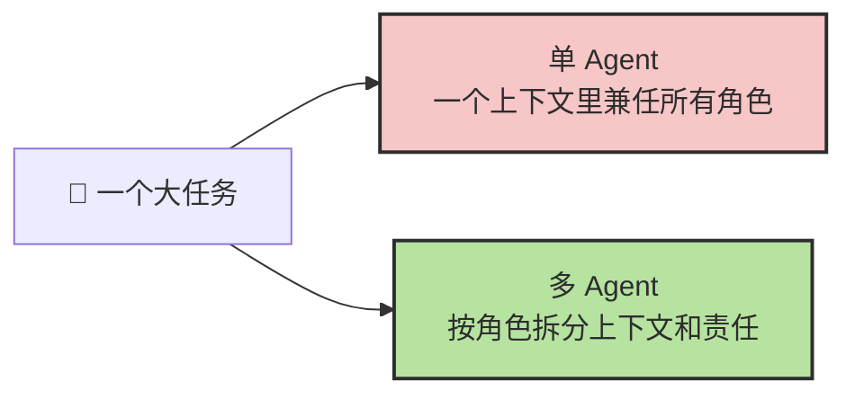

### 8.2 常见模式总览与最常见拓扑

先把最常见的模式记成一张总表：

| 模式 | 一句话定义 | 主要解决什么问题 |
| --- | --- | --- |
| `Planner-Worker` | 规划和执行分离 | 复杂任务拆分与顺序控制 |
| `Writer-Reviewer` | 生成和审查分离 | 降低确认偏误，补风险视角 |
| `Evaluator-Optimizer` | 先评估再优化 | 让系统靠证据迭代收敛 |
| `Router` | 把任务分流给更合适的代理 | 多领域、多能力入口 |
| `RAG-Augmented` | 先检索，再生成或执行 | 上下文不足、资料分散 |
| `Worktree Isolation` | 让不同任务在隔离环境执行 | 降低并发修改冲突 |

最常见的一种拓扑，仍然是 `Supervisor + Specialists`：

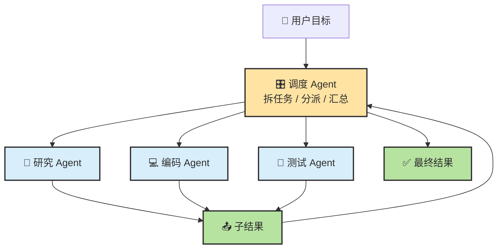

### 8.3 初始化与编排：难点不在“多开几个 Agent”

真正难的不是“启动多个 Agent”，而是它们如何协作。

一个 Multi-Agent 系统如果想跑稳，至少要回答四个问题：

1. 谁来拆任务
2. 每个 Agent 看到哪些上下文
3. 中间结果怎么回传和合并
4. 什么时候停止，谁负责最终验收

📌 **补充：几类常见框架各在强调什么？**

| 框架 | 更强调什么 | 你可以怎么理解 |
| --- | --- | --- |
| `CAMEL` | 角色扮演式对话协作 | 让不同角色在对话中逐步完成任务 |
| `AutoGen` | 多 Agent 对话 + 工具调用 | 强调会话式编排和工具集成 |
| `MetaGPT` | 类软件公司的角色流水线 | 把产品、架构、编码、测试做成分工流程 |
| `Generative Agents` | 记忆、检索、反思与行动的角色社会 | 更偏持续角色与长期状态 |

### 8.4 什么时候不该上 Multi-Agent

Multi-Agent 很强，但绝对不是默认答案。

| 场景 | 为什么先别上 |
| --- | --- |
| 任务很短、边界很清晰 | 单 Agent 就能完成，额外协调只会增加开销 |
| 单 Agent 流程都还没跑稳 | 多 Agent 会把问题放大，而不是自动修复 |
| 子任务强耦合、频繁共享同一上下文 | 拆开后同步成本可能比收益更高 |
| 验收责任必须高度集中 | 多角色分工会让“到底谁说了算”变模糊 |

---

<a id="ch2-sec-9"></a>
## 9. 失效模式与恢复动作

### 9.1 先看整体：任务越长，失控风险越高

前面在 `Memory / Context` 里其实已经埋下了这条线索：会话越长、状态越脏、验证越弱，系统越容易跑偏。

所以理解失效模式，不是为了证明 Agent 不行，而是为了知道：

- 它通常会怎么坏
- 为什么会那样坏
- 第一恢复动作应该是什么

这里我不再把“根源一到根源五”作为独立小节重复展开，因为它们已经分别提前讲过了：

- `上下文有限` 已经在 `Memory / Context Engineering` 里讲过
- `语言流畅不等于真实正确` 已经在 `LLM` 边界里讲过
- `缺少外部验证` 已经在 `Harness / Verify / Eval` 里讲过
- `很多问题不是 Prompt 问题` 已经在 `Prompt / Context / Harness` 三分法里讲过

失效章节现在只负责两件事：**诊断** 和 **恢复**。

### 9.2 一张 canonical 诊断表：从症状回推问题

| 🩺 症状 | 🔍 常见根因 | 🧯 第一恢复动作 |
| --- | --- | --- |
| 一开始就做错方向 | 目标和范围没澄清 | 回到 `Spec`，重写目标与验收标准 |
| 动作很多但没有收敛 | 没有停止条件和验证点 | 补 `Stop Condition` 与阶段验证 |
| 越聊越糊、反复遗忘 | 上下文污染，状态没外置 | 压缩历史，回写文件，重建干净上下文 |
| 一本正经地引用不存在的文件、API、测试 | 缺少外部证据，模型在补空白 | 强制读文件、查接口、跑验证，不接受纯猜测 |
| 调了很多工具但结果更乱 | 工具边界不清，调用缺校验 | 收紧 schema、增加 validation、减少工具面 |
| 早期小错被一路放大 | 错误假设进入后续计划 | 回到最近可信检查点，丢弃错误分支 |
| 写出来了但不能交付 | 只有生成，没有验证链 | 增加测试、构建、review、eval |
| 动作过猛，风险失控 | 自治边界和权限边界没分级 | 提高审批门槛，关键动作改成人工确认 |
| 总觉得是 Prompt 不够好 | 把 Context/Harness 问题误判成 Prompt 问题 | 先排查上下文包、计划结构、验证设计 |

### 9.3 几个高频恢复动作

当系统明显跑偏时，优先考虑的通常不是“再来一段更长的 Prompt”，而是下面这些更强的恢复动作：

1. 🎯 缩小任务边界，先把目标重新写清
2. 📝 把隐含状态外置成文件、计划或检查点
3. ✂️ 删除无关上下文，只保留当前阶段必要证据
4. ✅ 把验证前置，不要等最后一次性结算
5. 🛑 对高风险动作加审批或人工确认
6. ♻️ 如果长会话已经污染严重，直接用干净上下文重开

很多时候，恢复能力本身就是 Agent 系统成熟度的一部分。

---

<a id="ch2-sec-summary"></a>
## 本章总结

### 三条最值得带走的判断

1. 🤖 **Agent 不是一次回答，而是“目标 -> 行动 -> 反馈 -> 修正”的闭环系统。**
2. 📦 **真实效果不只看模型，还取决于 `Context`、`Task Structure` 和 `Verification`。**
3. 🧰 **很多所谓“模型问题”，真正该改的是 `Harness`：上下文装配、状态外置、验证链和自治边界。**

### 如果你还想继续往下学

- 📘 遇到术语卡壳时，随时打开：[术语速查手册](./ch03-glossary.md)
- 🧠 想看更细的底层交互机制和伪代码：[Agent 与 LLM 的交互内幕](../topics/topic-agent-llm-internals.md)
- 🧩 想继续深挖上下文问题：[上下文工程深入](../topics/topic-context-engineering.md)
- 🚑 想系统看失败与恢复：[失败模式与恢复术](../topics/topic-failure-modes.md)
- 💾 想继续深挖 Memory：[Memory 与上下文工程详解](../topics/topic-memory-system.md)
- 🔌 想理解扩展机制的深水区：[MCP 协议](../topics/topic-mcp.md) / [Skill 系统](../topics/topic-skills.md) / [Ch07 · 扩展生态与会话管理](./ch07-config-session.md)

### 参考资料

- Maarten Grootendorst, [A Visual Guide to LLM Agents](https://newsletter.maartengrootendorst.com/p/a-visual-guide-to-llm-agents)

---

<div align="center">

[📚 返回目录](../../README.md#tutorial-contents) | [⬅️ 上一章：Ch01 快速上手](./ch01-quickstart.md) | [➡️ 下一章：Ch04 第一批实战](./ch04-first-practice.md)

</div>
