# Chapter 2 · 🧩 Agent 核心原理

> 目标：建立一套完整、可操作的 Agent 心智模型。读完这一章，你应该能同时回答六个问题：Agent 和普通 LLM 到底差在哪？它为什么能“自己干活”？`LLM / Planning / Tools / Memory` 各自负责什么？这套闭环在运行时怎么转？它为什么会在长任务里变蠢？作为使用者你该怎么应对？

## 目录

- [0. 先校准几个直觉](#0-先校准几个直觉)
- [1. 先看清：LLM 为什么不等于 Agent](#1-先看清llm-为什么不等于-agent)
- [2. 一个总图：Agent = LLM + Planning + Tools + Memory](#2-一个总图agent--llm--planning--tools--memory)
- [3. LLM：大脑，但不是整个 Agent](#3-llm大脑但不是整个-agent)
- [4. Planning：Agent 如何决定下一步](#4-planningagent-如何决定下一步)
- [5. Tools：Agent 如何接触真实世界](#5-toolsagent-如何接触真实世界)
- [6. Memory：Agent 如何维持状态与连续性](#6-memoryagent-如何维持状态与连续性)
- [7. 为什么 Agent 会失控、变蠢、跑偏](#7-为什么-agent-会失控变蠢跑偏)
- [本章总结](#本章总结)

> 📖 **阅读方式建议**：如果你对 `LLM / Context / Token / MCP / Skill` 这些词还不熟，可以把 [术语速查手册](./ch03-glossary.md) 另开一页，边读边查；本章主线已经尽量自洽，不要求你先把术语全背下来。

---

## 0. 先校准几个直觉

在进入原理之前，先把几个最常见的误解摆出来。很多人不是不会用 Agent，而是一开始就把它想错了。

| # | 常见直觉 | 更接近现实的说法 |
|---|---|---|
| 1 | “Agent 就是更聪明的 ChatGPT” | **不准确。** Agent 不是单纯更强的回答器，而是一个会循环工作、会调用工具、会维护状态的任务执行系统 |
| 2 | “模型越强，Agent 就越好用” | **只说对一半。** Agent 表现 = 模型能力 × 上下文质量 × 任务结构清晰度。后两项往往更影响结果 |
| 3 | “给 Agent 的信息越多越好” | **通常是错的。** 信息太多会把关键约束淹没，精准上下文比堆料更重要 |
| 4 | “Agent 的结果就是一口气生成出来的” | **错。** Agent 通常在内部反复运行 `Think -> Act -> Observe -> Continue` |
| 5 | “工具越多越强” | **也不对。** 工具太多会增加上下文负担和决策噪音，常见结果反而是变慢、变乱、变不稳定 |

先记住一句最重要的话：

> **Agent 不是“会聊天的模型升级版”，而是“围绕模型搭出来的行动系统”。**

---

## 1. 先看清：LLM 为什么不等于 Agent

如果一上来就讲 `Memory / Tools / Planning`，很多读者会有一种“知道这些词，但还是没感觉”的状态。更自然的切入方式，是先看普通 LLM 到底在做什么。

### 1.1 普通 LLM 很像“缸中大脑”

如果要给普通 LLM 找一个最有画面感的比喻，我会选：

> **它像一个被放在培养缸里的大脑。**

这个大脑非常会思考，也非常会语言表达。你问它“如果你是一个程序员，你会怎么修这个 bug”，它可以把步骤讲得头头是道，甚至听起来比很多真人都更像那么回事。

但问题在于，它首先是一个**脱离真实环境的大脑**。它擅长的是脑内推演，而不是和外部世界持续交互。

不管界面多像对话框，普通 LLM 的底层本质依然很朴素：它看到输入，然后继续生成最合理的下一个 token，连续很多个 token 后，看起来就像是在“回答问题”。

这类系统当然可以很强。它能解释概念、写文案、生成代码、改写文本，很多时候表现甚至已经相当惊艳。因为在“脑内模拟”这件事上，它真的很擅长。

但这里有一个关键边界：

> **普通 LLM 默认是在“回答”，不是在“执行”。**

### 1.2 为什么它看起来很聪明，却经常在关键时刻掉链子

大众读者第一次接触 Agent，最容易困惑的一点是：既然模型已经这么聪明，为什么还要搞 Agent 这套复杂结构？

因为只靠“输入一次，回答一次”，很多任务根本做不完。

比如你说：

- “帮我总结这个仓库最近 5 次提交的变化”
- “把这个 bug 修掉，并且补上测试”
- “查一下现在的汇率，再帮我比较两个付款方案”

这些任务都不只是“想一想”，还需要：

- 去拿外部信息
- 去操作真实环境
- 记住前面做过什么
- 根据结果决定下一步

而这，已经开始超出普通 LLM 的默认工作方式了。

换句话说，**缸中大脑最大的问题，不是不会想，而是想完以后碰不到世界。**

它可以：

- 想象执行一条命令后“理论上”会发生什么
- 猜测某个 API 大概会返回什么
- 推演一段代码改完后“应该”能过测试

但只要它没有真的去执行、真的去观察、真的去拿回反馈，它就仍然只能停留在“可能对”的状态里。

### 1.3 从控制论看：普通 LLM 更像开环，Agent 更像闭环

如果借控制论的语言来看，这个差别会更清楚。

普通 LLM 更像一个**开环系统**：

- 你给输入
- 它给输出
- 这一轮就结束了

它当然可以把答案说得很漂亮，但它缺少一个最关键的东西：**根据环境反馈持续修正自己的能力**。

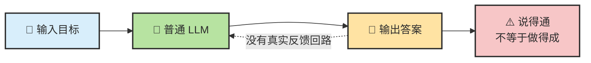

而 Agent 更像**闭环系统**：

- 先决定动作
- 再作用到环境
- 再读取反馈
- 再调整下一步

这时候系统不再只是“生成一个看起来合理的答案”，而是在真实反馈中不断**收束解空间**。

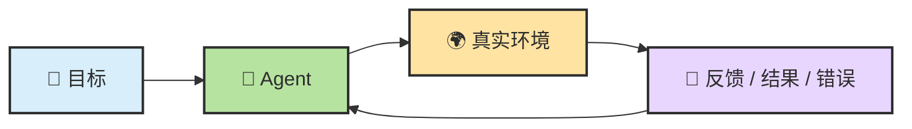

你可以把“收束解空间”理解成：

- 没有反馈时，模型只能在很多“也许对”的路径里猜
- 有了反馈后，错误路径会被排除，正确路径会越来越清晰

这也是为什么控制论和反馈系统对理解 Agent 很有帮助。一个系统想在动态环境里稳定地完成目标，不能只会规划，还得能**根据误差和反馈不断修正**。

### 1.4 第一步升级：从 LLM 到 Augmented LLM

所以，现实世界里大家做的第一件事，不是直接造 Agent，而是先给模型外挂能力。

这一步常被叫做 **Augmented LLM**，也就是“增强型 LLM”。

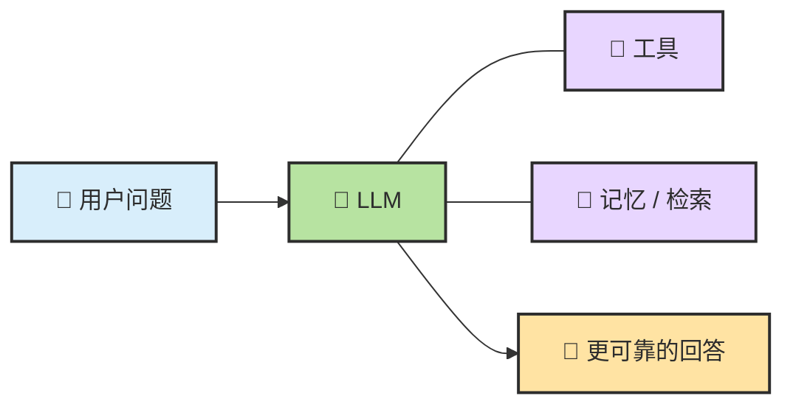

你可以把它理解成：

- 模型负责理解和判断
- 工具负责连到真实世界
- 记忆负责补足“它本来不记得”的信息

这一层已经比纯聊天模型强很多了，但还差最后一步。

### 1.5 ReAct：关键不只是“会想”，而是“边想边试边看”

从“缸中大脑”跨到 Agent，中间有一个非常关键的思想桥梁，就是 **ReAct**。

ReAct 这个名字本身就说明了重点：

- **Reason**：先想一想，现在最合理的动作是什么
- **Act**：真的去做这个动作
- **Observe**：看环境返回了什么结果

然后再进入下一轮。

这件事看上去朴素，但它改变了系统的性质。因为模型不再只是靠脑内推演一路写到结尾，而是会让**推理**和**环境反馈**互相纠正。

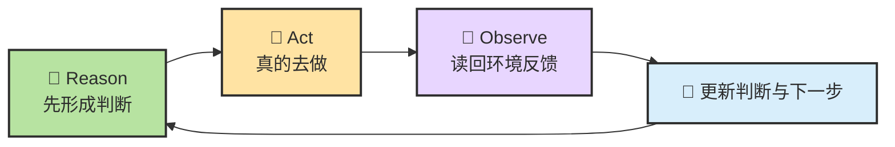

这就是 ReAct 真正厉害的地方：

- 推理不再是终点，而是行动前的准备
- 行动不再是盲做，而是为了拿回新信息
- 观察不再是附属步骤，而是下一轮推理的输入

如果用更直白的话说：

> **ReAct 让模型不只是“会讲步骤”，而是开始“用步骤去试探现实”。**

### 1.6 真正的跨越：Agent 不是一次回答，而是一个循环

Agent 最重要的变化，不是“工具更多了”，而是**系统开始对反馈负责**。

到这一步，普通 LLM 和 Agent 的差别就可以压缩成两组对比：

- 普通 LLM 是**给一个答案**
- Agent 是**追一个目标**

- 普通 LLM 停在脑内推演
- Agent 必须在真实反馈里不断修正，直到接近完成条件

所以 Agent 的本质，不是多一轮回答，也不是多几个插件，而是把“推理”改造成了“带反馈的连续行动”。

### 1.7 先有这个画面，后面一切就顺了

如果你把 Agent 想成一个实习生，这个循环就很好理解：

1. 先理解任务
2. 决定先做什么
3. 去实际操作
4. 看操作结果
5. 如果没完成，就继续

Agent 原理并不神秘。神秘感大多来自于很多产品把这条内部循环藏了起来，你只看到它最后给你的结果。

如果把这一小节压缩成一句最值得记住的话，就是：

> **LLM 像缸中大脑，擅长脑内推演；Agent 则像接上了眼睛、手和反馈回路的大脑，能在真实环境里边做边收束。**

而一旦你接受了这个画面，后面的问题也就顺理成章了：

- 它靠什么理解当前局面？
- 它靠什么决定先做哪一步？
- 它靠什么真的去行动？
- 它靠什么记住已经发生过什么？

这也就是下一节要给出的总图。

---

## 2. 一个总图：Agent = LLM + Planning + Tools + Memory

现在我们已经知道：Agent 不是“一次回答”，而是“围绕目标持续推进”的系统。那它到底多了什么？对大多数读者来说，最够用、也最好记的公式就是：

> **Agent = LLM + Planning + Tools + Memory**

这不是唯一的学术定义，但它非常适合入门，因为它既抓住了 Agent 的核心部件，也能解释为什么这些部件组合起来以后，系统会从“会说”变成“会做”。

### 2.1 一个够用的总公式

先把这四个词记成一句白话：

- **LLM**：大脑，负责理解、推理、生成
- **Planning**：控制层，负责决定下一步做什么、何时停、何时重试
- **Tools**：行动层，负责读文件、跑命令、调 API、接触环境
- **Memory**：状态层，负责保存上下文、摘要、规则和阶段结果

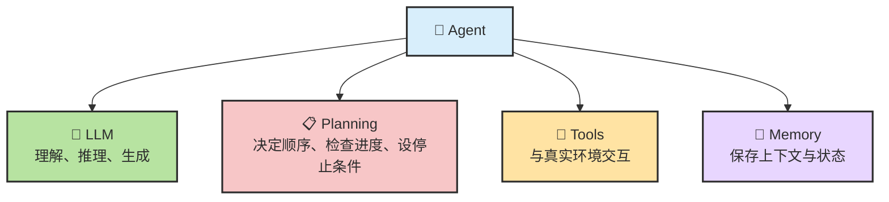

但有一个特别容易误解的地方，要在一开始就说清：

> **这四件套不是四个平级的“外挂插件”，而是一条由 LLM 驱动、由外层系统组织起来的闭环。**

也就是说，`Planning / Tools / Memory` 不是离开 LLM 还会自己“智能运转”的三个盒子；它们大多数时候都需要 LLM 提供判断依据，外层的 Agent 框架再把这些能力组织成稳定流程。

### 2.2 这四件套如何组成一个闭环

如果借用经典 Agent 理论的语言，可以把这个系统理解成：

- 环境不断给出可观察信息
- LLM 负责理解这些信息
- Planning 负责把理解变成下一步
- Tools 负责把下一步施加到环境
- Memory 负责把结果留下来，供下一轮继续使用

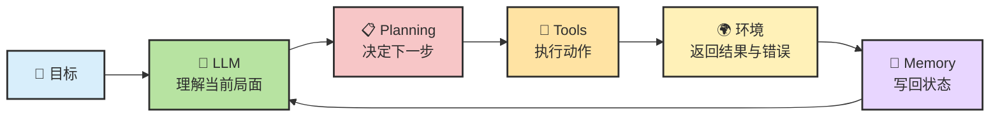

这里最关键的不是“部件名称”，而是**回路方向**：

1. 先观察
2. 再理解
3. 再决定下一步
4. 再行动
5. 再把结果写回系统
6. 然后进入下一轮

只要你脑中一直保留这条闭环，后面每个部件的职责就不会混。

### 2.3 再压缩一层：Agent = Model + Harness

工程师常常还会把它再压缩成另一种写法：

> **Agent = Model + Harness**

这里的意思不是把 `Planning / Tools / Memory` 否认掉，而是强调：

- **Model** 决定理解、推理、生成的上限
- **Harness** 把规划、工具、记忆、权限、验证、停止条件组织成一个可靠系统

可以先看成这样：

| 层 | 主要负责什么 |
|---|---|
| **Model（模型）** | 读上下文、做判断、输出下一步 |
| **Harness（外层系统）** | 管循环、管工具执行、管权限、管写回、管验证、管停止 |

所以后面四节虽然分别讲 `LLM / Planning / Tools / Memory`，但你脑子里最好同时保留一件事：

> **真正决定 Agent 体验的，不只是模型有多强，还包括外层怎么把它组织起来。**

---

## 3. LLM：大脑，但不是整个 Agent

讲 Agent 时最不能忘的一点是：**LLM 的底层仍然是 next-token prediction。**

### 3.1 底层机制仍是 next-token prediction

也就是说，不管它看起来多像在“思考”，底层机制仍然是：

1. 读取当前上下文
2. 预测下一个最合理的 token
3. 再预测下一个
4. 连续很多次以后，形成一句解释、一段代码、一个计划，或者一次工具调用

所以严格说，LLM 本身并不是一个“会自动完成任务的程序”，而是一个**在上下文里持续续写最合理内容的概率引擎**。

你可以把下面这组表述同时放在脑子里，它们并不矛盾：

| 说法 | 是否正确 | 为什么 |
|---|---|---|
| “LLM 只是文字接龙” | **对** | 底层确实是 next-token prediction |
| “LLM 会推理” | **也对，但要加条件** | 当上下文足够好、问题结构足够清楚时，连续生成会表现出推理感 |
| “LLM 是 Agent 的大脑” | **对** | 在 Agent 里，它承担的正是理解当前局面并给出下一步判断的角色 |

### 3.2 为什么 next-token prediction 仍然会表现出“推理感”

很多人一听“next-token prediction”，就会误以为这意味着模型只会胡乱接龙。现实不是这样。

在复杂任务里，当前上下文本身往往已经包含了：

- 用户目标
- 系统规则
- 工具定义
- 记忆摘要
- 最新观察结果
- 中间结论和失败反馈

在这种高约束上下文里连续生成 token，表现出来就很像：

- 先理解问题
- 再比较几种路径
- 再挑一个最合理的动作
- 再根据新反馈修正主意

换句话说，**推理感并不是凭空来的，而是上下文结构把模型“压”到了一个更像推理的位置上。**

### 3.3 在 Agent 里，LLM 其实是一脑多用

同一个模型，在 Agent 里通常会不断切换角色。

| 运行时阶段 | LLM 在扮演什么角色 |
|---|---|
| 刚接收任务 | **理解者**：弄清目标、约束和成功标准 |
| 决定下一步 | **规划者**：判断现在该读文件、跑命令、还是先问清楚 |
| 选择工具时 | **调度者**：决定是否需要工具、用哪个、参数是什么 |
| 读回结果后 | **解释者**：判断这段输出意味着成功、失败还是线索 |
| 上下文太长时 | **摘要者**：压缩已完成部分，保留后续还需要的关键信息 |
| 即将结束时 | **审稿者**：判断任务是否满足停止条件，是否该验证、该汇报、该停下 |

这也是为什么同一个 LLM 在不同产品里表现会差很多。模型可能没变，但**外层给它的上下文组织方式、工具选择空间、验证闭环**全变了。

### 3.4 “大脑”这个比喻的边界

说 LLM 是大脑很有帮助，但也很容易过度拟人化。

LLM 自己通常**不负责**这些事：

| 事情 | 为什么通常不由 LLM 单独完成 |
|---|---|
| 持久存储状态 | 文件怎么存、什么能跨会话保留，取决于外层系统 |
| 真正执行外部动作 | 命令、文件写入、API 调用都需要工具层和权限层 |
| 权限控制 | 哪些动作需要你确认，不是模型自己说了算 |
| 停止条件 | 什么时候算完成，通常也要靠 Harness 和任务约束 |
| 失败重试与回滚 | 真正稳健的恢复策略需要外层工作流设计 |

所以最准确的说法是：

> **LLM 是 Agent 的判断核心，但不是 Agent 的全部实现。**

你可以把这一节压缩成一句话：

> **没有 LLM，就没有“理解当前局面并作出选择”的能力；但只有 LLM，也还没有一个真正能稳定完成任务的 Agent。**

---

## 4. Planning：Agent 如何决定下一步

很多人第一次看到 `Planning`，会以为这是一个独立的“智能模块”。更准确的说法是：

> **大多数产品里的 Planning，都是“固定编排 + LLM 动态决策”的混合体。**

### 4.1 Planning 到底在规划什么

你可以把 Planning 拆成两层看：

| 层级 | 谁负责 | 主要作用 |
|---|---|---|
| **外层编排** | Agent 框架 / 产品逻辑 | 提供循环骨架、权限审批、最大尝试次数、停止条件 |
| **内层规划** | LLM | 结合目标、记忆、最新反馈，决定“现在最该做什么” |

所以 `Planning` 并不是“有一个计划模块自己在思考”，而更像是：

- 框架先规定大规则
- LLM 再在这个规则里动态决定下一步

这也是为什么 `Planning` 离不开 `LLM`：

- 没有 LLM，Planning 更像固定 workflow 或状态机
- 有了 LLM，Planning 才开始具备“根据当前局面改主意”的能力

### 4.2 Agentic Loop：Planning 在运行时怎么转起来

从用户视角看，你在终端里输入一句话，Agent 几秒后给你一大段回复，看起来像是一次性生成的；但实际上，**Agent 内部可能已经循环了十几轮**。每一轮都在做同一件事：理解 -> 选动作 -> 执行 -> 观察 -> 再判断。

这就是 **Agentic Loop**。它不是 Planning 的附属细节，而是 Planning 在运行时的真正形态。

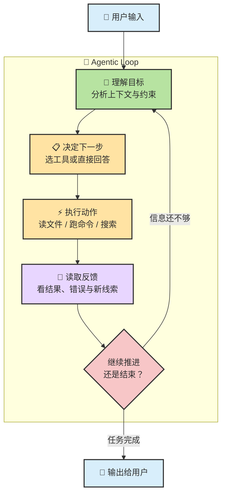

你看到的一条回复，背后常常是一个隐藏的 while-loop。

### 4.3 一次真实请求的内部轨迹

比如你说：

> “帮我找到项目里所有未使用的依赖并清理掉。”

Agent 内部可能经历这样的循环：

| 轮次 | Agent 在判断什么 | 使用工具 | 观察结果 |
|:---:|---|---|---|
| 1 | 先确认项目类型和包管理器 | `Read` / `Shell` | 发现是 Node.js 项目，用 npm |
| 2 | 需要看哪些包被声明了 | `Read package.json` | 列出了当前 dependencies |
| 3 | 需要在代码里搜索引用 | `Grep` / `SemanticSearch` | 初步发现几个包没有被调用 |
| 4 | 还要排除配置文件里的间接使用 | `Grep` 配置目录 | 其中一个包其实在构建配置里用到了 |
| 5 | 确认真正未使用的依赖后再删除 | `Shell npm uninstall ...` | 删除命令成功 |
| 6 | 不能只删，还要验证是否没破坏项目 | `Shell npm test` | 测试通过 |
| 7 | 任务完成，整理结果汇报用户 | — | 输出删除了什么、如何验证的 |

> 💡 **关键认知**：你看到的是“一条完成回复”，Agent 内部经历的却是“多轮局部判断”。它不是一下子把整条链路都想完，而是在每一步里借新反馈不断收束。

### 4.4 ReAct 和 Plan-and-Execute

`Planning` 常见的两种工作方式，可以先粗略分成：

| 方式 | 适合什么任务 | 风险 |
|---|---|---|
| **ReAct** | 动态、不确定、必须靠反馈收束的问题 | 如果没有约束，容易在长任务里漂移 |
| **Plan-and-Execute** | 结构更清晰、依赖关系较稳定的问题 | 如果前面的计划假设错了，可能一路错下去 |

现实里的 Coding Agent 通常是混合体：

- 先让 LLM 产出一个粗计划
- 真正执行时再进入 ReAct 式局部修正

所以不要把它们想成非此即彼，更像是：

> **先用计划建立方向，再用反馈修正细节。**

### 4.5 停止条件、权限、验证，为什么也算 Planning

很多人把 Planning 理解得太窄，只看“先做 A 还是先做 B”。其实真正稳定的 Planning，还包括：

- **什么时候该停**
- **哪些动作必须先获准**
- **做完之后怎么验证**
- **失败几次后该换路还是该求助**

也就是说，Planning 不只是在决定“下一步做什么”，还在决定：

- 什么叫完成
- 什么叫失败
- 什么叫该把人类拉回环里

这就是为什么成熟 Agent 产品里，危险操作、权限审批、验证命令、重试上限，常常都属于同一层“控制逻辑”。

### 4.6 自主性不是开关，而是一条光谱

Planning 还直接决定了系统到底有多“自主”。

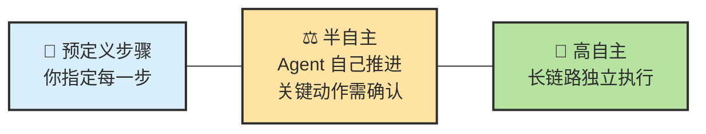

今天大多数主流 Coding Agent 都落在中间这段：

- LLM 会自己做局部规划
- 但危险操作、权限边界、最终验收仍然有人类在环里

如果把这一节压缩成一句话，就是：

> **Planning 不是“先列个计划”那么简单，它其实是 Agent 整条控制回路的调度中枢。**

---

## 5. Tools：Agent 如何接触真实世界

`Tools` 回答的是一个最根本的问题：

> **普通 LLM 会想，但碰不到世界；Tools 让它开始真的接触世界。**

### 5.1 Tools 让模型从“会讲”变成“会做”

工具调用不是“工具自己突然变聪明”，而是三层协作：

1. **LLM 决定要不要用工具、用哪个工具、参数是什么**
2. **Harness 真的去执行工具**
3. **执行结果再回到 LLM，成为下一轮判断的输入**

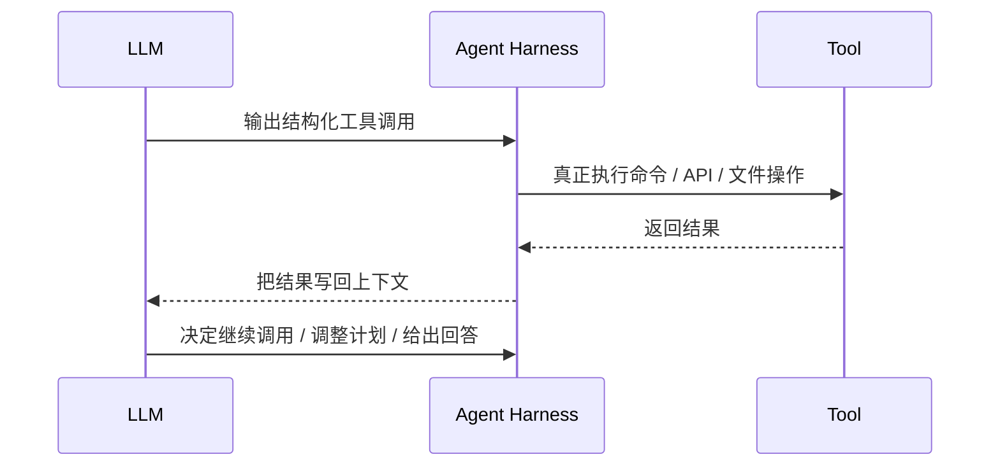

所以更准确的说法是：

- **LLM 负责决定**
- **Harness 负责执行**
- **Tools 负责接触环境**

没有 LLM，工具只是脚本库；有了 LLM，系统才会根据当前局面动态选择合适工具。

### 5.2 Agent 能访问什么，不能访问什么

理解 Agent 的“感知边界”很重要，因为它直接决定了 Agent 能帮你做什么、不能帮你做什么。

#### 常见可访问资源

| 资源 | 常见能力 | 典型用途 |
|------|------|---------|
| 📁 **项目文件** | 读取和修改工作区文件 | 阅读源码、改代码、写文档 |
| 🖥️ **终端** | 运行命令、脚本、构建、测试 | 跑测试、安装依赖、执行 Git 命令 |
| 🌐 **网络** | 搜索文档、抓取网页内容 | 查官方 API、搜索报错信息 |
| 📦 **版本控制** | 查看 diff、历史、分支 | 审查改动、理解上下文、提交结果 |

#### 常见受限资源

| 资源 | 为什么经常受限 | 你通常怎么补 |
|------|------|------|
| 浏览器 GUI | 默认没有“看屏幕 + 点击 + 截图”能力 | 接浏览器自动化工具，如 Playwright / Computer Use |
| 私有服务与凭证 | Agent 默认没有你的全部认证上下文 | 由你手动登录，或通过受控代理接入 |
| 运行中进程的内部状态 | Agent 不会自动 attach 到任意进程内存 | 通过日志、断点、诊断命令间接观察 |

#### 一个重要澄清

不同 Agent 产品的权限模型差异很大，但有一条经验很稳定：

> **你必须把“Agent 会不会做”与“Agent 被不被允许做”区分开。**

很多时候不是模型不会，而是：

- 当前工具集没暴露这个能力
- 当前会话没给这个权限
- 当前产品刻意把这个能力关掉了

所以理解 Tools，也是在理解**能力边界 + 安全边界**。本章只讲概念定位；具体怎么配权限、怎么装扩展，放到后面的配置章节。

### 5.3 运行时最常见的五类工具

不同 Agent 产品的工具命名不同，但从功能上看，通常都可以归纳成五大类。

| 类别 | 它解决什么问题 | 常见例子 |
|---|---|---|
| **读取类** | 先理解项目和现状 | `Read` / `Glob` / `Grep` / `SemanticSearch` |
| **写入类** | 修改文件或创建内容 | `Write` / `Edit` / `StrReplace` |
| **执行类** | 跟开发环境互动 | `Shell` / 构建 / 测试 / Git |
| **外部类** | 获取外部世界信息 | `WebSearch` / `WebFetch` / API 调用 |
| **编排类** | 把子任务交给其他 Agent 或工作单元 | `Task` / 子 Agent / worker |

你可以把它们分别看成 Agent 的：

- 眼睛
- 手
- 手脚延伸
- 外部情报通道
- 分工与调度能力

对 Coding Agent 来说，真正让它和“只能聊天的模型”拉开差距的，往往不是某一个神奇大招，而是**这五类工具配合得稳不稳**。

### 5.4 Function Calling、MCP、Skills 各在什么层

这三个词很容易混淆，但它们其实不在同一层。

如果你还没把这些缩写完全分清，可以随时跳到 [术语速查手册](./ch03-glossary.md) 对照着看，不需要中断本章主线。

| 概念 | 它回答什么问题 | 直白理解 |
|---|---|---|
| **Function Calling** | 模型怎么发出工具调用 | 一种结构化“我要调用这个工具”的表达方式 |
| **MCP** | 工具怎么被统一描述和连接 | 一种标准接口层 |
| **Skills** | Agent 应该按什么方法做事 | 一套工作方法和流程约束 |

所以：

- `Function Calling` 是**调用形式**
- `MCP` 是**工具接入标准**
- `Skill` 是**做事方法手册**

它们互补，不是替代关系。

### 5.5 扩展机制：MCP / Skill / Hook / Plugin 各在什么层

前面讲的是 Agent 已经拿到工具之后，怎么和世界交互。接下来要回答另一个常见问题：

> **这些能力、方法和自动化，到底是怎么接进 Agent 系统的？**

`MCP / Skill / Hook / Plugin` 经常被放在一起讲，但它们各自回答的其实不是同一个问题。

| 机制 | 它解决什么问题 | 不是什么 | 最短记忆 |
|------|----------------|----------|----------|
| **MCP** | 怎么把外部能力标准化接进来 | 不是模型，也不是 Skill 的替代品 | **标准化连接层** |
| **Skill** | 遇到这类任务该按什么流程做 | 不是新工具，不是新权限 | **方法论层** |
| **Hook** | 怎么在事件前后自动插入逻辑 | 不是外部工具能力本身 | **自动化插桩层** |
| **Plugin** | 怎么把能力、方法和配置一起分发 | 不是单一能力本身 | **打包层** |

你可以把它们先记成一句话：

> **MCP 负责接能力，Skill 负责教方法，Hook 负责在流程节点自动插入逻辑，Plugin 负责把前面这些能力和配置打包分发。**

#### MCP：标准化连接层

MCP（Model Context Protocol）是一套开放协议，解决的是：

- Agent 应用怎么连接外部工具和数据源
- 工具能力怎么用统一格式暴露出来
- 不同 Agent 和不同工具怎么避免一对一私有集成

一个常用比喻是：

> **MCP 之于 Agent 工具集成，就像 USB-C 之于硬件连接。**

它最常见会暴露三类东西：

- **Tools**：可调用的操作
- **Resources**：可读取的数据
- **Prompts**：可复用的模板

所以 MCP 解决的是“**能不能接进来、怎么标准化接进来**”，不是“接进来之后应该怎么用得更好”。

#### Skill：方法论层

Skill 解决的不是“再给 Agent 一个新 API”，而是：

- 遇到这类任务时，应该按什么步骤推进
- 哪些检查清单必须走
- 输出应该长什么样

也就是说，Skill 给 Agent 的不是新能力，而是**更稳定的做事方法**。

这也是为什么 Skill 通常表现为一份 `SKILL.md` 和相关资源，而不是一个远程服务。它本质上更像：

> **把团队经验、SOP、最佳实践写成 Agent 可以反复复用的方法手册。**

Skill 还有一个很关键的优点：它通常可以按需渐进加载，而不是每次会话都把全部规则一次性塞进上下文。

#### Hook：事件自动化层

Hook 是很多人容易忽略、但非常实用的一层。它解决的是：

- 当某个事件发生时，能不能自动执行一段逻辑
- 能不能把某些检查、提醒、备份、注入动作挂到 Agent 生命周期节点上

直白一点说，Hook 更像：

> **在 Agent 工作流的关键时刻，自动插入你自己的脚本或规则。**

它常见适合做的事包括：

- 工具调用前后的轻量检查
- 会话压缩后的备份或摘要处理
- 自动格式化、自动记录日志、自动重注入关键上下文

要注意的是，Hook 也**不创造新能力**。它做的是把已有能力在正确时机自动触发，所以它更接近“流程自动化”而不是“工具扩容”。

#### Plugin：打包层

Plugin 更像“分发形态”，而不是单独的一种认知层。

它解决的是：

- 怎么把一组 Skill、MCP、Hook、命令、配置、模板一起分发
- 怎么让用户一键安装一整套工作能力

所以当你看到一个 Plugin 时，最准确的理解通常不是“它发明了新概念”，而是：

> **它把前面几层东西打包成了一个更容易安装、启用和复用的产品形态。**

比如一个成熟的 Plugin，常常不是只带一个 Skill，而是会顺带提供：

- 一组高频 Skill
- 若干外部能力接入
- 若干自动化 Hook
- 预设配置和默认工作流

#### 一张总表：四者怎么配合

| 你想解决的问题 | 更像该用什么 |
|----------------|-------------|
| 让 Agent 连 GitHub、数据库、浏览器 | **MCP** |
| 让 Agent 学会按固定流程做代码审查、TDD、调试 | **Skill** |
| 让某个事件发生时自动跑脚本或检查 | **Hook** |
| 让团队一键获得一整套能力和默认配置 | **Plugin** |

如果你只想记最短的选型顺序，可以记这个：

1. 先问：现有 `CLI / 脚本 / 直接 API` 能不能解决
2. 再问：如果需要标准化接入和统一鉴权，再上 `MCP`
3. 如果问题是“怎么做得更稳”，补 `Skill`
4. 如果要在流程节点自动插入动作，用 `Hook`
5. 如果要把整套能力统一分发，再用 `Plugin`

### 5.6 工具不是越多越强

工具不是越多越好。工具越多，通常也意味着：

- 上下文更重
- 决策空间更乱
- 权限面更大
- 失败恢复更复杂

尤其是 MCP 这类统一接入层，每多挂一个 server，通常都意味着：

- 要把工具描述暴露给模型
- 要把连接协议带进运行时
- 要让模型在更多候选项里做决策

也就是说，**工具本身就会消耗注意力预算**。

对 Coding Agent 来说，一个很务实的顺序通常是：

1. 能直接用 `CLI / 文件` 就先用
2. 能直接调 `API / SDK` 就先用
3. 需要统一接入、鉴权和共享时，再上 `MCP`
4. 需要稳定方法论时，再补 `Skills`

> **先轻后重，先确定性执行，再上更复杂的协议层。**

如果把这一节压成一句话，就是：

> **Tools 让 Agent 真的碰到世界，但也同时决定了它的能力边界、上下文成本和安全风险。**

---

## 6. Memory：Agent 如何维持状态与连续性

Memory 最容易被神化。很多人会把它想成“Agent 真的记住了一切”。更准确的理解是：

> **Memory 不是魔法记忆力，而是状态管理。**

### 6.1 Memory 不是“记忆力”，而是“状态管理”

它通常至少有三层：

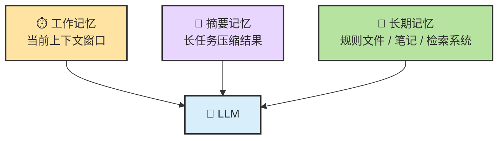

你可以这样理解：

- **工作记忆**：当前对话、工具结果、系统提示，是 LLM 这一轮直接能看到的内容
- **摘要记忆**：当对话太长时，把旧过程压缩成更短摘要，保住高密度信息
- **长期记忆**：写进文件、知识库、检索系统的内容，跨会话保留

这里最关键的一点是：

> **Memory 只有在被重新读回上下文时，才会对 LLM 产生作用。**

也就是说：

- 一个文件躺在磁盘里，不等于 LLM“已经记住”
- 一个向量数据库里有记录，不等于当前这轮推理“已经用上”

Memory 真正发挥作用，要经过完整链条：

1. 过去的信息被保存下来
2. 当前任务触发检索或回读
3. 相关内容被注入当前上下文
4. LLM 读到以后，才会用它做判断

### 6.2 短期记忆：当前 session 里的工作记忆

**短期记忆 = 当前会话中 Agent 能“看到”的所有信息。** 它通常包括：

| 内容 | 来源 | 风险点 |
|------|------|------|
| 你的所有消息 | 你输入的每一句话 | 早期约束可能在长会话里被稀释 |
| Agent 的回复 | 中间分析、计划、结论 | 错误假设也会被带着走 |
| 工具结果 | 文件内容、命令输出、搜索结果 | 这是上下文膨胀的主要来源 |
| 系统规则 | 项目规则、工具定义、运行约束 | 太多时会稀释当前任务重点 |

> ⚠️ **上下文窗口不是无限的。** 会话越长，最早的信息越可能被压缩、截断或弱化；模型对上下文前中后的注意力分布也不是均匀的。

这就是为什么长会话后期常见的症状是：

- 忘掉你早先强调的约束
- 重复已经做过的排查
- 把旧版本代码或旧结论当成当前事实

### 6.3 长期记忆：文件、规则与检索系统

如果说 session 里的东西像“临时工作台”，那长期记忆更像“你真正写入仓库和规则系统的东西”。

最常见的载体有三种：

| 载体 | 它适合存什么 | 为什么有用 |
|------|------|------|
| `CLAUDE.md / AGENTS.md / rules` | 项目规范、约束、禁区、常用命令 | 跨会话稳定复用 |
| 源码与文档 | 任务产出本身 | 这是最真实的事实来源 |
| 检索系统 / 知识库 | 大量历史文档、外部资料 | 需要时按需取回，不必一直塞进上下文 |

这里有一句非常硬的工程原则：

> **写进文件的才是事实来源；留在会话里的，大多只是临时工作台。**

如果你在会话中说“我们项目统一用 Tab 缩进”，新开会话后 Agent 可能就忘了；但如果你把这条规则写进项目规则文件，每次新会话它都更容易重新读到。

### 6.4 为什么长任务会越来越糊

Agent 运行时间越长，失控风险通常越高。这不是某个产品的偶然 bug，而是长上下文系统的共性。

背后通常有四个叠加过程：

1. **上下文不断变长**
2. **中间信息密度不断下降**
3. **旧错误和旧假设被继续带着跑**
4. **压缩后又可能丢掉真正重要的约束**

如果你把这个现象记成一句话，就是：

> **长会话的敌人不是“字太多”，而是“高密度信息被噪音稀释后，系统开始看不清自己在做什么”。**

### 6.5 长文档如何压垮 Working Memory

长文档是工作记忆层最常见的污染源。理解它怎样压垮上下文窗口，才能设计出正确的处理策略。

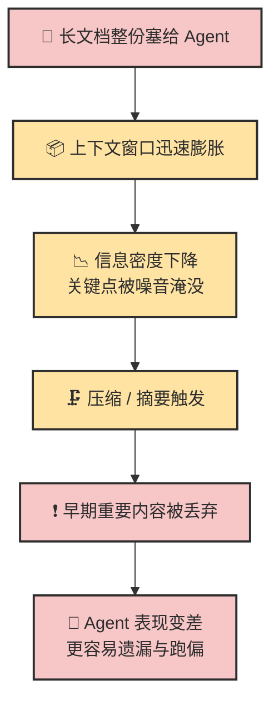

正确做法通常不是“一次性全塞”，而是分层处理：

| 做法 | 为什么更稳 |
|---|---|
| **Chunking（分块）** | 把长文档切成语义完整的小块，避免一次吃太多 |
| **摘要优先** | 先让 Agent 读索引和摘要，再按需深入细节 |
| **渐进式披露** | 根据当前任务动态加载相关片段，而不是全量注入 |
| **检索增强** | 需要时再取相关内容，减少无关文本占位 |

这也是为什么在很多真实项目里，**Markdown 规则文件 + 按需检索文档** 往往比“把整个知识库都塞进 prompt”更稳。

### 6.6 压缩与回放：怎样尽量不忘

不是所有压缩都一样安全。

| 压缩方式 | 直白理解 | 风险 |
|---|---|---|
| **可逆压缩** | 用文件路径、链接、引用位置代替大段正文 | 低，原文随时能取回 |
| **不可逆摘要** | 用 LLM 生成更短摘要代替原过程 | 高，信息一旦丢失就回不来了 |

工程上一个很实用的原则是：

> **能可逆压缩，就先不要不可逆摘要。**

另外，长任务里还有一个非常实用的抗漂移技巧：

- 把当前阶段目标和待办写成简短 `todo`
- 每完成一个子任务，就更新这份清单
- 让下一轮决策总是基于最新清单来推进

为什么有效？因为它相当于持续把“我们现在在哪、下一步去哪”放回上下文的最近位置，减少目标漂移。

再补一条经常被忽视的做法：

| 规则层级 | 适合放什么 |
|---|---|
| **全局规则** | 你长期都遵守的通用习惯 |
| **项目规则** | 当前仓库的构建方式、禁区、编码约束 |
| **任务规则** | 这一次任务特有的完成条件和边界 |

分层越清楚，Memory 越不容易互相打架。

如果把这一节压成一句话，就是：

> **Memory 的本质不是“让 Agent 什么都记住”，而是“让它在每一轮都尽量重新看到当前最重要的东西”。**

---

## 7. 为什么 Agent 会失控、变蠢、跑偏

本章开头说过，这一章要回答最后一个关键问题：**它为什么会突然变蠢？**

大多数时候，问题不在于“模型突然智商下降”，而在于整个系统的状态变脏了。

### 7.1 先看整体：任务越长，失控风险越高

如果把长任务风险画成一条曲线，大概就是这样：

这一点非常反直觉。新手常常会以为：

> “既然前面已经聊了这么多，后面应该更聪明才对。”

现实却常常相反。因为随着会话变长：

- 无关信息一起堆进来
- 旧错误也被带着走
- 关键约束不再处于注意力最强的位置
- 压缩过程又可能丢掉真正重要的上下文

所以**任务越长，不等于上下文越充分；很多时候只意味着污染越严重。**

### 7.2 最常见的九种失效模式

下面这张表，几乎可以当成你以后排查 Agent 问题的速查卡。

| 失效模式 | 典型表现 | 本质问题 | 第一反应 |
|----------|----------|----------|----------|
| **厨房水槽会话** | 什么都往一个 session 里塞 | 上下文被无关信息污染 | 新开会话，重建干净上下文 |
| **反复纠错循环** | 同一个问题改三次还在原地打转 | 错误尝试本身进入了上下文 | 停下来，重新描述任务与约束 |
| **假设传播** | 早期误解一路扩散到后面所有改动 | 计划阶段没有及时纠偏 | 回到最早假设，逐条验证 |
| **抽象膨胀** | 100 行能做完的事写成 1000 行 | Agent 倾向于过度设计 | 明确要求“最小实现”“不要过度抽象” |
| **理解债务** | 代码越来越多，但你越来越看不懂 | 生成速度超过 review 速度 | 缩小单次改动范围，强制摘要和审查 |
| **信任-验证缺口** | 看起来像对了，于是直接合并 | 没有外部验证护栏 | 测试、截图、命令结果必须跟上 |
| **盲目放权** | 没看 diff 就让 Agent 连续执行高风险动作 | 把自治当成无需监督 | 高风险动作默认保留人工审批 |
| **记忆丢失** | 压缩后忘记关键约束或阶段进度 | 工作记忆和摘要记忆设计不良 | 用阶段摘要 / todo 回放状态 |
| **幻觉级联** | 一个错误假设导致连串错误决策 | “听起来对”取代了“实际正确” | 立刻切回文件、测试、文档做外部校验 |

如果你平时只记一个判断，可以记这个：

> **Agent 最怕的不是“不会”，而是“在错误轨道上继续非常努力地往前跑”。**

### 7.3 这些失效模式背后的共同根源

这些失效模式看起来五花八门，但底层反复出现的，其实就是几件事。

#### 根源一：上下文是有限资源，注意力也不是均匀分布的

在长上下文里，模型对早、中、后段信息的关注度并不一样。你越早说过的话，在长会话后期越可能被弱化；中间的大段日志、对话、失败尝试，也会不断稀释真正重要的东西。

所以“上下文更多”不一定是优势，很多时候只是“稀释更严重”。

#### 根源二：早期错误会进入后续推理

一旦模型在前面某一步接受了一个错误假设，后面很多轮推理都会基于这个假设继续展开。

这也是为什么：

- 错误不是只错一次
- 旧结论不清理，后面就会越错越合理

Agent 的危险之处，不只是会犯错，而是**会把错带着继续规划**。

#### 根源三：模型被奖励的是“听起来正确”，不是“实际上正确”

LLM 的训练目标并不是“自动对照真实世界查证后再回答”，而是生成更符合人类偏好的流畅文本。

这会带来一个副作用：

> **模型更容易学会“自信地给出看起来合理的东西”，而不是“主动承认我不确定”。**

在 Coding Agent 里，这种幻觉常见为：

- 调用不存在的 API
- 引用不存在的文件路径
- 编造依赖包名
- 声称“已经修复并测试通过”，但其实没跑验证

#### 根源四：缺少外部验证，错误就不会被拉回系统

没有测试、没有命令输出、没有实际 diff、没有文档核对时，系统就失去了闭环。

这时候 Agent 的工作方式会退化回“更复杂的脑内推演”，而不是“真实反馈驱动”。

这也是为什么我们前面一直强调：

> **验证不是附加项，而是让 Agent 保持闭环的必要条件。**

#### 根源五：很多问题已经不是 Prompt 问题，而是 Context 和 Harness 问题

很多人还停留在“怎么写 Prompt”这个层面，但在 Agent 时代，这已经不够了。

| 维度 | Prompt Engineering | Context Engineering | Harness Engineering |
|---|---|---|---|
| 关注点 | 这一轮怎么说清楚 | 整个工作环境给了 Agent 什么信息 | 如何把权限、流程、验证、回退组织成闭环 |
| 常见问题 | 指令模糊 | 信息污染、约束被淹没 | 没有护栏、没有验证、没有停止条件 |
| 你在优化什么 | 一句话 | 信息环境 | 行动系统 |

从实战价值看，重要性通常是：

> **Prompt 很重要，但 Context 更重要；当 Agent 足够会行动时，Harness 往往更重要。**

### 7.4 一张诊断表：从症状回推问题

当 Agent 表现异常时，不要先问“它是不是突然变傻了”，先问“这更像哪一类系统问题”。

| 症状 | 可能原因 | 第一恢复动作 |
|------|----------|-------------|
| 忽视你早先说过的关键约束 | 长会话衰减，约束被淹没 | 把约束前置，必要时新开会话 |
| 开始重复读同样的文件 | 进入低效循环，状态没更新清楚 | 停下来总结当前进度，再继续 |
| 同一个错误修了两次以上还没好 | 错误假设已经写进上下文 | 清理会话，重新描述问题和边界 |
| 提到不存在的 API / 包 / 配置项 | 幻觉或版本混淆 | 搜索验证或查官方文档 |
| 修改了你没要求修改的文件 | 忠实性失真，范围失控 | 审查 diff，重申修改边界 |
| 声称“已测试通过”但没看到命令输出 | 过度自信 | 要求实际运行验证命令 |
| 做着做着偏离原目标 | 长任务漂移，完成条件不清 | 把当前阶段目标和完成条件重新写出来 |
| 会话越来越慢、越来越糊 | 上下文膨胀 | 做摘要、拆阶段、必要时开新会话 |

一旦你能把“症状”翻译成“系统问题”，你对 Agent 的掌控感会立刻上升很多。

### 7.5 一组最值得长期保留的操作原则

如果你只想记最实用的几条，用这组就够了：

1. **先分析再执行。** 先让 Agent 解释它理解了什么、准备怎么做，再允许它动手。
2. **修改后必须验证。** 跑测试、跑 lint、看构建、看截图；没有证据的“已完成”不算完成。
3. **不确定就停下来说明。** 让 Agent 在不确定时求证，而不是用想象填空。
4. **重要约束写进文件，不只留在会话里。** 稳定规则写进 `CLAUDE.md / AGENTS.md / rules`，别只口头说一遍。
5. **上下文要高密度。** 不是尽量多给，而是只给完成当前目标最相关的高密度信息。
6. **工具要做减法。** 少而稳的工具集，通常比大而全更可靠。
7. **脏会话不如新会话。** 长对话不是荣誉勋章，干净上下文往往更值钱。

如果把本节压缩成一句最值得带走的话，就是：

> **Agent 之所以会变蠢，通常不是因为它突然不会了，而是因为你们共同所在的系统环境，已经不再支持它稳定地做对。**

---

## 本章总结

如果只记住几句话，这一章最值得带走的是这些。

| 核心概念 | 一句话总结 |
|---|---|
| **Agent** | 不是更聪明的聊天机器人，而是围绕目标持续循环的任务系统 |
| **LLM** | 本质仍是 next-token prediction，但在 Agent 里承担“理解当前局面并做判断”的大脑角色 |
| **Planning** | 不只是“先列计划”，而是整个控制回路的调度中枢 |
| **Tools** | 让 Agent 真正接触世界，同时也决定它的能力边界和安全边界 |
| **扩展机制** | MCP 接能力、Skill 教方法、Hook 做事件自动化、Plugin 做打包 |
| **Memory** | 不是魔法记忆，而是工作记忆、摘要记忆、长期状态的组合系统 |
| **Harness** | 决定权限、验证、回退、停止条件，是把整套系统组织成可靠闭环的关键 |

### 三条最值得带走的判断

1. **Agent = LLM + Planning + Tools + Memory**，但后三者在运行时大多也需要 LLM 作为大脑提供推理依据。
2. **Agent 的表现 = 模型能力 × 上下文质量 × 任务结构清晰度。** 后两者往往比你想的更重要。
3. **不要只问“哪个模型最强”，也要问“这个产品把模型组织得好不好”。**

### 如果你还想继续往下学

- 遇到术语卡壳时，随时打开： [术语速查手册](./ch03-glossary.md)
- 想看更细的底层交互机制和伪代码： [Agent 与 LLM 的交互内幕](../topics/topic-agent-llm-internals.md)
- 想继续深挖上下文问题： [上下文工程深入](../topics/topic-context-engineering.md)
- 想系统看失败与恢复： [失败模式与恢复术](../topics/topic-failure-modes.md)
- 想继续深挖 Memory： [Memory 与上下文工程详解](../topics/topic-memory-system.md)
- 想理解扩展机制的深水区： [MCP 协议](../topics/topic-mcp.md) / [Skill 系统](../topics/topic-skills.md) / [Hooks](../topics/topic-hooks.md)

---

[📚 返回目录](../../README.md#tutorial-contents) | [⬅️ 上一章：Ch01 快速上手](./ch01-quickstart.md) | [➡️ 下一章：Ch04 第一批实战](./ch04-first-practice.md)

