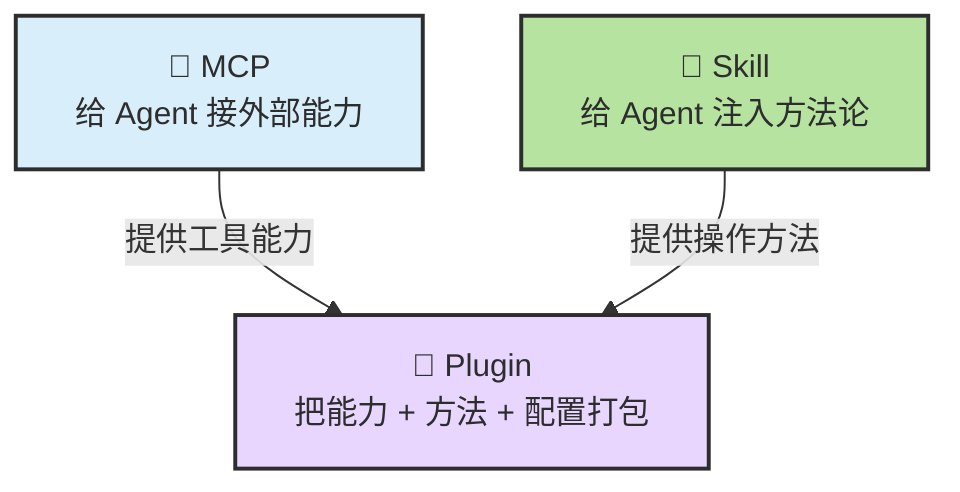
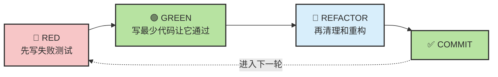

# Chapter 3 · ⚙️ 配置使用第一个：MCP、Skill、Hook、Plugin、Command

> 目标：在完成基础实验后，优先建立最值得先装、先配、先理解的扩展与规则系统。读完这一章，你应该知道为什么配置层要先于花哨技巧，以及 `MCP / Skill / Hook / Plugin / Command` 各自最小能解决什么问题。

## 📑 目录

- [1. 先分清三层：规则、会话、扩展](#1-先分清三层规则会话扩展)
- [2. CLAUDE.md 与 AGENTS.md 各管什么](#2-claudemd-与-agentsmd-各管什么)
- [3. 会话为什么会变脏](#3-会话为什么会变脏)
- [4. MCP、Skill、Hook、Plugin、Command 各在什么层](#4-mcpskillhookplugincommand-各在什么层)
- [5. 一套最低可用配置](#5-一套最低可用配置)

---

## 1. 先分清三层：规则、会话、扩展

很多“Agent 越用越乱”的问题，本质上是把三类问题混在了一起：

| 层 | 它负责什么 |
|---|---|
| 📜 规则层 | 项目事实、长期约束、默认行为 |
| 💬 会话层 | 当前任务、阶段目标、临时上下文 |
| 🔌 扩展层 | 新工具、新方法、新自动化入口 |

如果这三层不分，常见结果就是：

- 永久规则留在临时对话里
- 临时任务被写进永久规则文件
- 扩展越装越多，但没有真正解决问题

---

## 2. CLAUDE.md 与 AGENTS.md 各管什么

从工程角度看，这两类文件都属于**控制面文件**：

- `CLAUDE.md`：更常出现在 Claude Code 工作流里
- `AGENTS.md`：更常出现在 Codex 或通用代理工作流里

它们都适合承载：

- 项目简介与技术栈
- 目录结构和常用命令
- 编码规范和禁区
- 默认验证方式
- 高风险动作的停点规则

它们都不适合承载：

- 某一轮任务的临时需求
- 很快过期的调试日志
- 冗长的历史对话摘要

---

## 3. 会话为什么会变脏

会话污染通常来自三件事：

1. 不相关任务塞进同一条会话
2. 错误尝试反复累积
3. 重要约束只说过一次，没有写进文件

判断会话是否该清理，可以看这些信号：

- Agent 忘了前面强调过的约束
- 同一个问题来回修两三轮还在原地
- 对话越来越长，但有效推进越来越少
- 你自己也开始看不懂这轮历史到底发生了什么

这时不要硬顶，应该：

- 压缩关键结论
- 把长期规则写回文件
- 为新阶段开干净会话

---

## 4. MCP、Skill、Hook、Plugin、Command 各在什么层

这几个词最容易被混着用，但它们并不是一回事。

| 形态 | 更像什么 | 主要作用 |
|---|---|---|
| 🔌 MCP | 标准化连接层 | 把外部能力暴露给 Agent |
| 📝 Skill | 方法论层 | 教 Agent 怎么更稳地做事 |
| 🪝 Hook | 事件自动化层 | 在特定时机自动触发动作 |
| ⌨️ Command | 显式触发入口 | 把一段常用工作流封装成可手动调用命令 |
| 🧰 Plugin | 打包层 | 把能力、方法和配置封装成一套可安装扩展 |

一句话压缩：

> MCP 负责“接能力”，Skill 负责“教方法”，Hook 负责“卡时机”，Command 负责“给手动入口”，Plugin 负责“打包分发”。

再补一句最容易混的边界：

- `Command` 更像你显式点的按钮或斜杠命令
- `Skill` 更像系统按任务上下文自动带上的方法手册
- `Hook` 更像流程走到某个时机后自动触发的短动作

---

## 5. 一套最低可用配置

如果你不想一上来把系统装得很重，可以先只保留这套最低可用组合：

1. 一个清楚的规则文件：`CLAUDE.md` 或 `AGENTS.md`
2. 一组明确的验证命令：测试、构建、lint 至少占一种
3. 一个稳定的起手式：先探索、再计划、再执行
4. 必要时再接扩展，而不是先堆满 MCP 和 Plugin

推荐顺序是：

```text
规则文件 -> 会话习惯 -> 验证链 -> 再考虑 Command / MCP / Skill / Hook / Plugin
```

如果你只想记一个判断，就记这个：

> 🧱 **长期最稳的配置，不是“装最多扩展”，而是“把规则、会话和验证先搭稳”。**

---

## 📌 本章总结

- 规则、会话、扩展是三类不同问题，不能混着处理。
- `CLAUDE.md / AGENTS.md` 是控制面文件，不是临时聊天记录。
- 会话脏了就该清，不要把错误历史越滚越长。
- 扩展不是越多越强，先把最低可用配置搭稳。

---

## 📎 保留原文与延伸材料

配置、会话和扩展层在原教程里散落在旧章节与专题里。下面先把旧主章与 `.claude` 深挖原文整体挂进来，避免信息断层。

<details>
<summary>📎 保留原文：原 Chapter 7：扩展生态与会话管理</summary>

# Chapter 7 · ⚙️ 扩展生态与会话管理

> 🎯 **目标**：先搭出一个安全、顺手、能长期用的 Agent 工作环境，再逐步扩展到 MCP / Skill / Plugin 和会话管理。读完本章，你至少应拥有一套“最低可用配置”，而不是只会堆功能。

## 📑 目录

- [1. 🔒 权限与安全配置](#1--权限与安全配置)
- [2. 🧩 MCP / Skill / Plugin：三种扩展能力](#2--mcp--skill--plugin三种扩展能力)
- [3. 💬 会话管理：保持 Agent 精准的关键](#3--会话管理保持-agent-精准的关键)
- [📌 Part II 总结](#-part-ii-总结)

---

> 📌 **推荐阅读路线**：
> - 第一次上手：先读第 1 节，再做 F-1 / F-3，最后读第 3 节。
> - 已经日常使用 Agent：优先看第 3 节，补齐会话管理。
> - 想深挖扩展生态：完整读第 2 节，把实验当作按需扩展的工具箱。

## 1. 🔒 权限与安全配置

Agent 会在你的本地环境中读写文件、执行命令。在放手让它干活之前，你需要理解权限控制——既不能让它束手束脚，也不能让它为所欲为。

### 三种权限模式

Claude Code 提供三种权限模式，适用于不同的信任级别和工作场景：


| 模式 | 文件编辑 | 命令执行 | 适用场景 |
|:---:|:---:|:---:|---|
| 🛡️ **默认** | 需确认 | 需确认 | 初次使用、敏感项目、不熟悉的代码库 |
| ✏️ **Edit Before Ask** | ✅ 自动 | 需确认 | 日常开发——Agent 可自由编辑，但执行命令前你把关 |
| ⚡ **Bypass All** | ✅ 自动 | ✅ 自动 | 隔离沙箱内的快速原型、有完善 Git 保护的低风险任务 |

**在 CLI 中切换权限模式：**

```bash
# 使用 --dangerously-skip-permissions 启动 Bypass 模式
claude --dangerously-skip-permissions

# 日常推荐：在 CLI 交互中使用 /permissions 查看和调整
/permissions
```

**在 VS Code 插件中：**

打开 Claude Code 侧边栏 → 设置（齿轮图标）→ Permission Mode 下拉选择。

> ⚠️ **Bypass All 模式的安全提醒**：此模式下 Agent 可以不经确认执行任意 Shell 命令。只建议在以下情况使用：(1) Docker/沙箱隔离环境中，(2) 已在 Git 中保存所有重要变更，(3) 不涉及生产环境或敏感数据。

### 沙箱配置

如果你想在 Bypass 模式下安全工作，沙箱是最佳搭档。常见方案：

| 方案 | 说明 | 命令示例 |
|------|------|---------|
| **Docker 容器** | 在隔离容器中运行 Claude Code | `docker run -it -v $(pwd):/workspace node:20 bash` |
| **Git Worktree** | 在独立工作树中实验，主分支不受影响 | `git worktree add ../experiment feature-x` |
| **虚拟机/远程** | 在远程开发容器中操作 | VS Code Remote Containers |

> 💡 最轻量的"沙箱"其实就是 **Git**：确保所有修改都在版本控制下，随时可以 `git checkout -- .` 或 `git stash` 回退。

### 💡 实用小技巧：修改发送键

Claude Code CLI 默认按 `Enter` 发送消息。写多行 Prompt 时很容易误触发。

**CLI 中修改：**

```bash
# 进入 Claude Code 后执行
/config

# 找到 "Send Message Keybinding"，改为 Cmd+Enter（macOS）或 Ctrl+Enter（Linux/Windows）
```

**VS Code 插件中修改：**

1. 打开设置（`Cmd+,`）
2. 搜索 `claude code submit`
3. 将 Submit Key 从 `Enter` 改为 `Cmd+Enter`

> 💡 强烈建议新手第一时间修改此设置。在精心构建多行 Prompt 时误按 Enter 发出半成品指令，会浪费 Token 且干扰 Agent 理解。

> 📖 更多安全配置细节（权限治理框架、企业级审计、CI/CD 权限边界等）→ Part IV · 安全、权限与合规专题

---

<a id="mcp-skill-plugin"></a>

## 2. 🧩 MCP / Skill / Plugin：三种扩展能力

Claude Code 的能力不是固定的——你可以通过三种机制扩展它。在动手之前，先建立清晰的概念区分。

> 📌 **阅读定位**：这几个概念的理论分层已经在 `Ch02` 讲过了；本节默认你知道它们分别解决“接能力 / 教方法 / 打包分发”中的哪一层，这里主要讲怎么装、怎么用、怎么判断值不值得启用。

### 概念速查



| 扩展类型 | 类比 | 核心作用 | 典型例子 |
|:---:|------|---------|---------|
| 🔌 **MCP** | USB-C 接口 | 让 Agent 连接外部服务（GitHub、数据库、浏览器） | `@anthropic/github-mcp-server` |
| 📝 **Skill** | 经验丰富的同事写的操作手册 | 教 Agent "怎么做"——注入方法论和流程 | `superpowers/brainstorming` |
| 🧰 **Plugin** | 应用商店里的"一键安装包" | 把 Skill + MCP + 配置打包成开箱即用的套件 | `obra/superpowers` |

> 🔑 **一句话记忆**：MCP 给 Agent **双手**（连接外部工具），Skill 给 Agent **大脑**（注入方法论），Plugin 把两者**打包成产品**。

### Hook：把动作挂到正确时机，而不是塞进主提示词

严格说，`Hook` 更像“流程自动化插槽”，而不是第四种独立能力层。它不负责给 Agent 新知识，也不负责连外部服务，而是在特定事件发生时自动触发你已有的脚本或检查。

| 触发时机 | 常见动作 | 价值 |
|------|---------|------|
| **提交前 / 执行前** | 风险拦截、权限检查、环境确认 | 防止危险操作直接落地 |
| **文件修改后** | 自动格式化、补充 lint、记录日志 | 把机械动作从对话里挪出去 |
| **会话压缩后** | 备份摘要、写入记忆文件 | 减少长任务信息丢失 |
| **固定命令之后** | 生成报告、同步产物 | 让交付物自动归档 |

如果你已经有一条成熟的命令行链路，`Hook` 往往是把它“挂进工作流”的最轻方式。只有当你需要跨工具统一接入、统一鉴权或共享给多人时，再进一步考虑 `MCP` 或 `Plugin`。

### 实验 F-1：安装 Superpowers Plugin

[obra/superpowers](https://github.com/obra/superpowers) 是目前最知名的 Agent Skills 框架（75K+ Stars），入选 Anthropic 官方 Marketplace。它把软件开发的完整生命周期编码成了可复用的 Skill。

**安装步骤：**

```bash
# 在 Claude Code CLI 中执行（确保你在一个项目目录下）
claude

# 进入交互后，安装 Plugin
/install-plugin obra/superpowers
```

**验证安装成功：**

```bash
# 退出并重新启动 Claude Code
/exit
claude

# 输入以下内容，观察 Agent 是否自动使用 superpowers 的 brainstorming Skill
brainstorm 一下如何改进这个项目的错误处理机制
```

如果安装成功，Agent 会进入苏格拉底式提问模式——不是直接给答案，而是先通过一系列问题帮你厘清需求。

**你会看到类似这样的交互：**

```
Agent: 在我们开始设计错误处理方案之前，让我先了解几个关键问题：
1. 当前项目中最常见的错误类型是什么？
2. 这些错误通常在什么阶段被发现？
3. 你希望用户看到什么样的错误信息？
...
```

> ✅ **检查点**：Agent 能识别并使用 superpowers 的 Skill，而不是直接给你一个代码方案。

### 案例补充：安装 OpenPUA / `tanweai/pua`

如果你想再看一个**风格完全不同**的 Skill 案例，可以试试 [OpenPUA](https://openpua.ai/) / [tanweai/pua](https://github.com/tanweai/pua)。

它的定位不是“给 Agent 一整套温和的软件工程流程”，而是：

- 在 Agent 开始原地打转时，强制它停止瞎猜
- 用更强的压力式话术和清单，逼它穷尽方案再说“做不到”
- 强调 **debug methodology + proactivity**，让 Agent 主动出击，而不是等你一步步提醒

你可以把它理解成：

| Skill | 更像什么 | 更适合什么时候用 |
|------|---------|----------------|
| `superpowers` | 完整开发工作流教练 | 从 brainstorm、planning 到 TDD 的全流程协作 |
| `pua` | 高压调试教练 / 行为矫正器 | Agent 连续几轮跑偏、摆烂、放弃过早时 |

**Claude Code 安装方式：**

```bash
claude plugin marketplace add tanweai/pua
claude plugin install pua@pua-skills
```

如果当前会话没有立刻识别到新 Skill，按官方说明重启 Claude Code 一次即可。

**快速体验：**

```text
这个问题你刚才已经在同一路径上空转两次了。
请切换到更系统的调试方式：
1. 不要继续猜
2. 先列 3 个可验证假设
3. 明确下一步要看的日志、配置或源码位置
4. 每一步都给证据，不要空口判断
```

安装 `pua` 后，再配合它的命令或自动触发机制，你会明显感觉到 Agent 的语气和推进方式更“强硬”：

- 更少说“可能是环境问题”
- 更少在同一路径上重复试错
- 更倾向于先看日志、证据和根因
- 更晚放弃，也更主动切换排查路径

> ⚠️ **使用建议**：`pua` 很适合 debug 卡住、长任务失速、Agent 反复空转的场景；但不建议把这种高压风格无脑套到所有日常任务里。最稳的做法通常是：
> - 日常开发以 `superpowers` 这类流程型 Skill 为主
> - 真遇到“它开始摆烂了”的调试时刻，再切 `pua`

### 实验 F-2：安装 Claude 官方 Skill Creator

Anthropic 提供了一个官方的 Skill Creator——它能帮你从零创建新的 Skill。这是一个"meta 工具"：用 Skill 来写 Skill。

**安装步骤：**

```bash
claude

# 安装 Anthropic 官方 Skill Creator
/install-skill https://github.com/anthropics/claude-code-skill-creator
```

如果上述仓库路径有变，也可以使用 Anthropic 官方文档提供的最新安装方式。安装后，Skill Creator 会出现在你的 `~/.claude/skills/` 目录下。

**快速验证：**

```bash
# 让 Agent 使用 Skill Creator
请帮我为这个项目创建一个"代码审查"Skill，
当我说"审查代码"时，Agent 应该按照固定清单检查。
```

Agent 会引导你定义：
- Skill 的名称和触发条件
- 执行步骤和检查清单
- 输出格式

最终在项目的 `.claude/skills/` 目录下生成 `SKILL.md` 文件。

> ✅ **检查点**：你的项目中应该新增了一个 `.claude/skills/<skill-name>/SKILL.md` 文件。

### 实验 F-3：安装并使用一个 MCP

MCP（Model Context Protocol）让 Agent 可以连接外部服务。我们以 **filesystem MCP** 为例——它允许 Agent 对指定目录进行更精细的文件操作。

**方式一：使用 Claude Code 内置命令添加 MCP**

```bash
claude

# 添加 filesystem MCP Server
/mcp add filesystem npx -y @anthropic/mcp-filesystem --dir /path/to/your/project
```

**方式二：手动编辑配置文件**

编辑 `~/.claude/settings.json`，在 `mcpServers` 字段中添加：

```json
{
  "mcpServers": {
    "filesystem": {
      "command": "npx",
      "args": ["-y", "@anthropic/mcp-filesystem", "--dir", "/path/to/your/project"]
    }
  }
}
```

**如果你更想体验 GitHub MCP：**

```bash
# 需要先准备 GitHub Personal Access Token
# 在 GitHub Settings → Developer Settings → Personal Access Tokens → Fine-grained tokens 中创建

claude

/mcp add github npx -y @anthropic/github-mcp-server

# Agent 会提示你配置 GITHUB_TOKEN 环境变量
```

**验证 MCP 工作正常：**

```bash
# 重启 Claude Code 后
/mcp

# 应看到已配置的 MCP Server 及其状态
# 然后尝试让 Agent 使用它
请通过 MCP 列出当前项目根目录下的所有文件和它们的大小。
```

> 💡 **MCP 的上下文成本**：每个 MCP Server 会在每次对话中消耗约 8K-18K tokens 的上下文空间（用于工具描述和通信协议）。不需要的 MCP 不要一直挂着。

> ✅ **检查点**：`/mcp` 命令能看到你添加的 Server，且 Agent 能通过 MCP 执行对应操作。

### 实验 F-4（Meta 实验）：用 Skill Creator 生成环境配置 Skill

这个实验把前面的知识串联起来——用 F-2 安装的 Skill Creator，把"配置开发环境"这件事本身沉淀为一个可复用的 Skill。

**为什么这是"Meta 实验"**：你在教 Agent 如何教未来的 Agent（或新同事的 Agent）配置环境。这就是 Skill 体系的递归价值。

**步骤一：回顾你的配置过程**

```
请回顾我们在这个项目中做过的所有配置：
1. 安装了哪些依赖
2. 配置了哪些环境变量
3. 安装了哪些 Plugin/Skill/MCP
4. 有哪些关键的配置文件

列出来，按顺序整理。
```

> 💡 **推荐安装 Claude Code History Viewer**：这是一个可以浏览和搜索 Claude Code 对话历史的工具，帮你回溯过去的操作记录。
>
> ```bash
> # 在另一个终端中安装和使用
> npx @anthropic/claude-code-history
> ```
>
> 有了对话历史回顾，你的环境配置 Skill 会更完整。

**步骤二：让 Skill Creator 生成 Skill**

```
基于上面整理的配置步骤，请用 Skill Creator 为这个项目创建一个
"环境配置" Skill。要求：

1. Skill 名称：project-setup
2. 触发条件：当新成员说"配置开发环境"或"setup"时
3. 包含完整的依赖安装、环境变量配置、工具安装步骤
4. 每步都有验证命令，确保配置成功
5. 列出常见的配置错误和解决方法
```

**预期产出：**

```
.claude/skills/project-setup/
├── SKILL.md              # 配置流程和验证步骤
└── scripts/
    └── verify-setup.sh   # 一键验证环境配置是否完整
```

> ✅ **检查点**：你已经创建了一个可复用的 Skill。以后任何人 clone 这个项目，Agent 都能按照这个 Skill 自动配置环境。

### 实验 F-5：Superpowers 实战体验

在 F-1 中你已经安装了 superpowers。现在用它体验三个核心 Skill——brainstorming、writing-plans 和 TDD。

**体验 1：Brainstorming Skill**

进入你的项目目录，给 Agent 一个功能需求：

```
我想给这个项目添加一个自动生成 Changelog 的功能。
请先帮我梳理需求。
```

superpowers 的 brainstorming Skill 会自动激活，引导你回答：
- Changelog 覆盖哪些变更类型？
- 输入来源是 Git log 还是 Conventional Commits？
- 输出格式是什么？
- 目标受众是开发者还是最终用户？

**体验 2：Writing Plans Skill**

在 brainstorming 完成后：

```
基于刚才的讨论，请生成一份实现计划。
```

Agent 会生成一份结构化的实施计划，包含：
- 要创建/修改的文件列表
- 每个步骤的详细操作
- 验证标准
- 依赖关系

**体验 3：TDD Skill**

选择计划中的一个小模块，体验 RED → GREEN → REFACTOR 循环：

```
请用 TDD 方式实现计划中的 [模块名]：
1. 先写一个会失败的测试
2. 让我看到测试确实失败
3. 再写最少代码让测试通过
4. 看看有没有需要重构的地方
```

superpowers 的 TDD Skill 有一条硬性约束：**如果 Agent 试图在写测试之前先写实现代码，Skill 会要求它删掉代码重新来过。** 这正是 Skill 的价值——用规则约束 Agent 的行为，防止它"自作主张"。



> ✅ **总检查点**：完成 F-1 到 F-5 后，你应该：
> - 安装并使用了 superpowers Plugin
> - 用 Skill Creator 创建了自定义 Skill
> - 配置并使用了 MCP Server
> - 体验了 Skill 的递归价值（用 Skill 写 Skill）
> - 亲历了 brainstorming → plans → TDD 的完整流程

> 📖 MCP、Skill、Plugin 的深度指南见 → Part IV 进阶专题：
> - [Skill 系统专题](./ch14-skill.md)
> - [MCP 协议专题](./ch13-mcp.md)

---

> 🎯 **章节分工提醒**：这一节负责具体命令和操作时机；Ch09 只讨论为什么这些动作属于控制面，以及你该如何把它们纳入长期协作策略。

## 3. 💬 会话管理：保持 Agent 精准的关键

工具装好了，权限配好了——但如果不会管理会话，Agent 的表现会随着对话变长而快速退化。会话管理是让 Agent **持续高效**的核心技能。

### 核心原则：尽早且经常纠正方向


Agent 不是自动驾驶——它是一个需要你不断"微调方向盘"的副驾驶。两条铁律：

1. **发现 Agent 理解偏差，立刻纠正**——不要想着"再看看"，越晚纠偏成本越高
2. **任务完成一个阶段，立刻压缩或清理**——不要让历史信息污染后续判断

### 积极管理 Context

Agent 的上下文窗口是有限资源。随着对话增长，窗口逐渐填满，Agent 开始"遗忘"早期指令，产生更多错误。


你需要主动帮 Agent 管理它的"注意力"——这就是会话管理的全部意义。

### 七个关键会话操作

#### ① `/clear` — 清空上下文，重新开始

```bash
/clear
```

**使用时机**：
- 切换到一个完全不同的任务
- Agent 陷入死循环，反复犯同一个错误
- 对话中有大量已过时或无关的信息
- 调试失败尝试的历史在污染 Agent 判断

> 🔑 **`/clear` 是最强大的"重置按钮"**。遇到 Agent 行为异常时，80% 的情况 `/clear` 后重新开始就能解决。

#### ② `/compact` — 压缩历史，保留精华

```bash
# 默认压缩（Agent 自动总结关键信息）
/compact

# 带自定义摘要（推荐，更精准）
/compact "已完成用户注册 API，测试全通过。下一步实现登录功能，需要 JWT 认证。"
```

**使用时机**：
- 完成一个子任务后，要进入下一个子任务
- 对话超过 15 分钟或来回超过 10 轮
- 感觉 Agent 开始"变蠢"（忘记约束、重复提问）

> 💡 带自定义摘要的 `/compact` 比让 Agent 自动总结更可靠。你比 Agent 更清楚哪些信息对下一步最重要。

#### ③ `undo` — 撤销最后一次操作

在 Claude Code 交互中，你可以按 `Ctrl+Z`（CLI）或在 VS Code 中使用撤销按钮来回退 Agent 最近的文件修改。

**使用时机**：Agent 刚做了一个你不满意的修改，想回到上一步。

#### ④ 检查点策略 — 在关键节点生成进度摘要

```
当前任务进度如何？请给出：
1. 已完成的工作（带验证状态）
2. 当前正在进行的工作
3. 剩余未完成的工作
4. 遇到的问题或风险
```

**使用时机**：每完成一个里程碑、准备 `/compact` 之前、或交接给新会话之前。

#### ⑤ `--resume` — 恢复之前的会话

```bash
# 恢复最近一次会话
claude --resume

# 恢复指定会话（需要 session ID）
claude --resume <session-id>
```

**使用时机**：昨天没做完的任务，今天继续。Agent 会从上次的上下文继续。

> ⚠️ **注意**：恢复的会话仍然携带之前的全部历史。如果之前的上下文已经很长，考虑先 `/compact` 再继续工作。

#### ⑥ `--history` — 浏览会话历史

```bash
# 查看最近的会话列表
claude --history
```

这会显示你最近的会话列表，包含时间和摘要信息。你可以从中选择一个恢复。

#### ⑦ 跨会话交接 — 结束时生成交接摘要

```
这个任务我需要在新会话中继续。请生成任务交接摘要：
1. 当前任务的总体目标
2. 已完成的工作和关键决策
3. 未完成的工作和下一步计划
4. 需要特别注意的约束或陷阱
5. 关键文件路径列表

输出为 Markdown 格式，我好直接粘贴到新会话中。
```

在新会话中，把摘要粘贴进去：

```
这是上一个会话的任务交接：

[粘贴摘要]

请基于以上背景，继续完成未完成的工作。先确认你理解了交接内容，再开始执行。
```

### 什么时候该新开会话？

四个明确信号：

| 🚩 信号 | 说明 |
|---------|------|
| **任务已变** | 当前任务和上一个任务已经不是同一件事——不要在同一个会话里混多个不相关任务 |
| **约束遗忘** | Agent 开始忘记你反复强调的约束（比如"不要改那个文件"，结果它又改了） |
| **重复纠错** | 你已经纠正它两次以上同一个错误——失败尝试的历史在污染它的判断 |
| **对话过长** | 你感觉对话明显变长变慢——上下文窗口接近极限 |

> 🔑 **宁可多开几个短会话，也不要死守一个长会话。** 新会话的"新鲜上下文"是免费的，而污染的上下文会让 Agent 越来越蠢。

### 会话管理速查表

| 场景 | 操作 | 原因 |
|------|------|------|
| 完成一个子任务 | `/compact "保留要点：已完成 X，下一步做 Y"` | 压缩历史，保留关键信息 |
| 切换到不相关任务 | `/clear` | 彻底清空，避免上下文污染 |
| 长对话超过 15 分钟 | `/compact` 或新开会话 | 历史越多，精度越低 |
| 调试陷入死循环 | `/clear` + 重新开始 | 失败尝试的历史在干扰 Agent |
| 昨天的任务今天继续 | `claude --resume` | 保持上下文连续性 |
| 需要回看某次对话 | `claude --history` | 查找和恢复历史会话 |
| 准备交接给新会话 | 生成交接摘要 → 新会话粘贴 | 精准携带必要上下文 |

> ✅ **检查点**：你是否能回答以下问题？
> - `/clear` 和 `/compact` 的区别是什么？
> - 什么时候该新开会话，而不是继续当前会话？
> - 如何让新会话继承老会话的关键上下文？

### 最新功能：推理强度控制与高级会话工具

> 以下内容来自 Claude Code 2026 年 3 月更新（版本 >= 2.1.74）。

#### Effort — 推理强度控制

Claude Code 提供了 **Effort（推理强度）** 机制，让你控制 Agent 投入多少计算资源来解决问题：

| 档位 | Token 消耗 | 适合场景 |
|------|-----------|---------|
| **Low** | 最少 | 子 Agent 执行、文件查找、简单问答 |
| **Medium** | 适中 | Agent 工作流、代码审查、日常开发 |
| **High（默认）** | 较多 | 复杂编码、架构设计、疑难 Debug |
| **Max（仅 Opus 4.6）** | 不限 | 跨文件 Bug、关键架构决策、需完整 trace 的问题 |

```bash
# 在会话内切换
/effort

# 启动时指定
claude --effort max

# 模型建议：Sonnet 4.6 日常用 Medium，Opus 4.6 遇到真正复杂问题再开 Max
```

> 💡 Effort 是**行为信号**而非严格预算——即使设了 Low，遇到真正复杂的问题 Claude 还是会思考，只是比 High 想得少。

#### 命名 Session 与自动命名

```bash
# 启动时取名，便于后续 --resume 精确恢复
claude --name "fix-login-bug"

# 使用 Plan Mode 讨论完方案后，Claude 会自动给 session 取一个有意义的名字
```

#### Postcompact Hook

上下文压缩（`/compact`）后自动触发自定义脚本，适合长时间运行的 Agent session：

```json
// .claude/settings.json
{
  "hooks": {
    "PostCompact": [
      {
        "matcher": "",
        "hooks": [
          {
            "type": "command",
            "command": "echo 'Context compacted at $(date)' >> ~/.claude/compact.log"
          }
        ]
      }
    ]
  }
}
```

**典型用途**：自动备份压缩记录、触发日志归档、重新注入关键上下文。

#### Setup Script

在项目 `.claude/settings.json` 中配置启动脚本，Claude Code 启动时自动执行：

```json
{
  "env": {
    "NODE_ENV": "development"
  },
  "setupScript": "npm install && echo 'Environment ready'"
}
```

**适合云环境**：每次启动都需要重新配置依赖的场景。

#### 终端配色 `/color`

```bash
/color
```

同时开多个终端窗口时，用不同颜色区分，避免操作混乱。

#### Remote Control（Max/Team/Enterprise）

```bash
# 在电脑端启动远程控制服务
claude remote-control

# 手机端通过配对码连接，远程创建新 session 并操控
```

需要 Claude Code >= 2.1.74，以及 Max/Team/Enterprise 计划。

---

## 📌 Part II 总结

恭喜你完成了基础实战篇的全部内容！理论基础已经在 `Ch02` 打好，从 `Ch04` 到 `Ch07` 你进一步把这些认知变成了真实工作流：


### 你已掌握的核心能力

| 章节 | 你学到了什么 | 核心收获 |
|:---:|---|---|
| **Ch04** | 第一批实战任务 | 亲手体验 Agent 闭环，建立基本信任 |
| **Ch05** | 代码仓探索与验证驱动 | 初始化 CLAUDE.md、测试驱动、Bug 修复 |
| **Ch06** | 规划优先与高效提示术 | 探索→规划→编码三步法、@引用、Prompt 约束 |
| **Ch07** | 配置、工具生态与会话管理 | 权限配置、MCP/Skill/Plugin 实操、会话生命周期管理 |

### Part II 的三条核心原则

> 🔑 **验证比生成更重要** — Agent 写代码很快，但不验证的代码不值得信任。测试、Lint、构建是你的安全网。
>
> 🔑 **上下文是有限资源** — 精准引用 > 全量搜索，定期压缩 > 放任增长，写进文件 > 留在会话。管理好 Agent 的"注意力"。
>
> 🔑 **工具是手段，方法论是目的** — MCP、Skill、Plugin 只是载体，真正有价值的是你沉淀下来的工作流和最佳实践。Skill 体系的递归价值在于：每次实战经验都能变成下一次的加速器。

### 接下来

Part III 将把你在 Part II 中积累的实操经验系统化为工程方法论。你将学到：

- Agent 技术的发展脉络和趋势
- 六大 Agent 设计模式
- 完整的软件工程工作流
- 系统化的 Agent 控制面与会话管理
- 质量保障与验收体系

从"会用 Agent"到"善用 Agent"，方法论是关键的跃迁。

---

<div align="center">

[📚 返回目录](../../README.md#tutorial-contents) | [⬅️ 上一章：Ch06 规划与 Prompt 工程](./ch10-planning.md) | [➡️ 下一章：Ch08 工程化工作流](./ch19-engineering-workflow.md)

</div>

</details>

<details>
<summary>📎 保留原文：原专题：.claude 文件夹深度解析</summary>

---
> 📚 **Part IV · 进阶专题** | [← 返回专题目录](../../README.md#tutorial-contents)
---

# .claude 文件夹深度解析

> Claude Code 的控制中枢——理解每个文件的作用，让 Agent 完全按照你期望的方式工作。

---

## 快速总结

- **.claude/ 文件夹**是 Claude Code 的**控制中枢**，分为**项目级**（提交 git，团队共享）和**全局级**（`~/.claude/`，个人偏好）两层
- **CLAUDE.md** 是**杠杆率最高的文件**，控制 Claude 在项目中的所有行为，建议保持在 **200 行以内**
- **rules/** 把臃肿的 CLAUDE.md 拆成按关注点分离的模块，支持按文件路径限定作用域
- **commands/** 让你用 Markdown 定义斜杠命令，可以内嵌 shell 命令输出、传递参数
- **skills/** 和 commands 类似，但 Claude 会根据对话内容**自动触发**，不需要手动调用
- **agents/** 定义**专业化子代理**，在独立上下文窗口中运行
- **settings.json** 通过 allow/deny 列表控制 Claude 的**工具权限**

---

## 一、两个文件夹，不是一个

有两个 .claude 目录，不是一个：

| 项目级 (your-project/.claude/) | 全局级 (~/.claude/) |
|--------------------------------|----------------------|
| settings.json | CLAUDE.md |
| commands/ | projects/ |
| CLAUDE.md | commands/ |
| rules/ | skills/ |
| skills/ | agents/ |
| agents/ | |
| ✓ 提交 git（团队配置） | ✗ 不提交（个人配置） |
| 团队所有人共享 | 只有你自己使用 |

**项目级**保存团队配置，提交 git 后所有人都有相同的规则和命令。

**全局 ~/.claude/**保存你的个人偏好和机器本地状态（如会话历史）。

---

## 二、CLAUDE.md — Claude 的使用手册

这是整个系统中**最重要的文件**。Claude Code 启动时读取的第一个东西就是 CLAUDE.md，内容直接加载进系统提示词并在整个对话中保持。

> 简单来说：你在 CLAUDE.md 里写什么，Claude 就遵循什么。

### 多层级配置

| 优先级 | 文件 | 说明 |
|--------|------|------|
| 最高 | CLAUDE.local.md | 个人项目调整，gitignored |
| ↓ | ./CLAUDE.md（项目根目录） | 团队指令，提交 git |
| ↓ | ~/.claude/CLAUDE.md | 全局个人偏好 |
| 最低 | Managed Policy（企业级） | IT 部署，不可覆盖 |

Claude 会读取所有这些文件并合并，高优先级覆盖低优先级的冲突配置。

### 该写什么

**✅ 该写的：**

- 构建、测试和 lint 命令（`npm run test`、`make build` 等）
- 关键的架构决策（如：我们使用 Turborepo 的 monorepo）
- 不明显的陷阱（如：TypeScript 严格模式已开启，未使用的变量会报错）
- import 约定、命名模式、错误处理风格
- 主要模块的文件和文件夹结构

**❌ 不该写的：**

- 任何应该放在 linter 或 formatter 配置里的东西
- 可以通过链接指向的完整文档
- 解释理论的长篇段落

> 💡 **建议**：CLAUDE.md 保持在 **200 行以内**。超过这个长度上下文消耗过大，Claude 对指令的遵循度反而会下降。

### 精简示例

```markdown
# Project: Acme API

## Commands
npm run dev      # Start dev server
npm run test     # Run tests (Jest)
npm run lint     # ESLint + Prettier check

## Architecture
- Express REST API, Node 20
- PostgreSQL via Prisma ORM
- All handlers live in src/handlers/

## Conventions
- Use zod for request validation in every handler
- Return shape is always { data, error }
- Never expose stack traces to the client
- Use the logger module, not console.log

## Watch out for
- Tests use a real local DB, not mocks. Run `npm run db:test:reset` first
- Strict TypeScript: no unused imports, ever
```

约 20 行。Claude 在这个代码库中高效工作所需的一切，不需要反复确认。

---

## 三、rules/ 文件夹 — 模块化指令

当团队规模增长，你最终会得到一个 300 行的 CLAUDE.md，没人维护，所有人都忽略。**rules/ 文件夹**解决了这个问题。

`.claude/rules/` 里的每个 Markdown 文件都会和 CLAUDE.md 一起**自动加载**：

```
.claude/rules/
├── code-style.md
├── testing.md
├── api-conventions.md
└── security.md
```

每个文件保持聚焦，团队成员各自维护各自负责的规则文件，互不干扰。

### 路径作用域规则

真正强大的是**路径作用域规则**——在规则文件中添加 YAML frontmatter，只在 Claude 处理匹配文件时才激活：

```markdown
---
paths:
  - "src/api/**/*.ts"
  - "src/handlers/**/*.ts"
---

# API Design Rules

- All handlers return { data, error } shape
- Use zod for request body validation
- Never expose internal error details to clients
```

当 Claude 在编辑 React 组件时，不会加载这个文件。只有在 `src/api/` 或 `src/handlers/` 内部工作时才加载。没有 paths 字段的规则无条件加载。

---

## 四、commands/ 文件夹 — 自定义斜杠命令

开箱即用的 Claude Code 有内置斜杠命令（`/help`、`/compact` 等）。**commands/ 文件夹**让你添加自己的命令。

`.claude/commands/` 里的每个 Markdown 文件变成一个斜杠命令：

- `review.md` → `/review`
- `fix-issue.md` → `/fix-issue`

### 命令的核心能力：内嵌 Shell 输出

用 `` !`shell command` `` 语法在 Claude 看到 prompt 之前运行 shell 命令并嵌入输出：

```markdown
---
description: Review the current branch diff for issues before merging
---
## Changes to Review

!`git diff --name-only main...HEAD`

## Detailed Diff

!`git diff main...HEAD`

Review the above changes for:
1. Code quality issues
2. Security vulnerabilities
3. Missing test coverage

Give specific, actionable feedback per file.
```

运行 `/review` 时，真实的 `git diff` 会自动注入到 prompt 中，Claude 才看到内容。

### 传递参数

用 `$ARGUMENTS` 接收命令名后面的文本：

```markdown
---
description: Investigate and fix a GitHub issue
argument-hint: [issue-number]
---

Look at issue #$ARGUMENTS in this repo.

!`gh issue view $ARGUMENTS`

Understand the bug, trace it to the root cause, fix it, and write a test.
```

运行 `/fix-issue 234` 会把 issue 234 的内容直接灌入 prompt。

### 项目命令 vs 个人命令

- **项目命令**：`.claude/commands/` — 提交 git，团队共享，格式为 `/project:command-name`
- **个人命令**：`~/.claude/commands/` — 所有项目都可用，格式为 `/user:command-name`

---

## 五、skills/ 文件夹 — 自动触发的工作流

Skills 和 Commands 的表面类似，但**触发机制本质不同**：

| Commands | Skills |
|----------|--------|
| 你手动输入斜杠命令触发 | Claude 根据对话内容自动调用 |
| 单个 .md 文件 | 文件夹 + SKILL.md |
| 适合：可重复的手动工作流 | 适合：上下文感知的自动工作流 |

每个 Skill 在 `skills/` 下有自己的子目录，包含 `SKILL.md` 文件：

```
.claude/skills/
├── security-review/
│   ├── SKILL.md
│   └── DETAILED_GUIDE.md
└── deploy/
    ├── SKILL.md
    └── templates/
        └── release-notes.md
```

### SKILL.md 示例

```markdown
---
name: security-review
description: Comprehensive security audit. Use when reviewing code for vulnerabilities, before deployments, or when the user mentions security.
allowed-tools: Read, Grep, Glob
---

Analyze the codebase for security vulnerabilities:

1. SQL injection and XSS risks
2. Exposed credentials or secrets
3. Insecure configurations
4. Authentication and authorization gaps

Report findings with severity ratings and specific remediation steps.
Reference @DETAILED_GUIDE.md for our security standards.
```

当你说 "review this PR for security issues" 时，Claude 识别匹配并**自动调用**这个 Skill。你也可以用 `/security-review` 显式调用。

> Skills 还可以把辅助文件打包进来——`@DETAILED_GUIDE.md` 引用会拉入 SKILL.md 旁边的详细文档。命令是单个文件，Skills 是一个**包（Package）**。

> 📖 Skills 的完整指南（包括 5 种设计模式）→ [Skill 系统专题](../topics/topic-skills.md)

---

## 六、agents/ 文件夹 — 专业化子代理

当一个任务复杂到需要专门的专家时，在 `.claude/agents/` 中定义**子代理角色**：

```
.claude/agents/
├── code-reviewer.md
└── security-auditor.md
```

每个 Agent 有自己的系统提示词、工具访问权限和模型偏好：

```markdown
---
name: code-reviewer
description: Expert code reviewer. Use PROACTIVELY when reviewing PRs, checking for bugs, or validating implementations before merging.
model: sonnet
tools: Read, Grep, Glob
---

You are a senior code reviewer with a focus on correctness and maintainability. When reviewing code:

- Flag bugs, not just style issues
- Suggest specific fixes, not vague improvements
- Check for edge cases and error handling gaps
- Note performance concerns only when they matter at scale
```

### 子代理的工作原理

```
主 Agent（上下文渐渐填满）
         ↓ 派遣子代理
子代理：独立的全新上下文窗口
        只看到：系统提示 + 这个任务
        完全隔离
         ↓ 完成后返回压缩结果
主 Agent：只收到答案，不被中间探索污染
```

子代理吸收所有"脏探索"，主 Agent 只得到最终答案。

**配置字段说明：**
- **tools**：限制子代理可以使用的工具。安全审计员只需要 Read、Grep、Glob，没有理由写文件。这个限制是有意为之的。
- **model**：为聚焦的任务使用更便宜的模型。Haiku 处理大多数只读探索任务表现良好，把 Sonnet 留给需要推理的工作。

---

## 七、settings.json — 权限配置

`.claude/settings.json` 控制 Claude 能做什么和不能做什么：

```json
{
  "$schema": "https://json.schemastore.org/claude-code-settings.json",
  "permissions": {
    "allow": [
      "Bash(npm run *)",
      "Bash(git status)",
      "Bash(git diff *)",
      "Read",
      "Write",
      "Edit"
    ],
    "deny": [
      "Bash(rm -rf *)",
      "Bash(curl *)",
      "Read(./.env)",
      "Read(./.env.*)"
    ]
  }
}
```

- **allow**：Claude 不经确认直接运行的命令
- **deny**：被完全阻止的命令，无论如何都不允许
- **中间地带**：不在任何列表中的命令，Claude 会请求确认——这是有意设计的安全网

`$schema` 行在 VS Code 中启用自动补全和内联校验，建议始终包含。

### settings.local.json

创建 `.claude/settings.local.json` 存放个人不想提交的权限变更，自动 gitignored。

---

## 八、完整全景图

```
your-project/
├── CLAUDE.md                 # 团队指令（提交 git）
├── CLAUDE.local.md           # 个人覆盖（gitignored）
│
└── .claude/
    ├── settings.json         # 权限 + 配置（提交 git）
    ├── settings.local.json   # 个人权限覆盖（gitignored）
    │
    ├── commands/             # 自定义斜杠命令
    │   ├── review.md         # → /project:review
    │   ├── fix-issue.md      # → /project:fix-issue
    │   └── deploy.md         # → /project:deploy
    │
    ├── rules/                # 模块化指令文件
    │   ├── code-style.md
    │   ├── testing.md
    │   └── api-conventions.md
    │
    ├── skills/               # 自动触发的工作流
    │   ├── security-review/
    │   │   └── SKILL.md
    │   └── deploy/
    │       └── SKILL.md
    │
    └── agents/               # 专业化子代理角色
        ├── code-reviewer.md
        └── security-auditor.md

~/.claude/
├── CLAUDE.md                 # 全局个人指令
├── settings.json             # 全局个人设置
├── commands/                 # 个人命令（所有项目）
├── skills/                   # 个人 Skills（所有项目）
├── agents/                   # 个人 Agents（所有项目）
└── projects/                 # 会话历史 + 自动记忆
```

---

## 九、起步路径

如果从零开始，推荐这个渐进路径：

**第一步**：运行 `/init`。Claude Code 读取项目生成初始 CLAUDE.md，然后精简到核心要点。

**第二步**：添加 `.claude/settings.json`，配上适合技术栈的 allow/deny 规则。至少 allow 你的运行命令，deny `.env` 读取。

**第三步**：为最常做的工作流创建一两个命令。代码审查和修复 issue 是好的起点。

**第四步**：随着项目增长，当 CLAUDE.md 变得拥挤时，把指令拆分到 `.claude/rules/` 文件中。在有意义的地方按路径限定作用域。

**第五步**：添加 `~/.claude/CLAUDE.md`，写上个人偏好——比如"总是在实现之前先写类型定义"或"偏好函数式模式而不是基于类的模式"。

> 对于 95% 的项目，这就是你真正需要的全部。Skills 和 Agents 在你有值得打包的复杂重复工作流时才需要引入。

---

> **.claude 文件夹实际上是一个协议**——告诉 Claude 你是谁、你的项目做什么、以及它应该遵循什么规则。定义得越清楚，花在纠正 Claude 上的时间就越少，它花在有用工作上的时间就越多。

---

返回总览：[返回仓库 README](../../README.md)

返回目录：[README · 章节目录](../../README.md#tutorial-contents)

</details>
