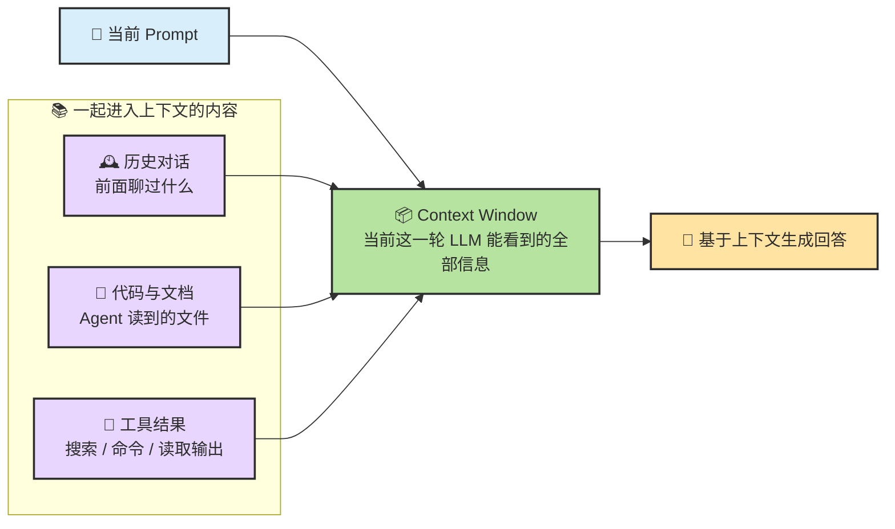
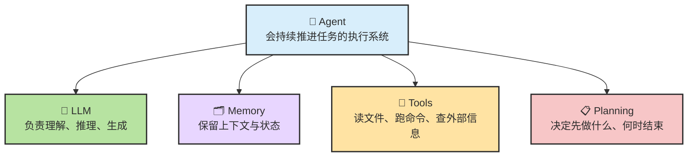

---
> 📚 **Part IV · 进阶专题** | [← 返回专题目录](../../README.md#part-iv-topics) | [↩ 回到 Ch02 主线](./ch02-concepts.md)
---

# 📖 术语速查手册

> 🎯 **目标**：给第一次接触 AI Agent 的读者提供一份“边读边查”的术语词典。它现在是配合 Ch02 / Ch04 / Ch06 使用的专题速查页，而不是主线必读章节。
>
> 📌 **使用方式**：默认沿主线从 Ch02 继续读到 Ch04。只有在术语卡住时再回到本页查词，你不需要先把整页从头背完。

## 📑 目录

- [0. 📌 本章定位](#0--本章定位)
- [1. 🧠 LLM（大语言模型）](#1--llm大语言模型)
- [2. 💬 Prompt（提示词）](#2--prompt提示词)
- [3. 📦 Context（上下文）](#3--context上下文)
- [4. 🎟️ Token（令牌）](#4-️-token令牌)
- [5. 🤖 Agent（智能体）](#5--agent智能体)
- [6. 🔑 API / API Key](#6--api--api-key)
- [7. 🖥️ CLI / IDE / App](#7-️-cli--ide--app)
- [8. 📋 Spec（规格书）](#8--spec规格书)
- [9. 🔧 Tool Calling（工具调用）](#9--tool-calling工具调用)
- [10. 🔌 MCP / Skill / Hook / Plugin](#10--mcp--skill--hook--plugin)
- [11. 📊 更多术语（简表）](#11--更多术语简表)

---

## 0. 📌 本章定位

| 问题 | 回答 |
|------|------|
| 👤 **写给谁？** | 第一次接触 AI Agent、不确定这些英文缩写是什么意思的读者 |
| 📖 **怎么用？** | 读 Ch02 / Ch04 时，遇到不懂的术语就打开本页查；如果你已有基础，可以跳过 |
| 🔗 **和 Ch02 的关系？** | Ch02 讲 Agent 的**运作原理**（怎么转起来的），本页讲**词汇表**（每个零件叫什么） |
| 🧭 **为什么路径还是 ch03？** | 为了兼容旧链接；阅读定位已经调整为“专题速查” |

> 💡 **阅读提示**：每个术语都按同一结构讲解——**一句话定义 → 日常类比 → 为什么重要 → 教程哪里会用到**。可以从头读，也可以当字典查。

---

## 1. 🧠 LLM（大语言模型）

**一句话定义**：超大规模的「文字接龙」引擎——你给它开头，它帮你续写。

| | |
|---|---|
| 🏷️ 全称 | Large Language Model（大语言模型） |
| 🎯 日常类比 | 你说「今天天气」→ LLM 接龙「不错，适合出门」。它读过海量文本，学会了统计意义上的"该接什么" |
| ⚙️ 为什么重要 | LLM 是 Agent 的「大脑」——没有它，Agent 就是一个空壳程序 |
| 📍 教程哪里用到 | Ch01 选模型、Ch02 理解 Agent 架构——到处都是它 |

**常见型号举例**：

| 厂商 | 代表模型 | 一句话印象 |
|:---:|---|---|
| Anthropic | Claude Opus / Sonnet | 🏆 当前 Coding Agent 的标杆搭档 |
| OpenAI | GPT-5.4 Pro | ⚡ 全能选手，生态最大 |
| Google | Gemini 3.1 Pro | 🌊 超长上下文，免费额度友好 |
| 深度求索 | DeepSeek-V3.2 | 💰 开源性价比之王 |
| 阿里云 | Qwen3-Max | 🌐 国产千问系列旗舰 |

> 🔑 **关键认知**：LLM 本身只会"接龙"——它不会读文件、不会跑命令。加上工具和规划能力后才变成 Agent。

---

## 2. 💬 Prompt（提示词）

**一句话定义**：你对 AI 说的话——不管长短，全都算 Prompt。

| | |
|---|---|
| 🎯 日常类比 | 在饭店点菜：你说的话就是 Prompt，厨师（LLM）据此做菜 |
| 📏 形式 | 一句话、一段话、一整份文件，都可以是 Prompt |
| 📍 教程哪里用到 | 贯穿全书——每次你给 Agent 下指令，就是在写 Prompt |

**示例**：

```
帮我写一个 Python 排序函数，要求支持升序和降序。
```

☝️ 这就是一个 Prompt。

**好 Prompt vs 坏 Prompt：**

| | 😟 模糊的 Prompt | 😊 清晰的 Prompt |
|:---:|---|---|
| 示例 | "帮我写个函数" | "用 Python 写一个 `sort_list(data, reverse=False)` 函数，输入 list[int]，返回排序后的新列表，不修改原列表" |
| 问题 | 什么语言？什么功能？什么输入？ | 语言 ✅ 函数签名 ✅ 输入输出 ✅ 约束 ✅ |
| 结果 | Agent 自由发挥，大概率不是你要的 | Agent 精准交付 |

> 💡 **记住一个原则**：你给的信息越具体，Agent 的"自由发挥空间"越小，结果越可控。

---

## 3. 📦 Context（上下文）

**一句话定义**：AI 在回答你时**能看到的所有信息**的总和。



| | |
|---|---|
| 🎯 日常类比 | 给新同事交代任务时附上的所有**背景资料**——项目文档、聊天记录、参考代码 |
| 📦 包含什么 | 你的 Prompt + 之前的对话历史 + Agent 读取的代码文件 + 工具执行的返回结果 |
| 📍 教程哪里用到 | Ch02 解释上下文、记忆与失效机制；Ch06 开始把这些原则落到实战里 |

> ⚠️ **关键认知**：Context 是有限的（以 Token 计量，见下一节）。塞太多不相关的信息进去，AI 反而会"变蠢"——它找不到重点，就开始胡说。
>
> 类比：给新同事一个小任务，你却甩过去 500 页文档——他反而更懵了。

---

## 4. 🎟️ Token（令牌）

**一句话定义**：AI 的「阅读/写作」计费单位——模型用 Token 来衡量它读了多少、写了多少。

| | |
|---|---|
| 🎯 日常类比 | 类似手机的"流量"——你用多少，就消耗多少，超出套餐就没了 |
| 📏 粗略换算 | **1 个中文字 ≈ 1~2 Token**，**1 个英文词 ≈ 1 Token**，代码中的符号也占 Token |
| 📍 教程哪里用到 | Ch01 选型中提到的"上下文窗口"就是以 Token 为单位 |

**为什么 Token 重要？两个原因：**

| 原因 | 说明 |
|:---:|---|
| 🧠 **上下文窗口有上限** | 比如 200K Token 的窗口，塞满了就会"遗忘"最早的对话。就像一块白板，写满了就得擦掉旧的 |
| 💰 **API 按 Token 计费** | 大多数模型按「输入 Token + 输出 Token」收费。写得越多、读得越多，花钱越多 |

**直观感受：**

| 内容 | 大约 Token 数 |
|------|:---:|
| "你好" | ~2 |
| 一段 200 字的需求描述 | ~200~400 |
| 一个 500 行的代码文件 | ~2,000~4,000 |
| 一整个中型项目的代码 | 可能 >100,000 |

> 💡 **实用建议**：不用精确计算——只需知道「对话越长、文件越多，Token 消耗越大」。Agent 会自动管理大部分上下文，但你可以通过精简指令来省钱省脑。

---

## 5. 🤖 Agent（智能体）

**一句话定义**：LLM + 工具 + 记忆 + 规划 = Agent。它不只会说话，还会**动手**。



**和普通聊天 AI 的区别：**

| | 💬 普通聊天 AI（如网页版 ChatGPT） | 🤖 Coding Agent（如 Claude Code） |
|:---:|---|---|
| 能做什么 | 回答问题、写文案、翻译 | 读代码、改代码、跑命令、修 Bug、写测试 |
| 工作方式 | 你问一句，它答一句 | 你给目标，它**自己规划步骤、逐步执行、遇错自修** |
| 类比 | 📞 电话里的顾问——只能出主意 | 👨‍💻 坐在你旁边的实习生——能真正动手干活 |

> 🔑 **本教程的主角**：**Coding Agent** — 专门帮你写代码的 Agent。它能进入你的项目文件夹，读懂代码结构，然后按你的指令修改代码、运行测试、修复报错，形成完整的工作闭环。

---

## 6. 🔑 API / API Key

### API = 程序之间通信的「窗口」

| | |
|---|---|
| 🏷️ 全称 | Application Programming Interface（应用程序编程接口） |
| 🎯 日常类比 | 外卖 App 和餐厅后厨之间的**出餐窗口**——你不用进厨房，只需在窗口递进订单、取走饭菜 |
| ⚙️ 在本教程中 | Agent（客户端）通过 API 向 LLM（服务端）发送请求，获取回答 |

### API Key = 你的「身份证」

| | |
|---|---|
| 🎯 日常类比 | 进写字楼刷的门禁卡——证明「你是谁」、决定「你能进哪些楼层」 |
| ⚙️ 干什么用 | 认证你的身份 + 记录你的用量 + 按量计费 |
| 📍 教程哪里用到 | Ch01 第 5 节「配置第三方 API 供应商」——把 API Key 填进配置文件 |

> ⚠️ **安全铁律**：API Key 等于钱。**永远不要**把它提交到 Git、贴到公开论坛或发给别人。泄露 = 别人拿你的钱跑 AI。

---

## 7. 🖥️ CLI / IDE / App

Agent 有三种常见的使用形态，就像同一部电影可以在影院、电视、手机上看：

| 缩写 | 全称 | 一句话说明 | 举例 |
|:---:|---|---|---|
| **CLI** | Command-Line Interface | 🖥️ 命令行界面——黑框框里敲字，程序员最熟悉的方式 | `claude`、`codex` |
| **IDE** | Integrated Development Environment | 🧩 集成开发环境——写代码的编辑器，有代码高亮、文件树、调试器 | VS Code、Cursor、JetBrains |
| **App** | Application | 📱 独立桌面应用——图形界面，鼠标点点就能用 | Claude 桌面版、Antigravity |

**本教程以 CLI + IDE 为主**（因为编程场景下效率最高），但方法论对三种形态通用。

> 💡 **完全不会用命令行？** 别紧张——Ch01 会从 0 教你。安装和基本使用只需要记住几条命令就够了。

---

## 8. 📋 Spec（规格书）

**一句话定义**：给 Agent 的「施工图纸」——把"要做什么"写成一份清晰的文档。

| | |
|---|---|
| 🏷️ 全称 | Specification（规格说明） |
| 🎯 日常类比 | 装修房子前的设计图——不画图就动工，结果大概率不是你想要的 |
| 📍 教程哪里用到 | Ch04 「Spec-Driven Development」专节 |

**一份好的 Spec 包含三个核心要素：**

| 要素 | 说明 | 示例 |
|:---:|---|---|
| ✅ **要做什么** | 明确的功能目标 | "给 User 模型加一个 `email_verified` 字段" |
| 🚫 **不做什么** | 明确的边界 | "不修改现有的登录流程" |
| 🧪 **怎么验证** | 完成标准 | "单元测试通过 + 迁移脚本可正常执行" |

> 💡 **为什么需要 Spec？** 因为口头描述模糊，Agent 一旦"理解歪了"就会自由发挥。Spec 越清楚，Agent 越不容易跑偏——就像给实习生一份详细的需求文档，比口头吩咐靠谱得多。

---

## 9. 🔧 Tool Calling（工具调用）

**一句话定义**：Agent 输出一条「调用指令」，让外部系统替它执行真实操作。

| | |
|---|---|
| 🎯 日常类比 | 老板（LLM）坐在办公室下指令，秘书（工具系统）去跑腿执行：打电话、发邮件、查档案 |
| ⚙️ 工作原理 | LLM 不能直接读文件或跑命令——它只会输出一段结构化指令（如 `read_file("main.py")`），Agent 框架接收后代为执行，再把结果喂回给 LLM |
| 📍 教程哪里用到 | Ch02 详解 Agent 的 Think-Act-Observe 循环 |

**常见工具类型：**

| 工具 | 做什么 | 举例 |
|:---:|---|---|
| 📖 读文件 | 查看项目代码 | `Read("src/main.py")` |
| ✏️ 写文件 | 修改或创建代码 | `Write("src/utils.py", content)` |
| ▶️ 执行命令 | 跑测试、安装依赖 | `Shell("npm test")` |
| 🔍 搜索 | 在项目中查找代码 | `Grep("TODO", "src/")` |
| 🌐 联网 | 查文档、搜答案 | `WebSearch("Python 3.12 新特性")` |

> 🔑 **核心概念**：Tool Calling 是 Agent 区别于普通聊天 AI 的关键能力——它让 LLM 从"只动嘴"变成了"能动手"。

---

## 10. 🔌 MCP / Skill / Hook / Plugin

它们都和“扩展 Agent 怎么工作”有关，但并不在同一层：

| 名称 | 一句话定义 | 类比 |
|:---:|---|---|
| 🔌 **MCP** | 标准化的工具接口协议 | **USB-C 接口**——统一标准，任何符合协议的工具都能即插即用 |
| 📝 **Skill** | 方法论手册（Markdown 文件） | **操作手册**——教 Agent "遇到这类任务该怎么做"的步骤说明 |
| 🪝 **Hook** | 在特定事件前后自动执行自定义逻辑 | **自动感应开关**——某个时刻一到，动作自动发生 |
| 📦 **Plugin** | 打包好的 Skill + MCP + Hook + 配置的集合 | **一键安装工具包**——装一个就能获得一整套能力 |

**展开说明：**

| | MCP | Skill | Hook | Plugin |
|---|---|---|---|---|
| 🏷️ 全称 | Model Context Protocol | — | — | — |
| 📄 本质 | 一套通信协议规范 | 一份 Markdown 指导文件 | 事件驱动的自动化逻辑 | Skill + MCP + Hook + 配置的集合体 |
| 🎯 解决什么 | "让 Agent 连接外部工具和数据源" | "教 Agent 某个领域的最佳实践" | "在某个流程节点自动插入动作" | "一键获得某项完整能力" |
| 💡 例子 | 连接 GitHub、Jira、数据库 | 代码审查 Skill、TDD Skill | Postcompact 后自动备份摘要 | Superpowers 框架 |
| 📍 教程哪里详讲 | Ch02 理论 / Ch08 实操 | Ch02 理论 / Ch08 实操 | Ch02 理论 / Ch08 会话自动化 | Ch02 理论 / Ch08 实操 |

> 💡 **新手优先级**：先理解 Tool Calling，再理解 Ch02 里的四层分工；需要动手安装和配置时，再去看 Ch08。

---

## 11. 📊 更多术语（简表）

以下术语在教程中会零星出现，先留个印象，遇到再回来查。

| 术语 | 中文 | 一句话解释 | 类比 |
|---|:---:|---|---|
| 🌀 **Hallucination** | 幻觉 | AI 一本正经地编造不存在的事实（假函数名、假库、假链接） | 信口开河的同事 |
| 🎓 **Fine-tuning** | 微调 | 用特定数据对模型做"专项培训"，让它更擅长某类任务 | 入职后的岗前培训 |
| 📚 **RAG** | 检索增强生成 | 让 AI 先查资料再回答，减少编造 | 开卷考试——先翻书再答题 |
| 📐 **Embedding** | 嵌入 | 把文本变成一串数字（向量），用于语义搜索和比较相似度 | 给每段文字打一个"GPS 坐标" |
| ⚡ **Inference** | 推理 | 模型接收输入、产出输出的过程 | 学生拿到考题后答题的过程 |
| 📜 **System Prompt** | 系统提示 | 预设给 AI 的"角色说明书"，用户看不到但一直在生效 | 上班前的晨会：今天你扮演高级工程师 |
| 🤖 **Agentic Coding** | 智能体编程 | 用 AI Agent 来协助或驱动编程——**本教程的核心主题** | 你指挥 AI 写代码，而不是你自己逐行敲 |

> 🔑 **Hallucination 特别提醒**：Agent 有时候会"自信满满地犯错"——比如引用一个根本不存在的函数。这就是为什么本教程反复强调**验证比生成更重要**。

---

## 🎉 准备就绪？

恭喜！你已经掌握了 Agentic Coding 的核心词汇表。如果后续章节遇到不确定的术语，随时翻回这里查阅。

**三秒回顾**：

| 你现在知道了 | |
|---|---|
| 🧠 LLM | Agent 的大脑，超大规模文字接龙引擎 |
| 💬 Prompt | 你对 AI 说的话 |
| 📦 Context | AI 回答时能看到的所有信息 |
| 🎟️ Token | AI 的阅读/写作计费单位 |
| 🤖 Agent | LLM + 工具 + 记忆 + 规划 |
| 🔑 API Key | 你的身份证和钱包 |
| 📋 Spec | 给 Agent 的施工图纸 |
| 🔧 Tool Calling | Agent "动手"的方式 |
| 🔌 MCP / Skill | 扩展 Agent 能力的方式 |

👉 主线阅读建议：回到 Ch02 继续理解原理，或者直接进入 Ch04 开始第一次 Agent 实战。

---

<div align="center">

[📚 返回目录](../../README.md#tutorial-contents) | [↩ 回到 Ch02 主线](./ch02-concepts.md) | [➡️ 继续主线：Ch04 第一批实战](./ch04-first-practice.md)

</div>
