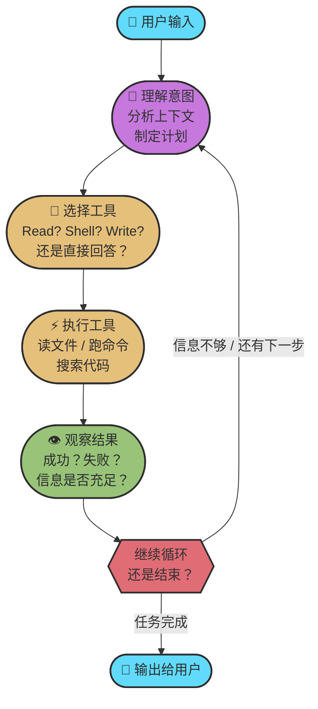
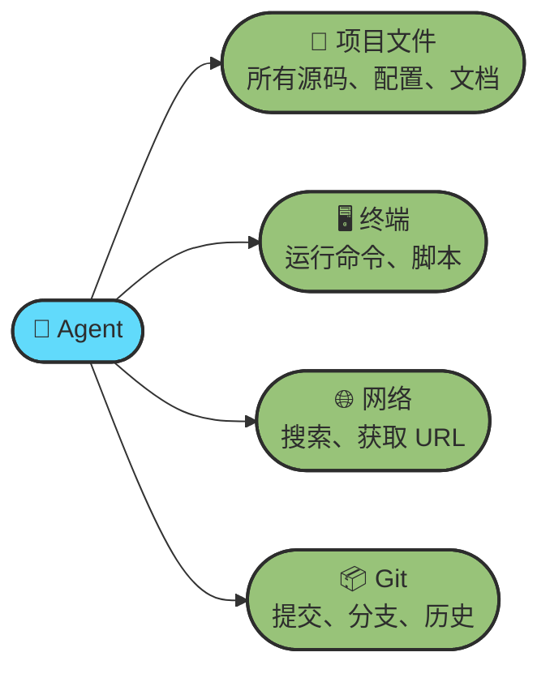
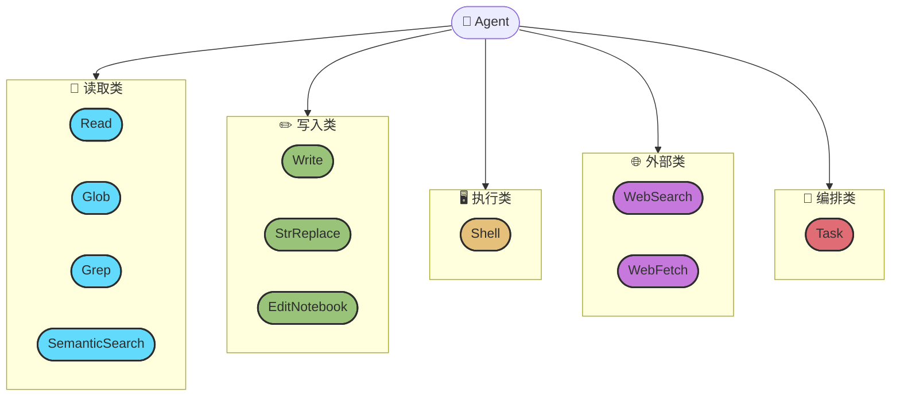
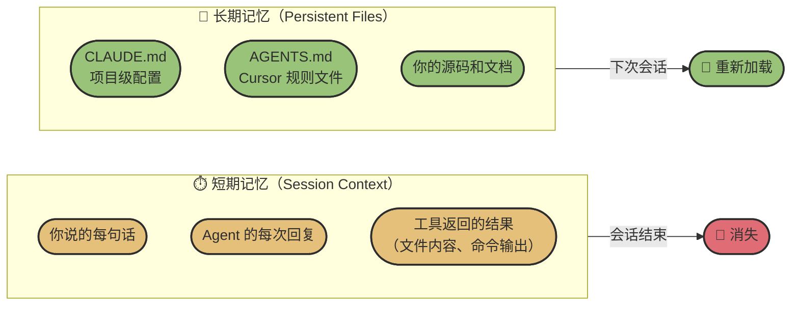
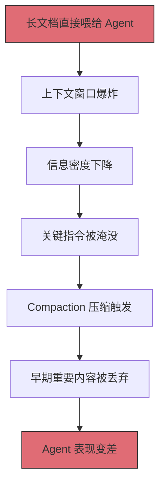

# Chapter 5 · 🔧 Agent 内部机制与工具体系

> 🎯 **目标**：深入理解 Agent 的内部运行机制——它如何循环工作、能调用哪些工具、记忆从哪来又到哪去。Ch02 给了你"是什么"的认知框架，本章给你"怎么运转"的操作级理解。读完后你会知道，Agent 每一次回复背后到底发生了什么。

## 📑 目录

- [1. 🔄 Agent 的核心循环](#1--agent-的核心循环)
- [2. 🌐 Agent 能访问什么（和不能访问什么）](#2--agent-能访问什么和不能访问什么)
- [3. 🧰 五类内置工具详解](#3--五类内置工具详解)
- [4. 💾 Session 与 Context：短期记忆 vs 长期记忆](#4--session-与-context短期记忆-vs-长期记忆)
- [5. 📄 长文档如何"杀死"你的 Agent](#5--长文档如何杀死你的-agent)

---

## 1. 🔄 Agent 的核心循环

### 它不是"一问一答"

你在终端里输入一句话，Agent 几秒后给你一大段回复——看起来像是一次性生成的。但实际上，**Agent 内部可能已经循环了十几轮**。每一轮都在做同一件事：思考 → 行动 → 观察结果 → 决定下一步。

这就是 **Agentic Loop（智能体循环）**——Agent 区别于普通聊天 AI 的核心机制。

### 完整循环可视化



### 一次真实请求的内部轨迹

当你说 `"帮我找到项目里所有未使用的依赖并清理掉"`，Agent 内部可能经历了这样的循环：

| 轮次 | Agent 思考 | 使用工具 | 观察结果 |
|:---:|---|---|---|
| 1 | 需要了解项目类型和包管理器 | `Read` → package.json | 发现是 Node.js 项目，用 npm |
| 2 | 需要看哪些包被声明了 | `Read` → package.json 的 dependencies | 列出了 23 个依赖 |
| 3 | 需要在代码里搜索每个包是否被引用 | `Grep` → 搜索 import/require | 发现 3 个包没有被任何文件引用 |
| 4 | 确认一下这些包是否在配置文件里被间接使用 | `Grep` → 搜索包名在 config 目录 | 其中 1 个在 webpack 配置里被用到 |
| 5 | 只有 2 个包确实未使用，准备删除 | `Shell` → `npm uninstall pkg-a pkg-b` | 命令成功执行 |
| 6 | 验证删除后项目是否正常 | `Shell` → `npm test` | 所有测试通过 |
| 7 | 任务完成，汇报结果 | — | 输出给用户 |

> 💡 **关键认知**：**你看到的一条回复，背后是 Agent 在自主循环。** 它不是一次性输出所有文字，而是在"思考-行动-观察"的循环中逐步推进，直到认为任务完成。这就是为什么 Agent 能处理复杂的多步骤任务，而普通的 LLM 对话做不到。

### Agentic Loop vs 普通 LLM 对话

| 维度 | 普通 LLM 对话 | Agent（Agentic Loop） |
|------|-------------|----------------------|
| 交互模式 | 你问一句，它答一句 | 你给目标，它自主循环直到完成 |
| 工具使用 | 无（仅生成文本） | 读文件、跑命令、搜索、写代码 |
| 错误处理 | 你发现问题后手动追问 | 自动观察结果，发现错误后自行修正 |
| 典型轮次 | 1 轮 | 5~30 轮（复杂任务可达 50+） |

---

## 2. 🌐 Agent 能访问什么（和不能访问什么）

理解 Agent 的"感知边界"非常重要——它决定了 Agent 能帮你做什么、不能做什么。

### ✅ Agent 能访问的资源



| 资源 | 说明 | 典型用途 |
|------|------|---------|
| 📁 **项目文件** | Agent 可读写你工作区内的所有文件 | 阅读源码、修改代码、创建新文件 |
| 🖥️ **终端** | Agent 可在你的 Shell 中执行命令 | 跑测试、安装依赖、Git 操作、构建项目 |
| 🌐 **网络** | Agent 可搜索网页和获取 URL 内容（部分工具有域名白名单限制） | 查文档、搜索 StackOverflow、获取 API 参考 |
| 📦 **Git** | 通过终端执行 Git 命令 | 查看 diff、创建分支、提交变更 |

### ⚠️ 默认受限但可突破的资源

Agent 的访问限制是**安全默认值，而非硬性围墙**。理解"默认不能"和"真的不能"的区别很重要：

| 资源 | 默认行为 | 实际情况 | 如何突破 |
|------|---------|---------|---------|
| 📂 **其他项目目录** | 内置 Read/Write 工具被沙箱限制在当前工作区 | **Shell 工具不受此限制**——Agent 可通过 `cat`、`ls` 等命令访问系统任意路径 | 直接告诉 Agent 目标路径，它会自动使用 Shell；或使用 `--add-dir`（CLI）/ `/add-dir`（会话内）显式扩展工作区 |
| 📂 **系统配置文件** | 内置写入工具不能操作 `/etc`、`~/.ssh` 等 | Shell 工具可以读取这些文件，写入则取决于用户权限和审批 | 明确指示 Agent 操作目标路径，Shell 命令执行前会要求你确认 |

> 💡 **关键区分**：Agent 的内置 Read/Write 工具有沙箱保护，但 Shell 工具本质上就是在你的终端执行命令，权限等同于你自己在终端操作。这意味着——**如果你告诉 Agent 去读 `/home/user/other-project/config.yaml`，它会用 Shell 执行 `cat` 来完成，通常不会有问题。**

### ❌ 真正不能访问的资源

| 资源 | 原因 | 你需要做什么 |
|------|------|-------------|
| 🚫 **浏览器 GUI** | 默认不能打开浏览器、点击按钮、截屏 | 使用 MCP 工具（如 Playwright）扩展此能力 |
| 🚫 **需要认证的私有服务** | Agent 没有你的 SSH Key、VPN 等凭证 | 手动操作，或配置代理转发 |
| 🚫 **运行时内存状态** | Agent 不能 attach 到正在运行的进程 | 使用日志输出、断点调试等间接方式 |

> ⚠️ **权限模型**：大多数 Agent 工具都实现了"权限审批"机制——当 Agent 要执行写文件、运行 Shell 命令等操作时，会弹出确认提示。这是你的安全网。如果觉得审批太频繁，可以在配置中对低风险操作设置自动批准，但**不可逆操作（如 `rm -rf`、`git push --force`）永远应该手动确认**。

---

## 3. 🧰 五类内置工具详解

Agent 的"手脚"就是工具。不同 Agent 产品的工具命名不同，但从功能上可以归纳为**五个类别**。以下以 Claude Code 为例，但这套分类框架适用于所有主流 Agent。

### 工具全景图



### 📖 第一类：读取类工具

> Agent 用这些工具来**理解你的项目**——它们是 Agent 的"眼睛"。

| 工具 | 做什么 | 什么时候用 |
|------|--------|-----------|
| **Read** | 读取指定文件的全部或部分内容 | 阅读源码、查看配置文件、读 README |
| **Glob** | 按文件名模式搜索（如 `**/*.ts`） | 找到所有测试文件、所有 React 组件 |
| **Grep** | 按内容正则搜索（基于 ripgrep） | 找到某个函数在哪被调用、搜索报错信息 |
| **SemanticSearch** | 按语义搜索代码（"这段代码是做什么的"） | 不知道确切名称时，用自然语言描述来找代码 |

**实际场景**：当你说"帮我找到用户认证相关的代码"，Agent 可能先用 `Glob` 找到所有文件，再用 `Grep` 搜索 `auth` 关键词，最后用 `SemanticSearch` 确认语义相关的模块。三个工具配合使用，逐步缩小范围。

### ✏️ 第二类：写入类工具

> Agent 用这些工具来**修改你的代码**——它们是 Agent 的"手"。

| 工具 | 做什么 | 什么时候用 |
|------|--------|-----------|
| **Write** | 创建新文件或完整覆写文件 | 创建新组件、生成配置文件 |
| **StrReplace** | 精确替换文件中的指定文本 | 修改现有代码中的特定片段（最常用的编辑方式） |
| **EditNotebook** | 编辑 Jupyter Notebook 的单元格 | 修改数据分析或 ML 实验的 Notebook |

**实际场景**：Agent 修 Bug 时的典型模式是先用 `Read` 找到问题代码，再用 `StrReplace` 精确替换有问题的行——而不是重写整个文件。这种"外科手术式"的编辑既精准又安全。

> 💡 **为什么不是直接覆写整个文件？** `StrReplace` 只修改你指定的部分，不会误伤其他代码。这是 Agent 最常用的编辑方式，因为它产生的 diff 最小、最容易审查。

### 🖥️ 第三类：执行类工具

> Agent 用 Shell 工具来**与你的开发环境互动**——它是 Agent 的"手脚延伸"。

| 工具 | 做什么 | 什么时候用 |
|------|--------|-----------|
| **Shell** | 在终端中执行任意命令 | 跑测试、安装依赖、Git 操作、构建项目、运行脚本 |

**Shell 是 Agent 最强大也最需要谨慎的工具。** 它能做的事情极其广泛：

```text
# Agent 通过 Shell 能做什么
npm install         ← 安装依赖
npm test            ← 跑测试
git diff            ← 查看变更
git commit          ← 提交代码
python script.py    ← 运行脚本
docker build .      ← 构建容器
curl https://...    ← 网络请求
```

> ⚠️ **安全提醒**：正因为 Shell 能执行任意命令，所有 Agent 工具都会在执行 Shell 命令前要求用户确认。对于已知安全的命令（如 `npm test`、`git status`），可以设置自动批准规则来减少打断。

### 🌐 第四类：外部类工具

> Agent 用这些工具来**获取外部世界的信息**。

| 工具 | 做什么 | 什么时候用 |
|------|--------|-----------|
| **WebSearch** | 搜索互联网（类似 Google 搜索） | 查最新的 API 文档、搜索报错信息的解决方案 |
| **WebFetch** | 获取指定 URL 的网页内容 | 阅读在线文档、获取 API 参考页面 |

**实际场景**：当 Agent 遇到一个它不确定的 API 用法时，它可能会先 `WebSearch` 搜索官方文档，然后 `WebFetch` 获取文档页面的内容，再根据文档来写代码。这比"凭记忆瞎编"可靠得多。

> 💡 **减少幻觉的关键机制**：Agent 有能力在不确定时查阅外部资料，而不是编造答案。当你发现 Agent 给的 API 用法看起来可疑时，可以提示它"请先查阅官方文档确认"。

### 🤖 第五类：编排类工具

> Agent 用这个工具来**分配子任务给其他 Agent 实例并行处理**。

| 工具 | 做什么 | 什么时候用 |
|------|--------|-----------|
| **Task** | 启动子 Agent 并分配独立任务 | 需要同时做多件互不依赖的事（如同时搜索多个目录、同时跑多种分析） |

**实际场景**：当你说"帮我理解这个大型项目的整体架构"，Agent 可能启动多个子 Agent 同时探索不同目录（一个看前端、一个看后端、一个看基础设施），然后汇总各自的发现，比串行处理快得多。

### 五类工具总览对比

| 类别 | 工具 | 风险级别 | 是否需要审批 |
|------|------|:---:|:---:|
| 📖 读取类 | Read、Glob、Grep、SemanticSearch | 🟢 无风险 | 通常不需要 |
| ✏️ 写入类 | Write、StrReplace、EditNotebook | 🟡 中风险 | 建议审查 diff |
| 🖥️ 执行类 | Shell | 🔴 高风险 | 默认需要确认 |
| 🌐 外部类 | WebSearch、WebFetch | 🟢 低风险 | 通常不需要 |
| 🤖 编排类 | Task | 🟡 中风险 | 取决于子任务内容 |

> 🔑 **跨工具通用性**：虽然不同 Agent 产品的工具命名不同（Cursor 叫 `codebase_search`，Codex CLI 有自己的沙箱命令），但从功能上都可以归入这五类。掌握这个分类框架，切换任何 Agent 工具都能快速上手。

---

## 4. 💾 Session 与 Context：短期记忆 vs 长期记忆

### 两种记忆机制

Agent 的"记忆"分为两类，运作方式完全不同：



### 短期记忆：会话上下文

**短期记忆 = 当前会话中 Agent 能"看到"的所有信息。** 它包括：

| 内容 | 来源 | 大小 |
|------|------|------|
| 你的所有消息 | 你输入的每一句话 | 小 |
| Agent 的所有回复 | 包括思考过程和工具选择 | 中 |
| 工具返回的结果 | 读取的文件内容、命令输出、搜索结果 | **大**（这是上下文膨胀的主要原因）|
| 系统提示 | CLAUDE.md 的内容、工具定义等 | 中 |

> ⚠️ **上下文窗口 ≠ 无限**。每个模型都有上下文窗口大小限制（如 200K tokens）。随着会话推进，窗口逐渐填满，最早的信息会被压缩或截断，Agent 的"精度"会逐步下降。

### 长期记忆：持久化文件

**长期记忆 = 写进文件的信息，跨会话持久存在。** 最重要的两种载体：

| 文件 | 用途 | 谁来维护 |
|------|------|---------|
| **CLAUDE.md** | Claude Code 的项目级配置——告诉 Agent 项目规范、编码风格、构建命令等 | 你 + Agent（`/init` 自动生成初稿，你手动修改） |
| **AGENTS.md** / **.cursor/rules** | Cursor 等工具的规则文件，功能类似 | 你手动编写 |
| **源码和文档** | Agent 修改的代码本身就是"持久化的工作成果" | Agent 写入，你审查 |

**CLAUDE.md 示例**（用 `/init` 命令生成的典型内容）：

```markdown
# Project: my-web-app

## Build & Test
- Install: `npm install`
- Test: `npm test`
- Lint: `npm run lint`
- Build: `npm run build`

## Code Style
- Use TypeScript strict mode
- Prefer functional components with hooks
- Error messages in English, comments in Chinese

## Architecture
- Frontend: React + Vite
- Backend: Express + PostgreSQL
- Auth: JWT tokens stored in httpOnly cookies
```

### 上下文衰减：越长的会话越"糊"

随着会话变长，Agent 的表现会逐渐下降。这不是 Bug，而是所有基于 Transformer 的模型都有的特性：


**应对策略**：

| 策略 | 做法 |
|------|------|
| 🆕 **及时开新会话** | 一个任务完成后开新会话，而不是在同一个会话里做完所有事 |
| 📝 **关键信息写进文件** | 重要的决策、架构约定写进 CLAUDE.md，而不是只在对话里说一遍 |
| 🎯 **保持指令精准** | 不要一次性给 Agent 10 个要求，分批推进 |
| 📋 **让 Agent 做摘要** | 长会话中，定期让 Agent 总结当前进度和待办，作为后续的上下文锚点 |

### 🔑 核心认知

> **写进文件的才是记忆，留在会话里的只是临时笔记。**
>
> 如果你在会话中告诉 Agent"我们项目用 Tab 缩进"，下次新会话它就忘了。但如果你把这条规则写进 CLAUDE.md，每次会话 Agent 都会自动加载它。
>
> 这就是为什么 Ch04 的实验中我们反复强调：**好的实践要及时沉淀到 CLAUDE.md**。

---

## 5. 📄 长文档如何"杀死"你的 Agent

长文档是上下文污染最常见的来源。理解它的破坏机制，才能设计出正确的处理策略。

### 长文档的破坏链条



### 长上下文 ≠ 记忆

理解这三个概念的本质区别，是避免踩坑的前提（§4 已介绍了短期与长期记忆；这里补充 RAG 检索这一第三维度）：

| 概念 | 本质 | 关键问题 |
|------|------|---------|
| **Context Window** | 临时工作台 | 对话过长自动压缩，session 结束归零 |
| **Memory（文件）** | 持久化存储 | 需要主动写入文件，否则下次会话消失 |
| **RAG 检索** | 按需取用 | 减少无效信息干扰，只引入当前相关片段 |

### 正确的分层处理策略

不要一次性把整个文档塞给 Agent。正确做法是分层处理：


**三条实践建议**：

1. **Chunking（分块）**：将长文档切分成语义完整的片段，每块保留足够的上下文信息。不要用固定字数切，用自然段落或语义边界切。
2. **摘要优先**：先让 Agent 读摘要/索引，再按需深入细节。建立"文档地图"，让 Agent 知道每部分在哪，而不是一次性全塞进去。
3. **渐进式披露**：根据当前任务动态加载相关内容，而不是把整个文档作为背景上下文。

> ⚠️ **常见误区**：把 200 页 PDF 直接粘贴到对话里，寄希望于 Agent "自己找重点"。Agent 确实会读，但它无法知道哪些是你真正关心的部分——只有你知道。帮 Agent 做好信息过滤，它才能做好任务执行。

### 顶级实践者的四条原则

仅靠技术分层（Chunking、RAG、渐进式披露）还不够，上下文管理做得好的工程师通常还遵循这四条行为习惯：

| # | 原则 | 做法 | 反面教材 |
|:---:|------|------|----------|
| 1 | **研究与实现彻底分离** | 用一个干净 session 做信息研究，再用另一个全新 session 只负责执行 | 同一个越来越长的 session 里又查资料又改代码 |
| 2 | **用任务合同锚定终点** | 用测试用例或截图验收明确定义「完成标准」，而不是让 Agent 自己决定什么时候「做完了」 | 指令模糊，让 Agent 随意判断完成与否 |
| 3 | **反向利用 AI 的谄媚倾向** | 说「过一遍代码逻辑，汇报发现」，而不是「找 bug」——后者会让 AI 没 bug 也造一个出来 | 让 AI「找问题」，然后对所有「发现」照单全收 |
| 4 | **设计对抗式验证** | 对重要结论：让红队 Agent 找茬、蓝队 Agent 反驳、裁判 Agent 评判，三方博弈比单方面输出更可靠 | 只有一个 Agent 自说自话，没有独立验证 |

> 💡 **核心洞察**：顶级工程师不是在追逐更复杂的框架，而是做减法——极度精准地控制信息注入，把 `CLAUDE.md` 当逻辑目录而不是知识垃圾场。**你需要的不是更强的工具，而是成为更好的上下文管理者。**

---

## 📌 本章总结

| 核心概念 | 一句话总结 |
|----------|-----------|
| **Agentic Loop** | Agent 不是一问一答，而是在"思考→行动→观察"的循环中自主推进，一次请求可能内部循环十几轮 |
| **感知边界** | Agent 内置工具默认限于当前工作区，但 Shell 工具可突破此限制；浏览器 GUI、私有服务、运行时状态是真正的硬边界 |
| **五类工具** | 读取类（理解代码）→ 写入类（修改代码）→ 执行类（运行命令）→ 外部类（搜索信息）→ 编排类（分配子任务） |
| **短期 vs 长期记忆** | 会话上下文会消失，写进文件（CLAUDE.md）的才能跨会话存活 |
| **上下文衰减** | 会话越长精度越低，及时开新会话 + 关键信息持久化是最佳应对 |

> 🔑 **本章核心**：理解 Agent 的循环机制和工具体系，是后续所有实验和进阶技巧的基础。当你知道 Agent 内部在做什么，你就能更好地设计指令、预判它的行为、在它犯错时快速定位原因。

---

<div align="center">

[📚 返回目录](../../README.md#tutorial-contents) | [⬅️ 上一章：Ch04 第一批实战](./ch04-first-practice.md) | [➡️ 下一章：Ch06 代码探索与验证](./ch06-explore-verify.md)

</div>
