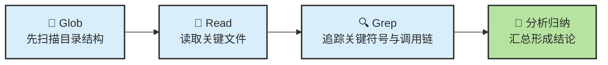
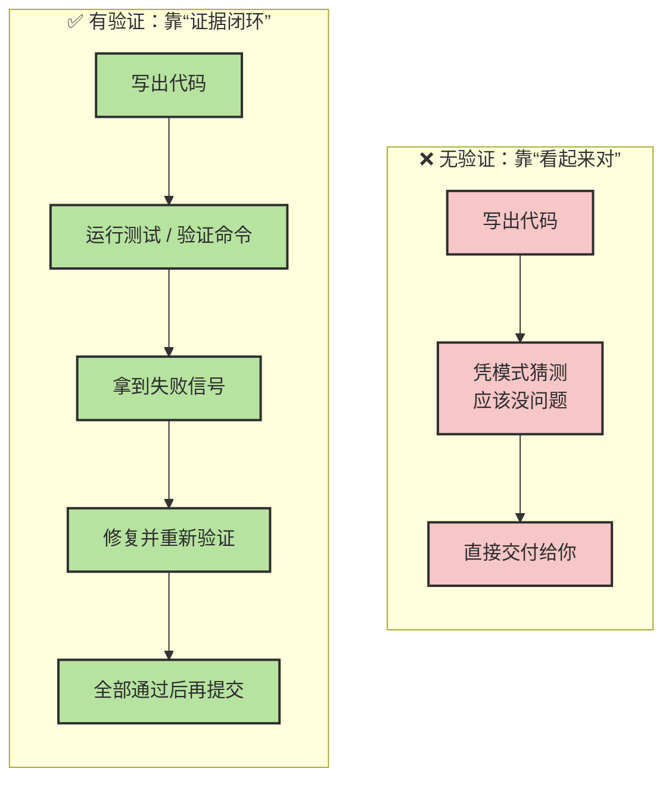
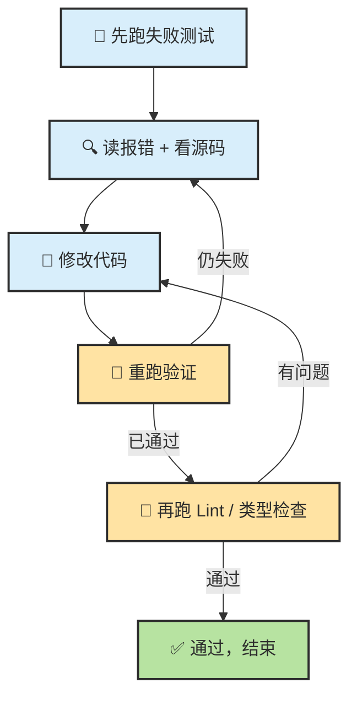
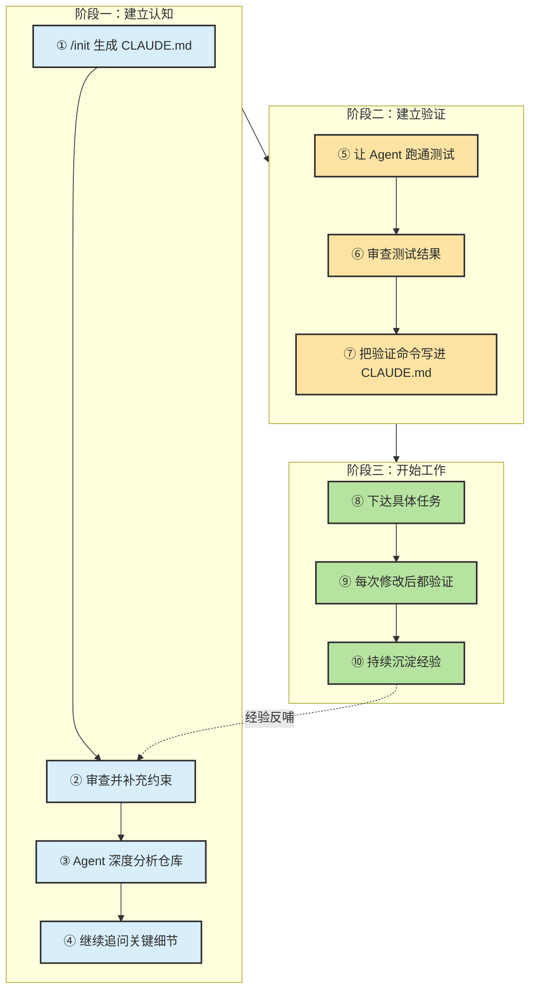

# Chapter 6 · 🔍 代码探索与验证驱动

> 🎯 **目标**：通过两个实验掌握两项关键 Agent 技能——用 CLAUDE.md 建立项目长期记忆并深度理解代码仓，以及用验证驱动工作流让 Agent 自证其工作质量。读完本章，你将具备在任何真实项目中高效使用 Agent 的核心能力。

## 📑 目录

- [实验 A：初始化 CLAUDE.md 并理解代码仓](#实验-a初始化-claudemd-并理解代码仓)
  - [1. 用 /init 生成 CLAUDE.md](#1-用-init-生成-claudemd)
  - [2. 让 Agent 深度分析代码仓](#2-让-agent-深度分析代码仓)
  - [3. 向 Agent 提问不清楚的细节](#3-向-agent-提问不清楚的细节)
  - [检查点 A](#-检查点-a)
- [实验 B：验证驱动工作流 — 让 Agent 自证清白](#实验-b验证驱动工作流--让-agent-自证清白)
  - [1. 核心原理](#1-核心原理当-agent-能验证自己的工作时表现显著提升)
  - [2. 告诉 Agent 你的测试环境](#2-告诉-agent-你的测试环境)
  - [3. 验证驱动的 Bug 修复流程](#3-验证驱动的-bug-修复流程)
  - [4. 前端/可视化场景的验证技巧](#4-前端可视化场景的验证技巧)
  - [检查点 B](#-检查点-b)
- [📌 关键 Takeaway](#-关键-takeaway)

---

## 实验 A：初始化 CLAUDE.md 并理解代码仓

> 🎯 场景：你刚 clone 了一个项目（自己的或开源的），想让 Agent 快速建立对项目的全面理解，并把关键信息固化下来供后续会话复用。

### 1. 用 /init 生成 CLAUDE.md

**第一步：进入项目目录，启动 Claude Code**

```bash
cd your-project
claude
```

**第二步：输入 `/init` 命令**

在 Claude Code 交互界面中直接输入：

```
/init
```

Agent 会自动扫描项目的目录结构、README、配置文件、依赖清单，然后在项目根目录生成一份 `CLAUDE.md`。

**第三步：查看生成的 CLAUDE.md**

```bash
cat CLAUDE.md
```

一个典型的自动生成结果类似这样：

```markdown
# Project Overview
This is a Python web application using FastAPI...

# Tech Stack
- Python 3.11, FastAPI, SQLAlchemy, Alembic
- PostgreSQL, Redis
- pytest for testing

# Project Structure
src/
  api/         # API 路由
  models/      # 数据模型
  services/    # 业务逻辑
  utils/       # 工具函数
tests/         # 测试文件

# Development Commands
- Install: `pip install -e ".[dev]"`
- Test: `pytest`
- Lint: `ruff check .`
- Run: `uvicorn src.main:app --reload`
```

**第四步：审查并手动调整**

`/init` 生成的内容是 Agent 对项目的"第一印象"，通常准确但不完整。你需要补充 Agent 无法从代码中推断的信息：

```markdown
# 补充建议添加的内容

## 编码规范
- 所有 API 端点必须返回统一的 ResponseModel 格式
- 数据库操作必须在 service 层，不允许在 route 层直接操作 ORM
- 新增 API 必须同步补充 OpenAPI 文档和测试

## Agent 注意事项
- 不要修改 alembic/versions/ 下的迁移文件
- 环境变量统一从 src/config.py 读取，不要使用 os.getenv
- 测试数据库和生产数据库 schema 可能不一致，以 alembic 迁移为准

## 提交规范
- Commit message 使用 Conventional Commits 格式
- PR 必须附带测试和变更说明
```

> 💡 **经验**：CLAUDE.md 不需要事无巨细——写入的应该是 **Agent 容易犯错的地方**和**项目独有的约束**。Agent 能从代码中读到的信息（如"这个文件有 200 行"）不需要写进去。

> 🔑 **核心原则**：把 CLAUDE.md 当作给新同事的入职手册——你希望他第一天就知道哪些"潜规则"？

### 2. 让 Agent 深度分析代码仓

CLAUDE.md 建立了基础记忆，接下来让 Agent 做一次深度分析。在同一个会话中输入：

```
请全面分析这个仓库：

1. 整体架构和模块划分
2. 核心数据流：一个请求从进入到返回经历了哪些模块
3. 关键依赖：哪些第三方库是核心的，各自负责什么
4. 代码质量现状：有没有明显的技术债或不一致

先不要修改任何文件，只做分析。
```

**观察 Agent 的行为**

此时你会看到 Agent 使用一系列工具来理解项目：



Agent 通常会按以下顺序探索：

1. **扫描根目录** — 读取 `README.md`、`pyproject.toml`（或 `package.json`）、`Makefile`
2. **遍历源码目录** — 通过 Glob 找到所有模块入口
3. **追踪关键路径** — 从 `main.py` 或路由定义出发，Grep 关键函数调用链
4. **读测试文件** — 理解现有测试覆盖了哪些场景

**结果审查：Agent 的理解是否准确？**

Agent 给出分析后，重点审查以下几点：

| 审查项 | 怎么判断 | 如果有误 |
|--------|---------|---------|
| 架构理解 | 核心模块的职责描述是否正确 | 指出错误，让 Agent 重新阅读相关文件 |
| 数据流 | 关键路径是否完整，有没有遗漏中间件 | 提示 Agent 检查被遗漏的文件 |
| 依赖分析 | 关键库是否识别正确，版本有无遗漏 | 通常准确度很高，偶尔遗漏不常见的库 |
| 技术债判断 | 是否过度武断或过于保守 | Agent 倾向于"礼貌性"淡化问题，可以追问 |

> ⚠️ **常见陷阱**：Agent 可能把项目描述得"比实际更好"——它倾向于假设代码是合理的。如果你知道项目有问题，主动指出让 Agent 重新评估。

### 3. 向 Agent 提问不清楚的细节

在 Agent 给出全局分析后，针对你不理解或想确认的细节追问。越具体的问题，Agent 回答越准确：

```
# ❌ 太宽泛的问题
这个项目的认证是怎么做的？

# ✅ 具体的问题
src/middleware/auth.py 中的 verify_token 函数：
1. 它校验的是 JWT 还是 session token？
2. token 过期后的处理逻辑是什么？
3. 有没有处理 token 刷新的场景？
```

```
# ❌ 模糊的追问
数据库操作有什么问题吗？

# ✅ 聚焦的追问
src/services/user_service.py 中的 create_user 函数：
1. 它是否在事务中执行？
2. 如果邮箱已存在，返回什么错误？
3. 密码是在哪一层做的哈希？
```

> 💡 **经验法则**：如果你的问题能适用于任何项目（"这个项目怎么做认证"），那就太宽泛了。好的问题应该包含**具体的文件名、函数名或行为描述**。

### ✅ 检查点 A

完成实验 A 后，你应该具备：

- [ ] 项目根目录有一份 `CLAUDE.md`，包含技术栈、项目结构、常用命令
- [ ] 你已手动补充了项目特有的编码规范和 Agent 注意事项
- [ ] Agent 对项目架构的分析与你的理解一致（或你已纠正了偏差）
- [ ] 你能用具体的文件和函数名向 Agent 提出聚焦的问题

---

## 实验 B：验证驱动工作流 — 让 Agent 自证清白

### 1. 核心原理：当 Agent 能验证自己的工作时，表现显著提升

Anthropic 官方最佳实践中有一条被反复强调的原则：

> **"When Claude can verify its own work—by running tests, comparing screenshots, and validating output—it performs significantly better."**
>
> — Anthropic, Claude Code Best Practices

这不是一句口号，而是一个有数据支撑的结论。给 Agent 可运行的验证命令后：

| 维度 | 无验证 | 有验证 | 提升幅度 |
|------|--------|--------|:---:|
| 首次正确率 | ~40-50% | ~70-85% | **+30~35%** |
| Bug 修复成功率 | ~50% | ~80-90% | **+30~40%** |
| 代码规范一致性 | 经常偏离 | 高度一致 | 显著 |

**为什么验证能带来如此大的提升？**



没有验证时，Agent 只能依赖训练数据中的模式匹配来判断"应该没问题"。有验证时，Agent 获得了**明确的对错信号**，可以进入"修改→验证→再修改"的闭环，就像人类开发者做 TDD 一样。

### 2. 告诉 Agent 你的测试环境

验证驱动的前提是：**Agent 知道怎么运行验证命令**。

**第一步：让 Agent 了解项目环境**

```
请阅读项目的 README 和配置文件，然后：
1. 安装项目依赖
2. 运行全部测试
3. 把测试结果汇报给我

如果安装或运行过程中有报错，先分析原因再尝试解决。
```

Agent 会执行类似以下操作（以 Python 项目为例）：

```bash
# Agent 自动执行的命令序列
pip install -e ".[dev]"    # 安装项目和开发依赖
pytest                      # 运行测试
pytest --tb=short -q        # 如果输出太长，Agent 会精简参数
```

**第二步：审查测试报告**

Agent 会汇报测试结果。你需要关注：

```
# Agent 可能的汇报
测试结果：
- 总计 47 个测试
- 通过 43 个
- 失败 3 个（test_auth.py::test_token_refresh, ...）
- 跳过 1 个

失败用例分析：
1. test_token_refresh: 预期返回 200，实际返回 401
   可能原因：refresh token 的过期时间设置有误
2. ...
```

> 💡 **关键细节**：确保 CLAUDE.md 中包含测试命令。这样每次新会话开始时，Agent 就知道该怎么验证，无需你重复说明。

```markdown
# 建议添加到 CLAUDE.md 的验证命令
## 验证命令
- 单元测试：`pytest tests/ -x --tb=short`
- Lint 检查：`ruff check . && mypy src/`
- 类型检查：`mypy src/ --strict`
- 全量验证：`make check`（运行 lint + test + type check）
```

### 3. 验证驱动的 Bug 修复流程

这是验证驱动工作流最典型的应用场景：用失败的测试来驱动修复。

**标准流程**



**实操：用一个 Prompt 启动整个循环**

```
test_auth.py::test_token_refresh 这个测试失败了。

请按以下流程修复：
1. 先运行 `pytest tests/test_auth.py::test_token_refresh -v` 看到失败信息
2. 分析失败原因，阅读相关源码
3. 给出你的修复方案，说明改什么、为什么
4. 实施修复
5. 重新运行测试，确认通过
6. 运行 `ruff check .` 确保没有引入 lint 问题
7. 如果失败，继续修复，直到全部通过
```

Agent 会自动进入"修改→跑测试→看结果→继续修改"的循环，直到所有验证通过。

**一个更进阶的用法：写测试 → 再修 Bug**

```
src/services/payment_service.py 中的 process_refund 函数
在金额为 0 时会抛出未处理的 ZeroDivisionError。

请按以下步骤修复：
1. 先写一个会重现这个 bug 的测试用例（应该失败）
2. 运行测试，确认它确实失败
3. 修复 process_refund 函数
4. 重新运行测试，确认通过
5. 运行完整测试套件，确认没有引入回归
```

这就是 TDD 的经典 RED→GREEN 循环，由 Agent 执行但由你驱动。

> 🔑 **关键区别**：普通修复是"改代码→希望没问题"；验证驱动修复是"有失败测试→改代码→测试通过→确认没问题"。后者的可靠性远高于前者。

### 4. 前端/可视化场景的验证技巧

后端项目有 pytest、Jest 等自动化测试工具。但前端和可视化场景怎么验证？

**方法一：截图验证**

如果你使用 Claude Code 的 VS Code 插件，可以直接在聊天中粘贴截图：

```
我在浏览器中看到这个页面（粘贴截图）。
导航栏的下拉菜单在移动端展开后溢出了屏幕右侧。
请修复这个 CSS 问题，修复后我会再截图给你确认。
```

**方法二：让 Agent 自己跑截图对比**

对于有自动化 UI 测试的项目：

```
运行 Playwright 的视觉回归测试：
npx playwright test --update-snapshots

然后对比新旧截图，告诉我有哪些页面的渲染发生了变化。
```

**方法三：让 Agent 生成可预览的产物**

```
修改完组件后，请启动 Storybook 并告诉我哪个 URL 可以预览。
我会在浏览器中查看效果后告诉你是否 OK。
```

**方法四：用结构化输出做间接验证**

当没有自动化测试框架时，让 Agent 做可验证的声明：

```
修改完 CSS 后，请列出：
1. 改了哪些文件、哪些属性
2. 预期的视觉变化是什么
3. 在哪些屏幕尺寸下需要检查（手机/平板/桌面）

我来逐个验证。
```

> 💡 **前端验证的核心**：即使没有自动化测试，也要让 Agent 明确声明"我改了什么、预期效果是什么"，这样你的人工验证才有焦点。

### ✅ 检查点 B

完成实验 B 后，你应该具备：

- [ ] CLAUDE.md 中包含了项目的测试命令和 Lint 命令
- [ ] Agent 能自主运行测试并分析失败原因
- [ ] 你体验过至少一次完整的"失败→分析→修复→通过"循环
- [ ] 你知道在无自动化测试的场景下如何做间接验证

---

## 把两个实验串起来：完整工作流

实验 A 和实验 B 不是孤立的——它们构成了你在**任何新项目**中使用 Agent 的标准起步流程：



每次你接手一个新项目或新仓库，都可以按这个流程走一遍。前两个阶段通常在 30-60 分钟内完成，但它们带来的效率提升会贯穿整个项目生命周期。

---

## 📌 关键 Takeaway

### 三条核心原则

> 🔑 **CLAUDE.md 是 Agent 的"长期记忆"** — 它不是可选配置，而是与 Agent 高效协作的基础设施。每个项目都应该有一份，并且随项目演进持续更新。
>
> 🔑 **给 Agent 可运行的验证命令 = 代码质量提升 2-3x** — 这是性价比最高的一个习惯。把 `pytest`、`ruff check`、`npm test` 写进 CLAUDE.md，每次让 Agent 改完代码就跑一遍。
>
> 🔑 **验证比生成更重要** — Agent 生成代码的速度已经极快，瓶颈早已不是"写得够不够快"，而是"写得对不对"。把注意力放在验证环节，而不是纠结 Prompt 怎么写更好。

### 速查表

| 场景 | 做什么 | 对应命令/操作 |
|------|--------|-------------|
| 初次接触项目 | 生成 CLAUDE.md | `/init` |
| 补充项目约束 | 手动编辑 CLAUDE.md | 添加编码规范、注意事项 |
| 理解项目架构 | 让 Agent 做全局分析 | 结构化 Prompt + "不要修改代码" |
| 不理解某段代码 | 给出具体文件和函数名提问 | 越具体越好 |
| 修改代码后 | 让 Agent 运行验证 | `pytest` / `npm test` / `ruff check` |
| 修 Bug | 失败测试驱动修复循环 | RED → 分析 → 修复 → GREEN |
| 前端验证 | 截图 + 结构化变更说明 | 粘贴截图或让 Agent 声明预期变化 |
| 经验沉淀 | 更新 CLAUDE.md | 踩过的坑、新发现的约束 |

### 与后续章节的衔接

本章你学会了**探索**和**验证**。接下来：

- **Ch07 · 规划优先与高效提示术** — 在探索的基础上，学习如何给 Agent 写出更好的任务指令
- **Ch08 · 配置、工具生态与会话管理** — 深入 CLAUDE.md 之外的配置体系：MCP、Skills、Hooks

---

<div align="center">

[📚 返回目录](../../README.md#tutorial-contents) | [⬅️ 上一章：Ch05 Agent 内部机制](./ch05-agent-mechanics.md) | [➡️ 下一章：Ch07 规划与 Prompt 工程](./ch07-plan-prompt.md)

</div>
