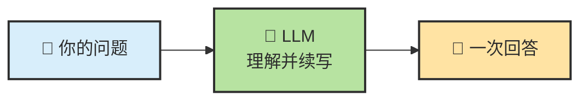
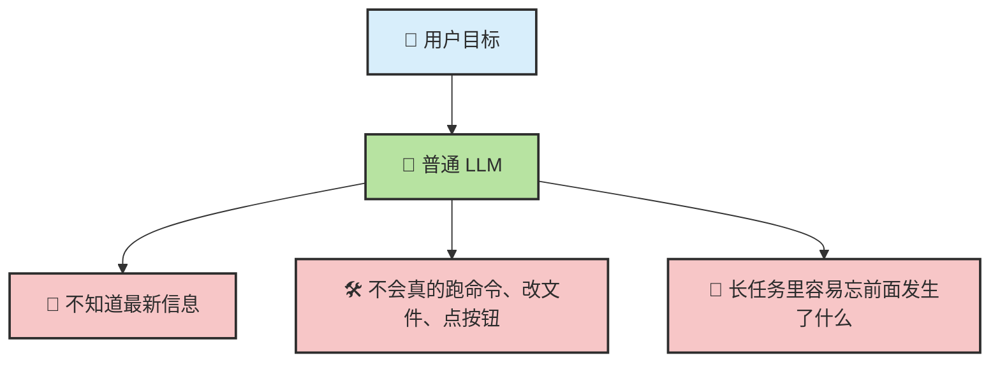
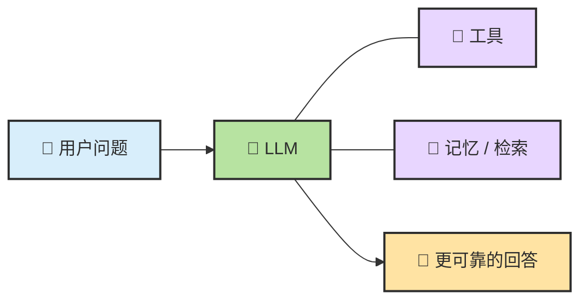
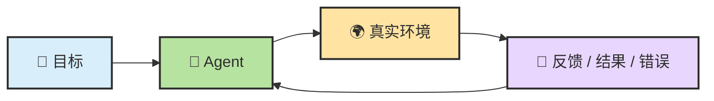

# Chapter 7 · 🧠 从 LLM 到 Agent

> 目标：把"模型很聪明"这件事和"Agent 能持续干活"这件事分开理解。读完这一章，你应该知道为什么普通 LLM 不等于 Agent，为什么 Agent 需要闭环，以及 `Model + Harness` 这层压缩视角为什么比只看模型更有用。

## 📑 目录

- [0. 先校准几个直觉](#0-先校准几个直觉)
- [1. 普通 LLM 更像开环系统](#1-普通-llm-更像开环系统)
- [2. 中间还有一层：Augmented LLM](#2-中间还有一层augmented-llm)
- [3. Agent 的关键跨越：进入反馈闭环](#3-agent-的关键跨越进入反馈闭环)
- [4. 从四件套到 Model + Harness](#4-从四件套到-model--harness)
- [5. Prompt、Context、Harness 不是一回事](#5-promptcontextharness-不是一回事)
- [6. 几个问题驱动问答](#6-几个问题驱动问答)

---

## 0. 先校准几个直觉

很多人第一次认真用 Agent，最容易有这几个误解：

| 常见直觉 | 更接近现实的说法 |
|---|---|
| Agent 就是更强的聊天模型 | Agent 是围绕模型搭出来的行动系统 |
| 模型越强，Agent 就一定越好用 | 结果更接近 `Model × Context × Task Structure × Verification` |
| 给的信息越多越好 | 关键不是量大，而是相关、干净、可回放 |
| 问一次就该直接得到最终答案 | 很多任务必须在环境反馈里反复推进 |

---

## 1. 普通 LLM 更像开环系统

如果要给普通 LLM 找一个最有画面感的比喻：

> 🧠 **它像一个被放在培养缸里的大脑。**

这个大脑非常会思考，也非常会语言表达。你问它"如果你是程序员，你会怎么修这个 bug"，它可以把步骤讲得头头是道，甚至听起来比很多真人都更像那么回事。

但问题在于，它首先是一个**脱离真实环境的大脑**。它擅长的是脑内推演，而不是和外部世界持续交互。



普通 LLM 最擅长的是：

- 理解输入
- 续写输出
- 在当前上下文里给出看起来合理的回答

但它默认停在这里：

```text
输入 -> 生成回答 -> 结束
```

所以它很像一个**开环系统**：

- 会分析
- 会解释
- 甚至会给出很像样的方案
- 但默认不会主动去接触真实环境、执行动作、再拿结果回来纠偏

### 为什么它看起来很聪明，却经常在关键时刻掉链子

大众读者最容易困惑的一点是：既然模型已经这么聪明，为什么还要搞 Agent 这套复杂结构？

因为只靠"输入一次，回答一次"，很多任务根本做不完。



比如你说：

- "帮我总结这个仓库最近 5 次提交的变化"
- "把这个 bug 修掉，并且补上测试"
- "查一下现在的汇率，再帮我比较两个付款方案"

这些任务都不只是"想一想"，还需要：

- 去拿外部信息
- 去操作真实环境
- 记住前面做过什么
- 根据结果决定下一步

这里最容易误导新手的两个现象是：

| 现象 | 它真正说明什么 |
| --- | --- |
| 🧵 长对话里"说记住了"，后面却答不出来 | 它没有稳定持久记忆系统，只能依赖当前上下文窗口 |
| ➗ 简单计算或简单推理也可能答错，而且答得很自信 | 语言流畅不等于每一步中间推理都可靠 |

这两个现象后面还会再出现，但它们本质上分别属于：

- `Memory / Context` 问题
- `Verification` 问题

---

## 2. 中间还有一层：Augmented LLM

在普通 LLM 和完整 Agent 之间，往往还隔着一层：

```text
LLM -> Augmented LLM -> Agent
```

这里的 `Augmented LLM` 指的是：

- 给模型加上检索
- 给模型加上工具
- 给模型加上状态回写
- 但还没有把整条任务闭环做完整



这层很重要，因为很多产品看起来已经"会调工具"，但本质上仍然更像：

> 🧩 **带外设的模型，而不是会持续推进任务的工作系统。**

你可以把三者粗略区分成这样：

| 形态 | 核心特征 | 常见短板 |
| --- | --- | --- |
| 裸 LLM | 单次生成 | 看不到执行结果，缺少状态和验证 |
| Augmented LLM | 有工具和上下文增强 | 能力增强了，但未必有稳定控制面 |
| Agent | 有目标推进闭环 | 复杂度上升，需要更强的 Harness |

理解这一层以后，后面你就不容易把"会搜一下、会调一下工具"误认成"已经是成熟 Agent"。

---

## 3. Agent 的关键跨越：进入反馈闭环

Agent 最关键的变化，不是说得更多，而是进入了这条闭环：

```text
Observe -> Plan -> Act -> Verify -> Continue
```



也就是说，它不再只靠脑内推演，而是：

1. 先决定下一步
2. 去执行一个动作
3. 读取真实反馈
4. 根据反馈修正路径

这时模型更像：

> 🔁 **闭环里的推理引擎，而不是一次性回答器。**

ReAct 是这一步里最值得记住的桥梁。它强调的不是"多想"，而是：

- 先判断下一步该做什么（Reason）
- 真去执行一个动作（Act）
- 再根据观察结果更新判断（Observe）

也就是说，Agent 的关键跨越不是"脑内推演更长了"，而是：

> 🛠️ **开始把推理、行动、观察和验证接成循环。**

如果把这一节压成一句话，就是：

> 🔁 **普通 LLM 停在"给答案"，Agent 进入了"边想边试边看"的闭环。**

---

## 4. 从四件套到 Model + Harness

理解 Agent，有两种都很有用的视角。

### 视角一：四件套

```text
Agent = LLM + Planning + Tools + Memory
```

它适合解释系统里到底有哪些核心部件。

### 视角二：压缩为两层

```text
Agent = Model + Harness
```

这里：

- `Model` 负责理解、推理、生成
- `Harness` 负责把上下文、工具、状态、验证、恢复和边界组织起来

这条压缩视角很重要，因为工程里大量问题都不在模型本体，而在模型外侧的系统层。

如果你只想记一个更实用的工程判断，可以记这条：

```text
Agent 效果 ≈ Model × Context × Task Structure × Verification
```

也就是说，模型强只是其中一个变量。真正决定结果上限的，往往还包括：

- 这一轮到底看到了什么
- 任务有没有被拆成可执行步骤
- 有没有把输出拉回现实做验证

---

## 5. Prompt、Context、Harness 不是一回事

这三个词经常被混用，但它们不在同一层：

| 概念 | 它回答什么问题 |
|---|---|
| Prompt | 这一轮你怎么说 |
| Context | 这一轮模型实际看到了什么 |
| Harness | 整个系统如何组织行动、验证和恢复 |

所以很多所谓"Prompt 问题"，其实是：

- Context 装配问题
- Harness 设计问题
- 验证链缺失问题

这也是为什么同一个模型，换一套工作流和规则文件，表现会像换了一个系统。

---

## 6. 几个问题驱动问答

**Q：模型更强，是不是 Agent 就自然更强？**  
不一定。更强模型当然有帮助，但如果 Context 很脏、任务没拆开、验证链缺失，结果仍然会跑偏。

**Q：只要能调工具，就已经算 Agent 了吗？**  
不一定。很多系统只是 `Augmented LLM`，会调用能力，但还没有把持续推进、状态回写和恢复动作组织成闭环。

**Q：同一个 session 里连续聊天，是不是等于模型一直记着？**  
也不等于。更常见的真实情况是 runtime 在维护更大的 session state，并在每一轮重新组装 context。这个边界会在 [Ch11 · Memory、Context 与 Harness](./ch11-memory-context-harness.md) 里展开。

**Q：为什么后面会反复讲 Planning、Memory、Tools 和 Harness？**  
因为 Agent 不是单一能力，而是一个系统。你看到的"稳不稳"，最后通常都是这些部件一起决定的。

---

## 📌 本章总结

- LLM 默认更像开环系统，擅长回答，不天然擅长持续执行。
- Agent 的本质不是"更会说"，而是进入了反馈闭环；`ReAct` 之所以关键，就是因为它把推理、行动和观察接上了。
- `Augmented LLM` 是一层常见中间态，它解释了为什么"会调工具"还不等于"完整 Agent"。
- 四件套视角有助于理解组成，`Model + Harness` 视角更有利于工程诊断。
- `Prompt / Context / Harness` 分层，是后续方法论章节的共同前提。

## 📚 继续阅读

- 想把 Agent 的四件套一次看全：继续看 [Ch08 · Agent = Model + Harness = LLM + Planning + Memory + Tools](./ch08-agent-formula.md)
- 想理解"看起来会推理"和"真正可靠"之间的差距：继续看 [Ch09 · LLM 推理基础](./ch09-llm-reasoning-basics.md)

<div align="center">

[📚 返回目录](../../README.md#tutorial-contents) | [⬅️ 上一章：Ch06 基础概念与术语](./ch06-glossary.md) | [➡️ 下一章：Ch08 Agent = Model + Harness](./ch08-agent-formula.md)

</div>
