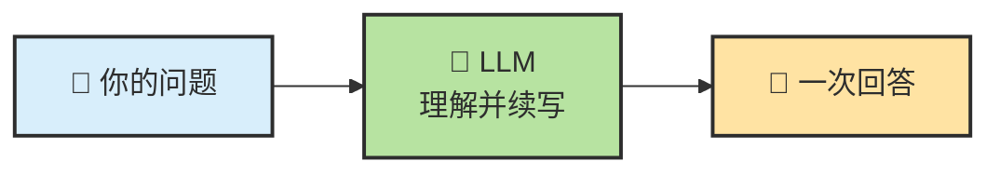
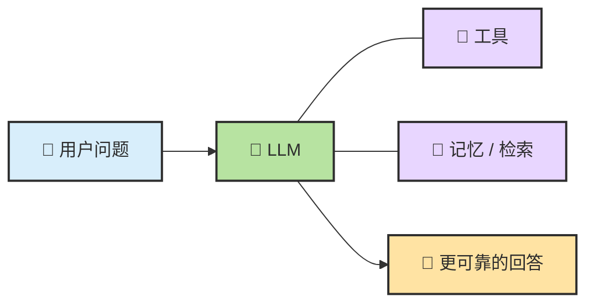
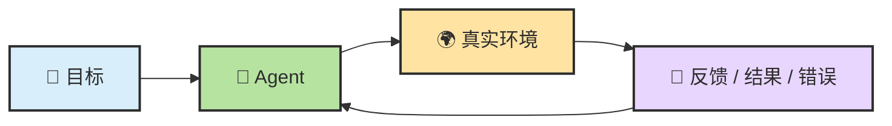
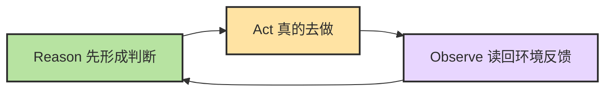
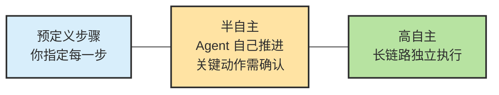

# Chapter 7 · 🧠 从 LLM 到 Agent

> 🎯 **目标**：把"模型很聪明"和"Agent 能持续干活"这两件事分开理解。读完这一章，你应该知道为什么普通 LLM 不等于 Agent，为什么 Agent 需要闭环，以及 ReAct 为什么是关键跨越。
>
> 📌 **和 Ch08 的分工**：本章讲"为什么需要从 LLM 走到 Agent"（概念跨越）；Ch08 讲"Agent 到底由哪些部件组成"（系统公式）。

## 📑 目录

- [0. 先校准几个直觉](#0-先校准几个直觉)
- [1. 普通 LLM 更像开环系统](#1-普通-llm-更像开环系统)
- [2. 中间还有一层：Augmented LLM](#2-中间还有一层augmented-llm)
- [3. Agent 的关键跨越：进入反馈闭环](#3-agent-的关键跨越进入反馈闭环)
- [4. 一次真实请求的内部轨迹](#4-一次真实请求的内部轨迹)
- [5. 自主性不是开关，而是一条光谱](#5-自主性不是开关而是一条光谱)
- [6. 几个问题驱动问答](#6-几个问题驱动问答)

---

## 0. 先校准几个直觉

很多人第一次认真用 Agent，最容易有这几个误解：

| 常见直觉 | 更接近现实的说法 |
|---|---|
| Agent 就是更强的聊天模型 | Agent 是围绕模型搭出来的行动系统 |
| 模型越强，Agent 就一定越好用 | 结果更接近 `Model × Context × Task Structure × Verification` |
| 给的信息越多越好 | 关键不是量大，而是相关、干净、可回放 |
| 问一次就该直接得到最终答案 | 很多任务必须在环境反馈里反复推进 |

---

## 1. 普通 LLM 更像开环系统

如果要给普通 LLM 找一个最有画面感的比喻：

> 🧠 **它像一个被放在培养缸里的大脑。**

这个大脑非常会思考，也非常会语言表达。但它首先是一个**脱离真实环境的大脑**——擅长脑内推演，而不是和外部世界持续交互。



它很像一个**开环系统**：会分析、会解释、甚至会给出很像样的方案，但默认不会主动去接触真实环境、执行动作、再拿结果回来纠偏。

**缸中大脑最大的问题，不是不会想，而是想完以后碰不到世界。**

### 为什么它看起来很聪明，却经常在关键时刻掉链子

因为只靠"输入一次，回答一次"，很多任务根本做不完。比如：

- "帮我总结这个仓库最近 5 次提交的变化" → 需要去拿外部信息
- "把这个 bug 修掉，并且补上测试" → 需要操作真实环境
- "查一下现在的汇率，再帮我比较两个方案" → 需要记住前面做过什么

这里最容易误导新手的两个现象：

| 现象 | 它真正说明什么 |
|---|---|
| 长对话里"说记住了"，后面却答不出来 | 它没有稳定持久记忆，只能依赖当前上下文窗口 |
| 简单计算也可能答错，而且答得很自信 | 语言流畅不等于每一步中间推理都可靠 |

---

## 2. 中间还有一层：Augmented LLM

在普通 LLM 和完整 Agent 之间，往往还隔着一层：

```text
LLM → Augmented LLM → Agent
```

Augmented LLM 指的是：给模型加上检索、加上工具、加上状态回写——但还没有把整条任务闭环做完整。



这层很重要，因为很多产品看起来已经"会调工具"，但本质上仍然更像**带外设的模型，而不是会持续推进任务的工作系统**。

| 形态 | 核心特征 | 常见短板 |
|---|---|---|
| 裸 LLM | 单次生成 | 看不到执行结果，缺少状态和验证 |
| Augmented LLM | 有工具和上下文增强 | 能力增强了，但未必有稳定控制面 |
| Agent | 有目标推进闭环 | 复杂度上升，需要更强的 Harness |

---

## 3. Agent 的关键跨越：进入反馈闭环

Agent 最关键的变化，不是说得更多，而是进入了这条闭环：



### ReAct：推理和行动接成同一个循环

ReAct 这个名字本身就说明了重点：

- **Reason**：先想一想，现在最合理的动作是什么
- **Act**：真的去做这个动作
- **Observe**：看环境返回了什么结果

然后再进入下一轮。



这就是 ReAct 真正厉害的地方：推理不再是终点，而是行动前的准备；行动不再是盲做，而是为了拿回新信息；观察不再是附属步骤，而是下一轮推理的输入。

> 🔁 **普通 LLM 停在"给答案"，Agent 进入了"边想边试边看"的闭环。**

---

## 4. 一次真实请求的内部轨迹

从用户视角看，你在终端里输入一句话，Agent 几秒后给你一大段回复；但实际上，**Agent 内部可能已经循环了十几轮**。

比如你说："帮我找到项目里所有未使用的依赖并清理掉。"

| 轮次 | Agent 在判断什么 | 使用工具 | 观察结果 |
|:---:|---|---|---|
| 1 | 先确认项目类型和包管理器 | `Read` / `Shell` | 发现是 Node.js 项目，用 npm |
| 2 | 需要看哪些包被声明了 | `Read package.json` | 列出了当前 dependencies |
| 3 | 需要在代码里搜索引用 | `Grep` | 初步发现几个包没有被调用 |
| 4 | 还要排除配置文件里的间接使用 | `Grep` 配置目录 | 其中一个包其实在构建配置里用到了 |
| 5 | 确认真正未使用的依赖后再删除 | `Shell npm uninstall ...` | 删除命令成功 |
| 6 | 不能只删，还要验证是否没破坏项目 | `Shell npm test` | 测试通过 |
| 7 | 任务完成，整理结果汇报用户 | — | 输出删除了什么、如何验证的 |

> 💡 **关键认知**：你看到的是"一条完成回复"，Agent 内部经历的却是"多轮局部判断"。它不是一下子把整条链路都想完，而是在每一步里借新反馈不断收束。

---

## 5. 自主性不是开关，而是一条光谱



今天大多数主流 Coding Agent 都落在中间这段：LLM 会自己做局部规划，但危险操作、权限边界、最终验收仍然有人类在环里。

> 🎛️ **自主性不是二选一，而是按风险分级的光谱。越是高风险、不可逆、外部依赖强的动作，越要保留人类在环里。**

---

## 6. 几个问题驱动问答

**Q：模型更强，是不是 Agent 就自然更强？**
不一定。更强模型当然有帮助，但如果 Context 很脏、任务没拆开、验证链缺失，结果仍然会跑偏。

**Q：只要能调工具，就已经算 Agent 了吗？**
不一定。很多系统只是 Augmented LLM——会调用能力，但还没有把持续推进、状态回写和恢复动作组织成闭环。

**Q：同一个 session 里连续聊天，是不是等于模型一直记着？**
也不等于。更常见的真实情况是 runtime 在维护更大的 session state，并在每一轮重新组装 context。这个边界在 [Ch11](./ch11-memory-context-harness.md) 里展开。

---

## 📌 本章总结

- LLM 默认更像开环系统——擅长回答，不天然擅长持续执行。
- Agent 的本质不是"更会说"，而是进入了反馈闭环；ReAct 之所以关键，就是因为它把推理、行动和观察接上了。
- Augmented LLM 是常见中间态——"会调工具"还不等于"完整 Agent"。
- 你看到的"一条完成回复"，Agent 内部可能已经循环了十几轮。
- 自主性是光谱，不是开关。

## 📚 继续阅读

- 想把 Agent 的组成部件一次看全：[Ch08 · Agent = Model + Harness](./ch08-agent-formula.md)
- 想理解"看起来会推理"和"真正可靠"之间的差距：[Ch09 · LLM 推理基础](./ch09-llm-reasoning-basics.md)

---

<div align="center">

[📚 返回目录](../../README.md#tutorial-contents) | [⬅️ 上一章：Ch06 基础概念与术语](./ch06-glossary.md) | [➡️ 下一章：Ch08 Agent = Model + Harness](./ch08-agent-formula.md)

</div>
