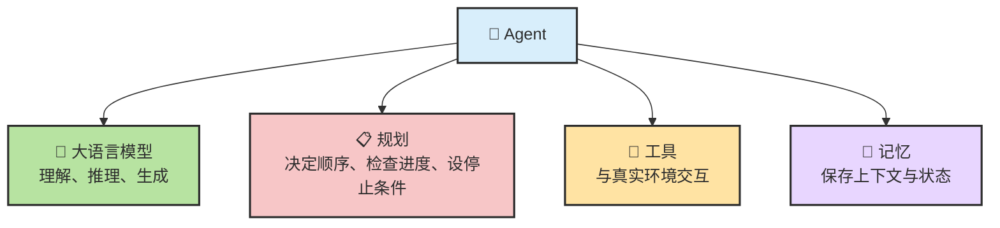
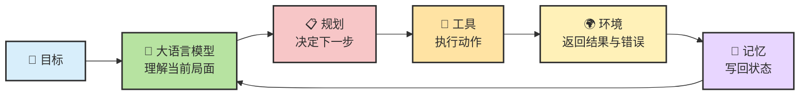
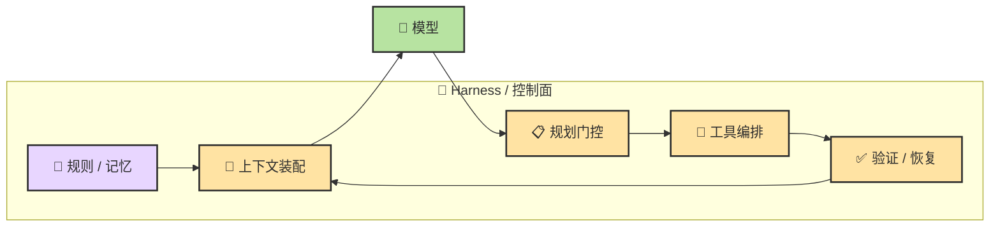
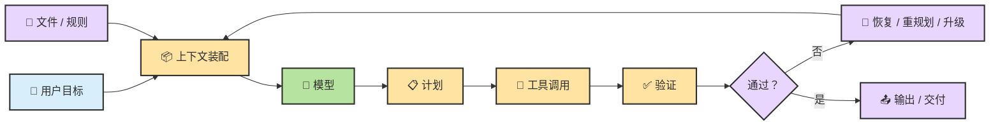

# Chapter 8 · 🧩 Agent = Model + Harness = LLM + Planning + Memory + Tools

> 目标：把 Agent 拆回最关键的那几层：模型本体、规划、记忆、工具，以及把这些东西真正组织起来的 Harness。读完这一章，你应该能从系统视角理解 Agent 为什么会有上限、为什么会失控、又为什么很多问题其实不在模型本身。

## 目录

- [🧭 0. 先校准几个直觉](#ch2-sec-0)
- [🧩 1. 一张总图：从四件套到三层坐标](#ch2-sec-2)
- [🧠 2. LLM：大脑，但不是整个系统](#ch2-sec-3)
- [🧰 3. Harness / Control Plane：真正的杠杆在模型外侧](#ch2-sec-7)
- [📝 本章总结](#ch2-sec-summary)

> 📖 **阅读方式建议**：如果你对 `LLM / Context / Token / MCP / Skill / Harness` 这些词还不熟，可以把 [基础概念与术语](./ch06-glossary.md) 另开一页，边读边查；本章主线已经尽量自洽，不要求你先把术语全背下来。
>
> 🧠 **想深入理解原理**：本章先讲总公式；如果你想把底层机制继续拆开读，推荐直接接着看：
> - [🧠 LLM 推理基础](./ch09-llm-reasoning-basics.md)
> - [💾 Memory](./ch11-memory-context-harness.md)
> - [🛠️ Tools](./ch12-tools.md)

---

## 0. 先校准几个直觉

在进入原理之前，先把几件最容易想错的事摆正。很多人不是不会用 Agent，而是一开始就把它想成了错误的东西。

| #️⃣ | 🪤 常见直觉 | ✅ 更接近现实的说法 |
| --- | --- | --- |
| 1 | “Agent 就是更聪明的 ChatGPT” | **不准确。** Agent 不是单纯更强的回答器，而是会循环工作、会调用工具、会维护状态、会被验证和约束的任务执行系统 |
| 2 | “模型越强，Agent 就越好用” | **只说对一半。** Agent 效果更接近 `Model × Context × Task Structure × Verification` |
| 3 | “给 Agent 的信息越多越好” | **通常是错的。** 关键信息被噪音淹没，比“信息不够”更常见 |
| 4 | “Agent 的结果就是一口气生成出来的” | **错。** 多数 Agent 内部都在反复跑 `Observe -> Plan -> Act -> Verify -> Continue` |
| 5 | “工具越多越强” | **也不对。** 工具太多会增加上下文负担、选择噪音和风险面 |

先记住这一句，后面很多内容就不会学歪：

> 🎯 **Agent 的关键不是“一次回答更聪明”，而是“能在多轮行动里不断接触世界、检查结果、修正路径”。**

---

## 1. 一张总图：从四件套到三层坐标

### 1.1 一个够用的总公式

对大多数读者来说，最够用、也最好记的公式就是：

> 🧩 **Agent = LLM + Planning + Tools + Memory**

先把这四个词记成一句白话：

- `LLM`：大脑，负责理解、推理、生成
- `Planning`：控制层，负责决定下一步做什么、何时停、何时重试
- `Tools`：行动层，负责读文件、跑命令、调 API、接触环境
- `Memory`：状态层，负责保存上下文、摘要、规则和阶段结果

### 1.2 这四件套如何形成一个闭环

这四件套不是四个平级的“外挂插件”，而是一条由 LLM 驱动、由外层系统组织起来的闭环。

### 1.3 再压一层：Agent = Model + Harness

工程师常常还会把它再压缩成另一种写法：

> 🧰 **Agent = Model + Harness**

这里的意思不是把 `Planning / Tools / Memory` 否认掉，而是强调：

- `Model` 决定理解、推理、生成的上限
- `Harness` 把规划、工具、记忆、权限、验证、停止条件组织成一个可靠系统

### 1.4 Agent 效果为什么不只看模型

在真实工程里，更接近事实的判断是：

> 📈 **Agent 效果 = Model × Context × Task Structure × Verification**

| 变量 | 它在问什么 | 常见杠杆 |
| --- | --- | --- |
| `Model` | 模型本身会不会理解、归纳、生成 | 选型、推理能力、长度能力 |
| `Context` | 模型这一轮到底看到了什么 | 文件选择、摘要、检索、规则前置 |
| `Task Structure` | 任务有没有被拆成可执行闭环 | Spec、Plan、子任务、停止条件 |
| `Verification` | 系统能不能用证据纠错 | 测试、编译、检查、review、eval |

这条判断会直接改变你排查问题的顺序：

- 没有证据链，先别急着换模型
- 目标没澄清，先别急着优化 Prompt
- 上下文包混乱，先别怪模型“记性差”
- 任务结构太大太糊，先别让系统直接开写

### 1.5 Prompt、Context、Harness 不是一回事

很多工程问题之所以越修越乱，是因为这三层没有拆开。

| 层 | 它是什么 | 它改什么 | 常见误判 |
| --- | --- | --- | --- |
| `Prompt` | 这一轮你想让模型怎么做 | 输出风格、局部步骤、当前任务约束 | 把所有问题都归因到 Prompt |
| `Context` | 这一轮实际送进模型的全部信息 | 证据质量、信息密度、相关性 | 以为“消息越多越好” |
| `Harness` | 系统如何组织多轮动作、验证和恢复 | 整体稳定性、自治边界、失败恢复 | 以为工具一加就自动变成 Agent |

一个简单例子：

- “请先读测试再改代码”是 `Prompt`
- 真的把相关测试文件、错误日志、目标文件放进上下文包里，这是 `Context`
- 如果测试失败后系统会自动重读错误信息、更新计划、限制危险写操作，这是 `Harness`

📌 这也是为什么后面你会经常看到一句判断：

> 🧭 **很多所谓“Prompt 问题”，其实是 Context 问题，甚至是 Harness 问题。**

---

## 2. LLM：大脑，但不是整个系统

### 2.1 在 Agent 里，LLM 其实是一脑多用

同一个模型，在 Agent 里通常会不断切换角色。

| ⏱️ 运行时阶段 | 🎭 它更像什么 |
| --- | --- |
| 刚接收任务 | 目标理解者 |
| 决定下一步 | 任务规划器 |
| 选择工具时 | 工具调用决策器 |
| 读回结果后 | 结果解释器 |
| 长任务中途 | 摘要者 |
| 即将结束时 | 自我审查者 |

这也是为什么同一个模型在不同产品里表现会差很多。模型可能没变，但**外层给它的上下文组织方式、工具选择空间、验证闭环**全变了。

### 2.2 “大脑”这个比喻的边界

说 LLM 是大脑很有帮助，但也很容易过度拟人化。

LLM 自己通常**不负责**这些事：

| 🧩 事情 | 🚧 为什么通常不由 LLM 单独完成 |
| --- | --- |
| 持久存储状态 | 文件怎么存、什么能跨会话保留，取决于外层系统 |
| 真正执行外部动作 | 命令、文件写入、API 调用都需要工具层和权限层 |
| 权限控制 | 哪些动作需要你确认，不是模型自己说了算 |
| 停止条件 | 什么时候算完成，通常也要靠 Harness 和任务约束 |
| 失败重试与回滚 | 真正稳健的恢复策略需要外层工作流设计 |

所以最准确的说法是：

> 🧠 **LLM 是 Agent 的判断核心，但不是 Agent 的全部实现。**

---

## 3. Harness / Control Plane：真正的杠杆在模型外侧

### 3.1 Harness 到底在管什么

如果说模型决定“会不会想”，那么 Harness 决定“这个系统到底怎么工作”。

它至少在管理这些事情：

- 📏 指令与规则如何进入系统
- 📦 上下文如何被组装
- 📋 计划在哪些地方必须显式化
- 🔧 工具如何被调用、限制和回写
- ✅ 结果怎么验证
- 🔁 失败后怎么恢复、重试、停下或升级
- 🙋 哪些动作必须人类批准

### 3.2 规则文件是控制面的输入，不是背景材料

注意上面那张图里的一个细节：`文件 / 规则` 直接通向 `上下文装配`——不是通向模型，不是放在某个知识库等待查询，而是**每轮都会重新注入**，和用户目标一起组装成模型的实际工作集。

这个位置说明了一件事：

> 📏 **`CLAUDE.md`、`AGENTS.md`、项目规则这类文件，本质上是控制面的一部分，而不是普通参考文档。** 它们在每一轮都会影响系统的行为边界，就像程序里的配置文件，而不是 README。

所以最实用的问题不是”要不要写规则文件”，而是**什么应该进控制面，什么不应该**：

| 适合写入控制面文件 | 不适合写入控制面文件 |
| --- | --- |
| 代码约束、目录边界、验证命令 | 某次对话的临时吐槽 |
| 不可触碰区域、危险动作红线 | 大段瞬时日志 |
| 升级条件、人工确认点 | 高频变动且无复用价值的细节 |
| 复用型工作流与交付标准 | 原样复制的大量外部文档 |

判断标准只有一个：**这条信息每轮重新注入进来，会让系统更稳定，还是更嘈杂？** 只有前者才值得进控制面。

这也是本章反复说的那句话的落点——真正的杠杆不在模型本身，在模型外侧这套规则、上下文装配和验证体系。

---

## 本章总结

### 三条最值得带走的判断

1. 🤖 **Agent 不是一次回答，而是“目标 -> 行动 -> 反馈 -> 修正”的闭环系统。**
2. 📦 **真实效果不只看模型，还取决于 `Context`、`Task Structure` 和 `Verification`。**
3. 🧰 **很多所谓“模型问题”，真正该改的是 `Harness`：上下文装配、状态外置、验证链和自治边界。**

### 如果你还想继续往下学

- 📘 遇到术语卡壳时，随时打开：[基础概念与术语](./ch06-glossary.md)
- 🧠 想继续理解模型为什么会“像在推理”：继续看 [LLM 推理基础](./ch09-llm-reasoning-basics.md)
- 💾 想把状态管理和上下文问题讲透：继续看 [Memory](./ch11-memory-context-harness.md)
- 🛠️ 想把 Tool Use、MCP、Skill、Hook、Plugin、Command 分开看清：继续看 [Tools](./ch12-tools.md)、[配置使用第一个](./ch03-first-extension-setup.md) 和后面的四个专题章节
- 🚑 想从“会解释原理”走向“会减少跑偏”：继续看 [Agent 错误用法](./ch17-agent-failure-modes.md) 和 [质量保障与验收](./ch21-quality-assurance-review-eval.md)

### 参考资料

- Maarten Grootendorst, [A Visual Guide to LLM Agents](https://newsletter.maartengrootendorst.com/p/a-visual-guide-to-llm-agents)

---

[📚 返回目录](../../README.md#tutorial-contents) | [⬅️ 上一章：Ch07 从 LLM 到 Agent](./ch07-llm-to-agent.md) | [➡️ 下一章：Ch09 LLM 推理基础](./ch09-llm-reasoning-basics.md)

