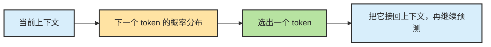
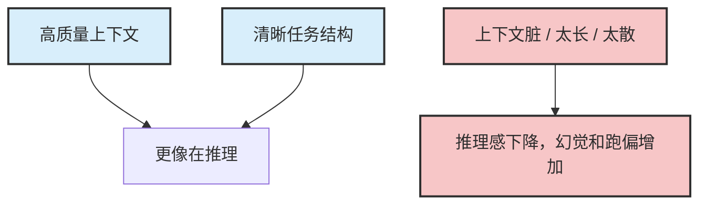

# Chapter 9 · 🧠 LLM 推理基础

> 目标：建立一个不过度神化、也不过度贬低 LLM 的基础认识。读完这一章，你应该知道为什么 LLM 天然带有概率性，CoT 在改变什么，以及“看起来会思考”和“真的可靠”之间还有多大距离。

## 目录

- [1. LLM 天生是概率模型](#1-llm-天生是概率模型)
- [2. 为什么同一个问题可能答得不一样](#2-为什么同一个问题可能答得不一样)
- [3. CoT 在改变什么](#3-cot-在改变什么)
- [4. 为什么多想想有时会更好，有时会更差](#4-为什么多想想有时会更好有时会更差)
- [5. 几个问题驱动问答](#5-几个问题驱动问答)

## 1. LLM 天生是概率模型

LLM 的底层不是规则执行器，而是条件概率模型。  
它做的事情可以粗暴压成一句话：

> 在当前上下文条件下，预测下一个最可能出现的 token。

这意味着它天然具备：

- 概率性
- 近似性
- 对上下文极其敏感

🔧 进阶：Token、采样参数与 Prompt 结构

### 为什么模型处理的是 token，而不是"字词句知识点"

模型真正处理的不是你脑中理解的"一个意思"，而是**token 序列**。

token 可以是：

- 一个字
- 半个词
- 一个完整单词
- 一段符号
- 一小截代码

这件事和 Prompt Engineering 强相关，因为模型并不是直接看到"抽象语义"，而是看到一串有顺序、有位置、有邻接关系的 token。

于是下面这些看似只是文风差异的变化，都会真实影响模型内部计算：

- 规则写在前面还是后面
- 例子放在任务前还是任务后
- 要求写成散文还是写成列表
- 是否用分隔符把不同区块隔开

所以，"Prompt 写得更好"并不只是因为你更会说话，而是因为你重新组织了模型真正看到的输入结构。

### 采样参数：控制随机性的阀门

最常见的几个参数，本质上都在调"输出有多发散"这件事：

| 🎛️ 参数 | 🧠 它在影响什么 | 💡 直觉理解 |
|------|--------------|----------|
| `temperature` | 分布尖锐程度 | 越高越发散，越低越收敛 |
| `top-p` | 允许参与采样的概率核心区 | 先截掉长尾，再从保留下来的候选里选 |
| `seed` | 随机过程的初始条件 | 有助于复现，但不是严格确定性保证 |

这里最容易误解的一点是：

> 🎚️ **这些参数调的是随机性阀门，不是在凭空提升模型能力。**

把 `temperature` 从 `0.8` 降到 `0.2`，不会让模型突然"更懂"，只是让它更倾向于走高概率、保守、稳定的路径。

## 2. 为什么同一个问题可能答得不一样

因为结果不只取决于问题本身，还取决于：

- 上下文里前面放了什么
- 输出约束怎么写
- 温度和采样设置
- 模型此刻“看到”的证据是否完整

所以“同一个意思，换个写法效果差很多”不是玄学，而是概率模型的正常现象。

## 3. CoT 在改变什么

`CoT` 的关键作用不是让模型“突然变得会思考”，而是：

- 强迫中间步骤显式化
- 让复杂任务更容易拆成若干局部判断
- 为后续验证和纠偏创造条件

换句话说，CoT 更像把推理过程拉到台面上，而不是凭空创造可靠性。

⚙️ 进阶：推理的三个层级与随机性管理

### "推理"的三个层级

"推理"这个词经常被混着用，但至少可以拆成三层：

**🪄 Prompt 层的推理诱导**

最典型的就是 Chain-of-Thought（CoT）。它的核心不是让模型"变成另一个模型"，而是通过提示，让模型更愿意把中间步骤展开，从而走上一条更适合复杂求解的生成路径。

所以 `Let's think step by step` 这类提示有时有效，不是因为那句话有魔法，而是因为它改变了输入条件，诱导模型采用不同的求解方式。

**🧠 模型层的 reasoning model**

现在常说的 reasoning model，不只是"你让它写出思路"，而是模型和服务层本身就支持先进行一段内部思考，再给出更凝练的答案。

这和传统 CoT 的区别在于：

- CoT 往往把中间过程直接暴露在输出里
- reasoning model 则可能在内部消耗思考预算，再只给你结果或摘要

**⚙️ 服务层的推理优化**

同一个模型，服务接口层也可能给你额外的 reasoning 配置，例如：

- reasoning effort
- 内部思考预算
- reasoning summary

这时候，"推理"已经不只是 prompt 技巧，而是一种产品能力。

所以别把这三件事混成一句"让模型多想想"。它们分别对应不同层级的控制手段。

### 随机性的重新分配

随机性既是风险，也是能力来源的一部分。

当你让模型做这些事时，适度随机性通常是有益的：

- 💭 头脑风暴、提出多个候选方案
- ✍️ 生成创意文案、探索不同写法

但当任务变成下面这些，过高随机性就会迅速转化成故障源：

- 🛠️ 工具调用、结构化输出
- 🖥️ 命令参数生成、数据库查询条件
- 🤖 自动化操作

所以，更成熟的说法不是"Agent 要消灭随机性"，而是：

> ⚖️ **Agent 要重新分配随机性。**

系统会把随机性更多留给探索和候选搜索，而把执行动作、参数格式、状态迁移这些环节尽量收窄。

## 4. 为什么多想想有时会更好，有时会更差

让模型“多想想”通常有帮助，但也有代价：

- 好处：复杂任务更容易拆开，隐藏约束更容易被提取
- 坏处：如果前提错了，错误会被更完整地展开和放大

所以工程里真正重要的不是“让它想更久”，而是：

> ✅ 让它在正确证据和验证机制里思考。

---

## 5. 几个问题驱动问答

**Q：如果 LLM 是概率模型，为什么日常又经常显得很稳定？**  
因为很多常见任务的高概率路径本来就很集中。只要上下文稳定、任务清晰、采样参数收敛，输出就会表现得像“差不多固定”。

**Q：CoT 是不是让模型真的更聪明了？**  
更准确地说，它让中间步骤更显式了。这样复杂任务更容易被拆开，也更容易被后续验证和纠偏。

**Q：为什么“多想想”有时反而更差？**  
因为更长的推理链会把正确前提和错误前提一起放大。前提错了，想得越多，错得可能越完整。

**Q：为什么后面教程一直强调 Context、Memory、Harness？**  
因为概率模型的上限，不只由模型本身决定，也由它看到了什么、怎样被约束、以及结果有没有被拉回现实共同决定。

---

## 📌 本章总结

- LLM 本质上是条件概率模型，所以天然会带随机性和近似性。
- CoT 的价值是把中间步骤显式化，不是凭空创造可靠性。
- “多想想”只有在证据和验证链都对的时候才真正有帮助。
- 真正把模型收束成可工作的系统，靠的不是一句 Prompt，而是 Context、Harness 和验证闭环。

## 📚 继续阅读

- 想继续看“推理如何被任务结构接住”：继续看 [Ch10 · Planning](./ch10-planning.md)
- 想把“概率模型为什么需要外部状态”讲透：继续看 [Ch11 · Memory、Context 与 Harness](./ch11-memory-context-harness.md)

---

### 3.1 底层机制仍是 next-token prediction

讲 Agent 时最不能忘的一点是：**LLM 的底层仍然是 next-token prediction。**

所以严格说，LLM 本身不是一个“会自动完成任务的程序”，而是一个**在上下文里持续续写最合理内容的概率引擎**。

### 3.2 为什么 next-token prediction 仍然会表现出“推理感”

很多人一听“next-token prediction”，就会误以为这意味着模型只会胡乱接龙。现实不是这样。

在复杂任务里，当前上下文本身往往已经包含了：

- 用户目标
- 系统规则
- 工具定义
- 记忆摘要
- 最新观察结果
- 中间结论和失败反馈

在这种高约束上下文里连续生成 token，表现出来就很像在：

- 先理解问题
- 再比较几种路径
- 再挑一个最合理的动作
- 再根据新反馈修正主意

---

[📚 返回目录](../../README.md#tutorial-contents) | [⬅️ 上一章：Ch08 Agent = Model + Harness](./ch08-agent-formula.md) | [➡️ 下一章：Ch10 Planning](./ch10-planning.md)

