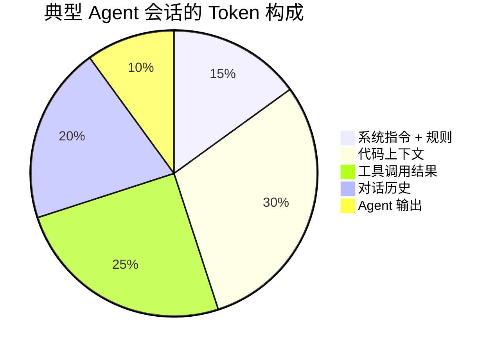

# Chapter 10 · 🤝 人机协同方法论

> 🎯 **目标**：掌握与 Agent 高效协作的核心方法论和实操技巧——不是学更多功能，而是学会更好地"驾驭"Agent。读完本章，你将从"会用 Agent"升级到"善用 Agent"。

## 📑 目录

- [1. 🔧 Harness 工程：真正的杠杆不在模型](#1--harness-工程真正的杠杆不在模型)
- [2. 🧠 上下文工程：Agent 的命脉](#2--上下文工程agent-的命脉)
- [3. 💬 Prompt 策略：如何给 Agent 下达指令](#3--prompt-策略如何给-agent-下达指令)
- [4. 🚨 七种失败模式与恢复术](#4--七种失败模式与恢复术)
- [5. 💰 Token 经济学：省钱省时的实操技巧](#5--token-经济学省钱省时的实操技巧)
- [6. ⚡ Agentic Coding vs Vibe Coding](#6--agentic-coding-vs-vibe-coding)
- [7. 🏗️ 大型项目策略](#7-️-大型项目策略)
- [8. 📈 Agent 使用成熟度模型](#8--agent-使用成熟度模型)

---

## 1. 🔧 Harness 工程：真正的杠杆不在模型

### Agent = Model + Harness

Ch02 讲过 Agent 的本质是 `LLM + Memory + Tools + Planning`。现在我们换一个更实战的视角来看：

> **Agent 效果 = 模型能力 × Harness 质量**

**Harness（马具）** 是围绕模型构建的系统层——包括你的提示设计、上下文管理、工具编排、验证循环、状态追踪和故障恢复。模型是马，Harness 是马具，你是骑手。

```mermaid
flowchart TB
    classDef harness fill:#2d2d2d,stroke:#98c379
    classDef model fill:#2d2d2d,stroke:#61dafb
    classDef you fill:#2d2d2d,stroke:#e5c07b

    subgraph YOU["👤 你（骑手）"]
        Y1(["定义目标<br/>设计工作流<br/>审查验收"]):::you
    end

    subgraph HARNESS["🔧 Harness（马具）"]
        H1(["📜 Instructions<br/>CLAUDE.md · 规则 · 边界"]):::harness
        H2(["📂 Context Assembly<br/>上下文组装 · 精准引用"]):::harness
        H3(["📋 Planning<br/>任务拆解 · 完成定义"]):::harness
        H4(["🔧 Tool Orchestration<br/>工具选择 · 调用编排"]):::harness
        H5(["💾 Memory<br/>摘要压缩 · 跨会话记忆"]):::harness
        H6(["✅ Verification<br/>测试 · Lint · 回退机制"]):::harness
    end

    subgraph MODEL["🧠 Model（马）"]
        M1(["LLM 推理 · 生成 · 规划"]):::model
    end

    YOU --> HARNESS --> MODEL

    style YOU fill:#1a1a2e,stroke:#e5c07b
    style HARNESS fill:#1a1a2e,stroke:#98c379
    style MODEL fill:#1a1a2e,stroke:#61dafb
```



### 为什么 Harness 比换模型更有效？

LangChain 团队的编码 Agent 优化实验给出了最有力的证据：

| 变量 | 改动 | 效果 |
|------|------|------|
| 换更强模型 | Sonnet → Opus | 排名提升约 5 位 |
| **改 Harness** | 加自验证 + 上下文注入 + 故障检测 | **排名从 Top 30 → Top 5** |

另一个数据点更直接：同一个 Claude Opus 4.5 模型，在原始环境中 CORE-Bench 得分 42%，换一套编排框架（Harness）后飙升到 78%。

> **🔑 核心结论**：2026 年的旗舰模型都够强（Opus 4.6、GPT-5.4、Gemini 3.1），选对模型只是及格线，**Harness 的质量决定了 Agent 效果的上限**。

### 从 Prompt Engineering 到 Harness Engineering

| 维度 | Prompt Engineering | Harness Engineering |
|------|-------------------|---------------------|
| 关注点 | 单个提示词怎么写 | 整个系统如何设计 |
| 范围 | 一次对话 | 跨会话的完整工作流 |
| 核心技能 | 写出好 Prompt | 设计上下文策略、工具编排、验证循环 |
| 可复用性 | 低（每次手动调整） | 高（沉淀为 CLAUDE.md、Skills） |

**本章后续的所有内容，本质上都是在教你做 Harness Engineering。**

---

## 2. 🧠 上下文工程：Agent 的命脉

Ch02 讲过"上下文 ≠ 越多越好"。本节进入实操层面：**如何精确控制 Agent 看到什么、记住什么、忘掉什么。**

### 上下文是 Agent 的第一资源

Claude Code 的几乎所有最佳实践都源于一个根本约束——**上下文窗口会快速填满，而性能会随之下降**。一次调试会话或代码库探索可能消耗数万个 Token。当上下文窗口接近上限时，模型开始"遗忘"早期指令，产生更多错误。

```mermaid
flowchart LR
    Fresh(["🟢 上下文充裕<br/>指令清晰<br/>输出精准"]) --> Mid(["🟡 上下文增长<br/>历史堆积<br/>精度下降"])
    Mid --> Full(["🔴 上下文溢出<br/>早期指令遗忘<br/>行为退化"])

    style Fresh fill:#2d2d2d,stroke:#98c379
    style Mid fill:#2d2d2d,stroke:#e5c07b
    style Full fill:#2d2d2d,stroke:#e06c75
```



### CLAUDE.md / AGENTS.md 编写最佳实践

CLAUDE.md（或 AGENTS.md / .cursorrules）是 Agent 的"持久化记忆"——每次对话开始时自动加载。写好这个文件，等于一次投入、永久生效。

**适合写入的内容**：

```markdown
# 项目简介
一句话说明这是什么项目

# 技术栈
- Framework: Next.js 14 (App Router)
- Language: TypeScript (strict mode)
- Database: PostgreSQL + Prisma ORM
- Testing: Vitest + Playwright

# 项目结构
src/
  app/        # Next.js 路由和页面
  lib/        # 业务逻辑和工具函数
  components/ # UI 组件
  db/         # 数据库模型和迁移

# 常用命令
- 启动：`npm run dev`
- 测试：`npm test`
- Lint：`npm run lint`
- 构建：`npm run build`

# 编码规范
- 函数优先于类，除非需要复杂状态管理
- 所有 API 路由必须包含错误处理
- 使用 zod 进行输入验证

# Agent 容易踩的坑
- 不要修改 prisma/schema.prisma 后忘记运行 `npx prisma generate`
- 环境变量在 .env.local 中，不要使用硬编码值
```

**不适合写入的内容**：

| ❌ 不要写 | 为什么 |
|-----------|--------|
| 具体任务需求细节 | 这是会话级信息，不是永久规则 |
| 临时调试信息 | 过期后变成噪音 |
| Agent 已经正确执行的规则 | 冗余规则浪费上下文 |
| 超过 5000 tokens 的规则 | 太长会淹没关键指令 |

> 💡 **把 CLAUDE.md 当代码对待**：定期审查、精简冗余、通过观察 Agent 行为测试修改效果。

### @引用 与文件引用策略

**精准引用 > 全量加载**。不要让 Agent 自己去搜索整个项目，直接告诉它看哪里：

```text
✅ 好的引用方式：
请查看 @src/lib/auth.ts 中的 validateToken 函数，修复 token 过期判断的 bug。

❌ 差的引用方式：
项目里有个 token 过期的 bug，帮我修一下。
```

### `/compact` 与会话管理

| 场景 | 操作 | 原因 |
|------|------|------|
| 完成一个子任务 | `/compact "保留要点：已完成 X，下一步做 Y"` | 压缩历史，保留关键信息 |
| 切换到不相关任务 | `/clear` | 彻底清空，避免上下文污染 |
| 长对话超过 15 分钟 | 考虑新开会话 | 老会话的历史越来越多，精度下降 |
| 调试陷入死循环 | `/clear` + 重新开始 | 失败尝试的历史在污染 Agent 的判断 |

### 三层记忆策略

```mermaid
flowchart TB
    classDef l1 fill:#2d2d2d,stroke:#e5c07b
    classDef l2 fill:#2d2d2d,stroke:#61dafb
    classDef l3 fill:#2d2d2d,stroke:#98c379

    subgraph L1["⚡ 瞬时记忆 — 当前会话"]
        M1(["当前对话内容<br/>代码上下文<br/>工具返回结果<br/>⏱️ 会话结束即消失"]):::l1
    end

    subgraph L2["💾 会话摘要 — /compact"]
        M2(["长对话自动/手动压缩<br/>保留关键决策和结论<br/>⏱️ 当前会话内有效"]):::l2
    end

    subgraph L3["📁 持久化记忆 — CLAUDE.md + 文件"]
        M3(["项目规则和规范<br/>架构决策记录<br/>常用命令<br/>⏱️ 跨会话永久有效"]):::l3
    end

    L1 --> L2 --> L3
    L3 -.->|"每次会话自动加载"| L1
```



> 🔑 **核心原则：写进文件的才是记忆，留在会话里的只是临时笔记。** 重要的决策、规范、上下文，必须沉淀到 CLAUDE.md 或项目文件中。

---

## 3. 💬 Prompt 策略：如何给 Agent 下达指令

### 万能三句话法则

Ch01 就介绍过的三句话，在任何场景下都管用：

> 1. 🔍 **先分析再执行** — 给出计划，等我确认后再动手
> 2. ✅ **修改后必须验证** — 跑测试、跑 Lint、确认编译通过
> 3. ✋ **如果不确定，就停下来说明** — 不要猜测，不要编造

### 结构化指令模板

不同类型的任务，用不同的模板：

**探索性任务**（不修改代码）：

```text
先阅读这个仓库的 README 和目录结构。
然后告诉我：
1. 项目的技术栈是什么
2. 核心模块有哪些
3. 要实现 [我的需求]，你建议从哪里入手
不要修改任何代码，先给出你的分析。
```

**实现性任务**（写代码）：

```text
## 目标
[清晰的一句话目标]

## 约束
- 只修改 src/auth/ 目录下的文件
- 使用项目已有的 bcrypt 库
- 遵循项目现有的代码风格

## 步骤
1. 先给出实现方案，等我确认
2. 实现后运行 `npm test`
3. 如果测试失败，修复后再次运行
4. 全部通过后输出变更摘要
```

**调试性任务**（修 Bug）：

```text
这个测试 `auth.test.ts > should reject expired tokens` 失败了，
错误信息如下：
[粘贴关键错误信息，不要全部日志]

请先分析可能的原因（列出 2-3 个），
然后从最可能的原因开始排查。
每次修改后运行测试验证。
```

### 渐进式任务构建

复杂任务不要一口气说完，用"渐进式"方式逐步推进：


### 何时给自由度、何时给约束

| 场景 | 策略 | 原因 |
|------|------|------|
| 探索性研究 | 高自由度 | 让 Agent 发挥搜索和分析能力 |
| 架构设计讨论 | 中自由度 + 多方案对比 | 需要 Agent 给多个选项供你选择 |
| 功能实现 | 低自由度 + 明确约束 | Spec 越清晰，输出质量越高 |
| Bug 修复 | 低自由度 + 验证命令 | 每步修改都要可验证 |
| 代码风格调整 | 极低自由度 | 给明确的规则，Agent 机械执行即可 |

> 🔑 **原则：任务越确定性，约束越严格；任务越创造性，自由度越高。**

---

## 4. 🚨 七种失败模式与恢复术

Agent 不是万能的。了解它会怎么"犯蠢"，比了解它有多"聪明"更重要。以下是实战中最常见的七种失败模式：

### 总览

```mermaid
flowchart TB
    classDef fail fill:#2d2d2d,stroke:#e06c75
    classDef fix fill:#2d2d2d,stroke:#98c379

    F1(["① 上下文污染"]):::fail
    F2(["② Memory 污染"]):::fail
    F3(["③ 长任务漂移"]):::fail
    F4(["④ 反复纠错死循环"]):::fail
    F5(["⑤ 厨房水槽会话"]):::fail
    F6(["⑥ 假设传播"]):::fail
    F7(["⑦ 过度设计膨胀"]):::fail

    R1(["🔧 /clear 重开"]):::fix
    R2(["🔧 审查 CLAUDE.md"]):::fix
    R3(["🔧 分阶段 + 摘要"]):::fix
    R4(["🔧 /clear + 换策略"]):::fix
    R5(["🔧 一任务一会话"]):::fix
    R6(["🔧 SDD + 检查点"]):::fix
    R7(["🔧 明确 Out of Scope"]):::fix

    F1 --> R1
    F2 --> R2
    F3 --> R3
    F4 --> R4
    F5 --> R5
    F6 --> R6
    F7 --> R7
```



### 详细解析

| # | 失败模式 | 症状 | 成因 | 恢复术 |
|---|---------|------|------|--------|
| ① | **上下文污染** | Agent 抓着旧结论不放，或被无关日志带偏 | 对话中积累了大量已过时或无关的信息 | `/clear` 重开会话，只带当前任务必要背景 |
| ② | **Memory 污染** | Agent 学到了错误偏好并不断重复 | CLAUDE.md 中的规则自相矛盾或已过时 | 定期审查和精简 CLAUDE.md，删除冗余规则 |
| ③ | **长任务漂移** | Agent 忘记原目标，纠结细枝末节 | 单会话持续太久，上下文窗口塞满 | 分阶段执行：每阶段 `/compact` + 摘要 |
| ④ | **反复纠错死循环** | 同一个 Bug 修了 3 次还没修好，越改越乱 | 失败尝试的上下文污染了 Agent 判断 | `/clear`，用完全不同的策略重新开始 |
| ⑤ | **厨房水槽会话** | 一个任务没完就跳到另一个，什么都半成品 | 在同一会话中混了多个不相关任务 | 一个任务一个会话，`/clear` 隔离 |
| ⑥ | **假设传播** | 早期错误假设被放大到整个功能 | Agent 没有验证就基于猜测继续推进 | 用 SDD（Spec 驱动），每步对照 Spec 验证 |
| ⑦ | **过度设计膨胀** | 用 1000 行实现 100 行能搞定的功能 | Agent 有充分自由度时倾向过度复杂化 | 在 Spec 中明确 Out of Scope + 简洁约束 |

### 如何判断 Agent 正在失控？

三个预警信号：

1. **🔄 循环打转**：Agent 在同一段代码上反复修改超过 3 次 → 立刻 `/clear` 换策略
2. **📈 Token 飙升**：单次任务 Token 消耗超过预期 2 倍以上 → 检查是否在做无效探索
3. **🎯 偏离目标**：Agent 开始修改你没提到的文件 → 暂停，重新给出聚焦的约束

---

## 5. 💰 Token 经济学：省钱省时的实操技巧

### Token 消耗的构成



### 省 Token 的四大策略

#### 策略一：精准引用，不让 Agent 盲搜

```text
❌ 高消耗："项目里有个 token 相关的 bug，帮我找找"
   → Agent 会读取 20+ 文件，消耗大量 Token

✅ 低消耗："@src/lib/auth.ts 中第 42 行的 validateToken 函数..."
   → Agent 直接定位，精准高效
```

**节省效果**：30-50%

#### 策略二：定期 `/compact`，压缩历史

完成一个子任务后，用自定义摘要压缩上下文：

```text
/compact "保留要点：1) 已完成用户注册 API，2) 测试全通过，3) 下一步实现登录"
```

**节省效果**：40-60%

#### 策略三：控制命令输出

测试和构建的输出是 Token 黑洞。在指令中约束 Agent 的行为：

```text
运行测试后，只看失败用例的错误信息，不要输出全部日志。
如果全部通过，只说"全部通过"即可。
```

**节省效果**：20-40%

#### 策略四：模型分级使用

不是所有任务都需要最强模型。按任务复杂度选择模型：

| 任务类型 | 推荐模型 | 成本等级 |
|----------|---------|:---:|
| 简单查询、Lint 修复、文件重命名 | Haiku / 轻量模型 | $ |
| 日常开发、Bug 修复、测试补齐 | Sonnet | $$ |
| 大型重构、复杂功能、架构级任务 | Opus | $$$ |

### 成本估算参考

| 使用模式 | Token 消耗 | Opus 4.6 成本 | Sonnet 4.6 成本 |
|---------|-----------|:---:|:---:|
| 简单问答 | ~5K | ~$0.05 | ~$0.02 |
| 中等功能修改 | ~30K | ~$0.50 | ~$0.20 |
| 复杂功能开发 | ~100K | ~$2.00 | ~$0.80 |
| 大型重构 | ~500K | ~$10.00 | ~$4.00 |

> 💡 **Prompt Cache 自动生效**：Claude Code 会自动缓存系统指令和 CLAUDE.md 的内容，重复加载不会重复计费。这是另一个 CLAUDE.md 比会话内重复说明更高效的原因。

---

## 6. ⚡ Agentic Coding vs Vibe Coding

2026 年，Agent 使用者群体中出现了两种截然不同的"流派"——理解它们的区别，对你的工作效率和代码质量至关重要。

### 什么是 Vibe Coding？

**Vibe Coding（凭感觉编码）** 是 Andrej Karpathy 在 2025 年初提出的概念：

> 完全依赖"感觉（vibe）"与 Agent 交互，不深入理解代码逻辑，看到输出差不多就继续——"看着对就行了"。

### 核心区别

```mermaid
flowchart LR
    subgraph Vibe["🎵 Vibe Coding"]
        V1(["💬 模糊描述需求"])
        V2(["🤖 Agent 生成代码"])
        V3(["👀 看一眼'差不多'"])
        V4(["✅ 直接继续"])
        V1 --> V2 --> V3 --> V4
    end

    subgraph Agentic["⚙️ Agentic Coding"]
        A1(["📝 写明确 Spec"])
        A2(["🤖 Agent 按 Spec 实现"])
        A3(["🧪 跑测试验证"])
        A4(["👁️ 审查代码逻辑"])
        A5(["✅ 确认通过"])
        A1 --> A2 --> A3 --> A4 --> A5
    end

    style Vibe fill:#1a1a2e,stroke:#e5c07b
    style Agentic fill:#1a1a2e,stroke:#98c379
```



| 维度 | 🎵 Vibe Coding | ⚙️ Agentic Coding |
|------|---------------|-------------------|
| **对代码的理解** | 不需要理解 | 必须理解核心逻辑 |
| **验证方式** | "看着对" | 测试通过 + 人工审查 |
| **适合产出** | 原型、Demo、一次性脚本 | 生产代码、长期维护的项目 |
| **技术债务** | 高速积累 | 可控 |
| **谁在负责** | 没人（Agent 也不负责） | 你负责，Agent 执行 |
| **出了 Bug** | 再让 Agent 修（可能越改越乱） | 有测试兜底，定位快 |

### 何时 Vibe Coding 是合理的

Vibe Coding 不是"错误"——在合适的场景下它极其高效：

- ✅ **快速验证想法**：周末 Hackathon，先跑通再说
- ✅ **一次性脚本**：数据迁移脚本、批量重命名
- ✅ **学习和探索**：试用新框架、理解新概念
- ✅ **个人工具**：只有你自己用，坏了自己修

### 何时必须 Agentic Coding

- 🔴 **生产环境代码**：要长期维护的代码
- 🔴 **团队协作代码**：别人要看、要改的代码
- 🔴 **安全敏感代码**：涉及认证、支付、数据处理
- 🔴 **核心业务逻辑**：出错会影响用户或收入

### "理解债务"警告

Vibe Coding 最大的陷阱是 **理解债务（Comprehension Debt）**——Addy Osmani 在 2026 年初提出的概念：

> Agent 生成代码的速度远超你理解代码的速度。当你反复"看着对就继续"，你的代码库在增长，但你对它的理解在萎缩。终有一天，你会发现自己**完全不理解自己项目的代码**。

**缓解方式**：

1. **每次 Agent 生成代码后，至少快速浏览 diff** — 不需要逐行审查，但要理解"改了什么、为什么改"
2. **定期做"代码漫步"** — 花 30 分钟阅读 Agent 最近生成的关键模块
3. **对核心模块保持深度理解** — 即使 Agent 写了代码，你也要能向别人解释它

---

## 7. 🏗️ 大型项目策略

小项目丢给 Agent 一把梭就行。但大型项目（500+ 文件）需要策略性的管理方法。

### 项目规模与策略对应

| 项目规模 | 文件数 | 主要挑战 | 推荐策略 |
|---------|:---:|---------|---------|
| **小型** | <50 | 几乎没有 | Agent 可以直接全局理解 |
| **中型** | 50-500 | Agent 无法一次读完 | 维护入口文件 + 渐进探索 |
| **大型** | 500-5K | 定位关键代码困难 | 模块化指引 + 聚焦单模块 |
| **超大型** | 5K+ | 上下文严重不足 | 多 Agent 分模块 + 严格边界 |

### 入口文件策略

Agent 进入大型项目时，不要让它漫无目的地搜索。用"入口文件"引导它快速定位：

```mermaid
flowchart TB
    classDef step fill:#2d2d2d,stroke:#61dafb

    Start(["🤖 Agent 开始任务"]):::step
    S1(["① 读 CLAUDE.md<br/>了解项目规范和约束"]):::step
    S2(["② 读 README.md<br/>了解项目概况和结构"]):::step
    S3(["③ 读目录结构<br/>定位相关模块"]):::step
    S4(["④ 深入目标文件<br/>只读需要的代码"]):::step

    Start --> S1 --> S2 --> S3 --> S4
```



### 分阶段执行

大任务不能一口气做完。用"阶段 + 摘要 + 新会话"的模式保持 Agent 的精度：


### 跨会话交接

当需要在新会话中继续前一个会话的工作：

```text
# 上一个会话结束前：
请生成任务交接摘要：
1. 当前任务目标
2. 已完成的工作
3. 未完成的工作
4. 需要注意的要点

# 新会话中：
这是上一个会话的任务交接：
[粘贴摘要]
请继续完成未完成的工作。
```

### 多 Agent 并行（进阶）

大型重构或多模块开发可以用多个 Agent 会话并行推进：

| 模式 | 说明 | 适用场景 |
|------|------|---------|
| **Writer + Reviewer** | 一个 Agent 写代码，另一个审查 | 代码质量要求高的任务 |
| **分模块并行** | 每个 Agent 负责一个独立模块 | 模块间耦合度低的大型重构 |
| **主 Agent + 子 Agent** | 主 Agent 分配任务，子 Agent 执行 | Claude Code 原生支持的模式 |

```text
# Writer + Reviewer 双 Agent 模式

终端 1（Writer）：
"请按照 spec.md 实现用户认证模块"

终端 2（Reviewer）：
"请审查 src/auth/ 目录下的最新代码变更，
检查安全漏洞、逻辑错误和代码规范问题"
```

> 📖 多 Agent 协作的完整架构和深度实战见 → [多 Agent 组合专题](../topics/topic-multi-agent.md)

---

## 8. 📈 Agent 使用成熟度模型

你与 Agent 的协作水平处于哪个阶段？以下五级成熟度模型帮你定位当前水平和进阶方向。

### 五级成熟度

```mermaid
flowchart LR
    classDef l1 fill:#2d2d2d,stroke:#e06c75
    classDef l2 fill:#2d2d2d,stroke:#e5c07b
    classDef l3 fill:#2d2d2d,stroke:#61dafb
    classDef l4 fill:#2d2d2d,stroke:#c678dd
    classDef l5 fill:#2d2d2d,stroke:#98c379

    L1(["L1 初学<br/>把 Agent<br/>当聊天机器人"]):::l1
    L2(["L2 基础<br/>能完成<br/>单步任务"]):::l2
    L3(["L3 熟练<br/>能管理<br/>多步工作流"]):::l3
    L4(["L4 高级<br/>能设计<br/>Agent 系统"]):::l4
    L5(["L5 专家<br/>Harness<br/>Engineering"]):::l5

    L1 --> L2 --> L3 --> L4 --> L5
```



### 各级详解

| 级别 | 特征 | 你在做什么 | 关键升级技能 |
|:---:|------|-----------|------------|
| **L1** 初学 | 把 Agent 当聊天机器人 | 一问一答，不给上下文，不验证输出 | → 学会给代码上下文和验证命令 |
| **L2** 基础 | 能让 Agent 完成单步任务 | 会给文件引用，会跑测试，但只做简单任务 | → 学会任务拆解和 Plan 模式 |
| **L3** 熟练 | 能管理多步复杂工作流 | 会拆任务、写 CLAUDE.md、分阶段执行、用 SDD | → 学会 Skills、MCP、多 Agent 协作 |
| **L4** 高级 | 能设计高效的 Agent 工作流体系 | 会写 Skill、配 MCP 工具、用多 Agent 并行 | → 系统化设计和优化整个 Harness |
| **L5** 专家 | 进行 Harness Engineering | 系统化地设计上下文策略、工具编排、验证循环和故障恢复 | → 创新性的 Agent 系统设计 |

### 升级路径建议

**L1 → L2**（1-2 天）：
- 学会在指令中 `@引用` 具体文件
- 每次修改后让 Agent 跑测试
- 养成"先分析再执行"的习惯

**L2 → L3**（1-2 周）：
- 编写项目的 CLAUDE.md
- 学会 SDD 工作流（Ch04）
- 掌握 `/compact` 和会话管理
- 大任务拆成 30 分钟子任务

**L3 → L4**（1-2 月）：
- 学会编写 Skills（→ Ch07）
- 配置和使用 MCP 工具（→ Ch08）
- 尝试 Writer + Reviewer 双 Agent 模式
- 建立团队级的 CLAUDE.md 规范

**L4 → L5**（持续进阶）：
- 系统化分析 Agent 行为，优化 Harness
- 设计可复用的 Agent 工作流模板
- 建立团队的 Agent 最佳实践体系
- 将 Agent 集成到 CI/CD 流程中

> 💡 大多数开发者在使用 1-2 周后可以达到 L2-L3。从 L3 到 L4 需要有意识地学习本章和后续章节介绍的高级概念。

---

## 📌 本章总结

| 核心概念 | 一句话总结 |
|----------|-----------|
| **Harness 工程** | 模型是马，Harness 是马具——Agent 效果的上限由 Harness 决定，而非模型 |
| **上下文工程** | 精准 > 全面；写进文件的才是记忆；定期压缩和清理 |
| **Prompt 策略** | 结构化指令 + 三句话法则 + 按任务类型选模板 |
| **失败模式** | 识别 7 种常见失败模式，大多数只需 `/clear` + 换策略即可恢复 |
| **Token 经济学** | 精准引用省 30-50%，定期 compact 省 40-60%，模型分级使用 |
| **Agentic vs Vibe** | 生产代码用 Agentic Coding，原型验证用 Vibe Coding |
| **大型项目** | 入口文件 + 分阶段执行 + 跨会话交接 + 多 Agent 并行 |
| **成熟度模型** | 从 L1（聊天机器人）到 L5（Harness Engineer）的五级进阶 |

### 三条核心原则

> 🔑 **Harness 比模型更重要** — 选对模型是及格线，设计好 Harness 是优秀线。把精力花在上下文管理、验证循环和工作流设计上，而不是追逐最新模型。
>
> 🔑 **Less is More** — 精简的上下文、聚焦的任务、适量的工具，比堆砌一切更有效。工具不是越多越好，CLAUDE.md 不是越长越好，会话不是越长越好。
>
> 🔑 **理解你的代码** — Agent 是执行者，你是负责人。无论 Agent 生成多快多好，你必须理解核心逻辑，否则"理解债务"会在某天把你淹没。

> 📖 深度参考：
> - [附录：人机协同与 Agent 优化指南](../topics/topic-human-agent-collab.md)（Harness 六层架构、Token 节约详解、大型项目策略、Agent Team 互审）

---

<div align="center">

[📚 返回目录](../../README.md#tutorial-contents) | [⬅️ 上一章：Ch09 工程化工作流](./ch09-engineering.md) | [➡️ 下一章：Ch11 Agent 设计模式](./ch11-design-patterns.md)

</div>
