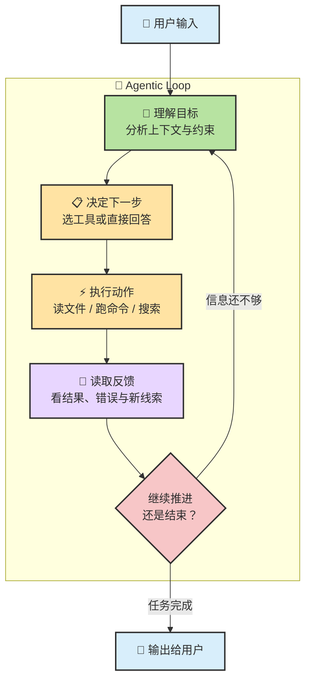
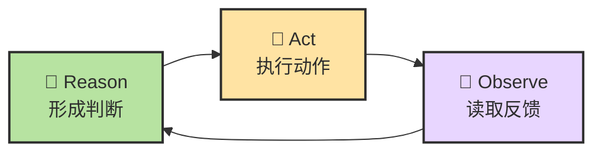
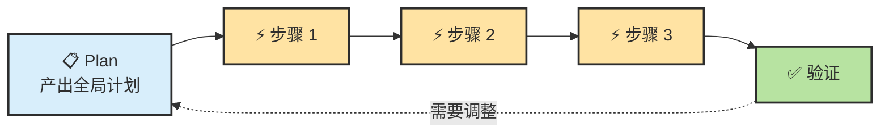
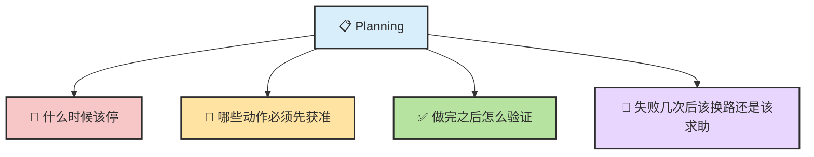
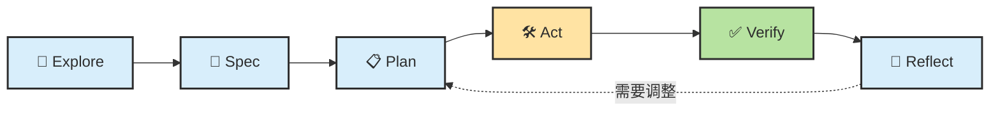

# Chapter 10 · 📋 Planning

> 🎯 **目标**：理解 Planning 在 `Agent = LLM + Planning + Memory + Tools` 公式里扮演什么角色。读完这一章，你应该知道 Planning 到底在管什么、Agentic Loop 怎么转、ReAct 和 Plan-and-Execute 各解决什么问题，以及为什么"停止条件"和"权限审批"也属于 Planning。

## 📑 目录

- [1. Planning 在公式里的位置](#1-planning-在公式里的位置)
- [2. Planning 到底在规划什么：两层结构](#2-planning-到底在规划什么两层结构)
- [3. Agentic Loop：Planning 在运行时怎么转起来](#3-agentic-loopplanning-在运行时怎么转起来)
- [4. 一次真实请求的内部轨迹](#4-一次真实请求的内部轨迹)
- [5. ReAct 和 Plan-and-Execute](#5-react-和-plan-and-execute)
- [6. 停止条件、权限、验证，为什么也算 Planning](#6-停止条件权限验证为什么也算-planning)
- [7. 一条统一母流程](#7-一条统一母流程)

---

## 1. Agent公式

回顾 Ch08 的总公式：

```text
Agent = LLM + Planning + Memory + Tools
```

**Planning 的独特位置**：它不像 LLM 那样负责"想"，也不像 Tools 那样负责"做"，而是负责**把"想"和"做"组织成一条有方向、有边界、有验证的推进路径**。

> 🧭 **如果 LLM 是大脑，Tools 是手，Memory 是笔记，那 Planning 就是"做事的方法和纪律"。**

---

## 2. Planning 到底在规划什么：两层结构

很多人第一次看到 Planning，会以为这是一个独立的"智能模块"。更准确的说法是：

> **大多数产品里的 Planning，都是"固定编排 + LLM 动态决策"的混合体。**

| 层级 | 谁负责 | 主要作用 |
|---|---|---|
| **外层编排** | Agent 框架 / 产品逻辑 | 提供循环骨架、权限审批、最大尝试次数、停止条件 |
| **内层规划** | LLM | 结合目标、记忆、最新反馈，决定"现在最该做什么" |

所以 Planning 并不是"有一个计划模块自己在思考"，而更像是：

- 框架先规定大规则（循环怎么转、什么时候停、什么需要人确认）
- LLM 再在这个规则里动态决定下一步

具体来说，**外层**负责循环骨架、权限审批、重试上限、停止条件这些"硬约束"；**内层**由 LLM 在每一轮循环里理解当前局面、评估可用工具、决定下一步动作、判断任务是否完成。两者配合，才让 Planning 既有纪律又有灵活性。

这也是为什么 Planning 离不开 LLM：

- 没有 LLM → Planning 更像固定 workflow 或状态机
- 有了 LLM → Planning 才开始具备"根据当前局面改主意"的能力

---

## 3. Agentic Loop：Planning 在运行时怎么转起来

从用户视角看，你在终端里输入一句话，Agent 几秒后给你一大段回复；但实际上，**Agent 内部可能已经循环了十几轮**。每一轮都在做同一件事：理解 → 选动作 → 执行 → 观察 → 再判断。

这就是 **Agentic Loop**——Planning 在运行时的真正形态。



> 💡 你看到的"一条完成回复"，背后常常是一个隐藏的 while-loop。

---

## 4. 一次真实请求的内部轨迹

以一个具体例子说明 Agentic Loop 是怎么转的（Ch07 中用"清理未使用依赖"展示了闭环概念，这里换一个更复杂的例子，展示 Planning 如何在每一轮做决策）：

> 你说："这个项目的登录接口返回 401，帮我排查并修复。"

| 轮次 | Planning 在做什么决策 | 使用工具 | 观察结果 |
|:---:|---|---|---|
| 1 | 先定位登录相关代码，而不是盲猜原因 | `Grep "login"` | 找到 `src/auth/login.ts` 和 `src/middleware/jwt.ts` |
| 2 | 需要理解登录流程才能缩小排查范围 | `Read` 两个文件 | 发现登录返回 token，jwt 中间件验证 token |
| 3 | 401 说明 token 验证失败——先看签名逻辑 | `Read jwt.ts` 的 verify 函数 | 发现签名用 `process.env.JWT_SECRET` |
| 4 | 怀疑环境变量不一致——对比签名和验证的 key | `Grep JWT_SECRET` | 签名用 `.env` 里的值，验证硬编码了旧值 |
| 5 | 根因确认——决定修复方案：统一用环境变量 | 先给方案，等确认 | 用户确认 |
| 6 | 执行修复 + 验证 | `Edit` + `Shell npm test` | 修改一行，测试通过 |
| 7 | 任务完成，汇报根因和修复内容 | — | 输出摘要 |

> 💡 注意每一轮的 Planning 决策：第 1 轮选择"先定位"而非"先猜"，第 3 轮选择"先看签名逻辑"而非"重启服务试试"，第 5 轮选择"先给方案"而非"直接改"。**Planning 的质量体现在每一步的选择上，而不只是第一步的计划里。**

---

## 5. ReAct 和 Plan-and-Execute

Planning 有两种常见的工作方式。

### ReAct：边想边做

ReAct（Reasoning + Acting）由 Yao et al. 2022 年提出，核心思想是把 LLM 的推理能力和外部工具的行动能力交织成同一个循环——模型不再是"想完再说"，而是"想一步、做一步、看一步、再想下一步"。这个模式之所以在 Agent 领域影响深远，是因为它第一次在统一框架里解决了"纯推理容易脱离现实"和"纯行动容易盲目"两个问题。



| 适合 | 风险 |
|------|------|
| 动态、不确定、必须靠反馈收束的问题 | 如果没有约束，容易在长任务里漂移 |

### Plan-and-Execute：先想后做

与 ReAct 的"边走边看"不同，Plan-and-Execute 先让 LLM 产出一个较完整的计划，再逐步执行。适合结构更清晰、依赖关系较稳定的任务。



| 适合 | 风险 |
|------|------|
| 结构清晰、依赖关系较稳定的问题 | 如果前面的计划假设错了，可能一路错下去 |

### 现实里的 Agent 是混合体

现实里的 Coding Agent 通常不是纯用一种方式，而是：

1. 先让 LLM 产出一个**粗计划**（Plan-and-Execute 式）
2. 真正执行时再进入 **ReAct 式局部修正**
3. 遇到计划预期之外的情况，允许**回写计划**

> **先用计划建立方向，再用反馈修正细节。计划不是合同，而是可回写的草图。**

### Reflecting：从失败中学习

在 ReAct 基础上，成熟的 Agent 还会加一层**反思（Reflecting）**：

| 概念 | 主要解决什么 |
|---|---|
| **ReAct** | 怎么边想边试边看 |
| **Reflecting** | 上一步哪里错了，下一轮怎么避免 |
| **Plan-and-Execute** | 先做较完整计划，再逐步执行 |
| **CoT / Reasoning** | 怎么想得更稳（推理先于行动） |

> 📌 这四者不是互斥关系，更像是 Planning 工具箱里的四把不同的刀。

---

## 6. 停止条件、权限、验证，为什么也算 Planning

很多人把 Planning 理解得太窄，只看"先做 A 还是先做 B"。真正稳定的 Planning，还包括：



Planning 不只在决定"下一步做什么"，还在决定：

- **什么叫完成**——测试通过？diff 范围符合预期？人工确认？
- **什么叫失败**——连续 N 次重试失败？进入死循环？
- **什么叫该把人类拉回环里**——高风险操作？不可逆改动？超出能力边界？

> 🔒 **成熟 Agent 产品里，停止条件、权限审批、验证命令、重试上限，都属于同一层"Planning / 控制逻辑"。**

---

## 7. 一条统一母流程

把上面的原理落到实操，最推荐长期保留的主流程是：



| 阶段 | 核心问题 | 产物 |
|---|---|---|
| `Explore` | 先看清现状，不急着动手 | 仓库理解、问题边界、证据 |
| `Spec` | 先定义要做成什么 | 目标、约束、验收标准 |
| `Plan` | 决定怎么推进 | 步骤、顺序、风险点 |
| `Act` | 真的执行动作 | 改代码、跑命令、写文档 |
| `Verify` | 用证据检查 | 测试、编译、diff、对照 |
| `Reflect` | 是否改计划、继续、停下 | 新计划、回退、升级处理 |

### 一份好计划至少包含四件事

| 维度 | 说明 |
|---|---|
| **Scope** | 改哪里，不改哪里 |
| **Order** | 先后顺序是什么 |
| **Verification** | 改完怎么证明做对了 |
| **Risk** | 哪一步最可能翻车 |

如果你在计划里看不到这四项，通常就说明计划还不够"可执行"。

---

## 📌 本章总结

- **Planning 的本质**：不是"先列个计划"，而是 Agent 整条控制回路的调度中枢。
- **两层结构**：外层框架编排 + 内层 LLM 动态决策。
- **Agentic Loop**：理解 → 选动作 → 执行 → 观察 → 再判断——你看到的一条回复，背后可能循环了十几轮。
- **ReAct + Plan-and-Execute**：先用计划建立方向，再用反馈修正细节。
- **Planning 不只管"下一步做什么"**：停止条件、权限审批、验证策略、重试上限都属于 Planning。

<details>
<summary><span style="color: #e67e22; font-weight: bold;">📝 进阶：六种高效 Prompt 约束技巧与 Method R 框架</span></summary>

### 六种高效约束技巧

以下六种技巧可以单独使用，也可以组合使用。每种都附带可直接复制的模板。

#### 📁 技巧一：指定文件范围

**问题**：不告诉 Agent 看哪里，它会从项目根目录开始地毯式搜索，消耗大量 Token 且可能找错文件。

```text
# CLI 写法：明确列出文件范围
请只修改以下文件，不要动其他文件：
- src/api/users.ts（路由逻辑）
- src/services/userService.ts（业务逻辑）
- tests/api/users.test.ts（对应测试）

# Cursor / VS Code 写法：用 @ 引用自动注入上下文
请修改 @src/api/users.ts 中的 createUser 函数，
参考 @src/services/userService.ts 的 validate 方法，
修改后更新 @tests/api/users.test.ts 中的相关测试。
```

#### 🎯 技巧二：描述具体场景

```text
❌ 模糊：帮我优化一下这个函数的性能。
✅ 具体：getOrderList 函数在订单量超过 1 万条时响应超 3 秒。当前实现一次性加载全部订单再内存分页。请改为数据库层分页，保持返回格式不变。
```

#### 🧪 技巧三：指定测试偏好

明确覆盖什么、不覆盖什么、用什么框架。

#### 📖 技巧四：提供参考资料

"照着抄"永远比"自己猜"更稳。

#### 📐 技巧五：指定模式 / 模板

用现有代码当模板，保持代码库一致性。

#### 🔍 技巧六：详细描述问题症状

Bug 描述四要素：操作步骤 → 实际结果 → 预期结果 → 已有线索。

### Method R：Prompt 开局框架

| 要素 | 说明 |
|------|------|
| **R — Role** | 以什么身份思考 |
| **T — Task** | 一句话说清要做什么 |
| **C — Context** | 决策所需的背景信息 |
| **F — Front Load** | 最重要的限制放最前面 |

</details>

<details>
<summary><span style="color: #e67e22; font-weight: bold;">📋 进阶：Prompt 模板库与任务拆解方法论</span></summary>

### 任务拆解原则

| 原则 | 说明 |
|------|------|
| **单一关注点** | 每个子任务只涉及一个模块或关注点 |
| **可验证** | 每个子任务有明确的完成条件 |
| **30 分钟规则** | 每个子任务应在 ~30 分钟内完成 |
| **依赖清晰** | 明确哪些子任务有先后依赖 |
| **变更范围小** | 每个子任务修改的文件数尽量少（<5 个） |

### 四种任务模板

**探索性**：先读仓库 → 给技术栈 → 给建议入手点 → 不改代码。

**实现性**：目标 + 约束 + 步骤（先方案后执行）+ 验证命令。

**调试性**：粘贴错误信息 → 列 2-3 个原因 → 从最可能的开始排查 → 每次改后跑测试。

**长任务分阶段**：总目标 + 当前阶段 + 完成条件 + 约束 + 上阶段摘要。

</details>

## 📚 继续阅读

- 想把状态管理和上下文退化接上 Planning：[Ch11 · Memory、Context 与 Harness](./ch11-memory-context-harness.md)
- 想把 Planning 放进完整工具链：[Ch12 · Tools](./ch12-tools.md)

---

<div align="center">

[📚 返回目录](../../README.md#tutorial-contents) | [⬅️ 上一章：Ch09 LLM 推理基础](./ch09-llm-reasoning-basics.md) | [➡️ 下一章：Ch11 Memory、Context 与 Harness](./ch11-memory-context-harness.md)

</div>
