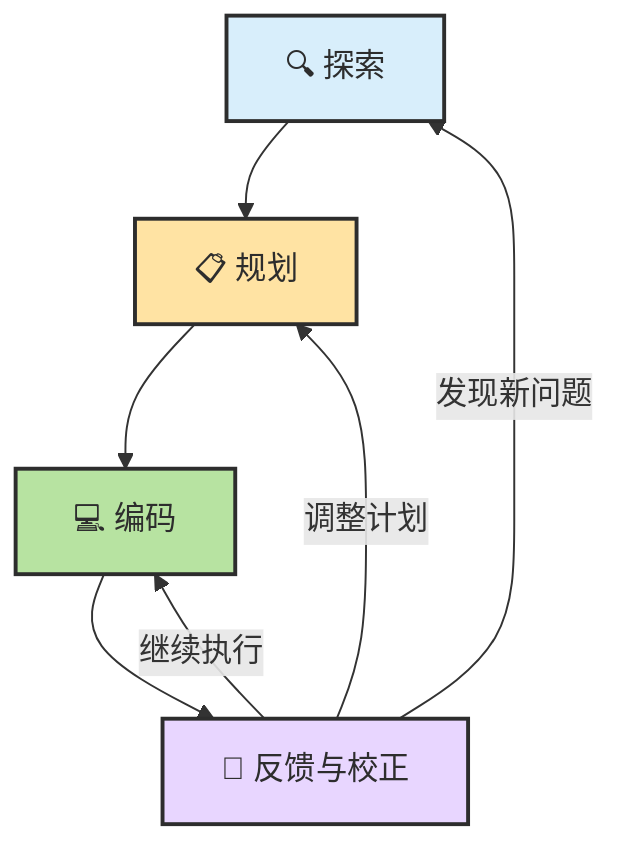
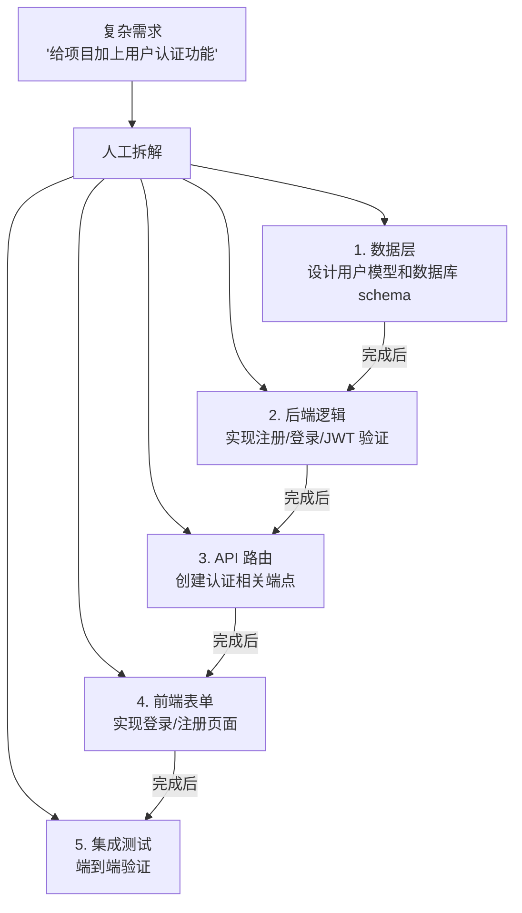

# Chapter 10 · 📋 Planning

> 目标：把 Planning 从一句口号拆成一套机制。读完这一章，你应该知道 ReAct、Reflection、Spec、任务分解和停止条件分别在 Planning 里扮演什么角色。

## 📑 目录

- [1. Planning 到底在规划什么](#1-planning-到底在规划什么)
- [2. 一条统一母流程](#2-一条统一母流程)
- [3. Spec-driven 和 Plan -> Act 不是一回事](#3-spec-driven-和-plan---act-不是一回事)
- [4. Spec、Plan、Task Breakdown、Stop Condition 的边界](#4-specplantask-breakdownstop-condition-的边界)
- [5. 一份好计划至少包含什么](#5-一份好计划至少包含什么)
- [6. 风险控制为什么属于 Planning](#6-风险控制为什么属于-planning)

---

## 1. Planning 到底在规划什么

Planning 不只是“列步骤”，而是在同时处理这些问题：

- 目标到底是什么
- 哪些内容在范围内，哪些不在
- 应该先做什么，后做什么
- 做到什么程度才算完成
- 中途怎样判断自己有没有跑偏

没有这一步，Agent 往往会边做边猜。

---

## 2. 一条统一母流程

最推荐长期保留的主流程是：

```text
Explore -> Spec -> Plan -> Act -> Verify -> Reflect
```

这条流程的价值在于：

- `Explore` 先减少误解
- `Spec` 先写清目标和边界
- `Plan` 再安排步骤
- `Act` 不会一开始就乱改
- `Verify` 把结果拉回现实
- `Reflect` 让下一轮不重复踩同样的坑

---

## 3. Spec-driven 和 Plan -> Act 不是一回事

这两个词经常被混着用，但它们解决的不是同一个问题：

| 维度 | `Spec-driven` | `Plan -> Act` |
|---|---|---|
| 它关心什么 | 结果应该长什么样 | 下一步怎么推进 |
| 核心对象 | 目标、边界、验收标准、非目标 | 顺序、依赖、风险、执行路径 |
| 更像什么 | `product / contract / acceptance` | `workflow / reasoning / orchestration` |
| 最怕什么 | 没写清楚要求 | 没组织好路径 |

所以更成熟的用法通常不是二选一，而是：

> 🧩 **用 Spec 锁定目标，用 Plan 组织路径，用 Act 落地执行，再用 Verify 回到 Spec 做闭环。**

### 问题驱动判断

**Q：什么时候该先写 Spec？**  
当任务有明确目标、验收标准、不能改的边界，或者一旦做偏代价很高时，先写一个哪怕很短的 mini-spec 都更稳。

**Q：什么时候该先 Explore / Plan，而不是急着写 Spec？**  
当任务还在排障、调研、读旧仓库、理解依赖关系时，往往先探索更自然。此时推荐的顺序不是直接 `Plan -> Act`，而是 `Explore -> Spec -> Plan -> Act`。

**Q：为什么有时 plan 写得很漂亮，最后还是跑偏？**  
因为 plan 只组织路径，不天然约束结果。没有 spec 时，Agent 很容易边执行边脑补需求。

---

## 4. Spec、Plan、Task Breakdown、Stop Condition 的边界

| 概念 | 它主要负责什么 |
|---|---|
| `Spec` | 明确要做什么、不做什么、什么叫完成 |
| `Plan` | 安排推进顺序、资源和验证路径 |
| `Task Breakdown` | 把大任务切成能执行的小块 |
| `Stop Condition` | 明确何时该停、何时该回报、何时该升级给人 |

最常见的问题是把这四件事糊成一团，最后变成一句模糊的话：

> “你先看着做吧。”

这往往是 Agent 失控的起点。

---

## 5. 一份好计划至少包含什么

一份够用的计划，至少要有这四项：

| 维度 | 说明 |
|---|---|
| Scope | 改哪里，不改哪里 |
| Order | 先后顺序是什么 |
| Verification | 改完怎么证明做对了 |
| Risk | 哪一步最可能翻车 |

如果你在计划里看不到这四项，通常就说明计划还不够“可执行”。

---

## 6. 风险控制为什么属于 Planning

很多人把风险控制理解成“快做完时再注意一下”。这太晚了。

真正稳的做法是，在 Planning 阶段就决定：

- 哪些动作高风险
- 哪些步骤必须停下来确认
- 哪些地方需要人工审批
- 哪些验证要前置，而不是收尾再补

> 🔒 **复杂任务的 Planning，本质上也是风险控制设计。**

---

## 📌 本章总结

- Planning 不是“列个步骤”那么简单，而是目标、范围、顺序、验证和风险的组合设计。
- `Explore -> Spec -> Plan -> Act -> Verify -> Reflect` 是最值得长期保留的统一母流程。
- `Spec-driven` 解决的是“别做偏”，`Plan -> Act` 解决的是“怎么推进”。
- `Spec / Plan / Breakdown / Stop Condition` 不该混用。
- 风险控制应该前移到 Planning 阶段，而不是最后收尾时再补。

## 📚 继续阅读

- 想把状态管理和上下文退化接上 Planning：继续看 [Ch11 · Memory、Context 与 Harness](./ch11-memory-context-harness.md)
- 想把 Planning 放进完整工具链：继续看 [Ch12 · Tools](./ch12-tools.md)

---

<div align="center">

[📚 返回目录](../../README.md#tutorial-contents) | [⬅️ 上一章：Ch09 LLM 推理基础](./ch09-llm-reasoning-basics.md) | [➡️ 下一章：Ch11 Memory、Context 与 Harness](./ch11-memory-context-harness.md)

</div>

---

## 📎 保留原文与延伸材料

Planning 这一章需要吃掉旧教程里“规划优先、Prompt 约束、Prompt 模板”那部分内容。先整体并入，再慢慢细拆。

<details>
<summary>📎 保留原文：原 Chapter 6：规划优先与 Prompt 工程</summary>

# Chapter 6 · 📋 规划优先与 Prompt 工程

> 🎯 **目标**：掌握"探索→规划→编码"三步工作法和高效 Prompt 约束技巧，让 Agent 从"能跑通"走向"稳定交付"。本章包含两个实验，完成后你将拥有一套可复用的任务推进流程和提示词模板。

## 📑 目录

- [实验 C：探索 → 规划 → 编码 三步工作法](#实验-c探索--规划--编码-三步工作法)
- [实验 D：高效 Prompt — 用具体 Context 和约束提升准确率](#实验-d高效-prompt--用具体-context-和约束提升准确率)
- [📌 关键 Takeaway](#-关键-takeaway)

---

> 📌 **本章只回答一个问题**：怎样让 Agent 不抢跑？如果 Ch05 解决的是“让 Agent 看懂项目并会自证”，本章解决的就是“怎样让它按你的节奏推进，而不是一上来把仓库改穿”。

## 实验 C：探索 → 规划 → 编码 三步工作法

实战中最常踩的坑不是"Agent 不会写代码"，而是 **Agent 没理解需求就开始动手，改了一堆文件，然后你发现方向跑偏了**。三步工作法的核心理念：**把任务拆成三个独立阶段，每个阶段有明确的产出和检查点，绝不跳步。**


> 🔑 **关键原则**：每个阶段之间都有一个人工检查点。Agent 不能"自动"从探索跳到编码——你是决策者。

---

### 1. 第一步：探索 — 让 Agent 发现问题（不修改代码）

探索阶段的目标：**让 Agent 建立对项目现状的理解，找出问题或改进点，但绝不修改任何文件。**

#### 实战场景

假设你想给项目的 API 层添加统一的错误处理。打开 Claude Code，用 `@` 引用精准指向相关代码：

```text
请分析 @src/api/ 目录下所有路由的错误处理方式：

1. 统计有多少个路由使用了 try-catch，有多少个直接抛出未包装的错误
2. 错误响应格式是否一致（status code、body 结构）
3. @src/middleware/errorHandler.ts 是否被所有路由使用
4. 现有测试中覆盖了哪些错误场景

不要修改任何文件，先给出分析报告。
```

#### 你在这一步做什么

| 你的动作 | 目的 |
|---------|------|
| 确认 Agent 看对了文件 | 防止它漏掉关键模块 |
| 追问不清楚的点 | 比如"你说的'不一致'具体指哪些接口？" |
| 补充 Agent 不知道的背景 | 比如"这个项目用了 Express，全局中间件在 app.ts 注册" |

> 💡 **为什么不能跳过探索？** 如果直接让 Agent"加统一错误处理"，它会按自己的假设动手——可能选了你不想用的方案，或忽略了已有的中间件。探索阶段让双方先对齐信息。

---

### 2. 第二步：规划 — 生成修改 Plan（不执行，只给计划）

确认 Agent 对项目的理解正确后，要求它生成一份修改计划，但 **明确告诉它不要执行**：

```text
基于你刚才的分析，请制定一份修改计划来统一 API 层的错误处理。

要求：
1. 列出要修改的文件和修改内容
2. 说明修改顺序（先改什么、后改什么、为什么）
3. 定义验证方法（改完后怎么证明是对的）
4. 列出潜在风险和回退方案

⚠️ 不要执行任何修改，只输出计划。
```

#### Plan 的标准格式

一个好的 Plan 应该长这样：

```markdown
## 修改计划：统一 API 层错误处理

### 修改清单
| # | 文件 | 改动 | 理由 |
|---|------|------|------|
| 1 | src/types/errors.ts | 新增统一错误类 AppError | 统一错误格式 |
| 2 | src/middleware/errorHandler.ts | 重写全局错误中间件 | 捕获并格式化所有错误 |
| 3 | src/api/users.ts | 替换 try-catch 为 AppError | 对齐新规范 |
| 4 | src/api/orders.ts | 替换 try-catch 为 AppError | 对齐新规范 |
| 5 | tests/api/error-handling.test.ts | 新增统一错误处理测试 | 验证修改正确性 |

### 执行顺序
1 → 2 → 5（先写测试）→ 3 → 4（逐个替换并运行测试）

### 验证方法
- 运行 `npm test`，全部通过
- 手动测试 /api/users 和 /api/orders 的错误响应格式
- 确认所有错误响应都包含 { code, message, details }

### 潜在风险
- 前端可能依赖旧的错误响应格式 → 需同步通知前端团队
- 第三方 webhook 的错误回调格式可能不同 → 保留独立处理
```

#### 你在这一步做什么

审查 Plan，重点关注：

| 检查项 | 常见问题 |
|--------|---------|
| 文件范围是否合理 | Agent 有时会"顺便"改不相关的文件 |
| 执行顺序是否安全 | 先写测试、再改代码 > 先改代码、后补测试 |
| 验证方法是否可执行 | "确认正确"不是验证，"运行命令 X 输出 Y"才是 |
| 风险评估是否充分 | Agent 倾向低估风险，主动追问"还有吗？" |

> 📌 **Plan 模式技巧**：在 Cursor 中可以使用 Plan Mode（`Cmd+.` 切换）让 Agent 只规划不执行。在 Claude Code CLI 中，直接在 prompt 末尾加"不要执行，只输出计划"即可。

---

### 3. 第三步：编码 — 确认后执行计划，每步验证

Plan 审查通过后，让 Agent 按计划执行，但要求 **逐步推进、每步验证**：

```text
Plan 看起来合理，请开始执行。要求：

1. 严格按计划顺序执行
2. 每完成一个文件的修改，就运行一次测试
3. 如果测试失败，先修复再继续下一步
4. 不要修改计划之外的文件
5. 全部完成后输出变更摘要
```

#### 如果执行中出现计划外情况

Agent 在执行 Plan 时可能遇到两种情况：

| 情况 | 正确做法 | 错误做法 |
|------|---------|---------|
| 发现 Plan 漏了一个文件 | 停下来告诉你，等确认后再改 | 自行决定改掉 |
| 遇到了意料之外的依赖 | 报告情况，让你决定是否调整 Plan | 硬着头皮继续 |

用这句话提前约束 Agent：

```text
如果执行过程中发现 Plan 有遗漏或需要调整，停下来告诉我，不要自行决定。
```

---

### 4. 第四步：反馈迭代 — 提出建议让 Agent 修改 Plan

三步工作法不是线性走一遍就结束，你经常需要在规划和编码之间迭代。

#### 场景一：审查 Plan 后要求调整

```text
Plan 整体不错，但我有两个调整：

1. 请在 AppError 类中增加一个 httpStatus 字段，
   这样中间件可以直接从错误对象读取 HTTP 状态码
2. 执行顺序改一下：先改 users.ts（因为它最简单，可以当模板），
   再改 orders.ts

请更新 Plan，更新后不要执行，我再看一下。
```

#### 场景二：执行中发现问题，回退并修改 Plan

```text
停一下。刚才改 users.ts 时发现，有些路由的错误来自第三方 SDK，
这些错误没有 code 字段。

请暂停执行，重新检查所有路由中来自第三方 SDK 的错误，
然后更新 Plan 来处理这种情况。更新后等我确认再继续。
```

#### 迭代流程



> 🔑 **核心心态**：Plan 不是合同，是草图。发现问题就回头调整，这比硬着头皮执行一个有缺陷的 Plan 高效得多。

---

### ✅ 检查点：实验 C 完成标志

完成以下 4 项，你就掌握了三步工作法：

- [ ] 能让 Agent 只探索不修改，产出结构化分析报告
- [ ] 能让 Agent 生成包含"文件清单、执行顺序、验证方法、风险评估"的完整 Plan
- [ ] 能让 Agent 按 Plan 逐步执行并验证，出现意外时暂停而非继续
- [ ] 能在 Plan 和执行之间迭代反馈，而不是推倒重来

#### 经验沉淀

完成实验后，把以下内容写入你项目的 `CLAUDE.md`：

```markdown
## 任务执行流程
1. 探索：先阅读相关代码，给出分析报告，不修改文件
2. 规划：基于分析给出修改计划（文件清单 + 顺序 + 验证方法），等我确认
3. 编码：按计划逐步执行，每步运行测试验证
4. 如遇计划外情况，暂停并报告，等我决定
```

---

## 实验 D：高效 Prompt — 用具体 Context 和约束提升准确率

实验 C 解决了"做事的流程"，实验 D 解决"说话的技术"——**同样的需求，不同的 Prompt 写法，Agent 的输出质量可以差 10 倍。**

---

### 1. 核心原理：约束 = 效率

很多人以为给 Agent 更多"自由度"会产出更好的结果。事实恰好相反：

| 维度 | 模糊 Prompt | 精确 Prompt |
|------|------------|------------|
| Token 消耗 | Agent 大量搜索试探，消耗 3-5x | 直达目标，消耗最小 |
| 完成时间 | 慢，可能来回多轮 | 快，通常一轮搞定 |
| 返工概率 | 高，30%+ 需要推倒重来 | 低，微调即可 |
| 适用场景 | 开放探索（你也不知道要什么） | 明确需求（你知道要什么） |

> 🔑 **约束不是限制 Agent 的能力，而是给它装上导航系统。** GPS 越精准，路线越短。

---

### 2. 六种高效约束技巧

以下六种技巧可以单独使用，也可以组合使用。每种都附带可直接复制的模板。

#### 📁 技巧一：指定文件范围

**问题**：不告诉 Agent 看哪里，它会从项目根目录开始地毯式搜索，消耗大量 Token 且可能找错文件。

```text
# CLI 写法：明确列出文件范围
请只修改以下文件，不要动其他文件：
- src/api/users.ts（路由逻辑）
- src/services/userService.ts（业务逻辑）
- tests/api/users.test.ts（对应测试）

# Cursor / VS Code 写法：用 @ 引用自动注入上下文
请修改 @src/api/users.ts 中的 createUser 函数，
参考 @src/services/userService.ts 的 validate 方法，
修改后更新 @tests/api/users.test.ts 中的相关测试。
```

> 💡 `@` 引用会自动把文件内容注入上下文，比让 Agent 自己搜索快 10 倍，且不会漏掉关键文件。

#### 🎯 技巧二：描述具体场景

**问题**：抽象的描述让 Agent 只能做通用回答；具体场景让它给出针对性方案。

```text
❌ 模糊：
帮我优化一下这个函数的性能。

✅ 具体场景：
getOrderList 函数在订单量超过 1 万条时响应时间超过 3 秒。
当前实现是一次性从数据库加载全部订单再在内存中分页。
请改为数据库层分页，保持返回格式不变。
```

**场景描述的三要素**：

| 要素 | 说明 | 示例 |
|------|------|------|
| **现状** | 目前是什么样 | "一次性加载全部订单" |
| **痛点** | 问题出在哪 | "1 万条时超过 3 秒" |
| **期望** | 希望变成什么样 | "数据库层分页，返回格式不变" |

#### 🧪 技巧三：指定测试偏好

**问题**：不指定测试偏好，Agent 要么不写测试，要么写一大堆无关紧要的测试。

```text
请为 parseConfig 函数补充测试，要求：

- 测试框架：使用项目已有的 Vitest
- 覆盖场景：
  1. 正常输入（完整 config 对象）
  2. 缺少必填字段（应抛出 ConfigError）
  3. 字段类型错误（应抛出 TypeError）
  4. 空输入（应使用默认值）
- 不需要测试：日志输出、性能、并发场景
- 运行命令：写完后执行 `npx vitest run src/utils/parseConfig.test.ts`
```

#### 📖 技巧四：提供参考资料

Agent 不知道你项目的私有约定。主动提供参考，让它"照着抄"而不是"自己猜"。

```text
# 引用已有代码作为模板
请参考 @src/api/users.ts 中 createUser 函数的错误处理模式，
用同样的方式为 @src/api/orders.ts 中所有路由添加错误处理。

# 引用项目文档
请按照 @docs/api-style-guide.md 中定义的响应格式，
重构 /api/products 接口的返回值。

# 引用外部链接（Claude Code 支持读取 URL）
请阅读 https://zod.dev/?id=basic-usage 的文档，
然后用 Zod 为 @src/types/config.ts 中的 Config 类型添加运行时校验。
```

#### 📐 技巧五：指定模式 / 模板

**问题**：Agent 每次可能用不同风格实现同一类功能，导致代码库不一致。

```text
请为 Payment 模块创建 CRUD API，严格遵循以下模式：

- 路由文件放在 src/api/payments.ts
- 业务逻辑放在 src/services/paymentService.ts
- 数据校验使用 Zod schema，放在 src/schemas/payment.ts
- 测试文件放在 tests/api/payments.test.ts
- 错误处理使用项目统一的 AppError 类
- 命名规范：函数用 camelCase，类型用 PascalCase

参考现有的 @src/api/users.ts 和 @src/services/userService.ts 的代码风格。
```

#### 🔍 技巧六：详细描述问题症状

**问题**：描述 Bug 时说"这个功能坏了"，Agent 无从下手；给出具体症状，它能快速定位。

```text
❌ 模糊：
登录功能有 bug，帮我修一下。

✅ 具体症状：
登录接口 POST /api/auth/login 出现以下问题：

- 输入正确的用户名密码，返回 200 和 token
- 使用这个 token 调用 GET /api/users/me 返回 401
- 错误信息："Token signature verification failed"
- 在 jwt.io 解码 token 发现 payload 正确
- 怀疑是签名密钥不匹配

请检查 @src/auth/jwt.ts 中签名和验证是否使用了同一个密钥。
先分析原因，不要直接改代码。
```

**Bug 描述四要素**：操作步骤 → 实际结果 → 预期结果 → 已有线索

---

### 3. 对比实验：模糊 Prompt vs 精确 Prompt

同一个需求——"为用户注册接口添加输入校验"，两种写法对比：

**❌ 模糊 Prompt**：

```text
帮我给用户注册加个校验。
```

**✅ 精确 Prompt**：

```text
请为 @src/api/users.ts 中的 POST /register 接口添加输入校验。

## 校验规则
- email：必填，合法邮箱格式
- password：必填，8-64 位，至少含一个大写字母和一个数字
- username：必填，3-20 位，只允许字母数字下划线

## 技术要求
- 使用项目已有的 Zod 库（参考 @src/schemas/auth.ts 的写法）
- Schema 定义放在 src/schemas/user.ts
- 校验失败返回 400，格式：{ code: "VALIDATION_ERROR", details: [...] }

## 不需要做的事
- 不要修改前端代码
- 不要修改数据库 schema
- 不要添加新的依赖

## 验证
- 写完后运行 `npm test -- --grep "register"`
- 确保原有测试不被破坏
```

#### 结果对比

| 维度 | 模糊 Prompt | 精确 Prompt |
|------|------------|------------|
| Agent 搜索的文件数 | 15-20 个 | 2-3 个（直接定位） |
| Token 消耗 | ~15K | ~5K |
| 完成轮次 | 2-3 轮（来回纠正） | 通常 1 轮 |
| 返工概率 | 高（规则不对、库选错、改了不该改的文件） | 低（约束明确，偏差空间小） |

> 📌 **不是每次都需要写这么详细。** 简单任务一句话就够。精确 Prompt 主要用于：涉及多文件修改、有特定技术要求、或 Agent 之前出过错的场景。

---

### 4. Method R：Prompt 开局框架

六种约束技巧解决了「说什么」，**Method R** 解决了「怎么开头」。在给 Agent 布置任务的第一句话里，交代好四个要素，能将后续轮次的返工率降低 30-50%：

| 要素 | 说明 | 示例 |
|------|------|------|
| **R — Role（角色）** | 告诉 Agent 以什么身份思考 | "请作为资深后端工程师" |
| **T — Task（任务）** | 一句话说清楚要做什么 | "审查以下 API 的安全性" |
| **C — Context（上下文）** | 提供决策所需的背景信息 | "项目使用 Express + TypeScript，已有全局错误处理中间件" |
| **F — Front Load（关键约束前置）** | 把最重要的限制放在最前面 | "不要修改现有测试；只关注 OWASP Top 10 漏洞" |

**组合示例**：

```text
[R] 请作为资深后端安全工程师，
[T] 审查 @src/api/auth.ts 中登录接口的安全性。
[C] 项目使用 Express 4 + JWT，已有全局错误处理中间件 @src/middleware/errorHandler.ts。
[F] 只关注 OWASP Top 10 漏洞；不要修改任何代码，只输出问题清单和优先级。
```

> 💡 **不需要每次都用全部四个要素。** 简单任务用 T+C 就够；只有当任务涉及多文件、高风险操作或 Agent 之前跑偏过的场景，才有必要加上 R 和 F。Method R 是一个检查清单，不是强制格式。

---

### ✅ 检查点：实验 D 完成标志

完成以下 4 项，你就掌握了高效 Prompt 技巧：

- [ ] 能写出包含"文件范围 + 具体场景 + 验证命令"的结构化 Prompt
- [ ] 能用 `@` 引用精准定位文件，而不是让 Agent 自己搜索
- [ ] 能为 Bug 提供"操作步骤 + 实际结果 + 预期结果 + 已有线索"四要素
- [ ] 知道什么时候用模糊 Prompt（开放探索）、什么时候用精确 Prompt（确定性执行）

#### 六种技巧速查卡

| 技巧 | 一句话口诀 | 什么时候用 |
|------|-----------|-----------|
| 📁 指定文件范围 | "告诉它看哪，别让它满项目找" | 任何涉及代码修改的场景 |
| 🎯 描述具体场景 | "现状 + 痛点 + 期望 = 精准需求" | 优化、重构、功能修改 |
| 🧪 指定测试偏好 | "覆盖什么、不覆盖什么、用什么框架" | 写测试、补测试 |
| 📖 提供参考资料 | "照着抄 > 自己猜" | 需要保持一致性的场景 |
| 📐 指定模式/模板 | "用现有代码当模板" | 创建新模块、重复性工作 |
| 🔍 详细描述症状 | "操作 + 实际 + 预期 + 线索" | Bug 修复、问题排查 |

#### 经验沉淀

把最常用的约束模板写入 `CLAUDE.md`，省去每次重复说明：

```markdown
## 代码修改规范
- 使用 Zod 做输入校验
- 错误处理使用 AppError 类
- 测试使用 Vitest，写完后运行 `npm test`
- 新 API 路由参考 src/api/users.ts 的风格
- 不要引入项目 package.json 中没有的新依赖
```

---

## 📌 关键 Takeaway

### 三条核心原则

> 🔑 **探索→规划→编码是最稳的工作流。** 不要让 Agent 一看到任务就写代码。先让它展示理解、给出计划、等你确认，再分步执行。每个阶段之间的人工检查点是质量的防火墙。

> 🔑 **约束不是限制，是 Agent 的导航系统。** 文件范围、具体场景、测试偏好、参考模板——这些约束看似在"限制"Agent，实际上是在帮它避开 90% 的无效搜索和错误假设。约束越精准，结果越好。

> 🔑 **`@` 引用精准定位比 Agent 自己搜索高效 10 倍。** 永远优先用 `@` 引用告诉 Agent 看哪些文件，而不是让它用工具搜索整个项目。这不仅省 Token，还能避免它漏掉关键文件或找错目标。

### 实验 C + D 综合应用模板

把两个实验的技巧合在一起，就是一个完整的任务执行模板：

```text
## 第一步：探索
请阅读 @src/api/payments.ts 和 @src/services/paymentService.ts，
分析当前退款流程的实现方式。不要修改任何文件。

## 第二步：规划（等探索完成后发送）
基于你的分析，请制定修改计划来支持部分退款功能。
列出文件清单、执行顺序、验证方法。不要执行，等我确认。

## 第三步：编码（等计划确认后发送）
Plan 确认，请开始执行。每步改完运行 `npm test`。
如遇计划外情况，暂停并告诉我。
```

> 💡 **提示**：这三步不需要在一条消息里全部发出。最好的实践是逐步发送——每一步的输出是下一步的输入，中间有你的审查和反馈。

---

<div align="center">

[📚 返回目录](../../README.md#tutorial-contents) | [⬅️ 上一章：Ch05 代码探索与验证](./ch10-planning.md) | [➡️ 下一章：Ch07 扩展生态与会话管理](./ch03-first-extension-setup.md)

</div>

</details>

<details>
<summary>📎 保留原文：原专题：Prompt 模板库</summary>

---
> 📚 **Part IV · 进阶专题** | [← 返回专题目录](../../README.md#tutorial-contents)
---

# 💬 Prompt 模板库

> 🎯 收集和整理在 Agent 编程中经过验证的高效 Prompt 模板，可直接复制使用。

## 目录
- [1. 概述](#1-概述)
- [2. 核心内容](#2-核心内容)
- [3. 实战建议](#3-实战建议)

---

## 1. 概述

好的 Prompt 是 Agent 高效工作的起点。这篇专题收集了在真实项目中反复验证过的 Prompt 模板，覆盖需求分析、代码生成、重构、调试、测试、代码审查等常见场景。每个模板都附带使用说明和效果预期。

---

## 2. 任务拆解方法论

复杂需求直接丢给 Agent 往往效果不好。人工预先拆解可以大幅提升成功率：



### 拆解的原则

| 原则 | 说明 |
|------|------|
| **单一关注点** | 每个子任务只涉及一个模块或关注点 |
| **可验证** | 每个子任务有明确的完成条件 |
| **30 分钟规则** | 每个子任务应在 ~30 分钟内完成 |
| **依赖清晰** | 明确哪些子任务有先后依赖 |
| **变更范围小** | 每个子任务修改的文件数尽量少（<5 个） |

---

## 3. 沟通模板

### 探索性任务

```
先阅读这个仓库的 README 和目录结构。
然后告诉我：
1. 项目的技术栈是什么
2. 核心模块有哪些
3. 要实现 [我的需求]，你建议从哪里入手
不要修改任何代码，先给出你的分析。
```

### 实现性任务

```
## 目标
[清晰的一句话目标]

## 约束
- 只修改 src/auth/ 目录下的文件
- 使用项目已有的 [xxx] 库
- 遵循项目现有的代码风格

## 步骤
1. 先给出实现方案，等我确认
2. 实现后运行 `npm test`
3. 如果测试失败，修复后再次运行
4. 全部通过后输出变更摘要
```

### 调试性任务

```
这个测试 `[test name]` 失败了，错误信息如下：
[粘贴关键错误信息，不要全部日志]

请先分析可能的原因（列出 2-3 个），
然后从最可能的原因开始排查。
每次修改后运行测试验证。
```

### 长任务分阶段模板

```
## 总目标
[一句话描述最终目标]

## 当前阶段
[只描述这个阶段要完成的事]

## 完成条件
- [ ] 条件 1
- [ ] 条件 2
- [ ] 运行 `xxx` 验证通过

## 约束
- 不要修改 [xxx] 目录
- 如果遇到 [xxx] 情况，先停下来告诉我

## 上阶段摘要
[如果是接续任务，附上上阶段的简要总结]
```

---

## 4. 实战建议

- **默认带上的三句话**：先分析再执行 / 修改后必须验证 / 如果不确定就停下来说明
- **高风险任务**：先让 Agent 做"顾问"（分析、方案），确认后再做"执行者"
- **长任务**：分阶段执行，每阶段用上方模板明确目标和约束

---

> 📖 **相关章节**：[🧩 上下文工程深入](../topics/topic-context-engineering.md) · [🤝 人机协同详解](../topics/topic-human-agent-collab.md)

---

返回目录：[README · 章节目录](../../README.md#tutorial-contents)

</details>
