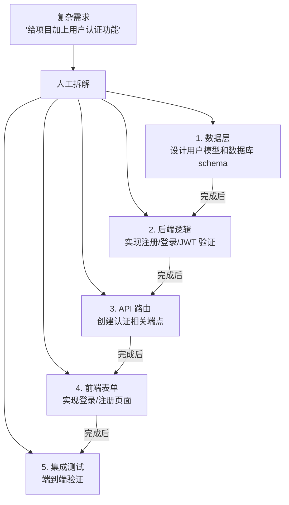
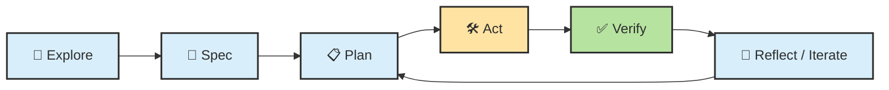
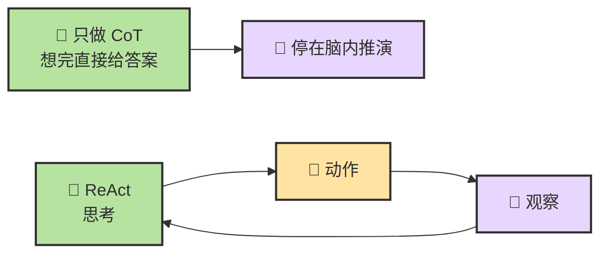

# Chapter 10 · 📋 Planning

> 目标：把 Planning 从一句口号拆成一套机制。读完这一章，你应该知道 ReAct、Reflection、Spec、任务分解和停止条件分别在 Planning 里扮演什么角色。

## 📑 目录

- [1. Planning 到底在规划什么](#1-planning-到底在规划什么)
- [2. 一条统一母流程](#2-一条统一母流程)
- [3. Spec-driven 和 Plan -> Act 不是一回事](#3-spec-driven-和-plan---act-不是一回事)
- [4. Spec、Plan、Task Breakdown、Stop Condition 的边界](#4-specplantask-breakdownstop-condition-的边界)
- [5. 一份好计划至少包含什么](#5-一份好计划至少包含什么)
- [6. 风险控制为什么属于 Planning](#6-风险控制为什么属于-planning)

---

## 1. Planning 到底在规划什么

Planning 不只是“列步骤”，而是在同时处理这些问题：

- 目标到底是什么
- 哪些内容在范围内，哪些不在
- 应该先做什么，后做什么
- 做到什么程度才算完成
- 中途怎样判断自己有没有跑偏

没有这一步，Agent 往往会边做边猜。

---

## 2. 一条统一母流程

最推荐长期保留的主流程是：

```text
Explore -> Spec -> Plan -> Act -> Verify -> Reflect
```

这条流程的价值在于：

- `Explore` 先减少误解
- `Spec` 先写清目标和边界
- `Plan` 再安排步骤
- `Act` 不会一开始就乱改
- `Verify` 把结果拉回现实
- `Reflect` 让下一轮不重复踩同样的坑

---

## 3. Spec-driven 和 Plan -> Act 不是一回事

这两个词经常被混着用，但它们解决的不是同一个问题：

| 维度 | `Spec-driven` | `Plan -> Act` |
|---|---|---|
| 它关心什么 | 结果应该长什么样 | 下一步怎么推进 |
| 核心对象 | 目标、边界、验收标准、非目标 | 顺序、依赖、风险、执行路径 |
| 更像什么 | `product / contract / acceptance` | `workflow / reasoning / orchestration` |
| 最怕什么 | 没写清楚要求 | 没组织好路径 |

所以更成熟的用法通常不是二选一，而是：

> 🧩 **用 Spec 锁定目标，用 Plan 组织路径，用 Act 落地执行，再用 Verify 回到 Spec 做闭环。**

### 问题驱动判断

**Q：什么时候该先写 Spec？**  
当任务有明确目标、验收标准、不能改的边界，或者一旦做偏代价很高时，先写一个哪怕很短的 mini-spec 都更稳。

**Q：什么时候该先 Explore / Plan，而不是急着写 Spec？**  
当任务还在排障、调研、读旧仓库、理解依赖关系时，往往先探索更自然。此时推荐的顺序不是直接 `Plan -> Act`，而是 `Explore -> Spec -> Plan -> Act`。

**Q：为什么有时 plan 写得很漂亮，最后还是跑偏？**  
因为 plan 只组织路径，不天然约束结果。没有 spec 时，Agent 很容易边执行边脑补需求。

---

## 4. Spec、Plan、Task Breakdown、Stop Condition 的边界

| 概念 | 它主要负责什么 |
|---|---|
| `Spec` | 明确要做什么、不做什么、什么叫完成 |
| `Plan` | 安排推进顺序、资源和验证路径 |
| `Task Breakdown` | 把大任务切成能执行的小块 |
| `Stop Condition` | 明确何时该停、何时该回报、何时该升级给人 |

最常见的问题是把这四件事糊成一团，最后变成一句模糊的话：

> “你先看着做吧。”

这往往是 Agent 失控的起点。

---

## 5. 一份好计划至少包含什么

一份够用的计划，至少要有这四项：

| 维度 | 说明 |
|---|---|
| Scope | 改哪里，不改哪里 |
| Order | 先后顺序是什么 |
| Verification | 改完怎么证明做对了 |
| Risk | 哪一步最可能翻车 |

如果你在计划里看不到这四项，通常就说明计划还不够”可执行”。

<details>
<summary><span style=”color: #e67e22; font-weight: bold;”>📝 进阶：六种高效 Prompt 约束技巧与 Method R 框架</span></summary>

### 六种高效约束技巧

以下六种技巧可以单独使用，也可以组合使用。每种都附带可直接复制的模板。

#### 📁 技巧一：指定文件范围

**问题**：不告诉 Agent 看哪里，它会从项目根目录开始地毯式搜索，消耗大量 Token 且可能找错文件。

```text
# CLI 写法：明确列出文件范围
请只修改以下文件，不要动其他文件：
- src/api/users.ts（路由逻辑）
- src/services/userService.ts（业务逻辑）
- tests/api/users.test.ts（对应测试）

# Cursor / VS Code 写法：用 @ 引用自动注入上下文
请修改 @src/api/users.ts 中的 createUser 函数，
参考 @src/services/userService.ts 的 validate 方法，
修改后更新 @tests/api/users.test.ts 中的相关测试。
```

> 💡 `@` 引用会自动把文件内容注入上下文，比让 Agent 自己搜索快 10 倍，且不会漏掉关键文件。

#### 🎯 技巧二：描述具体场景

**问题**：抽象的描述让 Agent 只能做通用回答；具体场景让它给出针对性方案。

```text
❌ 模糊：
帮我优化一下这个函数的性能。

✅ 具体场景：
getOrderList 函数在订单量超过 1 万条时响应时间超过 3 秒。
当前实现是一次性从数据库加载全部订单再在内存中分页。
请改为数据库层分页，保持返回格式不变。
```

**场景描述的三要素**：

| 要素 | 说明 | 示例 |
|------|------|------|
| **现状** | 目前是什么样 | “一次性加载全部订单” |
| **痛点** | 问题出在哪 | “1 万条时超过 3 秒” |
| **期望** | 希望变成什么样 | “数据库层分页，返回格式不变” |

#### 🧪 技巧三：指定测试偏好

**问题**：不指定测试偏好，Agent 要么不写测试，要么写一大堆无关紧要的测试。

```text
请为 parseConfig 函数补充测试，要求：

- 测试框架：使用项目已有的 Vitest
- 覆盖场景：
  1. 正常输入（完整 config 对象）
  2. 缺少必填字段（应抛出 ConfigError）
  3. 字段类型错误（应抛出 TypeError）
  4. 空输入（应使用默认值）
- 不需要测试：日志输出、性能、并发场景
- 运行命令：写完后执行 `npx vitest run src/utils/parseConfig.test.ts`
```

#### 📖 技巧四：提供参考资料

Agent 不知道你项目的私有约定。主动提供参考，让它”照着抄”而不是”自己猜”。

```text
# 引用已有代码作为模板
请参考 @src/api/users.ts 中 createUser 函数的错误处理模式，
用同样的方式为 @src/api/orders.ts 中所有路由添加错误处理。

# 引用项目文档
请按照 @docs/api-style-guide.md 中定义的响应格式，
重构 /api/products 接口的返回值。

# 引用外部链接（Claude Code 支持读取 URL）
请阅读 https://zod.dev/?id=basic-usage 的文档，
然后用 Zod 为 @src/types/config.ts 中的 Config 类型添加运行时校验。
```

#### 📐 技巧五：指定模式 / 模板

**问题**：Agent 每次可能用不同风格实现同一类功能，导致代码库不一致。

```text
请为 Payment 模块创建 CRUD API，严格遵循以下模式：

- 路由文件放在 src/api/payments.ts
- 业务逻辑放在 src/services/paymentService.ts
- 数据校验使用 Zod schema，放在 src/schemas/payment.ts
- 测试文件放在 tests/api/payments.test.ts
- 错误处理使用项目统一的 AppError 类
- 命名规范：函数用 camelCase，类型用 PascalCase

参考现有的 @src/api/users.ts 和 @src/services/userService.ts 的代码风格。
```

#### 🔍 技巧六：详细描述问题症状

**问题**：描述 Bug 时说”这个功能坏了”，Agent 无从下手；给出具体症状，它能快速定位。

```text
❌ 模糊：
登录功能有 bug，帮我修一下。

✅ 具体症状：
登录接口 POST /api/auth/login 出现以下问题：

- 输入正确的用户名密码，返回 200 和 token
- 使用这个 token 调用 GET /api/users/me 返回 401
- 错误信息：”Token signature verification failed”
- 在 jwt.io 解码 token 发现 payload 正确
- 怀疑是签名密钥不匹配

请检查 @src/auth/jwt.ts 中签名和验证是否使用了同一个密钥。
先分析原因，不要直接改代码。
```

**Bug 描述四要素**：操作步骤 → 实际结果 → 预期结果 → 已有线索

#### 六种技巧速查卡

| 技巧 | 一句话口诀 | 什么时候用 |
|------|-----------|-----------|
| 📁 指定文件范围 | “告诉它看哪，别让它满项目找” | 任何涉及代码修改的场景 |
| 🎯 描述具体场景 | “现状 + 痛点 + 期望 = 精准需求” | 优化、重构、功能修改 |
| 🧪 指定测试偏好 | “覆盖什么、不覆盖什么、用什么框架” | 写测试、补测试 |
| 📖 提供参考资料 | “照着抄 > 自己猜” | 需要保持一致性的场景 |
| 📐 指定模式/模板 | “用现有代码当模板” | 创建新模块、重复性工作 |
| 🔍 详细描述症状 | “操作 + 实际 + 预期 + 线索” | Bug 修复、问题排查 |

---

### Method R：Prompt 开局框架

六种约束技巧解决了「说什么」，**Method R** 解决了「怎么开头」。在给 Agent 布置任务的第一句话里，交代好四个要素，能将后续轮次的返工率降低 30-50%：

| 要素 | 说明 | 示例 |
|------|------|------|
| **R — Role（角色）** | 告诉 Agent 以什么身份思考 | “请作为资深后端工程师” |
| **T — Task（任务）** | 一句话说清楚要做什么 | “审查以下 API 的安全性” |
| **C — Context（上下文）** | 提供决策所需的背景信息 | “项目使用 Express + TypeScript，已有全局错误处理中间件” |
| **F — Front Load（关键约束前置）** | 把最重要的限制放在最前面 | “不要修改现有测试；只关注 OWASP Top 10 漏洞” |

**组合示例**：

```text
[R] 请作为资深后端安全工程师，
[T] 审查 @src/api/auth.ts 中登录接口的安全性。
[C] 项目使用 Express 4 + JWT，已有全局错误处理中间件 @src/middleware/errorHandler.ts。
[F] 只关注 OWASP Top 10 漏洞；不要修改任何代码，只输出问题清单和优先级。
```

> 💡 **不需要每次都用全部四个要素。** 简单任务用 T+C 就够；只有当任务涉及多文件、高风险操作或 Agent 之前跑偏过的场景，才有必要加上 R 和 F。Method R 是一个检查清单，不是强制格式。

---

### 对比实验：模糊 Prompt vs 精确 Prompt

同一个需求——“为用户注册接口添加输入校验”，两种写法对比：

**❌ 模糊 Prompt**：

```text
帮我给用户注册加个校验。
```

**✅ 精确 Prompt**：

```text
请为 @src/api/users.ts 中的 POST /register 接口添加输入校验。

## 校验规则
- email：必填，合法邮箱格式
- password：必填，8-64 位，至少含一个大写字母和一个数字
- username：必填，3-20 位，只允许字母数字下划线

## 技术要求
- 使用项目已有的 Zod 库（参考 @src/schemas/auth.ts 的写法）
- Schema 定义放在 src/schemas/user.ts
- 校验失败返回 400，格式：{ code: “VALIDATION_ERROR”, details: [...] }

## 不需要做的事
- 不要修改前端代码
- 不要修改数据库 schema
- 不要添加新的依赖

## 验证
- 写完后运行 `npm test -- --grep “register”`
- 确保原有测试不被破坏
```

#### 结果对比

| 维度 | 模糊 Prompt | 精确 Prompt |
|------|------------|------------|
| Agent 搜索的文件数 | 15-20 个 | 2-3 个（直接定位） |
| Token 消耗 | ~15K | ~5K |
| 完成轮次 | 2-3 轮（来回纠正） | 通常 1 轮 |
| 返工概率 | 高（规则不对、库选错、改了不该改的文件） | 低（约束明确，偏差空间小） |

> 📌 **不是每次都需要写这么详细。** 简单任务一句话就够。精确 Prompt 主要用于：涉及多文件修改、有特定技术要求、或 Agent 之前出过错的场景。

</details>

---

## 6. 风险控制为什么属于 Planning

很多人把风险控制理解成“快做完时再注意一下”。这太晚了。

真正稳的做法是，在 Planning 阶段就决定：

- 哪些动作高风险
- 哪些步骤必须停下来确认
- 哪些地方需要人工审批
- 哪些验证要前置，而不是收尾再补

> 🔒 **复杂任务的 Planning，本质上也是风险控制设计。**

---

## 📌 本章总结

- Planning 不是“列个步骤”那么简单，而是目标、范围、顺序、验证和风险的组合设计。
- `Explore -> Spec -> Plan -> Act -> Verify -> Reflect` 是最值得长期保留的统一母流程。
- `Spec-driven` 解决的是“别做偏”，`Plan -> Act` 解决的是“怎么推进”。
- `Spec / Plan / Breakdown / Stop Condition` 不该混用。
- 风险控制应该前移到 Planning 阶段，而不是最后收尾时再补。

<details>
<summary><span style="color: #e67e22; font-weight: bold;">📋 进阶：Prompt 模板库与任务拆解方法论</span></summary>

### 任务拆解方法论

复杂需求直接丢给 Agent 往往效果不好。人工预先拆解可以大幅提升成功率：



#### 拆解的原则

| 原则 | 说明 |
|------|------|
| **单一关注点** | 每个子任务只涉及一个模块或关注点 |
| **可验证** | 每个子任务有明确的完成条件 |
| **30 分钟规则** | 每个子任务应在 ~30 分钟内完成 |
| **依赖清晰** | 明确哪些子任务有先后依赖 |
| **变更范围小** | 每个子任务修改的文件数尽量少（<5 个） |

---

### Prompt 模板库

#### 探索性任务

```
先阅读这个仓库的 README 和目录结构。
然后告诉我：
1. 项目的技术栈是什么
2. 核心模块有哪些
3. 要实现 [我的需求]，你建议从哪里入手
不要修改任何代码，先给出你的分析。
```

#### 实现性任务

```
## 目标
[清晰的一句话目标]

## 约束
- 只修改 src/auth/ 目录下的文件
- 使用项目已有的 [xxx] 库
- 遵循项目现有的代码风格

## 步骤
1. 先给出实现方案，等我确认
2. 实现后运行 `npm test`
3. 如果测试失败，修复后再次运行
4. 全部通过后输出变更摘要
```

#### 调试性任务

```
这个测试 `[test name]` 失败了，错误信息如下：
[粘贴关键错误信息，不要全部日志]

请先分析可能的原因（列出 2-3 个），
然后从最可能的原因开始排查。
每次修改后运行测试验证。
```

#### 长任务分阶段模板

```
## 总目标
[一句话描述最终目标]

## 当前阶段
[只描述这个阶段要完成的事]

## 完成条件
- [ ] 条件 1
- [ ] 条件 2
- [ ] 运行 `xxx` 验证通过

## 约束
- 不要修改 [xxx] 目录
- 如果遇到 [xxx] 情况，先停下来告诉我

## 上阶段摘要
[如果是接续任务，附上上阶段的简要总结]
```

---

#### 实战建议

- **默认带上的三句话**：先分析再执行 / 修改后必须验证 / 如果不确定就停下来说明
- **高风险任务**：先让 Agent 做"顾问"（分析、方案），确认后再做"执行者"
- **长任务**：分阶段执行，每阶段用上方模板明确目标和约束

</details>

## 📚 继续阅读

- 想把状态管理和上下文退化接上 Planning：继续看 [Ch11 · Memory、Context 与 Harness](./ch11-memory-context-harness.md)
- 想把 Planning 放进完整工具链：继续看 [Ch12 · Tools](./ch12-tools.md)


---

<a id="ch2-sec-4"></a>
## 4. Planning：把目标变成可执行闭环

### 4.1 Planning 到底在规划什么

Planning 不是“先想一想”这么简单。它至少在管五件事：

1. 🎯 目标澄清：到底要完成什么，什么不在范围内
2. 🪓 任务拆解：该分成哪些步骤，哪些可以并行，哪些必须串行
3. 🧭 顺序安排：先探索什么，再执行什么，卡住了回到哪里
4. 🛑 停止条件：做到什么程度算完成，什么情况下必须停下
5. ✅ 验证路径：每一步完成以后，拿什么证据判断它是对的

没有这些东西，系统就很容易从“会生成”滑向“会乱写”。

### 4.2 一条统一母流程：Explore -> Spec -> Plan -> Act -> Verify -> Reflect

把后续章节里分散的工作流统一起来，可以压成这一条：



| 阶段 | 核心问题 | 产物 |
| --- | --- | --- |
| `Explore` | 先看清现状，不急着动手 | 仓库理解、问题边界、证据 |
| `Spec` | 先定义要做成什么 | 目标、约束、验收标准 |
| `Plan` | 决定怎么推进 | 步骤、顺序、风险点 |
| `Act` | 真的执行动作 | 改代码、跑命令、写文档 |
| `Verify` | 用证据检查 | 测试、编译、diff、对照 |
| `Reflect / Iterate` | 是否改计划、继续、停下 | 新计划、回退、升级处理 |

### 4.3 Spec、Plan、Task Breakdown、Stop Condition 各自管什么

这几个词经常混用，但它们其实不是一回事。

| 对象 | 它回答什么问题 | 常见形式 |
| --- | --- | --- |
| `Spec` | 这件事到底要做成什么 | 需求、约束、验收标准 |
| `Plan` | 我准备按什么顺序推进 | 步骤列表、里程碑、验证点 |
| `Task Breakdown` | 这件事能拆成哪些更小块 | 子任务、依赖关系、责任边界 |
| `Stop Condition` | 什么时候算完成或该停 | 测试通过、风险触发、人类确认 |

一个常见错误是：

- 还没搞清楚 `Spec`，就直接开始写 `Plan`
- `Plan` 里全是动作，没有停止条件和验证点

这种计划看起来很忙，实际上非常脆。

### 4.4 一份好计划，至少包含四件事

对于大多数工程任务，一份够用的计划至少要有这四件事：

| 要素 | 说明 |
| --- | --- |
| `Scope` | 明确本次只做什么，不做什么 |
| `Order` | 先后顺序和关键依赖 |
| `Verification` | 每一步之后如何确认没跑偏 |
| `Risk` | 哪些地方最容易炸，触发后怎么处理 |

这也是为什么“先 Plan 再 Act”并不是形式主义。它真正避免的是三种浪费：

- 在错误问题上做大量正确工作
- 在缺少证据的情况下扩大战果
- 明明已经跑偏，却因为没有停止条件而继续堆修改

### 4.5 计划不是合同，而是可回写草图

Planning 不是为了把未来一次性写死，而是为了给系统一个随时可改写的轨道。

正确的心态应该是：

- 计划先给出第一条可执行路径
- 一旦探索结果、工具输出、验证结果变了，就允许回写计划
- 计划的价值在于让偏航被看见，而不是让偏航被禁止

### 4.6 推理、ReAct、Plan-and-Execute 与 Reflecting 各在解决什么

为了尽量不丢旧版知识点，但也不把这一节写成“推理方法大全”，这里把几条高频路径压成一张表。

| 概念 | 它主要解决什么 | 在这一章里需要记住什么 |
| --- | --- | --- |
| `Reasoning / CoT` | 让模型更像会分步思考 | 推理先回答“怎么想得更稳” |
| `ReAct` | 把思考和行动、观察接成同一个循环 | ReAct 先回答“怎么边想边试边看” |
| `Plan-and-Execute` | 先做较完整计划，再逐步执行 | 更适合结构更清晰的任务 |
| `Reflecting` | 把“上一步哪里错了”沉淀下来 | 反思层让系统更会从失败里收敛 |



📌 这里保留一个很重要的判断：

> 🧭 **Planning 不是“先列个计划”那么简单，它其实是从推理、拆解、行动、反思到验证的一整条控制链。**

---

---

<div align="center">

[📚 返回目录](../../README.md#tutorial-contents) | [⬅️ 上一章：Ch09 LLM 推理基础](./ch09-llm-reasoning-basics.md) | [➡️ 下一章：Ch11 Memory、Context 与 Harness](./ch11-memory-context-harness.md)

</div>

