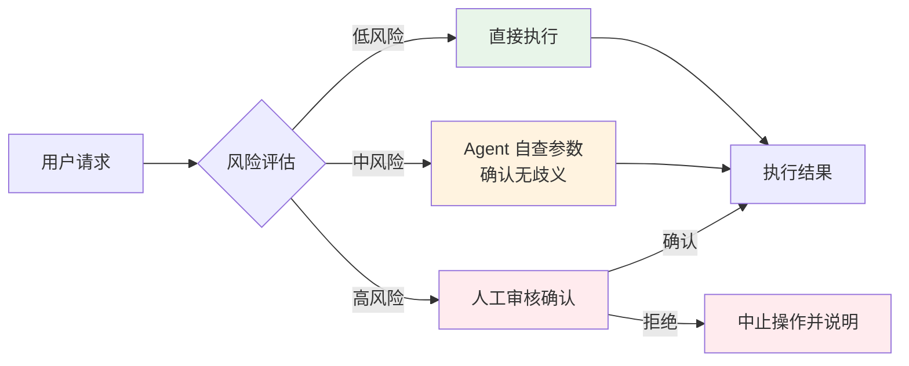
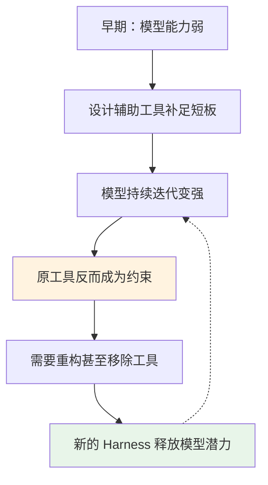

# Chapter 11 · 🧬 Agent 设计模式与代码库策略

> 🎯 **目标**：掌握六种经过实战验证的 Agent 协作模式，理解它们在大型代码库中的组合方式、隔离策略和安全边界。读完本章，你将从“临时拼凑”升级到“系统设计 Agent 协作”。

## 📑 目录

- [1. 🧠 为什么需要设计模式](#1--为什么需要设计模式)
- [2. 🏗️ 六大核心模式](#2-️-六大核心模式)
  - [🔀 Router Pattern — 路由分发](#-router-pattern--路由分发)
  - [🔄 Evaluator-Optimizer — 评估优化循环](#-evaluator-optimizer--评估优化循环)
  - [📋 Planner-Worker — 规划执行分离](#-planner-worker--规划执行分离)
  - [🔍 RAG-Augmented Coding — 检索增强编程](#-rag-augmented-coding--检索增强编程)
  - [👁️ Writer-Reviewer — 写审互纠](#️-writer-reviewer--写审互纠)
  - [🌿 Worktree Isolation — 并行隔离](#-worktree-isolation--并行隔离)
- [3. 📊 模式适用场景矩阵](#3--模式适用场景矩阵)
- [4. 🏢 大型项目中的模式组合与代码库策略](#4--大型项目中的模式组合与代码库策略)
- [5. 🛡️ 安全护栏模式：风险分级执行](#5-️-安全护栏模式风险分级执行)
- [6. ⚙️ Harness 演进原则：工具与模型共同进化](#6-️-harness-演进原则工具与模型共同进化)
- [📌 本章总结](#-本章总结)

---

## 1. 🧠 为什么需要设计模式

### 从"写提示词"到"设计 Agent 系统"

Ch05 提出了一个核心观点：**Agent 效果 = 模型能力 × Harness 质量**。模型是马，Harness 是马具。但当任务复杂到需要多匹马协同拉车时，光有好马具还不够——你需要一套**编队策略**。

| 阶段 | 典型做法 | 上限 |
|:---:|---|---|
| 单 Agent + 长提示词 | 把所有需求塞进一个 prompt | 上下文窗口耗尽，任务越复杂越不稳定 |
| 单 Agent + 工具链 | 给 Agent 配备搜索、执行、测试等工具 | 工具虽多但 Agent 需要自己决策全流程 |
| **多 Agent + 设计模式** | 不同 Agent 各司其职，按模式协作 | 每个 Agent 专注擅长领域，整体质量显著提升 |

> **🔑 核心认知**：设计模式不是学术概念——它是前人踩坑后沉淀的"最佳编队方案"。传统软件工程有 GoF 的 23 种设计模式，Agent 时代同样需要自己的模式语言。模式的核心价值在于**可复用、可组合、可沟通**——团队说"用 Writer-Reviewer 模式"就能立刻对齐理解。

---

## 2. 🏗️ 六大核心模式

### 🔀 Router Pattern — 路由分发

**一句话**：主 Agent 接收任务，根据类型分发给领域子 Agent 处理。

```mermaid
flowchart TB
    classDef router fill:#2d2d2d,stroke:#e5c07b
    classDef sub fill:#2d2d2d,stroke:#61dafb
    classDef result fill:#2d2d2d,stroke:#98c379

    User(["👤 用户请求"]):::router
    Router(["🔀 Router Agent<br/>分析意图 · 分发任务"]):::router

    subgraph Workers["领域子 Agent"]
        W1(["💻 Code Agent<br/>编码 · 重构"]):::sub
        W2(["🧪 Test Agent<br/>测试 · 覆盖率"]):::sub
        W3(["📖 Doc Agent<br/>文档 · 注释"]):::sub
        W4(["🔒 Security Agent<br/>漏洞 · 审计"]):::sub
    end

    Result(["📦 汇总结果"]):::result

    User --> Router
    Router -->|"编码类任务"| W1
    Router -->|"测试类任务"| W2
    Router -->|"文档类任务"| W3
    Router -->|"安全类任务"| W4
    W1 --> Result
    W2 --> Result
    W3 --> Result
    W4 --> Result

    style Workers fill:#1a1a2e,stroke:#61dafb
```



**适用场景**：
- 仓库包含多种语言或技术栈（前端 / 后端 / 基础设施）
- 任务类型差异大，一个 Agent 难以兼顾所有领域
- 需要并行处理多个独立子任务

**实战例子**：Cursor 的 Task 工具就是一个典型 Router——你发起一个任务，它根据任务性质选择 `generalPurpose`、`explore`、`shell` 等不同类型的子 Agent 来执行。Claude Code 的 `dispatching-parallel-agents` Skill 也遵循此模式：主 Agent 识别出多个独立问题域后，每个域分发一个子 Agent 并行调查。

> **💡 关键点**：Router 的质量取决于分类准确性。分类错了，后续全错——因此 Router Agent 通常使用最强模型。

---

### 🔄 Evaluator-Optimizer — 评估优化循环

**一句话**：生成 Agent 产出结果，评估 Agent 打分并反馈，循环迭代直到达标。

```mermaid
flowchart LR
    classDef gen fill:#2d2d2d,stroke:#61dafb
    classDef eval fill:#2d2d2d,stroke:#e06c75
    classDef out fill:#2d2d2d,stroke:#98c379

    Input(["📥 任务输入"]):::gen
    Gen(["⚡ Generator Agent<br/>生成代码 / 方案"]):::gen
    Eval(["🔍 Evaluator Agent<br/>评分 · 找缺陷"]):::eval
    Decision{{"达标？"}}:::eval
    Output(["✅ 最终产出"]):::out

    Input --> Gen
    Gen --> Eval
    Eval --> Decision
    Decision -->|"❌ 未达标<br/>附带改进建议"| Gen
    Decision -->|"✅ 达标"| Output
```



**适用场景**：
- 代码质量要求高，一次生成难以满足标准
- 有明确的评估标准（测试通过率、Lint 规则、性能基线）
- 需要迭代优化的创造性任务（架构设计、API 设计）

**实战例子**：Anthropic 官方推荐的 SWE-bench 解题流程就是这个模式——Agent 生成补丁后，运行测试套件作为 Evaluator，未通过则带着错误信息重新生成。LangChain 的编码 Agent 在竞赛中加入"自验证循环"后排名从 Top 30 跃升至 Top 5。

> **💡 关键点**：Evaluator 必须独立于 Generator——用同一个 Agent 既生成又评审，等于学生自己给自己批改作业。

---

### 📋 Planner-Worker — 规划执行分离

**一句话**：强模型做高层规划和任务拆解，快速模型执行具体编码。

```mermaid
flowchart TB
    classDef plan fill:#2d2d2d,stroke:#c678dd
    classDef work fill:#2d2d2d,stroke:#61dafb
    classDef check fill:#2d2d2d,stroke:#98c379

    Spec(["📄 需求 / Spec"]):::plan

    subgraph Planning["🧠 规划层（强模型）"]
        P1(["任务拆解<br/>定义步骤 · 验收标准"]):::plan
        P2(["分配上下文<br/>每个任务需要哪些文件"]):::plan
    end

    subgraph Execution["⚡ 执行层（快速模型）"]
        E1(["Worker 1<br/>实现功能 A"]):::work
        E2(["Worker 2<br/>实现功能 B"]):::work
        E3(["Worker 3<br/>编写测试"]):::work
    end

    Verify(["✅ 验证 · 汇总"]):::check

    Spec --> Planning
    P1 --> P2
    P2 --> E1
    P2 --> E2
    P2 --> E3
    E1 --> Verify
    E2 --> Verify
    E3 --> Verify

    style Planning fill:#1a1a2e,stroke:#c678dd
    style Execution fill:#1a1a2e,stroke:#61dafb
```



**适用场景**：
- 大型功能开发，需要先规划再动手
- 任务可以拆解为多个独立子任务并行执行
- 需要控制 Token 成本——规划用贵模型，执行用便宜模型

**实战例子**：superpowers 插件的 `writing-plans` + `subagent-driven-development` 就是标准的 Planner-Worker 模式。主 Agent（Planner）读取 Spec 并产出详细的实施计划（精确到每个文件的改动），然后为每个 Task 分发一个独立子 Agent（Worker）去执行。Cursor 中用 `model: "fast"` 参数指定 Worker 使用快速模型，正是此模式的直接体现。

> **💡 关键点**：规划的粒度决定执行质量。superpowers 要求每个步骤是 2~5 分钟的"bite-sized task"——粒度过粗会让 Worker 迷失，过细会产生过多协调开销。

---

### 🔍 RAG-Augmented Coding — 检索增强编程

**一句话**：编码前先检索代码库，用相关代码片段作为上下文指导生成。

```mermaid
flowchart LR
    classDef query fill:#2d2d2d,stroke:#e5c07b
    classDef rag fill:#2d2d2d,stroke:#c678dd
    classDef gen fill:#2d2d2d,stroke:#61dafb
    classDef out fill:#2d2d2d,stroke:#98c379

    Task(["📝 编码任务"]):::query

    subgraph Retrieval["🔍 检索层"]
        Index(["📊 代码库索引<br/>向量化 / AST"]):::rag
        Search(["语义搜索<br/>关键词 + 嵌入"]):::rag
        Rank(["相关性排序<br/>Top-K 片段"]):::rag
    end

    subgraph Generation["⚡ 生成层"]
        Context(["🧩 上下文组装<br/>任务 + 检索结果"]):::gen
        Code(["💻 代码生成"]):::gen
    end

    Output(["📦 生成结果<br/>风格一致 · 接口匹配"]):::out

    Task --> Search
    Index --> Search
    Search --> Rank
    Rank --> Context
    Task --> Context
    Context --> Code
    Code --> Output

    style Retrieval fill:#1a1a2e,stroke:#c678dd
    style Generation fill:#1a1a2e,stroke:#61dafb
```



**适用场景**：
- 大型代码库（>10 万行），Agent 无法一次性加载全部代码
- 需要遵循项目现有的编码风格、命名约定和架构模式
- 任务涉及已有接口的调用或扩展

**实战例子**：Cursor 的 `@codebase` 语义搜索就是 RAG 的产品化形态——自然语言查询经代码嵌入向量检索出相关片段，注入上下文后生成代码。Claude Code 的 `SemanticSearch` 工具同理，先按语义定位相关代码块，再用于编码决策。

> **💡 关键点**：检索质量 > 生成质量。错误的上下文会让最强的模型写出错误的代码——"垃圾进，垃圾出"在 RAG 场景下格外致命。

---

### 👁️ Writer-Reviewer — 写审互纠

**一句话**：一个 Agent 写代码，另一个独立 Agent 审查，双方基于不同上下文工作。

```mermaid
flowchart TB
    classDef write fill:#2d2d2d,stroke:#61dafb
    classDef review fill:#2d2d2d,stroke:#e06c75
    classDef decide fill:#2d2d2d,stroke:#e5c07b
    classDef done fill:#2d2d2d,stroke:#98c379

    Task(["📝 实现任务"]):::write
    Writer(["✍️ Writer Agent<br/>编写代码<br/>（带实现上下文）"]):::write
    Reviewer(["👁️ Reviewer Agent<br/>独立审查<br/>（仅看 diff + spec）"]):::review
    Issues{{"发现问题？"}}:::decide
    Fix(["🔧 Writer 修复"]):::write
    Merge(["✅ 合并"]):::done

    Task --> Writer
    Writer -->|"提交 diff"| Reviewer
    Reviewer --> Issues
    Issues -->|"有问题<br/>附具体建议"| Fix
    Fix -->|"重新提交"| Reviewer
    Issues -->|"通过"| Merge
```



**适用场景**：
- 代码质量是硬性要求（安全敏感、金融系统、开源项目）
- 团队 Code Review 成为瓶颈，希望 Agent 预审
- 新人写的代码需要额外审查层

**实战例子**：superpowers 的 `requesting-code-review` Skill 是标准实现。核心原则是**上下文隔离**——Reviewer 绝不继承 Writer 的会话历史，只接收精心构造的 diff、Spec 和 SHA 范围，确保审查视角独立。

> **💡 关键点**：Reviewer 的上下文必须独立构造。让 Reviewer 继承 Writer 的会话历史，等于让审查员旁听了整个开发过程——会产生确认偏误。

---

### 🌿 Worktree Isolation — 并行隔离

**一句话**：用 Git Worktree 为每个 Agent 创建隔离的工作目录，避免互相干扰。

```mermaid
flowchart TB
    classDef main fill:#2d2d2d,stroke:#98c379
    classDef wt fill:#2d2d2d,stroke:#61dafb
    classDef repo fill:#2d2d2d,stroke:#c678dd

    Repo(["📁 共享 Git 仓库<br/>(.git)"]):::repo

    subgraph MainTree["🌳 主工作区"]
        M1(["main 分支<br/>稳定代码"]):::main
    end

    subgraph WT1["🌿 Worktree A"]
        A1(["feature/auth 分支<br/>Agent A 实现认证模块"]):::wt
    end

    subgraph WT2["🌿 Worktree B"]
        B1(["feature/api 分支<br/>Agent B 实现 API 模块"]):::wt
    end

    subgraph WT3["🌿 Worktree C"]
        C1(["fix/bug-123 分支<br/>Agent C 修复 Bug"]):::wt
    end

    Repo ---|"git worktree add"| MainTree
    Repo ---|"git worktree add"| WT1
    Repo ---|"git worktree add"| WT2
    Repo ---|"git worktree add"| WT3

    style MainTree fill:#1a1a2e,stroke:#98c379
    style WT1 fill:#1a1a2e,stroke:#61dafb
    style WT2 fill:#1a1a2e,stroke:#61dafb
    style WT3 fill:#1a1a2e,stroke:#61dafb
```



**适用场景**：
- 多个 Agent 需要同时修改同一个仓库的不同模块
- 需要"Best-of-N"策略——多个 Agent 独立尝试同一任务，选最优方案
- 实验性修改需要安全隔离，不影响主工作区

**实战例子**：superpowers 的 `using-git-worktrees` Skill 在每次启动功能开发前自动创建隔离 Worktree。Cursor 的 `best-of-n-runner` 子 Agent 也使用此模式——每个 Runner 在独立 Worktree 中工作，拥有自己的分支和目录，互不干扰。这使得"让三个 Agent 同时解同一道题，选最好的"成为可能。

> **💡 关键点**：Worktree Isolation 解决的是物理层面的冲突——文件锁、半成品代码、未提交的中间状态。它是多 Agent 并行执行的基础设施。

---

## 3. 📊 模式适用场景矩阵

不同任务适合不同模式。以下矩阵帮助你快速选择：

| 任务类型 | 🔀 Router | 🔄 Eval-Opt | 📋 Plan-Work | 🔍 RAG | 👁️ Write-Rev | 🌿 Worktree |
|:---|:---:|:---:|:---:|:---:|:---:|:---:|
| **新功能开发（大型）** | ⭐ | ⭐ | ⭐⭐⭐ | ⭐⭐ | ⭐⭐ | ⭐⭐⭐ |
| **新功能开发（小型）** | — | ⭐ | — | ⭐⭐ | ⭐ | — |
| **Bug 修复** | — | ⭐⭐⭐ | — | ⭐⭐⭐ | ⭐ | — |
| **大规模重构** | ⭐⭐ | ⭐ | ⭐⭐⭐ | ⭐⭐ | ⭐⭐ | ⭐⭐⭐ |
| **编写测试** | — | ⭐⭐ | ⭐ | ⭐⭐⭐ | ⭐⭐ | — |
| **代码审查** | — | — | — | ⭐⭐ | ⭐⭐⭐ | — |
| **跨模块并行开发** | ⭐⭐⭐ | — | ⭐⭐ | ⭐ | ⭐ | ⭐⭐⭐ |
| **探索性原型** | ⭐ | — | — | ⭐ | — | ⭐⭐⭐ |
| **文档生成** | ⭐ | ⭐⭐ | — | ⭐⭐⭐ | ⭐⭐ | — |
| **安全审计** | ⭐⭐ | ⭐⭐ | — | ⭐⭐ | ⭐⭐⭐ | — |

> ⭐ = 可用但非首选 · ⭐⭐ = 推荐 · ⭐⭐⭐ = 最佳匹配 · — = 不适用

**速查决策树**：

```mermaid
flowchart TB
    classDef question fill:#2d2d2d,stroke:#e5c07b
    classDef answer fill:#2d2d2d,stroke:#98c379

    Q1{{"任务是否需要<br/>多个领域的专业知识？"}}:::question
    Q2{{"任务是否可以<br/>拆解为独立子任务？"}}:::question
    Q3{{"是否需要<br/>迭代优化？"}}:::question
    Q4{{"代码库是否大到<br/>无法全部加载？"}}:::question
    Q5{{"是否需要<br/>独立审查？"}}:::question

    A1(["🔀 Router"]):::answer
    A2(["📋 Planner-Worker<br/>+ 🌿 Worktree"]):::answer
    A3(["🔄 Evaluator-Optimizer"]):::answer
    A4(["🔍 RAG-Augmented"]):::answer
    A5(["👁️ Writer-Reviewer"]):::answer
    A6(["单 Agent 直接执行"]):::answer

    Q1 -->|"是"| A1
    Q1 -->|"否"| Q2
    Q2 -->|"是"| A2
    Q2 -->|"否"| Q3
    Q3 -->|"是"| A3
    Q3 -->|"否"| Q4
    Q4 -->|"是"| A4
    Q4 -->|"否"| Q5
    Q5 -->|"是"| A5
    Q5 -->|"否"| A6
```



---

## 4. 🏢 大型项目中的模式组合与代码库策略

单个模式解决单个问题，但真正的老项目 / 大仓库问题，通常需要**模式组合 + 代码库策略**一起上。

### 接手旧仓库时，模式怎么落地

```mermaid
flowchart TB
    classDef plan fill:#2d2d2d,stroke:#c678dd
    classDef read fill:#2d2d2d,stroke:#61dafb
    classDef exec fill:#2d2d2d,stroke:#98c379
    classDef review fill:#2d2d2d,stroke:#e06c75

    S1(["① 读目录 / README / AGENTS"]):::read
    S2(["② RAG 检索入口文件与调用链"]):::read
    S3(["③ Planner 拆任务<br/>定义文件边界与验收"]):::plan
    S4(["④ Worker 在独立 Worktree 中执行"]):::exec
    S5(["⑤ Writer-Reviewer 审查 + 验证"]):::review

    S1 --> S2 --> S3 --> S4 --> S5
```



### 一个够用的组合范式

| 阶段 | 主要动作 | 对应模式 | 关键收益 |
|------|---------|---------|---------|
| **读仓库** | 看目录、入口、依赖图 | **RAG-Augmented** | 避免 Agent 在大仓库里盲搜 |
| **拆任务** | 按模块、按文件边界切任务 | **Planner-Worker** | 让任务变成可并行、可验证单元 |
| **执行** | 把不同任务交给不同 Agent | **Router** + **Worktree** | 降低互相覆盖和上下文污染 |
| **审查** | 用独立上下文审 diff 和 Spec | **Writer-Reviewer** | 降低确认偏误 |
| **回环** | 测试失败就带证据回写 | **Evaluator-Optimizer** | 把“修 bug”变成闭环而不是猜测 |

### 大代码库的固定策略

| 仓库规模 | 主要问题 | 推荐策略 |
|---------|---------|---------|
| **< 50 文件** | 全局理解成本低 | 单 Agent 即可 |
| **50-500 文件** | 需要控制读入范围 | RAG + 明确入口文件 |
| **500-5K 文件** | 模块边界复杂 | Planner-Worker + Writer-Reviewer |
| **5K+ 文件** | 上下文严重不足 | Worktree 隔离 + 多 Agent 分模块执行 |

### 入口文件与边界文件

大型项目里，不要让 Agent “自己想办法理解全仓库”。至少准备这些入口：

1. `README.md`：项目目标、模块概览、启动方式。
2. `AGENTS.md` / `CLAUDE.md`：规则、禁区、命令、常见坑。
3. 入口路由或主程序：例如 `main.ts`、`app.tsx`、`server.ts`。
4. 契约文件：OpenAPI、Schema、接口定义、测试夹具。

### 一个缩短版案例

社区里的 `superpowers` 工作流很适合作为“示意案例”，但它更像**组合范式的参考实现**，不是你必须完整照搬的七步法。真正该学的是三条原则：

| 原则 | 解释 |
|------|------|
| **上下文隔离** | 子 Agent 接收精心构造的上下文，不继承主会话历史 |
| **阶段门禁** | Plan 未确认不执行，Review 未通过不合并，测试未通过不宣称完成 |
| **物理隔离** | 多个 Agent 尽量在不同分支 / Worktree 工作，减少互踩 |

> 🔑 **核心洞察**：在大仓库里，模式不是“锦上添花”，而是让 Agent 不至于迷路的地图。

---

## 5. 🛡️ 安全护栏模式：风险分级执行

### 从 OpenAI 官方指南提炼的通用模式

当 Agent 拥有执行真实操作的能力（发邮件、改数据库、退款、部署服务）时，"能做"和"应该做"之间需要一道护栏。这是一种**正交于业务逻辑的横切关注点**，适合抽象为独立模式。

**Agent 的工具按影响范围可分三类**：

| 类型 | 用途 | 示例 | 风险级别 |
|------|------|------|:---:|
| **数据工具** | 只读，查询信息 | 订单查询、报表调取、日志搜索 | 🟢 低 |
| **行动工具** | 写入，执行操作 | 发邮件、改数据、触发退款 | 🟡 中 |
| **编排工具** | 调度，协调多 Agent | 客服 Agent → 财务 Agent 交接 | 🟡 中到高 |

**风险分级执行流程**：



| 风险等级 | 触发条件 | Agent 行为 | 示例 |
|---------|---------|-----------|------|
| 🟢 **低风险** | 只读、无副作用 | 直接执行 | 天气查询、订单状态查询 |
| 🟡 **中风险** | 有写入但可回滚 | 自查参数后执行 | 数据字段修改、发送草稿 |
| 🔴 **高风险** | 不可逆或金额大 | 暂停并请求人工确认 | 资金操作、批量删除、生产部署 |

### 与 Evaluator-Optimizer 的区别

| 维度 | 评估优化循环（§2.2）| 安全护栏模式 |
|------|-------------------|------------|
| **目的** | 提升输出质量 | 控制操作风险 |
| **触发时机** | 生成后评估 | 执行前拦截 |
| **决策依据** | 质量标准（测试通过率等）| 风险等级（影响范围、可逆性）|
| **人工介入** | 通常不需要 | 高风险时必须介入 |

> 💡 **实践建议**：在多 Agent 系统中，把风险分级逻辑集中到一个"护栏 Agent"或"权限检查中间件"，而不是分散到每个 Worker Agent 里重复实现。这样护栏策略可以统一升级，且 Worker 只需关注业务逻辑。

---

## 6. ⚙️ Harness 演进原则：工具与模型共同进化

### 工具演进悖论

早期为弥补模型弱点而设计的 Harness 组件，随着模型能力提升，可能从"辅助轮"变成"枷锁"。这是多 Agent 系统设计中经常被忽视的长期问题：



> 💡 **工具演进真实案例**：Claude Code 的 TodoWrite 工具随着 Agent 能力的持续提升，逐渐演进为功能更强的 Task 工具——这正是「Harness 与模型共同演进」的典型写照。（注：以此为设计原则的代表性参考，具体演进细节以官方文档为准。）

### Harness 的核心价值

模型正在快速"商品化"——API 访问门槛越来越低，性能差距越来越小。但 Harness 不会商品化：

| 维度 | 模型（LLM）| Harness（编排系统）|
|------|-----------|-----------------|
| **可替换性** | 高（换模型几行代码）| 低（深度定制，难以复制）|
| **护城河** | 低（竞争激烈，快速追平）| 高（积累时间长，体现业务理解）|
| **核心价值** | 推理能力 | 可靠性、上下文管理、业务适配 |
| **类比** | IaaS（基础算力）| PaaS/SaaS（应用价值）|

> 🎯 **设计原则**：构建 Harness 时，应预留"模型升级接口"——当你换用更强模型时，哪些辅助工具可以裁减？哪些约束需要放宽？好的 Harness 设计应该能随模型能力的提升而演进，而不是把团队绑死在某一代模型的能力边界上。

**Harness 演进的两个阶段**：

```
早期 Harness：能力补充
  → 给模型加文件系统访问、代码执行、搜索能力
  → 重点是"让模型能做到什么"

成熟 Harness：性能优化 + 可靠性保证
  → 上下文精准管理、验证闭环、错误恢复
  → 重点是"让模型稳定做对什么"
```

> 就像现代编程语言已有垃圾回收、类型系统，但仍需框架和库才能构建复杂应用——模型再强，仍需精心设计的 Harness 才能在生产环境中可靠运行。

---

## 📌 本章总结

| 模式 | 核心机制 | 一句话记忆 |
|:---|---|---|
| 🔀 **Router** | 意图分类 → 领域分发 | "让专业的人做专业的事" |
| 🔄 **Evaluator-Optimizer** | 生成 → 评估 → 迭代 | "写完再改，改到达标" |
| 📋 **Planner-Worker** | 强模型规划 + 快速模型执行 | "将军指挥，士兵冲锋" |
| 🔍 **RAG-Augmented** | 检索相关代码 → 注入上下文 | "先查再写，照着改" |
| 👁️ **Writer-Reviewer** | 独立写 + 独立审 | "自己的作业不能自己批" |
| 🌿 **Worktree Isolation** | Git Worktree 物理隔离 | "各干各的，互不打扰" |
| 🛡️ **安全护栏** | 操作前风险分级拦截 | "高风险操作必须人类点头" |
| ⚙️ **Harness 演进** | 工具随模型能力共同进化 | "辅助轮随能力提升适时拆除" |

**三条行动建议**：

1. **从单模式开始**：先在项目中尝试一种模式（推荐从 Writer-Reviewer 入手），感受到效果后再组合
2. **模式选择看任务**：参照第 3 节的矩阵和决策树，根据任务类型选择最匹配的模式
3. **组合模式看代码库规模**：仓库越大，越要依赖入口文件、Worktree 隔离和阶段门禁

> **🎯 本章核心认知**：Agent 设计模式是 Harness Engineering 的核心工具箱。掌握了这些模式，你不再是"调 Prompt 的人"，而是"设计 Agent 系统的架构师"。

---

<div align="center">

[📚 返回目录](../../README.md#tutorial-contents) | [⬅️ 上一章：Ch10 驾驭 Agent：控制面与会话管理](./ch10-collaboration.md) | [➡️ 下一章：Ch12 质量保障与验收](./ch12-code-review.md)

</div>
