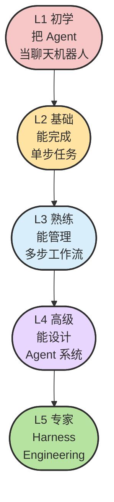
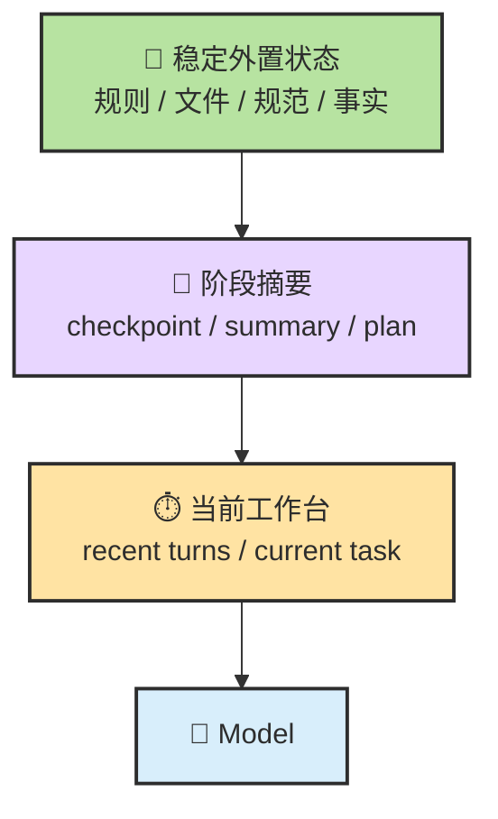
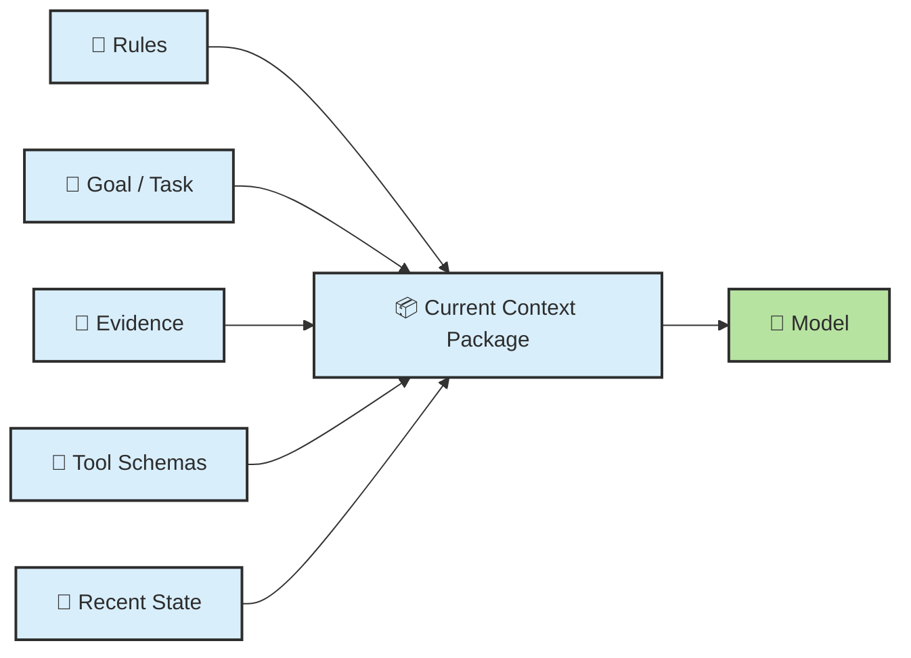
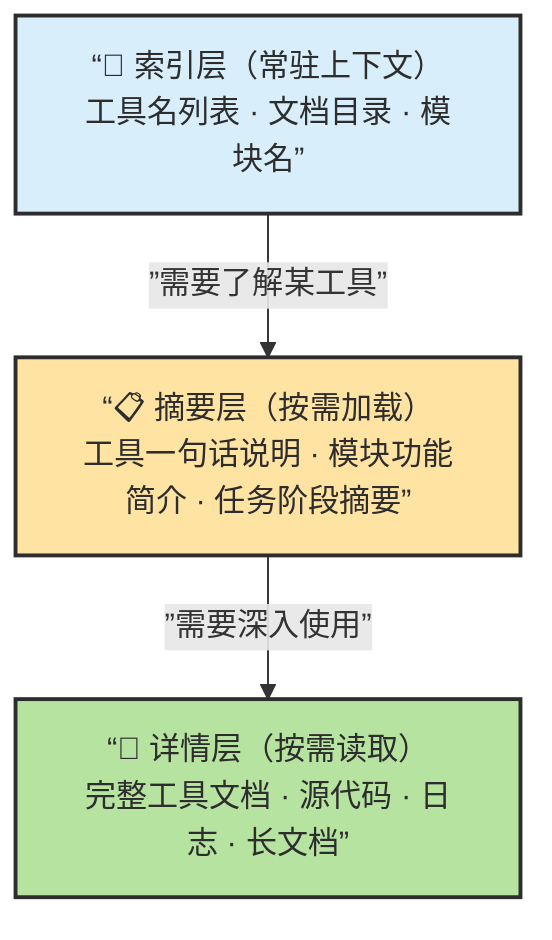
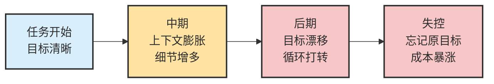

# Chapter 11 · 💾 Memory、Context 与 Harness

> 目标：先把 Memory 放回它最本质的位置。读完这一章，你应该知道 `Session / Context / Memory / KV Cache / Harness` 之间的边界，理解短期记忆、长期记忆、RAG、状态外置和上下文退化之间的关系，以及为什么“记忆”首先是状态管理问题。

## 📑 目录

- [1. Memory 不是记忆力，而是状态管理](#1-memory-不是记忆力而是状态管理)
- [2. Session、Context、Memory、KV Cache 到底是什么关系](#2-sessioncontextmemorykv-cache-到底是什么关系)
- [3. Context 是这一轮模型实际看到的全部](#3-context-是这一轮模型实际看到的全部)
- [4. 为什么长任务会越聊越笨](#4-为什么长任务会越聊越笨)
- [5. 文件比聊天更像稳定记忆](#5-文件比聊天更像稳定记忆)
- [6. Harness：真正的杠杆在模型外侧](#6-harness真正的杠杆在模型外侧)

---

## 1. Memory 不是记忆力，而是状态管理

工程语境下说 Memory，更接近这件事：

> 💾 **哪些状态被保存、怎样回放、什么时候压缩、什么时候外置。**

最实用的三层划分是：

- 当前工作台：这一轮最相关的上下文
- 阶段摘要：前面已经做过什么
- 稳定外置：规则文件、Spec、任务清单、决策记录

---

## 2. Session、Context、Memory、KV Cache 到底是什么关系

很多人把这几个词混成一句“模型记住了”。更准确的拆法是：

| 层 | 它是什么 | 最容易误解成什么 |
|---|---|---|
| 🧠 模型调用层 | 模型处理当前这一轮输入并生成输出 | 模型自己一直带着整段会话活着 |
| 🧵 Session 层 | 应用或 runtime 维护的一段连续任务轨迹，里面可能有历史消息、工具结果、todo、摘要 | 等于每一轮都完整进模型 |
| 📦 Context 层 | 当前这一轮真正送进模型窗口的工作集 | 等于整个 session |
| 💾 Memory 层 | 被外置、可回放、可跨轮次甚至跨会话复用的状态 | 随便聊过就算记忆 |
| ⚡ KV Cache | 推理过程里的加速缓存 | 稳定记忆 |

> 🎯 **一句最重要的话**：`session state` 通常大于 `context`；`context` 只是 runtime 从 session 和外置状态里挑出来的本轮工作集。

这也是为什么“会话连续感”不等于“模型自己一直记得”。更常见的真实情况是：

- runtime 维护更大的 session state
- 每一轮重新组装一份 context
- 超窗或噪音过大时，再做 trimming / summarization / compaction

### 几个最容易问错的问题

**Q：为什么同一个 session 里，它看起来记得我前面说过的话？**  
因为 runtime 会把最近历史、阶段摘要、工具结果和外置状态重新带进这一轮 context，不是模型自己神秘地“永久记住了”。

**Q：`/compact` 之后，之前那些话是不是都没了？**  
逐字历史通常不会完整保留，但后续真正需要的语义状态会被压缩保留。compact 追求的是“保状态”，不是“保全文”。

**Q：为什么新开一个 session 会感觉突然失忆？**  
因为旧 session state 不再自动进入新一轮；只有你重新提供的文件、摘要、规则和长期记忆还能继续发挥作用。

**Q：KV Cache 和 Memory 有什么本质区别？**
KV Cache 是一次推理过程里的性能缓存；Memory 是为了后续轮次还能回放状态而做的工程层设计。前者服务速度，后者服务连续性。

**Q：为什么把重要约束写进文件更稳？**
因为文件属于可重复注入、可跨会话回放的稳定状态；单靠聊天历史，下一轮不一定还会被完整带进来。

> 🎯 **一句压缩版**：Session 像整段项目会议，Context 像这一轮摊在桌上的材料，Memory 像归档到知识库里的记录，KV Cache 则更像会议现场的临时速记缓存。

---

## 3. Context 是这一轮模型实际看到的全部

Context 不只是“用户这句话”，而是当前轮真正送进模型的完整上下文包：

- 系统规则
- 当前目标
- 最近状态
- 相关文件或证据
- 工具描述

所以很多时候，问题不在你一句话没说漂亮，而在于：

- 不该进来的噪音进来了
- 真正关键的约束没进来
- 顺序和优先级出了问题

---

<details>
<summary><span style="color: #e67e22; font-weight: bold;">⚙️ 进阶：长上下文的系统代价与缓存对 Prompt 设计的影响</span></summary>

### 长上下文为什么会从认知问题变成系统问题

一旦你真的做 Agent，长上下文不只会影响回答质量，还会直接影响系统性能。

#### KV Cache 不是"记住了"，而是运行时缓存

KV Cache 更像注意力机制的中间状态缓存，用来避免每生成一个新 token 都把全部前文重新完整计算一遍。

这和人类理解里的"记忆"不是一回事。它只是让当前推理更快的运行态数据。

一个常见误解是："长上下文导致 KV Cache 爆炸，所以成本是非线性的。"

更准确的说法是：

- **KV Cache 大小通常随上下文长度线性增长**
- 但系统总成本和吞吐退化，常常会让人主观上感到像"爆炸"

因为真正恶化的不只是一项指标，还包括：

- prefill 计算变重
- decode 每步要访问更大的缓存
- 并发服务里的显存和带宽压力上升

#### Prefill 和 Decode 是两种完全不同的负载

可以把一次推理拆成两个阶段：

| ⚙️ 阶段 | 🧠 在干什么 | 📉 更像什么瓶颈 |
|------|----------|--------------|
| Prefill | 先把整包输入吃进去，建立初始状态和 KV Cache | 偏算力密集 |
| Decode | 基于已有状态，一个 token 一个 token 往后生成 | 偏内存带宽密集 |

这对 Agent 特别重要，因为 Agent 很容易变成一种"长输入、短输出、多轮循环"的工作负载。

也就是说，很多时候真正拖慢系统的，不是它输出慢，而是它每一轮都在反复处理一大包长输入。

### 为什么缓存机制会反过来影响 Prompt 设计

很多人第一次听到 `Prompt Cache`，会把它理解成一种"省钱小技巧"。这理解太浅了。

更接近现实的说法是：

> 只要你的 Agent 在重复发送同一套长前缀，缓存机制就会反过来决定你该怎么组织上下文。

#### 为什么同样的规则每轮都发，还不一定一样贵

生产环境里的 Agent，往往每一轮都要重复携带这些内容：

- 系统提示
- 工具定义 / schema
- 项目规则文件
- 稳定 few-shot

如果这些前缀几乎不变，很多推理系统就可以复用之前已经算过的部分，也就是常说的：

- Prefix Caching
- Prompt Caching
- Context Caching

它们的共同目标其实只有一个：

> **不要重复计算不该重复计算的前缀。**

这就是为什么同一套长规则，如果结构稳定，后续请求可能明显更便宜、更快；如果你每次都在前缀里插一点动态内容，就可能每轮都像"重新开机"。

#### 缓存命中的关键，不是"内容差不多"，而是"前缀真的稳定"

真正影响命中的，不是你主观上觉得"意思没变"，而是模型侧看到的 token 前缀到底有没有被打断。

一个最常见的误区是：

- 觉得"我只是多插了一句状态说明，应该没关系"
- 觉得"我把工具顺序换了一下，但内容没变"
- 觉得"我加个时间戳、随机 ID、动态环境信息，不影响大局"

从缓存视角看，这些都可能在破坏前缀稳定性。

| 🧱 结构 | 🎯 结果 |
|------|------|
| **稳定前缀在前，变化内容在后** | 更容易命中缓存，也更容易让模型先锁定规则边界 |
| **动态内容插进前缀中间** | 前缀被打断，后面大量 token 可能都要重新计算 |

所以，`Prompt Cache` 最终会倒逼出一个非常实用的上下文设计原则：

> **稳定前缀前置，动态内容后置。**

#### "只追加、不插队"是长任务里的硬原则

当任务进入多轮循环后，一个很值钱的原则是：

> **尽量只在末尾追加新信息，不要频繁改写前面的稳定前缀。**

因为一旦你在前面插队，后面的大段 token 都可能失去复用价值。

这也是为什么很多成熟 Agent 工作流都会强调：

- 固定规则写进文件，而不是每轮临时改写
- 工具列表保持稳定顺序
- 阶段性摘要独立管理，不和系统规则混写
- 本轮状态尽量放在靠后位置

从语义视角看，这是在降低歧义；从系统视角看，这是在保护缓存命中；两者其实是同一件事。

> **上下文工程不只是摆证据给模型看，也是把高频不变的前缀组织成可复用的稳定结构。**

</details>

---

## 4. 为什么长任务会越聊越笨

因为长任务最容易同时发生三件事：

1. 历史不断膨胀
2. 早期错误持续传播
3. 重要约束逐渐被噪音淹没

这时再继续硬聊，往往只会让错误历史本身变成新的污染源。

更稳的做法是：

- 阶段性压缩
- 把稳定信息写回文件
- 需要时开新上下文继续

---

## 5. 文件比聊天更像稳定记忆

下面这些内容，最好不要只留在聊天里：

- 项目规则
- 验收标准
- 任务清单
- 已确认的关键决策
- 阶段结论

它们更适合写进：

- `CLAUDE.md / AGENTS.md`
- `spec.md`
- `plan.md`
- 任务跟踪文件或项目文档

> 📁 **写进文件的才是可回放状态，留在对话里的多数只是临时缓存。**

---

## 6. Harness：真正的杠杆在模型外侧

Harness 可以理解成围绕模型构建的系统层，包括：

- 指令和规则文件
- 上下文装配
- 工具编排
- 验证与恢复
- 权限和升级点

所以很多系统问题真正该改的，不是模型，而是：

- 规则写法
- 上下文装配方式
- 工具链设计
- 验证链和恢复动作

---

## 📌 本章总结

- Memory 的核心是状态管理，不是神秘“长期记忆力”。
- Session 大于 Context，KV Cache 也不等于 Memory。
- Context 是当前轮模型看到的全部，不只是用户输入。
- 长任务会变糊，往往是状态没有外置、上下文没有清理、错误没有及时截断。
- Harness 是模型外侧的控制面，也是很多效果提升最有杠杆的地方。

<details>
<summary><span style="color: #e67e22; font-weight: bold;">🎯 进阶：协作模式与 Agent 成熟度模型</span></summary>

### 协作模式与控制面边界

会不会"用 Agent"，和能不能"驾驭 Agent"，区别不在模型，而在于你有没有明确控制面。控制面本质上回答四个问题：

1. 这次任务让 Agent 做到哪一步？
2. 它能看到哪些上下文？
3. 它能动哪些工具和权限？
4. 它做到什么程度算完成？

#### 三种协作模式

| 模式 | 人负责什么 | Agent 负责什么 | 适用场景 |
|------|-----------|---------------|---------|
| **建议模式** | 定方向、做判断、亲自执行 | 分析、对比方案、写草稿 | 架构设计、技术选型、需求澄清 |
| **工件模式** | 定任务、审 diff、决定是否合并 | 产出补丁、补测试、跑验证 | Bug 修复、小功能、样板代码 |
| **受控自治模式** | 设边界、做审批、验最终结果 | 规划 + 执行多步任务 | 中等规模功能开发、重构、Issue 到 PR |

```mermaid
flowchart TB
    classDef suggest fill:#d8eefb,stroke:#2d2d2d,stroke-width:2px,color:#2d2d2d
    classDef patch fill:#ffe3a3,stroke:#2d2d2d,stroke-width:2px,color:#2d2d2d
    classDef agent fill:#b7e3a1,stroke:#2d2d2d,stroke-width:2px,color:#2d2d2d

    subgraph M1["💡 建议模式"]
        direction LR
        A1["人提需求"] --> A2["Agent 给方案"] --> A3["人决定"] --> A4["人执行"]
    end

    subgraph M2["🔧 工件模式"]
        direction LR
        B1["人定边界"] --> B2["Agent 出 diff"] --> B3["自动验证"] --> B4["人审查合并"]
    end

    subgraph M3["🤖 受控自治模式"]
        direction LR
        C1["人设目标"] --> C2["Agent 规划执行"] --> C3["关键节点审批"] --> C4["交付验收"]
    end

    M1:::suggest
    M2:::patch
    M3:::agent
```



### Agent 使用成熟度模型

你与 Agent 的协作水平处于哪个阶段？以下五级成熟度模型帮你定位当前水平和进阶方向。

#### 五级成熟度



#### 各级详解

| 级别 | 特征 | 你在做什么 | 关键升级技能 |
|:---:|------|-----------|------------|
| **L1** 初学 | 把 Agent 当聊天机器人 | 一问一答，不给上下文，不验证输出 | → 学会给代码上下文和验证命令 |
| **L2** 基础 | 能让 Agent 完成单步任务 | 会给文件引用，会跑测试，但只做简单任务 | → 学会任务拆解和 Plan 模式 |
| **L3** 熟练 | 能管理多步复杂工作流 | 会拆任务、写 CLAUDE.md、分阶段执行、用 SDD | → 学会 Skills、MCP、多 Agent 协作 |
| **L4** 高级 | 能设计高效的 Agent 工作流体系 | 会写 Skill、配 MCP 工具、用多 Agent 并行 | → 系统化设计和优化整个 Harness |
| **L5** 专家 | 进行 Harness Engineering | 系统化地设计上下文策略、工具编排、验证循环和故障恢复 | → 创新性的 Agent 系统设计 |

#### 升级路径建议

**L1 → L2**（1-2 天）：学会在指令中 `@引用` 具体文件；每次修改后让 Agent 跑测试；养成"先分析再执行"的习惯。

**L2 → L3**（1-2 周）：编写项目的 CLAUDE.md；学会 SDD 工作流；掌握 `/compact` 和会话管理；大任务拆成 30 分钟子任务。

**L3 → L4**（1-2 月）：学会编写 Skills；配置和使用 MCP 工具；尝试 Writer + Reviewer 双 Agent 模式；建立团队级的 CLAUDE.md 规范。

**L4 → L5**（持续进阶）：系统化分析 Agent 行为，优化 Harness；设计可复用的 Agent 工作流模板；建立团队的 Agent 最佳实践体系；将 Agent 集成到 CI/CD 流程中。

> 大多数开发者在使用 1-2 周后可以达到 L2-L3。从 L3 到 L4 需要有意识地学习本章和后续章节介绍的高级概念。

</details>

## 📚 继续阅读

- 想看状态进入执行层之后会发生什么：继续看 [Ch12 · Tools](./ch12-tools.md)
- 想看这些问题怎样转成真实工程护栏：继续看 [Ch19 · 工程化工作流](./ch19-engineering-workflow.md)


---

<a id="ch2-sec-6"></a>
## 6. Memory 与 Context Engineering：状态不是靠聊天硬记

### 6.1 Memory 不是“记忆力”，而是“状态管理”

Memory 最容易被神化。很多人会把它想成“Agent 真的记住了一切”。更准确的理解是：

> 💾 **Memory 不是魔法记忆力，而是状态管理。**

它通常至少有三层：

- `工作台`：当前对话、最近观察、当前这一步需要的局部上下文
- `摘要层`：阶段总结、checkpoint、压缩后的已完成状态
- `稳定外置`：规则文件、Spec、清单、事实记录、文档和检索系统

📌 为了尽量不丢旧版知识点，这里把常见 Memory 视角也一并压成一张表：

| 类型 | 更像什么 | 例子 |
| --- | --- | --- |
| `Working` | 当前工作台 | 这轮对话、最新 diff、最近命令输出 |
| `Episodic` | 过去发生过的事 | “上次这个服务是因为端口占用挂的” |
| `Semantic` | 事实和规则 | API 文档、项目规范、团队约定 |
| `Procedural` | 做事方法 | TDD 流程、代码审查清单、调试 SOP |

### 6.2 三层状态：工作台、摘要、稳定外置



这三层各自的作用不同：

| 层 | 它放什么 | 它为什么重要 |
| --- | --- | --- |
| `当前工作台` | 当前步骤、最近观察、局部上下文 | 让模型完成眼前动作 |
| `阶段摘要` | 到目前为止的关键状态压缩 | 防止每轮都从零回忆 |
| `稳定外置状态` | 规则、Spec、清单、文件、事实记录 | 防止重要状态只存在聊天里 |

### 6.3 Context Engineering：当前这一轮到底让模型看到什么

`Context` 不是“当前用户这句话”，而是这一轮真正送进模型的全部信息。



所以上下文工程的核心问题不是“怎样把更多东西塞进去”，而是：

- 哪些信息必须前置
- 哪些信息应该按需加载
- 哪些历史应该压缩成摘要
- 哪些状态应该根本不放聊天，而是外置成文件

### 6.4 Progressive Disclosure：只在需要时加载细节

长文档、大全量代码仓、多工具环境里，一个最关键的原则就是 `Progressive Disclosure`。

别一上来把所有细节全塞给模型，而是按层次加载：



| 层级 | 始终保留在上下文 | 内容示例 |
|------|--------------|---------|
| **索引层** | 是 | 工具名与一句话简介、目录结构、关键模块名 |
| **摘要层** | 按需 | 某工具的输入输出说明、某模块的职责描述 |
| **详情层** | 按需 | 完整 API 文档、源代码、历史日志 |

这也是为什么”把整份长文档一次性塞进去”往往比”先看索引和摘要，再按需深入”更容易出问题。

**为什么这个成本代价很高**：如果你有 30 个工具，每个 JSON schema 描述平均 200 token，光工具定义就占去 6000 token——其中可能 25 个在当前任务里根本用不到。上下文越干净，Agent 越聚焦，选错工具的概率越低。

#### Skill 是 Progressive Disclosure 的物理实现

Skill 体系把这个原则固化成了三层文件结构：

| 层级 | 文件形式 | 内容 | 加载时机 | token 量级 |
|------|---------|------|---------|-----------|
| **元数据层** | YAML 头 | 技能名、描述、触发条件 | 始终加载 | ~100 tokens |
| **指令层** | SKILL.md 主体 | 执行步骤、规则逻辑、输出格式 | 触发时加载 | ~1000 tokens |
| **资源层** | scripts / 参考文件 | 脚本、模板、示例代码 | 引用时加载 | 5000+ tokens |

```
.claude/skills/code-review/
├── skill.yaml       ← 元数据层（始终加载）
├── SKILL.md         ← 指令层（触发时加载）
└── resources/
    ├── checklist.md         ← 资源层（引用时加载）
    └── report-template.md
```

对比传统做法（把所有工具说明、规则、示例一股脑放进系统提示），每次调用都是 40,000+ tokens 全量加载。Skill 三层结构让你只在真正需要时才付出上下文代价。

> ⚠️ 反模式：把项目所有文档、所有工具说明统统放进系统提示——这是把 Agent 的注意力预算当作无限资源在挥霍。

### 6.5 文件比聊天更像稳定记忆

工程任务里，很多关键状态都应该优先外置到文件。

适合外置的内容通常包括：

- 📏 规则与约束
- 📝 Spec 和验收标准
- 📋 计划与阶段状态
- 🧭 决策记录
- ♻️ 可复用的操作清单

像 `CLAUDE.md`、`AGENTS.md`、项目规则文件，本质上就属于“可稳定重读的控制面记忆”。

### 6.6 为什么长任务会越来越糊：KV Cache 不是 Memory，长会话也不天然更好

这里要专门纠偏一次：

- `KV Cache` 更像推理时的运行缓存，不等于长期记忆
- 聊天历史更像临时工作台，不等于稳定状态库
- 很长的会话很可能比一个干净的新上下文更差



当出现这些信号时，通常应该考虑压缩、外置、甚至新开上下文：

- 系统开始反复遗忘已经确认过的边界
- 系统在旧假设上继续堆动作
- 你已经很难说清当前阶段到底完成到哪里
- 同样的错误在多轮里反复出现

### 6.7 压缩与回放：怎样尽量不忘

不是所有压缩都一样安全。

| 压缩方式 | 直白理解 | 风险 |
| --- | --- | --- |
| `可逆压缩` | 用文件路径、链接、引用位置代替大段正文 | 低，完整内容随时能取回 |
| `不可逆摘要` | 用 LLM 生成更短摘要代替原过程 | 高，信息一旦丢失就回不来了 |

工程上一个很实用的原则是：

> ♻️ **能可逆压缩，就先不要不可逆摘要。**

另外，长任务里还有一个非常实用的抗漂移技巧：

- 把当前阶段目标和待办写成简短 `todo`
- 每完成一个子任务，就更新这份清单
- 让下一轮决策总是基于最新清单来推进

---

---

<div align="center">

[📚 返回目录](../../README.md#tutorial-contents) | [⬅️ 上一章：Ch10 Planning](./ch10-planning.md) | [➡️ 下一章：Ch12 Tools](./ch12-tools.md)

</div>

