# Chapter 11 · 💾 Memory、Context 与 Harness

> 目标：先把 Memory 放回它最本质的位置。读完这一章，你应该知道 `Session / Context / Memory / KV Cache / Harness` 之间的边界，理解短期记忆、长期记忆、RAG、状态外置和上下文退化之间的关系，以及为什么“记忆”首先是状态管理问题。

## 📑 目录

- [1. Memory 不是记忆力，而是状态管理](#1-memory-不是记忆力而是状态管理)
- [2. Session、Context、Memory、KV Cache 到底是什么关系](#2-sessioncontextmemorykv-cache-到底是什么关系)
- [3. Context 是这一轮模型实际看到的全部](#3-context-是这一轮模型实际看到的全部)
- [4. 为什么长任务会越聊越笨](#4-为什么长任务会越聊越笨)
- [5. 文件比聊天更像稳定记忆](#5-文件比聊天更像稳定记忆)
- [6. Harness：真正的杠杆在模型外侧](#6-harness真正的杠杆在模型外侧)

---

## 1. Memory 不是记忆力，而是状态管理

工程语境下说 Memory，更接近这件事：

> 💾 **哪些状态被保存、怎样回放、什么时候压缩、什么时候外置。**

最实用的三层划分是：

- 当前工作台：这一轮最相关的上下文
- 阶段摘要：前面已经做过什么
- 稳定外置：规则文件、Spec、任务清单、决策记录

---

## 2. Session、Context、Memory、KV Cache 到底是什么关系

很多人把这几个词混成一句“模型记住了”。更准确的拆法是：

| 层 | 它是什么 | 最容易误解成什么 |
|---|---|---|
| 🧠 模型调用层 | 模型处理当前这一轮输入并生成输出 | 模型自己一直带着整段会话活着 |
| 🧵 Session 层 | 应用或 runtime 维护的一段连续任务轨迹，里面可能有历史消息、工具结果、todo、摘要 | 等于每一轮都完整进模型 |
| 📦 Context 层 | 当前这一轮真正送进模型窗口的工作集 | 等于整个 session |
| 💾 Memory 层 | 被外置、可回放、可跨轮次甚至跨会话复用的状态 | 随便聊过就算记忆 |
| ⚡ KV Cache | 推理过程里的加速缓存 | 稳定记忆 |

> 🎯 **一句最重要的话**：`session state` 通常大于 `context`；`context` 只是 runtime 从 session 和外置状态里挑出来的本轮工作集。

这也是为什么“会话连续感”不等于“模型自己一直记得”。更常见的真实情况是：

- runtime 维护更大的 session state
- 每一轮重新组装一份 context
- 超窗或噪音过大时，再做 trimming / summarization / compaction

### 几个最容易问错的问题

**Q：为什么同一个 session 里，它看起来记得我前面说过的话？**  
因为 runtime 会把最近历史、阶段摘要、工具结果和外置状态重新带进这一轮 context，不是模型自己神秘地“永久记住了”。

**Q：`/compact` 之后，之前那些话是不是都没了？**  
逐字历史通常不会完整保留，但后续真正需要的语义状态会被压缩保留。compact 追求的是“保状态”，不是“保全文”。

**Q：为什么新开一个 session 会感觉突然失忆？**  
因为旧 session state 不再自动进入新一轮；只有你重新提供的文件、摘要、规则和长期记忆还能继续发挥作用。

**Q：KV Cache 和 Memory 有什么本质区别？**  
KV Cache 是一次推理过程里的性能缓存；Memory 是为了后续轮次还能回放状态而做的工程层设计。前者服务速度，后者服务连续性。

---

## 3. Context 是这一轮模型实际看到的全部

Context 不只是“用户这句话”，而是当前轮真正送进模型的完整上下文包：

- 系统规则
- 当前目标
- 最近状态
- 相关文件或证据
- 工具描述

所以很多时候，问题不在你一句话没说漂亮，而在于：

- 不该进来的噪音进来了
- 真正关键的约束没进来
- 顺序和优先级出了问题

---

## 4. 为什么长任务会越聊越笨

因为长任务最容易同时发生三件事：

1. 历史不断膨胀
2. 早期错误持续传播
3. 重要约束逐渐被噪音淹没

这时再继续硬聊，往往只会让错误历史本身变成新的污染源。

更稳的做法是：

- 阶段性压缩
- 把稳定信息写回文件
- 需要时开新上下文继续

---

## 5. 文件比聊天更像稳定记忆

下面这些内容，最好不要只留在聊天里：

- 项目规则
- 验收标准
- 任务清单
- 已确认的关键决策
- 阶段结论

它们更适合写进：

- `CLAUDE.md / AGENTS.md`
- `spec.md`
- `plan.md`
- 任务跟踪文件或项目文档

> 📁 **写进文件的才是可回放状态，留在对话里的多数只是临时缓存。**

---

## 6. Harness：真正的杠杆在模型外侧

Harness 可以理解成围绕模型构建的系统层，包括：

- 指令和规则文件
- 上下文装配
- 工具编排
- 验证与恢复
- 权限和升级点

所以很多系统问题真正该改的，不是模型，而是：

- 规则写法
- 上下文装配方式
- 工具链设计
- 验证链和恢复动作

---

## 📌 本章总结

- Memory 的核心是状态管理，不是神秘“长期记忆力”。
- Session 大于 Context，KV Cache 也不等于 Memory。
- Context 是当前轮模型看到的全部，不只是用户输入。
- 长任务会变糊，往往是状态没有外置、上下文没有清理、错误没有及时截断。
- Harness 是模型外侧的控制面，也是很多效果提升最有杠杆的地方。

## 📚 继续阅读

- 想看状态进入执行层之后会发生什么：继续看 [Ch12 · Tools](./ch12-tools.md)
- 想看这些问题怎样转成真实工程护栏：继续看 [Ch19 · 工程化工作流](./ch19-engineering-workflow.md)

---

<div align="center">

[📚 返回目录](../../README.md#tutorial-contents) | [⬅️ 上一章：Ch10 Planning](./ch10-planning.md) | [➡️ 下一章：Ch12 Tools](./ch12-tools.md)

</div>

---

## 📎 保留原文与延伸材料

> ⚠️ **术语提示**：下面这些 archive 区块保留了旧版本写法，个别地方会把 `CLAUDE.md`、规则文件或摘要策略近似叫成“记忆”。以本章前文定义为准：它们更准确属于**稳定外置状态 / 控制面的一部分**，不等于“模型自己记住了”。

Session / Context / Memory / Harness 相关内容是本轮迁移的重点。下面把旧主章和几篇关键专题都保留下来，后续再按统一术语重新整理。

<details>
<summary>📎 保留原文：原 Chapter 9：驾驭 Agent：控制面与会话管理</summary>

# Chapter 9 · 🎛️ 驾驭 Agent：控制面与会话管理

> 🎯 **目标**：掌握如何真正“驾驭”Agent，而不是只会和它聊天。读完本章，你会知道怎样设计控制面、管理会话生命周期、控制权限边界，并把 Agent 稳定地带进真实项目。

## 📑 目录

- [1. 🔧 Harness 工程：真正的杠杆不在模型](#1--harness-工程真正的杠杆不在模型)
- [2. 🧠 上下文工程：Agent 的命脉](#2--上下文工程agent-的命脉)
- [3. 💬 Prompt 策略：如何给 Agent 下达指令](#3--prompt-策略如何给-agent-下达指令)
- [4. 🚨 七种失败模式与恢复术](#4--七种失败模式与恢复术)
- [5. 💰 Token 经济学：省钱省时的实操技巧](#5--token-经济学省钱省时的实操技巧)
- [6. ⚡ 协作模式与控制面边界](#6--协作模式与控制面边界)
- [7. 🧭 会话生命周期与旧仓库接管](#7--会话生命周期与旧仓库接管)
- [8. 📈 Agent 使用成熟度模型](#8--agent-使用成熟度模型)

---

> 📌 **章节职责**：Ch07 讲“具体该按哪些命令操作”；本章讲“为什么这些动作构成控制面，以及你该如何设计长期协作策略”。
>
> 📖 **阅读顺序**：如果你还不熟 `/clear`、`/compact`、`--resume` 这些具体操作，先回 Ch07；本章默认你已经会用，再继续讨论什么时候该用、为什么这样用。

## 1. 🔧 Harness 工程：真正的杠杆不在模型

### Agent = Model + Harness

Ch02 讲过 Agent 的本质是 `LLM + Memory + Tools + Planning`。现在我们换一个更实战的视角来看：

> **Agent 效果 = 模型能力 × Harness 质量**

**Harness（马具）** 是围绕模型构建的系统层——包括你的提示设计、上下文管理、工具编排、验证循环、状态追踪和故障恢复。模型是马，Harness 是马具，你是骑手。

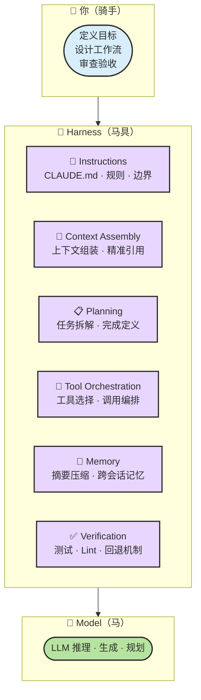

### 为什么 Harness 比换模型更有效？

LangChain 团队的编码 Agent 优化实验给出了最有力的证据：

| 变量 | 改动 | 效果 |
|------|------|------|
| 换更强模型 | Sonnet → Opus | 排名提升约 5 位 |
| **改 Harness** | 加自验证 + 上下文注入 + 故障检测 | **排名从 Top 30 → Top 5** |

另一个数据点更直接：同一个 Claude Opus 4.5 模型，在原始环境中 CORE-Bench 得分 42%，换一套编排框架（Harness）后飙升到 78%。

> **🔑 核心结论**：2026 年的旗舰模型都够强（Opus 4.6、GPT-5.4、Gemini 3.1），选对模型只是及格线，**Harness 的质量决定了 Agent 效果的上限**。

### 从 Prompt Engineering 到 Harness Engineering

| 维度 | Prompt Engineering | Harness Engineering |
|------|-------------------|---------------------|
| 关注点 | 单个提示词怎么写 | 整个系统如何设计 |
| 范围 | 一次对话 | 跨会话的完整工作流 |
| 核心技能 | 写出好 Prompt | 设计上下文策略、工具编排、验证循环 |
| 可复用性 | 低（每次手动调整） | 高（沉淀为 CLAUDE.md、Skills） |

**本章后续的所有内容，本质上都是在教你做 Harness Engineering。**

---

## 2. 🧠 上下文工程：Agent 的命脉

Ch02 讲过"上下文 ≠ 越多越好"。本节进入实操层面：**如何精确控制 Agent 看到什么、记住什么、忘掉什么。**

> 📖 **延伸阅读**：想把“上下文到底是什么、为什么顺序和前缀稳定性会改变效果上限”继续讲透，去看 [上下文工程](./ch11-memory-context-harness.md)；想把记忆分层、Tool Use 和 Harness 的关系补齐，再看 [Agent 记忆系统](./ch11-memory-context-harness.md)。

### 上下文是 Agent 的第一资源

Claude Code 的几乎所有最佳实践都源于一个根本约束——**上下文窗口会快速填满，而性能会随之下降**。一次调试会话或代码库探索可能消耗数万个 Token。当上下文窗口接近上限时，模型开始"遗忘"早期指令，产生更多错误。

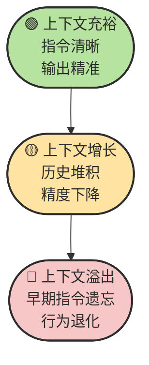

### CLAUDE.md / AGENTS.md 的控制面职责

CLAUDE.md（或 AGENTS.md / .cursorrules）更准确地说，是 Agent 的"稳定外置状态入口"——每次对话开始时自动加载。写好这个文件，等于一次投入、长期生效。

这里关注的不是“模板长什么样”，而是**哪些内容应该被提升到控制面**。如果你需要一份从零可抄的项目级样例，回看 Ch05 会更顺手。

**适合写入的内容**：

```markdown
# 项目简介
一句话说明这是什么项目

# 技术栈
- Framework: Next.js 14 (App Router)
- Language: TypeScript (strict mode)
- Database: PostgreSQL + Prisma ORM
- Testing: Vitest + Playwright

# 项目结构
src/
  app/        # Next.js 路由和页面
  lib/        # 业务逻辑和工具函数
  components/ # UI 组件
  db/         # 数据库模型和迁移

# 常用命令
- 启动：`npm run dev`
- 测试：`npm test`
- Lint：`npm run lint`
- 构建：`npm run build`

# 编码规范
- 函数优先于类，除非需要复杂状态管理
- 所有 API 路由必须包含错误处理
- 使用 zod 进行输入验证

# Agent 容易踩的坑
- 不要修改 prisma/schema.prisma 后忘记运行 `npx prisma generate`
- 环境变量在 .env.local 中，不要使用硬编码值
```

**不适合写入的内容**：

| ❌ 不要写 | 为什么 |
|-----------|--------|
| 具体任务需求细节 | 这是会话级信息，不是永久规则 |
| 临时调试信息 | 过期后变成噪音 |
| Agent 已经正确执行的规则 | 冗余规则浪费上下文 |
| 超过 5000 tokens 的规则 | 太长会淹没关键指令 |

> 💡 **把 CLAUDE.md 当代码对待**：定期审查、精简冗余、通过观察 Agent 行为测试修改效果。

### @引用 与文件引用策略

**精准引用 > 全量加载**。不要让 Agent 自己去搜索整个项目，直接告诉它看哪里：

```text
✅ 好的引用方式：
请查看 @src/lib/auth.ts 中的 validateToken 函数，修复 token 过期判断的 bug。

❌ 差的引用方式：
项目里有个 token 过期的 bug，帮我修一下。
```

### 会话压缩策略（命令细节见 Ch07）

Ch07 已经讲过具体命令和使用时机，这里只从控制面角度回答一个问题：**什么时候应该保留上下文，什么时候应该主动丢弃上下文。**

| 场景 | 操作 | 原因 |
|------|------|------|
| 完成一个子任务 | `/compact "保留要点：已完成 X，下一步做 Y"` | 压缩历史，保留关键信息 |
| 切换到不相关任务 | `/clear` | 彻底清空，避免上下文污染 |
| 长对话超过 15 分钟 | 考虑新开会话 | 老会话的历史越来越多，精度下降 |
| 调试陷入死循环 | `/clear` + 重新开始 | 失败尝试的历史在污染 Agent 的判断 |

### 三层记忆策略

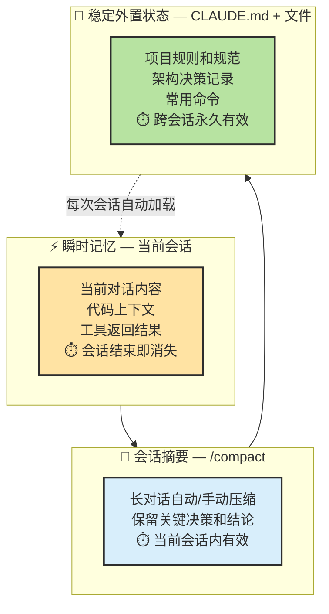

> 🔑 **核心原则：写进文件的才是稳定外置状态，留在会话里的只是临时笔记。** 重要的决策、规范、上下文，必须沉淀到 CLAUDE.md 或项目文件中。

---

## 3. 💬 Prompt 策略：如何给 Agent 下达指令

### 开局约束：默认沿用 Ch01 / Ch04 的三句话

这里不再把这三句话当入门技巧重讲，而把它们看成最小控制面合同：

> 1. 🔍 **先分析再执行** — 给出计划，等我确认后再动手
> 2. ✅ **修改后必须验证** — 跑测试、跑 Lint、确认编译通过
> 3. ✋ **如果不确定，就停下来说明** — 不要猜测，不要编造

### 结构化指令模板

不同类型的任务，用不同的模板：

**探索性任务**（不修改代码）：

```text
先阅读这个仓库的 README 和目录结构。
然后告诉我：
1. 项目的技术栈是什么
2. 核心模块有哪些
3. 要实现 [我的需求]，你建议从哪里入手
不要修改任何代码，先给出你的分析。
```

**实现性任务**（写代码）：

```text
## 目标
[清晰的一句话目标]

## 约束
- 只修改 src/auth/ 目录下的文件
- 使用项目已有的 bcrypt 库
- 遵循项目现有的代码风格

## 步骤
1. 先给出实现方案，等我确认
2. 实现后运行 `npm test`
3. 如果测试失败，修复后再次运行
4. 全部通过后输出变更摘要
```

**调试性任务**（修 Bug）：

```text
这个测试 `auth.test.ts > should reject expired tokens` 失败了，
错误信息如下：
[粘贴关键错误信息，不要全部日志]

请先分析可能的原因（列出 2-3 个），
然后从最可能的原因开始排查。
每次修改后运行测试验证。
```

### 渐进式任务构建

复杂任务不要一口气说完，用"渐进式"方式逐步推进：

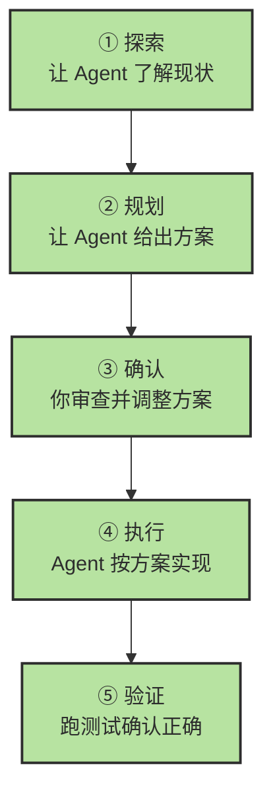

### 何时给自由度、何时给约束

| 场景 | 策略 | 原因 |
|------|------|------|
| 探索性研究 | 高自由度 | 让 Agent 发挥搜索和分析能力 |
| 架构设计讨论 | 中自由度 + 多方案对比 | 需要 Agent 给多个选项供你选择 |
| 功能实现 | 低自由度 + 明确约束 | Spec 越清晰，输出质量越高 |
| Bug 修复 | 低自由度 + 验证命令 | 每步修改都要可验证 |
| 代码风格调整 | 极低自由度 | 给明确的规则，Agent 机械执行即可 |

> 🔑 **原则：任务越确定性，约束越严格；任务越创造性，自由度越高。**

---

## 4. 🚨 七种失败模式与恢复术

Agent 不是万能的。了解它会怎么"犯蠢"，比了解它有多"聪明"更重要。以下是实战中最常见的七种失败模式：

### 总览

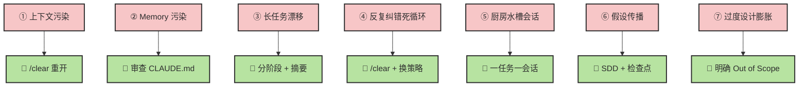

### 详细解析

| # | 失败模式 | 症状 | 成因 | 恢复术 |
|---|---------|------|------|--------|
| ① | **上下文污染** | Agent 抓着旧结论不放，或被无关日志带偏 | 对话中积累了大量已过时或无关的信息 | `/clear` 重开会话，只带当前任务必要背景 |
| ② | **Memory 污染** | Agent 学到了错误偏好并不断重复 | CLAUDE.md 中的规则自相矛盾或已过时 | 定期审查和精简 CLAUDE.md，删除冗余规则 |
| ③ | **长任务漂移** | Agent 忘记原目标，纠结细枝末节 | 单会话持续太久，上下文窗口塞满 | 分阶段执行：每阶段 `/compact` + 摘要 |
| ④ | **反复纠错死循环** | 同一个 Bug 修了 3 次还没修好，越改越乱 | 失败尝试的上下文污染了 Agent 判断 | `/clear`，用完全不同的策略重新开始 |
| ⑤ | **厨房水槽会话** | 一个任务没完就跳到另一个，什么都半成品 | 在同一会话中混了多个不相关任务 | 一个任务一个会话，`/clear` 隔离 |
| ⑥ | **假设传播** | 早期错误假设被放大到整个功能 | Agent 没有验证就基于猜测继续推进 | 用 SDD（Spec 驱动），每步对照 Spec 验证 |
| ⑦ | **过度设计膨胀** | 用 1000 行实现 100 行能搞定的功能 | Agent 有充分自由度时倾向过度复杂化 | 在 Spec 中明确 Out of Scope + 简洁约束 |

### 如何判断 Agent 正在失控？

三个预警信号：

1. **🔄 循环打转**：Agent 在同一段代码上反复修改超过 3 次 → 立刻 `/clear` 换策略
2. **📈 Token 飙升**：单次任务 Token 消耗超过预期 2 倍以上 → 检查是否在做无效探索
3. **🎯 偏离目标**：Agent 开始修改你没提到的文件 → 暂停，重新给出聚焦的约束

---

## 5. 💰 Token 经济学：省钱省时的实操技巧

### Token 消耗的构成

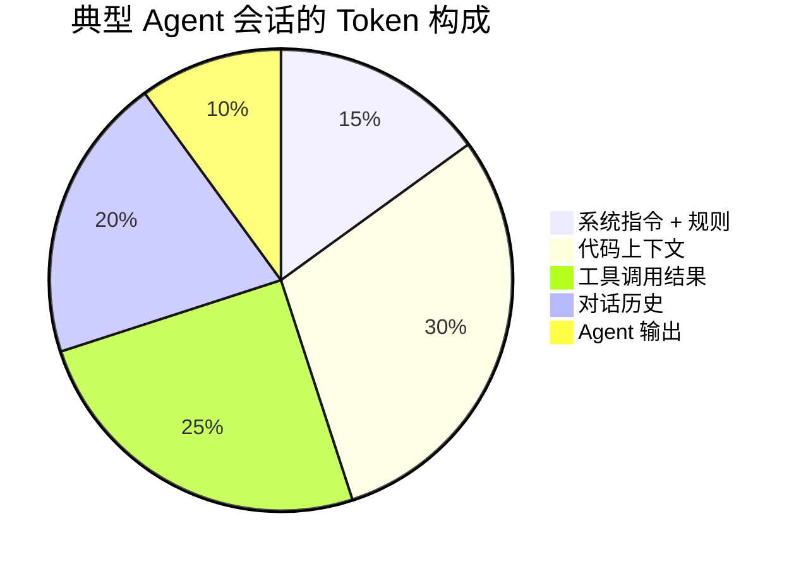

### 省 Token 的四大策略

#### 策略一：精准引用，不让 Agent 盲搜

```text
❌ 高消耗："项目里有个 token 相关的 bug，帮我找找"
   → Agent 会读取 20+ 文件，消耗大量 Token

✅ 低消耗："@src/lib/auth.ts 中第 42 行的 validateToken 函数..."
   → Agent 直接定位，精准高效
```

**节省效果**：30-50%

#### 策略二：定期 `/compact`，压缩历史

完成一个子任务后，用自定义摘要压缩上下文：

```text
/compact "保留要点：1) 已完成用户注册 API，2) 测试全通过，3) 下一步实现登录"
```

**节省效果**：40-60%

#### 策略三：控制命令输出

测试和构建的输出是 Token 黑洞。在指令中约束 Agent 的行为：

```text
运行测试后，只看失败用例的错误信息，不要输出全部日志。
如果全部通过，只说"全部通过"即可。
```

**节省效果**：20-40%

#### 策略四：模型分级使用

不是所有任务都需要最强模型。按任务复杂度选择模型：

| 任务类型 | 推荐模型 | 成本等级 |
|----------|---------|:---:|
| 简单查询、Lint 修复、文件重命名 | Haiku / 轻量模型 | $ |
| 日常开发、Bug 修复、测试补齐 | Sonnet | $$ |
| 大型重构、复杂功能、架构级任务 | Opus | $$$ |

### 成本估算参考

| 使用模式 | Token 消耗 | Opus 4.6 成本 | Sonnet 4.6 成本 |
|---------|-----------|:---:|:---:|
| 简单问答 | ~5K | ~$0.05 | ~$0.02 |
| 中等功能修改 | ~30K | ~$0.50 | ~$0.20 |
| 复杂功能开发 | ~100K | ~$2.00 | ~$0.80 |
| 大型重构 | ~500K | ~$10.00 | ~$4.00 |

> 💡 **Prompt Cache 自动生效**：Claude Code 会自动缓存系统指令和 CLAUDE.md 的内容，重复加载不会重复计费。这是另一个 CLAUDE.md 比会话内重复说明更高效的原因。

---

## 6. ⚡ 协作模式与控制面边界

会不会“用 Agent”，和能不能“驾驭 Agent”，区别不在模型，而在于你有没有明确控制面。控制面本质上回答四个问题：

1. 这次任务让 Agent 做到哪一步？
2. 它能看到哪些上下文？
3. 它能动哪些工具和权限？
4. 它做到什么程度算完成？

### 三种协作模式

| 模式 | 人负责什么 | Agent 负责什么 | 适用场景 |
|------|-----------|---------------|---------|
| **建议模式** | 定方向、做判断、亲自执行 | 分析、对比方案、写草稿 | 架构设计、技术选型、需求澄清 |
| **工件模式** | 定任务、审 diff、决定是否合并 | 产出补丁、补测试、跑验证 | Bug 修复、小功能、样板代码 |
| **受控自治模式** | 设边界、做审批、验最终结果 | 规划 + 执行多步任务 | 中等规模功能开发、重构、Issue 到 PR |

```mermaid
flowchart TB
    classDef suggest fill:#d8eefb,stroke:#2d2d2d,stroke-width:2px,color:#2d2d2d
    classDef patch fill:#ffe3a3,stroke:#2d2d2d,stroke-width:2px,color:#2d2d2d
    classDef agent fill:#b7e3a1,stroke:#2d2d2d,stroke-width:2px,color:#2d2d2d

    subgraph M1["💡 建议模式"]
        direction LR
        A1["人提需求"] --> A2["Agent 给方案"] --> A3["人决定"] --> A4["人执行"]
    end

    subgraph M2["🔧 工件模式"]
        direction LR
        B1["人定边界"] --> B2["Agent 出 diff"] --> B3["自动验证"] --> B4["人审查合并"]
    end

    subgraph M3["🤖 受控自治模式"]
        direction LR
        C1["人设目标"] --> C2["Agent 规划执行"] --> C3["关键节点审批"] --> C4["交付验收"]
    end

    M1:::suggest
    M2:::patch
    M3:::agent
```

### Vibe Coding vs Agentic Coding

这三种模式里，最容易失控的是把“探索性 Vibe”误当成“生产式 Agentic”。

| 维度 | 🎵 Vibe Coding | ⚙️ Agentic Coding |
|------|---------------|-------------------|
| **任务输入** | 模糊描述、“差不多就行” | 明确 Spec、范围、验收标准 |
| **验证方式** | 肉眼看着像对 | 测试、Lint、Build、Review |
| **适合场景** | Demo、一次性脚本、学习探索 | 生产代码、团队项目、长期维护模块 |
| **主要风险** | 理解债务、抽象膨胀 | 速度慢一点，但可控 |

> 🔑 **实用判断**：只要这段代码会进入主干、会被别人维护、会影响用户，就不要用纯 Vibe 模式。

### 控制面最少要写清的四件事

```text
目标：修复登录 token 过期判断错误
范围：仅允许修改 src/auth/ 和相关测试
权限：允许读文件、改文件、跑测试；不允许联网和部署
完成定义：新增回归测试，`npm test` 与 `npm run lint` 全通过
```

### 权限、沙箱、可回滚性

| 权限级别 | 适合任务 | 默认策略 |
|---------|---------|---------|
| **只读** | 探索代码库、做方案分析、定位问题 | 默认首选 |
| **可改文件** | 小范围修复、补文档、补测试 | 需要限定目录和文件范围 |
| **可跑测试** | 修复 Bug、实现功能、做回归验证 | 推荐和“可改文件”一起开放 |
| **可联网** | 查官方文档、拉依赖、调用外部 API | 仅在确有必要时开放 |
| **可部署 / 可操作生产** | 发布、回滚、数据变更 | 默认禁止，必须人工审批 |

> ⚠️ **底线**：权限是“按任务临时开放”，不是“一次开放永久信任”。

---

## 7. 🧭 会话生命周期与旧仓库接管

同一个 Agent，在“该继续当前会话”还是“该开新会话”上做错决策，效果会差很多。会话管理不是附加技巧，它本身就是 Harness 的一部分。

### 何时继续当前 session，何时开新 session

| 场景 | 建议动作 | 原因 |
|------|---------|------|
| **同一子任务还在推进** | 继续当前 session | 历史上下文仍有价值 |
| **已经切到新问题域** | 新开 session | 避免旧结论污染新任务 |
| **对话很长、反复试错** | `/compact` 后再判断是否续聊 | 先保留结论，再丢掉噪音 |
| **Agent 开始答非所问** | `/clear` 或直接新开 session | 说明上下文已退化 |

### 何时新建分支，何时回滚

| 动作 | 触发条件 |
|------|---------|
| **继续当前分支** | 仍是同一需求的连续改动 |
| **新建分支** | 进入独立功能、独立 Bug、独立实验 |
| **回滚到上一步** | 最近一次改动破坏了测试且方向明显错误 |
| **彻底重开** | 假设已经错了两三轮，继续修只会叠更多噪音 |

### 接手陌生代码库的 SOP

这套流程对初学者尤其重要，因为它把“上下文工程”变成了可执行动作。

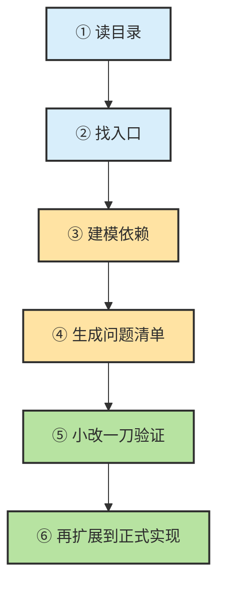

固定动作如下：

1. **先读目录**：判断项目是单体、monorepo 还是多服务。
2. **再找入口**：定位启动文件、路由入口、核心模块。
3. **建模依赖**：弄清“谁调用谁”“数据从哪来往哪去”。
4. **生成问题清单**：哪些概念不懂，哪些文件还没看。
5. **小改一刀验证**：先做一个很小、可回滚的修改确认理解没错。
6. **再扩展**：确认理解正确后再让 Agent 进入正式实现。

### 大任务的阶段化推进

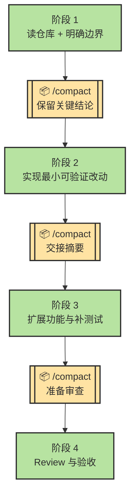

### 跨会话交接模板

```text
请生成任务交接摘要：
1. 当前目标是什么
2. 已完成哪些改动
3. 哪些测试通过 / 失败
4. 下一步最小动作是什么
5. 还存在哪些风险或未确认点
```

> 📖 多 Agent 组合和大型代码库中的模式编排，放到下一章的设计模式与代码库策略里展开。

---

## 8. 📈 Agent 使用成熟度模型

你与 Agent 的协作水平处于哪个阶段？以下五级成熟度模型帮你定位当前水平和进阶方向。

### 五级成熟度


### 各级详解

| 级别 | 特征 | 你在做什么 | 关键升级技能 |
|:---:|------|-----------|------------|
| **L1** 初学 | 把 Agent 当聊天机器人 | 一问一答，不给上下文，不验证输出 | → 学会给代码上下文和验证命令 |
| **L2** 基础 | 能让 Agent 完成单步任务 | 会给文件引用，会跑测试，但只做简单任务 | → 学会任务拆解和 Plan 模式 |
| **L3** 熟练 | 能管理多步复杂工作流 | 会拆任务、写 CLAUDE.md、分阶段执行、用 SDD | → 学会 Skills、MCP、多 Agent 协作 |
| **L4** 高级 | 能设计高效的 Agent 工作流体系 | 会写 Skill、配 MCP 工具、用多 Agent 并行 | → 系统化设计和优化整个 Harness |
| **L5** 专家 | 进行 Harness Engineering | 系统化地设计上下文策略、工具编排、验证循环和故障恢复 | → 创新性的 Agent 系统设计 |

### 升级路径建议

**L1 → L2**（1-2 天）：
- 学会在指令中 `@引用` 具体文件
- 每次修改后让 Agent 跑测试
- 养成"先分析再执行"的习惯

**L2 → L3**（1-2 周）：
- 编写项目的 CLAUDE.md
- 学会 SDD 工作流（Ch04）
- 掌握 `/compact` 和会话管理
- 大任务拆成 30 分钟子任务

**L3 → L4**（1-2 月）：
- 学会编写 Skills（→ Ch07）
- 配置和使用 MCP 工具（→ Ch07）
- 尝试 Writer + Reviewer 双 Agent 模式
- 建立团队级的 CLAUDE.md 规范

**L4 → L5**（持续进阶）：
- 系统化分析 Agent 行为，优化 Harness
- 设计可复用的 Agent 工作流模板
- 建立团队的 Agent 最佳实践体系
- 将 Agent 集成到 CI/CD 流程中

> 💡 大多数开发者在使用 1-2 周后可以达到 L2-L3。从 L3 到 L4 需要有意识地学习本章和后续章节介绍的高级概念。

---

## 📌 本章总结

| 核心概念 | 一句话总结 |
|----------|-----------|
| **Harness 工程** | 模型是马，Harness 是马具——Agent 效果的上限由 Harness 决定，而非模型 |
| **上下文工程** | 精准 > 全面；写进文件的才是稳定外置状态；定期压缩和清理 |
| **Prompt 策略** | 结构化指令 + 三句话法则 + 按任务类型选模板 |
| **失败模式** | 识别 7 种常见失败模式，大多数只需 `/clear` + 换策略即可恢复 |
| **Token 经济学** | 精准引用省 30-50%，定期 compact 省 40-60%，模型分级使用 |
| **控制面边界** | 每次任务都要写清目标、范围、权限、完成定义，别让 Agent 在模糊边界里自由发挥 |
| **会话生命周期** | 继续 / 新开 / compact / 回滚，本质上都是在管理上下文质量 |
| **成熟度模型** | 从 L1（聊天机器人）到 L5（Harness Engineer）的五级进阶 |

### 新人读完立刻去做

1. 给当前项目补一份 `CLAUDE.md` 或 `AGENTS.md`，至少写技术栈、目录、命令、禁区。
2. 以后每次发任务都补四行控制面：目标、范围、权限、完成定义。
3. 接手旧仓库时，强制走一遍“读目录 → 找入口 → 小改验证”的 SOP。

### 三条核心原则

> 🔑 **Harness 比模型更重要** — 选对模型是及格线，设计好 Harness 是优秀线。把精力花在上下文管理、验证循环和工作流设计上，而不是追逐最新模型。
>
> 🔑 **Less is More** — 精简的上下文、聚焦的任务、适量的工具，比堆砌一切更有效。工具不是越多越好，CLAUDE.md 不是越长越好，会话不是越长越好。
>
> 🔑 **理解你的代码** — Agent 是执行者，你是负责人。无论 Agent 生成多快多好，你必须理解核心逻辑，否则"理解债务"会在某天把你淹没。

> 📖 深度参考：
> - [附录：人机协同与 Agent 优化指南](./ch11-memory-context-harness.md)（Harness 六层架构、Token 节约详解、大型项目策略、Agent Team 互审）

---

<div align="center">

[📚 返回目录](../../README.md#tutorial-contents) | [⬅️ 上一章：Ch08 工程化工作流](./ch19-engineering-workflow.md) | [➡️ 下一章：Ch10 Agent 设计模式](./ch18-agent-patterns.md)

</div>

</details>

<details>
<summary>📎 保留原文：原专题：上下文工程</summary>

---
> 📚 **Part IV · 进阶专题** | [← 返回专题目录](../../README.md#tutorial-contents)
---

# 🧩 为什么一句话意思差不多，Prompt 和 Context 一变，效果上限就变了？

> 🧭 很多人第一次认真做 Agent，都会有一种挫败感：
>
> - 📌 明明任务没变
> - 🗣️ 明明意思差不多
> - 🧱 只是换了个写法、换了个顺序、换了点上下文材料
>
> 🤯 结果模型表现就像换了一个人。
>
> 🔍 这不是玄学。更接近现实的解释是：
>
> 🎯 **Prompt 在塑造分布，Context 在组织证据。**

## 目录

- [🧩 1. Prompt 不是“把话说漂亮”，而是在改输入接口](#1-prompt-不是把话说漂亮而是在改输入接口)
- [🧱 2. 为什么顺序、格式、重复都会影响效果](#2-为什么顺序格式重复都会影响效果)
- [📦 3. Context 不是“用户这句话”，而是模型此刻看到的全部 token](#3-context-不是用户这句话而是模型此刻看到的全部-token)
- [📏 4. 为什么上下文越长，不一定越好](#4-为什么上下文越长不一定越好)
- [⚙️ 5. 长上下文为什么会从认知问题变成系统问题](#5-长上下文为什么会从认知问题变成系统问题)
- [💾 6. 为什么缓存机制会反过来影响 Prompt 设计](#6-为什么缓存机制会反过来影响-prompt-设计)
- [🛠️ 7. 一个更稳的 Context 组装方式](#7-一个更稳的-context-组装方式)
- [📝 极简记忆版](#极简记忆版)

---

## 1. Prompt 不是“把话说漂亮”，而是在改输入接口

很多人把 Prompt Engineering 理解成“会不会说话”。

这是最常见、也最容易把人带偏的误解之一。

更准确的理解是：

> 🎯 **Prompt 是你给概率模型设计的运行时输入接口。**

一个好的 Prompt，通常不是文笔更华丽，而是把这些东西说清楚了：

- 🎯 你现在到底要它做什么
- 🧰 它可以使用哪些输入和哪些工具
- 🧱 输出必须长什么样
- ✅ 什么算完成
- 🚦 什么情况下应该停止、重试或报告不确定

所以 Prompt 真正的价值，在于缩小歧义空间、压缩错误自由度，而不是“把语气写得更像人类沟通”。

---

## 2. 为什么顺序、格式、重复都会影响效果

模型处理的是**有顺序的 token 序列**，不是一个无结构的语义包。

于是这些变化都会带来真实差异：

- 把规则放在最前面，还是埋在中间
- 先给例子，再给任务；还是先给任务，再给例子
- 用列表把约束拆开，还是混在一大段散文里
- 关键信息是否被分隔符包起来

这些差异的本质，不只是阅读体验变化，而是：

> 👀 **模型内部的注意力可达性和竞争关系变了。**

也就是说，某条规则是不是更容易被“看到”，某个格式要求是不是更容易在生成时被优先遵守，都取决于它如何出现在序列里。

有些研究甚至发现，在某些非 reasoning 场景里，简单地重复 prompt 都可能带来增益。正确理解这个现象的方式，不是把“重复”当成新咒语，而是意识到：

> 🧱 **输入结构本身，就是模型计算的一部分。**

所以，稳定的 Prompt 往往更像接口设计，而不是文案比赛。

---

## 3. Context 不是“用户这句话”，而是模型此刻看到的全部 token

做 Agent 时，真正进入模型上下文窗口的，通常远不止你眼前这一句用户输入。

更完整的 Context 往往长这样：

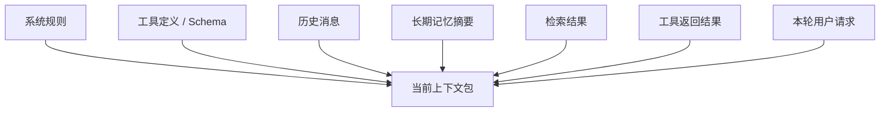

所以，很多人以为自己在调 Prompt，实际问题却出在 Context：

- 规则互相打架
- 旧计划没有清掉
- 无关检索片段塞太多
- 工具输出冗长且低信号
- 过期假设还挂在上下文里

这时模型面对的不是“更多帮助”，而是“更多互相竞争的 token”。

Context Engineering 的本质，不是往窗口里塞更多内容，而是：

> 🎯 **为当前这一次决策，摆出最值得模型看到的证据集。**

---

## 4. 为什么上下文越长，不一定越好

长上下文只代表容量更大，不代表利用效率也同步提升。

一个很实用的直觉是：上下文窗口不是一块平整的无限白板，而更像一张会发生注意力竞争的工作台。

当你不断往里面加材料时，会同时发生三件事：

- 🌫️ 关键信息更容易被噪声淹没
- ⚔️ 过期信息会和当前任务争夺注意力
- 🧩 中间位置的内容更容易被利用不足

这也是为什么长任务里经常出现一种错觉：

> “我明明把信息都给它了，为什么它还是没用上？”

很多时候不是因为模型“没看见”，而是因为它在太多 token 之间分不清什么该优先使用。

所以，好的 Context Engineering 从来不是最大化 token 用量，而是最大化**有效信息密度**。

---

## 5. 长上下文为什么会从认知问题变成系统问题

一旦你真的做 Agent，长上下文不只会影响回答质量，还会直接影响系统性能。

### 5.1 KV Cache 不是“记住了”，而是运行时缓存

KV Cache 更像注意力机制的中间状态缓存，用来避免每生成一个新 token 都把全部前文重新完整计算一遍。

这和人类理解里的“记忆”不是一回事。它只是让当前推理更快的运行态数据。

一个常见误解是：“长上下文导致 KV Cache 爆炸，所以成本是非线性的。”

更准确的说法是：

- **KV Cache 大小通常随上下文长度线性增长**
- 但系统总成本和吞吐退化，常常会让人主观上感到像“爆炸”

因为真正恶化的不只是一项指标，还包括：

- prefill 计算变重
- decode 每步要访问更大的缓存
- 并发服务里的显存和带宽压力上升

### 5.2 Prefill 和 Decode 是两种完全不同的负载

可以把一次推理拆成两个阶段：

| ⚙️ 阶段 | 🧠 在干什么 | 📉 更像什么瓶颈 |
|------|----------|--------------|
| Prefill | 先把整包输入吃进去，建立初始状态和 KV Cache | 偏算力密集 |
| Decode | 基于已有状态，一个 token 一个 token 往后生成 | 偏内存带宽密集 |

这对 Agent 特别重要，因为 Agent 很容易变成一种“长输入、短输出、多轮循环”的工作负载。

也就是说，很多时候真正拖慢系统的，不是它输出慢，而是它每一轮都在反复处理一大包长输入。

---

## 6. 为什么缓存机制会反过来影响 Prompt 设计

很多人第一次听到 `Prompt Cache`，会把它理解成一种“省钱小技巧”。这理解太浅了。

更接近现实的说法是：

> 💾 **只要你的 Agent 在重复发送同一套长前缀，缓存机制就会反过来决定你该怎么组织上下文。**

### 6.1 为什么同样的规则每轮都发，还不一定一样贵

生产环境里的 Agent，往往每一轮都要重复携带这些内容：

- 🧾 系统提示
- 🧰 工具定义 / schema
- 📚 项目规则文件
- 🧷 稳定 few-shot

如果这些前缀几乎不变，很多推理系统就可以复用之前已经算过的部分，也就是常说的：

- Prefix Caching
- Prompt Caching
- Context Caching

它们的共同目标其实只有一个：

> ♻️ **不要重复计算不该重复计算的前缀。**

这就是为什么同一套长规则，如果结构稳定，后续请求可能明显更便宜、更快；如果你每次都在前缀里插一点动态内容，就可能每轮都像“重新开机”。

### 6.2 缓存命中的关键，不是“内容差不多”，而是“前缀真的稳定”

真正影响命中的，不是你主观上觉得“意思没变”，而是模型侧看到的 token 前缀到底有没有被打断。

一个最常见的误区是：

- 觉得“我只是多插了一句状态说明，应该没关系”
- 觉得“我把工具顺序换了一下，但内容没变”
- 觉得“我加个时间戳、随机 ID、动态环境信息，不影响大局”

从缓存视角看，这些都可能在破坏前缀稳定性。

可以把它想成下面这两种结构：

| 🧱 结构 | 🎯 结果 |
|------|------|
| **稳定前缀在前，变化内容在后** | 更容易命中缓存，也更容易让模型先锁定规则边界 |
| **动态内容插进前缀中间** | 前缀被打断，后面大量 token 可能都要重新计算 |

所以，`Prompt Cache` 最终会倒逼出一个非常实用的上下文设计原则：

> 📌 **稳定前缀前置，动态内容后置。**

### 6.3 一个更稳的缓存友好型上下文结构

如果你想把这个原则直接落地，一个够用的顺序通常是：

1. 系统规则
2. 工具定义
3. 固定 few-shot
4. 项目长期约定 / `CLAUDE.md`
5. 当前任务描述
6. 本轮新增证据
7. 最新工具结果

前四层偏稳定，后面三层偏动态。

这带来三个直接收益：

- ⚡ **更利于缓存命中**：减少重复 prefill 成本
- 🧭 **更利于模型先锁边界**：先看到规则，再看变化内容
- 🧩 **更利于局部替换**：每轮只动高变化部分，而不是重排整包上下文

### 6.4 为什么“只追加、不插队”是长任务里的硬原则

当任务进入多轮循环后，一个很值钱的原则是：

> ➕ **尽量只在末尾追加新信息，不要频繁改写前面的稳定前缀。**

因为一旦你在前面插队，后面的大段 token 都可能失去复用价值。

这也是为什么很多成熟 Agent 工作流都会强调：

- 📄 固定规则写进文件，而不是每轮临时改写
- 🧰 工具列表保持稳定顺序
- 🗂️ 阶段性摘要独立管理，不和系统规则混写
- 📍 本轮状态尽量放在靠后位置

从语义视角看，这是在降低歧义；从系统视角看，这是在保护缓存命中；两者其实是同一件事。

### 6.5 Context Engineering 不只是“语义管理”，也是“前缀复用工程”

到这里你可以把 `Prompt Cache` 压缩成一句最值得记住的话：

> 🏗️ **上下文工程不只是摆证据给模型看，也是把高频不变的前缀组织成可复用的稳定结构。**

如果你只是偶尔和模型聊几句，这件事可能体感不明显；但只要你开始做：

- 🔁 长任务多轮协作
- 👥 团队共享规则
- 🧰 带工具定义的 Agent
- 🤖 高频自动化调用

缓存机制就会从“底层细节”变成“你不得不考虑的设计约束”。

---

## 7. 一个更稳的 Context 组装方式

如果你想把上面的原则直接落成可操作方法，一个很稳的结构是三层组装。

### 第一层：🧱 最稳定的前缀

放这些内容：

- 📜 系统规则
- 📐 输出契约
- 🧰 工具定义
- 🧷 固定 few-shot

这一层的目标是给模型画边界，也给缓存机制稳定前缀。

### 第二层：🗂️ 中度稳定的信息

放这些内容：

- 📚 项目约定
- 🙋 用户稳定偏好
- 📝 长期记忆摘要
- 🗺️ 阶段性计划和里程碑

这一层不必每轮大改，但要允许随着任务推进被压缩和更新。

### 第三层：⚡ 高变化的本轮证据

放这些内容：

- 👤 当前用户请求
- 🔎 最新检索结果
- 🛠️ 最近一次工具输出
- 📍 当前局部状态

这一层变化最快，也最需要控制信号密度。

如果把它写成一句最值得记住的话，就是：

> 🎯 **Prompt 在告诉模型“该怎么做”，Context 在决定模型“凭什么这么做”。**

---

## 极简记忆版

- 🧩 **Prompt 不是措辞优化，而是输入接口设计。**
- 🧱 **顺序、格式、分隔、重复会影响效果，因为模型真正看到的是 token 序列。**
- 📦 **Context 不是最新一句用户输入，而是本轮进入上下文窗口的全部 token。**
- 📏 **长上下文不是越长越好，关键在于有效信息密度。**
- 💾 **稳定前缀前置、动态内容后置，不只更利于理解，也更利于缓存与性能。**

---

> 📖 **相关专题**：[🧠 LLM 推理与 Agent](../topics/topic-llm-reasoning-and-agent.md) · [🔄 Prompt → Harness 演进案例](../topics/topic-prompt-to-harness.md)

---

🔙 返回目录：[README · 章节目录](../../README.md#tutorial-contents)

</details>

<details>
<summary>📎 保留原文：原专题：Agent 记忆系统</summary>

---
> 📚 **Part IV · 进阶专题** | [← 返回专题目录](../../README.md#tutorial-contents)
---

# 💾 为什么接上 Memory、Tool Use 和 Harness，模型才真正开始“能干活”？

> 🧭 很多时候，模型给你的回答已经“像那么回事”了。
>
> 🗣️ 它能解释方案，能分析 bug，能把步骤讲得头头是道。
>
> ⚠️ 但只要任务真的进入执行阶段，你很快就会发现另一件事：
>
> 🎯 **会回答，不等于会做事。**
>
> 🧰 真正把“会说”变成“能干活”的，不只是更强的模型，而是三样东西：
>
> - 💾 **Memory**：管理状态
> - 🛠️ **Tool Use**：把能力接到外部世界
> - 🔁 **Harness**：把整个系统收进闭环

## 目录

- [🚧 1. 为什么普通对话模型离“做事系统”还差很远](#1-为什么普通对话模型离做事系统还差很远)
- [💾 2. 先分清：什么才叫 Memory](#2-先分清什么才叫-memory)
- [⚠️ 3. 为什么很多 Agent 会越聊越笨](#3-为什么很多-agent-会越聊越笨)
- [🛠️ 4. Tool Use 稳不稳，往往先看接口设计而不是温度参数](#4-tool-use-稳不稳往往先看接口设计而不是温度参数)
- [✅ 5. `strict`、validation、retry 在真正改变什么](#5-strictvalidationretry-在真正改变什么)
- [🧰 6. Harness 到底是什么](#6-harness-到底是什么)
- [🔁 7. 为什么 loop 如此关键](#7-为什么-loop-如此关键)
- [👥 8. 为什么子代理经常比“一个总代理”更稳](#8-为什么子代理经常比一个总代理更稳)
- [📋 9. 一个更稳的 Agent 检查清单](#9-一个更稳的-agent-检查清单)
- [📝 极简记忆版](#极简记忆版)

---

## 1. 为什么普通对话模型离“做事系统”还差很远

普通聊天模型更像“一次性生成回答”。

它可以：

- 告诉你该怎么修 bug
- 猜测某个命令应该怎么写
- 分析一段代码可能哪里有问题

但如果没有外部世界反馈，它依然只能停留在脑内推演。

真正的 Agent 不一样。它不只是“回答你”，而是在尝试代表你完成目标：

- 读取文件
- 运行命令
- 调用外部工具
- 观察结果
- 继续修正下一步

这两者之间最大的差别，不是模型会不会说话，而是：

> 🎯 **谁在控制 workflow。**

只有当系统开始让模型决定“下一步做什么、是否调工具、何时停止、失败后怎么恢复”时，它才真正进入 agentic 模式。

---

## 2. 先分清：什么才叫 Memory

日常讨论里，大家喜欢把很多东西都叫“记忆”，但工程上最好把它们拆开。

| 🧩 名称 | ✅ 它是什么 | 🚫 它不是什么 |
|------|----------|------------|
| KV Cache | 推理阶段的注意力缓存 | 不是长期记忆 |
| 会话历史 | 这次对话里发生过的消息和工具结果 | 不是自动整理好的知识 |
| 工具输出 | 外部世界返回的一次结果 | 不是稳定可复用的状态 |
| 长期 Memory | 跨轮次、跨会话仍值得保留的信息 | 不是所有历史原文 |

一个很重要的纠偏是：

> ⚠️ **KV Cache 不是“模型记住了这件事”，它只是当前推理引擎的高速缓存。**

如果你想让 Agent 在未来还记得某个偏好、某条约定、某个关键事实，这件事通常需要系统显式保存和回注，而不是期待模型“自己一直记得”。

### 一个更实用的三层分法

把 Agent 的状态管理拆成三层，通常最清楚：

| 🪜 层级 | 📦 典型内容 | 🧰 该怎么处理 |
|------|----------|------------|
| 短期态 | 最近几轮消息、当前工具结果、当前局部状态 | 原文保留，但窗口要受控 |
| 中期态 | 阶段总结、已完成步骤、当前计划进度 | 做摘要和压缩 |
| 长期态 | 用户偏好、项目约定、已确认事实、可复用经验 | 显式持久化，按需注入 |

这比“把所有历史一路往后堆”稳得多。

---

## 3. 为什么很多 Agent 会越聊越笨

因为它们没有真正管理上下文，只是在无脑累加历史。

如果系统一直把所有旧内容原封不动塞回去，最后会出现几类典型问题：

- 🗑️ 已作废的计划还留在上下文里
- 🔁 重复说明越来越多
- ⚔️ 失败分支和成功分支一起竞争注意力
- 🕰️ 过时工具结果仍在影响当前判断

这时模型看到的不是“更多记忆”，而是“更多噪声”。

所以，好的 Memory 管理不是“永远不删”，而是：

- ✂️ 短期态适时 trimming
- 🗜️ 中期态及时 compression
- 📌 长期态只保存高信号结论

真正优秀的 Agent 更像一个会整理工作笔记的人，而不是一个什么都不丢的录音机。

---

## 4. Tool Use 稳不稳，往往先看接口设计而不是温度参数

工具调用一旦不稳定，很多人的第一反应是去调 `temperature`。

这通常不是最优先的修法。

更常见的根因是：**工具接口定义得太差。**

比如下面这些设计都会直接拉低稳定性：

- 🏷️ 字段名含糊
- 🔀 工具职责重叠
- ❓ 什么时候该调用没有写清楚
- 🌫️ 参数边界模糊
- 📄 缺少合法示例和失败说明

模型面对这种接口时，不是“随机坏了”，而是它根本没有拿到足够清楚的动作边界。

所以，稳定 Tool Use 的优先级通常应该是：

1. 🧰 先修工具描述和 schema
2. 📏 再修工具职责边界
3. 🎛️ 再考虑采样参数

这比直接把温度调低有效得多。

---

## 5. `strict`、validation、retry 在真正改变什么

如果只靠自然语言要求模型“按格式来”，它仍然有很大的自由度。

而一旦你把输出空间收窄到 schema，再叠加严格校验，事情就变了。

### 5.1 `strict` 在做什么

无论是函数调用参数，还是结构化输出，只要系统支持严格 schema 约束，模型很多“格式层面的自由度”都会被提前掐掉。

这会大幅减少这些错误：

- 🕳️ 漏字段
- 🔤 字段类型错
- 🔡 枚举值拼错
- 🧱 结构层级错乱

本质上，它不是让模型“更听话”这么简单，而是在真实缩小它能乱来的合法空间。

### 5.2 validation 在做什么

validation 把“看起来合理”变成“被系统判定为有效”。

例如：

- 🖥️ 命令参数是否合法
- 🧾 生成的 JSON 能不能解析
- 🧪 代码改完是否通过测试
- 🚦 调用高风险工具前是否满足前置条件

### 5.3 retry 在做什么

retry 不是让模型机械重来一遍，而是把失败反馈重新送回上下文，让下一轮决策能基于真实错误修正。

所以这三样东西分别在控制三层问题：

- `strict`：控制输出空间
- validation：控制结果合法性
- retry：控制失败恢复

---

## 6. Harness 到底是什么

如果把 Agent 写成一句最工程化的话，可以这样理解：

> 🧰 **Harness = 用状态管理、工具接口、约束规则、验证和重试，把一个概率生成模型封装成一个可执行任务的系统。**

很多人一说 Harness，就只想到“加规则”“防乱来”。

这只抓住了一半。

Harness 当然在做收束：

- 📐 限制输出格式
- 🚧 限制工具边界
- 🎯 限制动作空间
- 🛑 定义停止条件

但它也在做放大：

- 🔎 给模型接入搜索
- 📁 接入文件系统
- 🖥️ 接入终端
- 🗃️ 接入数据库和浏览器

没有这部分，模型只会变成一个被约束得很紧、但依旧只能说不能做的聊天机器人。

---

## 7. 为什么 loop 如此关键

Agent 真正的跨越，不是“能调工具”这件事本身，而是**它能把工具结果重新接回下一轮判断**。

这就是 loop 的价值。

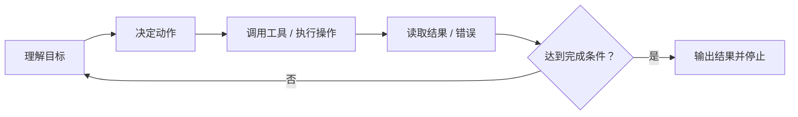

没有 loop，模型只能想象自己已经完成任务。

有了 loop，它才可以：

- 📂 读目录后修正路径判断
- ❌ 看到报错后修正命令参数
- 🧪 发现测试失败后调整实现
- 🔄 根据外部反馈更新计划

从控制论视角看，这就是从开环走向闭环。

---

## 8. 为什么子代理经常比“一个总代理”更稳

很多人一开始做 Agent，容易把所有工具、所有记忆、所有目标都交给一个总代理。

这样做的问题是：

- 📦 上下文越来越胖
- 🔀 动作空间越来越大
- 💥 错误影响半径越来越大

子代理真正的价值，不是“多智能体听起来更高级”，而是它在帮你做三件很实在的事：

- 📦 隔离上下文
- 🔐 隔离权限
- 🎯 隔离目标

比如：

- 🔎 一个代理只负责搜索信息
- 🗺️ 一个代理只负责规划
- 💻 一个代理只负责改代码
- ✅ 一个代理只负责审查和验证

这样每一轮需要处理的上下文更小、可选动作更少、错误更容易局部化。

所以，Subagents 更像复杂度管理工具，而不是炫技架构。

---

## 9. 一个更稳的 Agent 检查清单

如果你要判断一个 Agent 设计得稳不稳，不要先问“模型是不是最大”，先问下面这些问题：

- 📍 当前状态存在哪里
- 🗜️ 旧状态何时被压缩
- 💾 哪些信息会进入长期记忆
- 🚧 工具调用边界是否清楚
- 🧩 参数是否有 schema 和校验
- 🔁 失败后是否有恢复路径
- ✅ 高风险动作前是否有验证
- 🛑 循环何时停止
- 👥 是否需要把复杂任务拆成子代理

这些问题的答案组合起来，才是真正决定系统上限的 Harness。

如果要把这篇压缩成一句话，那就是：

> 🔁 **模型负责生成候选，Harness 负责把候选收进一个能感知现实、能修正错误、能持续推进的闭环。**

---

## 极简记忆版

- 💾 **Memory 不是一团东西，KV Cache、会话历史、工具输出、长期记忆必须分层看。**
- ⚠️ **Agent 变笨，常常不是因为模型不行，而是因为上下文和状态没有被整理。**
- 🛠️ **稳定 Tool Use 的优先级，通常是 schema 和工具定义先于 temperature。**
- ✅ **`strict`、validation、retry 是在收窄错误空间、校验结果、修复失败。**
- 🔁 **Harness 的本质，是把概率模型包进一个带 loop、状态、工具和验证的闭环系统。**

---

> 📖 **相关专题**：[🔄 Prompt → Harness 演进案例](../topics/topic-prompt-to-harness.md) · [🧠 Agent 与 LLM 的交互内幕](../topics/topic-agent-llm-internals.md) · [👥 多 Agent 组合专题](../topics/topic-multi-agent.md)

---

🔙 返回目录：[README · 章节目录](../../README.md#tutorial-contents)

</details>

<details>
<summary>📎 保留原文：原专题：Prompt → Harness 演进案例</summary>

---
> 📚 **Part IV · 进阶专题** | [← 返回专题目录](../../README.md#tutorial-contents)
---

# 🔄 Prompt → Harness 演进案例

> 🎯 展示从"临时 Prompt"演进到"可复用 Harness"的真实案例和方法论。

## 目录
- [1. 概述](#1-概述)
- [2. 核心内容](#2-核心内容)
- [3. 实战建议](#3-实战建议)

---

## 1. 概述

很多人用 Agent 停留在"每次手敲 Prompt"的阶段。真正的效率飞跃发生在你把反复使用的 Prompt 沉淀为 Harness（规则、Skill、工作流模板）的那一刻。这篇专题通过真实案例，展示这个演进过程：从一句临时 Prompt，到一套可复用的 Agent 工作流。

---

## 2. Harness 工程：围绕模型的系统层设计

### 什么是 Harness 工程

Harness（马具）工程是 2025-2026 年兴起的新概念：**不是优化模型本身，而是设计围绕模型的系统层**——包括提示设计、工具编排、验证循环、状态追踪、故障检测和恢复。

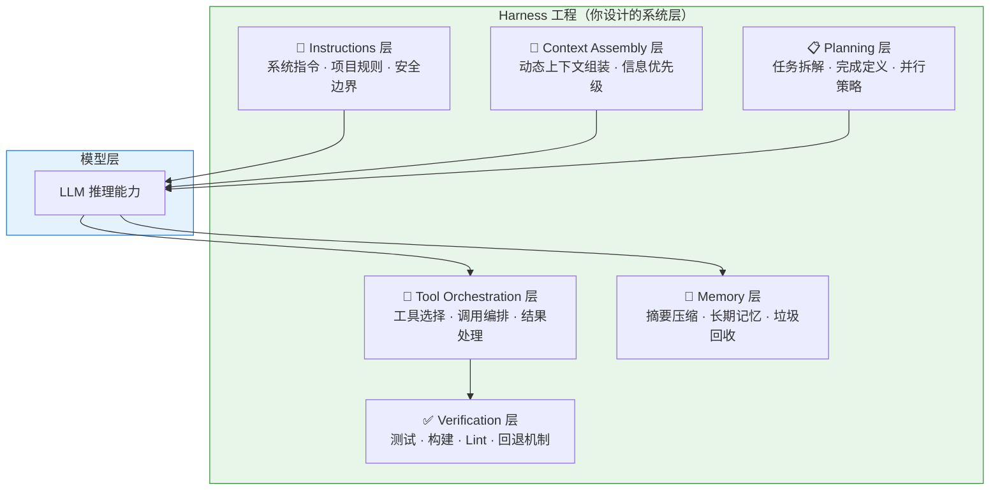

### 真实案例：Harness 比换模型更有效

LangChain 团队的编码 Agent 优化实验：

| 变量 | 改动 | 效果 |
|------|------|------|
| 换更强模型 | 从 Sonnet 升级到 Opus | 排名提升 ~5 位 |
| 改 Harness | 自验证 + 上下文注入 + 故障检测 | 排名从 Top 30 → Top 5 |

**结论**：模型能力是基线，但 Harness 是放大器。在模型能力已经足够强的前提下（2026 年的旗舰模型都够强），Harness 的质量决定了 Agent 效果的上限。

### Harness 工程师的职责

这是一个正在形成的新角色——不是优化模型，而是：

- 设计上下文组装策略
- 编排工具调用流程
- 建立验证和恢复机制
- 引入人类在环（Human-in-the-Loop）检查点
- 追踪和分析 Agent 行为
- 控制成本和延迟

> 未来，软件工程师将越来越多地承担"Agent Workflow Designer + Harness Engineer"的角色。

---

## 3. 实战建议

### 从 Prompt 到 Harness 的演进路径

| 阶段 | 做法 | 效果 |
|------|------|------|
| **临时 Prompt** | 每次手敲指令 | 不稳定，依赖经验 |
| **固定规则** | 写进 CLAUDE.md | 一致性提升 |
| **Skill 封装** | 提炼为 SKILL.md | 可复用、按需加载 |
| **Harness 工程** | 系统化设计验证循环、工具编排、故障检测 | 接近生产级可靠性 |

### 关键原则

1. **Harness 比模型更重要**：选对模型是及格线，设计好 Harness 是优秀线
2. **渐进迭代**：不要试图一步到位，从 CLAUDE.md 开始，逐步演化
3. **验证驱动**：每一层设计都要有对应的验证机制

---

> 📖 **相关章节**：[📝 Skill 系统专题](../topics/topic-skills.md) · [🧩 上下文工程深入](../topics/topic-context-engineering.md) · [🤝 人机协同详解](../topics/topic-human-agent-collab.md)

---

返回目录：[README · 章节目录](../../README.md#tutorial-contents)

</details>

<details>
<summary>📎 保留原文：原附录：人机协同与 Agent 优化指南</summary>

---
> 📚 **Part IV · 进阶专题** | [← 返回专题目录](../../README.md#tutorial-contents)
---

# 附录：人机协同与 Agent 优化指南

> 本文是 [Chapter 2 · Agent 运作原理与核心概念](../chapters/ch08-agent-formula.md) 的扩展附录，深入讲解 Agent 控制面、Harness 工程和使用优化策略。

---

## 1. Harness 工程：围绕模型的系统层设计

### 什么是 Harness 工程

Harness（马具）工程是 2025-2026 年兴起的新概念：**不是优化模型本身，而是设计围绕模型的系统层**——包括提示设计、工具编排、验证循环、状态追踪、故障检测和恢复。


### 真实案例：Harness 比换模型更有效

LangChain 团队的编码 Agent 优化实验：

| 变量 | 改动 | 效果 |
|------|------|------|
| 换更强模型 | 从 Sonnet 升级到 Opus | 排名提升 ~5 位 |
| 改 Harness | 自验证 + 上下文注入 + 故障检测 | 排名从 Top 30 → Top 5 |

**结论**：模型能力是基线，但 Harness 是放大器。在模型能力已经足够强的前提下（2026 年的旗舰模型都够强），Harness 的质量决定了 Agent 效果的上限。

### Harness 工程师的职责

这是一个正在形成的新角色——不是优化模型，而是：

- 设计上下文组装策略
- 编排工具调用流程
- 建立验证和恢复机制
- 引入人类在环（Human-in-the-Loop）检查点
- 追踪和分析 Agent 行为
- 控制成本和延迟

> 未来，软件工程师将越来越多地承担"Agent Workflow Designer + Harness Engineer"的角色。

---

## 2. 人机协同的哲学与方法论

### 核心哲学：增强而非替代

人机协同的核心不是"用 AI 替代人"，而是**发挥各自的优势，形成互补**：

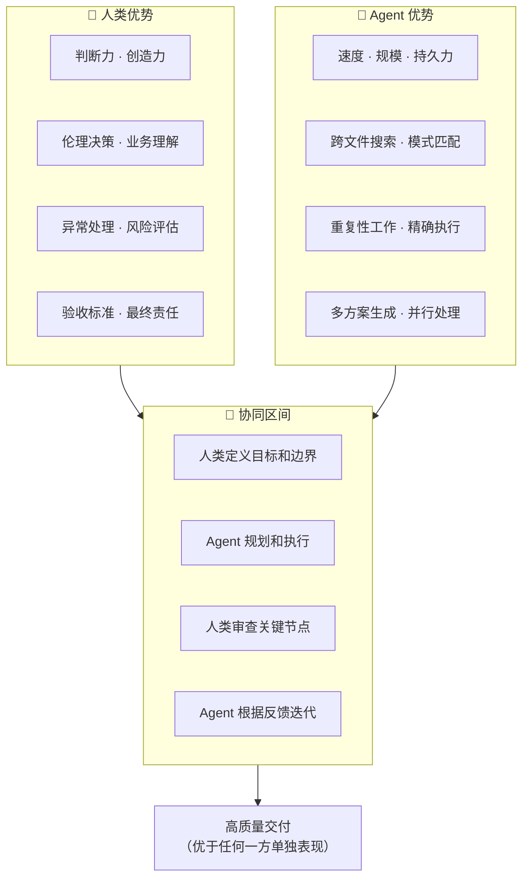

### 协同模式光谱

| 模式 | 人类角色 | Agent 角色 | 适用场景 |
|------|---------|-----------|---------|
| **人主导** | 逐步指令 | 执行单步命令 | 学习期、高风险操作 |
| **人监督** | 审批计划和关键节点 | 规划+执行 | 日常开发（推荐） |
| **人巡查** | 定期检查成果 | 大部分自主完成 | 低风险、成熟工作流 |
| **Agent 自治** | 只看最终结果 | 完全自主 | 简单重复任务 |

**推荐**：大多数场景下使用"人监督"模式——让 Agent 自己规划执行，但在关键节点（如写入文件、推送代码、重大架构决策）请求人工确认。

---

## 3. Agent 长流程失控：原因与对策

### 为什么长任务容易失控

Agent 运行的时间越长，失控的风险越高：

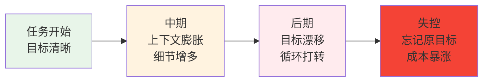

### 失控的六大根源

| 根源 | 表现 |
|------|------|
| **上下文漂移** | 越聊越偏离原始目标 |
| **记忆丢失** | 压缩后忘记关键约束 |
| **推理循环** | 在同一个错误上反复尝试同样的修复 |
| **幻觉级联** | 一个错误假设导致连串错误决策 |
| **成本失控** | 不断重试导致 token 消耗飙升 |
| **状态不持久** | 跨会话时丢失进度和上下文 |

### 对策体系

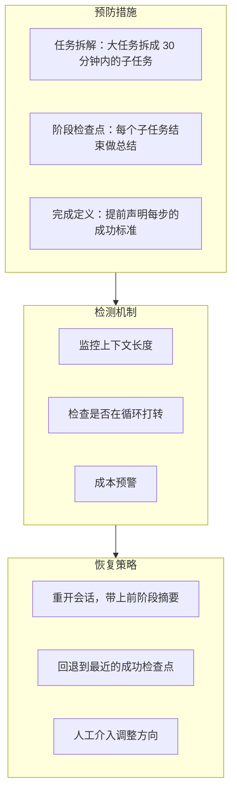

### 实用的分阶段模板

给 Agent 下达长任务时，推荐使用这个结构：

```
## 总目标
[一句话描述最终目标]

## 当前阶段
[只描述这个阶段要完成的事]

## 完成条件
- [ ] 条件 1
- [ ] 条件 2
- [ ] 运行 `xxx` 验证通过

## 约束
- 不要修改 [xxx] 目录
- 如果遇到 [xxx] 情况，先停下来告诉我

## 上阶段摘要
[如果是接续任务，附上上阶段的简要总结]
```

---

## 4. Token 节约深度指南

### Token 消耗的构成


### 各环节的优化策略

#### 系统指令优化

| 问题 | 优化方案 |
|------|---------|
| CLAUDE.md 太长（>5000 tokens） | 分层：核心规则 + 按需引用 |
| 每次对话重复加载相同规则 | 利用 Prompt Cache（自动生效） |
| 临时规则混入永久文件 | 分离：永久规则在文件，临时规则在会话中 |

#### 代码上下文优化

| 问题 | 优化方案 |
|------|---------|
| Agent 一次性读取整个大文件 | 引导 Agent 先读目录结构，按需深入 |
| 多次读取相同文件 | 在 CLAUDE.md 中说明项目关键入口文件 |
| 项目太大 Agent 找不到关键代码 | 维护 README 中的模块说明 |

#### 工具返回优化

| 问题 | 优化方案 |
|------|---------|
| 测试输出全量返回 | 指令中说明"只看失败用例的错误信息" |
| 构建日志动辄上千行 | 使用 `| tail -50` 等管道控制输出 |
| 搜索结果太多 | 使用更精确的搜索条件 |

#### 对话历史优化

| 问题 | 优化方案 |
|------|---------|
| 单个会话持续太久 | 分阶段：每完成一个子任务，考虑新开会话 |
| 中间过程的详细讨论占大量 token | 让 Agent 做阶段总结后继续 |
| 错误尝试的历史堆积 | 重开会话，直接从正确方向开始 |

### 成本估算参考

| 使用模式 | 单次任务 Token | Opus 4.6 成本 | Sonnet 4.6 成本 |
|---------|--------------|-------------|----------------|
| 简单问答 | ~5K | ~$0.05 | ~$0.02 |
| 中等修改 | ~30K | ~$0.50 | ~$0.20 |
| 复杂功能 | ~100K | ~$2.00 | ~$0.80 |
| 大型重构 | ~500K | ~$10.00 | ~$4.00 |

---

## 5. 大型项目中的 Agent 使用策略

### 项目规模与策略对应

| 项目规模 | 文件数 | 主要挑战 | 推荐策略 |
|---------|-------|---------|---------|
| 小型 | <50 | 几乎没有 | Agent 可以直接全局理解 |
| 中型 | 50-500 | Agent 无法一次读完 | 维护入口文件 + 渐进探索 |
| 大型 | 500-5000 | 定位关键代码困难 | 模块化指引 + 聚焦单模块 |
| 超大型 | 5000+ | 上下文严重不足 | 多 Agent 分模块 + 严格边界 |

### 入口文件策略

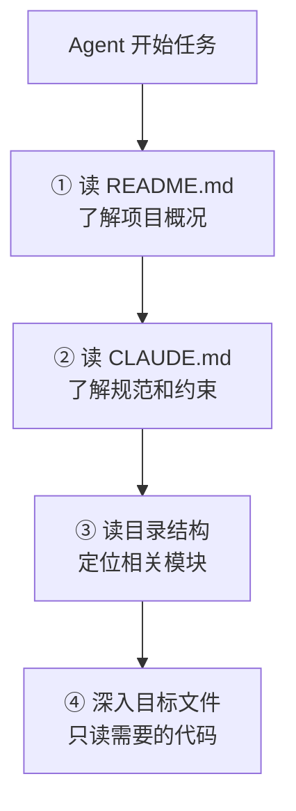

### CLAUDE.md 的结构建议

```markdown
# 项目简介
[一句话说明这是什么项目]

# 技术栈
[列出主要技术和版本]

# 项目结构
src/
  auth/       # 认证模块
  api/        # API 路由
  models/     # 数据模型
  utils/      # 工具函数

# 常用命令
- 启动：`npm run dev`
- 测试：`npm test`
- 构建：`npm run build`
- Lint：`npm run lint`

# 编码规范
- [列出关键规范]

# 注意事项
- [列出 Agent 容易踩的坑]
```

---

## 6. 人工引导 Agent 的实战技巧

### 任务拆解方法论

复杂需求直接丢给 Agent 往往效果不好。人工预先拆解可以大幅提升成功率：

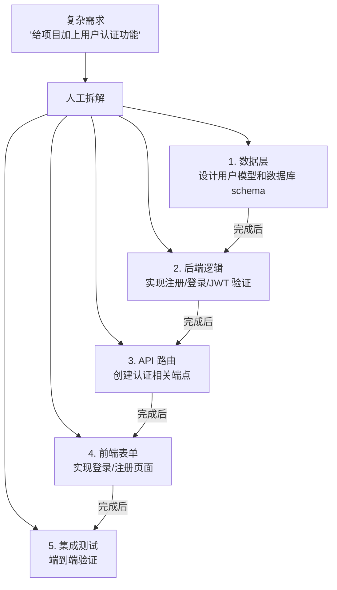

### 拆解的原则

| 原则 | 说明 |
|------|------|
| **单一关注点** | 每个子任务只涉及一个模块或关注点 |
| **可验证** | 每个子任务有明确的完成条件 |
| **30 分钟规则** | 每个子任务应在 ~30 分钟内完成 |
| **依赖清晰** | 明确哪些子任务有先后依赖 |
| **变更范围小** | 每个子任务修改的文件数尽量少（<5 个） |

### 引导 Agent 的沟通模板

#### 探索性任务

```
先阅读这个仓库的 README 和目录结构。
然后告诉我：
1. 项目的技术栈是什么
2. 核心模块有哪些
3. 要实现 [我的需求]，你建议从哪里入手
不要修改任何代码，先给出你的分析。
```

#### 实现性任务

```
## 目标
[清晰的一句话目标]

## 约束
- 只修改 src/auth/ 目录下的文件
- 使用项目已有的 [xxx] 库
- 遵循项目现有的代码风格

## 步骤
1. 先给出实现方案，等我确认
2. 实现后运行 `npm test`
3. 如果测试失败，修复后再次运行
4. 全部通过后输出变更摘要
```

#### 调试性任务

```
这个测试 `[test name]` 失败了，错误信息如下：
[粘贴关键错误信息，不要全部日志]

请先分析可能的原因（列出 2-3 个），
然后从最可能的原因开始排查。
每次修改后运行测试验证。
```

---

## 7. Agent Team 互审：多 Agent 协作的质量保障

### 为什么需要互审

单 Agent 容易陷入"自己给自己打高分"的盲区。多 Agent 互审通过引入不同视角来提升可靠性：

```mermaid
flowchart LR
    Task["任务"] --> Planner["📋 Planner<br/>规划方案"]
    Planner --> Executor["💻 Executor<br/>执行实现"]
    Executor --> Critic["🔍 Critic<br/>审查批评"]
    Critic -->|"问题"| Executor
    Critic -->|"通过"| Done["✅ 完成"]
```

### 互审的实践形式

| 形式 | 说明 | 适用场景 |
|------|------|---------|
| **Plan → Review → Execute** | 先出计划，审查通过再执行 | 大型功能开发 |
| **Write → Review → Refine** | 写完代码，另一个 Agent 审查 | 代码质量保障 |
| **Parallel + Merge** | 多个 Agent 独立实现，合并最优解 | 探索性任务 |

### Claude Code 中的 Agent Teams

Claude Code 支持启动多个子 Agent 并行工作，每个 Agent 在独立的工作目录中操作：

- **Orchestrator**：主 Agent，负责任务分配和结果整合
- **Sub-Agents**：子 Agent，各自处理独立的子任务
- **Review Agent**：审查 Agent，对其他 Agent 的产出进行质量检查

---

## 8. Agentic Coding 的成熟度模型

可以用一个五级成熟度模型来评估自己的 Agent 使用水平：

| 级别 | 描述 | 特征 |
|------|------|------|
| **L1 初学** | 把 Agent 当聊天机器人用 | 一问一答，不给上下文 |
| **L2 基础** | 能让 Agent 完成单步任务 | 会给代码上下文，会验证结果 |
| **L3 熟练** | 能让 Agent 完成多步任务 | 会拆任务、会写规则文件、会分阶段 |
| **L4 高级** | 能设计高效的 Agent 工作流 | 会写 Skill、会用 MCP、会多 Agent 协作 |
| **L5 专家** | 能进行 Harness 工程 | 系统化地设计和优化整个 Agent 系统 |

大多数开发者在使用 1-2 周后可以达到 L2-L3，但从 L3 到 L4 需要有意识地学习和实践本章介绍的概念。

---

## 总结：三个核心原则

1. **Harness 比模型更重要**：选对模型是及格线，设计好 Harness 是优秀线
2. **人在环里**：Agent 是高效协作者，不是自动驾驶；你负责判断和验收
3. **Less is More**：精简的上下文、聚焦的任务、适量的工具，比堆砌一切更有效

---

> 📖 **相关章节**：[🧩 上下文工程深入](../topics/topic-context-engineering.md) · [🔄 Prompt → Harness 演进案例](../topics/topic-prompt-to-harness.md) · [💬 Prompt 模板库](../topics/topic-prompt-templates.md)

---

返回目录：[README · 章节目录](../../README.md#tutorial-contents)

</details>
