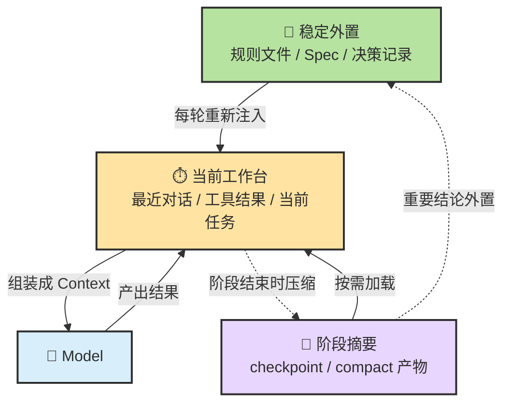
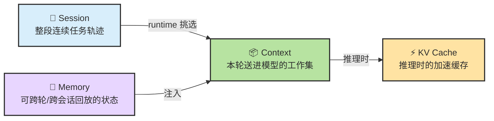
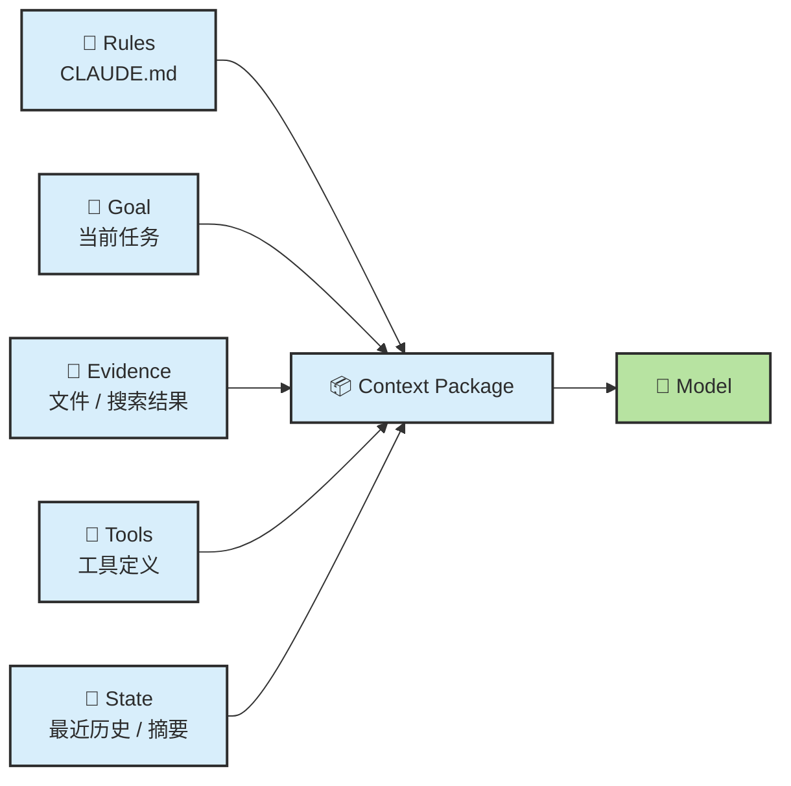
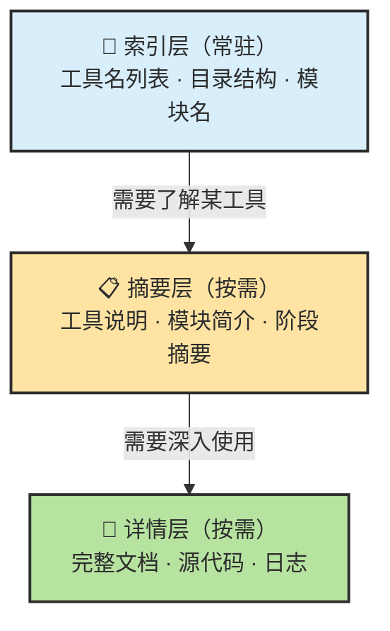
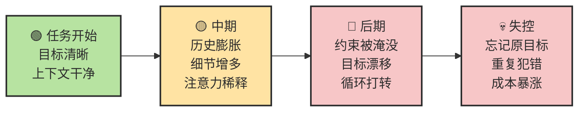
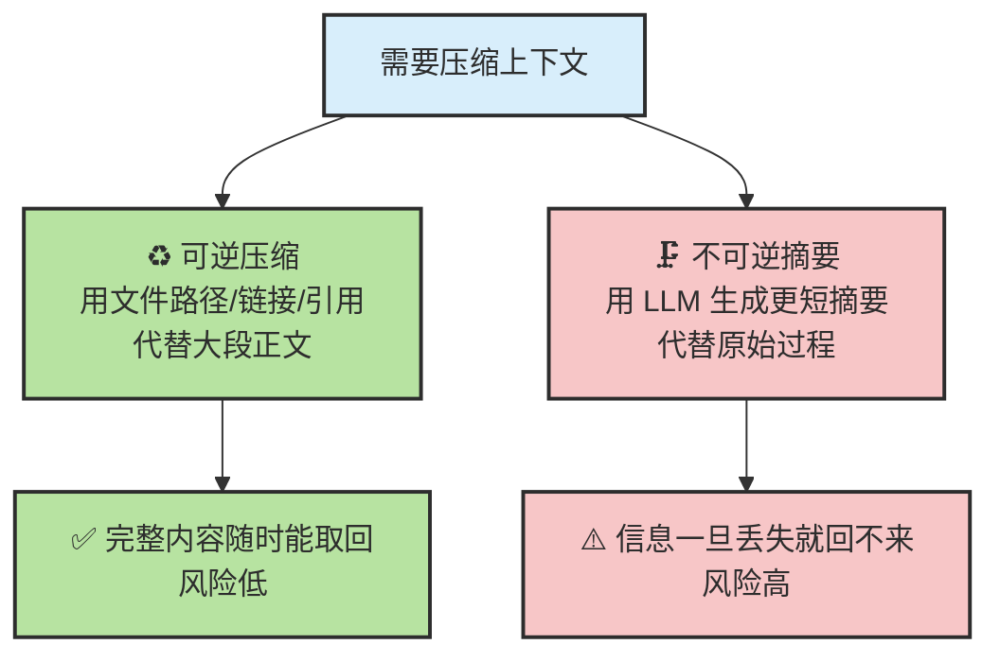
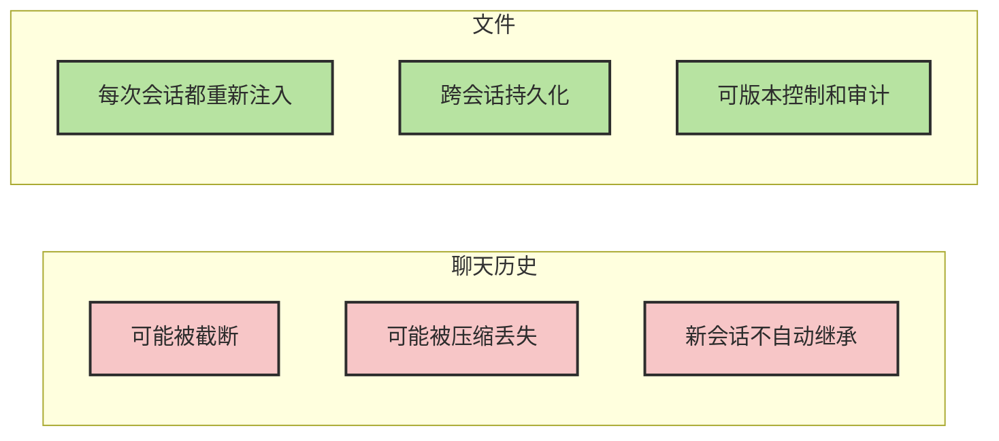
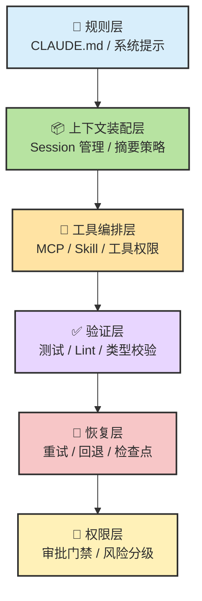
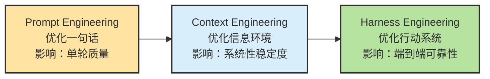
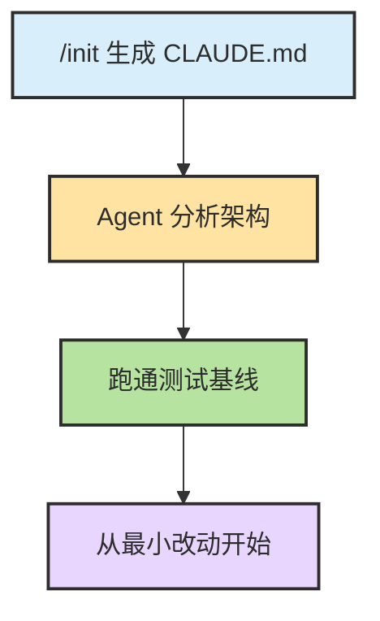

# Chapter 11 · 💾 Memory、Context 与 Harness

> 🎯 **目标**：理解 Memory 在 `Agent = LLM + Planning + Memory + Tools` 公式里扮演什么角色。读完这一章，你应该知道 Session / Context / Memory / KV Cache / Harness 之间的边界，理解四类记忆、三层状态、上下文退化和压缩策略，以及为什么"记忆"首先是状态管理问题。

## 📑 目录

- [1. Memory 在公式里的位置](#1-memory-在公式里的位置)
- [2. Session、Context、Memory、KV Cache 到底是什么关系](#2-sessioncontextmemorykv-cache-到底是什么关系)
- [3. Context Engineering：不是塞得多，而是放得对](#3-context-engineering不是塞得多而是放得对)
- [4. 为什么长任务会越聊越笨](#4-为什么长任务会越聊越笨)
- [5. 压缩与回放：可逆 vs 不可逆](#5-压缩与回放可逆-vs-不可逆)
- [6. 文件比聊天更像稳定记忆](#6-文件比聊天更像稳定记忆)
- [7. Harness：真正的杠杆在模型外侧](#7-harness真正的杠杆在模型外侧)

---
## 1. Agent公式

回顾 Ch08 的总公式：

```text
Agent = LLM + Planning + Memory + Tools
```

**Memory 的独特位置**：它不负责"想"（LLM），不负责"做"（Tools），不负责"排步骤"（Planning），而是负责**让系统在多轮行动中不失忆**——保存什么、压缩什么、外置什么、回放什么。

> 🧭 **如果 LLM 是大脑，Planning 是纪律，Tools 是手，那 Memory 就是"笔记本和档案柜"。**

### 工程视角下的 Memory：状态管理

工程语境下说 Memory，不是在说"模型记住了"，而是在说：

> 💾 **哪些状态被保存、怎样回放、什么时候压缩、什么时候外置。**

### 三层状态架构



| 层 | 它放什么 | 生命周期 |
|---|---|---|
| **当前工作台** | 当前步骤、最近观察、局部上下文 | 随对话轮次滚动 |
| **阶段摘要** | 到目前为止的关键状态压缩 | 跨轮次，会话内 |
| **稳定外置** | 规则、Spec、清单、文件、事实记录 | 跨会话，持久化 |

### 四类记忆的认知模型

从认知科学角度，Agent 的 Memory 可以对应四种不同类型，它们指导着不同的存储和回放策略：

| 类型 | 更像什么 | Agent 中的例子 | 存储策略 |
|---|---|---|---|
| **Working** | 当前工作台 | 这轮对话、最新 diff、最近命令输出 | 在 Context 里，随轮次滚动 |
| **Episodic** | 过去发生过的事 | "上次这个服务是因为端口占用挂的" | Auto Memory / 日志 |
| **Semantic** | 事实和规则 | API 文档、项目规范、团队约定 | CLAUDE.md / rules / 文档 |
| **Procedural** | 做事方法 | TDD 流程、代码审查清单、调试 SOP | Skill 文件 |

> 💡 这四类不是互斥的。同一条信息可能同时是 Semantic（"我们用 Vitest"）和 Procedural（"跑测试用 `npm test`"）。关键是**选对存储位置**——Working 放 Context，Semantic 放文件，Procedural 放 Skill。

---

## 2. Session、Context、Memory、KV Cache 到底是什么关系

很多人把这几个词混成一句"模型记住了"。它们其实处于不同层：



| 层 | 它是什么 | 最容易误解成什么 |
|---|---|---|
| 🧵 **Session** | 应用维护的一段连续任务轨迹 | 等于每一轮都完整进模型 |
| 📦 **Context** | 当前这一轮真正送进模型的工作集 | 等于整个 session |
| 💾 **Memory** | 被外置、可回放、可跨会话复用的状态 | 随便聊过就算记忆 |
| ⚡ **KV Cache** | 推理过程里的加速缓存 | 稳定记忆 |

> 🎯 **一句压缩版**：Session 像整段项目会议，Context 像这一轮摊在桌上的材料，Memory 像归档到知识库里的记录，KV Cache 则更像会议现场的临时速记缓存。

### 几个最容易问错的问题

**Q：为什么同一个 session 里，它看起来记得我前面说过的话？**
因为 runtime 会把最近历史、阶段摘要、工具结果和外置状态重新带进这一轮 context，不是模型自己"永久记住了"。

**Q：`/compact` 之后，之前那些话是不是都没了？**
逐字历史通常不会完整保留，但后续真正需要的语义状态会被压缩保留。compact 追求的是"保状态"，不是"保全文"。

**Q：KV Cache 和 Memory 有什么本质区别？**
KV Cache 是一次推理过程里的性能缓存，服务速度；Memory 是为了后续轮次还能回放状态而做的工程层设计，服务连续性。

---

## 3. Context Engineering：不是塞得多，而是放得对

Context 不只是"用户这句话"，而是当前轮真正送进模型的完整工作集：



所以上下文工程的核心问题不是"怎样把更多东西塞进去"，而是：

- 哪些信息必须**前置**（规则、目标）
- 哪些信息应该**按需加载**（详细文档、完整代码）
- 哪些历史应该**压缩成摘要**
- 哪些状态应该根本不放聊天，而是**外置成文件**

### Progressive Disclosure：只在需要时加载细节



**为什么这很重要**：如果你有 30 个工具，每个 JSON schema 描述平均 200 token，光工具定义就占去 6000 token——其中可能 25 个在当前任务里根本用不到。

**Skill 就是 Progressive Disclosure 的物理实现**：元数据层（~100 tokens，始终加载）→ 指令层（~1000 tokens，触发时加载）→ 资源层（5000+ tokens，引用时加载）。对比传统做法把所有规则一股脑放进 system prompt 的 40,000+ tokens 全量加载，Skill 可以把上下文消耗降低 50-80%。

<details>
<summary><span style="color: #e67e22; font-weight: bold;">⚙️ 进阶：长上下文的系统代价与缓存对 Prompt 设计的影响</span></summary>

### Lost in the Middle

即使上下文窗口足够长，模型对输入的利用也不是均匀的。研究发现，信息在靠前或靠后位置时更容易被正确利用；**处于中间位置时，性能明显下降**。

| 信息位置 | 被利用概率 | 实践建议 |
|---------|---------|---------|
| 靠前 | 较高 | 关键规则、任务目标前置 |
| 中间 | 明显下降 | 避免把关键约束埋在大段中间内容里 |
| 靠后 | 较高 | 最新工具输出和当前任务放在后面 |

### KV Cache 的系统代价

KV Cache 大小通常随上下文长度**线性增长**，但系统总成本和吞吐退化会让人主观感到像"爆炸"，因为 prefill 计算变重、decode 每步要访问更大缓存、并发服务里显存压力上升。

Agent 场景尤其敏感——"长输入 + 短输出 + 多轮循环"的工作负载，每一轮都在反复处理长前缀。

### Prompt Cache：稳定前缀前置，动态内容后置

> **只要你的 Agent 在重复发送同一套长前缀，缓存机制就会反过来决定你该怎么组织上下文。**

真正影响缓存命中的，不是"意思没变"，而是 token 前缀有没有被打断。在前缀中间插一句动态状态、换一下工具顺序、加个时间戳——这些都可能破坏缓存。

实用原则：固定规则写进文件（不每轮改写）、工具列表保持稳定顺序、阶段摘要独立管理、本轮状态放在靠后位置。

</details>

---

## 4. 为什么长任务会越聊越笨



长任务最容易同时发生三件事：

1. **历史不断膨胀** — 每轮新增内容挤占有限的注意力预算
2. **早期错误持续传播** — 失败尝试留在上下文里，成为新的污染源
3. **重要约束逐渐被噪音淹没** — 你第一轮强调的规则到第十轮可能已经"看不见"了

### 退化信号

当出现以下信号时，应该考虑压缩、外置或新开上下文：

| 信号 | 说明 | 建议动作 |
|------|------|---------|
| Agent 开始反复遗忘已确认的边界 | 约束被噪音淹没 | `/compact` 或新开 |
| 在旧假设上继续堆动作 | 错误前提在传播 | 新开会话 |
| 你自己也说不清当前进度 | 状态太分散 | 压缩 + 写 HANDOFF.md |
| 同样的错误在多轮里反复出现 | 失败历史在污染 | 新开会话 |

更稳的做法：阶段性压缩 → 把稳定信息写回文件 → 需要时开新上下文继续。

---

## 5. 压缩与回放：可逆 vs 不可逆

不是所有压缩都一样安全。选错压缩策略，可能导致关键信息永久丢失。



| 压缩方式 | 做法 | 风险 | 适合 |
|---------|------|------|------|
| **可逆压缩** | 用文件路径、链接、引用位置代替大段正文 | 低——完整内容随时能取回 | 代码、文档、配置 |
| **不可逆摘要** | 用 LLM 生成更短摘要代替原始过程 | 高——信息一旦丢失就回不来 | 冗长的调试日志、已确认的结论 |

> ♻️ **能可逆压缩，就先不要不可逆摘要。**

### 实用的抗漂移技巧

- 把当前阶段目标和待办写成简短 todo
- 每完成一个子任务就更新这份清单
- 让下一轮决策总是基于最新清单来推进
- 用 `/compact "focus on X"` 指定保留重点，比默认压缩更精准

---

## 6. 文件比聊天更像稳定记忆



**为什么文件更稳**：文件属于可重复注入、可跨会话回放的稳定状态。聊天历史会随着 compact、窗口截断和新开会话而消失；文件每次启动都会被重新读取。这不只是"好习惯"，而是系统架构决定的必然。

下面这些内容，最好不要只留在聊天里：

| 应该写进文件的 | 写进哪个文件 |
|-------------|-----------|
| 项目规则、编码规范 | `CLAUDE.md` / `AGENTS.md` |
| 验收标准、任务边界 | `spec.md` |
| 实施计划 | `plan.md` |
| 已确认的关键决策 | `HANDOFF.md` / 决策记录 |
| 可复用的操作流程 | `.claude/skills/` |

> 📁 **写进文件的才是可回放状态，留在对话里的多数只是临时缓存。**

---

## 7. Harness：真正的杠杆在模型外侧

Harness 可以理解成围绕模型构建的系统层。它至少包含六层：



| 层级 | 职责 | 典型实现 |
|------|------|---------|
| **规则层** | 定义行为边界和约束 | CLAUDE.md、AGENTS.md、系统提示 |
| **上下文装配层** | 组织每轮送入模型的信息 | Session 管理、文件引用、摘要策略 |
| **工具编排层** | 管理可用工具和调用流程 | MCP 配置、Skill 加载、工具权限 |
| **验证层** | 确保输出质量 | 测试运行、Lint 检查、类型校验 |
| **恢复层** | 处理失败和异常 | 重试策略、回退路径、检查点 |
| **权限层** | 控制自治边界 | 审批门禁、风险分级、人工升级点 |

### Harness 为什么比模型更值得投入

> 🏗️ **换模型通常只是微调效果，改 Harness 却可能是量级提升。**

LangChain 团队在 SWE-bench 上的实验数据：单纯换更强模型只提升了约 5 个排名位次，但系统化改进 Harness（上下文装配、工具编排、验证闭环）让他们从 Top 30 跃升到 Top 5。

### Prompt Engineering vs Context Engineering vs Harness Engineering



> 🏗️ **Prompt 很重要，但 Context 更重要；当 Agent 足够会行动时，Harness 往往更重要。**

### Harness 2.0：从双代理到三代理

Anthropic 在 2026 年 3 月发布的 Harness 2.0 展示了 Harness 演进如何显著提升端到端效果：

| 方案 | 架构 | 结果 |
|------|------|------|
| 单一 Agent（基线） | 直接生成 | 功能残缺、UI 糟糕 |
| Harness 2.0 | Planner + Generator + Evaluator | 完整可玩应用，Evaluator 单次抓出 27+ 个真实 bug |

三个角色：Planner 扩展需求为 PRD → Generator 逐个实现功能 → Evaluator 用 Playwright 真正运行应用并挑刺。

### 上下文治理实操：HANDOFF.md

当长任务需要跨多个会话时，`HANDOFF.md` 是一种轻量级状态传递机制：每个阶段结束前写入当前进展、未完成事项、关键决策；新会话开始时先读 `HANDOFF.md` 恢复上下文。

---

## 7a. 会话生命周期与旧仓库接管

### 什么时候该新开会话 vs 继续当前会话

| 信号 | 建议动作 | 原因 |
|------|---------|------|
| 任务已经变了 | 新开会话 | 旧上下文会干扰新任务 |
| Agent 开始忘记约束 | `/compact` 或新开 | 约束被历史淹没 |
| 纠正同一个错误两次以上 | 新开会话 | 失败尝试在污染判断 |
| 对话明显变长变慢 | `/compact` | 上下文窗口接近极限 |

> 🔑 **宁可多开几个短会话，也不要死守一个长会话。**

### 接手陌生代码库的 SOP



### Vibe Coding vs Agentic Coding

| 维度 | Vibe Coding | Agentic Coding |
|------|-------------|----------------|
| 目标 | 快速出原型 | 稳定交付可维护代码 |
| 控制面 | 几乎没有 | 有规则、验证和检查点 |
| 验证 | 看起来能跑就行 | 测试 + Lint + Review |
| 适用 | 一次性脚本、学习探索 | 生产代码、团队协作 |

> 💡 两者不是对立关系。先 Vibe Coding 探索方向，再用 Agentic Coding 固化成生产级代码。

---

## 📌 本章总结

- **Memory 的本质**：不是"模型记住了"，而是状态管理——保存、压缩、外置、回放。
- **四类记忆**：Working / Episodic / Semantic / Procedural，指导不同的存储策略。
- **三层状态**：工作台 → 阶段摘要 → 稳定外置，级联流转。
- **Session ≠ Context ≠ Memory ≠ KV Cache**，每层有不同的生命周期和作用。
- **Context Engineering**：放得对比放得多重要；Progressive Disclosure 是核心原则。
- **压缩要分可逆和不可逆**：能可逆就不要不可逆。
- **文件比聊天更像稳定记忆**：写进文件的才是可回放状态。
- **Harness 是真正的杠杆**：换模型微调，改 Harness 量级提升。

<details>
<summary><span style="color: #e67e22; font-weight: bold;">🎯 进阶：协作模式与 Agent 成熟度模型</span></summary>

### 三种协作模式

| 模式 | 人负责什么 | Agent 负责什么 | 适用场景 |
|------|-----------|---------------|---------|
| **建议模式** | 定方向、做判断、亲自执行 | 分析、对比方案、写草稿 | 架构设计、技术选型 |
| **工件模式** | 定任务、审 diff、决定合并 | 产出补丁、补测试、跑验证 | Bug 修复、小功能 |
| **受控自治模式** | 设边界、做审批、验最终结果 | 规划 + 执行多步任务 | 中等规模功能开发 |

### 五级成熟度

| 级别 | 特征 | 关键升级技能 |
|:---:|------|------------|
| **L1** | 把 Agent 当聊天机器人 | → 学会给代码上下文和验证命令 |
| **L2** | 能完成单步任务 | → 学会任务拆解和 Plan 模式 |
| **L3** | 能管理多步工作流 | → 学会 Skills、MCP、多 Agent 协作 |
| **L4** | 能设计 Agent 工作流体系 | → 系统化设计整个 Harness |
| **L5** | Harness Engineering | → 创新性的 Agent 系统设计 |

</details>

## 📚 继续阅读

- 想看状态进入执行层之后会发生什么：[Ch12 · Tools](./ch12-tools.md)
- 想看这些问题怎样转成真实工程护栏：[Ch19 · 工程化工作流](./ch19-engineering-workflow.md)

---

<div align="center">

[📚 返回目录](../../README.md#tutorial-contents) | [⬅️ 上一章：Ch10 Planning](./ch10-planning.md) | [➡️ 下一章：Ch12 Tools](./ch12-tools.md)

</div>
