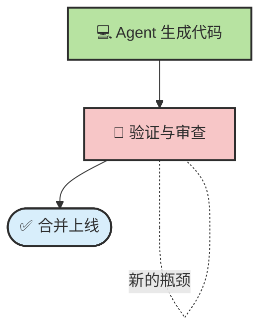
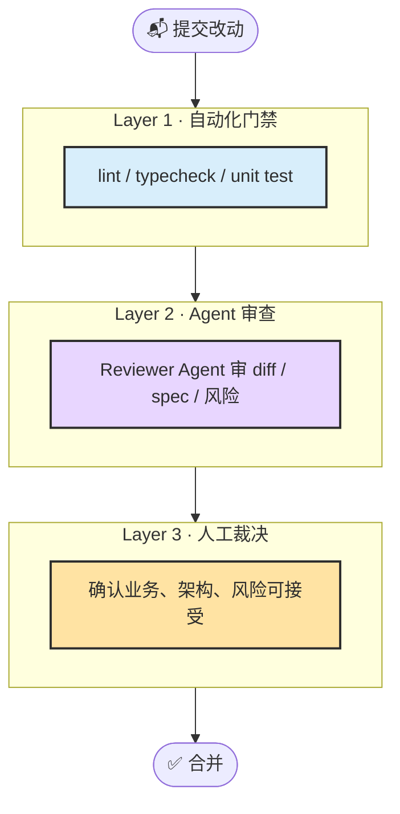
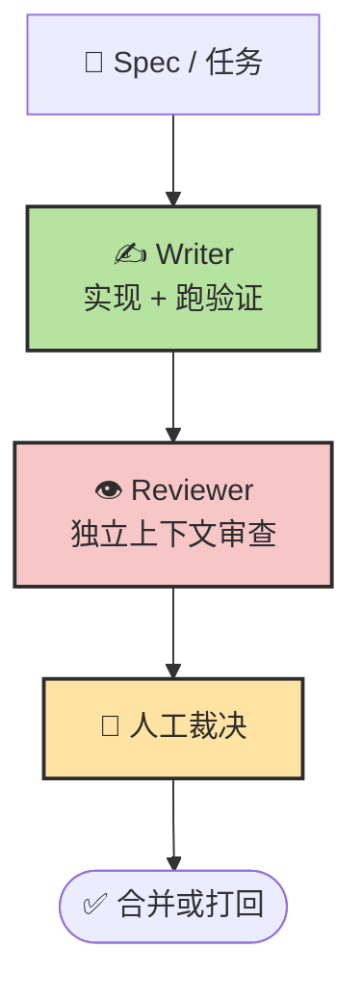

# Chapter 12 · ✅ 质量保障与验收

> 🎯 **目标**：掌握如何把 Agent 生成代码纳入一套完整的质量保障体系。读完本章，你将从“只会让 Agent 写代码”升级到“会定义验收、做 eval、组织审查、配置 CI，并在合并前做出可靠判断”。

## 📑 目录

- [0. 一条最小交付链](#0-一条最小交付链)
- [1. 🔍 为什么质量保障必须前移](#1--为什么质量保障必须前移)
- [2. 🔄 Writer-Reviewer：双 Agent 审查工作流](#2--writer-reviewer双-agent-审查工作流)
- [3. ✅ 验收标准与 Eval 设计](#3--验收标准与-eval-设计)
- [4. ⚙️ GitHub Actions 集成模板](#4-️-github-actions-集成模板)
- [5. 🛡️ AI 幻觉与常见陷阱](#5-️-ai-幻觉与常见陷阱)
- [6. 📋 Merge 前清单](#6--merge-前清单)

---

> 📌 **章节职责**：Ch11 解释为什么要把“写、审、验收、护栏”拆开；本章只关注怎么把它们排成一条可执行、可复盘、可合并的交付链。

## 0. 一条最小交付链

先把本章压成 5 个动作看：

1. 先写验收标准，不要写完代码再猜什么叫“完成”
2. Writer 负责实现和自验证，不负责给自己打分
3. Reviewer 只看 `diff + spec + 验收标准 + 验证结果`
4. 自动化门禁负责挡掉低级错误，人类负责做最终裁决
5. 只有“证据链完整”的改动，才进入 merge 决策

如果你已经读过 Ch11，可以把本章理解成：**把 Writer-Reviewer、验收标准、CI 门禁、合并清单串成一条真实可执行的 PR 流水线。**

## 1. 🔍 为什么质量保障必须前移

代码生成加速以后，真正变慢的通常不是“写代码”，而是“确认这段代码到底能不能进主干”。如果你只强化生成，不强化验证，瓶颈就会从开发阶段转移到审查与验收阶段。



### 质量体系里，Agent 和人分别擅长什么

| 维度 | Agent 🤖 | 人类 👤 |
|------|----------|--------|
| **规则检查** | 风格、类型、常见反模式、依赖一致性 | 通常不如自动化稳定 |
| **已知漏洞初筛** | 能扫出常见注入、权限、配置错误 | 适合做最终风险判断 |
| **业务正确性** | 受限，缺少真实上下文 | 更强 |
| **架构合理性** | 容易陷入局部最优 | 更强 |
| **验收裁决** | 可以辅助对照标准 | 必须由人主导 |

> 🔑 **核心认知**：质量保障不是“让 Agent 再看一眼”，而是把自动化、Agent 和人类判断排成分层体系。

### 三层质量保障



---

## 2. 🔄 Writer-Reviewer：双 Agent 审查工作流

最实用的模式不是“一个 Agent 写完顺便自己 review”，而是**Writer 和 Reviewer 分离**。



### 为什么必须分离

同一个会话里的 Agent 很容易带着“我知道自己为什么这么写”的偏见继续看代码。独立 Reviewer 的价值在于：

1. 只看 `diff + spec + 验收标准`，更容易发现遗漏。
2. 不继承 Writer 的试错历史，减少确认偏误。
3. 更适合输出结构化问题单，而不是复述实现思路。

### Reviewer 的输入最少要有什么

| 输入 | 作用 |
|------|------|
| **Spec / 需求摘要** | 判断是否做偏 |
| **Diff** | 聚焦本次改动 |
| **验收标准** | 判断“完成”而不是只判断“看起来没问题” |
| **验证结果** | 区分“已经跑过”与“只是声称跑过” |

### 一份够用的 Reviewer 提示词

```text
请审查当前分支相对于 main 的改动。

审查依据：
1. spec.md 中的需求与验收标准
2. 当前 diff
3. 已运行的验证结果

请重点检查：
- 逻辑正确性和边界条件
- 错误处理是否完整
- 是否引入了不必要的复杂度
- 测试是否真正覆盖验收标准

输出格式：
- 🔴 阻塞合并
- 🟡 建议修复
- 🟢 可选优化

只报告真正的问题，不要为了凑数而报告风格偏好。
```

---

## 3. ✅ 验收标准与 Eval 设计

只做 Review 不够，**还要先定义“什么算通过”**。这一步才是质量保障体系的骨架。

### 验收标准和 Review 的区别

| 概念 | 回答的问题 |
|------|-----------|
| **验收标准** | 结果达到业务目标了吗？ |
| **Code Review** | 这份实现有没有明显问题？ |
| **Eval** | 我们能否系统性、重复性地判断它做得对不对？ |

### 一个最小验收模板

```markdown
## 目标
用户可以在 token 过期后被正确拒绝访问

## 验收标准
- 过期 token 返回 401
- 未过期 token 正常通过
- 错误信息符合现有 API 响应格式

## 证据
- `npm test -- auth.test.ts`
- `npm run lint`
- Reviewer 审查结论
```

### Eval 不是大而全，先从可重复判断开始

对于教程读者，最实用的 eval 设计不是追求复杂指标，而是先把判断标准拆成三类：

| 类型 | 例子 | 适用场景 |
|------|------|---------|
| **规则型 eval** | 类型检查、lint、契约校验 | 语法、接口、规范一致性 |
| **用例型 eval** | 单元测试、集成测试、回归测试 | 功能正确性 |
| **判断型 eval** | Reviewer 对照 Spec 的结论 | 架构、复杂度、业务边界 |

### 设计 eval 的三个动作

1. **先把需求写成可验证句子**：不要写“体验更好”，要写“提交后出现成功提示，并刷新列表”。
2. **每条关键验收都要有证据来源**：测试、截图、日志、构建结果至少占一种。
3. **把不可自动化的判断显式留给人**：比如架构权衡、性能取舍、业务可接受性。

### 一个常见误区

> 测试通过，不等于验收通过。

测试只能证明“在这些用例上没坏”，不能自动证明“满足了业务目的”。所以验收标准必须独立于测试存在。

---

## 4. ⚙️ GitHub Actions 集成模板

将 Agent 审查集成到 CI/CD 流程中，可以让每个 PR 自动获得一份审查报告。以下是一个可直接使用的 GitHub Actions 模板：

### `agent-review.yml` 模板

```yaml
name: Agent Quality Review

on:
  pull_request:
    types: [opened, synchronize, reopened]

permissions:
  contents: read
  pull-requests: write

jobs:
  agent-review:
    runs-on: ubuntu-latest
    timeout-minutes: 10

    steps:
      - name: Checkout code
        uses: actions/checkout@v4
        with:
          fetch-depth: 0

      - name: Get changed files
        id: changed
        run: |
          FILES=$(git diff --name-only origin/${{ github.base_ref }}...HEAD \
            | grep -E '\.(ts|tsx|js|jsx|py|go|rs)$' \
            | head -20)
          echo "files<<EOF" >> $GITHUB_OUTPUT
          echo "$FILES" >> $GITHUB_OUTPUT
          echo "EOF" >> $GITHUB_OUTPUT

      - name: Generate diff context
        id: diff
        run: |
          DIFF=$(git diff origin/${{ github.base_ref }}...HEAD \
            -- ${{ steps.changed.outputs.files }} \
            | head -3000)
          echo "content<<EOF" >> $GITHUB_OUTPUT
          echo "$DIFF" >> $GITHUB_OUTPUT
          echo "EOF" >> $GITHUB_OUTPUT

      - name: AI Quality Review
        uses: actions/github-script@v7
        env:
          ANTHROPIC_API_KEY: ${{ secrets.ANTHROPIC_API_KEY }}
        with:
          script: |
            const diff = `${{ steps.diff.outputs.content }}`;
            if (!diff.trim()) {
              console.log('No reviewable changes found.');
              return;
            }

            const response = await fetch('https://api.anthropic.com/v1/messages', {
              method: 'POST',
              headers: {
                'Content-Type': 'application/json',
                'x-api-key': process.env.ANTHROPIC_API_KEY,
                'anthropic-version': '2023-06-01'
              },
              body: JSON.stringify({
                model: 'claude-sonnet-4-20250514',
                max_tokens: 4096,
                messages: [{
                  role: 'user',
                  content: `你是一位严格的代码审查员。请审查以下 PR diff：

            ${diff}

            审查重点：安全漏洞、逻辑错误、错误处理缺失、性能问题。
            使用 🔴（必须修复）、🟡（建议修复）、🟢（可选优化）标记问题。
            只报告真正的问题。如果代码质量良好，直接给出正面评价。
            用中文回复。`
                }]
              })
            });

            const result = await response.json();
            const review = result.content[0].text;

            await github.rest.issues.createComment({
              owner: context.repo.owner,
              repo: context.repo.repo,
              issue_number: context.issue.number,
              body: `## 🤖 Agent Quality Review\n\n${review}\n\n---\n*由 AI 自动生成，仅供参考。最终决策请以人工审查为准。*`
            });
```

### CI 里的定位

这个模板最适合做“第二层过滤”，不是最终裁决器。

| 层级 | 建议 |
|------|------|
| **L1 自动化** | 阻塞不通过的 lint / typecheck / test |
| **L2 Agent 审查** | 以 comment 形式给结论，不直接代替人工决策 |
| **L3 人工裁决** | 根据业务风险决定合并或打回 |

> 🔑 **原则**：Agent 建议，人类裁决；自动化阻塞确定性错误，人工兜底高判断任务。

---

## 5. 🛡️ AI 幻觉与常见陷阱

Agent 生成的代码看起来“自信且完整”，但可能包含人眼难以察觉的幻觉。理解这些陷阱并建立防御策略，是质量保障的最后一道防线。

### 最常见的五类幻觉

| 类型 | 典型表现 | 对策 |
|------|---------|------|
| **API 虚构** | 调用了不存在的函数或参数 | 类型检查、编译验证 |
| **版本幻觉** | 使用当前版本不支持的语法或能力 | 锁定运行时版本、锁定官方文档 |
| **依赖幻觉** | import 了仓库里根本没有的包 | 限制只能使用现有依赖 |
| **上下文遗忘** | 前面约定了接口，后面又改口 | 把契约写进文件，而不是只留在会话 |
| **测试幻觉** | 测试绿了，但根本没验证核心行为 | 设计反例、边界用例和回归用例 |

### 三条最有效的防御动作

**1. 编译即验证**

```text
TypeScript 跑 `tsc --noEmit`
Python 跑 `mypy --strict`
```

**2. 锁定依赖来源**

```markdown
## 依赖管理规则
- 禁止新增依赖，除非我明确批准
- 只能使用 package.json / requirements.txt 中已有的包
- 如需新增依赖，先说明包名、版本、用途和替代方案
```

**3. 用“反例”测测试**

```text
写完测试后，故意把关键条件反转一次，
确认测试能失败，再恢复正确实现。
```

### “信任但验证”矩阵

| 风险级别 | 场景 | 验证深度 |
|---------|------|---------|
| **低风险** | 格式化、重命名、简单配置 | 快速浏览 + 自动化验证 |
| **中风险** | API、业务逻辑、算法实现 | 逐函数审查 + 边界测试 |
| **高风险** | 认证、支付、数据迁移、权限控制 | 逐行审计 + 手动验证 + 同事互审 |

> 🔑 **经验法则**：不可逆程度越高，验证越要深。按钮位置错了能热修；数据删错了可能回不来。

---

## 6. 📋 Merge 前清单

到了这一步，不要问“代码写完了吗”，而要问“证据够了吗”。

### 合并前的六个问题

- 这次改动是否有明确的 Spec 或需求摘要？
- 验收标准是否写出来了，而不是只靠口头理解？
- 自动化验证是否真实跑过，并保留了结果？
- Reviewer 是否在独立上下文下审过本次 diff？
- 高风险点是否被人工看过，而不是只靠 Agent 通过？
- 这次改动是否可回滚、可定位、可解释？

### 一个最小 Merge Checklist

```markdown
- [ ] 需求 / Spec 已确认
- [ ] 验收标准已列出
- [ ] lint / typecheck / test 全通过
- [ ] Reviewer 已输出审查结论
- [ ] 高风险改动已人工审阅
- [ ] 回滚路径已明确
```

---

## 📌 本章总结

| 核心概念 | 一句话总结 |
|----------|-----------|
| **质量前移** | 代码生成提速后，真正稀缺的是可靠验收，而不是更多生成 |
| **Writer-Reviewer** | 写和审必须上下文分离，避免自己给自己打分 |
| **验收与 Eval** | 先定义“什么算通过”，再谈怎么 review |
| **CI 集成** | 自动化拦确定性错误，Agent 补第二层判断，人做最终裁决 |
| **幻觉防御** | API、依赖、版本、上下文、测试五类幻觉最常见 |
| **Merge 清单** | 没有证据的“完成”不算完成 |

### 新人读完立刻去做

1. 给你当前正在做的任务补一份 5 行内的验收标准。
2. 为项目加一个最小 `Merge Checklist`。
3. 把 `Writer` 和 `Reviewer` 分成两个独立会话试一次。

### 三条核心原则

> 🔑 **先定义通过标准，再让 Agent 动手** — 没有验收标准，就没有真正的完成定义。
>
> 🔑 **自动化能挡住确定性错误，Agent 能发现部分灰区，人类负责最终判断** — 三层职责不要混。
>
> 🔑 **没有运行过的验证、没有保留的证据、没有明确的回滚路径，都不该直接合并。**

---

<div align="center">

[📚 返回目录](../../README.md#tutorial-contents) | [⬅️ 上一章：Ch11 Agent 设计模式与代码库策略](./ch11-design-patterns.md) | [➡️ 下一章：Ch13 技术简史与当前定位](./ch13-history.md)

</div>
