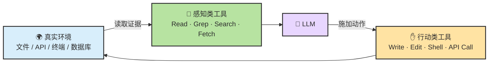
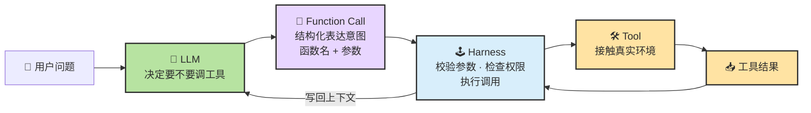
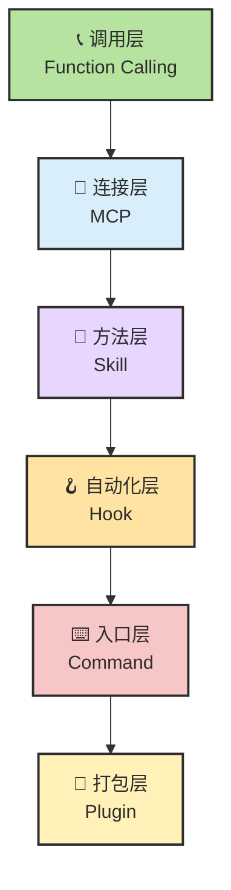
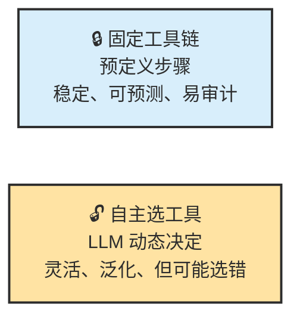
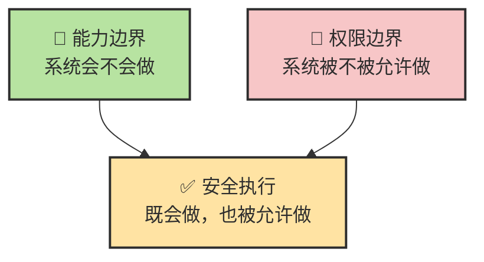
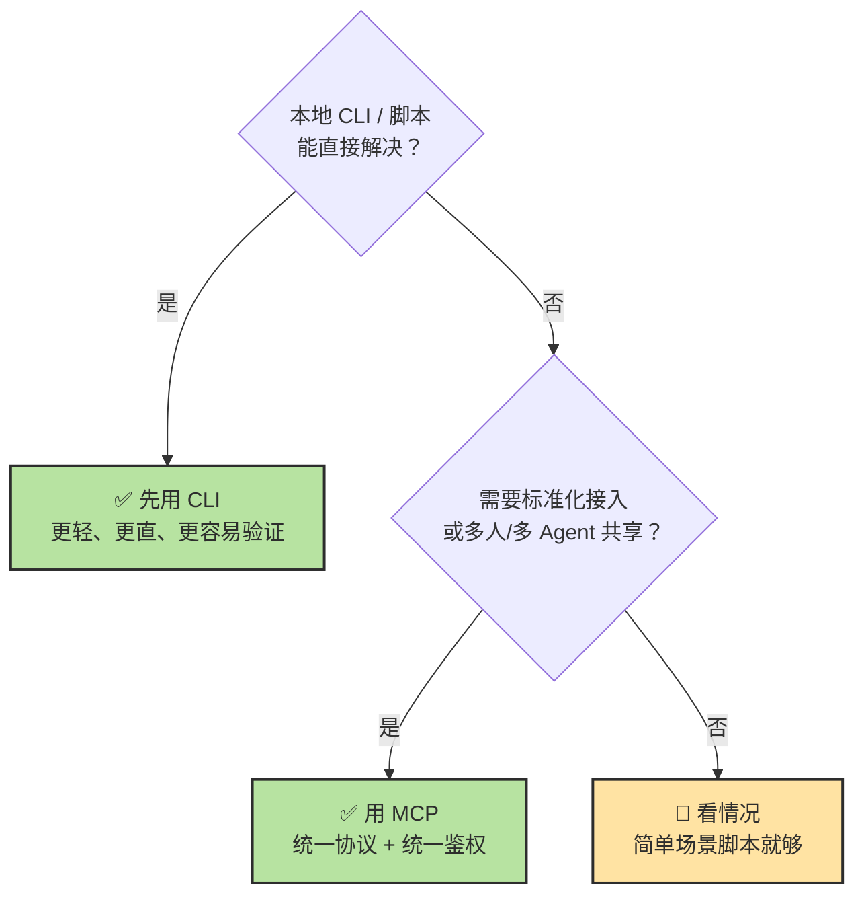
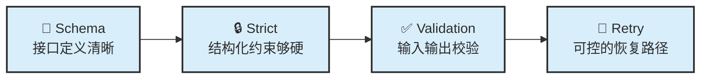
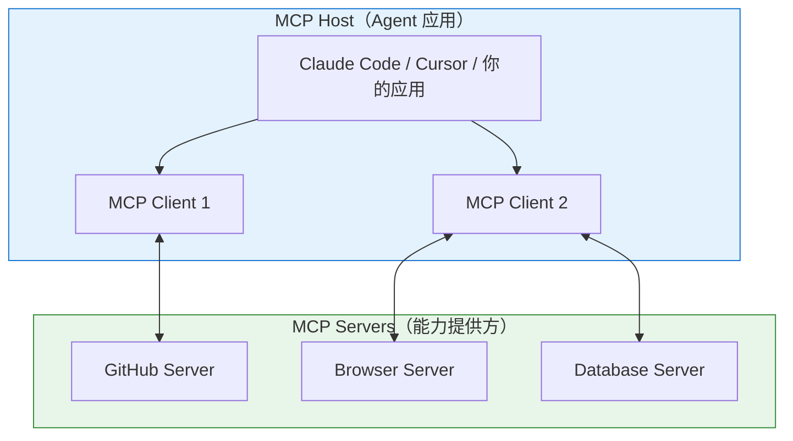

# Chapter 12 · 🛠️ Tools

> 🎯 **目标**：理解 Tools 在 `Agent = LLM + Planning + Memory + Tools` 公式里扮演什么角色。读完这一章，你应该知道 Tool Use 真正补上的是什么、Function Calling 处在什么位置、工具栈有几层、能力边界和权限边界为什么不是一回事，以及为什么工具系统稳不稳，往往比工具多不多更重要。

## 📑 目录

- [1. Tools 在公式里的位置](#1-tools-在公式里的位置)
- [2. Function Calling：从意图到执行的完整链路](#2-function-calling从意图到执行的完整链路)
- [3. 工具栈的六层分层](#3-工具栈的六层分层)
- [4. 能力边界 ≠ 权限边界](#4-能力边界--权限边界)
- [5. CLI 与 MCP：什么时候该用哪条路](#5-cli-与-mcp什么时候该用哪条路)
- [6. 稳定 Tool Use 的四个关键词](#6-稳定-tool-use-的四个关键词)

---

## 1. Tools 在公式里的位置

回顾 Ch08 的总公式：

>Agent = LLM + Planning + Memory + Tools

**Tools 的独特位置**：它是 Agent 唯一直接接触真实环境的部件。LLM 负责想、Planning 负责排步骤、Memory 负责记，但只有 Tools 能让系统**真的碰到世界**。

> 🧭 **如果 LLM 是大脑，Planning 是纪律，Memory 是笔记，那 Tools 就是"手和眼睛"。**

### 两类工具：感知 vs 行动

| 工具类型 | 它在补什么 | 典型例子 |
|---------|---------|---------|
| **感知类（Read）** | 给系统补**证据** | 读文件、搜代码、查日志、看网页 |
| **行动类（Act）** | 让系统对外部世界**施加动作** | 改文件、跑命令、发请求、触发 CI |

---

## 2. Function Calling：从意图到执行的完整链路

Function Calling 不等于工具本身。更准确的分工是：

| 角色 | 职责 |
|------|------|
| **LLM** | 决定"要不要用工具、用哪个" |
| **Function Calling** | 把工具意图**结构化表达**（函数名 + 参数 JSON） |
| **Harness** | 校验参数、检查权限、执行调用、处理失败 |
| **Tool** | 真正接触环境，返回结果 |

> 💡 所以"工具调用不稳"时，问题可能出在四个环节中的任何一个：LLM 选错了工具、Function Call 参数格式不对、Harness 没做校验、Tool 本身执行失败。

---

## 3. 工具栈的六层分层

Coding Agent 的工具生态不是一个平面，而是分成六层：

| 层 | 代表 | 它主要解决什么 | 详讲 |
|---|---|---|---|
| **调用层** | Function Calling | 模型如何表达工具调用意图 | 本章 §2 |
| **连接层** | MCP | 工具和资源如何被标准化接入 | [Ch14](./ch14-mcp.md) |
| **方法层** | Skill | 某类任务该按什么流程做更稳 | [Ch13](./ch13-skill.md) |
| **自动化层** | Hook | 哪些动作应在特定时机自动触发 | [Ch15](./ch15-hook-plugin.md) |
| **入口层** | Command | 哪些常用工作流值得给用户一个手动入口 | [Ch15](./ch15-hook-plugin.md) |
| **打包层** | Plugin | 如何把多种能力作为一个可安装单元分发 | [Ch15](./ch15-hook-plugin.md) |

### 运行时的五类工具

| 类别 | 主要用途 | 举例 |
|------|---------|------|
| **读取类** | 理解项目和现状 | `Read`、`Grep`、`Glob` |
| **写入类** | 修改文件或创建内容 | `Write`、`Edit` |
| **执行类** | 跟开发环境互动 | `Shell`、`Bash` |
| **外部类** | 获取外部世界信息 | `WebSearch`、`WebFetch` |
| **编排类** | 把子任务交给其他 Agent | `Agent`（子代理） |

### 固定工具链 vs 自主选工具

| 方式 | 优点 | 风险 | 适合 |
|------|------|------|------|
| **固定工具链** | 稳定、可预测、易审计 | 遇到例外情况僵硬 | 流程高度固定的任务 |
| **自主选工具** | 灵活、泛化能力强 | 更容易选错、绕路或过度调用 | 开放式、探索式任务 |

---

## 4. 能力边界 ≠ 权限边界

这是 Tools 章节里必须尽早讲清的一条：

| 维度 | 含义 | 例子 |
|------|------|------|
| **能力边界** | 系统**会不会**做 | Agent 知道如何删除文件 |
| **权限边界** | 系统**被不被允许**做 | 但 `settings.json` 里禁止了 `rm -rf` |

一个系统可能知道如何删除文件（有能力），但并不被授权删除（无权限）。也可能拥有写权限，但没有足够上下文去安全地修改（有权限但能力不够）。

> 🔒 工程控制面必须同时管理：工具**是否存在** → 调用**是否允许** → 允许到**什么范围** → 失败后**如何停下**。

---

## 5. CLI 与 MCP：什么时候该用哪条路

**为什么很多场景默认先用 CLI + 文件系统**：

| 维度 | CLI / 文件系统 | MCP |
|------|-------------|-----|
| **启动成本** | 零——已有命令直接用 | 需要安装、配置 Server |
| **上下文成本** | 低——不需要额外工具定义 | 每个 Server 消耗 8K-18K tokens |
| **可调试性** | 高——命令行直接看输出 | 中——需要调试 Server 链路 |
| **共享性** | 低——本地环境 | 高——标准化接口，团队共享 |
| **适合** | 本地开发、快速验证 | 跨团队、跨产品、企业级集成 |

> ⚖️ 更务实的顺序：先用最直接的本地能力 → 检索和连接层不够时再上 MCP → 工作流重复出现时固化成 Skill/Hook。

---

## 6. 稳定 Tool Use 的四个关键词

当工具调用不稳时，很多人第一反应是调温度、换模型。但工程里更重要的通常是这四件事：

| 关键词 | 它在解决什么 | 不做会怎样 |
|--------|-----------|---------|
| **Schema** | 参数结构是否清晰，字段边界是否明确 | 模型编造参数、传错类型 |
| **Strict** | 模型是否必须按结构输出，而不是自由发挥 | JSON 格式不合法、多了字段 |
| **Validation** | 调用前后是否做类型、范围、状态检查 | 静默失败、错误扩散 |
| **Retry** | 失败后是否有可控的重试或回退策略 | 一次失败就卡死 |

> 🧪 **很多工具稳定性问题，根本不是采样参数问题，而是接口设计和执行护栏问题。**

🔌 进阶：MCP 协议深度解析与 A2A 对比

### MCP 架构

### MCP 与 A2A：互补的两大协议

| 协议 | 方向 | 解决什么 |
|------|------|---------|
| **MCP** | 纵向（Agent ↔ 工具） | Agent 如何连接和使用外部工具和数据 |
| **A2A** | 横向（Agent ↔ Agent） | 多个 Agent 如何发现、通信和协作 |

### 谁支持 MCP？（2026.03）

Claude Code（原生）、Cursor、Cline、Codex CLI（部分）、VS Code Copilot、OpenCode 均已支持。

⚠️ 进阶：工具调用的四大陷阱与工业级护栏

### 四大陷阱

| 陷阱 | 说明 | 应对 |
|------|------|------|
| **执行幻觉** | Agent 编造参数或"以为"自己执行成功 | 始终要求展示实际输出 |
| **上下文衰退** | 工具返回结果不断堆积，token 膨胀 | 控制输出长度、定期摘要 |
| **延迟爆炸** | 每个请求都走完整链路 | 简单操作用脚本直接执行 |
| **安全崩塌** | Prompt Injection 劫持工具调用 | 高风险操作设人工确认 |

### 工具数量的 Less is More

工具选择准确率在数量超过 ~20 个后明显下降。管理策略：动态加载、分层组织、优先 CLI、定期清理、文档清晰。

### 2026 年趋势

CLI/API + Skills 组合在上升。很多团队优先走 CLI/脚本/直接 API，MCP 在统一鉴权、远程连接、企业级集成时仍有价值。真正变化的是默认选型顺序——先问"现有 CLI 能不能解决"，不行再引入 MCP。

---

## 📌 本章总结

- **Tools 是 Agent 唯一直接接触真实环境的部件**——感知类补证据，行动类施加动作。
- **Function Calling 是四环链路**（LLM → 结构化意图 → Harness → Tool），不稳时四个环节都可能出问题。
- **工具栈分六层**：调用 → 连接 → 方法 → 自动化 → 入口 → 打包，各有详讲章节。
- **能力边界 ≠ 权限边界**：会做不等于被允许做。
- **先 CLI 再 MCP**：不是所有能力都值得先做成标准化协议。
- **稳定 Tool Use 靠四件事**：Schema + Strict + Validation + Retry。

## 📚 继续阅读

- 方法层展开：[Ch13 · Skill](./ch13-skill.md)
- 连接层展开：[Ch14 · MCP](./ch14-mcp.md)
- 自动化层 / 入口层 / 打包层展开：[Ch15 · Command、Hook 与 Plugin](./ch15-hook-plugin.md)

---

[📚 返回目录](../../README.md#tutorial-contents) | [⬅️ 上一章：Ch11 Memory、Context 与 Harness](./ch11-memory-context-harness.md) | [➡️ 下一章：Ch13 Skill](./ch13-skill.md)

