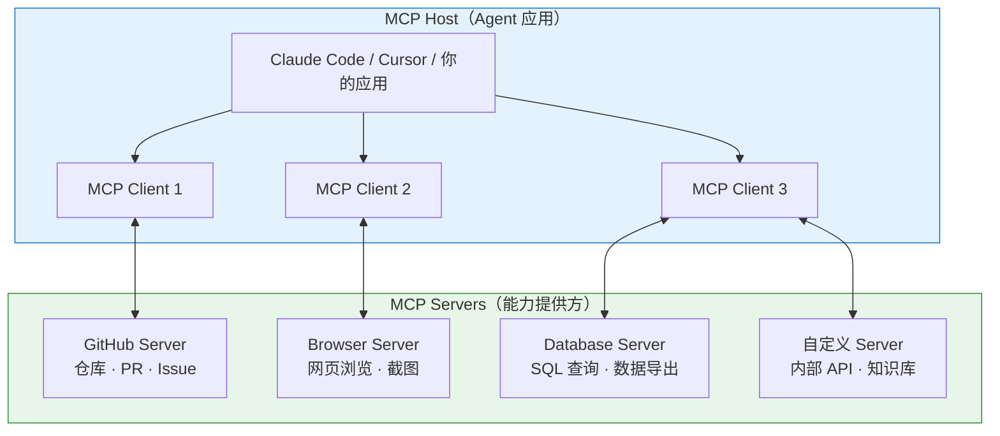
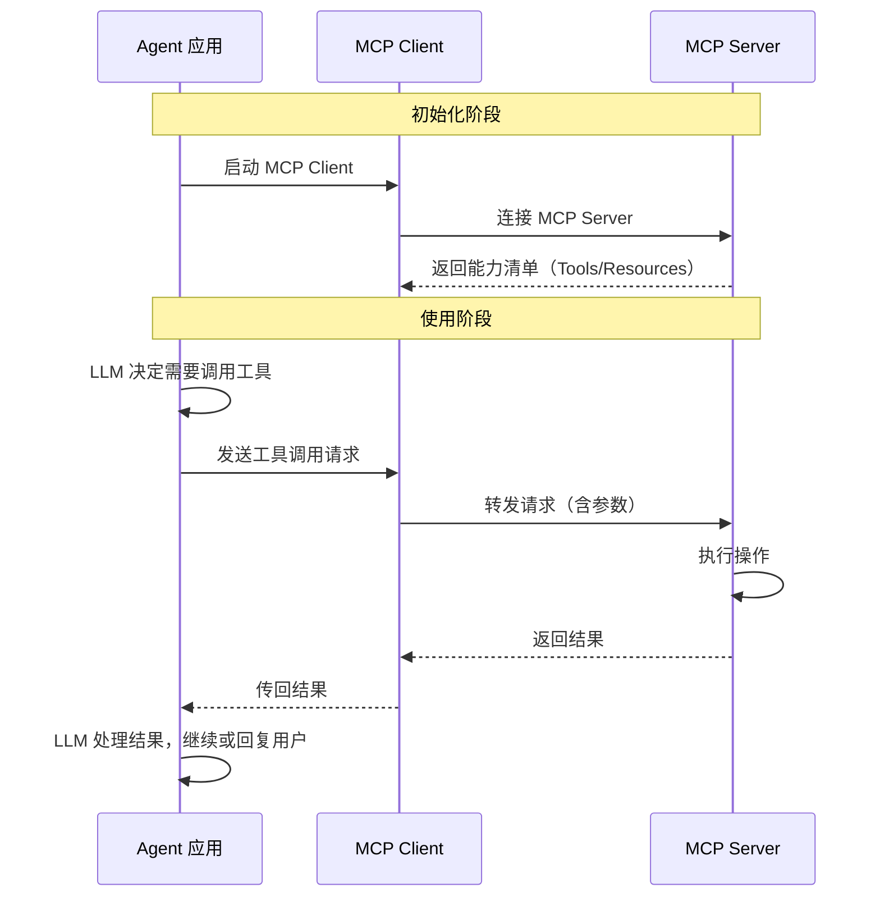
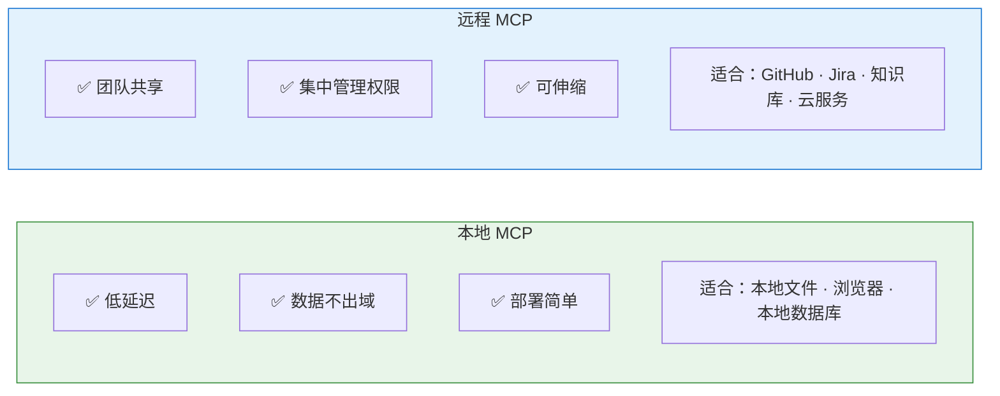
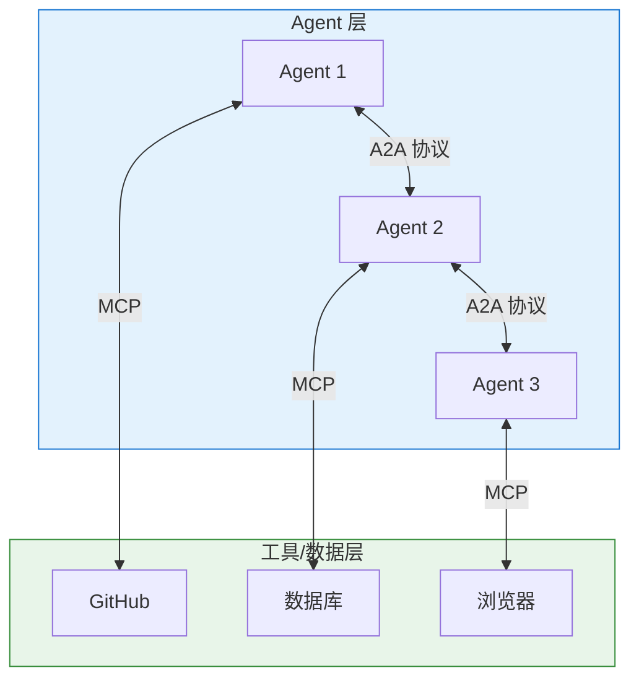
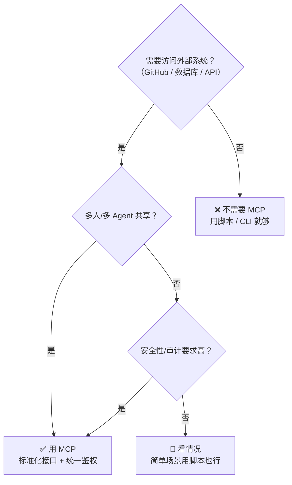
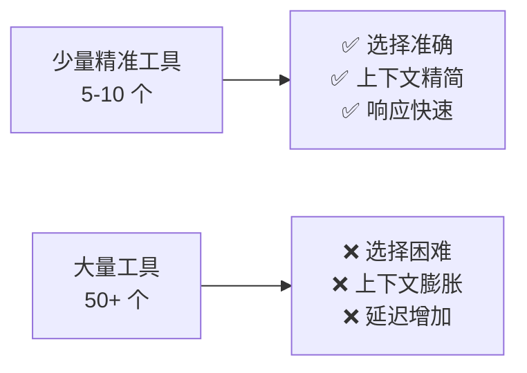
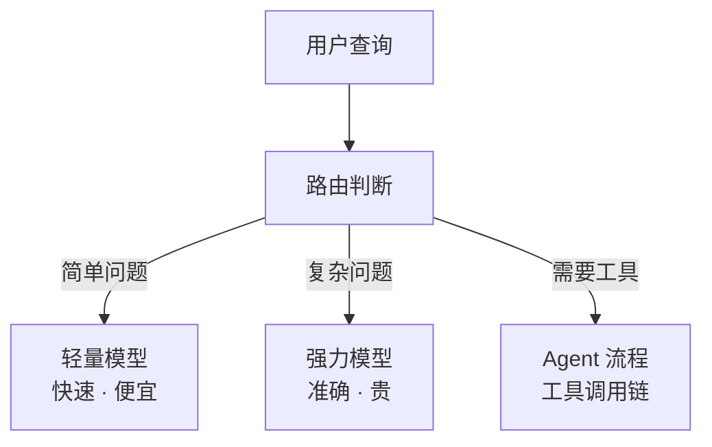
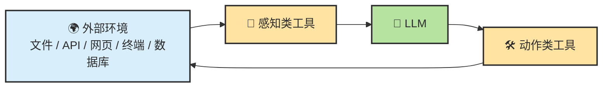
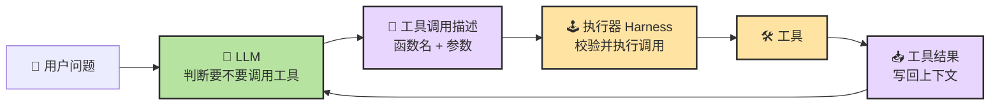

# Chapter 12 · 🛠️ Tools

> 目标：先把 Agent 的“手”讲清楚。读完这一章，你应该知道 Tool Use 真正补上的是什么、Function Calling 处在什么位置，以及为什么工具系统稳不稳，往往比工具多不多更重要。

## 📑 目录

- [1. Tools 补上的不是知识，而是行动与证据](#1-tools-补上的不是知识而是行动与证据)
- [2. Function Calling 的角色](#2-function-calling-的角色)
- [3. MCP、Skill、Hook、Plugin、Command 的分层地图](#3-mcpskillhookplugincommand-的分层地图)
- [4. CLI 与 MCP：什么时候该用哪条路](#4-cli-与-mcp什么时候该用哪条路)
- [5. 稳定 Tool Use 的四个关键词](#5-稳定-tool-use-的四个关键词)

---

## 1. Tools 补上的不是知识，而是行动与证据

模型再强，如果碰不到真实世界，它依然只能停在脑内推演。

Tools 真正补上的，是两类能力：

- 👀 读世界：搜索、读文件、查数据库、看页面、取日志
- ✋ 动世界：改文件、跑命令、发请求、触发流程、调用服务

所以 Tool Use 的价值，不是“让模型多知道一点”，而是：

> 🌍 **让模型开始真正接触环境，并拿到可验证的外部证据。**

---

## 2. Function Calling 的角色

Function Calling 不等于工具本身，它更像：

> 📦 **模型把“我想调用这个工具”这件事结构化表达出来的接口层。**

它负责让模型把工具意图表达清楚，但真正执行、校验、重试和写回上下文的，通常还是 Harness。

---

## 3. MCP、Skill、Hook、Plugin、Command 的分层地图

| 形态 | 主要作用 | 更像什么 |
|---|---|---|
| MCP | 标准化连接外部能力 | 接口层 |
| Skill | 封装方法论与流程 | 操作手册 |
| Hook | 在特定事件自动触发动作 | 自动化插槽 |
| Command | 给一段工作流提供显式调用入口 | 快捷按钮 / 斜杠命令 |
| Plugin | 把能力和方法打包分发 | 安装包 |

这几层不是替代关系，而是互补关系。

`Command` 和 `Skill` 特别容易混：

- `Command` 偏“我现在就要手动触发这条流程”
- `Skill` 偏“系统在识别到这类任务时，自动带上这套方法”

---

## 4. CLI 与 MCP：什么时候该用哪条路

一个很实用的判断是：

- 本地已有命令、脚本、文件系统就能做的事，默认先用 CLI
- 需要标准化接入、统一鉴权、多人共享时，再考虑 MCP

也就是说：

> ⚖️ **不是所有能力都值得先做成 MCP。**

很多场景里，CLI 的优点是更轻、更直、更容易验证。

🔌 进阶：MCP 协议深度解析与 A2A 对比

### MCP 是什么

MCP 最初由 Anthropic 于 2024 年 11 月提出，是一个**开放标准协议**，旨在标准化 AI 应用与外部数据源/工具之间的连接方式。

**重要进展**：2025 年 12 月，Anthropic 将 MCP 捐赠给 **Linux Foundation 旗下的 Agentic AI Foundation（AAIF）**，OpenAI 和 Block 作为联合创始成员加入，Google、Microsoft、AWS、Cloudflare 等提供支持。MCP 已从 Anthropic 的单一项目演变为**行业中立的开放标准**。当前最新规范版本为 **2025-11-25**。

一个类比：**MCP 之于 AI 工具集成，就像 USB-C 之于硬件设备连接。** 在 MCP 出现之前，每接一个外部能力（GitHub、数据库、浏览器等）都需要一套私有集成方案；MCP 把这个过程标准化了。

### MCP 不是什么

| MCP 不是 | MCP 是 |
|---------|--------|
| 一个模型 | Agent 与外部能力之间的连接协议 |
| Agent 框架 | 工具暴露和调用的标准接口 |
| 某家公司的专属标准 | 开放协议（Linux Foundation 治理），行业共建 |
| Function Calling 的替代品 | Function Calling 的标准化和扩展 |

### MCP 架构

### MCP 提供的三种能力

| 能力类型 | 说明 | 示例 |
|---------|------|------|
| **Tools（工具）** | Agent 可以调用的操作 | 创建 PR、执行 SQL、发送消息 |
| **Resources（资源）** | Agent 可以读取的数据 | 文件内容、数据库记录、API 响应 |
| **Prompts（提示模板）** | 预定义的交互模板 | 代码审查模板、Bug 报告模板 |

### MCP 工作流详解

### 本地 MCP vs 远程 MCP

### MCP 与 A2A：互补的两大协议

除了 MCP，Google 于 2025 年 4 月推出了 **A2A（Agent-to-Agent Protocol）**，同样于 2025 年捐赠给 Linux Foundation。两者是互补关系：

| 协议 | 方向 | 解决什么 |
|------|------|---------|
| **MCP** | 纵向（Agent ↔ 工具） | Agent 如何连接和使用外部工具和数据 |
| **A2A** | 横向（Agent ↔ Agent） | 多个 Agent 如何发现、通信和协作 |

### 谁支持 MCP？

截至 2026 年 3 月，MCP 已被广泛支持：

| 工具/平台 | MCP 支持情况 |
|----------|------------|
| Claude Code | 原生支持（Anthropic 自家协议） |
| Cursor | 支持 |
| Cline | 支持（社区 MCP 生态活跃） |
| Codex CLI | 部分支持 |
| VS Code Copilot | 支持 |
| OpenCode | 支持 |

### 常见 MCP Server 举例

| MCP Server | 提供的能力 |
|-----------|-----------|
| **@anthropic/mcp-server-github** | 仓库浏览、PR/Issue 操作 |
| **@anthropic/mcp-server-filesystem** | 受控的文件系统访问 |
| **@anthropic/mcp-server-puppeteer** | 浏览器自动化、网页截图 |
| **@anthropic/mcp-server-sqlite** | SQLite 数据库查询 |
| **社区贡献** | Notion、Slack、Google Drive、PostgreSQL 等 |

### 什么时候需要 MCP，什么时候不需要

---

## 5. 稳定 Tool Use 的四个关键词

当工具调用不稳时，很多人第一反应是调温度、换模型。但工程里更重要的通常是这四件事：

- `schema`：接口定义是否清楚
- `strict`：结构化约束是否足够硬
- `validation`：执行前后是否做输入输出校验
- `retry`：失败后是否有可控的恢复路径

如果这四件事没搭好，工具再多也只会放大混乱。

⚠️ 进阶：工具调用的四大陷阱与工业级护栏

### 工具调用的"四大魔咒"

在生产环境中使用 Agent 工具调用，会遇到四个核心挑战：

#### 1. 执行幻觉（Execution Hallucination）

Agent 选错 API、编造参数、甚至"以为"自己已经执行成功。最糟糕的是**静默失败**——Agent 报告"已完成"但实际什么都没做。

**应对**：始终要求 Agent 展示工具调用的实际输出，而不是只接受它的"自我报告"。

#### 2. 上下文衰退（Context Rot）

工具返回的结果、日志、历史对话不断堆积，token 越用越多，模型越来越难"记住"早期的重要信息。

**应对**：控制工具输出长度，定期做摘要，分阶段执行任务。

#### 3. 延迟与成本爆炸（Delay and Cost Explosion）

每个小请求都要经过"意图判断→选工具→填参数→执行→处理结果"的完整链路，延迟和费用迅速上升。

**应对**：简单操作用脚本直接执行，不经过 LLM 决策；利用 Prompt Cache 减少重复上下文的费用。

#### 4. 安全边界崩塌（Prompt Injection）

用户输入和系统指令共用一条文本流，攻击者可能通过精心构造的输入劫持工具调用。

**应对**：对高风险操作设置人工确认；MCP Server 实现最小权限原则；审计工具调用日志。

### 工具数量的"Less is More"原则

#### 为什么工具多了反而效果差

多项研究和实践表明：

- 工具描述占据的上下文空间随数量线性增长
- 工具选择准确率在工具数量超过 ~20 个后明显下降
- LangChain 团队通过精简工具栈，将 Agent 性能显著提升

#### 工具管理的最佳实践

| 策略 | 说明 |
|------|------|
| **动态加载** | 不要一次性加载所有工具，根据任务按需加载 |
| **分层组织** | 核心工具始终可用，专业工具按需启用 |
| **优先 CLI** | 能用脚本/CLI 解决的不要做成 MCP |
| **定期清理** | 删除不再使用的 MCP 配置 |
| **文档清晰** | 每个工具的描述要精准，帮助模型正确选择 |

### 工业界的三大护栏

面对工具调用的挑战，工业界发展出三层防护机制：

#### 1. 路由层

#### 2. 缓存体系

- **Prompt Cache**：重复的系统指令前缀自动缓存，减少计费
- **KV Cache**：模型推理中的中间计算结果缓存
- **语义缓存**：相似问题命中历史回答，避免重复推理

#### 3. MCP 标准化连接

把 N 种 Agent × M 种工具的集成复杂度，从 O(N×M) 降低到 O(N+M)——每种 Agent 只需对接 MCP 协议，每种工具只需实现 MCP Server。

### 2026 年趋势：CLI/API + Skills 组合在上升

1. **Skills 继续增长，但更多是沉淀方法论，不是替代协议层。**
2. **很多团队优先走 CLI / 脚本 / 直接 API。** 这条路线通常更轻量，也更容易复用现有工程资产。
3. **MCP 仍然活跃，而且没有消失。** 例如 Perplexity 在 2026 年 3 月的帮助中心仍在持续提供本地和远程 MCP 支持说明。
4. **真正变化的是"默认选型顺序"**：不是一上来就把所有外部能力包装成 MCP，而是先问"现有 CLI/API 能不能解决"，不行再引入 MCP。
5. **大规模 API 场景会更在意上下文成本。** Cloudflare 在 2026 年 2 月公开写到，如果把其 2,500+ API 端点逐个暴露为 MCP 工具，会消耗超过 200 万 tokens，于是他们转向更紧凑的 Code Mode / 渐进发现方案。

#### 为什么 CLI / API + Skills 组合在上升？

1. **复用现有资产**：很多团队本来就有 `gh`、`kubectl`、`terraform`、内部脚本和稳定 HTTP API。
2. **更低的上下文和样板开销**：不是所有能力都值得包装成独立的 MCP 工具。
3. **更直接的可控性**：脚本、CLI 和 SDK 调用的执行路径更短，更容易调试和审计。
4. **Skills 恰好补足"方法论"缺口**：CLI/API 解决"怎么执行"，Skills 解决"按什么流程执行"。
5. **MCP 仍然是企业级整合的重要选项**：尤其在统一鉴权、远程连接、工具治理、跨产品复用时仍然很有价值。

---

## 📌 本章总结

- Tools 让 Agent 从“会回答”进入“会碰环境、会拿证据”。
- Function Calling 是接口表达层，不是全部工具系统。
- `MCP / Skill / Hook / Plugin / Command` 处在不同分层，别混着用。
- 先用最轻的接入方式，只有真的需要标准化和共享时再上更重的协议层。

## 📚 继续阅读

- 想把连接层单独讲透：继续看 [Ch13 · MCP](./ch13-mcp.md)
- 想把方法层、自动化层和打包层分开看：继续看 [Ch14 · Skill](./ch14-skill.md)、[Ch15 · Hook](./ch15-hook.md) 和 [Ch16 · Plugin](./ch16-plugin.md)

---

## 5. Tools：让 Agent 接触真实世界

### 5.1 工具补上的不是“知识”，而是“行动与证据”

`Tools` 回答的是一个最根本的问题：

> 🛠️ **普通 LLM 会想，但碰不到世界；Tools 让它开始真的接触世界。**

所以从工程视角看，工具至少补了两种能力：

| 工具类型 | 它在补什么 |
| --- | --- |
| `Read` 型工具 | 给系统补证据 |
| `Act` 型工具 | 让系统对外部世界施加动作 |

### 5.2 Function Calling：模型如何表达“我要用这个工具”

Function Calling 解决的不是“工具怎么实现”，而是：

> 📦 **模型怎么把自己的工具意图，稳定地表达给 Harness。**

所以更准确的分工是：

- `LLM` 负责决定
- `Function Calling` 负责表达
- `Harness` 负责执行
- `Tool` 负责接触环境

### 5.3 稳定 Tool Use 的四个来源：schema、strict、validation、retry

很多人知道怎么让模型“发起一次工具调用”，却不知道为什么有些调用很稳，有些非常飘。

从工程上看，稳定 Tool Use 至少依赖四件事：

| 来源 | 它在解决什么 |
| --- | --- |
| `Schema` | 参数结构是否清晰，字段边界是否明确 |
| `Strict` | 模型是否必须按结构输出，而不是自由发挥 |
| `Validation` | 调用前后是否有类型、范围、状态检查 |
| `Retry` | 失败后是否有可控的重试或回退策略 |

📌 这件事的重要性在于：

> 🧪 **很多工具稳定性问题，根本不是采样参数问题，而是接口设计和执行护栏问题。**

### 5.4 工具链怎么分层：固定工具链、自主选工具、MCP、Skill、Hook、Plugin、Command

先看两种常见系统设计：

| 方式 | 优点 | 风险 | 更适合什么 |
| --- | --- | --- | --- |
| **固定工具链** | 稳定、可预测、易审计 | 遇到例外情况僵硬 | 流程高度固定的任务 |
| **自主选工具** | 灵活、泛化能力强 | 更容易选错、绕路或过度调用 | 开放式、探索式任务 |

在这层之上，再把工具生态按层级记成一张总表：

| 层 | 代表概念 | 它主要解决什么 |
| --- | --- | --- |
| `调用层` | `Function Calling` | 模型如何表达工具调用意图 |
| `连接层` | `MCP` | 工具和资源如何被标准化接入 |
| `方法层` | `Skill` | 某类任务该按什么流程做更稳 |
| `自动化层` | `Hook` | 哪些动作应在特定时机自动触发 |
| `入口层` | `Command` | 哪些常用工作流值得给用户一个显式手动入口 |
| `打包层` | `Plugin` | 如何把多种能力作为一个可安装单元分发 |

对 Coding Agent 来说，最常见的运行时工具也大多能压成五类：

| 🧰 类别 | 🎯 主要用途 |
| --- | --- |
| 读取类 | 理解项目和现状 |
| 写入类 | 修改文件或创建内容 |
| 执行类 | 跟开发环境互动 |
| 外部类 | 获取外部世界信息 |
| 编排类 | 把子任务交给其他 Agent 或工作单元 |

### 5.5 能力边界不等于权限边界

这是 Tools 章节里必须尽早讲清的一条。

- `能力边界` 是系统会不会做
- `权限边界` 是系统被不被允许做

一个系统可能知道如何删除文件，但并不被授权删除。也可能拥有写权限，但没有足够上下文去安全地修改。

所以工程控制面必须同时管理：

- 工具是否存在
- 调用是否允许
- 允许到什么范围
- 失败后如何停下

### 5.6 为什么很多场景默认先用 CLI + 文件系统

对 Coding Agent 来说，默认优先 `CLI + 文件系统`，通常是很合理的起点。

原因很简单：

- 📁 本地文件和命令通常最直接、最可验证
- 🧠 上下文成本低，不需要先搭复杂协议层
- 🧪 真实工程证据大多就躺在仓库、测试、日志和终端里

所以更务实的顺序通常是：

1. 先用最直接、最低上下文成本的本地能力
2. 当仓库太大、资源太分散、系统太多源时，再上检索和标准化连接层
3. 当工作流重复出现时，再把方法和自动化固化成 `Skill`、`Hook` 或更高层封装

---

---

[📚 返回目录](../../README.md#tutorial-contents) | [⬅️ 上一章：Ch11 Memory、Context 与 Harness](./ch11-memory-context-harness.md) | [➡️ 下一章：Ch13 MCP](./ch13-mcp.md)

