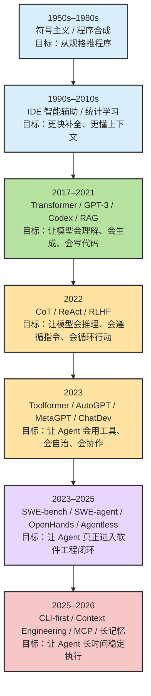
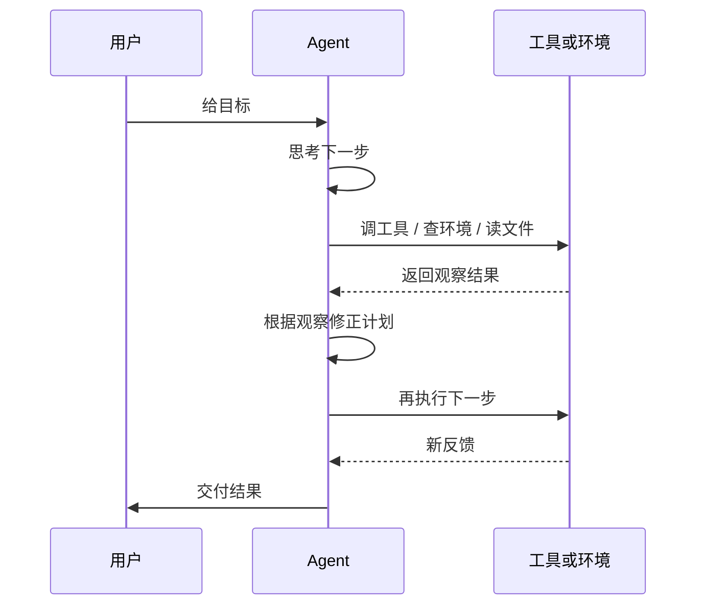
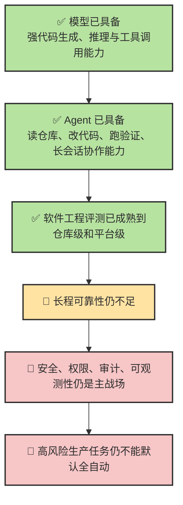

# Chapter 13 · 📜 技术简史与当前定位

> 🎯 **目标**：把 Agent 放回完整技术史里看，理解它为什么不是“突然出现的新物种”，而是程序合成、IDE 智能辅助、LLM、推理、工具调用、评测基准、系统工程化一路叠加的结果。本章会比前几章更像“收束章”：不是导购，不是热点点评，而是帮你建立一条足够稳定的历史主线。

## 目录

- [1. 🗺️ 两层时间线：长前史 + ChatGPT 之后](#1-️-两层时间线长前史--chatgpt-之后)
- [2. 🏛️ 前史：Agent 之前，业界怎样尝试“让机器写程序”](#2-️-前史agent-之前业界怎样尝试让机器写程序)
- [3. 🚀 2020–2022：条件成熟期，LLM 开始具备 Agent 前体能力](#3--20202022条件成熟期llm-开始具备-agent-前体能力)
- [4. 🔥 2022–2024：ChatGPT 之后，Coding Agent 爆发的五条主线](#4--20222024chatgpt-之后coding-agent-爆发的五条主线)
- [5. 🧪 软件工程化：为什么主战场从 HumanEval 迁移到 SWE-bench](#5--软件工程化为什么主战场从-humaneval-迁移到-swe-bench)
- [6. 🧰 产品形态重排：IDE、CLI、Computer Use、云端代理](#6--产品形态重排ideclicomputer-use云端代理)
- [7. 🧠 2025–2026：终端原生、上下文工程、MCP 与 CLI 辩论](#7--20252026终端原生上下文工程mcp-与-cli-辩论)
- [8. 📍 到 2026 年 3 月，我们到底处在什么阶段](#8--到-2026-年-3-月我们到底处在什么阶段)
- [📌 本章总结](#-本章总结)
- [附录 A：AI_Agent_Programming_Evolution_Report 论文列表整理版](#附录-aai_agent_programming_evolution_report-论文列表整理版)

---

> 📌 **阅读方式**：这一章最重要的不是背产品名，而是建立四个判断框架：
>
> 1. Agent 的演化是“研究路线 + 工程路线”双线并进，不只是模型变强。  
> 2. 真正改变行业的，不是某个 demo 火了，而是“可验证、可复现、可接工具”的闭环成熟。  
> 3. 从 2024 年开始，决定上限的往往不再是“模型会不会写”，而是“系统能不能稳”。  
> 4. 到 2026 年 3 月，主流 Agent 已经进入“很好用”，但还没进入“高风险全自动可信”。

## 1. 🗺️ 两层时间线：长前史 + ChatGPT 之后

如果只看 2023–2026，你会觉得 Agent 演化很突然；如果把时间拉长到 1950s 之后，就会看到它其实是两层时间线叠在一起：

### 两层时间线分别在回答什么问题

| 层次 | 核心问题 | 代表关键词 |
|------|----------|-----------|
| **长前史** | 机器能不能“自己写程序” | 程序合成、逻辑推理、IDE 辅助、统计语言模型 |
| **LLM 时代** | 模型能不能“理解意图并生成代码” | Transformer、GPT-3、Codex、RAG、RLHF |
| **Agent 时代** | 系统能不能“接任务并闭环执行” | ReAct、Tool Use、SWE-bench、ACI、CLI Agent、Context Engineering |

### 一句最重要的判断

> 🔑 **Agent 不是单一技术名词，而是一个系统组合词。**
>
> 它至少包含：**模型能力 + 工具接口 + 控制循环 + 记忆机制 + 执行环境 + 验证闭环 + 权限边界**。

---

## 2. 🏛️ 前史：Agent 之前，业界怎样尝试“让机器写程序”

### 3.1 符号主义与程序合成：最早的“自动编程”想象

如果把 Agent 理解为“把人类意图转换成可执行程序的系统”，那它的祖先并不是 Copilot，而是更早的**程序合成（Program Synthesis）**和**符号主义 AI**。

在 1950s–1980s 这条线上，研究者的核心思路不是“从海量数据中学”，而是：

- 先把问题形式化为逻辑规则或规格说明。
- 再通过定理证明、归结、递归推导等方式构造程序。

典型节点包括：

- **Logic Theorist（1956）**：早期符号推理系统，证明“机器可以按规则解题”。
- **Green（1969）及相关工作**：尝试从逻辑证明中提取程序。
- **Manna & Waldinger（1980）**：把“程序合成”系统化，认为程序推导本质上是定理证明。

这一时期的贡献，不在于它真的生成了今天意义上的复杂软件，而在于它留下了三个非常重要的思想遗产：

1. **目标导向**：不是随机生成代码，而是围绕规格去构造程序。
2. **中间表示**：从自然语言到代码之间，需要一个更结构化的推理层。
3. **闭环推导**：生成程序不是一次吐答案，而是分步骤推出来。

### 3.2 为什么这条路没直接通向今天

程序合成的硬伤也很明显：

- 太依赖**严格形式化规格**，而真实软件需求往往模糊、变化多、充满例外。
- 逻辑推理一旦面对现实系统，就会遇到**组合爆炸**。
- 缺少今天 Agent 需要的“环境交互能力”，也就是读文件、跑命令、看日志、再修。

所以早期合成路线留下的是**思想框架**，但没有留下可以直接接手现代工程工作的系统。

### 3.3 IDE 智能辅助：从“自动写程序”退回到“辅助写程序”

1990s–2010s，工业界更务实的路线是：不追求完全自动写程序，而是先做**开发过程中的智能辅助**。

这条线的代表是：

- **IntelliSense（1990s）**：通过类型信息、语法规则和局部上下文提供补全。
- 之后的**代码搜索、模板补全、统计语言模型补全**：逐渐把“上下文感知”带入 IDE。

这一步很重要，因为它第一次证明了一件事：

> 开发者并不一定需要“一个全自动程序员”，而更需要“一个知道当前上下文、能在正确位置给正确帮助的系统”。

这其实就是今天 IDE Agent 的远祖。

### 3.4 从统计补全到代码语言模型

2010s 后期，随着 GitHub 等代码仓库积累了足够多的数据，研究界开始把代码当作一种“特殊语言”来建模。于是出现了：

- 更强的代码补全模型
- 代码搜索和文档生成模型
- 自然语言与代码联合建模的工作，例如 **CodeBERT**

这一时期的重要意义是：**代码第一次被大规模地当成“可学习语料”而不是纯规则对象**。

---

## 3. 🚀 2020–2022：条件成熟期，LLM 开始具备 Agent 前体能力

Agent 真正开始变得“像今天这样可想象”，不是因为某个代理框架先出现，而是因为 2020–2022 年发生了几件基础能力成熟事件。

### 4.1 Transformer、Scaling、GPT-3：模型终于足够大

这一阶段有三块基础石头：

- **Transformer（2017）**：提供了今天所有大模型的主干架构。
- **Scaling Laws（2020）**：让业界相信“更大模型 + 更多数据 + 更多算力”会持续带来能力增长。
- **GPT-3（2020）**：证明模型可以通过 prompt 在上下文里学习新任务，而不必每次重新训练。

这意味着模型第一次具备了“当场理解任务、当场适配格式”的可能性。

### 4.2 RAG、WebGPT、Codex：会查、会搜、会写代码

如果说 GPT-3 让模型“会说”，那 2020–2021 年的一系列工作让模型开始接近 Agent 所需的外围能力：

- **RAG（2020）**：让模型不再只依赖训练时记忆，而能结合外部知识。
- **WebGPT（2021）**：让模型开始使用浏览器式外部环境。
- **Codex / HumanEval（2021）**：让代码生成第一次有了清晰的主战场和标准评价方式。

从这个时点起，“让模型写代码”开始从 demo 变成可以系统比较的方向。

### 4.3 InstructGPT、CoT、ReAct：会遵循指令，会一步步想，会边想边做

2022 年是 Agent 核心方法开始成形的一年。

最关键的几个节点是：

- **InstructGPT**：通过 RLHF 让模型更能遵循人的意图。
- **Chain-of-Thought（CoT）**：让模型把中间推理显式写出来。
- **Self-Consistency**：让多条推理路径互相校正。
- **Least-to-Most Prompting**：让模型更像在做任务分解。
- **ReAct**：把 reasoning 和 acting 统一到一个交替循环里。

这里面真正把 LLM 推向 Agent 的，不只是“更会推理”，而是 **ReAct 把行动纳入了推理循环**。

> 🔑 **从这一步开始，模型不再只是“生成器”，而变成了“控制循环里的推理引擎”。**

---

## 4. 🔥 2022–2024：ChatGPT 之后，Coding Agent 爆发的五条主线

ChatGPT 在 **2022-11-30** 的意义，不只是“让 LLM 出圈”，更重要的是：

- 它让数亿用户第一次接受“和模型对话本身就是一种操作界面”。
- 它让整个生态把注意力从“模型训练”转向“基于模型构建应用和代理”。

ChatGPT 之后的 Coding Agent 发展，大致沿五条主线同时推进。

### 5.1 主线一：推理显式化，Agent 不再只会一次生成

这一条线的关键词是：

- CoT
- Plan-and-Solve
- Tree of Thoughts
- Graph of Thoughts
- LATS

它们在解决的都是同一个问题：**如果一次生成不够，模型怎么规划、回溯、搜索和比较多条方案？**

| 路线 | 核心思想 | 对 Coding Agent 的意义 |
|------|----------|------------------------|
| **CoT** | 把中间推理显式写出来 | 提升任务拆解能力 |
| **Plan-and-Solve** | 先计划，再执行 | 接近工作流设计 |
| **ToT / GoT** | 把推理看成树或图搜索 | 适合多方案分支与回溯 |
| **LATS** | 把语言模型和树搜索结合 | 让规划、行动、评估更统一 |

这一条线让人逐步意识到：**Agent 的上限不只取决于模型知识量，还取决于它能不能管理自己的思路空间。**

### 5.2 主线二：工具使用，从“会回答”变成“会调用”

如果说 ReAct 给了 Agent 循环，工具使用给了它“手臂”。

这条线的重要节点包括：

- **MRKL、TALM**：早期“模型 + 工具”模块化思路。
- **Toolformer（2023）**：回答“模型怎么学会何时调用工具”。
- **Gorilla、ToolLLM / ToolBench**：大规模 API 调用与工具准确率问题。
- **OpenAI Function Calling（2023-06）**：把结构化工具调用推到主流开发接口层。

这一步完成后，模型就不再只能“说应该怎么做”，而是可以：

- 读文件
- 调 API
- 跑测试
- 访问搜索或知识库
- 让外部执行器完成具体动作

### 5.3 主线三：自治循环、记忆与反思

2023 年开源社区的巨大影响，并不在于那些项目都已经成熟，而在于它们让整个行业第一次看到“自主代理”的公共想象。

代表现象包括：

- **AutoGPT**
- **BabyAGI**
- **Generative Agents**
- **Reflexion**
- **Voyager**

它们分别把几个关键能力推到台前：

| 能力 | 代表工作 | 说明 |
|------|----------|------|
| **任务队列** | BabyAGI | 让系统知道“下一步做什么” |
| **长循环自治** | AutoGPT | 把目标拆成连续执行过程 |
| **记忆与社会性** | Generative Agents | 让 Agent 能记住并相互影响 |
| **自我反思** | Reflexion | 用失败反馈改进下一轮决策 |
| **技能库积累** | Voyager | 把经验沉淀为可复用技能 |

这批工作最大的问题是稳定性不足，但它们证明了一件更重要的事：

> Agent 不只是“带工具的聊天机器人”，而是**可以跨多轮、多工具、多状态运转的系统**。

### 5.4 主线四：多 Agent 协作与组织化

当社区发现单个 Agent 很难同时扮演“产品经理、架构师、工程师、测试、审查者”这么多角色时，多 Agent 协作自然冒了出来。

代表工作有：

- **CAMEL**
- **AutoGen**
- **MetaGPT**
- **ChatDev**
- **Multi-agent Debate**

这一条线的核心贡献，不是让软件突然自动开发完成，而是把“**组织结构也可以被编排**”这件事摆上了台面。

它带来的几个启发是：

1. 角色分工可以提高局部质量。
2. 互评、辩论、审查可以减少部分幻觉。
3. 软件工程不仅是生成代码，更是需求、设计、实现、验证、交付的整条流水线。

但到今天为止，多 Agent 真正稳定的落点，依然主要是：

- 并行探索
- 角色分工
- 审查互检
- 长任务拆片

而不是“模拟一家完整公司就一定比单 Agent 更强”。

### 5.5 主线五：软件工程化，研究目标从编程题转向仓库级任务

这是最关键、也最容易被忽视的一条线。

过去讨论 AI 编码，常用的是：

- `HumanEval`
- `MBPP`
- 各类单函数生成题

这些基准能测的是：**模型会不会根据描述写出一个函数**。

但真实软件工程要解决的是：

- 在一个大仓库里找到该改哪里
- 理解 issue 和历史上下文
- 生成跨文件 patch
- 跑测试验证
- 处理失败日志并继续修

所以从 **SWE-bench** 开始，整个主战场变了。

---

## 5. 🧪 软件工程化：为什么主战场从 HumanEval 迁移到 SWE-bench

### 6.1 评测目标变了：从“会写函数”到“会修真实仓库”

| 维度 | HumanEval 一类基准 | SWE-bench 一类基准 |
|------|-------------------|--------------------|
| **任务对象** | 单函数 / 小程序 | 真实 GitHub 仓库 issue |
| **上下文规模** | 很小 | 仓库级 |
| **动作类型** | 生成代码 | 定位、搜索、编辑、执行、验证 |
| **成功标准** | 单元测试过 | 真实仓库任务被修复并通过验证 |
| **难点** | 代码合成 | 仓库理解、长程规划、环境交互 |

这一迁移意味着业界终于承认：

> 真正的 Coding Agent 问题，不是“代码写得像不像”，而是“能不能在真实环境里把事情做成”。

### 6.2 SWE-agent：ACI 证明“接口设计本身就是能力”

SWE-agent 的重要性，不只是它在榜单上做得不错，而是它提出了 **ACI（Agent-Computer Interface）** 这个关键概念：

- 传统 shell、IDE、日志输出是为人设计的，不一定适合 LLM。
- 如果给 Agent 一个更适合它的检索、打开、编辑、执行接口，它的成功率会显著提高。

ACI 的思想非常朴素，但影响极大：

1. 不是所有“给模型一个终端”都一样。
2. 工具越多不一定越好，**动作空间设计**同样重要。
3. 把环境压缩成模型易消费的结构化观察，是系统工程核心。

### 6.3 OpenHands：平台化意味着“策略层”和“执行层”开始分离

OpenHands（原 OpenDevin）的意义，是把 Coding Agent 从“单个 prompt 技巧”推进到“平台化执行环境”：

- 有沙盒
- 有终端
- 有浏览器
- 有工作区
- 有人机协作接口
- 有基准接入能力

从这一类系统开始，大家逐渐接受一个事实：

> **Coding Agent = 模型 × 工具 × 环境 × 评测 × 运维**  
> 不再只是“一个会写代码的聊天窗口”。

### 6.4 Agentless：给行业降温的重要强基线

Agentless 的贡献特别值得记，因为它对整个社区起到了“去神话”的作用。

它告诉大家：

- 很多看起来像“Agent 很强”的结果，可能只是因为**定位做得更好**。
- 复杂的自治循环，并不总是比“定位 → 修复 → 验证”三阶段更划算。
- 在软件工程里，**简单、可控、低成本**有时比“更像智能体”更重要。

这也是为什么今天讨论 Agent 架构时，成熟团队都会问一句：

> 这里真的需要一个自由循环 Agent，还是一个更固定、更可审计的 pipeline 就够了？

### 6.5 新一轮评测：SWE-bench-Live、SWE-EVO、MemCoder 在提示什么

随着老基准逐渐被刷榜，新的问题开始出现：

- 数据污染
- 过拟合静态 benchmark
- 只会修短任务，不会做长程演进

于是后续工作开始补这几个方向：

- **SWE-bench-Live**：让基准持续更新，降低“死刷题”的问题。
- **SWE-EVO**：关注长程软件演进，而不是单次 issue 修复。
- **MemCoder**：关注 Agent 如何把历史提交与成功经验沉淀为结构化记忆。

这说明行业正在从“能不能做一次”转向“能不能长期做、越做越像团队内部系统”。

---

## 6. 🧰 产品形态重排：IDE、CLI、Computer Use、云端代理

研究路线会不断分叉，但最后会沉淀成用户真正能感知的产品形态。

### 7.1 IDE 内 Agent：最自然，但天花板也最明显

IDE 内形态的优势：

- 离写代码动作最近
- 反馈快
- 适合边写边问、边改边补

但它的天然限制也很明显：

- 很难完整接管终端工作流
- 上下文常偏局部
- “会补全”和“会完成任务”不是一回事

### 7.2 CLI / Terminal Agent：为什么 2025 之后会突然重要

终端 Agent 之所以成为主线，不是因为命令行更酷，而是因为它天然拥有三样真实工程环境中的关键能力：

1. **直接面对代码库**
2. **直接调用工具链**
3. **直接运行验证命令**

这意味着 CLI Agent 更容易形成完整闭环：

- 读仓库
- 搜索和编辑
- 执行命令
- 看失败输出
- 继续修复

这也是为什么 2025 之后，大家讨论重点从“补全好不好”逐步转向“能不能稳稳跑完一段工作流”。

### 7.3 Computer Use / GUI Agent：没有 API 也要能做事

2024–2025 开始，另一个重要分支是 **Computer Use / GUI Agent**。

它解决的是这样的问题：

- 现实里有大量系统没有合适 API
- 就算有 API，也未必容易接
- 人类很多工作本来就是“看屏幕、点按钮、复制粘贴、操作软件”

所以 GUI Agent 的意义不在于“它更高级”，而在于它扩大了 Agent 的作用边界：

- 不只在 API 世界里工作
- 也能进入软件操作层

但它目前的缺点同样明显：

- 慢
- 脆
- 难调试
- 安全边界更复杂

### 7.4 云端 / 异步代理：从“副驾驶”到“委派执行”

云端代理的优势是：

- 可以异步跑长任务
- 可以并行委派
- 更适合和 PR、Issue、CI、代码托管平台结合

但云端代理的问题是：

- 可见性更差
- 调试成本更高
- 权限治理更复杂
- 和本地真实开发状态的同步总是麻烦

### 7.5 形态变化背后的真正范式转移

| 旧范式：AI 辅助编程 | 新范式：Agentic Workflow |
|-------------------|-------------------------|
| 补全、解释、回答 | 接任务、读仓库、改代码、跑验证 |
| 局部交互 | 多步任务闭环 |
| 重点看模型输出 | 重点看系统工程与可靠性 |
| 人负责执行，AI 负责建议 | 人负责目标、约束、验收，AI 负责执行大段中间工作 |

---

## 7. 🧠 2025–2026：终端原生、上下文工程、MCP 与 CLI 辩论

到了 2025–2026，Coding Agent 的讨论重点进一步从“能不能做”转向“能不能持续做、低成本做、可治理地做”。

### 8.1 从 Prompt Engineering 到 Context Engineering

早期大家优化的是 prompt 本身，现在越来越多团队优化的是：

- 哪些上下文该放进来
- 哪些历史该压缩
- 哪些工具 schema 该延迟加载
- 哪些记忆该跨会话保留
- 哪些失败轨迹应该沉淀为经验

这就是 **Context Engineering**。

它的重要性在于，很多 Agent 的失败不是因为“不会推理”，而是因为：

- 上下文装错了
- 历史太长被污染了
- 动态内容把静态前缀冲散了
- 工具太多，schema 膨胀了
- 本该记住的经验没留住

### 8.2 为什么 MCP 会出现

当工具生态越来越多时，每个 Agent 都自己连 GitHub、Slack、Jira、数据库、浏览器、文件系统，会遇到严重碎片化。

MCP 想解决的是：

- **统一连接方式**
- **降低 N×M 集成复杂度**
- **让工具和上下文资源更像“标准外设”**

所以 MCP 的历史意义主要是**基础设施标准化**，不是“让 Agent 更聪明”。

### 8.3 为什么又出现了 CLI vs MCP 的工程辩论

下载目录里的报告特别强调了一个 2025–2026 的工程讨论：**MCP 很重要，但在某些工程任务里，CLI 依旧极强**。

原因不难理解：

| 维度 | MCP | CLI |
|------|-----|-----|
| **适用问题** | 工具生态标准化、跨系统连接 | 终端任务、顺序执行、快速恢复 |
| **优势** | 统一接口、可组合资源、扩展方便 | 简洁、成熟、无状态、可管道化 |
| **问题** | schema 膨胀、上下文占用、实现碎片化 | 需要命令行环境，抽象层较低 |

真正成熟的观点不是“二选一”，而是：

> **MCP 是工具连接标准，CLI 是高价值执行界面。**  
> 在 Coding Agent 里，这两者经常不是替代关系，而是互补关系。

### 8.4 Bounded Autonomy：企业真正关心的不是更强，而是别出事

Agent 一旦开始真正读写文件、执行命令、操作外部系统，核心问题就从“会不会做”变成“出了事怎么办”。

所以 2025–2026 里一个很重要的工程观念是 **Bounded Autonomy（边界化自治）**：

- 低风险动作自动执行
- 高风险动作必须上报审批
- 每一步都可追踪、可回放、可审计
- 权限越高的动作，护栏越重

这也是为什么今天主流 Agent 产品几乎都在强调：

- 沙盒
- 权限确认
- diff 审阅
- 命令白名单或风险分类
- 工具调用日志

---

## 8. 📍 到 2026 年 3 月，我们到底处在什么阶段

如果把长前史、研究线、工程线都合在一起，2026 年 3 月的定位可以概括为下面这张图：

### 9.1 已经比较稳定的能力

| 类型 | 今天主流 Coding Agent 普遍已经能做到 |
|------|------------------------------------|
| **代码库导航** | 找入口、找调用链、做局部理解 |
| **局部实现** | 在明确上下文下完成函数、模块、小功能 |
| **模式化修改** | 批量重构、重命名、统一风格、补文档 |
| **验证闭环** | 跑测试、看错误、修补丁、再重试 |
| **任务协作** | 在 IDE、CLI、PR、Issue、CI 中承担部分执行角色 |

### 9.2 仍然不该过度信任的能力

| 类型 | 原因 |
|------|------|
| **高判断架构决策** | 需要长期业务背景和组织权衡 |
| **复杂性能工程** | 必须依赖真实运行时与监控信号 |
| **生产发布 / 回滚** | 权限高、后果不可逆、外部依赖多 |
| **复杂数据迁移** | 一旦误操作，恢复代价极高 |
| **跨多天的大型演进任务** | 容易出现上下文漂移、策略偏航、隐性假设缺失 |

### 9.3 最准确的一句话定位

> 我们已经进入“Agent 很有用、足以改变开发流程”的阶段，  
> 但还没有进入“Agent 可以在高风险生产环境里默认全自动接管”的阶段。

### 9.4 为什么这一章对前面章节有解释力

读完整条历史线，再回看本教程前面的内容，你会更清楚：

- 为什么我们反复强调**先探索上下文，再动手改代码**
- 为什么 `Ch06` 和 `Ch12` 会不断强调**验证、审查、验收**
- 为什么 `Ch07`、`Ch08`、`Ch11` 会强调**prompt、session、memory、design pattern**
- 为什么 `Ch09`、`Ch10` 会强调**工程化协作与权限边界**

因为今天有效的 Agent 用法，本质上就是对这条技术史做出的工程回应。

---

## 📌 本章总结

| 核心概念 | 一句话总结 |
|----------|-----------|
| **长前史** | Agent 的祖先不是 Copilot，而是程序合成、IDE 智能辅助和代码统计建模 |
| **LLM 前体能力** | Transformer、GPT-3、Codex、RAG、RLHF 让模型第一次具备“可被编排”的基础能力 |
| **关键研究主线** | 推理、工具、记忆、搜索、多 Agent、评测这几条线共同塑造了今天的 Agent |
| **软件工程化转折** | 从 HumanEval 到 SWE-bench，意味着问题从“会写代码”变成“会在真实仓库里把事做成” |
| **产品形态** | IDE Agent、CLI Agent、GUI Agent、云端代理分别占据不同工作流位置 |
| **当前定位** | 能力够用，但可靠性、治理、可观测性仍远未终局 |

### 新人现在应该记住的三件事

1. 看 Agent 历史，先看**方法论与系统能力**，不要先看产品热度。
2. 评价一个 Agent，先问它有没有**工具闭环、验证闭环、权限边界**。
3. 真正改变工作流的不是“更会写”，而是“更会在真实环境里连续把事情做完”。

### 三条核心原则

> 🔑 **记时间线，不如记拐点**  
> 真正重要的是从“生成”到“执行”、从“补全”到“工作流”的转折。
>
> 🔑 **能力增强不等于工程成熟**  
> 模型会做，和系统能稳定做对，是两回事。
>
> 🔑 **Agent 的终局不是更像聊天，而是更像可审计的工程系统**  
> 未来竞争焦点一定越来越偏向上下文管理、验证、权限、日志和标准化接口。

---

## 附录 A：AI_Agent_Programming_Evolution_Report 论文列表整理版

> 下面这份清单根据 `AI_Agent_Programming_Evolution_Report.md` 的原始分类整理。为方便本教程阅读，我保留了**类别、题名、年份、核心意义**四列，去掉了引用数与部分扩展说明。它不是“唯一正确书单”，但足够作为这一章的检索索引。

### A.1 基础模型与预训练范式（2017–2021）

| 序号 | 论文 | 年份 | 核心意义 |
|------|------|------|----------|
| 1 | Attention Is All You Need | 2017 | Transformer 基础架构 |
| 2 | Scaling Laws for Neural Language Models | 2020 | 说明规模化训练的收益规律 |
| 3 | Language Models are Few-Shot Learners (GPT-3) | 2020 | 把 in-context learning 推到主流 |
| 4 | Retrieval-Augmented Generation for Knowledge-Intensive NLP Tasks | 2020 | RAG 基础范式 |
| 5 | Evaluating Large Language Models Trained on Code (Codex) | 2021 | 代码大模型与 HumanEval 基准 |
| 6 | WebGPT: Browser-assisted Question-answering with Human Feedback | 2021 | Web Agent 先驱 |

### A.2 推理机制与指令对齐（2022）

| 序号 | 论文 | 年份 | 核心意义 |
|------|------|------|----------|
| 7 | Chain-of-Thought Prompting Elicits Reasoning in Large Language Models | 2022 | 思维链提示 |
| 8 | Self-Consistency Improves Chain of Thought Reasoning in Language Models | 2022 | 多路径自洽解码 |
| 9 | Large Language Models are Zero-Shot Reasoners | 2022 | 零样本推理激活 |
| 10 | Least-to-Most Prompting Enables Complex Reasoning in Large Language Models | 2022 | 任务分解式推理 |
| 11 | Training Language Models to Follow Instructions with Human Feedback (InstructGPT) | 2022 | RLHF 指令对齐 |
| 12 | Constitutional AI: Harmlessness from AI Feedback | 2022 | RLAIF / 自我批评对齐 |
| 13 | ReAct: Synergizing Reasoning and Acting in Language Models | 2022 | 现代 Agent 基础循环 |
| 14 | MRKL Systems: A Modular, Neuro-symbolic Architecture | 2022 | 模块化工具体系雏形 |
| 15 | TALM: Tool Augmented Language Models | 2022 | 工具增强语言模型 |
| 16 | Inner Monologue: Embodied Reasoning through Planning with Language Models | 2022 | 具身规划中的环境反馈 |
| 17 | Do As I Can, Not As I Say (SayCan) | 2022 | 语言到机器人动作接地 |
| 18 | Code as Policies: Language Model Programs for Embodied Control | 2022 | 代码即行动策略 |
| 19 | Program of Thoughts Prompting | 2022 | 程序化中间推理 |
| 20 | Selection-Inference | 2022 | 可解释逻辑推理分解 |
| 21 | Direct Preference Optimization (DPO) | 2023 | 更简洁的偏好优化 |

### A.3 工具使用与自主 Agent 爆发（2023）

| 序号 | 论文 | 年份 | 核心意义 |
|------|------|------|----------|
| 22 | Toolformer: Language Models Can Teach Themselves to Use Tools | 2023 | 自监督学习工具调用 |
| 23 | Augmented Language Models: a Survey | 2023 | 工具、检索、推理增强综述 |
| 24 | GPT-4 Technical Report | 2023 | 强能力模型推动 Agent 实用化 |
| 25 | HuggingGPT: Solving AI Tasks with ChatGPT and its Friends in Hugging Face | 2023 | LLM 作为控制器编排专家模型 |
| 26 | Visual ChatGPT: Talking, Drawing and Editing with Visual Foundation Models | 2023 | 多模态工具编排 |
| 27 | Reflexion: Language Agents with Verbal Reinforcement Learning | 2023 | 反思与语言记忆 |
| 28 | Self-Refine: Iterative Refinement with Self-Feedback | 2023 | 迭代自反馈优化 |
| 29 | Tree of Thoughts: Deliberate Problem Solving with Large Language Models | 2023 | 树搜索式推理 |
| 30 | Graph of Thoughts: Solving Elaborate Problems with Large Language Models | 2023 | 图搜索式推理 |
| 31 | PAL: Program-Aided Language Models | 2023 | 让程序执行承担推理计算 |
| 32 | ART: Automatic Multi-step Reasoning and Tool-use for Large Language Models | 2023 | 自动化多步推理与工具使用 |
| 33 | Generative Agents: Interactive Simulacra of Human Behavior | 2023 | 记忆、反思、规划的社会模拟 |
| 34 | Voyager: An Open-Ended Embodied Agent with Large Language Models | 2023 | 具身终身学习与技能库 |
| 35 | Gorilla: Large Language Model Connected with Massive APIs | 2023 | API 调用准确率与工具连接 |
| 36 | ToolLLM: Facilitating Large Language Models to Master 16000+ Real-world APIs | 2023 | 大规模 API 工具学习 |
| 37 | Tool Learning with Foundation Models | 2023 | 工具学习综述 |
| 38 | Large Language Models as Tool Makers (LATM) | 2023 | LLM 不只会用工具，也会造工具 |
| 39 | CREATOR: Disentangling Abstract and Concrete Reasonings through Tool Creation | 2023 | 通过工具创建提升能力 |
| 40 | Language Agent Tree Search Unifies Reasoning Acting and Planning (LATS) | 2023 | MCTS 与语言代理结合 |
| 41 | Plan-and-Solve Prompting | 2023 | 先规划后执行 |
| 42 | Describe, Explain, Plan and Select (DEPS) | 2023 | 交互式规划框架 |
| 43 | ReWOO: Decoupling Reasoning from Observations for Efficient Augmented Language Models | 2023 | 推理与观察解耦 |
| 44 | SwiftSage: A Generative Agent with Fast and Slow Thinking | 2023 | 快慢思维 Agent 架构 |
| 45 | FunSearch: Mathematical Discoveries from Program Search with LLMs | 2023 | 程序搜索驱动发现 |
| 46 | FireAct: Toward Language Agent Fine-tuning | 2023 | 面向 Agent 能力的微调 |

### A.4 多 Agent 协作与软件工程基准（2023–2024）

| 序号 | 论文 | 年份 | 核心意义 |
|------|------|------|----------|
| 47 | CAMEL: Communicative Agents for "Mind" Exploration of Large Language Model Society | 2023 | 角色扮演式通信代理 |
| 48 | MetaGPT: Meta Programming for A Multi-Agent Collaborative Framework | 2023 | SOP 驱动的软件团队模拟 |
| 49 | ChatDev: Communicative Agents for Software Development | 2023 | 对话链驱动的 SDLC |
| 50 | AutoGen: Enabling Next-Gen LLM Applications via Multi-Agent Conversation | 2023 | 多代理对话编排框架 |
| 51 | Improving Factuality and Reasoning through Multiagent Debate | 2023 | 代理辩论提升质量 |
| 52 | AgentBench: Evaluating LLMs as Agents | 2023 | 多环境 Agent 基准 |
| 53 | SWE-bench: Can Language Models Resolve Real-World GitHub Issues? | 2023 | 仓库级软件工程黄金基准 |
| 54 | WebArena: A Realistic Web Environment for Building Autonomous Agents | 2023 | 真实 Web 环境基准 |
| 55 | A Survey on Large Language Model based Autonomous Agents | 2023 | Brain-Perception-Action 综述 |
| 56 | TaskWeaver: A Code-First Agent Framework | 2023 | 代码优先的 Agent 框架 |

### A.5 编码 Agent 与推理扩展（2024）

| 序号 | 论文 | 年份 | 核心意义 |
|------|------|------|----------|
| 57 | Executable Code Actions Elicit Better LLM Agents (CodeAct) | 2024 | 用可执行代码统一动作空间 |
| 58 | SWE-agent: Agent-Computer Interfaces Enable Automated Software Engineering | 2024 | ACI 与自动化软件工程 |
| 59 | Agentless: Demystifying LLM-based Software Engineering Agents | 2024 | 非自治强基线，反思复杂度 |
| 60 | OpenHands: An Open Platform for AI Software Developers as Generalist Agents | 2024 | 通用软件开发 Agent 平台 |
| 61 | OSWorld: Benchmarking Multimodal Agents for Open-Ended Tasks in Real Computer Environments | 2024 | 真实操作系统环境基准 |
| 62 | Scaling LLM Test-Time Compute Optimally Can be More Effective than Scaling Model Parameters | 2024 | Test-time compute 理论基础 |
| 63 | Self-Discover: Large Language Models Self-Compose Reasoning Structures | 2024 | 自主发现推理结构 |
| 64 | Mixture-of-Agents Enhances Large Language Model Capabilities | 2024 | 多模型协作方法 |
| 65 | Large Language Model based Multi-Agents: A Survey of Progress and Challenges | 2024 | 多 Agent 进展综述 |
| 66 | The Dawn of GUI Agent: A Preliminary Case Study with Claude 3.5 Computer Use | 2024 | GUI Agent 初步研究 |
| 67 | AgentTuning: Enabling Generalized Agent Abilities for LLMs | 2023 | 面向 Agent 能力的微调 |

### A.6 最新前沿：推理模型、上下文工程与终端 Agent（2025–2026）

| 序号 | 论文或报告 | 年份 | 核心意义 |
|------|------------|------|----------|
| 68 | Learning to Reason with LLMs (OpenAI o1) | 2024 | 推理模型与长思考范式 |
| 69 | DeepSeek-R1: Incentivizing Reasoning Capability in LLMs via Reinforcement Learning | 2025 | 纯 RL 推理能力路线 |
| 70 | Prompt Repetition Improves Non-Reasoning LLMs | 2025 | 提示词重复提升准确率 |
| 71 | Building Effective Agents | 2024 | 面向实践的 Agent 构建指南 |
| 72 | Building Effective AI Coding Agents for the Terminal (OpenDev) | 2026 | 终端原生 Agent 架构总结 |
| 73 | The Rise and Potential of Large Language Model Based Agents: A Survey | 2023 | 大规模 Agent 综述 |

### 如果你只读 12 篇，建议先读这 12 篇

1. Attention Is All You Need
2. Language Models are Few-Shot Learners
3. Evaluating Large Language Models Trained on Code
4. Chain-of-Thought Prompting Elicits Reasoning in Large Language Models
5. ReAct: Synergizing Reasoning and Acting in Language Models
6. Toolformer: Language Models Can Teach Themselves to Use Tools
7. Reflexion: Language Agents with Verbal Reinforcement Learning
8. Tree of Thoughts: Deliberate Problem Solving with Large Language Models
9. SWE-bench: Can Language Models Resolve Real-World GitHub Issues?
10. SWE-agent: Agent-Computer Interfaces Enable Automated Software Engineering
11. Agentless: Demystifying LLM-based Software Engineering Agents
12. OpenHands: An Open Platform for AI Software Developers as Generalist Agents

---

[📚 返回目录](../../README.md#tutorial-contents) | [⬅️ 上一章：Ch12 质量保障与验收](./ch12-code-review.md) | [➡️ 下一章：Part IV 进阶专题](../topics/)

