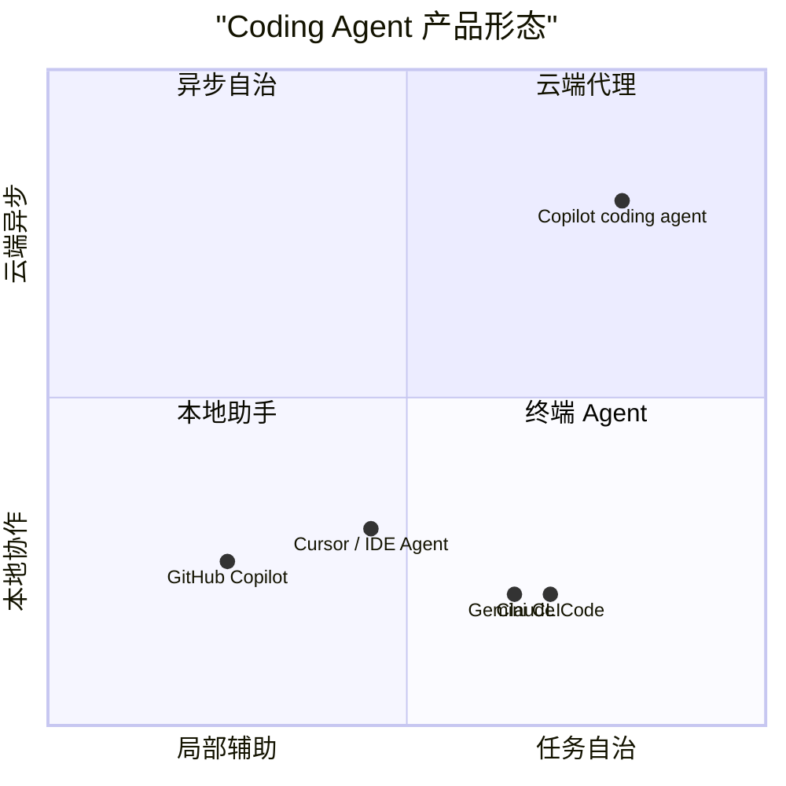

# Chapter 13 · 📜 技术简史与当前定位

> 🎯 **目标**：建立 Agent 技术的时间线认知，理解从“代码补全”到“持续执行”这条演进路线，以及我们在 2026 年 3 月到底处于什么阶段。本章刻意聚焦**技术演进、产品形态、能力边界**，把职业冲击和产业判断留到 Part VI。

## 目录

- [1. ⏳ 从自动补全到自主代理：六阶段演进](#1-从自动补全到自主代理六阶段演进)
- [2. 🗓️ 关键拐点：可稳定落锚的官方时间线](#2-️-关键拐点可稳定落锚的官方时间线)
- [3. 🧭 产品形态变化：IDE、CLI、云端代理](#3--产品形态变化idecli云端代理)
- [4. 🔄 从 Copilot 到 Agentic Workflow：范式转变](#4--从-copilot-到-agentic-workflow范式转变)
- [5. 📍 当前能力边界：已经能做什么，还不能做什么](#5--当前能力边界已经能做什么还不能做什么)
- [📌 本章总结](#-本章总结)

---

## 1. ⏳ 从自动补全到自主代理：六阶段演进

过去几年最重要的变化，不是模型“变聪明了一点”，而是 AI 能做的事情不断从**说**，扩展到**查**、**调工具**、**多步执行**、**操作电脑**，再到**长时运行的代理系统**。

```mermaid
flowchart LR
    S0(["🗣️ 阶段 0<br/>会说话<br/>2020–2022"]) --> S1(["🔍 阶段 1<br/>会查资料<br/>2022–2023"])
    S1 --> S2(["🔧 阶段 2<br/>会用工具<br/>2023–2024"])
    S2 --> S3(["📋 阶段 3<br/>会规划执行<br/>2023–2024"])
    S3 --> S4(["🖥️ 阶段 4<br/>会操作电脑<br/>2024–2025"])
    S4 --> S5(["🤖 阶段 5<br/>持续自主执行<br/>2025–2026"])

    style S0 fill:#2d2d2d,stroke:#61dafb
    style S1 fill:#2d2d2d,stroke:#61dafb
    style S2 fill:#2d2d2d,stroke:#98c379
    style S3 fill:#2d2d2d,stroke:#e5c07b
    style S4 fill:#2d2d2d,stroke:#c678dd
    style S5 fill:#2d2d2d,stroke:#e06c75
```

### 六个阶段分别解决了什么问题

| 阶段 | 核心突破 | 还不够的地方 |
|------|---------|-------------|
| **阶段 0：会说话** | LLM 能自然对话、能写代码片段 | 只能给建议，不能行动 |
| **阶段 1：会查资料** | RAG / 联网搜索降低知识截止问题 | 仍然主要停留在“回答” |
| **阶段 2：会用工具** | 模型能输出结构化调用指令 | 多数还是单步调用 |
| **阶段 3：会规划执行** | 能把目标拆成多步并循环执行 | 长任务稳定性仍不足 |
| **阶段 4：会操作电脑** | 没有 API 时也能通过 GUI 工作 | 稳定性、安全性、速度都有限 |
| **阶段 5：持续自主执行** | 终端 Agent / 云端代理开始接管完整任务流 | 可靠性、权限治理、可观测性仍是核心难点 |

> 🔑 **关键认知**：Agent 不是某一天突然出现的“新物种”，而是工具调用、规划执行、上下文工程和系统编排叠加后的结果。

---

## 2. 🗓️ 关键拐点：可稳定落锚的官方时间线

这一节只保留**能用官方来源落锚**的节点，避免把短期数据、社区传闻和长期方法论混在一起。

| 时间 | 事件 | 为什么重要 | 官方来源 |
|------|------|-----------|---------|
| **2022-06** | GitHub Copilot GA | AI 编码从技术预览走向大众产品，价格也开始标准化 | [GitHub Blog](https://github.blog/news-insights/product-news/github-copilot-is-generally-available-to-all-developers/) |
| **2023-06** | OpenAI Function Calling 发布 | “调用工具”成为标准能力，Agent 从此不只是文本生成器 | [OpenAI](https://openai.com/index/function-calling-and-other-api-updates/) |
| **2024-05** | Anthropic Tool Use 进入主流开发者工作流 | Claude 体系正式把工具调用推入开发者工作流 | [Anthropic Docs](https://docs.anthropic.com/en/docs/agents-and-tools/tool-use/overview) |
| **2024-08** | Anthropic Prompt Caching 发布 | 长上下文、多轮编码和长任务成本显著下降 | [Anthropic](https://www.anthropic.com/news/prompt-caching) |
| **2024-10** | Anthropic Computer Use Beta | Agent 从 API 层进入 GUI 操作层 | [Anthropic](https://www.anthropic.com/research/developing-computer-use) |
| **2025-05** | Claude Code 随 Claude 4 进入 GA | 终端原生 Coding Agent 成为主流产品形态 | [Anthropic](https://www.anthropic.com/news/claude-4) |
| **2025-05** | GitHub Copilot coding agent 首次发布 | 异步云端代理成为主流路线之一 | [GitHub Blog](https://github.blog/news-insights/product-news/github-copilot-meet-the-new-coding-agent/) |
| **2025-06** | Gemini CLI 发布 | Google 正式进入终端 Agent 赛道 | [Google Blog](https://blog.google/innovation-and-ai/products/google-ai-updates-june-2025/) |
| **2025-09** | GitHub Copilot coding agent 在 GitHub 体系内进入更广泛可用阶段 | 云端代理从概念演示走向日常协作形态 | [GitHub Docs](https://docs.github.com/copilot/concepts/agents/coding-agent/about-coding-agent) |

### 为什么这些节点值得记

它们基本对应了三次范式转折：

1. **2022**：AI 编码从“实验”变成“产品”。
2. **2023-2024**：AI 从“回答”变成“会调工具、会跑流程”。
3. **2025**：AI 从“辅助开发者”进一步变成“在终端或云端执行任务的代理”。

> 📌 **刻意省略**：ARR、Stars、岗位变化、开发者偏好评分等高时效指标，不放在本章，统一留到 Part VI。

---

## 3. 🧭 产品形态变化：IDE、CLI、云端代理

技术演进最终会沉淀成产品形态。对开发者最重要的，不是记住所有产品名，而是看懂它们分别把 Agent 放在什么位置。

### 三种主流形态

| 形态 | 代表体验 | 优点 | 局限 |
|------|---------|------|------|
| **IDE 内辅助** | 边写边补全、边改边问 | 反馈快、适合局部修改 | 很难接管完整工作流 |
| **CLI / Terminal Agent** | 在仓库里读文件、改代码、跑测试 | 更接近真实开发环境，适合多步任务 | 权限控制和上下文管理要求更高 |
| **云端 / 异步代理** | 指派任务、后台执行、回 PR | 适合并行委派和长任务 | 可见性、调试性和权限治理更复杂 |

### 为什么 CLI 会成为关键形态

终端环境天然连接了真实开发工作流里最重要的三样东西：

1. **代码库本身**
2. **命令行工具链**
3. **可执行的验证命令**

这也是为什么 2025 年后，大家讨论的重心从“哪个 IDE 补全更强”逐步转向“哪个 Agent 更会读仓库、跑测试、管会话、控权限”。

---

## 4. 🔄 从 Copilot 到 Agentic Workflow：范式转变

最值得记住的，不是某个产品什么时候发布，而是**开发范式怎么变了**。

| 维度 | 旧范式：AI 辅助编程 | 新范式：Agentic Workflow |
|------|-------------------|-------------------------|
| **AI 角色** | 补全、解释、生成片段 | 接任务、读仓库、改代码、跑验证 |
| **人的角色** | 亲手写代码，顺带用 AI | 设目标、给边界、做验收、裁决风险 |
| **交互粒度** | 行 / 函数 / 小片段 | 功能 / PR / 多步任务 |
| **核心竞争点** | 模型输出是否聪明 | 系统工程是否可靠 |
| **主要瓶颈** | 写得慢 | 审得慢、验得慢、管不好权限 |

### 旧范式的问题

旧的 Copilot 式工作流解决的是“局部写代码更快”，但没有解决：

- 任务如何拆解
- 上下文如何持续管理
- 如何证明生成结果正确
- 多步骤流程如何稳定闭环

### 新范式真正多出来的能力

新一代 Agent 工作流至少要能做四件事：

1. **先理解仓库，而不是只生成片段**
2. **把任务拆成步骤，而不是一次吐完整答案**
3. **调用工具与运行验证，而不是只说“应该可以”**
4. **在权限边界内执行，而不是获得无限制控制**

> 🔑 **结论**：从 2025 年开始，“Coding Agent”讨论的重点已经不是“补全好不好用”，而是“能不能接管一段真实工作流，同时不把仓库搞坏”。

---

## 5. 📍 当前能力边界：已经能做什么，还不能做什么

到 2026 年 3 月，主流 Coding Agent 已经很有用，但远远没有到“完全自主可靠”的阶段。

### 已经比较擅长的事

| 类型 | 说明 |
|------|------|
| **局部实现** | 在明确上下文下完成函数、模块、小型功能 |
| **测试与文档** | 补单测、补说明、写 PR 描述、整理规范 |
| **代码库导航** | 回答“入口在哪”“谁调用谁”“这个模块做什么” |
| **模式化重构** | 重命名、提取公共逻辑、统一风格 |
| **有验证闭环的任务** | 能跑测试、能看错误、能根据反馈修复 |

### 仍然不该过度信任的事

| 类型 | 原因 |
|------|------|
| **高判断架构决策** | 需要长期权衡和隐性业务背景 |
| **性能工程** | 需要真实运行时观测，不是只看代码就能判断 |
| **生产发布 / 回滚** | 高权限、不可逆、外部系统联动强 |
| **复杂数据迁移** | 一旦出错，后果可能无法完全恢复 |
| **隐性需求很多的任务** | Agent 只能读到文档化上下文，读不到“团队脑内规则” |

### 当前阶段最准确的定位

**一句话概括**：

> 我们已经进入“Agent 很有用”的阶段，但还没有进入“Agent 可在高风险生产任务中完全自主管理”的阶段。

---

## 📌 本章总结

| 核心概念 | 一句话总结 |
|----------|-----------|
| **六阶段演进** | 从会说到会执行，Agent 是多轮能力叠加的结果，不是突然出现的新品类 |
| **关键拐点** | Copilot GA、Function Calling、Tool Use、Prompt Caching、Computer Use、CLI Agent 崛起，是最稳的几根时间线锚点 |
| **产品形态** | IDE 辅助、CLI Agent、云端代理分别解决不同层级的问题 |
| **范式转变** | 从“补全代码”转向“接手工作流”，系统工程取代单纯模型能力成为核心竞争点 |
| **当前定位** | 能力已经够用，可靠性和治理还没完全跟上 |

### 新人读完立刻去做

1. 不要死记产品名，先记住“IDE 辅助 / CLI Agent / 云端代理”三种形态。
2. 看任何新产品时，先问它解决的是“补全”“执行”还是“异步委派”。
3. 遇到高时效数据时，区分“官方可核验”“研究结论”“观察性说法”三种口径。

### 三条核心原则

> 🔑 **记时间线，不如记拐点** — 真正重要的是范式变化，而不是产品名堆砌。
>
> 🔑 **能力增长不等于可靠性成熟** — 会做，和稳定做对，是两回事。
>
> 🔑 **高时效产业判断不要混进长期方法论** — 职业冲击、市场份额、热度指标，放到 Part VI 更合适。

---

[📚 返回目录](../../README.md#tutorial-contents) | [⬅️ 上一章：Ch12 质量保障与验收](./ch12-code-review.md) | [➡️ 下一章：Part IV 进阶专题](../topics/)

