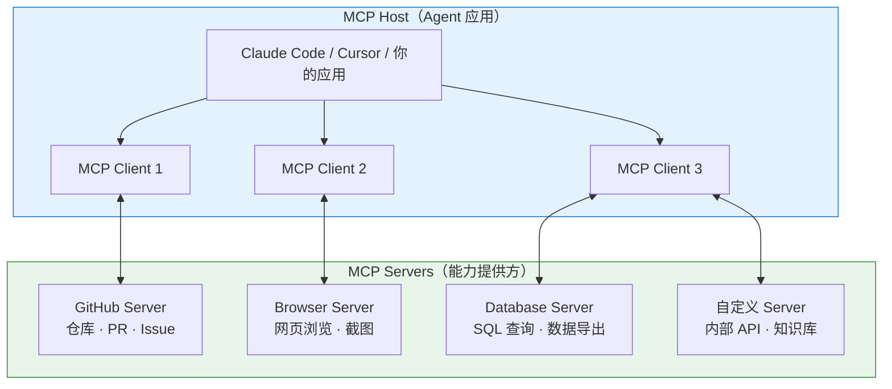
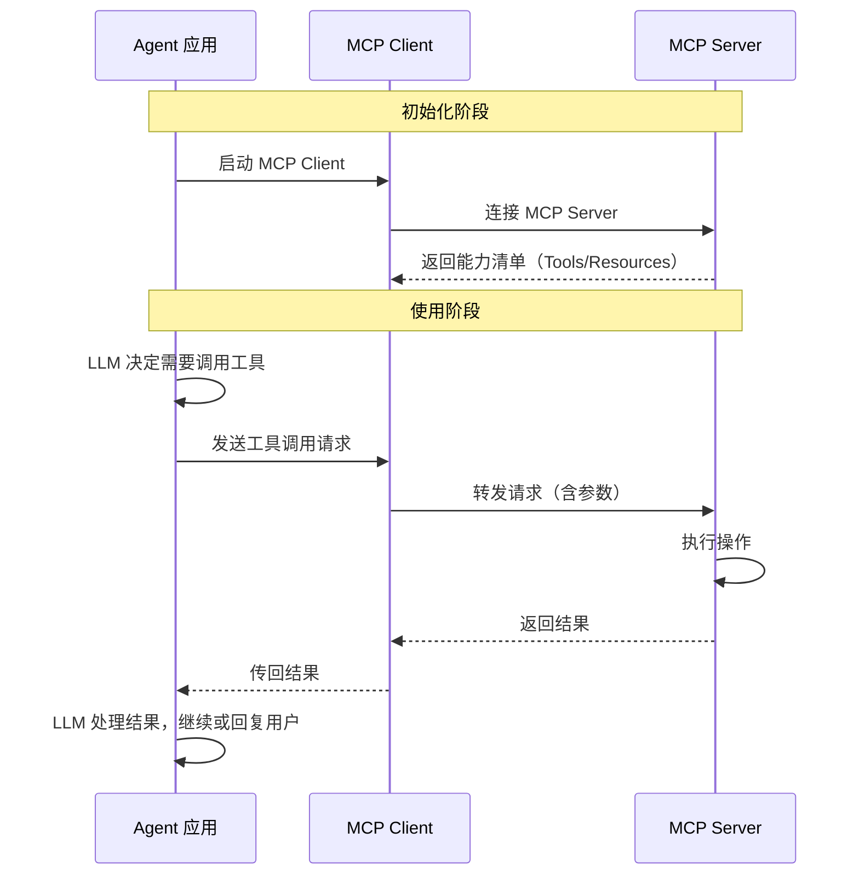
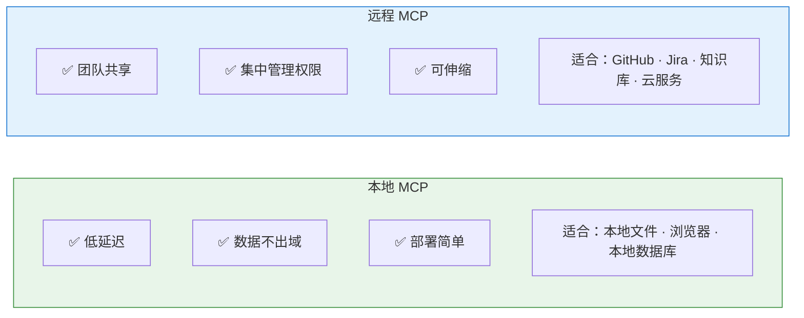
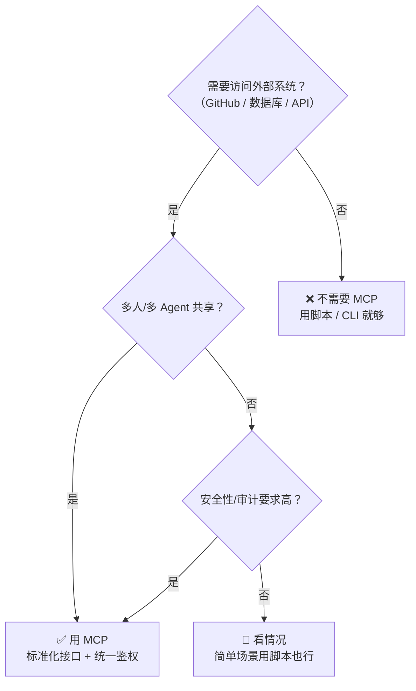

# Chapter 13 · 🔌 MCP

> 目标：把 MCP 放回它最准确的位置。读完这一章，你应该知道 MCP 不是模型，也不是 Skill，而是一层标准化连接协议。

## 目录

- [1. MCP 是什么](#1-mcp-是什么)
- [2. MCP 不是什么](#2-mcp-不是什么)
- [3. MCP 为什么会重要](#3-mcp-为什么会重要)
- [4. 一个最小示例](#4-一个最小示例)
- [5. 什么时候该用 MCP，什么时候先别上](#5-什么时候该用-mcp什么时候先别上)
- [6. 几个最容易混淆的点](#6-几个最容易混淆的点)

## 1. MCP 是什么

MCP 是一层标准化连接协议，用来把外部工具、资源和服务暴露给 Agent。

你可以把它理解成：

> Agent 与外部能力之间的统一接口层。

## 2. MCP 不是什么

MCP 不是：

- 一个模型
- 一个 Skill
- 一个完整 Agent 框架
- 万能银弹

它解决的是“怎么连”，不是“怎么想”。

## 3. MCP 为什么会重要

没有标准化连接时，每接一个 GitHub、数据库、浏览器或本地服务，都得重新做一套私有集成。

MCP 的价值在于：

- 统一描述工具和资源
- 降低不同 Agent 与外部能力之间的接入成本
- 让连接层不再反复造轮子

## 4. 一个最小示例

比如让 Agent 访问 GitHub：

- 没有 MCP：每个产品自己定一套私有接口
- 有了 MCP：GitHub 服务通过统一协议暴露能力，Agent 按同一套路发现并调用

所以理解 MCP 时，最稳的记法是：

> 🔌 **MCP 先解决“接能力”，不直接解决“教方法”。**

一个足够小的 MCP 配置，通常长这样：

```json
{
  "mcpServers": {
    "github": {
      "command": "npx",
      "args": ["-y", "@modelcontextprotocol/server-github"]
    }
  }
}
```

这个配置本身不告诉 Agent“该怎么 review PR”，它只是在说：

- 这里有一个叫 `github` 的能力入口
- 它会暴露一组工具和资源
- Agent 之后可以按协议发现并调用它

## 5. 什么时候该用 MCP，什么时候先别上

最实用的判断通常不是“能不能做成 MCP”，而是“值不值得先做成 MCP”。

适合优先上 MCP 的场景：

- 需要稳定连接外部系统
- 需要统一鉴权和权限边界
- 多个 Agent 或多人要共享同一能力
- 你不想为每个产品各做一套私有接法

不一定要先上 MCP 的场景：

- 本地 CLI 或脚本已经很好用
- 能力只在一个小范围场景使用
- 你现在更缺方法论，而不是连接协议

一句话判断：

> ⚖️ **先问“现有 CLI / API 能不能直接解决”，再问“要不要把它标准化成 MCP”。**

## 6. 几个最容易混淆的点

**Q：MCP 是不是比 Function Calling 更高级？**  
不该这么理解。Function Calling 更像模型表达“我要调工具”的接口层；MCP 更像把外部能力标准化暴露出来的连接层。

**Q：有了 MCP，是不是就不需要 Skill 了？**  
也不是。MCP 解决“能访问什么”，Skill 解决“怎么更稳地使用这些能力”。

**Q：是不是外部能力都应该优先做成 MCP？**  
不一定。很多本地脚本、CLI 和简单 API，用更轻的接法反而更直接、更省上下文、更容易调试。

## 📌 本章总结

- MCP 是标准化连接层，不是模型、也不是方法论本身。
- 它最值钱的地方在统一接入、统一描述和统一治理外部能力。
- 真正该不该上 MCP，取决于共享需求、治理需求和现有 CLI / API 的成熟度。
- `MCP 解决接能力，Skill 解决教方法`，这条边界最好一直记着。

## 📚 继续阅读

- 想继续看“怎么教 Agent 稳定做事”：继续看 [Ch14 · Skill](./ch14-skill.md)
- 想把连接层放回总图理解：回到 [Ch12 · Tools](./ch12-tools.md)

---

<div align="center">

[📚 返回目录](../../README.md#tutorial-contents) | [⬅️ 上一章：Ch12 Tools](./ch12-tools.md) | [➡️ 下一章：Ch14 Skill](./ch14-skill.md)

</div>

---

<details>
<summary><span style="color: #e67e22; font-weight: bold;">🔌 进阶：MCP 架构、工作流与选型决策树</span></summary>

### MCP 架构



### MCP 工作流详解



### 本地 MCP vs 远程 MCP



### 什么时候需要 MCP（决策树）



### MCP 提供的三种能力

| 能力类型 | 说明 | 示例 |
|---------|------|------|
| **Tools（工具）** | Agent 可以调用的操作 | 创建 PR、执行 SQL、发送消息 |
| **Resources（资源）** | Agent 可以读取的数据 | 文件内容、数据库记录、API 响应 |
| **Prompts（提示模板）** | 预定义的交互模板 | 代码审查模板、Bug 报告模板 |

</details>
